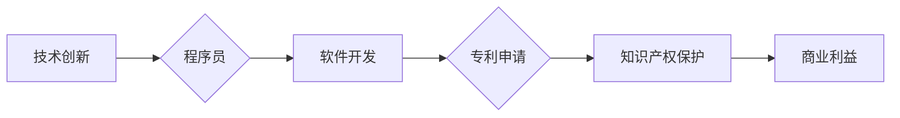

                 

## 技术创新与专利申请：程序员指南

> 关键词：技术创新、专利申请、程序员、软件开发、知识产权、发明、创新流程

### 1. 背景介绍

在当今科技日新月异的时代，软件开发已经成为推动社会进步的引擎之一。程序员作为软件开发的基石，不断创造出新的技术和解决方案，推动着科技的进步。然而，在激烈的市场竞争中，如何保护自己的技术成果，使其得到合理的回报，成为了程序员们面临的重要课题。

专利申请作为一种重要的知识产权保护方式，为程序员提供了有效手段，可以帮助他们保护自己的技术创新，获得商业利益。然而，对于程序员来说，专利申请是一个相对陌生的领域，他们可能缺乏相关的知识和经验。因此，本文旨在为程序员提供一份关于技术创新与专利申请的指南，帮助他们更好地理解专利申请流程，掌握相关知识，并最终成功申请专利。

### 2. 核心概念与联系

#### 2.1  技术创新

技术创新是指在现有技术基础上，通过创造性思维和实践，开发出新的技术、产品或服务，并使其具有实用价值和市场竞争力。技术创新是推动社会进步和经济发展的关键动力，也是程序员们不断追求的目标。

#### 2.2  专利申请

专利申请是一种知识产权保护方式，是指申请人向专利局提交专利申请，申请保护其发明创造的权利。专利申请的目的是为了鼓励技术创新，保护发明人的权益，促进科技进步和经济发展。

#### 2.3  程序员与专利申请

程序员作为软件开发的创造者，他们开发的软件代码、算法、数据结构等都可能具有创新性，可以申请专利保护。通过专利申请，程序员可以保护自己的技术成果，获得商业利益，并提升自身的社会影响力。

**核心概念与联系流程图**

### 3. 核心算法原理 & 具体操作步骤

#### 3.1  算法原理概述

算法是一种解决特定问题的步骤或规则集合。在软件开发中，算法是程序的核心，它决定了程序的逻辑和执行流程。程序员需要掌握各种算法原理，才能编写出高效、可靠的软件。

#### 3.2  算法步骤详解

算法的步骤详解通常包括以下几个方面：

* **输入：** 算法需要接收一些数据作为输入。
* **处理：** 算法对输入数据进行一系列操作，例如计算、比较、排序等。
* **输出：** 算法最终生成一些结果作为输出。

#### 3.3  算法优缺点

不同的算法具有不同的优缺点，程序员需要根据具体问题选择合适的算法。

* **时间复杂度：** 算法执行的时间与输入数据量之间的关系。
* **空间复杂度：** 算法执行过程中使用的内存空间。
* **易读性：** 算法的代码是否易于理解和维护。

#### 3.4  算法应用领域

算法广泛应用于各个领域，例如：

* **搜索引擎：** 使用算法对海量数据进行排序和检索。
* **图像识别：** 使用算法识别图像中的物体和场景。
* **机器学习：** 使用算法从数据中学习模式和规律。

### 4. 数学模型和公式 & 详细讲解 & 举例说明

#### 4.1  数学模型构建

数学模型是利用数学语言和符号来描述客观现象或问题的一种工具。在算法设计和分析中，数学模型可以帮助程序员更清晰地理解算法的原理和性能。

#### 4.2  公式推导过程

公式推导过程是指利用数学逻辑和法则，从已知条件出发，推导出算法的性能指标或其他相关信息。

#### 4.3  案例分析与讲解

例如，在分析算法的时间复杂度时，可以使用大 O 记法来描述算法执行时间随输入数据量变化的趋势。

$$T(n) = O(n^2)$$

这个公式表示算法的时间复杂度为 n^2，即当输入数据量 n 增加时，算法执行时间会呈平方增长。

### 5. 项目实践：代码实例和详细解释说明

#### 5.1  开发环境搭建

程序员需要选择合适的开发环境，例如：

* **操作系统：** Windows、macOS、Linux 等。
* **编程语言：** Java、Python、C++ 等。
* **开发工具：** IDE、文本编辑器等。

#### 5.2  源代码详细实现

程序员需要根据算法原理编写源代码，实现算法的功能。

#### 5.3  代码解读与分析

程序员需要对编写好的代码进行解读和分析，确保代码的正确性和效率。

#### 5.4  运行结果展示

程序员需要运行代码，并观察运行结果，验证算法的正确性和性能。

### 6. 实际应用场景

#### 6.1  搜索引擎优化

算法可以用于分析网站内容和用户搜索行为，优化网站排名和搜索结果。

#### 6.2  推荐系统

算法可以根据用户的历史行为和偏好，推荐相关的商品、服务或内容。

#### 6.3  数据分析

算法可以用于分析海量数据，发现隐藏的模式和趋势。

#### 6.4  未来应用展望

随着人工智能和机器学习技术的不断发展，算法将在更多领域得到应用，例如：

* **自动驾驶：** 使用算法控制车辆行驶，实现自动驾驶功能。
* **医疗诊断：** 使用算法分析医学影像，辅助医生进行诊断。
* **个性化教育：** 使用算法根据学生的学习情况，提供个性化的学习方案。

### 7. 工具和资源推荐

#### 7.1  学习资源推荐

* **书籍：** 《算法导论》、《数据结构与算法分析》等。
* **在线课程：** Coursera、edX 等平台提供算法相关的在线课程。
* **编程社区：** Stack Overflow、GitHub 等平台可以获取算法相关的知识和经验。

#### 7.2  开发工具推荐

* **IDE：** Eclipse、IntelliJ IDEA 等。
* **文本编辑器：** Sublime Text、VS Code 等。
* **版本控制系统：** Git 等。

#### 7.3  相关论文推荐

* **ACM Transactions on Algorithms**
* **Journal of the ACM**
* **IEEE Transactions on Pattern Analysis and Machine Intelligence**

### 8. 总结：未来发展趋势与挑战

#### 8.1  研究成果总结

技术创新与专利申请对于程序员来说至关重要，它可以帮助他们保护自己的技术成果，获得商业利益，并推动科技进步。

#### 8.2  未来发展趋势

未来，算法将更加智能化、自动化，并应用于更多领域。程序员需要不断学习新的算法和技术，才能适应未来的发展趋势。

#### 8.3  面临的挑战

程序员在进行技术创新和专利申请时，面临着以下挑战：

* **知识产权保护：** 如何有效地保护自己的技术成果，防止知识产权侵权。
* **专利申请流程：** 专利申请流程复杂，程序员需要掌握相关的知识和经验。
* **技术竞争：** 科技发展日新月异，程序员需要不断学习和创新，才能保持竞争力。

#### 8.4  研究展望

未来，研究者将继续探索新的算法和技术，并开发更有效的知识产权保护机制，为程序员提供更好的支持。

### 9. 附录：常见问题与解答

#### 9.1  如何判断自己的技术成果是否具有专利申请价值？

#### 9.2  专利申请流程是什么？

#### 9.3  如何撰写有效的专利申请文件？

#### 9.4  专利申请需要花费多少时间和费用？

#### 9.5  专利申请成功后，如何维护和利用自己的专利权？

作者：禅与计算机程序设计艺术 / Zen and the Art of Computer Programming 
<end_of_turn>

