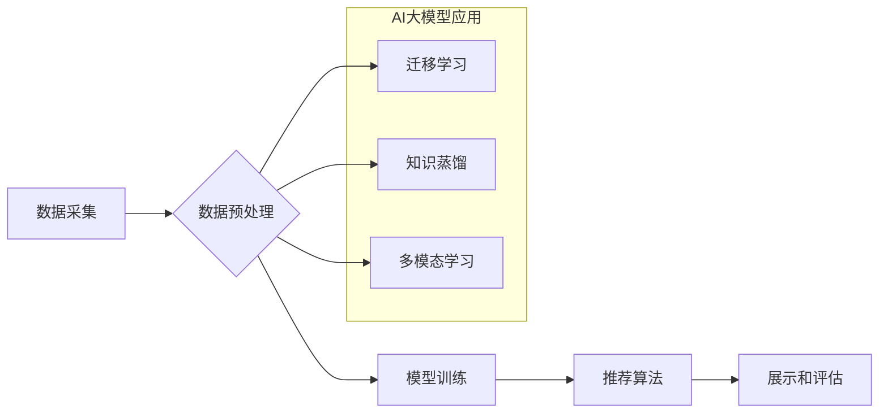

                 

## 推荐系统中的冷启动问题：AI大模型解决方案

> 关键词：推荐系统、冷启动问题、AI大模型、迁移学习、知识蒸馏、多模态学习、个性化推荐

## 1. 背景介绍

推荐系统作为互联网时代的重要技术支柱，在电商、社交媒体、视频平台等领域发挥着至关重要的作用。其核心目标是根据用户的历史行为、偏好和上下文信息，预测用户对特定物品的兴趣，并提供个性化的推荐结果。然而，推荐系统面临着诸多挑战，其中之一便是“冷启动问题”。

冷启动问题是指推荐系统在面对新用户或新物品时，由于缺乏历史数据，难以准确预测用户兴趣和物品属性，从而导致推荐结果不精准，甚至无法提供任何推荐。这对于新用户和新物品的引入和推广具有极大的阻碍作用。

传统推荐系统主要依赖于基于内容的过滤、协同过滤等方法，这些方法都依赖于大量的历史数据进行训练和预测。因此，面对冷启动问题，传统方法往往表现力不足，难以有效解决。

近年来，随着人工智能技术的飞速发展，特别是深度学习的兴起，AI大模型为解决推荐系统中的冷启动问题提供了新的思路和解决方案。

## 2. 核心概念与联系

**2.1  推荐系统架构**

推荐系统通常由以下几个主要模块组成：

* **数据采集模块:** 收集用户行为数据、物品属性数据等。
* **数据预处理模块:** 对收集到的数据进行清洗、转换、特征提取等处理。
* **模型训练模块:** 利用机器学习算法训练推荐模型。
* **推荐算法模块:** 根据用户特征和物品特征，预测用户对物品的兴趣，并生成推荐结果。
* **展示和评估模块:** 将推荐结果展示给用户，并收集用户反馈数据进行模型评估。

**2.2  AI大模型在推荐系统中的应用**

AI大模型，例如Transformer、BERT等，具有强大的语义理解和知识表示能力，可以有效解决传统推荐系统面临的冷启动问题。

**2.3  AI大模型解决方案架构**

AI大模型在推荐系统中的应用主要包括以下几种方式：

* **迁移学习:** 利用预训练的AI大模型，在新的推荐任务上进行微调，减少对新数据的依赖。
* **知识蒸馏:** 将大型模型的知识“蒸馏”到小型模型中，提高小型模型的性能，同时降低模型的计算成本。
* **多模态学习:** 将文本、图像、音频等多种模态数据融合在一起，构建更全面的用户和物品表示，提高推荐的准确性和个性化程度。

**Mermaid 流程图**



## 3. 核心算法原理 & 具体操作步骤

### 3.1  算法原理概述

迁移学习是一种机器学习范式，它利用预训练模型在源任务上的知识，迁移到目标任务中进行训练。在推荐系统中，预训练模型通常是在海量文本数据上训练的语言模型，例如BERT、GPT等。这些模型已经学习了丰富的语义知识和文本表示能力，可以有效解决新用户和新物品的冷启动问题。

### 3.2  算法步骤详解

1. **选择预训练模型:** 根据推荐任务的特点选择合适的预训练模型，例如BERT、RoBERTa、XLNet等。
2. **提取特征:** 将用户行为数据、物品属性数据等转换为文本格式，并使用预训练模型提取特征向量。
3. **微调模型:** 将预训练模型的最后一层替换为新的输出层，并使用目标任务的数据进行微调训练。
4. **生成推荐结果:** 利用微调后的模型，预测用户对物品的兴趣，并生成推荐结果。

### 3.3  算法优缺点

**优点:**

* 能够有效解决冷启动问题，减少对新数据依赖。
* 利用预训练模型的知识，提高模型性能。
* 训练速度更快，所需数据量更少。

**缺点:**

* 预训练模型的规模较大，部署成本较高。
* 需要对预训练模型进行微调，需要一定的专业知识和经验。

### 3.4  算法应用领域

迁移学习在推荐系统中的应用领域非常广泛，例如：

* 新用户推荐
* 新物品推荐
* 个性化推荐
* 内容推荐
* 社交推荐

## 4. 数学模型和公式 & 详细讲解 & 举例说明

### 4.1  数学模型构建

迁移学习的数学模型通常基于深度学习框架，例如TensorFlow、PyTorch等。模型结构通常包括以下几个部分：

* **编码器:** 用于提取用户和物品的特征向量。
* **注意力机制:** 用于学习用户和物品之间的关系。
* **解码器:** 用于预测用户对物品的兴趣。

### 4.2  公式推导过程

迁移学习的训练目标通常是最大化预测准确率，可以使用交叉熵损失函数进行优化。

$$
Loss = -\sum_{i=1}^{N} y_i \log(p_i)
$$

其中：

* $N$ 是样本数量
* $y_i$ 是真实标签
* $p_i$ 是模型预测的概率

### 4.3  案例分析与讲解

假设我们有一个电商平台，想要推荐商品给用户。我们可以使用BERT模型进行迁移学习，将预训练模型微调到商品推荐任务上。

1. **数据准备:** 收集用户购买历史、商品属性等数据。
2. **特征提取:** 使用BERT模型提取用户和商品的文本特征向量。
3. **模型微调:** 将BERT模型的最后一层替换为新的输出层，并使用交叉熵损失函数进行微调训练。
4. **推荐结果:** 利用微调后的模型，预测用户对商品的兴趣，并生成推荐结果。

## 5. 项目实践：代码实例和详细解释说明

### 5.1  开发环境搭建

* Python 3.7+
* TensorFlow 2.0+
* PyTorch 1.0+
* CUDA 10.0+

### 5.2  源代码详细实现

```python
import tensorflow as tf
from tensorflow.keras.layers import Embedding, Dense, Dropout
from tensorflow.keras.models import Sequential

# 定义用户和商品 embedding 维度
user_embedding_dim = 64
item_embedding_dim = 64

# 创建用户 embedding 层
user_embedding = Embedding(input_dim=num_users, output_dim=user_embedding_dim)

# 创建商品 embedding 层
item_embedding = Embedding(input_dim=num_items, output_dim=item_embedding_dim)

# 创建模型
model = Sequential()
model.add(user_embedding)
model.add(item_embedding)
model.add(Dense(128, activation='relu'))
model.add(Dropout(0.5))
model.add(Dense(1, activation='sigmoid'))

# 编译模型
model.compile(optimizer='adam', loss='binary_crossentropy', metrics=['accuracy'])

# 训练模型
model.fit(x_train, y_train, epochs=10)

# 生成推荐结果
predictions = model.predict(user_ids, item_ids)
```

### 5.3  代码解读与分析

* 代码首先定义了用户和商品 embedding 维度。
* 然后创建了用户和商品 embedding 层，并将它们添加到模型中。
* 模型的输出层是一个单神经元，使用 sigmoid 激活函数，输出用户对商品的兴趣概率。
* 模型使用 Adam 优化器，交叉熵损失函数和准确率作为评估指标进行训练。
* 训练完成后，可以使用模型预测用户对商品的兴趣概率，并生成推荐结果。

### 5.4  运行结果展示

运行结果展示可以包括以下内容：

* 模型的训练曲线，例如损失函数和准确率的变化趋势。
* 推荐结果的准确率和召回率等指标。
* 推荐结果的示例，例如推荐给用户的商品列表。

## 6. 实际应用场景

### 6.1  新用户推荐

对于新用户，由于缺乏历史数据，传统推荐系统难以提供准确的推荐。迁移学习可以利用预训练模型的知识，即使没有历史数据也能对新用户进行个性化推荐。

### 6.2  新物品推荐

对于新物品，由于缺乏用户反馈数据，传统推荐系统难以评估其受欢迎程度。迁移学习可以利用预训练模型对新物品进行语义分析，并根据其属性预测其潜在的受欢迎程度。

### 6.3  个性化推荐

迁移学习可以学习用户的个性化偏好，并根据用户的兴趣和历史行为生成更精准的推荐结果。

### 6.4  未来应用展望

随着AI大模型技术的不断发展，迁移学习在推荐系统中的应用将更加广泛和深入。未来，我们可以期待看到以下应用场景：

* 多模态迁移学习: 将文本、图像、音频等多种模态数据融合在一起，构建更全面的用户和物品表示，提高推荐的准确性和个性化程度。
* 联邦迁移学习: 在保护用户隐私的前提下，利用多个用户的局部数据进行迁移学习，构建更强大的推荐模型。
* 动态迁移学习: 根据用户的行为变化和物品更新情况，动态调整迁移学习模型，保持推荐结果的时效性和准确性。

## 7. 工具和资源推荐

### 7.1  学习资源推荐

* **书籍:**
    * Deep Learning by Ian Goodfellow, Yoshua Bengio, and Aaron Courville
    * Natural Language Processing with Python by Steven Bird, Ewan Klein, and Edward Loper
* **在线课程:**
    * Stanford CS224N: Natural Language Processing with Deep Learning
    * Coursera: Deep Learning Specialization
* **博客和网站:**
    * TensorFlow Blog: https://blog.tensorflow.org/
    * PyTorch Blog: https://pytorch.org/blog/

### 7.2  开发工具推荐

* **TensorFlow:** https://www.tensorflow.org/
* **PyTorch:** https://pytorch.org/
* **Hugging Face Transformers:** https://huggingface.co/transformers/

### 7.3  相关论文推荐

* **BERT: Pre-training of Deep Bidirectional Transformers for Language Understanding**
* **XLNet: Generalized Autoregressive Pretraining for Language Understanding**
* **Knowledge Distillation**

## 8. 总结：未来发展趋势与挑战

### 8.1  研究成果总结

AI大模型为解决推荐系统中的冷启动问题提供了新的思路和解决方案。迁移学习、知识蒸馏和多模态学习等技术能够有效利用预训练模型的知识，提高推荐系统的性能和准确性。

### 8.2  未来发展趋势

未来，AI大模型在推荐系统中的应用将更加广泛和深入。

* **模型规模和能力的提升:** 随着计算资源的不断发展，AI大模型的规模和能力将不断提升，能够学习更复杂的知识和模式。
* **个性化推荐的增强:** AI大模型能够更好地理解用户的个性化偏好，并提供更精准的推荐结果。
* **跨域迁移学习:** AI大模型能够将知识迁移到不同的领域，例如从电商推荐迁移到医疗推荐。

### 8.3  面临的挑战

* **数据隐私和安全:** AI大模型的训练需要大量用户数据，如何保护用户隐私和数据安全是一个重要的挑战。
* **模型解释性和可解释性:** AI大模型的决策过程往往是复杂的，如何提高模型的解释性和可解释性是一个重要的研究方向。
* **模型部署和效率:** AI大模型的规模较大，部署和运行成本较高，如何提高模型的部署效率和运行效率是一个重要的挑战。

### 8.4  研究展望

未来，我们需要继续探索AI大模型在推荐系统中的应用，解决上述挑战，并推动推荐系统的进一步发展。


## 9. 附录：常见问题与解答

**Q1: 迁移学习的优势是什么？**

A1: 迁移学习的优势在于能够利用预训练模型的知识，减少对新数据的依赖，提高模型性能，并加速模型训练速度。

**Q2: 迁移学习有哪些应用场景？**

A2: 迁移学习在推荐系统中的应用场景非常广泛，例如新用户推荐、新物品推荐、个性化推荐等。

**Q3: 如何选择合适的预训练模型？**

A3: 选择预训练模型需要根据具体的推荐任务和数据特点进行选择。例如，对于文本数据，可以使用BERT、RoBERTa等语言模型；对于图像数据，可以使用ResNet、VGG等图像识别模型。

**Q4: 迁移学习的挑战是什么？**

A4: 迁移学习面临的挑战包括数据隐私和安全、模型解释性和可解释性、模型部署和效率等。

**作者：禅与计算机程序设计艺术 / Zen and the Art of Computer Programming**<end_of_turn>

