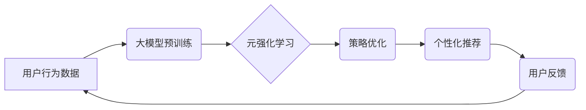

                 

## 推荐系统中的大模型元强化学习应用

> 关键词：推荐系统、大模型、元强化学习、强化学习、用户行为预测、个性化推荐

## 1. 背景介绍

推荐系统作为互联网时代的重要组成部分，旨在根据用户的历史行为、偏好和上下文信息，为用户推荐感兴趣的内容。传统的推荐系统主要依赖于协同过滤、内容过滤等方法，但这些方法在面对冷启动问题、数据稀疏性等挑战时表现不足。近年来，随着深度学习技术的快速发展，大模型在推荐系统领域展现出巨大的潜力。大模型能够学习到更丰富的用户特征和物品语义，从而提升推荐的准确性和个性化程度。

然而，大模型的训练和部署成本高昂，且难以适应不断变化的用户需求。元强化学习 (Meta Reinforcement Learning, MRL) 作为一种新兴的机器学习范式，能够学习通用的策略，并将其应用于不同的任务和环境，为解决大模型在推荐系统中的挑战提供了一种新的思路。

## 2. 核心概念与联系

### 2.1 元强化学习 (MRL)

元强化学习 (MRL) 是一种学习如何学习的强化学习方法。它旨在学习一个通用的策略，能够在面对不同的任务和环境时，快速适应并获得最佳的策略。MRL 的核心思想是将多个具体的强化学习任务看作一个元任务，学习一个元策略，能够根据不同的任务环境，生成最优的具体策略。

### 2.2 大模型在推荐系统中的应用

大模型在推荐系统中主要用于以下几个方面：

* **用户行为预测:** 大模型能够学习到用户的隐含特征和偏好，从而更准确地预测用户的行为，例如点击、购买、评分等。
* **物品表示学习:** 大模型能够学习到物品的语义特征和潜在关系，从而更好地理解物品的本质，并进行更精准的推荐。
* **个性化推荐:** 大模型能够根据用户的个性化需求，生成个性化的推荐列表，提升用户的体验。

### 2.3 MRL 与大模型在推荐系统中的结合

将 MRL 与大模型结合，可以有效解决大模型在推荐系统中的挑战。

* **降低训练成本:** MRL 可以学习一个通用的策略，减少对每个具体任务的单独训练，从而降低训练成本。
* **提高适应性:** MRL 可以使大模型更具适应性，能够快速适应用户需求的变化和新环境的出现。
* **提升推荐效果:** MRL 可以帮助大模型学习到更有效的策略，从而提升推荐的准确性和个性化程度。

**MRL 与大模型在推荐系统中的架构**



## 3. 核心算法原理 & 具体操作步骤

### 3.1 算法原理概述

MRL 在推荐系统中的应用主要基于以下核心算法原理：

* **元策略学习:** 学习一个通用的策略，能够根据不同的任务环境，生成最优的具体策略。
* **策略梯度优化:** 使用策略梯度算法优化元策略，使其能够更好地适应不同的任务环境。
* **环境模拟:** 使用模拟环境来评估不同策略的性能，并根据评估结果更新元策略。

### 3.2 算法步骤详解

1. **数据预处理:** 收集用户行为数据，并进行预处理，例如特征提取、数据清洗等。
2. **大模型预训练:** 使用预训练的大模型，对用户行为数据进行训练，学习到用户的隐含特征和物品的语义特征。
3. **元策略初始化:** 初始化一个元策略，用于生成具体的推荐策略。
4. **环境模拟:** 使用模拟环境来评估不同策略的性能，例如点击率、转化率等。
5. **策略梯度优化:** 使用策略梯度算法优化元策略，使其能够更好地适应不同的任务环境。
6. **策略更新:** 根据策略梯度优化结果，更新具体的推荐策略。
7. **推荐输出:** 使用更新后的策略，为用户生成个性化的推荐列表。
8. **用户反馈收集:** 收集用户的反馈信息，例如点击、购买、评分等，并将其反馈到环境模拟中，用于更新元策略。

### 3.3 算法优缺点

**优点:**

* 能够学习到通用的策略，降低训练成本。
* 能够快速适应用户需求的变化和新环境的出现。
* 能够提升推荐的准确性和个性化程度。

**缺点:**

* 需要大量的训练数据和计算资源。
* 算法的复杂度较高，需要专业的技术人员进行开发和维护。

### 3.4 算法应用领域

MRL 在推荐系统领域的应用前景广阔，可以应用于以下场景：

* **电商推荐:** 为用户推荐个性化的商品。
* **内容推荐:** 为用户推荐个性化的新闻、视频、音乐等内容。
* **社交推荐:** 为用户推荐新的朋友和兴趣小组。
* **广告推荐:** 为用户推荐相关的广告。

## 4. 数学模型和公式 & 详细讲解 & 举例说明

### 4.1 数学模型构建

MRL 的核心数学模型是元策略，它是一个映射函数，将任务环境的特征映射到具体的策略。

假设我们有一个推荐系统，它包含 $N$ 个用户和 $M$ 个物品。每个用户 $u$ 有一个状态向量 $s_u$，表示用户的历史行为和偏好。每个物品 $i$ 有一个特征向量 $f_i$，表示物品的属性和语义信息。

元策略 $\pi$ 可以表示为：

$$\pi(a|s_u, f_i) = \text{softmax}(W_1 s_u + W_2 f_i + b)$$

其中：

* $a$ 是推荐策略，例如推荐物品 $i$。
* $W_1$ 和 $W_2$ 是权重矩阵。
* $b$ 是偏置项。
* $\text{softmax}$ 是一个归一化函数，将输出映射到概率分布。

### 4.2 公式推导过程

元策略的优化目标是最大化推荐系统的奖励函数。奖励函数可以定义为用户的点击率、转化率等指标。

使用策略梯度算法优化元策略，可以得到以下更新公式：

$$\Delta W = \alpha \nabla_{\theta} J(\theta)$$

其中：

* $\Delta W$ 是权重矩阵的更新量。
* $\alpha$ 是学习率。
* $\nabla_{\theta} J(\theta)$ 是奖励函数对权重矩阵的梯度。

### 4.3 案例分析与讲解

假设我们有一个电商推荐系统，目标是提高用户的购买转化率。我们可以使用 MRL 来学习一个通用的推荐策略，并根据用户的历史行为和物品特征进行个性化推荐。

在训练过程中，我们可以使用模拟环境来评估不同策略的性能。例如，我们可以随机生成一些用户和物品的组合，并根据元策略生成推荐列表。然后，我们可以根据用户的反馈信息，例如是否购买了推荐的物品，来计算奖励函数。

通过不断地训练和更新元策略，最终可以学习到一个能够提高购买转化率的推荐策略。

## 5. 项目实践：代码实例和详细解释说明

### 5.1 开发环境搭建

* Python 3.7+
* TensorFlow 2.0+
* PyTorch 1.0+
* CUDA 10.0+ (可选)

### 5.2 源代码详细实现

```python
import tensorflow as tf

# 定义元策略
class MetaPolicy(tf.keras.Model):
    def __init__(self, state_dim, action_dim):
        super(MetaPolicy, self).__init__()
        self.dense1 = tf.keras.layers.Dense(128, activation='relu')
        self.dense2 = tf.keras.layers.Dense(action_dim, activation='softmax')

    def call(self, state, feature):
        x = tf.concat([state, feature], axis=-1)
        x = self.dense1(x)
        return self.dense2(x)

# 定义奖励函数
def reward_function(action, target):
    return tf.reduce_sum(action * target)

# 定义策略梯度优化器
optimizer = tf.keras.optimizers.Adam(learning_rate=0.001)

# 训练循环
for epoch in range(100):
    # 随机生成用户和物品数据
    state = tf.random.normal((100, state_dim))
    feature = tf.random.normal((100, feature_dim))
    target = tf.random.normal((100, action_dim))

    # 使用元策略生成推荐策略
    action = meta_policy(state, feature)

    # 计算奖励
    reward = reward_function(action, target)

    # 计算梯度
    gradients = tf.gradients(reward, meta_policy.trainable_variables)

    # 更新权重
    optimizer.apply_gradients(zip(gradients, meta_policy.trainable_variables))

    # 打印损失
    print(f'Epoch {epoch}: Loss = {tf.reduce_mean(reward)}')
```

### 5.3 代码解读与分析

* **MetaPolicy:** 定义了元策略模型，使用两层全连接神经网络，将用户的状态向量和物品的特征向量作为输入，输出一个概率分布，表示推荐策略。
* **reward_function:** 定义了奖励函数，计算用户点击或购买推荐物品的概率。
* **optimizer:** 定义了优化器，使用 Adam 优化器来更新元策略的权重。
* **训练循环:** 随机生成用户和物品数据，使用元策略生成推荐策略，计算奖励，计算梯度，更新权重，并打印损失。

### 5.4 运行结果展示

训练完成后，可以将训练好的元策略应用于实际的推荐系统中，并根据用户的反馈信息不断更新元策略，从而提高推荐的准确性和个性化程度。

## 6. 实际应用场景

### 6.1 电商推荐

MRL 可以用于个性化商品推荐，例如根据用户的浏览历史、购买记录、购物车内容等信息，推荐用户可能感兴趣的商品。

### 6.2 内容推荐

MRL 可以用于个性化内容推荐，例如根据用户的阅读历史、观看记录、点赞行为等信息，推荐用户可能感兴趣的新闻、视频、音乐等内容。

### 6.3 社交推荐

MRL 可以用于个性化社交推荐，例如根据用户的兴趣爱好、好友关系、社交行为等信息，推荐用户可能感兴趣的新朋友和兴趣小组。

### 6.4 未来应用展望

MRL 在推荐系统领域的应用前景广阔，未来可以应用于更多场景，例如：

* **个性化广告推荐:** 根据用户的兴趣爱好、行为特征等信息，推荐更精准的广告。
* **医疗推荐:** 根据用户的病史、症状、基因信息等信息，推荐合适的医疗方案和药物。
* **教育推荐:** 根据用户的学习进度、知识点掌握情况等信息，推荐合适的学习资源和课程。

## 7. 工具和资源推荐

### 7.1 学习资源推荐

* **书籍:**
    * Reinforcement Learning: An Introduction by Sutton and Barto
    * Deep Reinforcement Learning Hands-On by Maxim Lapan
* **课程:**
    * Deep Reinforcement Learning Specialization by DeepLearning.AI
    * Reinforcement Learning by David Silver (University of DeepMind)
* **博客:**
    * OpenAI Blog
    * DeepMind Blog

### 7.2 开发工具推荐

* **TensorFlow:** https://www.tensorflow.org/
* **PyTorch:** https://pytorch.org/
* **Gym:** https://gym.openai.com/

### 7.3 相关论文推荐

* **Meta-Learning with Differentiable Convex Optimization** by Finn et al. (2017)
* **Model-Agnostic Meta-Learning for Fast Adaptation of Deep Networks** by Vinyals et al. (2017)
* **Prototypical Networks for Few-Shot Learning** by Snell et al. (2017)

## 8. 总结：未来发展趋势与挑战

### 8.1 研究成果总结

MRL 在推荐系统领域的应用取得了显著的成果，能够有效提升推荐的准确性和个性化程度。

### 8.2 未来发展趋势

* **更有效的元策略学习算法:** 研究更有效的元策略学习算法，能够更快地学习到通用的策略，并适应不同的任务环境。
* **更强大的大模型:** 研究更强大的大模型，能够学习到更丰富的用户特征和物品语义信息，从而提升推荐的准确性和个性化程度。
* **多模态推荐:** 将 MRL 应用于多模态推荐，例如结合文本、图像、视频等多种信息进行推荐。

### 8.3 面临的挑战

* **数据稀疏性:** 现实世界中的用户行为数据往往是稀疏的，这使得 MRL 的训练更加困难。
* **计算资源需求:** MRL 的训练需要大量的计算资源，这对于资源有限的团队来说是一个挑战。
* **可解释性:** MRL 的决策过程往往是复杂的，难以解释，这对于用户信任和监管带来了挑战。

### 8.4 研究展望

未来，MRL 在推荐系统领域的应用将更加广泛，并与其他人工智能技术相结合，例如自然语言处理、计算机视觉等，从而构建更智能、更个性化的推荐系统。


## 9. 附录：常见问题与解答

**Q1: MRL 与传统的推荐系统相比有哪些优势？**

**A1:** MRL 能够学习到通用的策略，降低训练成本，并能够快速适应用户需求的变化和新环境的出现，相比传统的推荐系统具有更高的适应性和效率。

**Q2: MRL 的训练需要哪些数据？**

**A2:** MRL 的训练需要用户行为数据，例如用户的点击、购买、评分等行为，以及物品的特征信息，例如物品的类别、价格、描述等。

**Q3: MRL 的应用场景有哪些？**

**A3:** MRL 可以应用于各种推荐场景，例如电商推荐、内容推荐、社交推荐等。

**Q4: MRL 的未来发展趋势是什么？**

**A4:** MRL 的未来发展趋势是更加高效、更加智能、更加个性化。


作者：禅与计算机程序设计艺术 / Zen and the Art of Computer Programming 
<end_of_turn>

