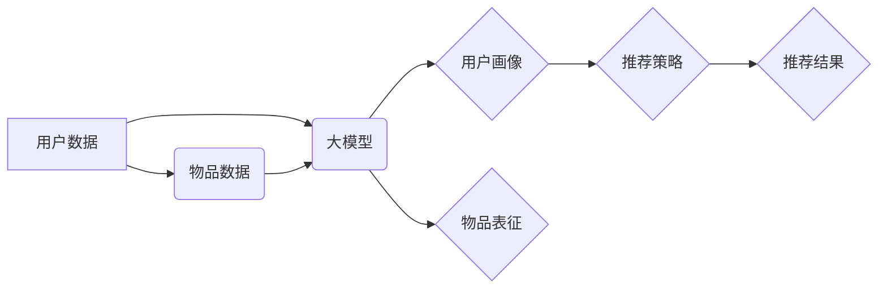

                 

## 推荐系统的统一框架：大模型的优势

> 关键词：推荐系统、大模型、Transformer、多模态、个性化推荐、冷启动问题、知识图谱

## 1. 背景介绍

推荐系统作为互联网时代的重要组成部分，旨在根据用户的历史行为、偏好和上下文信息，预测用户对特定物品的兴趣，并提供个性化的推荐结果。传统的推荐系统主要依赖于协同过滤、内容过滤和基于知识的推荐等方法，但这些方法在面对海量数据、用户多样性和冷启动问题时都存在一定的局限性。

近年来，大模型的兴起为推荐系统带来了新的机遇。大模型，特别是基于Transformer架构的大模型，凭借其强大的语义理解能力、泛化能力和可迁移性，在推荐系统领域展现出巨大的潜力。

## 2. 核心概念与联系

### 2.1 推荐系统概述

推荐系统旨在预测用户对物品的兴趣，并提供个性化的推荐结果。其核心目标是提高用户满意度、促进用户参与度和提升商业效益。

### 2.2 大模型概述

大模型是指参数规模庞大、训练数据海量的人工智能模型。它们通常基于Transformer架构，具有强大的语义理解、文本生成和多任务学习能力。

### 2.3 大模型在推荐系统中的应用

大模型可以应用于推荐系统的各个环节，例如：

* **用户画像构建:** 利用大模型对用户的历史行为、偏好和社交信息进行分析，构建更精准的用户画像。
* **物品表征学习:** 利用大模型对物品的描述、属性和用户评论进行分析，学习更丰富的物品表征。
* **推荐策略优化:** 利用大模型对用户和物品之间的关系进行建模，优化推荐策略，提高推荐效果。

**大模型在推荐系统中的应用架构**



## 3. 核心算法原理 & 具体操作步骤

### 3.1 算法原理概述

大模型在推荐系统中的核心算法主要基于Transformer架构，通过自注意力机制学习用户和物品之间的关系，并生成个性化的推荐结果。

### 3.2 算法步骤详解

1. **数据预处理:** 收集用户行为数据、物品信息和文本数据，并进行清洗、转换和编码。
2. **模型训练:** 利用大模型框架，训练模型参数，使模型能够学习用户和物品之间的关系。
3. **推荐策略:** 根据训练好的模型，设计推荐策略，例如基于用户的协同过滤、基于物品的内容过滤或基于知识的推荐。
4. **推荐结果生成:** 利用推荐策略，对用户进行个性化推荐，并输出推荐结果。

### 3.3 算法优缺点

**优点:**

* **强大的语义理解能力:** Transformer架构能够捕捉用户和物品之间的复杂语义关系。
* **泛化能力强:** 大模型在训练过程中学习到的知识能够迁移到不同的推荐场景。
* **可迁移性高:** 预训练的大模型可以用于不同的推荐任务，降低开发成本和时间。

**缺点:**

* **训练成本高:** 大模型的训练需要大量的计算资源和时间。
* **数据依赖性强:** 大模型的性能依赖于训练数据的质量和规模。
* **解释性差:** 大模型的决策过程较为复杂，难以解释其推荐结果。

### 3.4 算法应用领域

大模型在推荐系统领域具有广泛的应用前景，例如：

* **电商推荐:** 为用户推荐商品、优惠券和促销活动。
* **内容推荐:** 为用户推荐新闻、视频、音乐和书籍。
* **社交推荐:** 为用户推荐好友、群组和活动。
* **个性化教育:** 为学生推荐学习资源和个性化课程。

## 4. 数学模型和公式 & 详细讲解 & 举例说明

### 4.1 数学模型构建

大模型在推荐系统中的数学模型通常基于用户-物品交互矩阵，并利用矩阵分解、神经网络等方法学习用户和物品之间的关系。

**用户-物品交互矩阵:**

一个用户-物品交互矩阵 $R$，其中 $R_{ui}$ 表示用户 $u$ 对物品 $i$ 的交互评分，例如点击、购买或评分。

**矩阵分解模型:**

矩阵分解模型将用户-物品交互矩阵分解成两个低维矩阵，分别表示用户向量和物品向量。

$$R \approx U V^T$$

其中 $U$ 是用户矩阵，$V$ 是物品矩阵。

### 4.2 公式推导过程

矩阵分解模型的目标是最小化用户-物品交互矩阵和分解后的矩阵之间的误差。常用的损失函数是均方误差 (MSE)。

$$Loss = \frac{1}{2} \sum_{u,i} (R_{ui} - \hat{R}_{ui})^2$$

其中 $\hat{R}_{ui}$ 是模型预测的用户 $u$ 对物品 $i$ 的交互评分。

通过梯度下降等优化算法，最小化损失函数，得到用户向量和物品向量。

### 4.3 案例分析与讲解

假设有一个用户-物品交互矩阵，其中用户 $u$ 对物品 $i$ 的交互评分为 5。

通过矩阵分解模型，可以得到用户 $u$ 的向量和物品 $i$ 的向量。

如果用户 $u$ 的向量和物品 $i$ 的向量相似，则模型预测的用户 $u$ 对物品 $i$ 的交互评分较高。

## 5. 项目实践：代码实例和详细解释说明

### 5.1 开发环境搭建

推荐系统开发环境通常包括以下组件:

* **编程语言:** Python 是推荐系统开发中常用的编程语言。
* **深度学习框架:** TensorFlow、PyTorch 等深度学习框架提供丰富的工具和库，用于构建和训练大模型。
* **数据存储:** MySQL、MongoDB 等数据库用于存储用户数据、物品数据和交互记录。
* **计算资源:** GPU 能够加速大模型的训练过程。

### 5.2 源代码详细实现

以下是一个基于 PyTorch 的简单推荐系统代码示例:

```python
import torch
import torch.nn as nn

class Recommender(nn.Module):
    def __init__(self, user_dim, item_dim):
        super(Recommender, self).__init__()
        self.user_embedding = nn.Embedding(num_users, user_dim)
        self.item_embedding = nn.Embedding(num_items, item_dim)

    def forward(self, user_ids, item_ids):
        user_embeddings = self.user_embedding(user_ids)
        item_embeddings = self.item_embedding(item_ids)
        scores = torch.sum(user_embeddings * item_embeddings, dim=1)
        return scores

# ... (数据加载、模型训练、评估等代码)
```

### 5.3 代码解读与分析

该代码示例定义了一个简单的推荐模型，它使用嵌入层将用户和物品映射到低维向量空间，并通过点积计算用户和物品之间的相似度。

### 5.4 运行结果展示

运行该代码示例，可以得到用户对不同物品的推荐评分，并根据评分进行排序，输出推荐结果。

## 6. 实际应用场景

### 6.1 电商推荐

大模型在电商推荐领域具有广泛的应用场景，例如：

* **商品推荐:** 根据用户的历史购买记录、浏览记录和兴趣偏好，推荐相关的商品。
* **优惠券推荐:** 根据用户的消费习惯和优惠活动，推荐个性化的优惠券。
* **促销活动推荐:** 根据用户的兴趣和购买行为，推荐相关的促销活动。

### 6.2 内容推荐

大模型在内容推荐领域可以帮助用户发现感兴趣的内容，例如：

* **新闻推荐:** 根据用户的阅读历史和兴趣偏好，推荐相关的新闻文章。
* **视频推荐:** 根据用户的观看历史和兴趣偏好，推荐相关的视频内容。
* **音乐推荐:** 根据用户的听歌历史和音乐风格偏好，推荐相关的音乐作品。

### 6.3 社交推荐

大模型可以帮助用户发现新的朋友和兴趣群体，例如：

* **好友推荐:** 根据用户的社交关系和兴趣爱好，推荐潜在的好友。
* **群组推荐:** 根据用户的兴趣爱好和社交属性，推荐相关的群组。
* **活动推荐:** 根据用户的兴趣爱好和地理位置，推荐相关的活动。

### 6.4 未来应用展望

大模型在推荐系统领域还有巨大的发展潜力，未来可能应用于以下场景:

* **多模态推荐:** 结合文本、图像、音频等多模态数据，提供更丰富的推荐结果。
* **个性化解释:** 为用户解释推荐结果背后的逻辑，提高用户信任度。
* **跨域推荐:** 将不同领域的知识和数据融合，实现跨域推荐。

## 7. 工具和资源推荐

### 7.1 学习资源推荐

* **书籍:**
    * 《深度学习》
    * 《自然语言处理》
    * 《推荐系统》
* **在线课程:**
    * Coursera: 深度学习
    * Udacity: 自然语言处理
    * fast.ai: 深度学习
* **博客和论坛:**
    * TensorFlow Blog
    * PyTorch Blog
    * Kaggle

### 7.2 开发工具推荐

* **深度学习框架:** TensorFlow、PyTorch
* **数据处理工具:** Pandas、NumPy
* **模型评估工具:** Scikit-learn
* **云计算平台:** AWS、Google Cloud、Azure

### 7.3 相关论文推荐

* **BERT:** Devlin et al. (2018)
* **GPT-3:** Brown et al. (2020)
* **Transformer:** Vaswani et al. (2017)

## 8. 总结：未来发展趋势与挑战

### 8.1 研究成果总结

大模型在推荐系统领域取得了显著的成果，例如：

* **提高推荐准确率:** 大模型能够学习用户和物品之间的复杂关系，提高推荐准确率。
* **个性化推荐:** 大模型能够根据用户的个性化需求，提供更精准的推荐结果。
* **跨域推荐:** 大模型能够将不同领域的知识和数据融合，实现跨域推荐。

### 8.2 未来发展趋势

未来推荐系统的发展趋势包括:

* **多模态推荐:** 结合文本、图像、音频等多模态数据，提供更丰富的推荐结果。
* **个性化解释:** 为用户解释推荐结果背后的逻辑，提高用户信任度。
* **联邦学习:** 利用联邦学习技术，保护用户隐私，同时实现模型的协同训练。

### 8.3 面临的挑战

大模型在推荐系统领域也面临一些挑战:

* **训练成本高:** 大模型的训练需要大量的计算资源和时间。
* **数据依赖性强:** 大模型的性能依赖于训练数据的质量和规模。
* **解释性差:** 大模型的决策过程较为复杂，难以解释其推荐结果。

### 8.4 研究展望

未来研究方向包括:

* **降低训练成本:** 研究更有效的训练方法，降低大模型的训练成本。
* **提高数据利用率:** 研究如何利用少样本学习和迁移学习技术，提高数据利用率。
* **增强模型解释性:** 研究如何提高大模型的解释性，使推荐结果更透明可信。

## 9. 附录：常见问题与解答

### 9.1 什么是冷启动问题？

冷启动问题是指在推荐系统中，对于新用户或新物品，由于缺乏历史数据，难以进行准确的推荐。

### 9.2 如何解决冷启动问题？

一些方法可以用来解决冷启动问题，例如:

* **基于内容的推荐:** 利用新物品的描述信息和用户历史行为进行推荐。
* **基于协同过滤的推荐:** 利用与新用户或新物品相似用户的或物品的历史行为进行推荐。
* **知识图谱推荐:** 利用知识图谱中的关系和信息进行推荐。

### 9.3 大模型的训练需要哪些资源？

大模型的训练需要大量的计算资源和时间，通常需要使用GPU加速训练。

### 9.4 如何评估推荐系统的性能？

常用的推荐系统性能指标包括：

* **准确率:** 推荐结果与真实用户偏好的匹配程度。
* **召回率:** 推荐结果包含真实用户偏好的比例。
* **NDCG:** 归一化折扣累计增益，衡量推荐结果的排序质量。

### 9.5 大模型的未来发展方向是什么？

大模型的未来发展方向包括:

* **多模态推荐:** 结合文本、图像、音频等多模态数据，提供更丰富的推荐结果。
* **个性化解释:** 为用户解释推荐结果背后的逻辑，提高用户信任度。
* **联邦学习:** 利用联邦学习技术，保护用户隐私，同时实现模型的协同训练。


作者：禅与计算机程序设计艺术 / Zen and the Art of Computer Programming 
<end_of_turn>

