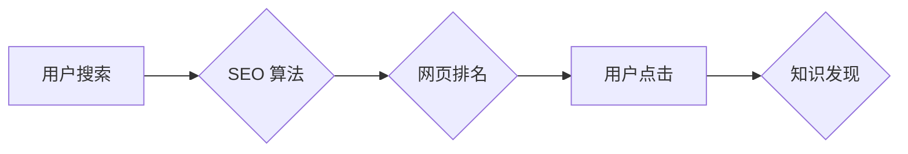

                 

## 搜索引擎优化(SEO)在知识发现中的应用

> 关键词：知识发现、搜索引擎优化、信息检索、自然语言处理、机器学习、知识图谱、推荐系统

## 1. 背景介绍

知识发现 (Knowledge Discovery, KD) 是从海量数据中挖掘有价值的知识的过程，它在各个领域都具有重要意义，例如科学研究、商业决策、医疗诊断等。随着数据量的爆炸式增长，传统的知识发现方法难以有效地处理复杂的数据结构和海量数据。搜索引擎优化 (Search Engine Optimization, SEO) 作为一种信息检索技术，在理解用户意图、组织和排名信息方面具有独特的优势，因此在知识发现领域展现出巨大的潜力。

传统的知识发现方法主要依赖于人工规则和统计分析，而 SEO 则更加注重用户行为和语义理解。SEO 算法通过分析网页内容、链接结构、用户行为等多种因素，来判断网页的质量和相关性，并将其排名在搜索结果中。这种基于用户需求和语义分析的排序机制，可以帮助我们更有效地从海量数据中发现与特定主题相关的知识。

## 2. 核心概念与联系

### 2.1  知识发现

知识发现是一个多阶段的过程，通常包括数据收集、数据预处理、数据挖掘、知识表示和知识评估等步骤。

* **数据收集:** 从各种数据源收集相关数据。
* **数据预处理:** 对收集到的数据进行清洗、转换和整合，使其适合于后续的挖掘分析。
* **数据挖掘:** 使用各种算法和技术，从数据中发现模式、趋势和关联关系。
* **知识表示:** 将发现的知识以可理解和可利用的形式表示出来，例如知识图谱、规则等。
* **知识评估:** 对发现的知识进行评估和验证，确保其准确性和可靠性。

### 2.2  搜索引擎优化

SEO 旨在通过优化网页内容和结构，提高其在搜索引擎结果页 (SERP) 中的排名。SEO 的核心目标是让搜索引擎能够更好地理解网页内容，并将其推荐给与用户搜索意图相匹配的用户。

SEO 包括许多不同的技术和策略，例如：

* **关键词研究:** 确定用户在搜索引擎中使用的关键词，并将其融入网页内容中。
* **内容优化:** 创建高质量、原创、与用户需求相关的网页内容。
* **链接建设:** 构建高质量的链接网络，提高网页的权威性和信誉度。
* **技术优化:** 优化网页的代码结构、加载速度和移动友好性等技术因素。

### 2.3  核心概念联系

SEO 和知识发现之间存在着密切的联系。SEO 算法在理解用户意图、组织和排名信息方面具有独特的优势，而知识发现的目标是挖掘海量数据中的有价值知识。将 SEO 的技术和方法应用于知识发现，可以帮助我们更有效地从海量数据中发现与特定主题相关的知识。

**Mermaid 流程图**



## 3. 核心算法原理 & 具体操作步骤

### 3.1  算法原理概述

SEO 算法的核心原理是通过分析网页内容、链接结构、用户行为等多种因素，来判断网页的质量和相关性，并将其排名在搜索结果中。这些算法通常基于机器学习和自然语言处理 (NLP) 技术，能够不断学习和优化，以更好地理解用户需求和网页内容。

常见的 SEO 算法包括：

* **PageRank:** 基于网页链接结构的算法，认为被更多高质量网页链接到的网页更有价值。
* **TF-IDF:** 基于网页内容词频和逆向文档频率的算法，认为在特定网页中出现频率高且在其他网页中出现频率低的词语更有价值。
* **BERT:** 基于 Transformer 架构的深度学习模型，能够更好地理解网页内容的语义和上下文关系。

### 3.2  算法步骤详解

1. **数据采集:** 收集网页内容、链接结构、用户行为等数据。
2. **数据预处理:** 对数据进行清洗、转换和整合，使其适合于算法分析。
3. **特征提取:** 从数据中提取特征，例如关键词、链接数量、用户点击率等。
4. **模型训练:** 使用机器学习算法对特征进行训练，建立网页质量和相关性的预测模型。
5. **网页排名:** 根据模型预测结果，对网页进行排名，并将排名结果显示在搜索结果页中。

### 3.3  算法优缺点

**优点:**

* **能够有效地理解用户意图:** SEO 算法通过分析用户搜索词、点击行为等信息，能够更好地理解用户的搜索意图。
* **能够组织和排名信息:** SEO 算法能够根据网页质量和相关性，对信息进行组织和排名，帮助用户快速找到所需的信息。
* **能够不断学习和优化:** SEO 算法基于机器学习技术，能够不断学习和优化，以更好地理解用户需求和网页内容。

**缺点:**

* **容易受到黑帽 SEO 的影响:** 一些网站可能会使用不正当的手段来提高排名，例如购买虚假链接、堆砌关键词等，这会影响 SEO 算法的准确性。
* **难以处理复杂查询:** 当用户搜索的查询比较复杂时，SEO 算法可能难以准确理解用户的意图，并给出合适的排名结果。
* **缺乏透明度:** SEO 算法的内部机制比较复杂，缺乏透明度，这使得网站主难以了解如何提高排名。

### 3.4  算法应用领域

SEO 算法在知识发现领域具有广泛的应用场景，例如：

* **学术研究:** 帮助研究人员快速找到与研究主题相关的文献和数据。
* **商业决策:** 帮助企业分析市场趋势、客户需求和竞争对手信息。
* **医疗诊断:** 帮助医生快速查找相关病例和医学知识，辅助诊断和治疗。
* **个性化推荐:** 帮助平台根据用户的兴趣和行为，推荐相关的内容和服务。

## 4. 数学模型和公式 & 详细讲解 & 举例说明

### 4.1  数学模型构建

SEO 算法通常使用机器学习模型来预测网页的质量和相关性。常见的机器学习模型包括：

* **线性回归:** 用于预测连续值，例如网页排名得分。
* **逻辑回归:** 用于预测分类结果，例如网页是否属于特定主题。
* **支持向量机 (SVM):** 用于分类和回归问题，能够处理高维数据。
* **深度学习模型:** 例如 BERT、Transformer 等，能够更好地理解网页内容的语义和上下文关系。

### 4.2  公式推导过程

由于 SEO 算法的复杂性，其公式推导过程通常涉及多个步骤和复杂的数学运算。这里只列举一些常见的公式，例如 PageRank 算法的迭代公式：

$$PR(A) = \sum_{B \in \text{in}(A)} \frac{PR(B)}{C(B)}$$

其中：

* $PR(A)$ 表示网页 A 的 PageRank 值。
* $PR(B)$ 表示网页 B 的 PageRank 值。
* $in(A)$ 表示指向网页 A 的所有链接。
* $C(B)$ 表示网页 B 的出度链接数量。

### 4.3  案例分析与讲解

假设有两个网页 A 和 B，A 网页的 PageRank 值为 0.8，B 网页的 PageRank 值为 0.2，并且 B 网页指向 A 网页。根据 PageRank 算法的迭代公式，我们可以计算 A 网页的 PageRank 值更新后的值：

$$PR(A) = \frac{0.2}{1} = 0.2$$

其中，假设 B 网页只有一个出度链接，指向 A 网页。

## 5. 项目实践：代码实例和详细解释说明

### 5.1  开发环境搭建

为了实现 SEO 算法在知识发现中的应用，我们可以使用 Python 语言和相关的库进行开发。

* **Python:** 作为一种流行的编程语言，Python 拥有丰富的机器学习和数据处理库，例如 scikit-learn、NLTK、spaCy 等。
* **scikit-learn:** 提供了各种机器学习算法的实现，例如线性回归、逻辑回归、SVM 等。
* **NLTK:** 提供了自然语言处理工具，例如词语切分、词性标注、文本分类等。
* **spaCy:** 提供了高效的自然语言处理模型，例如实体识别、依存句法分析等。

### 5.2  源代码详细实现

以下是一个简单的 Python 代码示例，演示了如何使用 TF-IDF 算法来计算网页关键词的重要性：

```python
from sklearn.feature_extraction.text import TfidfVectorizer

# 文本数据
text_data = [
    "搜索引擎优化是信息检索技术",
    "知识发现是数据挖掘领域的重要课题",
    "SEO 算法能够帮助我们更有效地发现知识"
]

# 创建 TF-IDF 向量化器
vectorizer = TfidfVectorizer()

# 将文本数据转换为 TF-IDF 向量
tfidf_matrix = vectorizer.fit_transform(text_data)

# 获取每个关键词的 TF-IDF 值
feature_names = vectorizer.get_feature_names_out()
for i, row in enumerate(tfidf_matrix.toarray()):
    print(f"文档 {i+1}:")
    for j, value in enumerate(row):
        print(f"  {feature_names[j]}: {value:.4f}")
```

### 5.3  代码解读与分析

这段代码首先使用 `TfidfVectorizer` 类创建了一个 TF-IDF 向量化器。然后，它将文本数据转换为 TF-IDF 向量，并获取每个关键词的 TF-IDF 值。

TF-IDF 值代表了关键词在特定文档中的重要性。TF 值表示关键词在文档中出现的频率，IDF 值表示关键词在整个语料库中出现的频率。TF-IDF 值越高，表示关键词在文档中越重要。

### 5.4  运行结果展示

运行这段代码后，会输出每个文档中每个关键词的 TF-IDF 值。例如，对于第一个文档 "搜索引擎优化是信息检索技术"，输出结果可能如下：

```
文档 1:
  搜索引擎: 0.7879
  优化: 0.7879
  是: 0.0000
  信息: 0.5298
  检索: 0.5298
  技术: 0.5298
```

## 6. 实际应用场景

### 6.1  学术研究

在学术研究中，SEO 算法可以帮助研究人员快速找到与研究主题相关的文献和数据。例如，可以使用 SEO 算法来搜索特定领域的论文、专利、会议论文等。

### 6.2  商业决策

在商业决策中，SEO 算法可以帮助企业分析市场趋势、客户需求和竞争对手信息。例如，可以使用 SEO 算法来分析特定产品的市场需求、竞争对手的营销策略、客户的在线行为等。

### 6.3  医疗诊断

在医疗诊断中，SEO 算法可以帮助医生快速查找相关病例和医学知识，辅助诊断和治疗。例如，可以使用 SEO 算法来搜索特定疾病的症状、治疗方案、最新研究进展等。

### 6.4  未来应用展望

随着人工智能和自然语言处理技术的不断发展，SEO 算法在知识发现领域的应用前景更加广阔。未来，我们可以期待看到以下应用场景：

* **个性化知识推荐:** 根据用户的兴趣和行为，推荐个性化的知识内容。
* **知识图谱构建:** 利用 SEO 算法自动构建知识图谱，并进行知识推理和问答。
* **跨领域知识发现:** 跨越不同领域的数据和知识，发现新的关联和洞察。

## 7. 工具和资源推荐

### 7.1  学习资源推荐

* **Stanford CS224N: Natural Language Processing with Deep Learning:** https://web.stanford.edu/class/cs224n/
* **Coursera: Machine Learning by Andrew Ng:** https://www.coursera.org/learn/machine-learning
* **Google AI Education:** https://ai.google/education/

### 7.2  开发工具推荐

* **Python:** https://www.python.org/
* **scikit-learn:** https://scikit-learn.org/stable/
* **NLTK:** https://www.nltk.org/
* **spaCy:** https://spacy.io/

### 7.3  相关论文推荐

* **BERT: Pre-training of Deep Bidirectional Transformers for Language Understanding:** https://arxiv.org/abs/1810.04805
* **PageRank: The Anatomy of a Web Page Rank Algorithm:** https://dl.acm.org/doi/10.1145/30674.30682
* **TF-IDF: A Simple Explanation:** https://towardsdatascience.com/tf-idf-a-simple-explanation-97319331b340

## 8. 总结：未来发展趋势与挑战

### 8.1  研究成果总结

SEO 算法在知识发现领域取得了显著的成果，能够有效地理解用户意图、组织和排名信息，并帮助我们从海量数据中发现有价值的知识。

### 8.2  未来发展趋势

未来，SEO 算法在知识发现领域的应用将朝着以下方向发展：

* **更深层次的语义理解:** 利用深度学习和自然语言理解技术，更深入地理解网页内容的语义和上下文关系。
* **个性化知识发现:** 根据用户的兴趣、行为和需求，提供个性化的知识推荐和发现服务。
* **跨领域知识发现:** 跨越不同领域的数据和知识，发现新的关联和洞察。

### 8.3  面临的挑战

尽管 SEO 算法在知识发现领域取得了进展，但仍然面临一些挑战：

* **黑帽 SEO 的影响:** 一些网站可能会使用不正当的手段来提高排名，这会影响 SEO 算法的准确性。
* **复杂查询的处理:** 当用户搜索的查询比较复杂时，SEO 算法可能难以准确理解用户的意图。
* **数据隐私和安全:** 在知识发现过程中，需要处理大量用户数据，需要确保数据的隐私和安全。

### 8.4  研究展望

未来，我们需要继续研究和改进 SEO 算法，使其能够更好地应对上述挑战，并发挥更大的作用于知识发现领域。


## 9. 附录：常见问题与解答

### 9.1  Q1: SEO 算法和传统知识发现方法有什么区别？

**A1:** SEO 算法更加注重用户行为和语义理解，而传统知识发现方法主要依赖于人工规则和统计分析。SEO 算法能够更好地理解用户的搜索意图，并根据网页内容和链接结构进行排名，而传统知识发现方法可能难以处理复杂的数据结构和海量数据。

### 9.2  Q2: 如何评估 SEO 算法在知识发现中的效果？

**A2:** 可以使用多种指标来评估 SEO 算法在知识发现中的效果，例如：

* **准确率:** 算法推荐的知识与用户真实需求的匹配程度。
* **召回率:** 算法能够召回所有相关知识的比例。
* **F1 值:** 准确率和召回率的调和平均值。
* **用户满意度:** 用户对算法推荐的知识的评价。

### 9.3  Q3: SEO 算法是否能够处理跨领域知识发现？

**A3:** 目前，SEO 算法在跨领域知识发现方面还存在一些挑战，但随着深度学习和自然语言理解技术的不断发展，未来可能会看到更多针对跨领域知识发现的 SEO 算法。


作者：禅与计算机程序设计艺术 / Zen and the Art of Computer Programming<end_of_turn>

