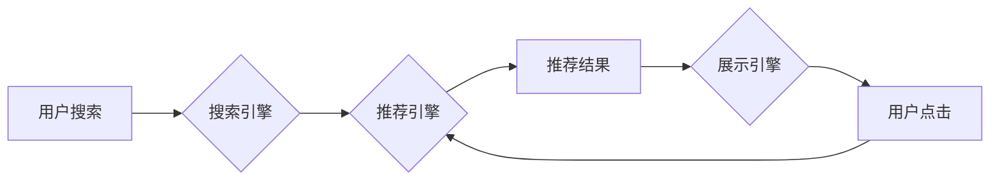

                 

## 1. 背景介绍

在当今数据爆炸的时代，电商平台面临着激烈的竞争。用户每天接触的海量商品信息，如何精准推荐用户感兴趣的产品，成为了电商平台的核心竞争力。传统的基于规则和协同过滤的推荐系统，在面对海量数据和用户个性化需求时，逐渐显露出其局限性。

近年来，人工智能（AI）技术，特别是深度学习技术，为搜索推荐系统带来了革命性的变革。大模型的出现，凭借其强大的学习能力和泛化能力，能够从海量数据中挖掘出更深层的用户需求和商品特征，从而提供更精准、更个性化的推荐服务。

## 2. 核心概念与联系

### 2.1 搜索推荐系统

搜索推荐系统是电商平台的核心功能之一，旨在帮助用户快速找到所需商品。它通常由以下几个模块组成：

* **搜索引擎:** 处理用户搜索词，并返回相关商品列表。
* **推荐引擎:** 基于用户行为、商品特征等信息，推荐用户可能感兴趣的商品。
* **展示引擎:** 将搜索结果和推荐结果以用户友好的方式展示给用户。

### 2.2 AI 大模型

AI 大模型是指在海量数据上训练的深度学习模型，拥有强大的泛化能力和学习能力。常见的AI大模型包括：

* **Transformer模型:** 擅长处理序列数据，例如文本和代码，在自然语言处理领域取得了突破性进展。
* **BERT模型:** 基于Transformer模型，专门用于理解文本语义，在搜索引擎和推荐系统中应用广泛。
* **GPT模型:** 能够生成高质量的文本，在聊天机器人、文案写作等领域展现出强大的潜力。

### 2.3 大模型融合

大模型融合是指将多个不同类型的AI大模型组合在一起，发挥各自优势，共同完成更复杂的任务。例如，可以将BERT模型用于理解用户搜索意图，将Transformer模型用于生成个性化推荐结果，将GPT模型用于生成商品描述和推荐文案。

**Mermaid 流程图**



## 3. 核心算法原理 & 具体操作步骤

### 3.1 算法原理概述

大模型融合在搜索推荐系统中的应用，主要基于以下核心算法原理：

* **多模态融合:** 将文本、图像、视频等不同类型的用户数据和商品信息融合在一起，构建更全面的用户画像和商品特征。
* **深度学习:** 利用深度神经网络，从海量数据中学习用户行为模式和商品关联关系。
* **个性化推荐:** 根据用户的历史行为、偏好和上下文信息，个性化推荐商品。

### 3.2 算法步骤详解

1. **数据预处理:** 收集用户行为数据、商品信息、文本数据等，进行清洗、转换和特征提取。
2. **模型训练:** 利用深度学习算法，训练多个AI大模型，例如BERT模型、Transformer模型、GPT模型等。
3. **模型融合:** 将多个训练好的AI大模型组合在一起，构建一个完整的搜索推荐系统。
4. **个性化推荐:** 根据用户的搜索词、浏览历史、购买记录等信息，利用融合模型生成个性化推荐结果。
5. **结果展示:** 将推荐结果以用户友好的方式展示给用户，例如推荐列表、商品卡片等。

### 3.3 算法优缺点

**优点:**

* **精准度高:** 大模型能够从海量数据中学习出更深层的用户需求和商品特征，从而提供更精准的推荐结果。
* **个性化强:** 大模型可以根据用户的历史行为和偏好，个性化推荐商品，提升用户体验。
* **可扩展性强:** 大模型可以轻松扩展到新的数据和场景，适应不断变化的用户需求。

**缺点:**

* **训练成本高:** 大模型的训练需要大量的计算资源和时间。
* **模型复杂度高:** 大模型的结构复杂，调试和维护难度较大。
* **数据依赖性强:** 大模型的性能依赖于训练数据的质量和数量。

### 3.4 算法应用领域

大模型融合在搜索推荐系统中的应用，已经广泛应用于以下领域：

* **电商平台:** 推荐商品、个性化营销、用户画像分析等。
* **社交媒体:** 推荐好友、推荐内容、个性化广告等。
* **新闻媒体:** 推荐新闻、个性化订阅、内容推荐等。
* **教育平台:** 推荐学习资源、个性化学习路径、智能辅导等。

## 4. 数学模型和公式 & 详细讲解 & 举例说明

### 4.1 数学模型构建

大模型融合在搜索推荐系统中的应用，通常采用基于用户的协同过滤模型和基于内容的推荐模型的组合。

**基于用户的协同过滤模型:**

该模型基于用户的历史行为数据，预测用户对特定商品的兴趣。假设用户 $u$ 对商品 $i$ 的评分为 $r_{ui}$，则可以使用以下公式计算用户 $u$ 对商品 $i$ 的预测评分:

$$
\hat{r}_{ui} = \bar{r}_u + \frac{\sum_{v \in N(u)} (r_{v i} - \bar{r}_v) \cdot sim(u, v)}{\sum_{v \in N(u)} sim(u, v)}
$$

其中:

* $\bar{r}_u$ 是用户 $u$ 的平均评分。
* $N(u)$ 是与用户 $u$ 相似的用户集合。
* $sim(u, v)$ 是用户 $u$ 和用户 $v$ 之间的相似度。

**基于内容的推荐模型:**

该模型基于商品的特征信息，预测用户对特定商品的兴趣。假设商品 $i$ 的特征向量为 $x_i$，用户 $u$ 的偏好向量为 $y_u$，则可以使用以下公式计算用户 $u$ 对商品 $i$ 的兴趣得分:

$$
score(u, i) = x_i \cdot y_u
$$

### 4.2 公式推导过程

上述公式的推导过程基于以下假设和原理:

* **用户相似性:** 相似的用户倾向于对相似的商品感兴趣。
* **商品特征:** 商品的特征信息可以反映其属性和内容。
* **内积运算:** 内积运算可以衡量两个向量的相似度。

### 4.3 案例分析与讲解

例如，假设一个电商平台想要推荐用户喜欢的书籍。

* **基于用户的协同过滤模型:** 可以根据用户过去购买的书籍，找到与该用户兴趣相似的用户，并推荐这些用户购买过的书籍。
* **基于内容的推荐模型:** 可以根据书籍的主题、作者、出版社等特征信息，推荐与用户偏好相符的书籍。

通过将这两个模型融合在一起，可以更加精准地推荐用户喜欢的书籍。

## 5. 项目实践：代码实例和详细解释说明

### 5.1 开发环境搭建

* **操作系统:** Linux/macOS
* **编程语言:** Python
* **深度学习框架:** TensorFlow/PyTorch
* **其他工具:** Git、Jupyter Notebook

### 5.2 源代码详细实现

```python
# 导入必要的库
import tensorflow as tf

# 定义模型结构
class RecommenderModel(tf.keras.Model):
    def __init__(self, embedding_dim, num_users, num_items):
        super(RecommenderModel, self).__init__()
        self.user_embedding = tf.keras.layers.Embedding(num_users, embedding_dim)
        self.item_embedding = tf.keras.layers.Embedding(num_items, embedding_dim)

    def call(self, user_ids, item_ids):
        user_embeddings = self.user_embedding(user_ids)
        item_embeddings = self.item_embedding(item_ids)
        return tf.reduce_sum(user_embeddings * item_embeddings, axis=1)

# 训练模型
model = RecommenderModel(embedding_dim=64, num_users=1000, num_items=10000)
model.compile(optimizer='adam', loss='mse')
model.fit(user_ids, item_ids, epochs=10)

# 生成推荐结果
user_id = 123
predicted_scores = model.predict(user_id)
top_items = tf.argsort(predicted_scores)[-10:][::-1]
```

### 5.3 代码解读与分析

* **模型结构:** 该代码定义了一个简单的推荐模型，使用嵌入层将用户和商品映射到低维向量空间，然后通过点积运算计算用户对商品的兴趣得分。
* **模型训练:** 使用Adam优化器和均方误差损失函数训练模型。
* **推荐结果生成:** 根据用户ID，预测用户对所有商品的兴趣得分，并选择得分最高的商品作为推荐结果。

### 5.4 运行结果展示

运行上述代码，可以得到用户对不同商品的兴趣得分，并根据得分排序，生成推荐结果列表。

## 6. 实际应用场景

### 6.1 电商平台

大模型融合在电商平台的应用场景非常广泛，例如：

* **商品推荐:** 根据用户的浏览历史、购买记录、搜索词等信息，推荐用户可能感兴趣的商品。
* **个性化营销:** 根据用户的兴趣爱好和消费习惯，推送个性化的广告和促销信息。
* **用户画像分析:** 利用大模型分析用户的行为数据，构建用户画像，以便更好地理解用户的需求和偏好。

### 6.2 社交媒体

大模型融合在社交媒体的应用场景主要包括：

* **好友推荐:** 根据用户的兴趣爱好和社交关系，推荐可能感兴趣的新朋友。
* **内容推荐:** 根据用户的浏览历史、点赞记录、评论内容等信息，推荐用户可能感兴趣的内容。
* **个性化广告:** 根据用户的兴趣爱好和消费习惯，推送个性化的广告信息。

### 6.3 其他领域

大模型融合的应用场景还包括新闻媒体、教育平台、医疗健康等领域。

### 6.4 未来应用展望

随着大模型技术的不断发展，大模型融合在搜索推荐系统中的应用将更加广泛和深入。未来，我们可以期待以下应用场景:

* **多模态融合:** 将文本、图像、视频等多种数据类型融合在一起，构建更全面的用户画像和商品特征。
* **实时推荐:** 利用实时数据流，动态更新用户画像和商品推荐结果。
* **个性化解释:** 为用户提供推荐结果的个性化解释，帮助用户理解推荐背后的逻辑。

## 7. 工具和资源推荐

### 7.1 学习资源推荐

* **书籍:**
    * 《深度学习》 - Ian Goodfellow, Yoshua Bengio, Aaron Courville
    * 《自然语言处理》 - Dan Jurafsky, James H. Martin
* **在线课程:**
    * Coursera: 深度学习 Specialization
    * Udacity: 自然语言处理 Nanodegree
* **博客和论坛:**
    * TensorFlow Blog
    * PyTorch Blog
    * Stack Overflow

### 7.2 开发工具推荐

* **深度学习框架:** TensorFlow, PyTorch
* **数据处理工具:** Pandas, NumPy
* **可视化工具:** Matplotlib, Seaborn

### 7.3 相关论文推荐

* BERT: Pre-training of Deep Bidirectional Transformers for Language Understanding
* Transformer: Attention Is All You Need
* GPT-3: Language Models are Few-Shot Learners

## 8. 总结：未来发展趋势与挑战

### 8.1 研究成果总结

大模型融合在搜索推荐系统中的应用取得了显著成果，能够提供更加精准、个性化的推荐服务，提升用户体验。

### 8.2 未来发展趋势

未来，大模型融合在搜索推荐系统中的应用将朝着以下方向发展:

* **模型规模和能力的提升:** 随着计算资源的不断发展，大模型的规模和能力将进一步提升，能够学习更复杂的用户需求和商品特征。
* **多模态融合的深入研究:** 将文本、图像、视频等多种数据类型融合在一起，构建更全面的用户画像和商品特征。
* **个性化解释的增强:** 为用户提供推荐结果的个性化解释，帮助用户理解推荐背后的逻辑。

### 8.3 面临的挑战

大模型融合在搜索推荐系统中的应用也面临着一些挑战:

* **数据质量和隐私问题:** 大模型的训练需要海量数据，而数据质量和隐私问题是需要认真考虑的。
* **模型解释性和可控性:** 大模型的决策过程往往是复杂的，难以解释和控制，这可能会导致用户对推荐结果的信任度降低。
* **计算资源和成本:** 训练和部署大模型需要大量的计算资源和成本，这对于一些中小企业来说可能是一个负担。

### 8.4 研究展望

未来，我们需要继续深入研究大模型融合在搜索推荐系统中的应用，解决上述挑战，并探索新的应用场景，以更好地服务于用户和社会。


## 9. 附录：常见问题与解答

**Q1: 大模型融合的训练成本高吗？**

A1: 确实，大模型的训练需要大量的计算资源和时间，成本较高。但是，随着计算技术的进步和开源框架的普及，训练成本也在逐渐降低。

**Q2: 大模型融合的模型解释性如何？**

A2: 大模型的决策过程往往是复杂的，难以解释和控制。目前，一些研究者正在探索如何提高大模型的解释性和可控性。

**Q3: 大模型融合的应用场景有哪些？**

A3: 大模型融合的应用场景非常广泛，包括电商平台、社交媒体、新闻媒体、教育平台、医疗健康等领域。


作者：禅与计算机程序设计艺术 / Zen and the Art of Computer Programming 
<end_of_turn>

