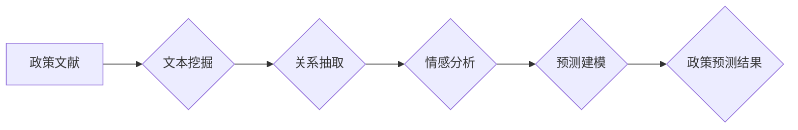

                 

## 政策分析预测：LLM 协助政府未来决策

> 关键词：大型语言模型（LLM）、政策分析、预测建模、政府决策、自然语言处理（NLP）、机器学习（ML）、数据可视化

## 1. 背景介绍

在当今数据爆炸的时代，政府决策面临着前所未有的挑战。传统政策分析方法往往依赖于有限的专家知识和历史数据，难以捕捉复杂社会动态和潜在风险。大型语言模型（LLM）的出现为政府决策提供了一种全新的工具，其强大的文本处理能力和泛化学习能力能够帮助政府更有效地分析政策、预测未来趋势，并做出更明智的决策。

LLM 是一种基于深度学习的强大人工智能模型，能够理解和生成人类语言。通过训练海量文本数据，LLM 能够学习语言的语法、语义和上下文关系，从而实现文本分类、摘要、翻译、问答等多种自然语言处理（NLP）任务。

近年来，LLM 在各个领域取得了突破性进展，例如 ChatGPT 在对话系统、Bard 在搜索引擎等领域展现出强大的应用潜力。在政策分析领域，LLM 可以帮助政府：

* **梳理政策文献：**快速分析大量政策文件、法规、报告等文本，提取关键信息和政策趋势。
* **预测政策影响：**基于历史数据和文本分析，预测政策实施可能带来的社会、经济和环境影响。
* **评估政策效果：**分析政策实施后的数据和反馈，评估政策效果和提出改进建议。
* **支持政策制定：**为政策制定提供数据支持和分析建议，帮助政府制定更科学、更有效的政策。

## 2. 核心概念与联系

### 2.1  政策分析与预测

政策分析是指对政策目标、内容、实施过程和效果进行系统研究和评估的过程。政策预测是指利用数据分析和建模技术，预测政策实施可能带来的未来影响。

### 2.2  LLM 在政策分析与预测中的应用

LLM 可以通过以下方式辅助政策分析与预测：

* **文本挖掘：**利用 LLMs 的自然语言处理能力，从海量政策文献中提取关键信息、识别政策主题和趋势。
* **关系抽取：**识别政策文本中的实体关系，例如政策目标与政策措施之间的关系，政策主体与利益相关者之间的关系等。
* **情感分析：**分析政策文本中的情感倾向，例如公众对政策的接受程度、支持度和反对度等。
* **预测建模：**结合历史数据和文本分析结果，构建预测模型，预测政策实施可能带来的社会、经济和环境影响。

**Mermaid 流程图**



## 3. 核心算法原理 & 具体操作步骤

### 3.1  算法原理概述

LLM 的核心算法原理是基于 Transformer 架构的深度神经网络。Transformer 模型通过自注意力机制学习文本序列之间的长距离依赖关系，能够捕捉文本的语义和上下文信息。

LLM 的训练过程是通过大量的文本数据进行监督学习。模型会学习将输入文本序列映射到输出文本序列的映射关系。通过不断调整模型参数，使模型输出的文本序列与真实文本序列的差异最小化。

### 3.2  算法步骤详解

1. **数据预处理：**将原始文本数据进行清洗、分词、标记等预处理操作，使其能够被模型理解。
2. **模型训练：**将预处理后的文本数据输入到 Transformer 模型中进行训练。训练过程中，模型会不断调整参数，使其能够生成与真实文本序列相似的输出。
3. **模型评估：**使用测试数据评估模型的性能，例如准确率、困惑度等指标。
4. **模型部署：**将训练好的模型部署到服务器上，使其能够接受用户请求并进行文本处理。

### 3.3  算法优缺点

**优点：**

* **强大的文本处理能力：**LLM 可以理解和生成人类语言，能够完成多种 NLP 任务。
* **泛化能力强：**经过海量文本数据训练的 LLM 能够对新的文本数据进行有效处理。
* **可扩展性强：**LLM 的模型结构可以根据需要进行扩展，处理更复杂的任务。

**缺点：**

* **训练成本高：**训练大型语言模型需要大量的计算资源和时间。
* **数据依赖性强：**LLM 的性能取决于训练数据的质量和数量。
* **可解释性差：**LLM 的决策过程较为复杂，难以解释其输出结果。

### 3.4  算法应用领域

LLM 的应用领域非常广泛，包括：

* **自然语言处理：**文本分类、摘要、翻译、问答、对话系统等。
* **机器学习：**文本特征提取、文本分类、文本生成等。
* **人工智能：**聊天机器人、虚拟助手、智能客服等。
* **其他领域：**教育、医疗、金融、法律等。

## 4. 数学模型和公式 & 详细讲解 & 举例说明

### 4.1  数学模型构建

LLM 的核心数学模型是 Transformer 架构，其主要包含以下几个模块：

* **嵌入层：**将文本单词映射到低维向量空间。
* **多头自注意力层：**学习文本序列之间的长距离依赖关系。
* **前馈神经网络层：**对每个单词的嵌入向量进行非线性变换。
* **位置编码层：**为每个单词添加位置信息，使模型能够理解单词在序列中的顺序。
* **输出层：**将模型的输出向量映射到目标文本序列。

### 4.2  公式推导过程

Transformer 模型的注意力机制的核心公式是：

$$
Attention(Q, K, V) = softmax(\frac{QK^T}{\sqrt{d_k}})V
$$

其中：

* $Q$：查询矩阵
* $K$：键矩阵
* $V$：值矩阵
* $d_k$：键向量的维度
* $softmax$：softmax 函数

该公式计算了查询向量 $Q$ 与键向量 $K$ 之间的相似度，并根据相似度对值向量 $V$ 进行加权求和，得到最终的注意力输出。

### 4.3  案例分析与讲解

假设我们有一个文本序列 "The cat sat on the mat"，我们想要预测下一个单词。

1. 将文本序列中的每个单词嵌入到低维向量空间。
2. 使用多头自注意力层计算每个单词与其他单词之间的注意力权重。
3. 根据注意力权重对每个单词的嵌入向量进行加权求和，得到上下文向量。
4. 将上下文向量输入到前馈神经网络层进行非线性变换。
5. 使用输出层将变换后的向量映射到目标单词的概率分布。

通过以上步骤，LLM 可以预测下一个单词为 "the"。

## 5. 项目实践：代码实例和详细解释说明

### 5.1  开发环境搭建

* **操作系统：**Linux 或 macOS
* **编程语言：**Python
* **深度学习框架：**TensorFlow 或 PyTorch
* **其他工具：**Git、Jupyter Notebook

### 5.2  源代码详细实现

```python
# 使用 TensorFlow 实现简单的文本分类模型

import tensorflow as tf

# 定义模型结构
model = tf.keras.Sequential([
    tf.keras.layers.Embedding(input_dim=vocab_size, output_dim=embedding_dim),
    tf.keras.layers.LSTM(units=128),
    tf.keras.layers.Dense(units=num_classes, activation='softmax')
])

# 编译模型
model.compile(optimizer='adam',
              loss='sparse_categorical_crossentropy',
              metrics=['accuracy'])

# 训练模型
model.fit(x_train, y_train, epochs=10)

# 评估模型
loss, accuracy = model.evaluate(x_test, y_test)
print('Loss:', loss)
print('Accuracy:', accuracy)
```

### 5.3  代码解读与分析

* **Embedding 层：**将文本单词映射到低维向量空间。
* **LSTM 层：**学习文本序列之间的长距离依赖关系。
* **Dense 层：**将 LSTM 层的输出映射到目标类别概率分布。
* **编译模型：**选择优化器、损失函数和评估指标。
* **训练模型：**使用训练数据训练模型。
* **评估模型：**使用测试数据评估模型的性能。

### 5.4  运行结果展示

训练完成后，可以将模型应用于新的文本数据进行预测。例如，可以将新的文本输入到模型中，预测其所属类别。

## 6. 实际应用场景

### 6.1  政策文本分析

LLM 可以用于分析政府政策文件、法规、报告等文本，提取关键信息、识别政策主题和趋势，帮助政府了解政策内容和潜在影响。

### 6.2  政策效果评估

LLM 可以结合历史数据和政策文本分析结果，构建预测模型，评估政策实施后的社会、经济和环境影响。

### 6.3  政策制定支持

LLM 可以为政策制定提供数据支持和分析建议，帮助政府制定更科学、更有效的政策。

### 6.4  未来应用展望

随着 LLM 技术的不断发展，其在政策分析与预测领域的应用将更加广泛和深入。例如：

* **个性化政策推荐：**根据用户的个人情况和需求，推荐个性化的政策方案。
* **政策风险预警：**利用 LLM 分析政策文本和社会舆情，预警政策可能带来的风险。
* **跨部门政策协同：**利用 LLM 促进不同部门之间政策的协同和整合。

## 7. 工具和资源推荐

### 7.1  学习资源推荐

* **书籍：**
    * 《深度学习》
    * 《自然语言处理》
* **在线课程：**
    * Coursera
    * edX
    * fast.ai

### 7.2  开发工具推荐

* **深度学习框架：**TensorFlow、PyTorch
* **文本处理工具：**NLTK、spaCy
* **数据可视化工具：**Matplotlib、Seaborn

### 7.3  相关论文推荐

* **Attention Is All You Need**
* **BERT: Pre-training of Deep Bidirectional Transformers for Language Understanding**
* **GPT-3: Language Models are Few-Shot Learners**

## 8. 总结：未来发展趋势与挑战

### 8.1  研究成果总结

LLM 在政策分析与预测领域取得了显著进展，能够有效地处理文本数据、提取关键信息、预测政策影响。

### 8.2  未来发展趋势

* **模型规模和能力的提升：**未来 LLM 模型规模将进一步扩大，能力将更加强大，能够处理更复杂的任务。
* **多模态学习：**LLM 将与其他模态数据（例如图像、音频）融合，实现多模态理解和分析。
* **可解释性增强：**研究人员将致力于提高 LLM 的可解释性，使模型的决策过程更加透明。

### 8.3  面临的挑战

* **数据质量和偏见：**LLM 的性能取决于训练数据的质量和多样性，数据偏见可能导致模型输出结果不准确。
* **计算资源需求：**训练大型 LLM 模型需要大量的计算资源，这对于资源有限的机构来说是一个挑战。
* **伦理和安全问题：**LLM 的应用可能带来伦理和安全问题，例如信息泄露、深度伪造等，需要谨慎对待。

### 8.4  研究展望

未来，LLM 在政策分析与预测领域将继续发挥重要作用，帮助政府做出更明智的决策。研究人员将继续探索 LLM 的新应用场景，并解决其面临的挑战，推动 LLM 技术在政府决策领域的落地应用。

## 9. 附录：常见问题与解答

**Q1：LLM 是否能够完全替代人类决策？**

A1：LLM 可以为政府决策提供数据支持和分析建议，但不能完全替代人类决策。人类决策需要考虑伦理、社会影响等多方面因素，而 LLM 只能基于数据进行分析和预测。

**Q2：LLM 的训练数据如何保证质量和多样性？**

A2：LLM 的训练数据需要经过严格的清洗、标注和筛选，以保证其质量和多样性。政府机构可以与学术机构合作，构建高质量的政策文本数据集。

**Q3：如何解决 LLM 训练过程中可能出现的偏见问题？**

A3：在训练 LLM 模型时，需要关注数据中的潜在偏见，并采取措施进行缓解。例如，可以使用数据增强技术增加训练数据的多样性，或者使用公平性评估指标来监测模型的偏见程度。


作者：禅与计算机程序设计艺术 / Zen and the Art of Computer Programming 
<end_of_turn>

