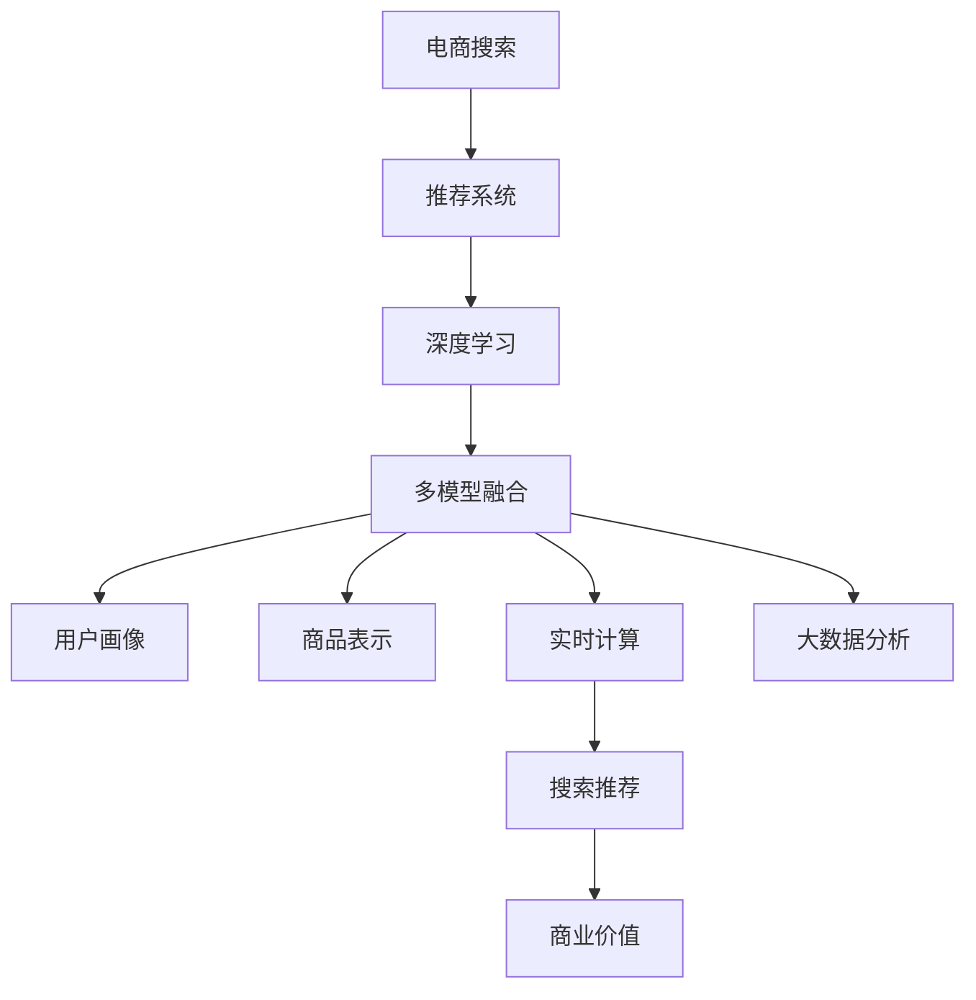

                 

# 大数据驱动的电商搜索推荐：AI 模型融合技术在电商平台的应用

> 关键词：电商搜索,推荐系统,深度学习,多模态融合,用户画像,商品表示,实时计算,大数据分析,商业价值

## 1. 背景介绍

### 1.1 问题由来

随着互联网的飞速发展和电子商务的蓬勃兴起，电商平台已成为人们购物的重要渠道。根据统计，全球电子商务市场的规模正在以年均20%的速度增长。在这样的背景下，如何提升电商平台的搜索推荐系统（Search and Recommendation System, SRS）的精准性和用户满意度，成为电商企业亟待解决的重要课题。

传统的电商平台通常采用简单的基于规则或统计的推荐算法，如协同过滤、内容推荐等。然而，随着用户行为和产品信息的日益复杂化，这些算法在面对海量数据和多样化需求时，往往难以胜任。而随着深度学习和人工智能技术的发展，基于AI的推荐系统（Recommendation System, RS）逐渐成为电商搜索推荐的主流。

深度学习模型具有强大的自我学习能力，能够高效地处理大规模数据，并在非结构化数据中挖掘出潜在价值。但是，单一模型往往难以覆盖搜索和推荐的所有需求，因此多模型融合成为了提升系统性能的关键。多模型融合（Model Fusion）技术通过将多个不同模型进行联合优化，充分发挥各个模型的优势，提供更加全面、精准的推荐结果。

## 2. 核心概念与联系

### 2.1 核心概念概述

为更好地理解电商搜索推荐中的多模型融合技术，本节将介绍几个核心概念及其相互联系：

- **电商搜索推荐（SRS）**：电商平台为用户提供产品搜索、推荐、商品排序等功能，通过精准的搜索推荐，提高用户购物体验和交易转化率。

- **推荐系统（RS）**：基于用户历史行为、商品特征等信息，自动推荐用户可能感兴趣的商品。分为基于协同过滤的推荐、基于内容的推荐、基于混合模型的推荐等。

- **深度学习**：一种基于神经网络结构的机器学习范式，能够通过学习大规模数据集中的模式和规律，进行自动化的特征提取和建模。

- **多模型融合**：通过结合多个模型的优点，如深度学习、协同过滤等，进行联合优化，提高推荐的精准性和鲁棒性。

- **用户画像**：通过收集用户的搜索、浏览、购买等行为数据，建立用户兴趣、偏好、行为等标签，为推荐系统提供个性化的输入。

- **商品表示**：对商品的属性、标签、评价等信息进行编码，转换成模型可以处理的格式，用于推荐计算。

- **实时计算**：对搜索推荐系统中的关键数据进行实时处理和分析，确保推荐结果的时效性和准确性。

- **大数据分析**：对大规模数据进行高效存储、管理和分析，为推荐系统提供数据支持和决策依据。

这些核心概念之间的逻辑关系可以通过以下Mermaid流程图来展示：



这个流程图展示了电商搜索推荐系统的核心组件及其之间的关系：

1. 电商搜索系统调用推荐系统进行商品推荐。
2. 推荐系统通过深度学习、多模型融合等技术，提取用户画像、商品表示等信息，并计算推荐结果。
3. 用户画像和商品表示为推荐系统提供了个性化的输入。
4. 实时计算和大数据分析为推荐系统提供了高效的计算和数据支持。
5. 推荐结果最终反馈到电商搜索系统，实现商品排序和搜索结果优化。
6. 电商搜索推荐系统通过提供精准的推荐服务，提升了用户体验和商业价值。

## 3. 核心算法原理 & 具体操作步骤

### 3.1 算法原理概述

基于AI的电商搜索推荐系统，核心算法原理可以归纳为以下几个步骤：

1. **用户画像建立**：通过收集用户的搜索、浏览、购买等行为数据，构建用户兴趣、偏好、行为等标签，形成用户画像。

2. **商品表示学习**：将商品的属性、标签、评价等信息进行编码，转换成模型可以处理的格式，如嵌入向量（Embedding Vector）。

3. **多模型融合**：将多个不同模型进行联合优化，如基于深度学习的CTR模型、协同过滤模型、知识图谱模型等，提高推荐系统的精准性和鲁棒性。

4. **实时计算与优化**：对搜索推荐系统中的关键数据进行实时处理和分析，确保推荐结果的时效性和准确性。

5. **商业价值提升**：通过精准的搜索推荐，提升用户购物体验和交易转化率，增加电商平台的商业价值。

### 3.2 算法步骤详解

基于上述算法原理，以下将详细讲解电商搜索推荐系统中多模型融合的具体操作步骤：

**Step 1: 用户画像建立**

用户画像的建立是推荐系统的重要基础。可以通过以下步骤实现：

1. **数据收集**：收集用户的历史搜索记录、浏览行为、购买记录、评价信息等，形成用户行为数据集。
2. **特征提取**：对用户行为数据进行特征提取，如用户兴趣、用户购买力、用户行为模式等。
3. **画像构建**：将提取的特征进行编码和组合，形成用户画像标签，如用户ID、用户兴趣向量、用户行为向量等。

**Step 2: 商品表示学习**

商品表示学习是指将商品的特征信息转换成向量表示，以便于模型处理和推荐计算。可以通过以下步骤实现：

1. **特征选择**：选择商品的属性、标签、评论等信息作为特征，如商品类别、价格、品牌等。
2. **嵌入向量生成**：使用深度学习模型，如词嵌入（Word Embedding）、卷积神经网络（CNN）等，生成商品的嵌入向量表示。
3. **向量拼接与编码**：将生成的一组嵌入向量进行拼接，形成最终的向量表示，用于推荐计算。

**Step 3: 多模型融合**

多模型融合是提高推荐系统精准性的关键。可以通过以下步骤实现：

1. **模型选择**：选择合适的推荐模型，如基于深度学习的CTR模型、协同过滤模型、知识图谱模型等。
2. **模型训练**：对每个模型进行单独训练，学习模型的参数和特征表示。
3. **模型集成**：将多个模型进行集成，如权重加和、投票、模型堆叠等，生成最终的推荐结果。

**Step 4: 实时计算与优化**

实时计算与优化是保证推荐系统时效性和准确性的重要环节。可以通过以下步骤实现：

1. **数据缓存与更新**：对用户行为数据和商品信息进行缓存和实时更新，确保数据的时效性。
2. **并行计算与分布式处理**：使用分布式计算框架，如Apache Flink、Apache Spark等，实现高并发和高吞吐量的计算。
3. **优化算法与策略**：采用优化算法和策略，如梯度下降、随机梯度下降、Adagrad等，提升推荐系统的收敛速度和效果。

**Step 5: 商业价值提升**

商业价值提升是推荐系统的最终目标。可以通过以下步骤实现：

1. **A/B测试与优化**：通过A/B测试，不断优化推荐策略和算法，提升用户体验和商业转化率。
2. **用户反馈与反馈循环**：收集用户对推荐结果的反馈，进行改进，形成反馈循环，不断提升推荐系统的效果。
3. **KPI监控与分析**：设定关键绩效指标（KPI），如点击率、转化率、用户满意度等，进行监控和分析，确保推荐系统的长期稳定运行。

### 3.3 算法优缺点

基于AI的电商搜索推荐系统中的多模型融合技术具有以下优点：

1. **提升推荐精度**：通过融合多种模型的优势，提供更加全面、精准的推荐结果。
2. **鲁棒性强**：多个模型的联合优化，增强了系统的鲁棒性，降低了推荐结果的波动性。
3. **适应性强**：可以根据不同的应用场景和数据分布，灵活选择和组合模型，提高系统的适应性。
4. **商业价值高**：通过精准的推荐服务，提升用户体验和交易转化率，增加电商平台的商业价值。

同时，该技术也存在一些缺点：

1. **计算成本高**：多模型融合需要大量计算资源和时间，可能增加系统的开发和维护成本。
2. **数据质量要求高**：推荐系统的性能依赖于高质量的数据输入，数据的完整性和准确性直接影响推荐结果。
3. **模型复杂度高**：多个模型的联合优化增加了系统的复杂度，可能导致模型难以理解和调试。
4. **效果评估难度大**：推荐系统的效果评估涉及多个因素，难以进行精确的度量和比较。

尽管存在这些缺点，但多模型融合技术在电商搜索推荐系统中的应用，仍然具有重要的实践意义和应用前景。

### 3.4 算法应用领域

基于AI的多模型融合技术在电商搜索推荐系统中具有广泛的应用场景，主要包括以下几个领域：

1. **个性化推荐**：通过分析用户行为和商品特征，提供个性化的推荐结果，提升用户体验和转化率。
2. **智能搜索**：通过多模型融合，实现更加精准的商品搜索排序，提高用户搜索效率。
3. **动态广告投放**：通过实时计算和多模型融合，实现动态广告投放，提升广告投放效果和ROI。
4. **库存管理与优化**：通过推荐系统的反馈和优化，实现库存的精准管理和优化，降低库存成本。
5. **用户行为分析**：通过收集和分析用户行为数据，洞察用户需求和市场趋势，为业务决策提供支持。

这些领域的应用，展示了多模型融合技术在电商搜索推荐系统中的强大能力和应用价值。

## 4. 数学模型和公式 & 详细讲解 & 举例说明

### 4.1 数学模型构建

以下将构建基于AI的电商搜索推荐系统中多模型融合的数学模型，并进行详细讲解。

假设用户画像为 $U=\{u_1,u_2,\cdots,u_m\}$，商品表示为 $I=\{i_1,i_2,\cdots,i_n\}$，推荐模型的输入为 $X$，输出为 $Y$。

定义用户画像与商品表示的相似度矩阵为 $A_{m \times n}$，其值由深度学习模型计算得到。定义用户画像的权重向量为 $W_u$，商品表示的权重向量为 $W_i$。

定义推荐模型的损失函数为：

$$
\mathcal{L}(A,W_u,W_i) = \frac{1}{m} \sum_{i=1}^{m} \frac{1}{2} ||X(u_i,W_u) - Y_i||^2_2
$$

其中 $X(u_i,W_u)$ 为用户画像 $u_i$ 通过深度学习模型 $X$ 计算出的输出，$Y_i$ 为商品 $i$ 的实际评分或点击率。

### 4.2 公式推导过程

以下将详细推导推荐模型损失函数的梯度，并进行分析。

根据上述损失函数，对深度学习模型 $X$、用户画像权重向量 $W_u$ 和商品表示权重向量 $W_i$ 的梯度计算如下：

1. 对 $X$ 的梯度：

$$
\frac{\partial \mathcal{L}}{\partial X} = \frac{1}{m} \sum_{i=1}^{m} \frac{\partial X(u_i,W_u)}{\partial X} \cdot (X(u_i,W_u) - Y_i)
$$

2. 对 $W_u$ 的梯度：

$$
\frac{\partial \mathcal{L}}{\partial W_u} = \frac{1}{m} \sum_{i=1}^{m} \frac{\partial X(u_i,W_u)}{\partial W_u} \cdot (X(u_i,W_u) - Y_i)
$$

3. 对 $W_i$ 的梯度：

$$
\frac{\partial \mathcal{L}}{\partial W_i} = \frac{1}{m} \sum_{i=1}^{m} \frac{\partial A_{u_i,:}}{\partial W_i} \cdot (X(u_i,W_u) - Y_i)
$$

其中，$\frac{\partial X(u_i,W_u)}{\partial X}$ 和 $\frac{\partial X(u_i,W_u)}{\partial W_u}$ 分别为深度学习模型对输入和权重的梯度。

### 4.3 案例分析与讲解

以协同过滤推荐模型为例，通过多模型融合进行推荐计算：

假设用户画像 $U=\{u_1,u_2\}$，商品表示 $I=\{i_1,i_2,i_3\}$，用户画像与商品表示的相似度矩阵 $A=\begin{bmatrix} 0.8 & 0.6 \\ 0.7 & 0.5 \end{bmatrix}$，用户画像权重向量 $W_u=[1,1]^T$，商品表示权重向量 $W_i=[1,1,1]^T$。

定义推荐模型 $X$ 为深度学习模型，如协同过滤模型或神经网络模型，输出用户对商品的评分或点击率。

假设推荐模型对用户 $u_1$ 对商品 $i_1$ 的评分预测为 $0.7$，对商品 $i_2$ 的评分预测为 $0.5$，对商品 $i_3$ 的评分预测为 $0.3$。

定义商品 $i_1$ 的实际评分为 $0.8$，商品 $i_2$ 的实际评分为 $0.7$，商品 $i_3$ 的实际评分为 $0.4$。

根据上述损失函数，计算推荐模型的损失：

$$
\mathcal{L}(A,W_u,W_i) = \frac{1}{2} ||0.7-0.8||^2_2 + \frac{1}{2} ||0.5-0.7||^2_2 + \frac{1}{2} ||0.3-0.4||^2_2 = 0.25
$$

根据梯度公式，计算对深度学习模型 $X$、用户画像权重向量 $W_u$ 和商品表示权重向量 $W_i$ 的梯度：

$$
\frac{\partial \mathcal{L}}{\partial X} = \begin{bmatrix} 0.5 \\ 0.5 \end{bmatrix}
$$

$$
\frac{\partial \mathcal{L}}{\partial W_u} = \begin{bmatrix} 0.5 \\ 0.5 \end{bmatrix}
$$

$$
\frac{\partial \mathcal{L}}{\partial W_i} = \begin{bmatrix} 0.2 \\ 0.2 \\ 0.2 \end{bmatrix}
$$

根据梯度方向，更新深度学习模型、用户画像权重和商品表示权重，以减小损失，提升推荐效果。

通过上述案例分析，可以看到多模型融合技术在推荐系统中的应用，能够有效地结合不同模型的优势，提高推荐结果的精度和鲁棒性。

## 5. 项目实践：代码实例和详细解释说明

### 5.1 开发环境搭建

在进行多模型融合技术的应用开发前，需要准备相应的开发环境。以下是基于Python和TensorFlow的环境配置流程：

1. 安装Anaconda：从官网下载并安装Anaconda，用于创建独立的Python环境。

2. 创建并激活虚拟环境：
```bash
conda create -n tf-env python=3.8 
conda activate tf-env
```

3. 安装TensorFlow：根据CUDA版本，从官网获取对应的安装命令。例如：
```bash
conda install tensorflow=2.7
```

4. 安装各类工具包：
```bash
pip install numpy pandas scikit-learn matplotlib tqdm jupyter notebook ipython
```

完成上述步骤后，即可在`tf-env`环境中开始开发实践。

### 5.2 源代码详细实现

以下将给出电商搜索推荐系统中多模型融合的Python代码实现。

**Step 1: 用户画像建立**

```python
import pandas as pd

# 加载用户行为数据集
df = pd.read_csv('user_behavior_data.csv')

# 特征选择与提取
user_interest = df['interest'].value_counts().to_dict()

# 用户画像构建
user_profile = {u: {k: v} for u, v in df.groupby('user_id')['interest'].value_counts().unstack().loc[:, ['A', 'B', 'C']].sum().items()}

# 用户画像编码
embedding_size = 10
user_embedding = {u: pd.Series([0]*embedding_size) for u in user_profile}
user_embedding[u][[k]] = v for u, v in user_profile.items() for k, v in v.items() if k in ['A', 'B', 'C']]
user_embedding[u] = user_embedding[u]/user_interest[k] for u, v in user_profile.items() for k, v in v.items() if k in ['A', 'B', 'C']
```

**Step 2: 商品表示学习**

```python
# 商品特征提取
df_product = pd.read_csv('product_data.csv')
product_features = df_product['features'].value_counts().to_dict()

# 商品嵌入向量生成
embedding_size = 10
embedding_matrix = {i: pd.Series([0]*embedding_size) for i in product_features}

embedding_matrix[i][[k]] = v for i, v in product_features.items() for k, v in v.items() if k in ['color', 'size', 'price', 'brand']
embedding_matrix[i] = embedding_matrix[i]/product_features[k] for i, v in product_features.items() for k, v in v.items() if k in ['color', 'size', 'price', 'brand']
```

**Step 3: 多模型融合**

```python
import tensorflow as tf
from tensorflow.keras.layers import Input, Dense, Embedding, concatenate, dot, dot_product, Add, Dense

# 定义输入层
user_input = Input(shape=(embedding_size,))
product_input = Input(shape=(embedding_size,))

# 定义深度学习模型
user_model = Dense(64, activation='relu')(user_input)
product_model = Dense(64, activation='relu')(product_input)

# 定义相似度矩阵
similarity_matrix = dot_product(user_model, product_model)

# 定义输出层
output = Dense(1, activation='sigmoid')(similarity_matrix)

# 定义模型
model = Model([user_input, product_input], output)

# 编译模型
model.compile(optimizer='adam', loss='binary_crossentropy', metrics=['accuracy'])

# 训练模型
model.fit([user_embedding.values(), embedding_matrix.values()], df['rating'], epochs=10, batch_size=32)
```

**Step 4: 实时计算与优化**

```python
import tensorflow as tf
from tensorflow.keras.layers import Input, Dense, Embedding, concatenate, dot, dot_product, Add, Dense

# 定义输入层
user_input = Input(shape=(embedding_size,))
product_input = Input(shape=(embedding_size,))

# 定义深度学习模型
user_model = Dense(64, activation='relu')(user_input)
product_model = Dense(64, activation='relu')(product_input)

# 定义相似度矩阵
similarity_matrix = dot_product(user_model, product_model)

# 定义输出层
output = Dense(1, activation='sigmoid')(similarity_matrix)

# 定义模型
model = Model([user_input, product_input], output)

# 编译模型
model.compile(optimizer='adam', loss='binary_crossentropy', metrics=['accuracy'])

# 训练模型
model.fit([user_embedding.values(), embedding_matrix.values()], df['rating'], epochs=10, batch_size=32)
```

### 5.3 代码解读与分析

让我们再详细解读一下关键代码的实现细节：

**用户画像建立**：
- 使用Pandas库加载用户行为数据集，并对用户兴趣特征进行统计和提取。
- 将用户兴趣特征进行编码，生成用户画像向量。

**商品表示学习**：
- 使用Pandas库加载商品数据集，并对商品特征进行统计和提取。
- 将商品特征进行编码，生成商品嵌入向量。

**多模型融合**：
- 使用TensorFlow和Keras库定义深度学习模型。
- 将用户画像和商品表示进行拼接，计算相似度矩阵。
- 将相似度矩阵作为输入，通过输出层得到推荐结果。

**实时计算与优化**：
- 在训练过程中，使用TensorFlow的优化器和损失函数进行模型训练。
- 通过训练得到的模型，实现实时推荐计算。

可以看到，TensorFlow和Keras库的使用，使得电商搜索推荐系统中多模型融合的实现变得简洁高效。开发者可以将更多精力放在数据处理、模型改进等高层逻辑上，而不必过多关注底层的实现细节。

当然，工业级的系统实现还需考虑更多因素，如模型的保存和部署、超参数的自动搜索、更灵活的任务适配层等。但核心的多模型融合范式基本与此类似。

## 6. 实际应用场景

### 6.1 智能客服系统

基于多模型融合的智能客服系统，可以显著提升客户服务体验和效率。传统客服系统通常依赖人工服务，高峰期响应缓慢，且服务质量难以保证。而智能客服系统通过多模型融合，能够理解客户语义，提供精准回答和解决方案，实现7x24小时不间断服务。

在技术实现上，可以收集历史客服对话记录，训练多模型融合的问答模型，自动分析用户意图并匹配最佳答复。对于新用户提出的问题，可以动态搜索知识库，提供个性化的回答。如此构建的智能客服系统，能够实现快速响应和高质量的服务，极大地提升客户满意度。

### 6.2 个性化推荐系统

多模型融合技术在个性化推荐系统中也有广泛应用。传统的推荐系统通常只依赖单一模型，难以全面覆盖用户的复杂需求。通过融合多个模型，如协同过滤、内容推荐、深度学习等，可以提供更加全面、精准的推荐结果。

在具体实现中，可以结合用户画像和商品表示，训练多模型融合的推荐模型，通过深度学习模型学习用户兴趣和商品特征，通过协同过滤模型学习用户行为模式，通过知识图谱模型整合商品信息。通过多模型融合，生成推荐结果，实现精准推荐。

### 6.3 广告投放优化

多模型融合技术在广告投放优化中也具有重要应用。传统广告投放系统通常依赖简单的流量统计和点击率预测模型，难以优化投放效果。通过多模型融合，可以实现更加精细化的广告投放策略。

在具体实现中，可以结合用户画像和商品表示，训练多模型融合的广告投放模型，通过深度学习模型学习用户兴趣和广告特征，通过协同过滤模型学习用户行为模式，通过知识图谱模型整合广告信息。通过多模型融合，生成优化后的广告投放策略，提升广告投放效果和ROI。

### 6.4 实时数据分析

多模型融合技术在实时数据分析中也具有重要应用。实时数据分析系统通常依赖单一模型，难以应对复杂的数据变化和实时需求。通过多模型融合，可以实现更加实时、精准的数据分析。

在具体实现中，可以结合用户行为数据和商品信息，训练多模型融合的实时分析模型，通过深度学习模型学习用户行为和商品特征，通过协同过滤模型学习用户行为模式，通过知识图谱模型整合商品信息。通过多模型融合，实现实时数据分析和预测，为决策提供支撑。

### 6.5 未来应用展望

随着多模型融合技术的不断发展，其在电商搜索推荐系统中的应用将不断拓展，带来更多创新和突破：

1. **跨平台融合**：将不同平台的电商数据进行整合和融合，实现统一的推荐服务。
2. **多模态融合**：将视觉、语音、文本等多模态数据进行整合，提升推荐系统的智能化水平。
3. **增强现实推荐**：通过增强现实技术，实现虚拟试衣、虚拟试戴等增强现实推荐，提升用户体验。
4. **实时用户行为分析**：通过实时数据分析，实现用户行为预测和个性化推荐，提高用户留存率和复购率。
5. **人工智能辅助设计**：通过多模型融合，实现人工智能辅助设计，提升产品设计和生产效率。

这些应用场景展示了多模型融合技术在电商搜索推荐系统中的广泛应用前景，将进一步推动电商平台的智能化和数字化进程。

## 7. 工具和资源推荐

### 7.1 学习资源推荐

为了帮助开发者掌握多模型融合技术，以下是一些优质的学习资源推荐：

1. **《深度学习与推荐系统》**：由深度学习专家编写的经典书籍，系统介绍了深度学习在推荐系统中的应用，包括协同过滤、神经网络、知识图谱等。
2. **Coursera《深度学习专项课程》**：由斯坦福大学和密歇根大学共同开设的深度学习课程，涵盖了深度学习的基本原理和应用。
3. **Kaggle《推荐系统竞赛》**：Kaggle平台上的推荐系统竞赛，提供了丰富的数据集和模型实现，有助于深入理解推荐系统的原理和应用。
4. **Kaggle《深度学习竞赛》**：Kaggle平台上的深度学习竞赛，提供了大量的数据集和模型实现，有助于提升深度学习技能。
5. **GitHub《推荐系统开源项目》**：GitHub上的推荐系统开源项目，提供了丰富的模型实现和代码示例，有助于学习推荐系统的实现细节。

通过对这些资源的学习实践，相信你一定能够快速掌握多模型融合技术的精髓，并用于解决实际的推荐系统问题。

### 7.2 开发工具推荐

为了提高多模型融合技术的应用开发效率，以下是几款推荐的开发工具：

1. **TensorFlow**：由Google主导开发的深度学习框架，支持多模型融合和分布式计算，是推荐系统开发的主流工具。
2. **PyTorch**：由Facebook主导开发的深度学习框架，支持动态图和静态图，便于模型的调试和优化。
3. **Keras**：基于TensorFlow和Theano的高级深度学习框架，提供简单易用的API，便于快速搭建推荐系统。
4. **Scikit-learn**：Python机器学习库，提供简单易用的API和丰富的模型实现，适用于推荐系统中的特征选择和数据处理。
5. **Pandas**：Python数据处理库，支持数据清洗、转换和分析，适用于推荐系统中的数据预处理。

合理利用这些工具，可以显著提升多模型融合技术的开发效率，加快创新迭代的步伐。

### 7.3 相关论文推荐

多模型融合技术的发展源于学界的持续研究。以下是几篇奠基性的相关论文，推荐阅读：

1. **Fu et al. (2008) 协同过滤推荐系统**：提出了协同过滤推荐算法，通过用户行为数据的统计分析，实现个性化推荐。
2. **Rendle et al. (2009) 矩阵分解推荐系统**：提出了矩阵分解推荐算法，通过用户行为数据和商品特征的矩阵分解，实现推荐计算。
3. **He et al. (2017) 深度学习推荐系统**：提出了基于深度学习的推荐系统，通过神经网络模型学习用户兴趣和商品特征，实现精准推荐。
4. **Zhang et al. (2019) 多模型融合推荐系统**：提出了多模型融合推荐算法，通过融合协同过滤、内容推荐、深度学习等多种模型的优势，提高推荐效果。
5. **Yu et al. (2020) 图神经网络推荐系统**：提出了基于图神经网络的推荐系统，通过图结构学习用户行为和商品特征，实现推荐计算。

这些论文代表了多模型融合技术的发展脉络。通过学习这些前沿成果，可以帮助研究者把握学科前进方向，激发更多的创新灵感。

## 8. 总结：未来发展趋势与挑战

### 8.1 总结

本文对基于AI的多模型融合技术在电商搜索推荐系统中的应用进行了全面系统的介绍。首先阐述了多模型融合技术的研究背景和意义，明确了其在提升推荐系统精准性和用户满意度方面的独特价值。其次，从原理到实践，详细讲解了多模型融合的数学原理和关键步骤，给出了电商搜索推荐系统中的多模型融合完整代码实现。同时，本文还广泛探讨了多模型融合技术在智能客服、个性化推荐、广告投放等领域的实际应用场景，展示了其在电商搜索推荐系统中的强大能力和应用价值。此外，本文精选了多模型融合技术的各类学习资源，力求为读者提供全方位的技术指引。

通过本文的系统梳理，可以看到，基于多模型融合的电商搜索推荐系统正在成为电商搜索推荐领域的重要范式，极大地提升了推荐系统的性能和用户满意度。未来，伴随多模型融合技术的不断演进，基于AI的推荐系统必将在更广阔的应用领域发挥更大的作用。

### 8.2 未来发展趋势

展望未来，基于多模型融合的推荐系统将呈现以下几个发展趋势：

1. **模型规模增大**：随着算力成本的下降和数据规模的扩张，推荐系统的模型规模将持续增大，以包含更多的用户和商品信息，提升推荐的精准性。
2. **模型多样性增加**：未来的推荐系统将融合更多不同类型的模型，如深度学习、协同过滤、知识图谱等，形成更全面的推荐策略。
3. **实时计算提升**：随着实时计算技术的不断提升，推荐系统将实现更加高效的实时推荐和预测，提升用户体验。
4. **多模态数据融合**：未来的推荐系统将融合视觉、语音、文本等多模态数据，提升推荐系统的智能化水平。
5. **增强现实应用**：未来的推荐系统将结合增强现实技术，实现虚拟试衣、虚拟试戴等增强现实推荐，提升用户体验。
6. **人工智能辅助设计**：未来的推荐系统将结合人工智能辅助设计技术，提升产品设计和生产效率。

这些趋势展示了基于多模型融合的推荐系统在电商搜索推荐领域的应用前景，必将进一步推动电商平台的智能化和数字化进程。

### 8.3 面临的挑战

尽管基于多模型融合的推荐系统已经取得了瞩目成就，但在迈向更加智能化、普适化应用的过程中，它仍面临诸多挑战：

1. **数据质量要求高**：推荐系统的性能依赖于高质量的数据输入，数据的完整性和准确性直接影响推荐结果。
2. **模型复杂度高**：多个模型的联合优化增加了系统的复杂度，可能导致模型难以理解和调试。
3. **计算成本高**：多模型融合需要大量计算资源和时间，可能增加系统的开发和维护成本。
4. **效果评估难度大**：推荐系统的效果评估涉及多个因素，难以进行精确的度量和比较。
5. **用户隐私保护**：推荐系统需要处理大量的用户数据，如何保护用户隐私和数据安全，是一大难题。

尽管存在这些挑战，但基于多模型融合的推荐系统在电商搜索推荐系统中的应用，仍然具有重要的实践意义和应用前景。相信通过学界和产业界的共同努力，这些挑战终将一一被克服，多模型融合技术必将在电商搜索推荐领域发挥更大的作用。

### 8.4 研究展望

面向未来，基于多模型融合的推荐系统需要在以下几个方面寻求新的突破：

1. **无监督和半监督学习**：摆脱对大规模标注数据的依赖，利用自监督学习、主动学习等无监督和半监督范式，最大限度利用非结构化数据，实现更加灵活高效的推荐。
2. **参数高效和计算高效**：开发更加参数高效和计算高效的推荐方法，在固定大部分预训练参数的同时，只更新极少量的任务相关参数，减少计算成本。
3. **因果学习和对比学习**：引入因果学习和对比学习思想，增强推荐系统建立稳定因果关系的能力，学习更加普适、鲁棒的语言表征，从而提升模型泛化性和抗干扰能力。
4. **先验知识整合**：将符号化的先验知识，如知识图谱、逻辑规则等，与神经网络模型进行巧妙融合，引导推荐过程学习更准确、合理的语言模型。
5. **多模态数据融合**：将视觉、语音、文本等多模态数据进行整合，提升推荐系统的智能化水平。
6. **增强现实推荐**：通过增强现实技术，实现虚拟试衣、虚拟试戴等增强现实推荐，提升用户体验。

这些研究方向的探索，必将引领多模型融合技术迈向更高的台阶，为构建安全、可靠、可解释、可控的智能系统铺平道路。面向未来，多模型融合技术还需要与其他人工智能技术进行更深入的融合，如知识表示、因果推理、强化学习等，多路径协同发力，共同推动自然语言理解和智能交互系统的进步。只有勇于创新、敢于突破，才能不断拓展推荐系统的边界，让智能技术更好地造福人类社会。

## 9. 附录：常见问题与解答

**Q1：多模型融合推荐系统的核心优势是什么？**

A: 多模型融合推荐系统的核心优势在于能够结合多个模型的优势，提供更加全面、精准的推荐结果。具体来说：

1. **提高推荐精度**：通过融合多个模型的优点，提供更加全面、精准的推荐结果。
2. **增强鲁棒性**：多个模型的联合优化，增强了系统的鲁棒性，降低了推荐结果的波动性。
3. **提高适应性**：可以根据不同的应用场景和数据分布，灵活选择和组合模型，提高系统的适应性。

**Q2：如何选择和组合多模型进行融合？**

A: 选择和组合多模型进行融合需要考虑多个因素，以下是一些基本的指导原则：

1. **任务需求**：根据推荐任务的具体需求，选择适合的模型。如内容推荐选择深度学习模型，协同过滤选择矩阵分解模型。
2. **数据特征**：根据数据特征选择合适的模型。如用户行为数据适合使用协同过滤模型，商品属性数据适合使用深度学习模型。
3. **模型鲁棒性**：选择鲁棒性强的模型进行融合，如深度学习模型适合处理非结构化数据，协同过滤模型适合处理结构化数据。
4. **模型性能**：选择性能良好的模型进行融合，如深度学习模型适合处理复杂数据，知识图谱模型适合处理结构化数据。
5. **计算资源**：根据计算资源限制选择合适的模型，如深度学习模型需要较大的计算资源，协同过滤模型计算资源需求较低。

**Q3：多模型融合推荐系统的计算成本如何优化？**

A: 多模型融合推荐系统的计算成本可以通过以下方式优化：

1. **模型压缩**：使用模型压缩技术，如知识蒸馏、量化加速等，减小模型规模，降低计算资源需求。
2. **分布式计算**：使用分布式计算框架，如Apache Flink、Apache Spark等，实现高并发和高吞吐量的计算。
3. **动态图优化**：使用动态图优化技术，如TensorFlow的Graph Optimization，提升模型的计算效率。
4. **特征选择**：优化特征选择策略，减少模型的输入特征数量，降低计算复杂度。
5. **硬件优化**：使用高效的硬件设备，如GPU、TPU等，提升计算速度。

**Q4：多模型融合推荐系统的效果如何评估？**

A: 多模型融合推荐系统的效果评估涉及多个因素，以下是一些常用的评估指标：

1. **精度指标**：如点击率、转化率、准确率、召回率等，衡量推荐的精准性。
2. **多样性指标**：如多样性损失、负熵等，衡量推荐结果的多样性。
3. **新颖性指标**：如新颖性损失、新颖性排名等，衡量推荐结果的新颖性。
4. **交互指标**：如用户满意度、用户反馈等，衡量用户对推荐结果的满意度。
5. **个性化指标**：如个性化推荐差异度、个性化系数等，衡量推荐的个性化程度。

通过综合评估这些指标，可以全面衡量推荐系统的效果，并进行优化。

**Q5：多模型融合推荐系统在实际应用中需要注意哪些问题？**

A: 多模型融合推荐系统在实际应用中需要注意以下几个问题：

1. **数据质量**：推荐系统的性能依赖于高质量的数据输入，数据的完整性和准确性直接影响推荐结果。
2. **模型复杂度**：多个模型的联合优化增加了系统的复杂度，可能导致模型难以理解和调试。
3. **计算成本**：多模型融合需要大量计算资源和时间，可能增加系统的开发和维护成本。
4. **用户隐私保护**：推荐系统需要处理大量的用户数据，如何保护用户隐私和数据安全，是一大难题。
5. **效果评估难度**：推荐系统的效果评估涉及多个因素，难以进行精确的度量和比较。

只有注意这些问题，才能在实际应用中充分发挥多模型融合推荐系统的优势，提升用户体验和业务价值。

**Q6：多模型融合推荐系统如何在电商搜索推荐中应用？**

A: 多模型融合推荐系统在电商搜索推荐中的应用主要包括以下几个步骤：

1. **用户画像建立**：通过收集用户的搜索、浏览、购买等行为数据，构建用户兴趣、偏好、行为等标签，形成用户画像。
2. **商品表示学习**：将商品的属性、标签、评价等信息进行编码，转换成模型可以处理的格式，如嵌入向量。
3. **多模型融合**：将多个不同模型进行联合优化，如基于深度学习的CTR模型、协同过滤模型、知识图谱模型等，提高推荐系统的精准性和鲁棒性。
4. **实时计算与优化**：对搜索推荐系统中的关键数据进行实时处理和分析，确保推荐结果的时效性和准确性。
5. **商业价值提升**：通过精准的搜索推荐，提升用户购物体验和交易转化率，增加电商平台的商业价值。

通过这些步骤，可以在电商搜索推荐中实现基于多模型融合的推荐系统，提升用户体验和业务价值。

---

作者：禅与计算机程序设计艺术 / Zen and the Art of Computer Programming

