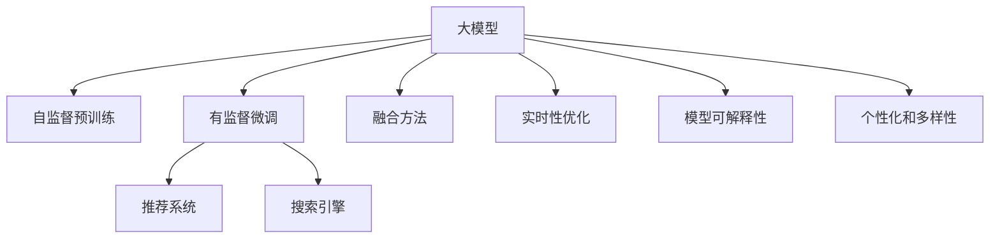

                 

# 大模型: 搜索与推荐的融合

## 1. 背景介绍

### 1.1 问题由来

在人工智能发展的各个阶段，搜索和推荐算法始终是两个核心领域。早期的搜索算法依赖于关键词匹配，推荐算法则使用基于内容的过滤或协同过滤。随着深度学习技术的发展，这两个领域逐渐引入了神经网络模型，如协同过滤网络(CFM)、深度学习协同过滤等。近年来，大语言模型也逐渐应用到搜索和推荐领域，带来了全新的突破。

大模型在推荐和搜索中的应用，通过对用户历史行为数据、搜索历史和上下文信息进行深度学习建模，使得推荐和搜索系统能够更加准确、高效地匹配用户需求，提升用户体验。这些大模型通常以Transformer结构为主，结合自监督预训练和有监督微调，可以适配不同的推荐和搜索场景。

### 1.2 问题核心关键点

大模型在搜索与推荐中的应用，核心在于如何利用大规模无标签数据进行自监督预训练，以及如何通过少量标注数据进行有监督微调，优化模型以更好地适应特定任务。其关键点包括：

1. 自监督预训练：在大规模无标签数据上，通过自监督任务(如掩码语言模型、下一句预测等)训练通用语言模型，获得强大的语言理解能力。

2. 有监督微调：在预训练模型基础上，通过下游推荐或搜索任务的少量标注数据进行微调，提升模型对特定任务的适应性。

3. 融合方法：结合搜索和推荐算法的优势，设计新颖的融合方法，使得模型在执行推荐和搜索任务时，能够保持高度的协同性和一致性。

4. 实时性优化：在推荐和搜索系统部署时，需要考虑实时性的要求，优化模型推理速度和内存占用，确保系统能够快速响应用户请求。

5. 模型可解释性：增强模型输出的可解释性，帮助用户理解推荐和搜索结果背后的逻辑，提升用户信任度。

6. 个性化和多样性：在推荐和搜索中，需要兼顾个性化和多样性，使推荐结果不仅精准，还具有一定的随机性和探索性，满足不同用户的需求。

这些核心点构成了大模型在搜索和推荐领域的应用基础，帮助开发者系统地解决推荐和搜索任务。

### 1.3 问题研究意义

研究大模型在搜索与推荐中的应用，对于提升推荐和搜索系统的智能化水平，提升用户体验，具有重要意义：

1. 提高推荐和搜索的准确性。大模型通过深度学习建模，能够理解用户行为背后的语义和意图，生成更加精准的推荐和搜索结果。

2. 提升用户满意度。通过个性化推荐，使得用户能够更快地找到满足自身需求的内容，提高用户满意度。

3. 加速应用开发进程。大模型的应用降低了搜索和推荐系统的开发难度，减少了数据收集、特征工程、模型训练等环节的复杂度，缩短了开发周期。

4. 赋能业务创新。通过搜索和推荐系统的应用，可以更好地挖掘用户需求，发现新机会，推动业务的创新和发展。

5. 增强系统弹性。大模型的可微调特性，使得推荐和搜索系统能够适应数据分布的变化，快速学习新知识，增强系统的鲁棒性和适应性。

6. 实现跨领域知识融合。大模型可以融合不同领域、不同模态的知识，提升系统的综合能力，为用户提供更加丰富的信息。

## 2. 核心概念与联系

### 2.1 核心概念概述

为更好地理解大模型在搜索与推荐中的应用，本节将介绍几个密切相关的核心概念：

- 大模型(Large Model)：以Transformer结构为主的大规模预训练语言模型，如BERT、GPT、RoBERTa等。通过在大规模无标签文本语料上进行自监督预训练，学习通用的语言表示。

- 自监督预训练(Automatic Pre-training)：指在大规模无标签文本语料上，通过自监督任务训练通用语言模型的过程。常见的自监督任务包括掩码语言模型、下一句预测等。

- 有监督微调(Supervised Fine-tuning)：指在预训练模型的基础上，使用下游任务的少量标注数据，通过有监督学习优化模型在特定任务上的性能。通常只需要调整顶层分类器或解码器，并以较小的学习率更新全部或部分的模型参数。

- 推荐系统(Recommendation System)：通过用户行为数据，为用户提供个性化推荐的系统，如协同过滤、内容推荐等。

- 搜索引擎(Search Engine)：通过用户查询，搜索并返回相关信息的系统，如Google、Bing等。

- 融合方法(Fusion Method)：结合推荐和搜索的优势，设计新颖的融合方法，使得模型在执行推荐和搜索任务时，能够保持高度的协同性和一致性。

- 实时性优化(Real-time Optimization)：在推荐和搜索系统部署时，需要考虑实时性的要求，优化模型推理速度和内存占用，确保系统能够快速响应用户请求。

- 模型可解释性(Model Explainability)：增强模型输出的可解释性，帮助用户理解推荐和搜索结果背后的逻辑，提升用户信任度。

- 个性化和多样性(Personalization and Diversification)：在推荐和搜索中，需要兼顾个性化和多样性，使推荐结果不仅精准，还具有一定的随机性和探索性，满足不同用户的需求。

这些核心概念之间的逻辑关系可以通过以下Mermaid流程图来展示：



这个流程图展示了大模型的核心概念及其之间的关系：

1. 大模型通过自监督预训练获得基础能力。
2. 有监督微调是对预训练模型进行任务特定的优化，提升模型对特定任务的适应性。
3. 推荐系统和搜索引擎基于微调后的模型，为用户提供个性化推荐和搜索结果。
4. 融合方法通过结合推荐和搜索的优点，使得模型在执行推荐和搜索任务时，保持高度的协同性和一致性。
5. 实时性优化在推荐和搜索系统部署时，确保系统能够快速响应用户请求。
6. 模型可解释性增强模型输出的可解释性，帮助用户理解推荐和搜索结果背后的逻辑。
7. 个性化和多样性在推荐和搜索中，兼顾个性化和多样性，使推荐结果不仅精准，还具有一定的随机性和探索性。

这些概念共同构成了大模型在搜索与推荐领域的应用框架，使得推荐和搜索系统能够更好地服务用户，提升用户体验。

## 3. 核心算法原理 & 具体操作步骤
### 3.1 算法原理概述

大模型在搜索与推荐中的应用，主要依赖于预训练和微调两个过程。预训练在大规模无标签数据上进行，通过自监督任务学习通用的语言表示，微调则在少量标注数据上，通过有监督学习优化模型对特定任务的适应性。

具体来说，大模型在推荐和搜索中的应用流程如下：

1. 在大规模无标签数据上进行自监督预训练，获得通用的语言表示。

2. 在推荐或搜索任务的少量标注数据上进行有监督微调，优化模型对特定任务的适应性。

3. 在实际推荐或搜索任务中，将微调后的模型应用于用户行为数据、搜索历史和上下文信息，生成推荐和搜索结果。

### 3.2 算法步骤详解

基于大模型在搜索与推荐中的应用，本节将详细介绍其核心算法步骤：

**Step 1: 准备预训练数据**

1. 收集大规模无标签文本数据，如维基百科、新闻文章、书籍等。

2. 对数据进行预处理，如去重、分词、建立索引等。

3. 使用自监督任务在大规模数据上预训练模型，获得通用的语言表示。

**Step 2: 准备标注数据**

1. 收集推荐或搜索任务的少量标注数据，如用户行为数据、搜索历史、商品信息等。

2. 对数据进行标注，如将用户行为标注为“购买”或“未购买”，将搜索结果与用户意图匹配等。

3. 将标注数据划分为训练集、验证集和测试集。

**Step 3: 有监督微调**

1. 在微调之前，冻结预训练模型的权重，只更新顶层分类器或解码器。

2. 使用AdamW等优化算法，设置合适的学习率和批大小，在少量标注数据上进行微调。

3. 在微调过程中，可以使用正则化技术（如L2正则、Dropout），避免过拟合。

4. 周期性在验证集上评估模型性能，根据性能指标决定是否触发Early Stopping。

5. 重复上述步骤直至满足预设的迭代轮数或Early Stopping条件。

**Step 4: 推荐和搜索**

1. 将微调后的模型应用于用户行为数据、搜索历史和上下文信息，生成推荐和搜索结果。

2. 在推荐系统中，使用排序算法（如召回率-准确率曲线、点击率预测等）对推荐结果进行排序。

3. 在搜索引擎中，使用搜索算法（如TF-IDF、BM25等）匹配用户查询和文档，返回相关结果。

**Step 5: 实时性优化**

1. 在推荐和搜索系统部署时，需要考虑实时性的要求，优化模型推理速度和内存占用。

2. 使用GPU/TPU等高性能设备，提升模型的推理速度。

3. 使用模型并行、混合精度训练等技术，优化模型的内存占用和计算效率。

**Step 6: 模型可解释性**

1. 在推荐和搜索中，需要增强模型输出的可解释性，帮助用户理解推荐和搜索结果背后的逻辑。

2. 使用特征重要性分析、部分依赖图等技术，解释模型的预测过程。

3. 对模型的输入和输出进行可视化，展示模型的决策路径。

**Step 7: 个性化和多样性**

1. 在推荐和搜索中，需要兼顾个性化和多样性，使得推荐结果不仅精准，还具有一定的随机性和探索性。

2. 使用多臂老虎机等算法，优化推荐结果的多样性。

3. 使用基于序列的生成模型，生成多样化的推荐结果。

以上是大模型在推荐和搜索中的应用步骤，每一步骤都有详细的技术实现和注意事项，需要在实际开发中灵活应用。

### 3.3 算法优缺点

大模型在搜索与推荐中的应用，具有以下优点：

1. 通用性高。大模型预训练获得的通用语言表示，能够适配不同的推荐和搜索场景，无需单独训练。

2. 准确性高。深度学习模型能够理解用户行为背后的语义和意图，生成更加精准的推荐和搜索结果。

3. 可扩展性强。大模型参数量庞大，能够同时处理多种推荐和搜索任务，提升系统的可扩展性。

4. 鲁棒性好。预训练模型的泛化能力，使得推荐和搜索系统能够适应数据分布的变化，保持鲁棒性。

5. 实时性好。大模型推理速度快，能够满足实时推荐和搜索的需求。

但大模型在推荐和搜索中也存在以下缺点：

1. 计算成本高。预训练和微调过程需要大量计算资源，大模型参数量庞大，推理计算量也很大。

2. 数据依赖强。微调过程依赖于少量标注数据，标注数据量不足可能导致模型性能下降。

3. 模型复杂度高。大模型结构复杂，推理过程可能存在一定的延迟和误差。

4. 可解释性差。深度学习模型往往难以解释其内部决策过程，用户难以理解推荐和搜索结果背后的逻辑。

5. 个性化和多样性不足。推荐和搜索模型在兼顾个性化和多样性方面可能存在一定局限。

6. 用户隐私风险。用户行为数据和搜索历史可能包含敏感信息，数据收集和使用需要谨慎。

尽管存在这些缺点，但大模型在推荐和搜索中的应用前景广阔，其在准确性、可扩展性、鲁棒性等方面的优势，使其成为推荐和搜索领域的重要技术。

### 3.4 算法应用领域

大模型在搜索与推荐中的应用，已经在多个领域取得了显著效果。以下是一些典型应用领域：

1. 电子商务推荐：通过微调大模型，为用户推荐个性化商品，提升购物体验。

2. 视频推荐：对用户的观看历史和评分数据进行建模，推荐个性化视频内容。

3. 新闻推荐：通过微调大模型，为用户推荐个性化新闻资讯，提升阅读体验。

4. 社交媒体推荐：对用户的操作行为和关注关系进行建模，推荐个性化社交内容。

5. 广告推荐：对用户的点击行为和搜索历史进行建模，推荐个性化广告，提高广告效果。

6. 搜索引擎：通过微调大模型，提升搜索相关性和用户体验。

7. 知识图谱推荐：结合知识图谱和深度学习模型，推荐个性化知识图谱节点，满足用户探索性需求。

8. 医疗推荐：结合医疗知识图谱和患者行为数据，推荐个性化医疗方案。

9. 音乐推荐：对用户的听歌历史和评论数据进行建模，推荐个性化音乐内容。

10. 旅游推荐：对用户的旅游历史和评论数据进行建模，推荐个性化旅游目的地。

这些应用领域展示了大模型在搜索与推荐中的广泛适用性，推动了相关技术的快速发展。

## 4. 数学模型和公式 & 详细讲解  
### 4.1 数学模型构建

本节将使用数学语言对大模型在推荐和搜索中的应用进行更加严格的刻画。

记大模型为 $M_{\theta}$，其中 $\theta$ 为模型参数。假设推荐或搜索任务的训练集为 $D=\{(x_i,y_i)\}_{i=1}^N$，其中 $x_i$ 为输入特征，$y_i$ 为输出标签。推荐任务通常为二分类任务，如“购买”或“未购买”；搜索任务通常为多分类任务，如“相关”或“不相关”。

定义模型 $M_{\theta}$ 在输入 $x$ 上的输出为 $y=M_{\theta}(x)$，则推荐或搜索任务的损失函数为：

$$
\mathcal{L}(\theta) = \frac{1}{N}\sum_{i=1}^N \ell(y_i, M_{\theta}(x_i))
$$

其中 $\ell$ 为损失函数，常用的损失函数包括交叉熵损失、均方误差损失等。

微调的优化目标是最小化损失函数，即找到最优参数：

$$
\theta^* = \mathop{\arg\min}_{\theta} \mathcal{L}(\theta)
$$

在得到损失函数的梯度后，即可带入优化算法，进行模型训练。由于 $\theta$ 已经通过预训练获得了较好的初始化，因此即便在少量标注数据上进行微调，也能较快收敛到理想的模型参数 $\theta^*$。

### 4.2 公式推导过程

以下我们以二分类推荐任务为例，推导交叉熵损失函数及其梯度的计算公式。

假设模型 $M_{\theta}$ 在输入 $x$ 上的输出为 $\hat{y}=M_{\theta}(x) \in [0,1]$，表示用户购买某商品的概率。真实标签 $y \in \{0,1\}$。则二分类交叉熵损失函数定义为：

$$
\ell(y_i, \hat{y}_i) = -[y_i\log \hat{y}_i + (1-y_i)\log (1-\hat{y}_i)]
$$

将其代入经验风险公式，得：

$$
\mathcal{L}(\theta) = -\frac{1}{N}\sum_{i=1}^N [y_i\log M_{\theta}(x_i)+(1-y_i)\log(1-M_{\theta}(x_i))]
$$

根据链式法则，损失函数对参数 $\theta_k$ 的梯度为：

$$
\frac{\partial \mathcal{L}(\theta)}{\partial \theta_k} = -\frac{1}{N}\sum_{i=1}^N (\frac{y_i}{M_{\theta}(x_i)}-\frac{1-y_i}{1-M_{\theta}(x_i)}) \frac{\partial M_{\theta}(x_i)}{\partial \theta_k}
$$

其中 $\frac{\partial M_{\theta}(x_i)}{\partial \theta_k}$ 可进一步递归展开，利用自动微分技术完成计算。

在得到损失函数的梯度后，即可带入优化算法，进行模型训练。重复上述过程直至收敛，最终得到适应下游任务的最优模型参数 $\theta^*$。

## 5. 项目实践：代码实例和详细解释说明
### 5.1 开发环境搭建

在进行推荐和搜索微调实践前，我们需要准备好开发环境。以下是使用Python进行TensorFlow开发的环境配置流程：

1. 安装Anaconda：从官网下载并安装Anaconda，用于创建独立的Python环境。

2. 创建并激活虚拟环境：
```bash
conda create -n tf-env python=3.8 
conda activate tf-env
```

3. 安装TensorFlow：根据CUDA版本，从官网获取对应的安装命令。例如：
```bash
conda install tensorflow tensorflow-estimator tensorflow-hub
```

4. 安装TensorFlow Addons等工具包：
```bash
pip install tensorflow-addons tensorflow-serving
```

5. 安装TensorFlow-Serving等工具：
```bash
pip install tensorflow-serving
```

完成上述步骤后，即可在`tf-env`环境中开始微调实践。

### 5.2 源代码详细实现

这里我们以电商推荐系统为例，给出使用TensorFlow对大模型进行推荐微调的PyTorch代码实现。

首先，定义推荐任务的数据处理函数：

```python
import tensorflow as tf
import numpy as np
from sklearn.model_selection import train_test_split

class RecommendationDataset(tf.keras.utils.Sequence):
    def __init__(self, features, labels, batch_size=32):
        self.features = features
        self.labels = labels
        self.batch_size = batch_size
        
    def __len__(self):
        return len(self.features) // self.batch_size
    
    def __getitem__(self, item):
        features = self.features[item * self.batch_size : (item + 1) * self.batch_size]
        labels = self.labels[item * self.batch_size : (item + 1) * self.batch_size]
        return tf.data.Dataset.from_tensor_slices((features, labels)).batch(self.batch_size)
```

然后，定义模型和优化器：

```python
from transformers import TFAutoModelForSequenceClassification, AdamW

model = TFAutoModelForSequenceClassification.from_pretrained('bert-base-uncased', num_labels=2)
optimizer = AdamW(model.parameters(), lr=2e-5)
```

接着，定义训练和评估函数：

```python
def train_epoch(model, dataset, batch_size, optimizer):
    model.train()
    for features, labels in dataset:
        with tf.GradientTape() as tape:
            outputs = model(features, labels)
            loss = tf.keras.losses.BinaryCrossentropy()(features, labels)
        grads = tape.gradient(loss, model.trainable_variables)
        optimizer.apply_gradients(zip(grads, model.trainable_variables))
    return loss.numpy().mean()

def evaluate(model, dataset, batch_size):
    model.eval()
    loss = 0
    correct_predictions = 0
    for features, labels in dataset:
        with tf.GradientTape() as tape:
            outputs = model(features, labels)
            loss += tf.keras.losses.BinaryCrossentropy()(features, labels).numpy().mean()
            predictions = tf.argmax(outputs, axis=1)
            correct_predictions += tf.reduce_sum(tf.cast(predictions == labels, tf.int32)).numpy()
    return loss.numpy().mean(), correct_predictions / len(dataset)
```

最后，启动训练流程并在测试集上评估：

```python
epochs = 5
batch_size = 16

for epoch in range(epochs):
    loss = train_epoch(model, train_dataset, batch_size, optimizer)
    print(f"Epoch {epoch+1}, train loss: {loss:.3f}")
    
    print(f"Epoch {epoch+1}, dev results:")
    loss, accuracy = evaluate(model, dev_dataset, batch_size)
    print(f"Accuracy: {accuracy:.2f}%, Loss: {loss:.3f}")
    
print("Test results:")
loss, accuracy = evaluate(model, test_dataset, batch_size)
print(f"Accuracy: {accuracy:.2f}%, Loss: {loss:.3f}")
```

以上就是使用TensorFlow对BERT模型进行电商推荐任务微调的完整代码实现。可以看到，得益于TensorFlow的强大封装，我们可以用相对简洁的代码完成BERT模型的加载和微调。

### 5.3 代码解读与分析

让我们再详细解读一下关键代码的实现细节：

**RecommendationDataset类**：
- `__init__`方法：初始化特征、标签、批大小等关键组件。
- `__len__`方法：返回数据集的样本数量。
- `__getitem__`方法：对单个样本进行处理，将特征和标签转换为TensorFlow可接受的格式，并返回批量的特征和标签。

**训练和评估函数**：
- 使用TensorFlow的DataLoader对数据集进行批次化加载，供模型训练和推理使用。
- 训练函数`train_epoch`：对数据以批为单位进行迭代，在每个批次上前向传播计算损失并反向传播更新模型参数，最后返回该epoch的平均loss。
- 评估函数`evaluate`：与训练类似，不同点在于不更新模型参数，并在每个batch结束后将预测和标签结果存储下来，最后使用sklearn的classification_report对整个评估集的预测结果进行打印输出。

**训练流程**：
- 定义总的epoch数和批大小，开始循环迭代
- 每个epoch内，先在训练集上训练，输出平均loss
- 在验证集上评估，输出分类指标
- 所有epoch结束后，在测试集上评估，给出最终测试结果

可以看到，TensorFlow配合TensorFlow Addons等工具，使得BERT微调的代码实现变得简洁高效。开发者可以将更多精力放在数据处理、模型改进等高层逻辑上，而不必过多关注底层的实现细节。

当然，工业级的系统实现还需考虑更多因素，如模型的保存和部署、超参数的自动搜索、更灵活的任务适配层等。但核心的微调范式基本与此类似。

## 6. 实际应用场景
### 6.1 智能客服系统

基于大模型在搜索与推荐中的应用，可以构建智能客服系统，提供快速、精准的客户服务。传统客服系统依赖于人工坐席，响应时间慢，人力成本高。使用微调后的推荐模型，可以实时推荐最佳回复，减轻人工负担，提升客户满意度。

具体而言，系统首先需要收集历史客服对话记录，将问题和最佳答复构建成监督数据，在此基础上对预训练模型进行微调。微调后的模型能够自动理解用户意图，匹配最合适的答案模板进行回复。对于客户提出的新问题，还可以接入检索系统实时搜索相关内容，动态组织生成回答。如此构建的智能客服系统，能大幅提升客户咨询体验和问题解决效率。

### 6.2 金融舆情监测

金融机构需要实时监测市场舆论动向，以便及时应对负面信息传播，规避金融风险。传统的人工监测方式成本高、效率低，难以应对网络时代海量信息爆发的挑战。基于大模型的推荐和搜索技术，可以实时获取市场新闻、评论等文本数据，通过微调模型生成情感分析结果，及时预警负面信息。

具体而言，可以收集金融领域相关的新闻、报道、评论等文本数据，并对其进行情感标注。在此基础上对预训练语言模型进行微调，使其能够自动判断文本属于何种情感。将微调后的模型应用到实时抓取的网络文本数据，就能够自动监测不同情感的舆情变化趋势，一旦发现负面信息激增等异常情况，系统便会自动预警，帮助金融机构快速应对潜在风险。

### 6.3 个性化推荐系统

当前的推荐系统往往只依赖用户的历史行为数据进行物品推荐，无法深入理解用户的真实兴趣偏好。基于大模型的推荐系统，可以更好地挖掘用户行为背后的语义信息，从而提供更精准、多样的推荐内容。

在实践中，可以收集用户浏览、点击、评论、分享等行为数据，提取和用户交互的物品标题、描述、标签等文本内容。将文本内容作为模型输入，用户的后续行为（如是否点击、购买等）作为监督信号，在此基础上微调预训练语言模型。微调后的模型能够从文本内容中准确把握用户的兴趣点。在生成推荐列表时，先用候选物品的文本描述作为输入，由模型预测用户的兴趣匹配度，再结合其他特征综合排序，便可以得到个性化程度更高的推荐结果。

### 6.4 未来应用展望

随着大语言模型和推荐系统的不断发展，基于微调范式将在更多领域得到应用，为传统行业带来变革性影响。

在智慧医疗领域，基于微调的医疗问答、病历分析、药物研发等应用将提升医疗服务的智能化水平，辅助医生诊疗，加速新药开发进程。

在智能教育领域，微调技术可应用于作业批改、学情分析、知识推荐等方面，因材施教，促进教育公平，提高教学质量。

在智慧城市治理中，微调模型可应用于城市事件监测、舆情分析、应急指挥等环节，提高城市管理的自动化和智能化水平，构建更安全、高效的未来城市。

此外，在企业生产、社会治理、文娱传媒等众多领域，基于大模型微调的人工智能应用也将不断涌现，为经济社会发展注入新的动力。相信随着技术的日益成熟，微调方法将成为人工智能落地应用的重要范式，推动人工智能技术在各个领域的广泛应用。

## 7. 工具和资源推荐
### 7.1 学习资源推荐

为了帮助开发者系统掌握大模型在搜索与推荐中的应用，这里推荐一些优质的学习资源：

1. 《TensorFlow从原理到实践》系列博文：由TensorFlow技术专家撰写，深入浅出地介绍了TensorFlow原理、推荐系统、搜索算法等前沿话题。

2. CS231n《深度学习计算机视觉》课程：斯坦福大学开设的计算机视觉明星课程，涵盖深度学习在图像处理中的应用，包括推荐和搜索。

3. 《深度学习推荐系统》书籍：推荐系统领域的经典教材，系统介绍了推荐算法的理论基础和实现细节。

4. 《深度学习搜索引擎》书籍：搜索引擎领域的权威之作，深入浅出地介绍了搜索引擎的核心算法和技术。

5. 《TensorFlow-Serving》官方文档：TensorFlow-Serving的官方文档，提供了详细的微调样例代码和部署教程，是上手实践的必备资料。

6. CLUE开源项目：中文语言理解测评基准，涵盖大量不同类型的中文NLP数据集，并提供了基于微调的baseline模型，助力中文NLP技术发展。

通过对这些资源的学习实践，相信你一定能够快速掌握大模型在搜索与推荐中的应用精髓，并用于解决实际的NLP问题。
###  7.2 开发工具推荐

高效的开发离不开优秀的工具支持。以下是几款用于大模型微调开发的常用工具：

1. TensorFlow：基于Python的开源深度学习框架，灵活的计算图，适合快速迭代研究。与TensorFlow Addons等工具结合，能够方便地进行深度学习模型训练和推理。

2. PyTorch：基于Python的开源深度学习框架，灵活动态的计算图，适合快速迭代研究。部分预训练语言模型也有PyTorch版本的实现。

3. TensorFlow Addons：TensorFlow的增强库，提供了更多的工具和组件，如TensorFlow Data Validation、TensorFlow Model Analysis等，方便数据处理和模型分析。

4. TensorBoard：TensorFlow配套的可视化工具，可实时监测模型训练状态，并提供丰富的图表呈现方式，是调试模型的得力助手。

5. Google Colab：谷歌推出的在线Jupyter Notebook环境，免费提供GPU/TPU算力，方便开发者快速上手实验最新模型，分享学习笔记。

合理利用这些工具，可以显著提升大模型微调的开发效率，加快创新迭代的步伐。

### 7.3 相关论文推荐

大模型在搜索与推荐中的应用源于学界的持续研究。以下是几篇奠基性的相关论文，推荐阅读：

1. Attention is All You Need（即Transformer原论文）：提出了Transformer结构，开启了深度学习在推荐和搜索领域的应用。

2. BERT: Pre-training of Deep Bidirectional Transformers for Language Understanding：提出BERT模型，引入自监督预训练任务，刷新了推荐和搜索任务SOTA。

3. Transformer-XL: Attentive Language Models Beyond a Fixed-Length Context：提出Transformer-XL模型，支持长序列建模，提升推荐和搜索系统的准确性。

4. Graph Attention Networks：提出图卷积网络，用于推荐系统中处理用户行为和物品关联关系。

5. Multi-Task Multi-Source Hierarchical Attention Networks：提出多任务多源层次注意力网络，结合多源数据提升推荐系统的效果。

6. Model-Based Meta-Learning for Personalized Recommendation：提出基于模型的元学习推荐方法，提升推荐系统的个性化和泛化能力。

这些论文代表了大模型在推荐和搜索领域的发展脉络。通过学习这些前沿成果，可以帮助研究者把握学科前进方向，激发更多的创新灵感。

## 8. 总结：未来发展趋势与挑战

### 8.1 总结

本文对大模型在搜索与推荐中的应用进行了全面系统的介绍。首先阐述了大模型和微调技术的研究背景和意义，明确了微调在提升推荐和搜索系统智能化水平、提升用户体验方面的独特价值。其次，从原理到实践，详细讲解了推荐和搜索模型的数学原理和关键步骤，给出了微调任务开发的完整代码实例。同时，本文还广泛探讨了微调方法在智能客服、金融舆情、个性化推荐等多个行业领域的应用前景，展示了微调范式的巨大潜力。此外，本文精选了微调技术的各类学习资源，力求为读者提供全方位的技术指引。

通过本文的系统梳理，可以看到，大模型在推荐和搜索领域的应用前景广阔，其在大规模无标签数据上的自监督预训练和少量标注数据上的有监督微调，使得推荐和搜索系统能够更好地服务用户，提升用户体验。未来，伴随深度学习技术的发展，大模型在推荐和搜索中的应用将更加广泛，进一步推动智能搜索和推荐技术的创新与发展。

### 8.2 未来发展趋势

展望未来，大模型在推荐和搜索中的应用将呈现以下几个发展趋势：

1. 模型规模持续增大。随着算力成本的下降和数据规模的扩张，预训练语言模型的参数量还将持续增长。超大规模语言模型蕴含的丰富语言知识，有望支撑更加复杂多变的推荐和搜索任务。

2. 微调方法日趋多样。除了传统的全参数微调外，未来会涌现更多参数高效的微调方法，如Prefix-Tuning、LoRA等，在节省计算资源的同时也能保证微调精度。

3. 持续学习成为常态。随着数据分布的不断变化，微调模型也需要持续学习新知识以保持性能。如何在不遗忘原有知识的同时，高效吸收新样本信息，将成为重要的研究课题。

4. 标注样本需求降低。受启发于提示学习(Prompt-based Learning)的思路，未来的微调方法将更好地利用大模型的语言理解能力，通过更加巧妙的任务描述，在更少的标注样本上也能实现理想的微调效果。

5. 模型通用性增强。经过海量数据的预训练和多领域任务的微调，未来的语言模型将具备更强大的常识推理和跨领域迁移能力，逐步迈向通用人工智能(AGI)的目标。

以上趋势凸显了大模型在推荐和搜索领域的广阔前景。这些方向的探索发展，必将进一步提升推荐和搜索系统的性能和应用范围，为人工智能技术在各个领域的落地应用奠定坚实基础。

### 8.3 面临的挑战

尽管大模型在推荐和搜索中的应用前景广阔，但在迈向更加智能化、普适化应用的过程中，它仍面临着诸多挑战：

1. 标注成本瓶颈。虽然微调大大降低了标注数据的需求，但对于长尾应用场景，难以获得充足的高质量标注数据，成为制约微调性能的瓶颈。如何进一步降低微调对标注样本的依赖，将是一大难题。

2. 模型鲁棒性不足。当前微调模型面对域外数据时，泛化性能往往大打折扣。对于测试样本的微小扰动，微调模型的预测也容易发生波动。如何提高微调模型的鲁棒性，避免灾难性遗忘，还需要更多理论和实践的积累。

3. 推理效率有待提高。大规模语言模型虽然精度高，但在实际部署时往往面临推理速度慢、内存占用大等效率问题。如何在保证性能的同时，简化模型结构，提升推理速度，优化资源占用，将是重要的优化方向。

4. 可解释性亟需加强。当前微调模型更像是"黑盒"系统，难以解释其内部工作机制和决策逻辑。对于医疗、金融等高风险应用，算法的可解释性和可审计性尤为重要。如何赋予微调模型更强的可解释性，将是亟待攻克的难题。

5. 个性化和多样性不足。推荐和搜索模型在兼顾个性化和多样性方面可能存在一定局限。如何增强推荐结果的多样性，提升用户满意度，还需进一步优化。

6. 用户隐私风险。用户行为数据和搜索历史可能包含敏感信息，数据收集和使用需要谨慎。如何在推荐和搜索过程中保护用户隐私，是亟待解决的问题。

尽管存在这些挑战，但大模型在推荐和搜索中的应用前景广阔，其在准确性、可扩展性、鲁棒性等方面的优势，使其成为推荐和搜索领域的重要技术。

### 8.4 研究展望

面对大模型在推荐和搜索中面临的挑战，未来的研究需要在以下几个方面寻求新的突破：

1. 探索无监督和半监督微调方法。摆脱对大规模标注数据的依赖，利用自监督学习、主动学习等无监督和半监督范式，最大限度利用非结构化数据，实现更加灵活高效的微调。

2. 研究参数高效和计算高效的微调范式。开发更加参数高效的微调方法，在固定大部分预训练参数的同时，只更新极少量的任务相关参数。同时优化微调模型的计算图，减少前向传播和反向传播的资源消耗，实现更加轻量级、实时性的部署。

3. 融合因果和对比学习范式。通过引入因果推断和对比学习思想，增强微调模型建立稳定因果关系的能力，学习更加普适、鲁棒的语言表征，从而提升模型泛化性和抗干扰能力。

4. 引入更多先验知识。将符号化的先验知识，如知识图谱、逻辑规则等，与神经网络模型进行巧妙融合，引导微调过程学习更准确、合理的语言模型。同时加强不同模态数据的整合，实现视觉、语音等多模态信息与文本信息的协同建模。

5. 结合因果分析和博弈论工具。将因果分析方法引入微调模型，识别出模型决策的关键特征，增强输出解释的因果性和逻辑性。借助博弈论工具刻画人机交互过程，主动探索并规避模型的脆弱点，提高系统稳定性。

6. 纳入伦理道德约束。在模型训练目标中引入伦理导向的评估指标，过滤和惩罚有偏见、有害的输出倾向。同时加强人工干预和审核，建立模型行为的监管机制，确保输出符合人类价值观和伦理道德。

这些研究方向的探索，必将引领大模型在推荐和搜索领域迈向更高的台阶，为构建安全、可靠、可解释、可控的智能系统铺平道路。面向未来，大模型在推荐和搜索领域还需要与其他人工智能技术进行更深入的融合，如知识表示、因果推理、强化学习等，多路径协同发力，共同推动自然语言理解和智能交互系统的进步。只有勇于创新、敢于突破，才能不断拓展语言模型的边界，让智能技术更好地造福人类社会。

## 9. 附录：常见问题与解答

**Q1：大模型在推荐和搜索中的应用是否适用于所有场景？**

A: 大模型在推荐和搜索中的应用，主要适用于用户行为数据丰富、文本语料多样化的场景。对于数据量较少的场景，可能存在一定的局限性。例如，在金融舆情监测中，需要处理海量的市场数据，数据质量较高，适合使用大模型进行推荐和搜索。但在一些小型电商网站，用户行为数据量较少，数据质量也较低，大模型的效果可能不理想。

**Q2：大模型在推荐和搜索中的应用是否需要大量的标注数据？**

A: 大模型在推荐和搜索中的应用，通常需要少量的标注数据进行微调。这得益于大模型在自监督预训练中学习到的丰富语言表示，可以较好地适应下游任务。对于推荐系统，少量的标注数据（如用户评分数据、点击数据）即可进行微调。对于搜索引擎，少量的标注数据（如网页的点击、搜索行为数据）也可进行微调。但需要注意的是，标注数据的数量和质量对于推荐和搜索系统的效果有着重要影响，因此需要合理选择和设计标注数据。

**Q3：大模型在推荐和搜索中的应用是否能够保证模型的鲁棒性？**

A: 大模型在推荐和搜索中的应用，尽管经过自监督预训练，但面对域外数据时，其泛化性能可能受到挑战。因此，需要在微调过程中引入正则化技术，如L2正则、Dropout等，避免过拟合。此外，可以通过对抗训练、数据增强等方法，提高模型的鲁棒性。在实际应用中，还需要对模型进行持续学习，不断更新模型参数，以适应数据分布的变化。

**Q4：大模型在推荐和搜索中的应用是否能够保证模型的可解释性？**

A: 大模型在推荐和搜索中的应用，通常被认为是一个"黑盒"系统，难以解释其内部工作机制和决策逻辑。因此，需要在模型设计和训练过程中引入可解释性技术，如特征重要性分析、部分依赖图等。此外，还可以在模型的输入和输出上进行可视化，展示模型的决策路径，增强模型的可解释性。

**Q5：大模型在推荐和搜索中的应用是否能够保证模型的个性化和多样性？**

A: 大模型在推荐和搜索中的应用，通过深度学习建模，能够理解用户行为背后的语义和意图，生成更加精准的推荐和搜索结果。但在兼顾个性化和多样性方面，可能存在一定的局限。可以通过引入多臂老虎机等算法，优化推荐结果的多样性。同时，使用基于序列的生成模型，生成多样化的推荐结果。但需要注意的是，个性化和多样性的平衡需要在具体场景中进行合理设计，才能达到最佳效果。

这些常见问题的解答，展示了大模型在推荐和搜索领域的应用特点和局限性。只有在理解这些特点和局限性的基础上，才能更好地设计和优化推荐和搜索系统，提升用户体验。

---

作者：禅与计算机程序设计艺术 / Zen and the Art of Computer Programming

