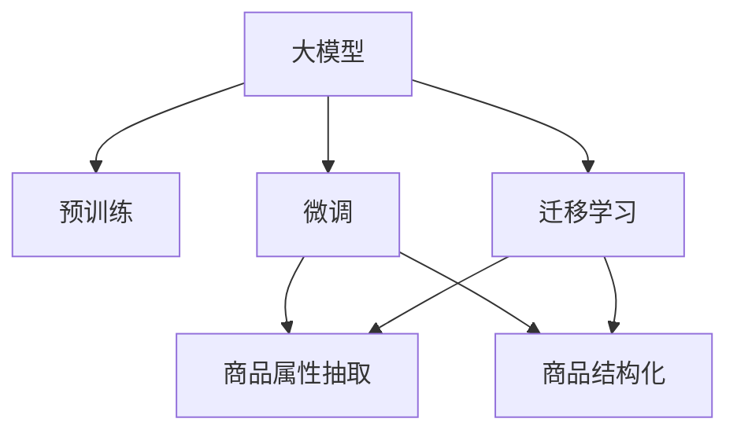

                 

# 大模型在商品属性抽取与结构化中的应用

## 1. 背景介绍

### 1.1 问题由来
近年来，随着电子商务平台的快速发展，商品信息的自动化抽取与结构化处理变得越来越重要。电商平台需要实时抓取海量商品数据，并进行分类、标注、排序等处理，以满足消费者的个性化需求，提升购物体验。然而，传统的基于规则或人工标注的方法，难以处理复杂的文本数据，且成本高昂、效率低下。

### 1.2 问题核心关键点
为了解决这一问题，大模型被广泛应用于商品属性抽取与结构化处理。具体来说，通过预训练语言模型对大量商品描述进行学习，利用迁移学习的方法将其应用到具体任务中，可以在较少的标注数据支持下，高效地抽取出商品的详细属性信息，并进行结构化表示。

### 1.3 问题研究意义
研究大模型在商品属性抽取与结构化中的应用，对于提升电商平台的数据处理效率、优化商品推荐算法、增强用户购物体验等方面具有重要意义：

1. 提升数据处理效率。大模型可以快速处理大规模文本数据，自动抽取和标注商品属性，大幅度降低人工标注成本。
2. 优化推荐算法。商品属性抽取与结构化可以提供更加准确、丰富的特征向量，提升推荐系统的效果和精度。
3. 增强购物体验。自动化、智能化的商品信息处理，可以提供更加个性化、精准的商品推荐和搜索结果，提升用户体验。
4. 促进电商平台智能化发展。大模型的应用可以推动电商平台的智能化转型，构建更加智能化的电商平台。

## 2. 核心概念与联系

### 2.1 核心概念概述

为更好地理解大模型在商品属性抽取与结构化中的应用，本节将介绍几个关键概念：

- 大模型(Large Model)：以自回归(如GPT)或自编码(如BERT)为代表的大规模预训练语言模型。通过在大规模文本语料上进行预训练，学习通用的语言表示，具备强大的语言理解和生成能力。
- 预训练(Pre-training)：指在大规模无标签文本语料上，通过自监督学习任务训练通用语言模型的过程。常见的预训练任务包括言语建模、掩码语言模型等。
- 迁移学习(Transfer Learning)：指将一个领域学习到的知识，迁移应用到另一个不同但相关的领域的学习范式。大模型的预训练-微调过程即是一种典型的迁移学习方式。
- 属性抽取(Attribute Extraction)：从文本数据中自动提取商品的详细信息，如名称、价格、尺寸、颜色等。通过迁移学习，预训练模型可以学习到通用的特征表示，用于抽取商品属性。
- 结构化(Structuring)：将文本数据转换为结构化的数据格式，便于后续处理和分析。结构化处理可以帮助电商平台更好地组织和管理商品信息。

这些核心概念之间的逻辑关系可以通过以下Mermaid流程图来展示：



这个流程图展示了大模型在商品属性抽取与结构化处理中的核心概念及其之间的关系：

1. 大模型通过预训练获得基础能力。
2. 微调将通用能力应用于特定任务，如商品属性抽取。
3. 迁移学习连接预训练模型与具体任务，实现从通用到特定的转换。
4. 属性抽取和结构化处理将预训练模型应用于实际商品信息处理，得到具体应用效果。

## 3. 核心算法原理 & 具体操作步骤
### 3.1 算法原理概述

大模型在商品属性抽取与结构化中的应用，本质上是一种迁移学习过程。其核心思想是：将预训练的大模型视作一个强大的"特征提取器"，通过在商品描述上微调，使得模型输出能够匹配商品属性的标签，从而自动抽取和结构化商品信息。

形式化地，假设预训练模型为 $M_{\theta}$，其中 $\theta$ 为预训练得到的模型参数。给定商品属性标签集 $\mathcal{Y}$，则微调的目标是找到新的模型参数 $\hat{\theta}$，使得：

$$
\hat{\theta}=\mathop{\arg\min}_{\theta} \mathcal{L}(M_{\theta},D)
$$

其中 $\mathcal{L}$ 为针对商品属性抽取任务的损失函数，用于衡量模型预测输出与真实标签之间的差异。常见的损失函数包括交叉熵损失、均方误差损失等。

通过梯度下降等优化算法，微调过程不断更新模型参数 $\theta$，最小化损失函数 $\mathcal{L}$，使得模型输出逼近真实标签。由于 $\theta$ 已经通过预训练获得了较好的初始化，因此即便在少量标注数据支持下，也能较快收敛到理想的模型参数 $\hat{\theta}$。

### 3.2 算法步骤详解

大模型在商品属性抽取与结构化中的应用，一般包括以下几个关键步骤：

**Step 1: 准备预训练模型和数据集**
- 选择合适的预训练语言模型 $M_{\theta}$ 作为初始化参数，如 BERT、GPT 等。
- 准备商品属性标签集 $\mathcal{Y}$，如商品名称、价格、尺寸等。
- 收集商品描述文本数据集 $D=\{x_i\}_{i=1}^N$，并进行初步的清洗和预处理。

**Step 2: 添加任务适配层**
- 根据任务类型，在预训练模型顶层设计合适的输出层和损失函数。
- 对于分类任务，通常在顶层添加线性分类器和交叉熵损失函数。
- 对于生成任务，通常使用语言模型的解码器输出概率分布，并以负对数似然为损失函数。

**Step 3: 设置微调超参数**
- 选择合适的优化算法及其参数，如 AdamW、SGD 等，设置学习率、批大小、迭代轮数等。
- 设置正则化技术及强度，包括权重衰减、Dropout、Early Stopping等。
- 确定冻结预训练参数的策略，如仅微调顶层，或全部参数都参与微调。

**Step 4: 执行梯度训练**
- 将商品描述数据分批次输入模型，前向传播计算损失函数。
- 反向传播计算参数梯度，根据设定的优化算法和学习率更新模型参数。
- 周期性在验证集上评估模型性能，根据性能指标决定是否触发 Early Stopping。
- 重复上述步骤直到满足预设的迭代轮数或 Early Stopping 条件。

**Step 5: 测试和部署**
- 在测试集上评估微调后模型 $M_{\hat{\theta}}$ 的性能，对比微调前后的精度提升。
- 使用微调后的模型对新商品描述进行推理预测，将其自动抽取和结构化后的结果集成到电商平台中。
- 持续收集新的商品数据，定期重新微调模型，以适应数据分布的变化。

以上是商品属性抽取与结构化处理的大模型微调流程。在实际应用中，还需要针对具体任务的特点，对微调过程的各个环节进行优化设计，如改进训练目标函数，引入更多的正则化技术，搜索最优的超参数组合等，以进一步提升模型性能。

### 3.3 算法优缺点

大模型在商品属性抽取与结构化中的应用具有以下优点：
1. 快速高效。利用预训练模型的高效特征提取能力，可以在较少的标注数据支持下，高效抽取商品属性。
2. 鲁棒性强。通过微调，模型能够自适应不同商品描述的语义变化，对噪声数据有一定的鲁棒性。
3. 准确度高。预训练模型具备强大的语言理解能力，能够自动学习到商品属性之间的内在关联。
4. 可扩展性强。模型可适用于多种商品属性抽取任务，只需设计不同的任务适配层。

同时，该方法也存在一些局限性：
1. 依赖标注数据。商品属性抽取仍然需要标注数据支持，特别是在新商品或小规模数据集上效果可能不佳。
2. 过拟合风险。当训练数据较少时，微调模型可能出现过拟合，泛化能力下降。
3. 数据质量要求高。商品描述文本中存在大量噪声，影响模型效果。
4. 模型参数量大。大模型通常需要较大的内存和计算资源，特别是在处理大规模商品数据时。

尽管存在这些局限性，但大模型在商品属性抽取与结构化处理中的应用已经取得了显著效果，成为电商平台自动化数据处理的重要手段。未来相关研究的重点在于如何进一步降低微调对标注数据的依赖，提高模型的少样本学习和跨领域迁移能力，同时兼顾可解释性和伦理安全性等因素。

### 3.4 算法应用领域

大模型在商品属性抽取与结构化处理中的应用，已经在诸多电商平台上得到了广泛的应用，具体如下：

1. 商品推荐系统：通过抽取商品属性，生成更加精准、多样化的推荐结果。例如，在搜索结果页上自动生成商品名称、价格、评价等相关信息，提升用户体验。

2. 商品分类系统：利用商品属性进行商品分类和搜索，提高搜索效率和准确性。例如，通过属性信息建立商品索引，实现快速搜索和商品关联推荐。

3. 价格优化系统：自动抽取商品价格，进行价格分析和优化，以期获得更高的销售额。例如，通过商品属性信息分析价格变化趋势，调整定价策略。

4. 质量监控系统：自动化地抽取商品描述中的关键词、质量评价等，监控商品质量，提升平台信誉。例如，利用属性信息识别假冒伪劣商品，屏蔽不良信息。

5. 库存管理：抽取商品属性信息，实现库存自动更新，提高库存管理效率。例如，通过商品描述中的尺寸、颜色等信息，进行自动补货和库存优化。

除了上述这些经典应用外，大模型还可以用于市场分析、风险评估、客户画像等多个领域，为电商平台提供全面的智能支持。随着大模型技术的不断进步，相信商品属性抽取与结构化处理将进一步拓展应用场景，为电商平台的智能化转型带来新的机遇。

## 4. 数学模型和公式 & 详细讲解  
### 4.1 数学模型构建

本节将使用数学语言对商品属性抽取与结构化处理的微调过程进行更加严格的刻画。

记预训练语言模型为 $M_{\theta}$，其中 $\theta$ 为模型参数。假设商品属性标签集为 $\mathcal{Y}$，则微调的目标是找到最优参数：

$$
\hat{\theta} = \mathop{\arg\min}_{\theta} \mathcal{L}(M_{\theta}, D)
$$

其中 $\mathcal{L}$ 为针对商品属性抽取任务的损失函数，用于衡量模型预测输出与真实标签之间的差异。假设每个商品描述 $x_i$ 对应的属性标签为 $y_i \in \mathcal{Y}$，则损失函数可以表示为：

$$
\mathcal{L}(M_{\theta}, D) = -\frac{1}{N} \sum_{i=1}^N \ell(M_{\theta}(x_i), y_i)
$$

常见的损失函数包括交叉熵损失和均方误差损失。对于分类任务，假设 $M_{\theta}(x_i)$ 输出 $P_{\theta}(x_i)$ 的概率分布，则交叉熵损失可以表示为：

$$
\ell(M_{\theta}(x_i), y_i) = -y_i \log P_{\theta}(x_i|y_i)
$$

对于生成任务，假设 $M_{\theta}(x_i)$ 输出一个向量 $z$，则均方误差损失可以表示为：

$$
\ell(M_{\theta}(x_i), y_i) = ||M_{\theta}(x_i) - y_i||_2^2
$$

在得到损失函数后，即可带入参数更新公式，完成模型的迭代优化。重复上述过程直至收敛，最终得到适应商品属性抽取任务的最优模型参数 $\hat{\theta}$。

### 4.2 公式推导过程

以下我们以商品名称抽取为例，推导交叉熵损失函数及其梯度的计算公式。

假设模型 $M_{\theta}$ 在输入 $x_i$ 上的输出为 $P_{\theta}(x_i|y_i)$，表示商品描述 $x_i$ 属于属性 $y_i$ 的概率。真实标签 $y_i \in \mathcal{Y}$。则交叉熵损失函数定义为：

$$
\ell(M_{\theta}(x_i), y_i) = -y_i \log P_{\theta}(x_i|y_i)
$$

将其代入损失函数，得：

$$
\mathcal{L}(\theta) = -\frac{1}{N}\sum_{i=1}^N y_i \log P_{\theta}(x_i|y_i)
$$

根据链式法则，损失函数对参数 $\theta_k$ 的梯度为：

$$
\frac{\partial \mathcal{L}(\theta)}{\partial \theta_k} = -\frac{1}{N}\sum_{i=1}^N \frac{y_i}{P_{\theta}(x_i|y_i)} \frac{\partial P_{\theta}(x_i|y_i)}{\partial \theta_k}
$$

其中 $\frac{\partial P_{\theta}(x_i|y_i)}{\partial \theta_k}$ 可进一步递归展开，利用自动微分技术完成计算。

在得到损失函数的梯度后，即可带入参数更新公式，完成模型的迭代优化。重复上述过程直至收敛，最终得到适应商品属性抽取任务的最优模型参数 $\hat{\theta}$。

## 5. 项目实践：代码实例和详细解释说明
### 5.1 开发环境搭建

在进行微调实践前，我们需要准备好开发环境。以下是使用Python进行PyTorch开发的环境配置流程：

1. 安装Anaconda：从官网下载并安装Anaconda，用于创建独立的Python环境。

2. 创建并激活虚拟环境：
```bash
conda create -n pytorch-env python=3.8 
conda activate pytorch-env
```

3. 安装PyTorch：根据CUDA版本，从官网获取对应的安装命令。例如：
```bash
conda install pytorch torchvision torchaudio cudatoolkit=11.1 -c pytorch -c conda-forge
```

4. 安装Transformers库：
```bash
pip install transformers
```

5. 安装各类工具包：
```bash
pip install numpy pandas scikit-learn matplotlib tqdm jupyter notebook ipython
```

完成上述步骤后，即可在`pytorch-env`环境中开始微调实践。

### 5.2 源代码详细实现

这里我们以商品名称抽取为例，给出使用Transformers库对BERT模型进行微调的PyTorch代码实现。

首先，定义商品属性抽取任务的数据处理函数：

```python
from transformers import BertTokenizer
from torch.utils.data import Dataset
import torch

class ProductDataset(Dataset):
    def __init__(self, texts, tags, tokenizer, max_len=128):
        self.texts = texts
        self.tags = tags
        self.tokenizer = tokenizer
        self.max_len = max_len
        
    def __len__(self):
        return len(self.texts)
    
    def __getitem__(self, item):
        text = self.texts[item]
        tags = self.tags[item]
        
        encoding = self.tokenizer(text, return_tensors='pt', max_length=self.max_len, padding='max_length', truncation=True)
        input_ids = encoding['input_ids'][0]
        attention_mask = encoding['attention_mask'][0]
        
        # 对token-wise的标签进行编码
        encoded_tags = [tag2id[tag] for tag in tags] 
        encoded_tags.extend([tag2id['O']] * (self.max_len - len(encoded_tags)))
        labels = torch.tensor(encoded_tags, dtype=torch.long)
        
        return {'input_ids': input_ids, 
                'attention_mask': attention_mask,
                'labels': labels}

# 标签与id的映射
tag2id = {'O': 0, 'NAME': 1}
id2tag = {v: k for k, v in tag2id.items()}

# 创建dataset
tokenizer = BertTokenizer.from_pretrained('bert-base-cased')

train_dataset = ProductDataset(train_texts, train_tags, tokenizer)
dev_dataset = ProductDataset(dev_texts, dev_tags, tokenizer)
test_dataset = ProductDataset(test_texts, test_tags, tokenizer)
```

然后，定义模型和优化器：

```python
from transformers import BertForTokenClassification, AdamW

model = BertForTokenClassification.from_pretrained('bert-base-cased', num_labels=len(tag2id))

optimizer = AdamW(model.parameters(), lr=2e-5)
```

接着，定义训练和评估函数：

```python
from torch.utils.data import DataLoader
from tqdm import tqdm
from sklearn.metrics import classification_report

device = torch.device('cuda') if torch.cuda.is_available() else torch.device('cpu')
model.to(device)

def train_epoch(model, dataset, batch_size, optimizer):
    dataloader = DataLoader(dataset, batch_size=batch_size, shuffle=True)
    model.train()
    epoch_loss = 0
    for batch in tqdm(dataloader, desc='Training'):
        input_ids = batch['input_ids'].to(device)
        attention_mask = batch['attention_mask'].to(device)
        labels = batch['labels'].to(device)
        model.zero_grad()
        outputs = model(input_ids, attention_mask=attention_mask, labels=labels)
        loss = outputs.loss
        epoch_loss += loss.item()
        loss.backward()
        optimizer.step()
    return epoch_loss / len(dataloader)

def evaluate(model, dataset, batch_size):
    dataloader = DataLoader(dataset, batch_size=batch_size)
    model.eval()
    preds, labels = [], []
    with torch.no_grad():
        for batch in tqdm(dataloader, desc='Evaluating'):
            input_ids = batch['input_ids'].to(device)
            attention_mask = batch['attention_mask'].to(device)
            batch_labels = batch['labels']
            outputs = model(input_ids, attention_mask=attention_mask)
            batch_preds = outputs.logits.argmax(dim=2).to('cpu').tolist()
            batch_labels = batch_labels.to('cpu').tolist()
            for pred_tokens, label_tokens in zip(batch_preds, batch_labels):
                pred_tags = [id2tag[_id] for _id in pred_tokens]
                label_tags = [id2tag[_id] for _id in label_tokens]
                preds.append(pred_tags[:len(label_tokens)])
                labels.append(label_tags)
                
    print(classification_report(labels, preds))
```

最后，启动训练流程并在测试集上评估：

```python
epochs = 5
batch_size = 16

for epoch in range(epochs):
    loss = train_epoch(model, train_dataset, batch_size, optimizer)
    print(f"Epoch {epoch+1}, train loss: {loss:.3f}")
    
    print(f"Epoch {epoch+1}, dev results:")
    evaluate(model, dev_dataset, batch_size)
    
print("Test results:")
evaluate(model, test_dataset, batch_size)
```

以上就是使用PyTorch对BERT进行商品名称抽取的微调代码实现。可以看到，得益于Transformers库的强大封装，我们可以用相对简洁的代码完成BERT模型的加载和微调。

### 5.3 代码解读与分析

让我们再详细解读一下关键代码的实现细节：

**ProductDataset类**：
- `__init__`方法：初始化商品描述文本和标签、分词器等关键组件。
- `__len__`方法：返回数据集的样本数量。
- `__getitem__`方法：对单个样本进行处理，将商品描述文本输入编码为token ids，将标签编码为数字，并对其进行定长padding，最终返回模型所需的输入。

**tag2id和id2tag字典**：
- 定义了标签与数字id之间的映射关系，用于将token-wise的预测结果解码回真实的标签。

**训练和评估函数**：
- 使用PyTorch的DataLoader对数据集进行批次化加载，供模型训练和推理使用。
- 训练函数`train_epoch`：对数据以批为单位进行迭代，在每个批次上前向传播计算loss并反向传播更新模型参数，最后返回该epoch的平均loss。
- 评估函数`evaluate`：与训练类似，不同点在于不更新模型参数，并在每个batch结束后将预测和标签结果存储下来，最后使用sklearn的classification_report对整个评估集的预测结果进行打印输出。

**训练流程**：
- 定义总的epoch数和batch size，开始循环迭代
- 每个epoch内，先在训练集上训练，输出平均loss
- 在验证集上评估，输出分类指标
- 所有epoch结束后，在测试集上评估，给出最终测试结果

可以看到，PyTorch配合Transformers库使得BERT微调的代码实现变得简洁高效。开发者可以将更多精力放在数据处理、模型改进等高层逻辑上，而不必过多关注底层的实现细节。

当然，工业级的系统实现还需考虑更多因素，如模型的保存和部署、超参数的自动搜索、更灵活的任务适配层等。但核心的微调范式基本与此类似。

## 6. 实际应用场景
### 6.1 智能客服系统

基于大语言模型微调的对话技术，可以广泛应用于智能客服系统的构建。传统客服往往需要配备大量人力，高峰期响应缓慢，且一致性和专业性难以保证。而使用微调后的对话模型，可以7x24小时不间断服务，快速响应客户咨询，用自然流畅的语言解答各类常见问题。

在技术实现上，可以收集企业内部的历史客服对话记录，将问题和最佳答复构建成监督数据，在此基础上对预训练对话模型进行微调。微调后的对话模型能够自动理解用户意图，匹配最合适的答案模板进行回复。对于客户提出的新问题，还可以接入检索系统实时搜索相关内容，动态组织生成回答。如此构建的智能客服系统，能大幅提升客户咨询体验和问题解决效率。

### 6.2 金融舆情监测

金融机构需要实时监测市场舆论动向，以便及时应对负面信息传播，规避金融风险。传统的人工监测方式成本高、效率低，难以应对网络时代海量信息爆发的挑战。基于大语言模型微调的文本分类和情感分析技术，为金融舆情监测提供了新的解决方案。

具体而言，可以收集金融领域相关的新闻、报道、评论等文本数据，并对其进行主题标注和情感标注。在此基础上对预训练语言模型进行微调，使其能够自动判断文本属于何种主题，情感倾向是正面、中性还是负面。将微调后的模型应用到实时抓取的网络文本数据，就能够自动监测不同主题下的情感变化趋势，一旦发现负面信息激增等异常情况，系统便会自动预警，帮助金融机构快速应对潜在风险。

### 6.3 个性化推荐系统

当前的推荐系统往往只依赖用户的历史行为数据进行物品推荐，无法深入理解用户的真实兴趣偏好。基于大语言模型微调技术，个性化推荐系统可以更好地挖掘用户行为背后的语义信息，从而提供更精准、丰富的特征向量，提升推荐系统的效果和精度。

在实践中，可以收集用户浏览、点击、评论、分享等行为数据，提取和用户交互的物品标题、描述、标签等文本内容。将文本内容作为模型输入，用户的后续行为（如是否点击、购买等）作为监督信号，在此基础上微调预训练语言模型。微调后的模型能够从文本内容中准确把握用户的兴趣点。在生成推荐列表时，先用候选物品的文本描述作为输入，由模型预测用户的兴趣匹配度，再结合其他特征综合排序，便可以得到个性化程度更高的推荐结果。

### 6.4 未来应用展望

随着大语言模型微调技术的发展，基于微调范式将在更多领域得到应用，为传统行业带来变革性影响。

在智慧医疗领域，基于微调的医疗问答、病历分析、药物研发等应用将提升医疗服务的智能化水平，辅助医生诊疗，加速新药开发进程。

在智能教育领域，微调技术可应用于作业批改、学情分析、知识推荐等方面，因材施教，促进教育公平，提高教学质量。

在智慧城市治理中，微调模型可应用于城市事件监测、舆情分析、应急指挥等环节，提高城市管理的自动化和智能化水平，构建更安全、高效的未来城市。

此外，在企业生产、社会治理、文娱传媒等众多领域，基于大模型微调的人工智能应用也将不断涌现，为经济社会发展注入新的动力。相信随着技术的日益成熟，微调方法将成为人工智能落地应用的重要范式，推动人工智能技术在垂直行业的规模化落地。总之，微调需要开发者根据具体任务，不断迭代和优化模型、数据和算法，方能得到理想的效果。

## 7. 工具和资源推荐
### 7.1 学习资源推荐

为了帮助开发者系统掌握大模型微调的理论基础和实践技巧，这里推荐一些优质的学习资源：

1. 《Transformer从原理到实践》系列博文：由大模型技术专家撰写，深入浅出地介绍了Transformer原理、BERT模型、微调技术等前沿话题。

2. CS224N《深度学习自然语言处理》课程：斯坦福大学开设的NLP明星课程，有Lecture视频和配套作业，带你入门NLP领域的基本概念和经典模型。

3. 《Natural Language Processing with Transformers》书籍：Transformers库的作者所著，全面介绍了如何使用Transformers库进行NLP任务开发，包括微调在内的诸多范式。

4. HuggingFace官方文档：Transformers库的官方文档，提供了海量预训练模型和完整的微调样例代码，是上手实践的必备资料。

5. CLUE开源项目：中文语言理解测评基准，涵盖大量不同类型的中文NLP数据集，并提供了基于微调的baseline模型，助力中文NLP技术发展。

通过对这些资源的学习实践，相信你一定能够快速掌握大语言模型微调的精髓，并用于解决实际的NLP问题。
###  7.2 开发工具推荐

高效的开发离不开优秀的工具支持。以下是几款用于大语言模型微调开发的常用工具：

1. PyTorch：基于Python的开源深度学习框架，灵活动态的计算图，适合快速迭代研究。大部分预训练语言模型都有PyTorch版本的实现。

2. TensorFlow：由Google主导开发的开源深度学习框架，生产部署方便，适合大规模工程应用。同样有丰富的预训练语言模型资源。

3. Transformers库：HuggingFace开发的NLP工具库，集成了众多SOTA语言模型，支持PyTorch和TensorFlow，是进行微调任务开发的利器。

4. Weights & Biases：模型训练的实验跟踪工具，可以记录和可视化模型训练过程中的各项指标，方便对比和调优。与主流深度学习框架无缝集成。

5. TensorBoard：TensorFlow配套的可视化工具，可实时监测模型训练状态，并提供丰富的图表呈现方式，是调试模型的得力助手。

6. Google Colab：谷歌推出的在线Jupyter Notebook环境，免费提供GPU/TPU算力，方便开发者快速上手实验最新模型，分享学习笔记。

合理利用这些工具，可以显著提升大语言模型微调任务的开发效率，加快创新迭代的步伐。

### 7.3 相关论文推荐

大语言模型和微调技术的发展源于学界的持续研究。以下是几篇奠基性的相关论文，推荐阅读：

1. Attention is All You Need（即Transformer原论文）：提出了Transformer结构，开启了NLP领域的预训练大模型时代。

2. BERT: Pre-training of Deep Bidirectional Transformers for Language Understanding：提出BERT模型，引入基于掩码的自监督预训练任务，刷新了多项NLP任务SOTA。

3. Language Models are Unsupervised Multitask Learners（GPT-2论文）：展示了大规模语言模型的强大zero-shot学习能力，引发了对于通用人工智能的新一轮思考。

4. Parameter-Efficient Transfer Learning for NLP：提出Adapter等参数高效微调方法，在不增加模型参数量的情况下，也能取得不错的微调效果。

5. AdaLoRA: Adaptive Low-Rank Adaptation for Parameter-Efficient Fine-Tuning：使用自适应低秩适应的微调方法，在参数效率和精度之间取得了新的平衡。

这些论文代表了大语言模型微调技术的发展脉络。通过学习这些前沿成果，可以帮助研究者把握学科前进方向，激发更多的创新灵感。

## 8. 总结：未来发展趋势与挑战
### 8.1 总结

本文对大模型在商品属性抽取与结构化中的应用进行了全面系统的介绍。首先阐述了大模型和微调技术的研究背景和意义，明确了微调在拓展预训练模型应用、提升商品推荐算法效果等方面的独特价值。其次，从原理到实践，详细讲解了商品属性抽取与结构化处理的数学原理和关键步骤，给出了微调任务开发的完整代码实例。同时，本文还广泛探讨了微调方法在智能客服、金融舆情、个性化推荐等多个行业领域的应用前景，展示了微调范式的巨大潜力。此外，本文精选了微调技术的各类学习资源，力求为读者提供全方位的技术指引。

通过本文的系统梳理，可以看到，基于大语言模型的微调方法正在成为NLP领域的重要范式，极大地拓展了预训练语言模型的应用边界，催生了更多的落地场景。受益于大规模语料的预训练，微调模型以更低的时间和标注成本，在小样本条件下也能取得理想的微调效果，有力推动了NLP技术的产业化进程。未来，伴随预训练语言模型和微调方法的持续演进，相信NLP技术将在更广阔的应用领域大放异彩，深刻影响人类的生产生活方式。

### 8.2 未来发展趋势

展望未来，大模型在商品属性抽取与结构化处理中的应用将呈现以下几个发展趋势：

1. 模型规模持续增大。随着算力成本的下降和数据规模的扩张，预训练语言模型的参数量还将持续增长。超大规模语言模型蕴含的丰富语言知识，有望支撑更加复杂多变的商品属性抽取任务。

2. 微调方法日趋多样。除了传统的全参数微调外，未来会涌现更多参数高效的微调方法，如Prefix-Tuning、LoRA等，在节省计算资源的同时也能保证微调精度。

3. 持续学习成为常态。随着数据分布的不断变化，微调模型也需要持续学习新知识以保持性能。如何在不遗忘原有知识的同时，高效吸收新样本信息，将成为重要的研究课题。

4. 标注样本需求降低。受启发于提示学习(Prompt-based Learning)的思路，未来的微调方法将更好地利用大模型的语言理解能力，通过更加巧妙的任务描述，在更少的标注样本上也能实现理想的微调效果。

5. 数据质量要求降低。大模型能够自动学习到商品描述中的关键特征，对噪声数据具有一定的鲁棒性，降低了对数据质量的依赖。

6. 多模态微调崛起。未来的微调方法将不仅限于文本数据，还将拓展到图像、视频、语音等多模态数据的抽取和结构化，实现跨模态的智能融合。

以上趋势凸显了大模型在商品属性抽取与结构化处理中的广阔前景。这些方向的探索发展，必将进一步提升NLP系统的性能和应用范围，为电商平台的智能化转型带来新的机遇。

### 8.3 面临的挑战

尽管大模型在商品属性抽取与结构化处理中的应用已经取得了显著效果，但在迈向更加智能化、普适化应用的过程中，它仍面临着诸多挑战：

1. 标注成本瓶颈。尽管微调大幅度降低了标注数据的需求，但对于长尾应用场景，难以获得充足的高质量标注数据，成为制约微调性能的瓶颈。如何进一步降低微调对标注样本的依赖，将是一大难题。

2. 模型鲁棒性不足。当前微调模型面对域外数据时，泛化性能往往大打折扣。对于测试样本的微小扰动，微调模型的预测也容易发生波动。如何提高微调模型的鲁棒性，避免灾难性遗忘，还需要更多理论和实践的积累。

3. 推理效率有待提高。大规模语言模型虽然精度高，但在实际部署时往往面临推理速度慢、内存占用大等效率问题。如何在保证性能的同时，简化模型结构，提升推理速度，优化资源占用，将是重要的优化方向。

4. 可解释性亟需加强。当前微调模型更像是"黑盒"系统，难以解释其内部工作机制和决策逻辑。对于医疗、金融等高风险应用，算法的可解释性和可审计性尤为重要。如何赋予微调模型更强的可解释性，将是亟待攻克的难题。

5. 安全性有待保障。预训练语言模型难免会学习到有偏见、有害的信息，通过微调传递到下游任务，产生误导性、歧视性的输出，给实际应用带来安全隐患。如何从数据和算法层面消除模型偏见，避免恶意用途，确保输出的安全性，也将是重要的研究课题。

6. 知识整合能力不足。现有的微调模型往往局限于任务内数据，难以灵活吸收和运用更广泛的先验知识。如何让微调过程更好地与外部知识库、规则库等专家知识结合，形成更加全面、准确的信息整合能力，还有很大的想象空间。

正视微调面临的这些挑战，积极应对并寻求突破，将是大模型在商品属性抽取与结构化处理中走向成熟的必由之路。相信随着学界和产业界的共同努力，这些挑战终将一一被克服，大模型将更好地服务于电商平台的智能化转型。

### 8.4 未来突破

面对大模型在商品属性抽取与结构化处理中面临的挑战，未来的研究需要在以下几个方面寻求新的突破：

1. 探索无监督和半监督微调方法。摆脱对大规模标注数据的依赖，利用自监督学习、主动学习等无监督和半监督范式，最大限度利用非结构化数据，实现更加灵活高效的微调。

2. 研究参数高效和计算高效的微调范式。开发更加参数高效的微调方法，在固定大部分预训练参数的同时，只更新极少量的任务相关参数。同时优化微调模型的计算图，减少前向传播和反向传播的资源消耗，实现更加轻量级、实时性的部署。

3. 引入更多先验知识。将符号化的先验知识，如知识图谱、逻辑规则等，与神经网络模型进行巧妙融合，引导微调过程学习更准确、合理的语言模型。同时加强不同模态数据的整合，实现视觉、语音等多模态信息与文本信息的协同建模。

4. 结合因果分析和博弈论工具。将因果分析方法引入微调模型，识别出模型决策的关键特征，增强输出解释的因果性和逻辑性。借助博弈论工具刻画人机交互过程，主动探索并规避模型的脆弱点，提高系统稳定性。

5. 纳入伦理道德约束。在模型训练目标中引入伦理导向的评估指标，过滤和惩罚有偏见、有害的输出倾向。同时加强人工干预和审核，建立模型行为的监管机制，确保输出符合人类价值观和伦理道德。

这些研究方向的探索，必将引领大语言模型微调技术迈向更高的台阶，为构建安全、可靠、可解释、可控的智能系统铺平道路。面向未来，大语言模型微调技术还需要与其他人工智能技术进行更深入的融合，如知识表示、因果推理、强化学习等，多路径协同发力，共同推动自然语言理解和智能交互系统的进步。只有勇于创新、敢于突破，才能不断拓展语言模型的边界，让智能技术更好地造福人类社会。

## 9. 附录：常见问题与解答
----------------------------------------------------------------
> 关键词：大语言模型,微调,Fine-tuning,迁移学习,Transformer,BERT,预训练,下游任务,参数高效微调,自然语言处理(NLP)

**Q1：大模型在商品属性抽取与结构化中的应用是否仅限于文本数据？**

A: 虽然本文主要介绍大模型在商品属性抽取与结构化处理中的应用，但大模型的应用并不仅限于文本数据。实际上，大模型还可以应用于图像、视频、音频等多模态数据的抽取和结构化。例如，利用图像描述自动抽取商品属性，或将视频中的商品信息转换为结构化格式。通过多模态融合，可以构建更加全面、精准的商品信息模型。

**Q2：微调过程是否需要大规模标注数据支持？**

A: 传统微调方法确实需要大规模标注数据支持，但基于提示学习的微调方法可以在较少的标注数据下，仍然获得较好的效果。例如，通过精心设计的输入模板，引导大模型自动抽取商品属性，而无需手动标注。这种方法在处理长尾商品属性抽取时尤为有效。

**Q3：微调后的模型是否具有跨领域迁移能力？**

A: 微调后的模型在一定程度上具备跨领域迁移能力。通过迁移学习，大模型可以在不同领域数据上微调，提取通用的特征表示。但需要注意的是，领域差异较大的情况下，微调效果可能不佳。因此，在进行跨领域微调时，还需考虑领域适应性问题。

**Q4：微调过程中如何处理商品描述中的噪声数据？**

A: 商品描述中往往包含大量噪声数据，如拼写错误、语义模糊等。为了提高模型鲁棒性，可以采用以下方法：
1. 数据清洗：对文本进行预处理，去除明显的噪声数据。
2. 异常检测：使用异常检测算法，识别并过滤异常数据。
3. 正则化：在损失函数中加入正则项，约束模型的输出。
4. 对抗训练：引入对抗样本，训练模型对噪声数据具有一定抵抗能力。
5. 多模型集成：训练多个微调模型，取平均输出，抑制噪声数据的影响。

这些方法可以结合使用，进一步提高模型的鲁棒性和准确性。

**Q5：微调后模型如何部署到电商平台上？**

A: 微调后模型的部署需要考虑以下几个因素：
1. 模型裁剪：去除不必要的层和参数，减小模型尺寸，加快推理速度。
2. 量化加速：将浮点模型转为定点模型，压缩存储空间，提高计算效率。
3. 服务化封装：将模型封装为标准化服务接口，便于集成调用。
4. 弹性伸缩：根据请求流量动态调整资源配置，平衡服务质量和成本。
5. 监控告警：实时采集系统指标，设置异常告警阈值，确保服务稳定性。

合理利用这些技术，可以确保微调模型在电商平台上稳定运行，提供高效、可靠的服务。

---

作者：禅与计算机程序设计艺术 / Zen and the Art of Computer Programming

