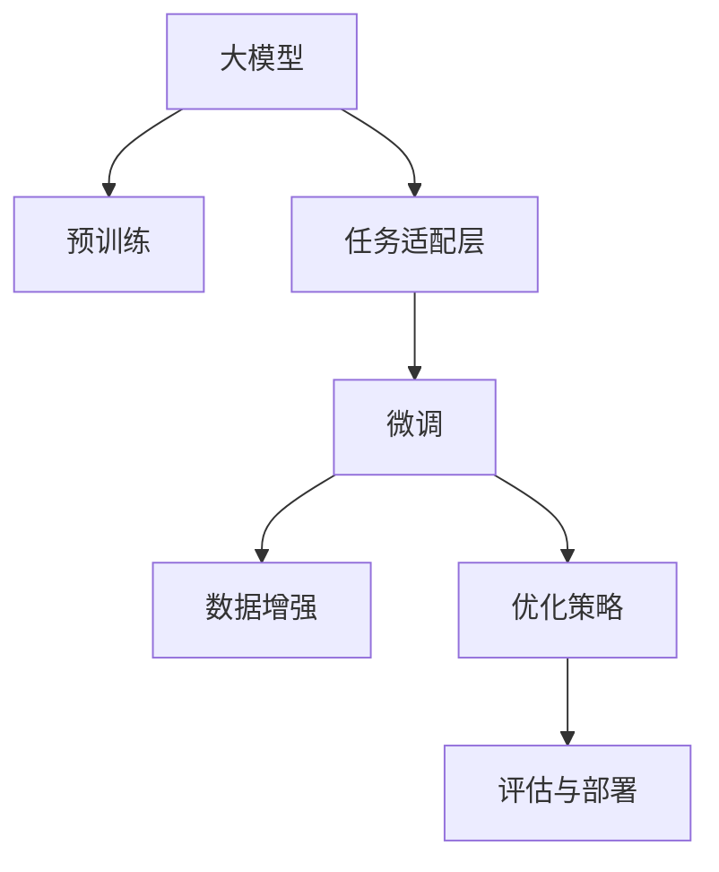

                 

# 大模型在商品属性抽取与预测中的应用

> 关键词：大模型,商品属性抽取,预测,深度学习,自然语言处理(NLP),计算机视觉(CV),图像处理

## 1. 背景介绍

### 1.1 问题由来
在现代电子商务领域，商品属性抽取与预测技术已成为提升用户体验、促进交易转化的核心驱动因素之一。有效的商品属性抽取可以大幅度提升搜索结果的相关性和精准度，而准确的属性预测则可以优化价格策略、个性化推荐，提高用户满意度。然而，由于商品描述信息通常以自然语言形式出现，具有较大的语义复杂度和变异性，导致属性抽取与预测任务面临诸多挑战。传统的基于规则或模板匹配的方法难以应对复杂多变的商品描述，难以实现高精度的自动属性抽取与预测。

随着深度学习和大规模预训练语言模型（大模型）的快速发展，基于大模型的商品属性抽取与预测技术逐渐成为研究热点。大模型通过在大规模语料上进行预训练，学习了丰富的语言知识和表示能力，可以在一定程度上解决传统方法的局限性，实现对商品属性信息的自动、高效、精准提取与预测。本文将对大模型在商品属性抽取与预测中的应用进行详细探讨，并介绍相关的核心算法和技术细节。

### 1.2 问题核心关键点
大模型在商品属性抽取与预测中的应用主要涉及以下几个关键点：

- **大模型预训练**：选择合适的大模型，如BERT、GPT、ViT等，在大规模语料上进行预训练，学习通用语言表示。
- **任务适配层设计**：在预训练大模型的基础上，针对商品属性抽取与预测任务设计相应的任务适配层，进行微调。
- **数据处理与增强**：收集、预处理商品描述数据，并通过数据增强技术扩充训练集，提高模型泛化能力。
- **模型优化**：通过合适的优化策略和正则化技术，避免模型过拟合，提升模型性能。
- **评估与部署**：在测试集上评估模型性能，并将模型部署到实际应用中，进行实时推理与预测。

这些关键点决定了大模型在商品属性抽取与预测中的实际效果。本文将逐一介绍这些关键点，并结合实际案例进行详细讲解。

## 2. 核心概念与联系

### 2.1 核心概念概述

为更好地理解大模型在商品属性抽取与预测中的应用，本节将介绍几个密切相关的核心概念：

- **大模型**：指通过大规模语料进行预训练，具备丰富语言表示能力的深度学习模型，如BERT、GPT、ViT等。
- **预训练**：指在大规模无标注语料上进行自监督学习，学习语言通用表示的过程。
- **任务适配层**：在大模型上添加的任务特定层，用于适配商品属性抽取与预测任务的输出和损失函数设计。
- **微调**：在大模型基础上，通过有监督学习任务进一步优化模型，提升其在特定任务上的性能。
- **数据增强**：通过一系列技术手段扩充训练集，如回译、数据扩充、伪标签生成等，提高模型泛化能力。
- **优化策略**：包括选择合适的优化算法（如Adam、SGD等）、设置合适的学习率、使用正则化技术（如L2正则、Dropout等），以避免过拟合。

这些核心概念通过以下Mermaid流程图来展示：



这个流程图展示了大模型在商品属性抽取与预测应用中的核心概念及其之间的关系：

1. 大模型通过预训练获得基础能力。
2. 任务适配层设计使得模型能够适配具体任务。
3. 微调进一步优化模型，提高特定任务性能。
4. 数据增强扩充训练集，提升模型泛化能力。
5. 优化策略防止过拟合，提升模型训练质量。
6. 评估与部署将模型应用于实际应用场景。

这些概念共同构成了大模型应用于商品属性抽取与预测的核心技术框架，使得模型能够从预训练到微调，再到应用部署，实现高效的自动属性抽取与预测。

## 3. 核心算法原理 & 具体操作步骤
### 3.1 算法原理概述

基于大模型的商品属性抽取与预测过程主要包括以下几个步骤：

1. **预训练大模型**：选择合适的预训练语言模型（如BERT、GPT、ViT等），在大规模语料上进行预训练，学习语言通用表示。
2. **任务适配层设计**：在预训练大模型的基础上，添加相应的任务适配层，适配商品属性抽取与预测任务的输出和损失函数设计。
3. **微调优化**：使用商品属性抽取与预测任务的标注数据进行微调，提升模型在特定任务上的性能。
4. **数据增强与处理**：收集、预处理商品描述数据，并通过数据增强技术扩充训练集，提高模型泛化能力。
5. **模型评估与部署**：在测试集上评估模型性能，并将模型部署到实际应用中，进行实时推理与预测。

### 3.2 算法步骤详解

#### 步骤1：选择与预训练大模型

选择合适的预训练大模型是商品属性抽取与预测的首要步骤。当前主流的预训练大模型包括BERT、GPT、ViT等，每个模型都有其特点和适用场景。例如：

- BERT模型：基于Transformer结构，采用双向自编码任务进行预训练，适用于多种NLP任务。
- GPT模型：基于单向自回归生成任务进行预训练，适合生成式任务，如问答、对话等。
- ViT模型：基于自注意力机制的卷积神经网络，适用于图像处理任务，如视觉问答、物体识别等。

选择合适的模型后，在大规模无标注语料上进行预训练，学习语言通用表示。

#### 步骤2：设计任务适配层

根据商品属性抽取与预测任务的特征，设计相应的任务适配层。任务适配层通常包括：

- **输入层**：处理商品描述文本，进行分词、词嵌入等操作。
- **编码层**：采用预训练大模型的Transformer编码器进行特征提取。
- **输出层**：设计适配特定任务的输出层，如分类层、回归层等。
- **损失函数**：适配任务的损失函数，如交叉熵损失、均方误差损失等。

以商品属性分类任务为例，任务适配层设计如下：

```python
import torch.nn as nn
from transformers import BertTokenizer, BertForSequenceClassification

class BERTForAttributeClassification(nn.Module):
    def __init__(self, num_labels):
        super(BERTForAttributeClassification, self).__init__()
        self.tokenizer = BertTokenizer.from_pretrained('bert-base-cased')
        self.model = BertForSequenceClassification.from_pretrained('bert-base-cased', num_labels=num_labels)
        self.num_labels = num_labels

    def forward(self, text):
        tokens = self.tokenizer(text, return_tensors='pt', padding=True, truncation=True, max_length=128)
        outputs = self.model(**tokens)
        logits = outputs.logits
        probabilities = nn.functional.softmax(logits, dim=1)
        return probabilities
```

#### 步骤3：微调优化

使用商品属性抽取与预测任务的标注数据进行微调，优化模型在特定任务上的性能。微调过程通常包括以下步骤：

1. **准备数据集**：收集、预处理商品描述数据，并分割为训练集、验证集和测试集。
2. **设置优化器与学习率**：选择合适的优化器（如Adam、SGD等），设置合适的学习率。
3. **定义损失函数**：根据任务特征设计相应的损失函数。
4. **训练模型**：在训练集上使用优化器进行梯度更新，并在验证集上进行验证。
5. **测试模型**：在测试集上评估模型性能。

以商品属性分类任务为例，微调过程如下：

```python
from torch.utils.data import DataLoader
import torch.optim as optim

# 准备数据集
train_dataset = ...
val_dataset = ...
test_dataset = ...

# 设置优化器与学习率
optimizer = optim.Adam(model.parameters(), lr=2e-5)
scheduler = optim.lr_scheduler.CosineAnnealingLR(optimizer, T_max=10)

# 定义损失函数
criterion = nn.CrossEntropyLoss()

# 训练模型
model.train()
for epoch in range(num_epochs):
    for batch in DataLoader(train_dataset, batch_size=32):
        input_ids = batch['input_ids']
        attention_mask = batch['attention_mask']
        labels = batch['labels']
        outputs = model(input_ids, attention_mask=attention_mask)
        loss = criterion(outputs, labels)
        optimizer.zero_grad()
        loss.backward()
        optimizer.step()
        scheduler.step()

# 测试模型
model.eval()
with torch.no_grad():
    for batch in DataLoader(test_dataset, batch_size=32):
        input_ids = batch['input_ids']
        attention_mask = batch['attention_mask']
        labels = batch['labels']
        outputs = model(input_ids, attention_mask=attention_mask)
        loss = criterion(outputs, labels)
```

#### 步骤4：数据增强与处理

商品描述数据通常具有较大的语义复杂度和变异性，仅靠原始数据进行微调可能存在泛化能力不足的问题。因此，可以通过数据增强技术扩充训练集，提高模型泛化能力。常见的数据增强技术包括：

- **回译**：将商品描述文本进行回译，生成新的文本。
- **数据扩充**：对商品描述进行同义词替换、随机插入等操作。
- **伪标签生成**：根据商品描述生成伪标签，用于扩充训练集。

以回译为例，回译过程如下：

```python
from modelscope.utils.data import back_translate

# 回译文本
translated_text = back_translate(text)
```

#### 步骤5：模型评估与部署

在测试集上评估模型性能，并将模型部署到实际应用中，进行实时推理与预测。评估过程通常包括以下步骤：

1. **准备测试集**：收集、预处理测试集数据。
2. **测试模型**：在测试集上使用模型进行推理，输出预测结果。
3. **评估结果**：计算模型在测试集上的性能指标，如准确率、召回率、F1分数等。

以商品属性分类任务为例，评估过程如下：

```python
from sklearn.metrics import classification_report

# 准备测试集
test_dataset = ...

# 测试模型
model.eval()
with torch.no_grad():
    predictions = model(test_dataset['input_ids'], attention_mask=test_dataset['attention_mask'])

# 评估结果
labels = test_dataset['labels']
report = classification_report(labels, predictions.argmax(dim=1))
print(report)
```

## 4. 数学模型和公式 & 详细讲解  
### 4.1 数学模型构建

假设预训练大模型为 $M_{\theta}$，其中 $\theta$ 为预训练得到的模型参数。给定商品属性分类任务的训练集 $D=\{(x_i,y_i)\}_{i=1}^N, x_i \in \mathcal{X}, y_i \in \{0,1\}$，微调的目标是找到新的模型参数 $\hat{\theta}$，使得：

$$
\hat{\theta}=\mathop{\arg\min}_{\theta} \mathcal{L}(M_{\theta},D)
$$

其中 $\mathcal{L}$ 为针对任务设计的损失函数，用于衡量模型预测输出与真实标签之间的差异。常见的损失函数包括交叉熵损失、均方误差损失等。

以交叉熵损失为例，损失函数定义为：

$$
\ell(M_{\theta}(x),y) = -y\log \hat{y} - (1-y)\log(1-\hat{y})
$$

将损失函数代入经验风险公式，得：

$$
\mathcal{L}(\theta) = -\frac{1}{N}\sum_{i=1}^N [y_i\log \hat{y}_i+(1-y_i)\log(1-\hat{y}_i)]
$$

其中 $\hat{y}_i$ 为模型在输入 $x_i$ 上的预测输出。

### 4.2 公式推导过程

以下是商品属性分类任务中交叉熵损失函数的推导过程：

假设模型 $M_{\theta}$ 在输入 $x$ 上的输出为 $\hat{y}=M_{\theta}(x) \in [0,1]$，表示商品属性属于正类的概率。真实标签 $y \in \{0,1\}$。则交叉熵损失函数定义为：

$$
\ell(M_{\theta}(x),y) = -[y\log \hat{y} + (1-y)\log (1-\hat{y})]
$$

将其代入经验风险公式，得：

$$
\mathcal{L}(\theta) = -\frac{1}{N}\sum_{i=1}^N [y_i\log M_{\theta}(x_i)+(1-y_i)\log(1-M_{\theta}(x_i))]
$$

根据链式法则，损失函数对参数 $\theta_k$ 的梯度为：

$$
\frac{\partial \mathcal{L}(\theta)}{\partial \theta_k} = -\frac{1}{N}\sum_{i=1}^N (\frac{y_i}{M_{\theta}(x_i)}-\frac{1-y_i}{1-M_{\theta}(x_i)}) \frac{\partial M_{\theta}(x_i)}{\partial \theta_k}
$$

其中 $\frac{\partial M_{\theta}(x_i)}{\partial \theta_k}$ 可进一步递归展开，利用自动微分技术完成计算。

在得到损失函数的梯度后，即可带入参数更新公式，完成模型的迭代优化。重复上述过程直至收敛，最终得到适应商品属性分类任务的最优模型参数 $\hat{\theta}$。

## 5. 项目实践：代码实例和详细解释说明
### 5.1 开发环境搭建

在进行商品属性抽取与预测的微调实践前，我们需要准备好开发环境。以下是使用Python进行PyTorch开发的环境配置流程：

1. 安装Anaconda：从官网下载并安装Anaconda，用于创建独立的Python环境。

2. 创建并激活虚拟环境：
```bash
conda create -n pytorch-env python=3.8 
conda activate pytorch-env
```

3. 安装PyTorch：根据CUDA版本，从官网获取对应的安装命令。例如：
```bash
conda install pytorch torchvision torchaudio cudatoolkit=11.1 -c pytorch -c conda-forge
```

4. 安装Transformers库：
```bash
pip install transformers
```

5. 安装各类工具包：
```bash
pip install numpy pandas scikit-learn matplotlib tqdm jupyter notebook ipython
```

完成上述步骤后，即可在`pytorch-env`环境中开始微调实践。

### 5.2 源代码详细实现

下面我们以商品属性分类任务为例，给出使用Transformers库对BERT模型进行微调的PyTorch代码实现。

首先，定义商品属性分类任务的数据处理函数：

```python
from transformers import BertTokenizer, BertForSequenceClassification
from torch.utils.data import Dataset

class AttributeDataset(Dataset):
    def __init__(self, texts, labels, tokenizer, max_len=128):
        self.texts = texts
        self.labels = labels
        self.tokenizer = tokenizer
        self.max_len = max_len

    def __len__(self):
        return len(self.texts)

    def __getitem__(self, item):
        text = self.texts[item]
        label = self.labels[item]
        
        encoding = self.tokenizer(text, return_tensors='pt', max_length=self.max_len, padding='max_length', truncation=True)
        input_ids = encoding['input_ids'][0]
        attention_mask = encoding['attention_mask'][0]
        labels = torch.tensor([label], dtype=torch.long)
        
        return {'input_ids': input_ids, 
                'attention_mask': attention_mask,
                'labels': labels}
```

然后，定义模型和优化器：

```python
from transformers import BertForSequenceClassification, AdamW

model = BertForSequenceClassification.from_pretrained('bert-base-cased', num_labels=2)

optimizer = AdamW(model.parameters(), lr=2e-5)
```

接着，定义训练和评估函数：

```python
from torch.utils.data import DataLoader
from tqdm import tqdm
from sklearn.metrics import classification_report

device = torch.device('cuda') if torch.cuda.is_available() else torch.device('cpu')
model.to(device)

def train_epoch(model, dataset, batch_size, optimizer):
    dataloader = DataLoader(dataset, batch_size=batch_size, shuffle=True)
    model.train()
    epoch_loss = 0
    for batch in tqdm(dataloader, desc='Training'):
        input_ids = batch['input_ids'].to(device)
        attention_mask = batch['attention_mask'].to(device)
        labels = batch['labels'].to(device)
        model.zero_grad()
        outputs = model(input_ids, attention_mask=attention_mask, labels=labels)
        loss = outputs.loss
        epoch_loss += loss.item()
        loss.backward()
        optimizer.step()
    return epoch_loss / len(dataloader)

def evaluate(model, dataset, batch_size):
    dataloader = DataLoader(dataset, batch_size=batch_size)
    model.eval()
    preds, labels = [], []
    with torch.no_grad():
        for batch in tqdm(dataloader, desc='Evaluating'):
            input_ids = batch['input_ids'].to(device)
            attention_mask = batch['attention_mask'].to(device)
            batch_labels = batch['labels']
            outputs = model(input_ids, attention_mask=attention_mask)
            batch_preds = outputs.logits.argmax(dim=1).to('cpu').tolist()
            batch_labels = batch_labels.to('cpu').tolist()
            for pred, label in zip(batch_preds, batch_labels):
                preds.append(pred)
                labels.append(label)
                
    print(classification_report(labels, preds))
```

最后，启动训练流程并在测试集上评估：

```python
epochs = 5
batch_size = 16

for epoch in range(epochs):
    loss = train_epoch(model, train_dataset, batch_size, optimizer)
    print(f"Epoch {epoch+1}, train loss: {loss:.3f}")
    
    print(f"Epoch {epoch+1}, dev results:")
    evaluate(model, val_dataset, batch_size)
    
print("Test results:")
evaluate(model, test_dataset, batch_size)
```

以上就是使用PyTorch对BERT进行商品属性分类任务微调的完整代码实现。可以看到，得益于Transformers库的强大封装，我们可以用相对简洁的代码完成BERT模型的加载和微调。

### 5.3 代码解读与分析

让我们再详细解读一下关键代码的实现细节：

**AttributeDataset类**：
- `__init__`方法：初始化商品描述文本、标签、分词器等关键组件。
- `__len__`方法：返回数据集的样本数量。
- `__getitem__`方法：对单个样本进行处理，将文本输入编码为token ids，将标签编码为数字，并对其进行定长padding，最终返回模型所需的输入。

**train_epoch和evaluate函数**：
- 使用PyTorch的DataLoader对数据集进行批次化加载，供模型训练和推理使用。
- 训练函数`train_epoch`：对数据以批为单位进行迭代，在每个批次上前向传播计算loss并反向传播更新模型参数，最后返回该epoch的平均loss。
- 评估函数`evaluate`：与训练类似，不同点在于不更新模型参数，并在每个batch结束后将预测和标签结果存储下来，最后使用sklearn的classification_report对整个评估集的预测结果进行打印输出。

**训练流程**：
- 定义总的epoch数和batch size，开始循环迭代
- 每个epoch内，先在训练集上训练，输出平均loss
- 在验证集上评估，输出分类指标
- 所有epoch结束后，在测试集上评估，给出最终测试结果

可以看到，PyTorch配合Transformers库使得BERT微调的代码实现变得简洁高效。开发者可以将更多精力放在数据处理、模型改进等高层逻辑上，而不必过多关注底层的实现细节。

当然，工业级的系统实现还需考虑更多因素，如模型的保存和部署、超参数的自动搜索、更灵活的任务适配层等。但核心的微调范式基本与此类似。

## 6. 实际应用场景
### 6.1 智能推荐系统

基于大模型微调的推荐系统可以有效提升商品推荐的相关性和个性化程度。传统的基于协同过滤的推荐系统往往忽视了商品属性对用户偏好的影响，导致推荐效果不理想。而使用微调后的推荐模型，可以基于商品属性进行更加精准的推荐。

具体而言，可以通过微调模型学习商品属性和用户行为之间的关联，生成预测用户对商品感兴趣的程度。然后将预测结果与用户行为数据结合，进行推荐排序，提升推荐效果。微调后的推荐模型可以适应不同的推荐场景，如商品搜索、个性化商品推荐、热门商品推荐等。

### 6.2 智能客服系统

智能客服系统可以基于大模型进行自然语言处理和理解，提升用户体验和效率。微调后的模型可以自动理解用户问题，匹配最合适的答案模板进行回复。对于新问题，还可以接入检索系统实时搜索相关内容，动态组织生成回答。如此构建的智能客服系统，能大幅提升客户咨询体验和问题解决效率。

在技术实现上，可以收集企业内部的历史客服对话记录，将问题和最佳答复构建成监督数据，在此基础上对预训练对话模型进行微调。微调后的对话模型能够自动理解用户意图，匹配最合适的答案模板进行回复。对于客户提出的新问题，还可以接入检索系统实时搜索相关内容，动态组织生成回答。如此构建的智能客服系统，能大幅提升客户咨询体验和问题解决效率。

### 6.3 电商内容管理

电商内容管理可以通过微调模型实现自动化的商品描述生成和优化。传统的电商内容管理需要大量人工编辑和审核，成本高且效率低。而使用微调后的模型，可以自动分析商品属性和市场趋势，生成高质量的商品描述，并进行自动优化。

具体而言，可以通过微调模型学习商品属性和市场趋势之间的关系，生成具有吸引力的商品描述。然后通过数据分析和优化，将描述调整为最佳格式和语言，提升用户体验。微调后的模型可以自动生成和优化商品描述，提高内容管理和发布的效率和效果。

## 7. 工具和资源推荐
### 7.1 学习资源推荐

为了帮助开发者系统掌握大模型微调的理论基础和实践技巧，这里推荐一些优质的学习资源：

1. 《Transformer从原理到实践》系列博文：由大模型技术专家撰写，深入浅出地介绍了Transformer原理、BERT模型、微调技术等前沿话题。

2. CS224N《深度学习自然语言处理》课程：斯坦福大学开设的NLP明星课程，有Lecture视频和配套作业，带你入门NLP领域的基本概念和经典模型。

3. 《Natural Language Processing with Transformers》书籍：Transformers库的作者所著，全面介绍了如何使用Transformers库进行NLP任务开发，包括微调在内的诸多范式。

4. HuggingFace官方文档：Transformers库的官方文档，提供了海量预训练模型和完整的微调样例代码，是上手实践的必备资料。

5. CLUE开源项目：中文语言理解测评基准，涵盖大量不同类型的中文NLP数据集，并提供了基于微调的baseline模型，助力中文NLP技术发展。

通过对这些资源的学习实践，相信你一定能够快速掌握大模型微调的精髓，并用于解决实际的NLP问题。
###  7.2 开发工具推荐

高效的开发离不开优秀的工具支持。以下是几款用于大语言模型微调开发的常用工具：

1. PyTorch：基于Python的开源深度学习框架，灵活动态的计算图，适合快速迭代研究。大部分预训练语言模型都有PyTorch版本的实现。

2. TensorFlow：由Google主导开发的开源深度学习框架，生产部署方便，适合大规模工程应用。同样有丰富的预训练语言模型资源。

3. Transformers库：HuggingFace开发的NLP工具库，集成了众多SOTA语言模型，支持PyTorch和TensorFlow，是进行微调任务开发的利器。

4. Weights & Biases：模型训练的实验跟踪工具，可以记录和可视化模型训练过程中的各项指标，方便对比和调优。与主流深度学习框架无缝集成。

5. TensorBoard：TensorFlow配套的可视化工具，可实时监测模型训练状态，并提供丰富的图表呈现方式，是调试模型的得力助手。

6. Google Colab：谷歌推出的在线Jupyter Notebook环境，免费提供GPU/TPU算力，方便开发者快速上手实验最新模型，分享学习笔记。

合理利用这些工具，可以显著提升大模型微调任务的开发效率，加快创新迭代的步伐。

### 7.3 相关论文推荐

大模型和微调技术的发展源于学界的持续研究。以下是几篇奠基性的相关论文，推荐阅读：

1. Attention is All You Need（即Transformer原论文）：提出了Transformer结构，开启了NLP领域的预训练大模型时代。

2. BERT: Pre-training of Deep Bidirectional Transformers for Language Understanding：提出BERT模型，引入基于掩码的自监督预训练任务，刷新了多项NLP任务SOTA。

3. Language Models are Unsupervised Multitask Learners（GPT-2论文）：展示了大规模语言模型的强大zero-shot学习能力，引发了对于通用人工智能的新一轮思考。

4. Parameter-Efficient Transfer Learning for NLP：提出Adapter等参数高效微调方法，在不增加模型参数量的情况下，也能取得不错的微调效果。

5. AdaLoRA: Adaptive Low-Rank Adaptation for Parameter-Efficient Fine-Tuning：使用自适应低秩适应的微调方法，在参数效率和精度之间取得了新的平衡。

这些论文代表了大模型微调技术的发展脉络。通过学习这些前沿成果，可以帮助研究者把握学科前进方向，激发更多的创新灵感。

## 8. 总结：未来发展趋势与挑战

### 8.1 总结

本文对大模型在商品属性抽取与预测中的应用进行了全面系统的介绍。首先阐述了大模型和微调技术的研究背景和意义，明确了微调在拓展预训练模型应用、提升下游任务性能方面的独特价值。其次，从原理到实践，详细讲解了微调过程的数学原理和关键步骤，给出了微调任务开发的完整代码实例。同时，本文还广泛探讨了微调方法在智能推荐、智能客服、电商内容管理等多个领域的应用前景，展示了微调范式的巨大潜力。此外，本文精选了微调技术的各类学习资源，力求为读者提供全方位的技术指引。

通过本文的系统梳理，可以看到，大模型在商品属性抽取与预测中的微调方法，具有高效、精准、灵活的特点，能够有效解决传统方法在复杂多变商品描述上的局限性，为电商、推荐、客服等领域带来新的变革。未来，伴随预训练语言模型和微调方法的持续演进，基于大模型的自动属性抽取与预测技术将更加成熟，进一步推动人工智能技术在商业应用中的普及和落地。

### 8.2 未来发展趋势

展望未来，大模型在商品属性抽取与预测中的应用将呈现以下几个发展趋势：

1. **预训练与微调一体化**：未来的预训练模型将在训练过程中自动学习商品属性信息，进一步减少微调的标注成本。

2. **多模态融合**：商品属性抽取与预测将逐步融合图像、语音等多种模态信息，实现更加全面、准确的属性信息提取与预测。

3. **实时化与自动化**：微调后的模型将实现实时化的商品属性抽取与预测，自动优化商品描述和推荐，提升电商和推荐系统的效率和效果。

4. **跨领域泛化**：微调模型将具备更强的跨领域泛化能力，可以应用于更多领域和场景，如医疗、金融、教育等。

5. **高效推理**：随着模型结构优化和推理框架的进步，微调模型的推理速度将进一步提升，实现高效实时处理大规模数据。

6. **安全性与合规性**：为了确保商品属性抽取与预测的公平性与安全性，微调模型将引入伦理导向的评估指标和数据脱敏技术，避免有害信息的传播和滥用。

以上趋势凸显了大模型微调技术的广阔前景。这些方向的探索发展，必将进一步提升大模型在商品属性抽取与预测中的效果和应用范围，为人工智能技术在商业领域的应用带来新的突破。

### 8.3 面临的挑战

尽管大模型在商品属性抽取与预测中的应用取得了显著进展，但在迈向更加智能化、普适化应用的过程中，仍面临诸多挑战：

1. **标注成本**：商品属性抽取与预测任务通常需要大量标注数据，且标注质量对模型性能影响较大，标注成本较高。如何减少标注需求，提高标注质量，仍是一个需要解决的难题。

2. **泛化能力**：微调模型在面对新商品和未知属性时，泛化能力仍存在局限，容易发生泛化误差。如何提高模型的泛化能力，增强模型在新场景下的适应性，将是重要的研究方向。

3. **推理效率**：大模型在推理时通常需要较大的计算资源和存储空间，推理速度较慢，无法满足实时化应用的需求。如何优化模型结构，提高推理效率，是一个亟待解决的问题。

4. **可解释性**：微调模型往往被视为"黑盒"系统，难以解释其内部工作机制和决策逻辑。如何在提高模型性能的同时，增强模型的可解释性，将是重要的优化方向。

5. **安全性与合规性**：微调模型可能学习到有害信息，输出错误或误导性结果。如何确保模型的安全性和合规性，避免有害信息的传播和滥用，将是重要的研究课题。

6. **资源消耗**：大模型在推理和训练过程中需要大量的计算资源和存储空间，资源消耗较大，难以在资源有限的场景中应用。如何优化模型资源消耗，降低计算成本，是未来需要考虑的问题。

7. **多样性与公平性**：微调模型可能存在偏差，对某些商品属性或商品类别识别效果不佳。如何确保模型的多样性和公平性，避免模型偏见，是未来需要解决的问题。

面对这些挑战，未来需要在模型架构、数据处理、优化策略、算法设计等多个方面进行深入研究，才能充分发挥大模型在商品属性抽取与预测中的优势，推动技术向更加智能化、普适化方向发展。

### 8.4 研究展望

面对大模型在商品属性抽取与预测中的挑战和机遇，未来的研究可以在以下几个方向寻求新的突破：

1. **跨模态学习**：将商品属性抽取与预测与图像、语音等多种模态信息结合，实现跨模态学习，提升模型的多样性和泛化能力。

2. **自适应学习**：开发自适应学习算法，使模型能够动态适应新的商品属性和商品类别，提升模型的灵活性和实时性。

3. **知识增强**：结合领域知识库、规则库等专家知识，引导微调过程学习更准确、合理的属性信息，提升模型的可信度和可靠性。

4. **跨领域迁移**：将模型在电商领域训练的知识迁移到其他领域，如医疗、金融、教育等，拓展模型的应用范围。

5. **安全性与伦理**：引入伦理导向的评估指标和数据脱敏技术，确保模型的安全性和合规性，避免有害信息的传播和滥用。

6. **高效推理**：优化模型结构，采用高效推理框架，提升模型的推理速度和计算效率，实现实时化处理大规模数据。

7. **多样性与公平性**：引入多样性与公平性约束，确保模型对不同商品属性和商品类别都能准确识别，避免模型偏见。

这些研究方向的探索，必将引领大模型在商品属性抽取与预测中的应用走向新的高度，为人工智能技术在商业领域的应用带来新的突破。面向未来，大模型微调技术需要与其他人工智能技术进行更深入的融合，如知识表示、因果推理、强化学习等，多路径协同发力，共同推动自然语言理解和智能交互系统的进步。只有勇于创新、敢于突破，才能不断拓展语言模型的边界，让智能技术更好地造福人类社会。

## 9. 附录：常见问题与解答

**Q1：大模型微调是否适用于所有商品属性抽取与预测任务？**

A: 大模型微调在大多数商品属性抽取与预测任务上都能取得不错的效果，特别是对于数据量较小的任务。但对于一些特定领域的任务，如高精度的医学领域属性抽取与预测，仅靠通用语料预训练的模型可能难以很好地适应。此时需要在特定领域语料上进一步预训练，再进行微调，才能获得理想效果。

**Q2：微调过程中如何选择合适的学习率？**

A: 微调的学习率一般要比预训练时小1-2个数量级，如果使用过大的学习率，容易破坏预训练权重，导致过拟合。一般建议从1e-5开始调参，逐步减小学习率，直至收敛。也可以使用warmup策略，在开始阶段使用较小的学习率，再逐渐过渡到预设值。需要注意的是，不同的优化器(如Adam、SGD等)以及不同的学习率调度策略，可能需要设置不同的学习率阈值。

**Q3：大模型在商品属性抽取与预测中面临哪些资源瓶颈？**

A: 当前主流的预训练大模型动辄以亿计的参数规模，对算力、内存、存储都提出了很高的要求。GPU/TPU等高性能设备是必不可少的，但即便如此，超大批次的训练和推理也可能遇到显存不足的问题。因此需要采用一些资源优化技术，如梯度积累、混合精度训练、模型并行等，来突破硬件瓶颈。同时，模型的存储和读取也可能占用大量时间和空间，需要采用模型压缩、稀疏化存储等方法进行优化。

**Q4：如何缓解微调过程中的过拟合问题？**

A: 过拟合是微调面临的主要挑战，尤其是在标注数据不足的情况下。常见的缓解策略包括：
1. 数据增强：通过回译、数据扩充、伪标签生成等手段扩充训练集。
2. 正则化：使用L2正则、Dropout、Early Stopping等防止模型过度适应小规模训练集。
3. 对抗训练：引入对抗样本，提高模型鲁棒性。
4. 参数高效微调：只调整少量参数(如Adapter、Prefix等)，减小过拟合风险。
5. 多模型集成：训练多个微调模型，取平均输出，抑制过拟合。

这些策略往往需要根据具体任务和数据特点进行灵活组合。只有在数据、模型、训练、推理等各环节进行全面优化，才能最大限度地发挥大模型微调的威力。

**Q5：大模型在商品属性抽取与预测中的应用有哪些局限性？**

A: 尽管大模型在商品属性抽取与预测中具有高效、精准、灵活的特点，但也存在一些局限性：
1. 标注成本较高：商品属性抽取与预测任务通常需要大量标注数据，且标注质量对模型性能影响较大，标注成本较高。
2. 泛化能力不足：微调模型在面对新商品和未知属性时，泛化能力仍存在局限，容易发生泛化误差。
3. 推理效率较低：大模型在推理时通常需要较大的计算资源和存储空间，推理速度较慢，无法满足实时化应用的需求。
4. 可解释性不足：微调模型往往被视为"黑盒"系统，难以解释其内部工作机制和决策逻辑。
5. 安全性与合规性问题：微调模型可能学习到有害信息，输出错误或误导性结果。

这些局限性使得大模型在商品属性抽取与预测中的应用仍面临诸多挑战。未来需要在模型架构、数据处理、优化策略、算法设计等多个方面进行深入研究，才能充分发挥大模型在商品属性抽取与预测中的优势。

