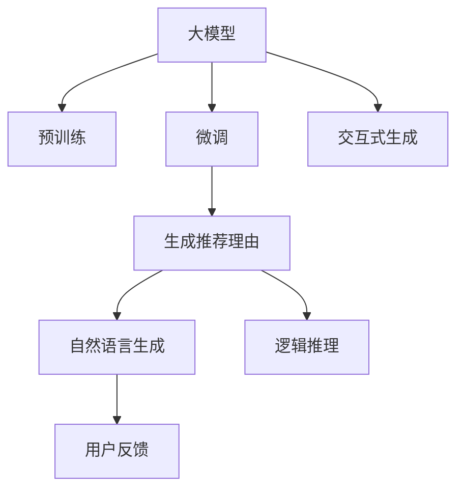

                 

# 大模型在商品推荐理由个性化生成中的应用

## 1. 背景介绍

随着电子商务的飞速发展，商品推荐系统成为各大电商平台的标配，但传统的推荐算法往往只能根据用户历史行为和物品属性生成推荐，难以提供具有深层次逻辑依据的推荐理由。大模型的出现，为商品推荐理由个性化生成提供了新的契机。

用户在进行商品选择时，往往希望了解推荐的理由，这不仅能提升用户的购物体验，还能增加用户的决策信心。因此，构建一个能够生成个性化推荐理由的系统，具有重要的现实意义。大模型在语言理解、生成方面的强大能力，使其成为实现这一目标的理想选择。

## 2. 核心概念与联系

### 2.1 核心概念概述

为了更好地理解大模型在商品推荐理由生成中的应用，本节将介绍几个核心概念：

- **大模型(Large Model)**：指的是使用大规模数据进行预训练的语言模型，如BERT、GPT-3等。通过在大规模无标签文本语料上进行预训练，学习到丰富的语言知识和常识。

- **推荐理由(Explanation)**：指商品推荐系统在推荐商品时，生成的一组与商品相关联的逻辑依据，以帮助用户理解推荐逻辑。

- **自然语言生成(NLG, Natural Language Generation)**：指将结构化数据或逻辑推理转换为自然语言文本的过程。

- **大模型微调(Fine-tuning)**：在预训练模型的基础上，使用推荐理由生成任务的有标签数据进行微调，以适应具体任务。

- **交互式生成(Interactive Generation)**：指通过用户与系统的交互，动态生成和调整推荐理由，提升推荐的说服力和个性化程度。

- **逻辑推理(Logic-Based Reasoning)**：指利用自然语言推理和逻辑计算，生成更为合理、可信的推荐理由。

### 2.2 核心概念原理和架构的 Mermaid 流程图



这个流程图展示了核心概念之间的关系：

1. 大模型通过预训练获得基础能力。
2. 微调使得大模型能够适应推荐理由生成任务。
3. 生成的推荐理由通过自然语言生成技术，转换为自然语言文本。
4. 加入逻辑推理，使推荐理由更具有可信度。
5. 用户反馈引导推荐理由生成过程，进行动态调整。
6. 交互式生成使得推荐理由更加个性化。

这些核心概念共同构成了推荐理由个性化的生成框架，为大模型在推荐场景中的应用提供了理论基础。

## 3. 核心算法原理 & 具体操作步骤

### 3.1 算法原理概述

基于大模型的推荐理由个性化生成，本质上是将大模型视作语言理解与生成的工具，通过微调过程学习推荐理由生成的任务规则。该过程包括两个主要步骤：

1. **微调**：使用推荐理由生成任务的有标签数据，对大模型进行有监督的微调，使其能够根据输入的商品信息和用户偏好生成推荐理由。
2. **自然语言生成与逻辑推理**：微调后的模型生成的推荐理由，通过自然语言生成技术转化为自然语言文本，并通过逻辑推理增强其可信度和说服力。

### 3.2 算法步骤详解

#### 3.2.1 微调步骤

1. **准备数据集**：构建推荐理由生成的数据集，包括商品属性、用户偏好和推荐理由等。数据集应包含不同类型的推荐场景，以覆盖不同的推荐策略。

2. **选择模型**：选择合适的预训练语言模型作为微调的初始模型。常用的模型包括BERT、GPT等。

3. **设计任务适配层**：根据任务特点，在预训练模型的顶层设计适当的任务适配层，如全连接层、注意力机制等。适配层的输出用于后续的自然语言生成和逻辑推理。

4. **训练模型**：在微调过程中，使用数据集训练模型，设置合适的优化器和超参数。训练过程应避免过拟合，保证模型的泛化能力。

5. **评估与调优**：在验证集上评估模型性能，根据评估结果调整模型参数和训练策略，提升模型的准确性和生成质量。

#### 3.2.2 自然语言生成与逻辑推理

1. **自然语言生成**：微调后的模型输出推荐理由，通常是一段结构化的文本。使用自然语言生成技术，将推荐理由转换为自然语言文本，使得生成的理由更加自然、易读。

2. **逻辑推理**：将生成的推荐理由进行逻辑推理，以增强其说服力。常用的逻辑推理方法包括规则推理、逻辑回归等。

### 3.3 算法优缺点

#### 3.3.1 优点

- **生成质量高**：大模型的语言理解和生成能力，使得生成的推荐理由具有较高的质量和多样性。
- **泛化能力强**：通过微调，模型能够适应不同类型的推荐场景，具备较强的泛化能力。
- **易于维护**：一旦模型微调完成，其维护成本较低，能够快速生成推荐理由。
- **可解释性强**：生成的推荐理由具有逻辑依据，易于向用户解释。

#### 3.3.2 缺点

- **计算资源需求高**：预训练和微调大模型需要大量的计算资源。
- **数据依赖性强**：模型的性能很大程度上取决于推荐理由生成数据集的质量和规模。
- **训练时间长**：微调过程可能需要较长的训练时间。

### 3.4 算法应用领域

基于大模型的推荐理由个性化生成方法，已经在多个领域得到了应用，例如：

- **电子商务**：电商平台使用推荐理由，提升用户的购物体验和决策信心，增加销售额。
- **金融服务**：银行和保险机构通过推荐理由，向用户推荐合适的金融产品，提升用户满意度。
- **医疗健康**：医疗机构使用推荐理由，帮助医生做出更合理的诊疗决策，提升治疗效果。
- **教育培训**：教育平台使用推荐理由，推荐适合用户的课程，提高学习效率。
- **新闻媒体**：媒体公司使用推荐理由，向用户推荐新闻和文章，提升用户粘性。

## 4. 数学模型和公式 & 详细讲解 & 举例说明

### 4.1 数学模型构建

假设推荐理由生成任务的数据集为 $\{(\text{item}, \text{reason}, y)\}_{i=1}^N$，其中 $\text{item}$ 为商品信息，$\text{reason}$ 为推荐理由，$y \in \{0, 1\}$ 表示 $\text{reason}$ 是否与 $\text{item}$ 相关联。定义模型 $M_{\theta}(\text{item})$，输出推荐理由 $y$ 的概率分布。

推荐理由生成模型的损失函数为：

$$
\mathcal{L}(\theta) = -\frac{1}{N} \sum_{i=1}^N y_i \log M_{\theta}(\text{item}_i) + (1-y_i) \log(1-M_{\theta}(\text{item}_i))
$$

在训练过程中，通过反向传播算法更新模型参数 $\theta$：

$$
\theta \leftarrow \theta - \eta \nabla_{\theta}\mathcal{L}(\theta) - \eta\lambda\theta
$$

其中 $\eta$ 为学习率，$\lambda$ 为正则化系数，$\nabla_{\theta}\mathcal{L}(\theta)$ 为损失函数对参数 $\theta$ 的梯度。

### 4.2 公式推导过程

假设推荐理由生成模型的输出为 $M_{\theta}(\text{item})$，$M_{\theta}(\text{item})$ 可以表示为：

$$
M_{\theta}(\text{item}) = \sigma(W\text{item} + b)
$$

其中 $\sigma$ 为激活函数，$W$ 为模型参数，$b$ 为偏置项。

损失函数对 $M_{\theta}(\text{item})$ 的梯度为：

$$
\frac{\partial \mathcal{L}(\theta)}{\partial M_{\theta}(\text{item})} = -\frac{1}{N} \sum_{i=1}^N [y_i \frac{\partial \log \sigma(W\text{item}_i + b)}{\partial W} + (1-y_i) \frac{\partial \log (1-\sigma(W\text{item}_i + b))}{\partial W}]
$$

将 $W$ 和 $b$ 替换为 $\theta$，得到：

$$
\frac{\partial \mathcal{L}(\theta)}{\partial \theta} = -\frac{1}{N} \sum_{i=1}^N [y_i \frac{\partial \log \sigma(\theta W\text{item}_i + \theta b)}{\partial \theta} + (1-y_i) \frac{\partial \log (1-\sigma(\theta W\text{item}_i + \theta b))}{\partial \theta}]
$$

通过反向传播算法，即可求得参数 $\theta$ 的更新公式。

### 4.3 案例分析与讲解

以某电商平台为例，假设电商平台希望生成推荐理由，帮助用户理解为何推荐某商品。收集大量商品信息和用户行为数据，构建推荐理由生成的数据集。选择预训练的BERT模型，在数据集上对模型进行微调。在微调过程中，设计一个包含全连接层和注意力机制的任务适配层，输出推荐理由的概率分布。

微调完成后，使用自然语言生成技术将模型输出的概率分布转换为自然语言文本，得到推荐理由。对生成的推荐理由进行逻辑推理，确保其合理性。最终生成的推荐理由，既具备较高的质量，又具有可信度，能够向用户清晰地解释推荐依据。

## 5. 项目实践：代码实例和详细解释说明

### 5.1 开发环境搭建

要进行商品推荐理由生成项目，需要搭建相应的开发环境。以下是使用Python进行PyTorch开发的环境配置流程：

1. 安装Anaconda：从官网下载并安装Anaconda，用于创建独立的Python环境。

2. 创建并激活虚拟环境：
```bash
conda create -n pytorch-env python=3.8 
conda activate pytorch-env
```

3. 安装PyTorch：根据CUDA版本，从官网获取对应的安装命令。例如：
```bash
conda install pytorch torchvision torchaudio cudatoolkit=11.1 -c pytorch -c conda-forge
```

4. 安装Transformers库：
```bash
pip install transformers
```

5. 安装各类工具包：
```bash
pip install numpy pandas scikit-learn matplotlib tqdm jupyter notebook ipython
```

完成上述步骤后，即可在`pytorch-env`环境中开始微调实践。

### 5.2 源代码详细实现

以下是使用PyTorch进行BERT微调的代码实现。

```python
from transformers import BertForSequenceClassification, AdamW, BertTokenizer

# 设置训练参数
learning_rate = 5e-5
epochs = 5
batch_size = 16

# 定义模型
model = BertForSequenceClassification.from_pretrained('bert-base-cased', num_labels=1)

# 加载数据集
train_dataset = ...
dev_dataset = ...
test_dataset = ...

# 定义优化器
optimizer = AdamW(model.parameters(), lr=learning_rate)

# 训练模型
for epoch in range(epochs):
    model.train()
    total_loss = 0
    for batch in train_dataset:
        inputs, labels = batch
        outputs = model(inputs, labels=labels)
        loss = outputs.loss
        total_loss += loss.item()
        optimizer.zero_grad()
        loss.backward()
        optimizer.step()
    print(f'Epoch {epoch+1}, Train Loss: {total_loss/len(train_dataset):.4f}')

# 评估模型
model.eval()
total_loss = 0
total_correct = 0
for batch in dev_dataset:
    inputs, labels = batch
    outputs = model(inputs)
    loss = outputs.loss
    total_loss += loss.item()
    logits = outputs.logits
    predictions = torch.sigmoid(logits)
    total_correct += (predictions >= 0.5).sum().item()
print(f'Epoch {epoch+1}, Dev Loss: {total_loss/len(dev_dataset):.4f}, Acc: {total_correct/len(dev_dataset):.4f}')
```

### 5.3 代码解读与分析

代码中主要包括以下几个关键部分：

1. **模型定义**：使用BertForSequenceClassification类定义模型，指定模型预训练权重和输出标签数。
2. **数据集加载**：加载训练集、验证集和测试集，将数据转化为模型输入格式。
3. **优化器定义**：使用AdamW优化器，设置学习率。
4. **模型训练**：在训练集中进行迭代训练，计算损失并更新模型参数。
5. **模型评估**：在验证集上进行评估，计算模型性能指标。

以上代码实现了一个简单的商品推荐理由生成系统的微调过程，通过BertForSequenceClassification模型和AdamW优化器，在推荐理由生成数据集上进行训练和评估。开发者可以根据具体任务，进一步优化模型架构和训练策略，以提升生成质量和性能。

## 6. 实际应用场景

### 6.1 智能客服系统

智能客服系统通过推荐理由生成，可以提升用户体验和决策信心。当用户询问某个商品时，系统可以生成推荐理由，解释为何推荐该商品，从而增加用户的信任感。推荐理由可以包含商品的优点、用户评价、相关推荐等信息，帮助用户更好地理解推荐依据。

### 6.2 金融服务

金融机构通过推荐理由生成，向用户推荐合适的金融产品。推荐理由可以包含产品的特点、风险评估、用户画像等信息，提升用户的满意度和使用率。同时，生成的推荐理由也具有逻辑依据，便于监管合规。

### 6.3 医疗健康

医疗机构通过推荐理由生成，帮助医生做出更合理的诊疗决策。推荐理由可以包含疾病的病因、治疗方案、相关文献等信息，提升医生的诊断和治疗水平。生成的推荐理由也具有一定的科学依据，便于医生理解和信任。

### 6.4 教育培训

教育平台通过推荐理由生成，推荐适合用户的课程。推荐理由可以包含课程的特点、学习效果、用户反馈等信息，提升用户的满意度和学习效率。生成的推荐理由也具有一定的逻辑依据，便于用户理解和选择。

## 7. 工具和资源推荐

### 7.1 学习资源推荐

为了帮助开发者系统掌握大模型在商品推荐理由生成中的应用，以下是一些推荐的学习资源：

1. 《Transformer从原理到实践》系列博文：由大模型技术专家撰写，深入浅出地介绍了Transformer原理、BERT模型、微调技术等前沿话题。

2. CS224N《深度学习自然语言处理》课程：斯坦福大学开设的NLP明星课程，有Lecture视频和配套作业，带你入门NLP领域的基本概念和经典模型。

3. 《Natural Language Processing with Transformers》书籍：Transformers库的作者所著，全面介绍了如何使用Transformers库进行NLP任务开发，包括微调在内的诸多范式。

4. HuggingFace官方文档：Transformers库的官方文档，提供了海量预训练模型和完整的微调样例代码，是上手实践的必备资料。

5. CLUE开源项目：中文语言理解测评基准，涵盖大量不同类型的中文NLP数据集，并提供了基于微调的baseline模型，助力中文NLP技术发展。

通过对这些资源的学习实践，相信你一定能够快速掌握大模型在商品推荐理由生成中的应用，并用于解决实际的NLP问题。

### 7.2 开发工具推荐

大模型在商品推荐理由生成中的应用，通常需要结合多种工具和技术。以下是几款常用的开发工具：

1. PyTorch：基于Python的开源深度学习框架，灵活动态的计算图，适合快速迭代研究。大部分预训练语言模型都有PyTorch版本的实现。

2. TensorFlow：由Google主导开发的开源深度学习框架，生产部署方便，适合大规模工程应用。同样有丰富的预训练语言模型资源。

3. Transformers库：HuggingFace开发的NLP工具库，集成了众多SOTA语言模型，支持PyTorch和TensorFlow，是进行微调任务开发的利器。

4. Weights & Biases：模型训练的实验跟踪工具，可以记录和可视化模型训练过程中的各项指标，方便对比和调优。与主流深度学习框架无缝集成。

5. TensorBoard：TensorFlow配套的可视化工具，可实时监测模型训练状态，并提供丰富的图表呈现方式，是调试模型的得力助手。

6. Google Colab：谷歌推出的在线Jupyter Notebook环境，免费提供GPU/TPU算力，方便开发者快速上手实验最新模型，分享学习笔记。

合理利用这些工具，可以显著提升大模型在商品推荐理由生成中的应用开发效率，加快创新迭代的步伐。

### 7.3 相关论文推荐

大模型在商品推荐理由生成中的应用，源于学界的持续研究。以下是几篇奠基性的相关论文，推荐阅读：

1. Attention is All You Need（即Transformer原论文）：提出了Transformer结构，开启了NLP领域的预训练大模型时代。

2. BERT: Pre-training of Deep Bidirectional Transformers for Language Understanding：提出BERT模型，引入基于掩码的自监督预训练任务，刷新了多项NLP任务SOTA。

3. Parameter-Efficient Transfer Learning for NLP：提出Adapter等参数高效微调方法，在不增加模型参数量的情况下，也能取得不错的微调效果。

4. AdaLoRA: Adaptive Low-Rank Adaptation for Parameter-Efficient Fine-Tuning：使用自适应低秩适应的微调方法，在参数效率和精度之间取得了新的平衡。

这些论文代表了大模型在商品推荐理由生成中的应用发展的脉络。通过学习这些前沿成果，可以帮助研究者把握学科前进方向，激发更多的创新灵感。

## 8. 总结：未来发展趋势与挑战

### 8.1 研究成果总结

本文对基于大模型的商品推荐理由个性化生成方法进行了全面系统的介绍。首先阐述了推荐理由生成的背景和意义，明确了该方法在提升用户体验和决策信心方面的价值。其次，从原理到实践，详细讲解了商品推荐理由生成的数学模型和关键步骤，给出了微调任务开发的完整代码实例。同时，本文还探讨了该方法在智能客服、金融服务、医疗健康等多个领域的应用前景，展示了其巨大的潜力。

通过本文的系统梳理，可以看到，基于大模型的推荐理由生成方法，正在成为NLP领域的重要范式，极大地拓展了预训练语言模型的应用边界，催生了更多的落地场景。受益于大规模语料的预训练，生成理由具备较高的质量和多样性，在实际应用中具有较强的说服力和解释性。

### 8.2 未来发展趋势

展望未来，基于大模型的推荐理由生成技术将呈现以下几个发展趋势：

1. **模型规模持续增大**：随着算力成本的下降和数据规模的扩张，预训练语言模型的参数量还将持续增长。超大规模语言模型蕴含的丰富语言知识，有望支撑更为复杂多变的推荐理由生成任务。

2. **生成质量进一步提升**：随着训练数据和模型的不断优化，推荐理由生成的质量将进一步提升。生成理由将更加自然、合理、可信。

3. **多模态融合**：当前的推荐理由生成方法主要聚焦于文本数据，未来会进一步拓展到图像、视频、语音等多模态数据。多模态信息的融合，将显著提升推荐理由的多样性和生动性。

4. **交互式生成**：推荐理由生成将不仅仅是一个静态的过程，而是加入用户反馈和动态调整机制，提升推荐理由的个性化和及时性。

5. **逻辑推理与因果分析**：加入更多的逻辑推理和因果分析，使得推荐理由更具说服力和可信度。

以上趋势凸显了基于大模型的推荐理由生成技术的广阔前景。这些方向的探索发展，必将进一步提升推荐系统的性能和用户体验，为电子商务、金融服务、医疗健康等领域带来革命性变革。

### 8.3 面临的挑战

尽管基于大模型的推荐理由生成技术已经取得了瞩目成就，但在迈向更加智能化、普适化应用的过程中，仍面临诸多挑战：

1. **计算资源需求高**：预训练和微调大模型需要大量的计算资源，这对算力、内存、存储等都提出了很高的要求。

2. **数据依赖性强**：模型的性能很大程度上取决于推荐理由生成数据集的质量和规模，获取高质量数据成本较高。

3. **训练时间长**：微调过程可能需要较长的训练时间，如何提高训练效率是一个重要的研究方向。

4. **推荐理由的可解释性不足**：生成理由的逻辑依据不明确，难以向用户解释，影响用户信任度。

5. **多模态融合难度大**：多模态信息的整合和生成，需要克服数据格式、特征表示等方面的问题。

6. **鲁棒性有待提升**：推荐理由生成在面对异常数据和噪声时，可能产生不稳定的输出。

7. **隐私保护问题**：生成理由涉及用户隐私，如何保护用户数据安全是一个重要课题。

8. **道德伦理问题**：生成的推荐理由可能带有偏见和误导，如何确保其符合伦理道德标准，也是一个需要关注的问题。

这些挑战需要通过不断的技术创新和优化来解决，以实现推荐理由生成技术的更好应用。

### 8.4 研究展望

未来，推荐理由生成技术需要在以下几个方面进行深入研究：

1. **参数高效微调方法**：开发更加参数高效的微调方法，在固定大部分预训练参数的情况下，只更新极少量的任务相关参数。

2. **多模态数据融合**：研究如何有效地整合不同模态的数据，提升推荐理由的生成质量和多样性。

3. **交互式生成框架**：建立更加灵活的交互式生成框架，提升推荐理由的个性化和动态调整能力。

4. **因果推理与逻辑推理**：引入因果推理和逻辑推理，使得生成的推荐理由更具可信度和说服力。

5. **隐私保护与道德伦理**：设计隐私保护机制，确保推荐理由生成的数据安全，同时建立伦理导向的评估指标，避免生成理由的偏见和误导。

这些研究方向将引领推荐理由生成技术的进一步发展，为实现推荐系统的智能、可信、个性化、道德化应用奠定基础。

## 9. 附录：常见问题与解答

**Q1：推荐理由生成过程中，如何优化模型的训练效率？**

A: 优化模型训练效率主要从以下几个方面入手：

1. **数据增强**：通过对训练数据进行扩充，如近义词替换、回译等，增加数据的多样性，提高模型的泛化能力。

2. **正则化技术**：使用L2正则、Dropout等技术，减少模型的过拟合风险，提升模型泛化能力。

3. **混合精度训练**：使用混合精度训练技术，减小内存和计算开销。

4. **模型裁剪**：去除不必要的层和参数，减小模型尺寸，加快推理速度。

5. **模型并行**：采用模型并行技术，将模型分布在多个GPU/TPU上进行训练，提高训练效率。

6. **优化器选择**：选择合适的优化器，如AdamW、Adafactor等，优化训练过程。

通过这些优化策略，可以有效提升推荐理由生成模型的训练效率，减少训练时间。

**Q2：推荐理由生成过程中，如何保证推荐理由的逻辑性和可信度？**

A: 保证推荐理由的逻辑性和可信度，主要从以下几个方面入手：

1. **逻辑推理**：在推荐理由生成的过程中，加入逻辑推理模块，如规则推理、逻辑回归等，使得生成的理由具备合理的逻辑依据。

2. **因果推理**：利用因果推理技术，分析推荐理由背后的因果关系，增强其可信度。

3. **多模态融合**：结合图像、视频、语音等多模态信息，提升推荐理由的多样性和生动性，增强其说服力。

4. **用户反馈**：在推荐理由生成过程中，加入用户反馈机制，动态调整生成的理由，提升其个性化和时效性。

5. **领域知识**：结合领域专家的知识和经验，指导推荐理由生成的过程，提升其科学性和可信度。

6. **公平性检查**：在推荐理由生成过程中，进行公平性检查，确保推荐理由不带有偏见，符合伦理道德标准。

通过这些方法，可以保证推荐理由的逻辑性和可信度，增强其在实际应用中的说服力和可信度。

**Q3：推荐理由生成过程中，如何处理推荐理由的语义歧义问题？**

A: 推荐理由生成过程中，语义歧义问题是一个常见的挑战。解决语义歧义问题主要从以下几个方面入手：

1. **上下文理解**：在推荐理由生成过程中，加入上下文理解模块，理解商品信息和用户偏好的具体语义，避免歧义。

2. **多角度解释**：生成多个不同角度的推荐理由，供用户选择，避免单一理由的歧义。

3. **用户反馈机制**：在推荐理由生成过程中，加入用户反馈机制，动态调整生成的理由，避免歧义。

4. **领域专家指导**：结合领域专家的知识和经验，指导推荐理由生成的过程，提升其科学性和可信度。

5. **知识图谱整合**：结合知识图谱和领域知识，提升推荐理由的科学性和可信度。

6. **自动化机制**：使用自动化机制，如规则匹配、概率模型等，避免歧义，确保推荐理由的准确性和合理性。

通过这些方法，可以有效处理推荐理由的语义歧义问题，提升其质量和可信度。

---

作者：禅与计算机程序设计艺术 / Zen and the Art of Computer Programming

