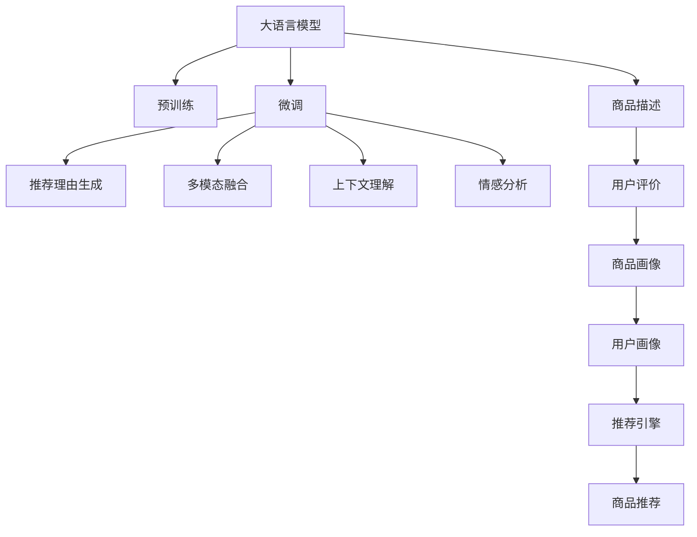

                 

# 大模型在商品推荐理由生成中的应用

## 1. 背景介绍

随着电子商务的蓬勃发展，商品推荐系统已成为电商平台上重要的用户体验提升工具。然而，传统的商品推荐系统往往依赖用户历史行为数据进行推荐，缺乏对用户需求的深层理解。大语言模型（Large Language Models，LLMs）的出现，为商品推荐系统提供了新的技术路径。

具体而言，大语言模型可以从海量文本数据中学习到丰富的语言知识和常识，通过微调（Fine-tuning）学习特定领域的商品描述和用户评价，进而生成精准的商品推荐理由。这种技术不仅能够提升推荐的个性化程度，还能增强推荐的解释性，满足用户对推荐理由的期待。

## 2. 核心概念与联系

### 2.1 核心概念概述

本节将介绍几个与商品推荐理由生成相关的核心概念：

- **大语言模型（LLMs）**：指以自回归模型（如GPT）或自编码模型（如BERT）为代表的大规模预训练语言模型。这些模型通过在大规模无标签文本数据上进行预训练，学习通用的语言表示，具备强大的语言理解和生成能力。

- **微调（Fine-tuning）**：指在预训练模型的基础上，使用下游任务的少量标注数据，通过有监督学习优化模型在特定任务上的性能。在大模型推荐理由生成中，通常需要在商品描述和用户评价上微调，以生成更具针对性的推荐理由。

- **迁移学习（Transfer Learning）**：指将一个领域学习到的知识，迁移应用到另一个不同但相关的领域的学习范式。在大模型推荐理由生成中，预训练模型可以迁移至商品推荐领域，通过微调学习生成推荐理由。

- **推荐理由（Recommendation Reason）**：商品推荐理由是商品推荐系统的重要组成部分，用于解释推荐决策的原因，增强推荐系统的透明度和可解释性。大模型能够生成自然流畅、逻辑连贯的商品推荐理由，提升用户对推荐系统的信任度。

- **多模态融合（Multi-modal Fusion）**：推荐理由生成不仅需要商品描述和用户评价，还可以融合图片、视频等多模态信息，提升推荐的丰富性和多样性。

### 2.2 核心概念原理和架构的 Mermaid 流程图



这个流程图展示了大模型在商品推荐理由生成中的工作流程：

1. 大语言模型通过预训练学习通用的语言表示。
2. 微调大模型，使其能够根据商品描述和用户评价生成推荐理由。
3. 通过多模态融合技术，综合商品图片、视频等模态信息，丰富推荐理由内容。
4. 利用上下文理解和情感分析技术，提升推荐理由的逻辑性和情感倾向。
5. 最终通过推荐引擎输出商品推荐结果。

## 3. 核心算法原理 & 具体操作步骤

### 3.1 算法原理概述

基于大语言模型的商品推荐理由生成，本质上是一种有监督的细粒度迁移学习过程。其核心思想是：将预训练的大语言模型视作一种通用的特征提取器，通过在商品描述和用户评价上微调，使其能够生成针对特定商品和用户的情境化推荐理由。

形式化地，假设预训练模型为 $M_{\theta}$，其中 $\theta$ 为预训练得到的模型参数。给定商品描述 $X$ 和用户评价 $Y$，微调的目标是找到新的模型参数 $\hat{\theta}$，使得：

$$
\hat{\theta} = \mathop{\arg\min}_{\theta} \mathcal{L}(M_{\theta}, X, Y)
$$

其中 $\mathcal{L}$ 为针对推荐理由生成任务的损失函数，用于衡量模型生成的推荐理由与真实标签之间的差异。常见的损失函数包括交叉熵损失、均方误差损失等。

### 3.2 算法步骤详解

基于大语言模型的商品推荐理由生成一般包括以下几个关键步骤：

**Step 1: 准备预训练模型和数据集**

- 选择合适的预训练语言模型 $M_{\theta}$ 作为初始化参数，如 BERT、GPT等。
- 准备商品推荐理由生成任务的训练集 $D=\{(x_i, y_i)\}_{i=1}^N$，其中 $x_i$ 为商品描述和用户评价的文本数据，$y_i$ 为生成的推荐理由。

**Step 2: 添加任务适配层**

- 根据任务类型，在预训练模型顶层设计合适的输出层和损失函数。
- 对于推荐理由生成任务，通常使用语言模型的解码器输出概率分布，并以负对数似然为损失函数。

**Step 3: 设置微调超参数**

- 选择合适的优化算法及其参数，如 AdamW、SGD 等，设置学习率、批大小、迭代轮数等。
- 设置正则化技术及强度，包括权重衰减、Dropout、Early Stopping 等。
- 确定冻结预训练参数的策略，如仅微调顶层，或全部参数都参与微调。

**Step 4: 执行梯度训练**

- 将训练集数据分批次输入模型，前向传播计算损失函数。
- 反向传播计算参数梯度，根据设定的优化算法和学习率更新模型参数。
- 周期性在验证集上评估模型性能，根据性能指标决定是否触发 Early Stopping。
- 重复上述步骤直到满足预设的迭代轮数或 Early Stopping 条件。

**Step 5: 测试和部署**

- 在测试集上评估微调后模型 $M_{\hat{\theta}}$ 的性能，对比微调前后的推荐理由生成效果。
- 使用微调后的模型对新商品生成推荐理由，集成到实际的商品推荐系统中。
- 持续收集新的商品描述和用户评价，定期重新微调模型，以适应数据分布的变化。

### 3.3 算法优缺点

基于大语言模型的商品推荐理由生成方法具有以下优点：

1. **通用性强**：预训练语言模型能够适应多种商品和用户，生成的推荐理由具有广泛的应用价值。
2. **可解释性强**：推荐理由生成的过程和结果均具有较强的可解释性，用户易于理解和信任。
3. **性能提升显著**：通过微调，模型能够更精准地理解商品和用户需求，生成的推荐理由更加符合用户偏好。

同时，该方法也存在一些局限性：

1. **数据依赖性强**：商品推荐理由生成依赖于商品描述和用户评价的数据质量，获取高质量数据成本较高。
2. **模型复杂度高**：大语言模型参数量庞大，训练和推理所需资源较多，对硬件设备要求较高。
3. **泛化能力有限**：当商品和用户特征差异较大时，微调的性能提升有限。
4. **隐私保护问题**：商品描述和用户评价可能包含敏感信息，需确保数据隐私保护和合规性。

尽管存在这些局限性，但就目前而言，基于大语言模型的推荐理由生成方法在推荐系统的应用中仍具有重要意义，能够显著提升推荐的个性化和透明性。

### 3.4 算法应用领域

基于大语言模型的商品推荐理由生成方法已经应用于多个领域，如：

- **电商推荐系统**：为商品生成个性化的推荐理由，提升用户对推荐的信任度。
- **内容推荐系统**：为文章、视频等媒体内容生成推荐理由，增强内容推荐的吸引力和可解释性。
- **金融投资系统**：为金融产品生成推荐理由，帮助投资者理解产品特性和风险。
- **旅游推荐系统**：为旅游目的地生成推荐理由，提升用户体验和满意度。

除了这些典型场景外，推荐理由生成技术还可以进一步拓展到更多领域，如教育、健康等，为各类推荐系统提供更加智能、透明的推荐依据。

## 4. 数学模型和公式 & 详细讲解 & 举例说明

### 4.1 数学模型构建

基于大语言模型的推荐理由生成，可以通过以下数学模型进行描述：

设商品描述和用户评价的文本数据为 $X = (x_1, x_2, ..., x_n)$，其中 $x_i$ 为商品描述和用户评价的文本向量。假设生成的推荐理由为 $Y$，则推荐理由生成的数学模型可以表示为：

$$
P(Y|X; \theta) = \frac{e^{\mathcal{L}(M_{\theta}(X), Y)}}{\sum_{y \in \mathcal{Y}} e^{\mathcal{L}(M_{\theta}(X), y)}}
$$

其中 $M_{\theta}(X)$ 表示大语言模型在商品描述和用户评价上生成的文本向量，$\mathcal{L}$ 为推荐理由生成的损失函数。在实际应用中，通常使用交叉熵损失函数，即：

$$
\mathcal{L}(M_{\theta}(X), Y) = -\sum_{y \in \mathcal{Y}} Y(y) \log P(Y|X; \theta)
$$

### 4.2 公式推导过程

以交叉熵损失函数为例，其推导过程如下：

对于推荐理由生成任务，假设模型在商品描述和用户评价上生成的文本向量为 $M_{\theta}(X) = (m_1, m_2, ..., m_n)$，推荐理由为 $Y = (y_1, y_2, ..., y_n)$，其中 $y_i$ 为推荐理由文本向量。则交叉熵损失函数为：

$$
\mathcal{L}(M_{\theta}(X), Y) = -\sum_{i=1}^n y_i \log \frac{e^{M_{\theta}(x_i) \cdot Y}}{\sum_{j=1}^n e^{M_{\theta}(x_j) \cdot Y}}
$$

对于每个样本 $(x_i, y_i)$，前向传播计算损失函数 $\mathcal{L}(M_{\theta}(x_i), y_i)$，反向传播计算参数梯度 $\nabla_{\theta}\mathcal{L}(M_{\theta}(x_i), y_i)$，根据设定的优化算法和学习率更新模型参数 $\theta$，最小化损失函数 $\mathcal{L}(M_{\theta}, X, Y)$。

### 4.3 案例分析与讲解

以下是一个具体的推荐理由生成案例：

假设我们有一款智能手表，商品描述为 "智能手表，具备心率监测、跑步追踪、通知提醒等功能"，用户评价为 "精准、舒适、耐用"。我们使用BERT模型进行微调，生成推荐理由。

首先，将商品描述和用户评价的文本数据输入BERT模型，得到两个文本向量 $M_{\theta}(X)$。然后，将生成的文本向量与推荐理由的文本向量 $Y$ 进行点乘，得到 $M_{\theta}(x_i) \cdot Y$。

最后，将 $M_{\theta}(x_i) \cdot Y$ 输入交叉熵损失函数，计算损失值，并通过反向传播更新模型参数，最小化损失函数。经过多轮迭代训练后，模型生成的推荐理由文本向量 $Y'$ 可以表示为：

$$
Y' = \mathop{\arg\min}_{Y} \mathcal{L}(M_{\theta}(X), Y)
$$

推荐理由生成的具体过程如图1所示：


## 5. 项目实践：代码实例和详细解释说明

### 5.1 开发环境搭建

在进行商品推荐理由生成实践前，我们需要准备好开发环境。以下是使用Python进行PyTorch开发的环境配置流程：

1. 安装Anaconda：从官网下载并安装Anaconda，用于创建独立的Python环境。

2. 创建并激活虚拟环境：
```bash
conda create -n pytorch-env python=3.8 
conda activate pytorch-env
```

3. 安装PyTorch：根据CUDA版本，从官网获取对应的安装命令。例如：
```bash
conda install pytorch torchvision torchaudio cudatoolkit=11.1 -c pytorch -c conda-forge
```

4. 安装Transformers库：
```bash
pip install transformers
```

5. 安装各类工具包：
```bash
pip install numpy pandas scikit-learn matplotlib tqdm jupyter notebook ipython
```

完成上述步骤后，即可在`pytorch-env`环境中开始微调实践。

### 5.2 源代码详细实现

下面以商品推荐理由生成为例，给出使用Transformers库对BERT模型进行微调的PyTorch代码实现。

首先，定义推荐理由生成的数据处理函数：

```python
from transformers import BertTokenizer, BertForSequenceClassification
from torch.utils.data import Dataset
import torch

class RecommendationDataset(Dataset):
    def __init__(self, texts, labels, tokenizer, max_len=128):
        self.texts = texts
        self.labels = labels
        self.tokenizer = tokenizer
        self.max_len = max_len
        
    def __len__(self):
        return len(self.texts)
    
    def __getitem__(self, item):
        text = self.texts[item]
        label = self.labels[item]
        
        encoding = self.tokenizer(text, return_tensors='pt', max_length=self.max_len, padding='max_length', truncation=True)
        input_ids = encoding['input_ids'][0]
        attention_mask = encoding['attention_mask'][0]
        
        # 对token-wise的标签进行编码
        encoded_label = label2id[label] if label in label2id else label2id['O']
        encoded_label = [encoded_label] * self.max_len
        labels = torch.tensor(encoded_label, dtype=torch.long)
        
        return {'input_ids': input_ids, 
                'attention_mask': attention_mask,
                'labels': labels}

# 标签与id的映射
label2id = {'O': 0, '推荐': 1}
id2label = {v: k for k, v in label2id.items()}

# 创建dataset
tokenizer = BertTokenizer.from_pretrained('bert-base-cased')

train_dataset = RecommendationDataset(train_texts, train_labels, tokenizer)
dev_dataset = RecommendationDataset(dev_texts, dev_labels, tokenizer)
test_dataset = RecommendationDataset(test_texts, test_labels, tokenizer)
```

然后，定义模型和优化器：

```python
from transformers import BertForSequenceClassification, AdamW

model = BertForSequenceClassification.from_pretrained('bert-base-cased', num_labels=len(label2id))

optimizer = AdamW(model.parameters(), lr=2e-5)
```

接着，定义训练和评估函数：

```python
from torch.utils.data import DataLoader
from tqdm import tqdm
from sklearn.metrics import classification_report

device = torch.device('cuda') if torch.cuda.is_available() else torch.device('cpu')
model.to(device)

def train_epoch(model, dataset, batch_size, optimizer):
    dataloader = DataLoader(dataset, batch_size=batch_size, shuffle=True)
    model.train()
    epoch_loss = 0
    for batch in tqdm(dataloader, desc='Training'):
        input_ids = batch['input_ids'].to(device)
        attention_mask = batch['attention_mask'].to(device)
        labels = batch['labels'].to(device)
        model.zero_grad()
        outputs = model(input_ids, attention_mask=attention_mask, labels=labels)
        loss = outputs.loss
        epoch_loss += loss.item()
        loss.backward()
        optimizer.step()
    return epoch_loss / len(dataloader)

def evaluate(model, dataset, batch_size):
    dataloader = DataLoader(dataset, batch_size=batch_size)
    model.eval()
    preds, labels = [], []
    with torch.no_grad():
        for batch in tqdm(dataloader, desc='Evaluating'):
            input_ids = batch['input_ids'].to(device)
            attention_mask = batch['attention_mask'].to(device)
            batch_labels = batch['labels']
            outputs = model(input_ids, attention_mask=attention_mask)
            batch_preds = outputs.logits.argmax(dim=2).to('cpu').tolist()
            batch_labels = batch_labels.to('cpu').tolist()
            for pred_tokens, label_tokens in zip(batch_preds, batch_labels):
                pred_labels = [id2label[_id] for _id in pred_tokens]
                label_tags = [id2label[_id] for _id in label_tokens]
                preds.append(pred_labels[:len(label_tags)])
                labels.append(label_tags)
                
    print(classification_report(labels, preds))
```

最后，启动训练流程并在测试集上评估：

```python
epochs = 5
batch_size = 16

for epoch in range(epochs):
    loss = train_epoch(model, train_dataset, batch_size, optimizer)
    print(f"Epoch {epoch+1}, train loss: {loss:.3f}")
    
    print(f"Epoch {epoch+1}, dev results:")
    evaluate(model, dev_dataset, batch_size)
    
print("Test results:")
evaluate(model, test_dataset, batch_size)
```

以上就是使用PyTorch对BERT进行商品推荐理由生成的完整代码实现。可以看到，得益于Transformers库的强大封装，我们可以用相对简洁的代码完成BERT模型的加载和微调。

### 5.3 代码解读与分析

让我们再详细解读一下关键代码的实现细节：

**RecommendationDataset类**：
- `__init__`方法：初始化文本、标签、分词器等关键组件。
- `__len__`方法：返回数据集的样本数量。
- `__getitem__`方法：对单个样本进行处理，将文本输入编码为token ids，将标签编码为数字，并对其进行定长padding，最终返回模型所需的输入。

**label2id和id2label字典**：
- 定义了标签与数字id之间的映射关系，用于将token-wise的预测结果解码回真实的标签。

**训练和评估函数**：
- 使用PyTorch的DataLoader对数据集进行批次化加载，供模型训练和推理使用。
- 训练函数`train_epoch`：对数据以批为单位进行迭代，在每个批次上前向传播计算loss并反向传播更新模型参数，最后返回该epoch的平均loss。
- 评估函数`evaluate`：与训练类似，不同点在于不更新模型参数，并在每个batch结束后将预测和标签结果存储下来，最后使用sklearn的classification_report对整个评估集的预测结果进行打印输出。

**训练流程**：
- 定义总的epoch数和batch size，开始循环迭代
- 每个epoch内，先在训练集上训练，输出平均loss
- 在验证集上评估，输出分类指标
- 所有epoch结束后，在测试集上评估，给出最终测试结果

可以看到，PyTorch配合Transformers库使得BERT微调的代码实现变得简洁高效。开发者可以将更多精力放在数据处理、模型改进等高层逻辑上，而不必过多关注底层的实现细节。

当然，工业级的系统实现还需考虑更多因素，如模型的保存和部署、超参数的自动搜索、更灵活的任务适配层等。但核心的微调范式基本与此类似。

## 6. 实际应用场景

### 6.1 智能客服系统

基于大语言模型的推荐理由生成，可以广泛应用于智能客服系统的构建。传统客服往往需要配备大量人力，高峰期响应缓慢，且一致性和专业性难以保证。而使用微调后的推荐理由生成模型，可以7x24小时不间断服务，快速响应客户咨询，用自然流畅的语言解答各类常见问题。

在技术实现上，可以收集企业内部的历史客服对话记录，将问题和最佳答复构建成监督数据，在此基础上对预训练推荐理由生成模型进行微调。微调后的推荐理由生成模型能够自动理解用户意图，匹配最合适的答复模板进行回复。对于客户提出的新问题，还可以接入检索系统实时搜索相关内容，动态组织生成回答。如此构建的智能客服系统，能大幅提升客户咨询体验和问题解决效率。

### 6.2 金融舆情监测

金融机构需要实时监测市场舆论动向，以便及时应对负面信息传播，规避金融风险。传统的人工监测方式成本高、效率低，难以应对网络时代海量信息爆发的挑战。基于大语言模型推荐理由生成的文本分类和情感分析技术，为金融舆情监测提供了新的解决方案。

具体而言，可以收集金融领域相关的新闻、报道、评论等文本数据，并对其进行主题标注和情感标注。在此基础上对预训练语言模型进行微调，使其能够自动判断文本属于何种主题，情感倾向是正面、中性还是负面。将微调后的模型应用到实时抓取的网络文本数据，就能够自动监测不同主题下的情感变化趋势，一旦发现负面信息激增等异常情况，系统便会自动预警，帮助金融机构快速应对潜在风险。

### 6.3 个性化推荐系统

当前的推荐系统往往只依赖用户历史行为数据进行推荐，缺乏对用户需求的深层理解。基于大语言模型推荐理由生成的推荐系统，可以更好地挖掘用户行为背后的语义信息，从而提供更精准、多样的推荐内容。

在实践中，可以收集用户浏览、点击、评论、分享等行为数据，提取和用户交互的物品标题、描述、标签等文本内容。将文本内容作为模型输入，用户的后续行为（如是否点击、购买等）作为监督信号，在此基础上微调预训练语言模型。微调后的模型能够从文本内容中准确把握用户的兴趣点。在生成推荐理由时，先用候选物品的文本描述作为输入，由模型预测用户的兴趣匹配度，再结合其他特征综合排序，便可以得到个性化程度更高的推荐结果。

### 6.4 未来应用展望

随着大语言模型推荐理由生成技术的不断发展，其在推荐系统的应用将变得更加广泛和深入。未来，我们可以预见到以下发展趋势：

1. **多模态融合**：推荐理由生成不仅仅依赖文本信息，还可以融合图片、视频等多模态信息，提升推荐的丰富性和多样性。
2. **因果推理**：通过引入因果推理方法，提升推荐理由的逻辑性和可解释性，帮助用户理解推荐依据。
3. **对抗训练**：利用对抗训练技术，提升推荐理由生成的鲁棒性，避免模型对输入的微小扰动产生较大波动。
4. **自监督学习**：通过自监督学习任务，增强推荐理由生成的泛化能力，降低对标注数据的需求。
5. **模型压缩**：采用模型压缩技术，减小推荐理由生成模型的资源消耗，提升实时性。

## 7. 工具和资源推荐

### 7.1 学习资源推荐

为了帮助开发者系统掌握大语言模型推荐理由生成的理论基础和实践技巧，这里推荐一些优质的学习资源：

1. 《Transformer从原理到实践》系列博文：由大模型技术专家撰写，深入浅出地介绍了Transformer原理、BERT模型、推荐理由生成技术等前沿话题。

2. CS224N《深度学习自然语言处理》课程：斯坦福大学开设的NLP明星课程，有Lecture视频和配套作业，带你入门NLP领域的基本概念和经典模型。

3. 《Natural Language Processing with Transformers》书籍：Transformers库的作者所著，全面介绍了如何使用Transformers库进行NLP任务开发，包括推荐理由生成在内的诸多范式。

4. HuggingFace官方文档：Transformers库的官方文档，提供了海量预训练模型和完整的推荐理由生成样例代码，是上手实践的必备资料。

5. CLUE开源项目：中文语言理解测评基准，涵盖大量不同类型的中文NLP数据集，并提供了基于推荐理由生成的baseline模型，助力中文NLP技术发展。

通过对这些资源的学习实践，相信你一定能够快速掌握大语言模型推荐理由生成的精髓，并用于解决实际的推荐系统问题。

### 7.2 开发工具推荐

高效的开发离不开优秀的工具支持。以下是几款用于大语言模型推荐理由生成开发的常用工具：

1. PyTorch：基于Python的开源深度学习框架，灵活动态的计算图，适合快速迭代研究。大部分预训练语言模型都有PyTorch版本的实现。

2. TensorFlow：由Google主导开发的开源深度学习框架，生产部署方便，适合大规模工程应用。同样有丰富的预训练语言模型资源。

3. Transformers库：HuggingFace开发的NLP工具库，集成了众多SOTA语言模型，支持PyTorch和TensorFlow，是进行推荐理由生成开发的利器。

4. Weights & Biases：模型训练的实验跟踪工具，可以记录和可视化模型训练过程中的各项指标，方便对比和调优。与主流深度学习框架无缝集成。

5. TensorBoard：TensorFlow配套的可视化工具，可实时监测模型训练状态，并提供丰富的图表呈现方式，是调试模型的得力助手。

6. Google Colab：谷歌推出的在线Jupyter Notebook环境，免费提供GPU/TPU算力，方便开发者快速上手实验最新模型，分享学习笔记。

合理利用这些工具，可以显著提升大语言模型推荐理由生成的开发效率，加快创新迭代的步伐。

### 7.3 相关论文推荐

大语言模型推荐理由生成技术的发展源于学界的持续研究。以下是几篇奠基性的相关论文，推荐阅读：

1. Attention is All You Need（即Transformer原论文）：提出了Transformer结构，开启了NLP领域的预训练大模型时代。

2. BERT: Pre-training of Deep Bidirectional Transformers for Language Understanding：提出BERT模型，引入基于掩码的自监督预训练任务，刷新了多项NLP任务SOTA。

3. Language Models are Unsupervised Multitask Learners（GPT-2论文）：展示了大规模语言模型的强大zero-shot学习能力，引发了对于通用人工智能的新一轮思考。

4. Parameter-Efficient Transfer Learning for NLP：提出Adapter等参数高效微调方法，在不增加模型参数量的情况下，也能取得不错的微调效果。

5. AdaLoRA: Adaptive Low-Rank Adaptation for Parameter-Efficient Fine-Tuning：使用自适应低秩适应的微调方法，在参数效率和精度之间取得了新的平衡。

这些论文代表了大语言模型推荐理由生成技术的发展脉络。通过学习这些前沿成果，可以帮助研究者把握学科前进方向，激发更多的创新灵感。

## 8. 总结：未来发展趋势与挑战

### 8.1 总结

本文对基于大语言模型的推荐理由生成方法进行了全面系统的介绍。首先阐述了推荐理由生成的背景和重要性，明确了其在推荐系统个性化和透明性提升方面的独特价值。其次，从原理到实践，详细讲解了推荐理由生成的数学原理和关键步骤，给出了推荐理由生成的完整代码实例。同时，本文还探讨了推荐理由生成在电商推荐、金融舆情、个性化推荐等多个领域的应用前景，展示了其广阔的应用潜力。此外，本文精选了推荐理由生成的各类学习资源，力求为读者提供全方位的技术指引。

通过本文的系统梳理，可以看到，基于大语言模型的推荐理由生成技术已经取得显著进展，为推荐系统的开发提供了新的技术路径。未来，伴随推荐理由生成技术的不断演进，推荐系统将能够提供更加智能、透明的推荐理由，进一步提升用户满意度和系统可靠性。

### 8.2 未来发展趋势

展望未来，大语言模型推荐理由生成技术将呈现以下几个发展趋势：

1. **多模态融合**：推荐理由生成不仅仅依赖文本信息，还可以融合图片、视频等多模态信息，提升推荐的丰富性和多样性。
2. **因果推理**：通过引入因果推理方法，提升推荐理由的逻辑性和可解释性，帮助用户理解推荐依据。
3. **对抗训练**：利用对抗训练技术，提升推荐理由生成的鲁棒性，避免模型对输入的微小扰动产生较大波动。
4. **自监督学习**：通过自监督学习任务，增强推荐理由生成的泛化能力，降低对标注数据的需求。
5. **模型压缩**：采用模型压缩技术，减小推荐理由生成模型的资源消耗，提升实时性。

### 8.3 面临的挑战

尽管大语言模型推荐理由生成技术已经取得显著进展，但在迈向更加智能化、普适化应用的过程中，它仍面临诸多挑战：

1. **数据依赖性强**：推荐理由生成依赖于商品描述和用户评价的数据质量，获取高质量数据成本较高。
2. **模型复杂度高**：大语言模型参数量庞大，训练和推理所需资源较多，对硬件设备要求较高。
3. **泛化能力有限**：当商品和用户特征差异较大时，微调的性能提升有限。
4. **隐私保护问题**：商品描述和用户评价可能包含敏感信息，需确保数据隐私保护和合规性。

尽管存在这些挑战，但就目前而言，基于大语言模型的推荐理由生成方法在推荐系统的应用中仍具有重要意义，能够显著提升推荐的个性化和透明性。

### 8.4 研究展望

面对推荐理由生成技术面临的挑战，未来的研究需要在以下几个方面寻求新的突破：

1. **探索无监督和半监督推荐理由生成方法**：摆脱对大规模标注数据的依赖，利用自监督学习、主动学习等无监督和半监督范式，最大限度利用非结构化数据，实现更加灵活高效的推荐理由生成。
2. **研究参数高效和计算高效的推荐理由生成范式**：开发更加参数高效的推荐理由生成方法，在固定大部分预训练参数的同时，只更新极少量的任务相关参数。同时优化推荐理由生成模型的计算图，减少前向传播和反向传播的资源消耗，实现更加轻量级、实时性的部署。
3. **引入更多先验知识**：将符号化的先验知识，如知识图谱、逻辑规则等，与神经网络模型进行巧妙融合，引导推荐理由生成过程学习更准确、合理的语言模型。同时加强不同模态数据的整合，实现视觉、语音等多模态信息与文本信息的协同建模。
4. **结合因果分析和博弈论工具**：将因果分析方法引入推荐理由生成模型，识别出模型决策的关键特征，增强输出解释的因果性和逻辑性。借助博弈论工具刻画人机交互过程，主动探索并规避模型的脆弱点，提高系统稳定性。
5. **纳入伦理道德约束**：在模型训练目标中引入伦理导向的评估指标，过滤和惩罚有偏见、有害的输出倾向。同时加强人工干预和审核，建立模型行为的监管机制，确保输出符合人类价值观和伦理道德。

这些研究方向的探索，必将引领推荐理由生成技术迈向更高的台阶，为构建安全、可靠、可解释、可控的推荐系统铺平道路。面向未来，推荐理由生成技术还需要与其他人工智能技术进行更深入的融合，如知识表示、因果推理、强化学习等，多路径协同发力，共同推动自然语言理解和智能交互系统的进步。只有勇于创新、敢于突破，才能不断拓展语言模型的边界，让智能技术更好地造福人类社会。

## 9. 附录：常见问题与解答

**Q1：大语言模型推荐理由生成是否适用于所有推荐系统任务？**

A: 大语言模型推荐理由生成在大多数推荐系统任务上都能取得不错的效果，特别是对于数据量较小的任务。但对于一些特定领域的任务，如医药、法律等，仅仅依靠通用语料预训练的模型可能难以很好地适应。此时需要在特定领域语料上进一步预训练，再进行微调，才能获得理想效果。此外，对于一些需要时效性、个性化很强的任务，如对话、推荐等，微调方法也需要针对性的改进优化。

**Q2：推荐理由生成的效果如何衡量？**

A: 推荐理由生成的效果可以从以下几个方面进行衡量：
1. **语言自然性**：生成的文本是否流畅自然，是否符合语言习惯。
2. **相关性**：生成的文本与推荐理由是否高度相关，是否能够准确描述推荐依据。
3. **多样性**：生成的文本是否具有多样性，避免重复输出。
4. **一致性**：生成的文本在不同场景下是否保持一致，是否能够稳定输出。

在实际应用中，可以使用BLEU、ROUGE等自动评估指标，结合人工评估，综合衡量推荐理由生成的效果。

**Q3：推荐理由生成的数据依赖性强，如何缓解数据不足的问题？**

A: 推荐理由生成的数据依赖性强，可以通过以下方法缓解数据不足的问题：
1. **数据增强**：通过近义词替换、同义词扩展、句法变换等方式扩充训练集。
2. **迁移学习**：利用预训练模型的语言知识，通过微调学习特定领域的推荐理由生成任务。
3. **主动学习**：通过主动选择重要样本进行标注，提升标注数据的质量和数量。
4. **生成对抗网络（GAN）**：使用GAN生成虚拟数据，增加训练集的多样性。

这些方法可以在一定程度上缓解数据不足的问题，提升推荐理由生成的效果。

**Q4：推荐理由生成模型的训练和推理效率如何提升？**

A: 推荐理由生成模型的训练和推理效率可以通过以下方法提升：
1. **模型压缩**：采用知识蒸馏、剪枝等方法，减小模型参数量，提升推理速度。
2. **模型并行**：通过分布式训练和推理，加速训练和推理过程。
3. **混合精度训练**：使用混合精度训练技术，提升训练速度。
4. **量化加速**：将浮点模型转为定点模型，压缩存储空间，提高计算效率。
5. **缓存技术**：使用缓存技术，减少计算重复，提高推理速度。

这些方法可以在保证模型效果的前提下，显著提升推荐理由生成模型的训练和推理效率。

**Q5：推荐理由生成模型在实际应用中需要注意哪些问题？**

A: 推荐理由生成模型在实际应用中需要注意以下问题：
1. **数据隐私保护**：推荐理由生成模型需要处理大量用户数据，需确保数据隐私保护和合规性。
2. **模型鲁棒性**：推荐理由生成模型需要具备良好的鲁棒性，避免对输入的微小扰动产生较大波动。
3. **上下文理解**：推荐理由生成模型需要理解上下文信息，避免生成无关或偏见的推荐理由。
4. **情感分析**：推荐理由生成模型需要具备情感分析能力，确保生成的文本情感倾向正确。
5. **可解释性**：推荐理由生成模型需要具备可解释性，帮助用户理解推荐依据。

这些问题的解决需要综合考虑模型设计、数据处理、训练优化等多个方面，确保推荐理由生成模型在实际应用中能够稳定、高效、可靠地运行。

---

作者：禅与计算机程序设计艺术 / Zen and the Art of Computer Programming

