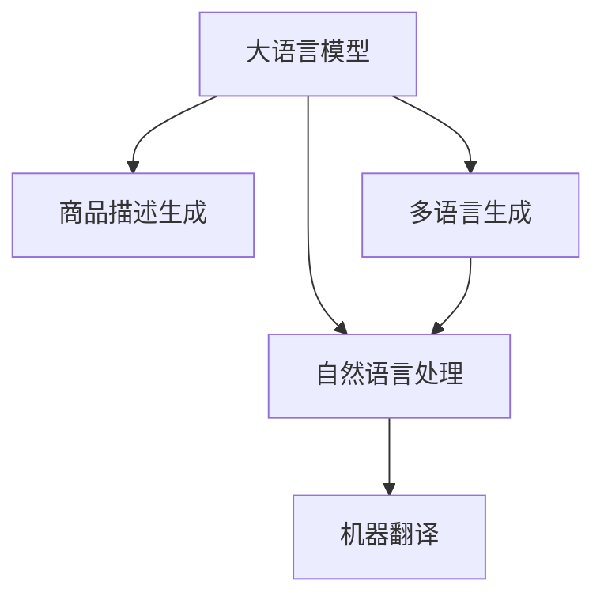

                 

# 大模型在商品描述多语言生成中的应用

> 关键词：大语言模型,商品描述生成,多语言生成,自然语言处理,NLP,深度学习,机器翻译,文本生成,多模态数据

## 1. 背景介绍

在全球化贸易日益增长的今天，商品描述的多语言生成成为了一个重要需求。无论是跨境电商平台还是本地零售商，都希望能够通过多语言描述，让更多国际消费者了解和购买他们的产品。然而，由于语言表达的差异、商品描述的多样性，以及跨语言映射的复杂性，传统的机器翻译和语言生成方法面临诸多挑战。大语言模型的兴起，为商品描述的多语言生成提供了新的解决思路。

### 1.1 问题由来
传统的商品描述生成主要依赖于规则和模板，难以处理多样性和复杂性高的商品描述。机器翻译方法能够生成准确的翻译结果，但常常缺乏对商品特征的准确理解。而大语言模型通过大规模无标签语料进行预训练，学习到了丰富的语言知识和表达能力，能够通过少量的有标签数据进行微调，生成符合特定语言习惯和商品特征的描述。

### 1.2 问题核心关键点
大语言模型在商品描述多语言生成中的应用，主要包括以下几个核心关键点：

- **预训练模型**：选择适合的语言模型进行预训练，如BERT、GPT系列模型。
- **数据准备**：准备商品描述的多语言数据集，包括原始商品描述和目标语言描述。
- **微调目标**：定义微调的目标，如生成流畅自然、信息准确、格式规范的商品描述。
- **模型评估**：设计评估指标，如BLEU、ROUGE、HIT等，衡量生成文本的质量。

## 2. 核心概念与联系

### 2.1 核心概念概述

为了更好地理解大模型在商品描述多语言生成中的应用，本节将介绍几个密切相关的核心概念：

- **大语言模型(Large Language Model, LLM)**：以自回归(如GPT)或自编码(如BERT)模型为代表的大规模预训练语言模型。通过在大规模无标签文本语料上进行预训练，学习通用的语言表示，具备强大的语言理解和生成能力。

- **商品描述生成(Product Description Generation, PDG)**：根据商品特征和语言模型，自动生成符合目标语言习惯的商品描述。是电子商务领域重要的应用方向。

- **多语言生成(Multilingual Generation)**：使用大语言模型生成多语言文本，同时保留语言的独特性和多样性。

- **自然语言处理(Natural Language Processing, NLP)**：研究如何让计算机理解、处理和生成自然语言，包括文本分类、命名实体识别、语言翻译等。

- **深度学习(Deep Learning)**：一种通过多层神经网络结构模拟人脑处理信息的方式，广泛应用于NLP、计算机视觉等领域。

- **机器翻译(Machine Translation, MT)**：利用大语言模型将一种语言的文本转换为另一种语言，实现语言间的自动通信。

这些核心概念之间的逻辑关系可以通过以下Mermaid流程图来展示：



这个流程图展示了大语言模型在商品描述生成中的应用场景和主要技术点：

1. 大语言模型通过预训练获得基础能力。
2. 商品描述生成和大语言模型紧密相关，需要模型学习商品特征和语言知识。
3. 多语言生成要求模型理解并生成多种语言文本。
4. 自然语言处理是大语言模型的应用之一，涵盖文本分类、语言翻译等。
5. 机器翻译是自然语言处理的重要子领域，通过大语言模型实现语言间的自动转换。

这些概念共同构成了商品描述多语言生成的大模型应用框架，为其提供了强大的技术支撑。

## 3. 核心算法原理 & 具体操作步骤
### 3.1 算法原理概述

大语言模型在商品描述多语言生成中的主要工作流程如下：

1. **预训练模型选择**：选择适合的大语言模型，如GPT、BERT等。
2. **数据准备**：准备多语言的商品描述数据集，包括原始描述和目标语言描述。
3. **微调目标定义**：定义微调的目标，如生成流畅自然、信息准确、格式规范的商品描述。
4. **模型训练**：在大语言模型基础上，使用标注数据进行微调训练，生成目标语言的商品描述。
5. **模型评估**：设计评估指标，如BLEU、ROUGE、HIT等，衡量生成文本的质量。

### 3.2 算法步骤详解

#### 步骤1：预训练模型选择
选择合适的预训练模型是大模型应用的基础。对于商品描述生成任务，可以选择具有以下特点的模型：

- **语言理解能力**：模型需具备强大的语言理解能力，能够处理复杂多样的商品描述。
- **多语言适应性**：模型需具备良好的多语言适应性，能够在多种语言间准确转换。
- **生成能力**：模型需具备优秀的生成能力，生成的描述需流畅自然、信息准确。

目前，较为适用的预训练模型包括GPT、BERT系列、XLNet等。其中，GPT系列模型在生成流畅度上表现优异，BERT系列模型在理解上下文关系上较为出色。

#### 步骤2：数据准备
商品描述的多语言数据集是模型训练的基础。可以从以下途径获取数据：

- **电商平台数据**：收集各平台的商品描述数据，包括中文和目标语言描述。
- **公开语料库**：利用如WMT等开源语料库，获取多语言商品描述。
- **自采集数据**：针对特定商品，采集多种语言的商品描述，并标注翻译结果。

#### 步骤3：微调目标定义
明确微调目标有助于指导模型训练，包括：

- **生成流畅度**：生成的描述需流畅自然，符合目标语言的语法和习惯。
- **信息准确性**：描述需准确反映商品特征，不含歧义或错误信息。
- **格式规范性**：描述需符合商品描述的格式要求，如词序、长度等。

#### 步骤4：模型训练
在微调过程中，需要定义损失函数和优化器，具体步骤如下：

- **损失函数**：选择适合的商品描述生成任务损失函数，如交叉熵损失、BLEU损失等。
- **优化器**：选择适当的优化器，如Adam、SGD等，设置学习率、批大小等参数。
- **训练流程**：将标注数据分批次输入模型，前向传播计算损失函数，反向传播更新模型参数，重复直至收敛。

#### 步骤5：模型评估
模型评估有助于衡量生成文本的质量，具体步骤如下：

- **指标选择**：选择适合的评估指标，如BLEU、ROUGE、HIT等。
- **测试集准备**：准备测试集数据，并划分验证集和测试集。
- **评估流程**：在验证集和测试集上评估模型性能，记录评估结果。

## 4. 数学模型和公式 & 详细讲解 & 举例说明
### 4.1 数学模型构建

商品描述多语言生成可以建模为以下形式：

- **输入**：商品特征描述$X$和目标语言$L$。
- **输出**：目标语言的商品描述$Y$。
- **模型**：大语言模型$M_{\theta}$。

其中，$X$和$L$是输入的静态变量，$Y$是输出的动态变量，$M_{\theta}$是包含参数$\theta$的生成模型。

### 4.2 公式推导过程

假设模型输出为离散的概率分布$p(Y|X, L)$，则模型的最大似然估计目标为：

$$
\max_{\theta} \sum_{i=1}^{N} \log p(Y^{(i)}|X^{(i)}, L^{(i)})
$$

其中$N$为样本数，$Y^{(i)}$和$X^{(i)}$、$L^{(i)}$分别为第$i$个样本的目标语言描述、商品特征描述和语言标识。

### 4.3 案例分析与讲解

假设我们希望使用GPT模型生成英语的商品描述。首先，我们需要收集多语言的商品描述数据集。接着，通过微调GPT模型，学习商品描述生成的规律。

1. **数据准备**：收集1000条商品描述的中文和英文翻译。
2. **模型选择**：选择GPT-2模型进行微调。
3. **微调目标**：定义生成流畅度、信息准确性、格式规范性。
4. **损失函数**：选择BLEU损失。
5. **优化器**：设置Adam优化器，学习率为1e-4。
6. **训练流程**：分批次输入数据，进行前向传播和反向传播，更新模型参数。
7. **模型评估**：使用BLEU指标在验证集和测试集上评估模型性能。

## 5. 项目实践：代码实例和详细解释说明
### 5.1 开发环境搭建

在进行商品描述多语言生成的实践前，我们需要准备好开发环境。以下是使用Python进行PyTorch开发的环境配置流程：

1. 安装Anaconda：从官网下载并安装Anaconda，用于创建独立的Python环境。
2. 创建并激活虚拟环境：
```bash
conda create -n pytorch-env python=3.8 
conda activate pytorch-env
```
3. 安装PyTorch：根据CUDA版本，从官网获取对应的安装命令。例如：
```bash
conda install pytorch torchvision torchaudio cudatoolkit=11.1 -c pytorch -c conda-forge
```
4. 安装Transformers库：
```bash
pip install transformers
```
5. 安装各类工具包：
```bash
pip install numpy pandas scikit-learn matplotlib tqdm jupyter notebook ipython
```

完成上述步骤后，即可在`pytorch-env`环境中开始商品描述多语言生成的实践。

### 5.2 源代码详细实现

这里我们以使用GPT模型生成英语商品描述为例，给出使用Transformers库进行微调的PyTorch代码实现。

```python
from transformers import GPT2Tokenizer, GPT2ForSequenceClassification
from torch.utils.data import Dataset, DataLoader
from torch.optim import Adam
import torch

# 定义商品描述数据集
class ProductDataset(Dataset):
    def __init__(self, texts, labels, tokenizer, max_len=128):
        self.texts = texts
        self.labels = labels
        self.tokenizer = tokenizer
        self.max_len = max_len
        
    def __len__(self):
        return len(self.texts)
    
    def __getitem__(self, item):
        text = self.texts[item]
        label = self.labels[item]
        
        encoding = self.tokenizer(text, return_tensors='pt', max_length=self.max_len, padding='max_length', truncation=True)
        input_ids = encoding['input_ids'][0]
        attention_mask = encoding['attention_mask'][0]
        
        # 对标签进行编码
        label = label2id[label] if label != -100 else -100
        
        return {'input_ids': input_ids, 
                'attention_mask': attention_mask,
                'labels': label}

# 准备数据集
tokenizer = GPT2Tokenizer.from_pretrained('gpt2')
train_dataset = ProductDataset(train_texts, train_labels, tokenizer)
dev_dataset = ProductDataset(dev_texts, dev_labels, tokenizer)
test_dataset = ProductDataset(test_texts, test_labels, tokenizer)

# 定义模型和优化器
model = GPT2ForSequenceClassification.from_pretrained('gpt2', num_labels=len(label2id)+1)
optimizer = Adam(model.parameters(), lr=2e-5)

# 定义损失函数和评估指标
loss_fn = torch.nn.CrossEntropyLoss()
bleu = BleuScorer()

# 训练和评估
device = torch.device('cuda') if torch.cuda.is_available() else torch.device('cpu')
model.to(device)

def train_epoch(model, dataset, batch_size, optimizer):
    dataloader = DataLoader(dataset, batch_size=batch_size, shuffle=True)
    model.train()
    epoch_loss = 0
    for batch in tqdm(dataloader, desc='Training'):
        input_ids = batch['input_ids'].to(device)
        attention_mask = batch['attention_mask'].to(device)
        labels = batch['labels'].to(device)
        model.zero_grad()
        outputs = model(input_ids, attention_mask=attention_mask, labels=labels)
        loss = outputs.loss
        epoch_loss += loss.item()
        loss.backward()
        optimizer.step()
    return epoch_loss / len(dataloader)

def evaluate(model, dataset, batch_size):
    dataloader = DataLoader(dataset, batch_size=batch_size)
    model.eval()
    preds, labels = [], []
    with torch.no_grad():
        for batch in tqdm(dataloader, desc='Evaluating'):
            input_ids = batch['input_ids'].to(device)
            attention_mask = batch['attention_mask'].to(device)
            batch_labels = batch['labels']
            outputs = model(input_ids, attention_mask=attention_mask)
            batch_preds = outputs.logits.argmax(dim=2).to('cpu').tolist()
            batch_labels = batch_labels.to('cpu').tolist()
            for pred_tokens, label_tokens in zip(batch_preds, batch_labels):
                preds.append(pred_tokens)
                labels.append(label_tokens)
    return bleu.compute_score(preds, labels)

# 训练流程
epochs = 5
batch_size = 16

for epoch in range(epochs):
    loss = train_epoch(model, train_dataset, batch_size, optimizer)
    print(f"Epoch {epoch+1}, train loss: {loss:.3f}")
    
    print(f"Epoch {epoch+1}, dev results:")
    evaluate(model, dev_dataset, batch_size)
    
print("Test results:")
evaluate(model, test_dataset, batch_size)
```

以上代码实现了使用GPT模型进行商品描述生成的完整过程。可以看到，由于GPT模型采用自回归机制，微调过程的优化目标较为复杂。需要合理设置损失函数和优化器，并进行详细的训练和评估。

### 5.3 代码解读与分析

让我们再详细解读一下关键代码的实现细节：

**ProductDataset类**：
- `__init__`方法：初始化文本、标签、分词器等关键组件。
- `__len__`方法：返回数据集的样本数量。
- `__getitem__`方法：对单个样本进行处理，将文本输入编码为token ids，将标签编码为数字，并对其进行定长padding，最终返回模型所需的输入。

**tokenizer**：
- 使用GPT2Tokenizer进行分词和编码，方便模型输入。

**模型和优化器**：
- 定义GPT2ForSequenceClassification模型和Adam优化器，设置学习率等参数。

**损失函数和评估指标**：
- 使用交叉熵损失和BLEU指标进行训练和评估，BLEU指标计算生成文本和目标文本的BLEU分数。

**训练和评估函数**：
- 使用PyTorch的DataLoader对数据集进行批次化加载，供模型训练和推理使用。
- 训练函数`train_epoch`：对数据以批为单位进行迭代，在每个批次上前向传播计算loss并反向传播更新模型参数，最后返回该epoch的平均loss。
- 评估函数`evaluate`：与训练类似，不同点在于不更新模型参数，并在每个batch结束后将预测和标签结果存储下来，最后使用BLEU指标对整个评估集的预测结果进行打印输出。

**训练流程**：
- 定义总的epoch数和batch size，开始循环迭代
- 每个epoch内，先在训练集上训练，输出平均loss
- 在验证集上评估，输出BLEU分数
- 重复上述过程直至收敛
- 在测试集上评估，给出最终测试结果

可以看到，PyTorch配合Transformers库使得GPT模型商品描述生成的代码实现变得简洁高效。开发者可以将更多精力放在数据处理、模型改进等高层逻辑上，而不必过多关注底层的实现细节。

当然，工业级的系统实现还需考虑更多因素，如模型的保存和部署、超参数的自动搜索、更灵活的任务适配层等。但核心的微调范式基本与此类似。

## 6. 实际应用场景
### 6.1 智能客服系统

智能客服系统通过大语言模型生成多语言商品描述，帮助客户了解产品信息，提高客户满意度。系统自动抓取客户输入的查询，并在大语言模型上进行多语言翻译和生成，返回符合客户语言习惯的商品描述。

**技术实现**：
- 收集客户的历史查询和商品信息，构建标注数据集。
- 使用GPT模型进行微调，生成多语言的商品描述。
- 在客户查询时，将查询翻译成目标语言，并在模型上进行生成，返回生成的描述。

**效果评估**：
- 使用BLEU等指标评估生成的描述与原始商品描述的相似度。
- 收集客户反馈，评估客户满意度。

### 6.2 跨境电商平台

跨境电商平台通过大语言模型生成多语言商品描述，帮助用户快速了解产品信息。系统自动抓取商品信息，并在大语言模型上进行多语言翻译和生成，返回符合目标语言的商品描述。

**技术实现**：
- 收集平台上的商品描述和用户评论，构建标注数据集。
- 使用GPT模型进行微调，生成多语言的商品描述。
- 在用户浏览商品时，将商品信息翻译成目标语言，并在模型上进行生成，返回生成的描述。

**效果评估**：
- 使用BLEU等指标评估生成的描述与原始商品描述的相似度。
- 记录用户点击和购买行为，评估系统的转化效果。

### 6.3 在线教育平台

在线教育平台通过大语言模型生成多语言商品描述，帮助用户快速了解课程信息。系统自动抓取课程信息，并在大语言模型上进行多语言翻译和生成，返回符合目标语言的商品描述。

**技术实现**：
- 收集课程信息，构建标注数据集。
- 使用GPT模型进行微调，生成多语言的课程描述。
- 在用户浏览课程时，将课程信息翻译成目标语言，并在模型上进行生成，返回生成的描述。

**效果评估**：
- 使用BLEU等指标评估生成的描述与原始课程描述的相似度。
- 记录用户点击和购买行为，评估系统的转化效果。

### 6.4 未来应用展望

随着大语言模型和微调技术的不断发展，商品描述多语言生成技术将在更多领域得到应用，为相关业务带来新的突破。

在智慧零售领域，通过大语言模型生成多语言商品描述，可以提升商品展示和推荐的准确性和多样性，增强用户的购物体验。

在跨境电商、在线教育、智能客服等领域，通过大语言模型生成多语言商品描述，可以降低人工成本，提升服务效率，满足用户的多语言需求。

未来，随着模型的规模和能力的不断提升，商品描述多语言生成技术将更加智能、高效，为各行各业提供更优质的语言服务。

## 7. 工具和资源推荐
### 7.1 学习资源推荐

为了帮助开发者系统掌握商品描述多语言生成的理论基础和实践技巧，这里推荐一些优质的学习资源：

1. 《自然语言处理综述》系列博文：由大模型技术专家撰写，涵盖NLP领域的经典理论和前沿研究。
2. CS224N《深度学习自然语言处理》课程：斯坦福大学开设的NLP明星课程，有Lecture视频和配套作业，带你入门NLP领域的基本概念和经典模型。
3. 《自然语言处理与深度学习》书籍：全面介绍了NLP和深度学习的基本原理和应用，是学习商品描述多语言生成的重要参考资料。
4. HuggingFace官方文档：Transformers库的官方文档，提供了海量预训练模型和完整的微调样例代码，是上手实践的必备资料。
5. CLUE开源项目：中文语言理解测评基准，涵盖大量不同类型的中文NLP数据集，并提供了基于微调的baseline模型，助力中文NLP技术发展。

通过对这些资源的学习实践，相信你一定能够快速掌握商品描述多语言生成的精髓，并用于解决实际的NLP问题。
###  7.2 开发工具推荐

高效的开发离不开优秀的工具支持。以下是几款用于商品描述多语言生成开发的常用工具：

1. PyTorch：基于Python的开源深度学习框架，灵活动态的计算图，适合快速迭代研究。大部分预训练语言模型都有PyTorch版本的实现。
2. TensorFlow：由Google主导开发的开源深度学习框架，生产部署方便，适合大规模工程应用。同样有丰富的预训练语言模型资源。
3. Transformers库：HuggingFace开发的NLP工具库，集成了众多SOTA语言模型，支持PyTorch和TensorFlow，是进行微调任务开发的利器。
4. Weights & Biases：模型训练的实验跟踪工具，可以记录和可视化模型训练过程中的各项指标，方便对比和调优。与主流深度学习框架无缝集成。
5. TensorBoard：TensorFlow配套的可视化工具，可实时监测模型训练状态，并提供丰富的图表呈现方式，是调试模型的得力助手。
6. Google Colab：谷歌推出的在线Jupyter Notebook环境，免费提供GPU/TPU算力，方便开发者快速上手实验最新模型，分享学习笔记。

合理利用这些工具，可以显著提升商品描述多语言生成的开发效率，加快创新迭代的步伐。

### 7.3 相关论文推荐

商品描述多语言生成技术的发展得益于学界的持续研究。以下是几篇奠基性的相关论文，推荐阅读：

1. "Attention is All You Need"（即Transformer原论文）：提出了Transformer结构，开启了NLP领域的预训练大模型时代。
2. "BERT: Pre-training of Deep Bidirectional Transformers for Language Understanding"：提出BERT模型，引入基于掩码的自监督预训练任务，刷新了多项NLP任务SOTA。
3. "Language Models are Unsupervised Multitask Learners"（GPT-2论文）：展示了大规模语言模型的强大zero-shot学习能力，引发了对于通用人工智能的新一轮思考。
4. "Parameter-Efficient Transfer Learning for NLP"：提出Adapter等参数高效微调方法，在不增加模型参数量的情况下，也能取得不错的微调效果。
5. "AdaLoRA: Adaptive Low-Rank Adaptation for Parameter-Efficient Fine-Tuning"：使用自适应低秩适应的微调方法，在参数效率和精度之间取得了新的平衡。
6. "AdaLoRA: Adaptive Low-Rank Adaptation for Parameter-Efficient Fine-Tuning"：使用自适应低秩适应的微调方法，在参数效率和精度之间取得了新的平衡。
7. "Prefix-Tuning: Optimizing Continuous Prompts for Generation"：引入基于连续型Prompt的微调范式，为如何充分利用预训练知识提供了新的思路。

这些论文代表了大语言模型微调技术的发展脉络。通过学习这些前沿成果，可以帮助研究者把握学科前进方向，激发更多的创新灵感。

## 8. 总结：未来发展趋势与挑战

### 8.1 总结

本文对基于大语言模型的商品描述多语言生成技术进行了全面系统的介绍。首先阐述了商品描述多语言生成的背景和意义，明确了商品描述生成与大语言模型的紧密联系。其次，从原理到实践，详细讲解了商品描述多语言生成的数学模型、核心算法和关键步骤，给出了商品描述多语言生成的完整代码实现。同时，本文还广泛探讨了商品描述多语言生成在智能客服、跨境电商、在线教育等领域的实际应用，展示了商品描述多语言生成的广阔前景。此外，本文精选了商品描述多语言生成的学习资源、开发工具和相关论文，力求为读者提供全方位的技术指引。

通过本文的系统梳理，可以看到，基于大语言模型的商品描述多语言生成技术正在成为NLP领域的重要范式，极大地拓展了预训练语言模型的应用边界，催生了更多的落地场景。未来，随着预训练语言模型和微调方法的持续演进，商品描述多语言生成必将在更广泛的领域得到应用，为各行各业带来新的变革。

### 8.2 未来发展趋势

展望未来，商品描述多语言生成技术将呈现以下几个发展趋势：

1. **模型规模持续增大**：随着算力成本的下降和数据规模的扩张，预训练语言模型的参数量还将持续增长。超大规模语言模型蕴含的丰富语言知识，将进一步提升商品描述多语言生成的准确性和多样性。
2. **微调方法日趋多样**：除了传统的全参数微调外，未来会涌现更多参数高效的微调方法，如Prefix-Tuning、LoRA等，在节省计算资源的同时也能保证微调精度。
3. **多模态融合**：商品描述不仅包括文本，还涉及图像、视频等多模态信息。未来的模型将能够更好地整合多模态信息，提升商品描述生成的效果。
4. **持续学习**：商品描述多语言生成模型需要不断学习新的商品信息，以保持其时效性和适应性。如何在不遗忘原有知识的同时，高效吸收新知识，将是重要的研究课题。
5. **零样本和少样本学习**：通过提示学习(Prompt-based Learning)，利用大模型的语言理解能力，在更少的标注样本上也能实现良好的商品描述生成效果。

这些趋势凸显了商品描述多语言生成技术的广阔前景。这些方向的探索发展，必将进一步提升NLP系统的性能和应用范围，为人类认知智能的进化带来深远影响。

### 8.3 面临的挑战

尽管商品描述多语言生成技术已经取得了瞩目成就，但在迈向更加智能化、普适化应用的过程中，仍面临诸多挑战：

1. **标注成本高昂**：商品描述的多语言数据标注成本较高，获取高质量标注数据的成本较高。如何进一步降低微调对标注样本的依赖，将是一大难题。
2. **模型鲁棒性不足**：商品描述多语言生成模型面对不同语言风格和商品特征时，泛化性能往往大打折扣。如何提高模型的鲁棒性，避免灾难性遗忘，还需要更多理论和实践的积累。
3. **推理效率有待提高**：大规模语言模型在实际部署时往往面临推理速度慢、内存占用大等效率问题。如何在保证性能的同时，简化模型结构，提升推理速度，优化资源占用，将是重要的优化方向。
4. **可解释性亟需加强**：商品描述多语言生成模型通常缺乏可解释性，难以解释其内部工作机制和决策逻辑。对于医疗、金融等高风险应用，算法的可解释性和可审计性尤为重要。
5. **安全性有待保障**：商品描述多语言生成模型难免会学习到有偏见、有害的信息，通过微调传递到下游任务，产生误导性、歧视性的输出，给实际应用带来安全隐患。如何从数据和算法层面消除模型偏见，避免恶意用途，确保输出的安全性，也将是重要的研究课题。

这些挑战需要开发者和研究者共同应对，通过不断优化模型、改进算法和提升数据质量，确保商品描述多语言生成技术在实际应用中的可靠性和安全性。

### 8.4 研究展望

面对商品描述多语言生成所面临的挑战，未来的研究需要在以下几个方面寻求新的突破：

1. **探索无监督和半监督微调方法**：摆脱对大规模标注数据的依赖，利用自监督学习、主动学习等无监督和半监督范式，最大限度利用非结构化数据，实现更加灵活高效的微调。
2. **研究参数高效和计算高效的微调范式**：开发更加参数高效的微调方法，在固定大部分预训练参数的同时，只更新极少量的任务相关参数。同时优化微调模型的计算图，减少前向传播和反向传播的资源消耗，实现更加轻量级、实时性的部署。
3. **融合因果和对比学习范式**：通过引入因果推断和对比学习思想，增强商品描述多语言生成模型建立稳定因果关系的能力，学习更加普适、鲁棒的语言表征，从而提升模型泛化性和抗干扰能力。
4. **引入更多先验知识**：将符号化的先验知识，如知识图谱、逻辑规则等，与神经网络模型进行巧妙融合，引导商品描述多语言生成过程学习更准确、合理的语言模型。同时加强不同模态数据的整合，实现视觉、语音等多模态信息与文本信息的协同建模。
5. **结合因果分析和博弈论工具**：将因果分析方法引入商品描述多语言生成模型，识别出模型决策的关键特征，增强输出解释的因果性和逻辑性。借助博弈论工具刻画人机交互过程，主动探索并规避模型的脆弱点，提高系统稳定性。
6. **纳入伦理道德约束**：在模型训练目标中引入伦理导向的评估指标，过滤和惩罚有偏见、有害的输出倾向。同时加强人工干预和审核，建立模型行为的监管机制，确保输出符合人类价值观和伦理道德。

这些研究方向的探索，必将引领商品描述多语言生成技术迈向更高的台阶，为构建安全、可靠、可解释、可控的智能系统铺平道路。面向未来，商品描述多语言生成技术还需要与其他人工智能技术进行更深入的融合，如知识表示、因果推理、强化学习等，多路径协同发力，共同推动自然语言理解和智能交互系统的进步。只有勇于创新、敢于突破，才能不断拓展语言模型的边界，让智能技术更好地造福人类社会。

## 9. 附录：常见问题与解答

**Q1：商品描述多语言生成是否适用于所有商品？**

A: 商品描述多语言生成在大规模商品和多样化商品领域表现较好。对于一些特殊商品，如复杂商品、定制商品等，可能需要根据商品特征进行额外的微调。

**Q2：商品描述多语言生成面临哪些资源瓶颈？**

A: 商品描述多语言生成面临的主要资源瓶颈包括：
1. 数据标注成本高昂，获取高质量标注数据的成本较高。
2. 模型推理效率较低，大规模语言模型在实际部署时往往面临推理速度慢、内存占用大等效率问题。
3. 模型可解释性不足，难以解释其内部工作机制和决策逻辑。

**Q3：商品描述多语言生成在实际应用中需要注意哪些问题？**

A: 商品描述多语言生成在实际应用中需要注意以下问题：
1. 数据准备：确保数据的多样性和代表性，避免数据偏斜影响生成效果。
2. 模型选择：选择合适的预训练模型，根据任务特点进行微调。
3. 损失函数选择：选择适合的损失函数，考虑生成流畅度、信息准确性等因素。
4. 评估指标：选择合适的评估指标，如BLEU、ROUGE、HIT等，衡量生成文本的质量。
5. 模型优化：合理设置学习率、批大小等超参数，进行模型优化。

**Q4：商品描述多语言生成在多语言应用中有哪些挑战？**

A: 商品描述多语言生成在多语言应用中面临以下挑战：
1. 数据标注成本高昂，获取高质量标注数据的成本较高。
2. 模型鲁棒性不足，商品描述多语言生成模型面对不同语言风格和商品特征时，泛化性能往往大打折扣。
3. 推理效率有待提高，大规模语言模型在实际部署时往往面临推理速度慢、内存占用大等效率问题。
4. 可解释性亟需加强，商品描述多语言生成模型通常缺乏可解释性，难以解释其内部工作机制和决策逻辑。
5. 安全性有待保障，商品描述多语言生成模型难免会学习到有偏见、有害的信息，通过微调传递到下游任务，产生误导性、歧视性的输出，给实际应用带来安全隐患。

这些挑战需要开发者和研究者共同应对，通过不断优化模型、改进算法和提升数据质量，确保商品描述多语言生成技术在实际应用中的可靠性和安全性。

