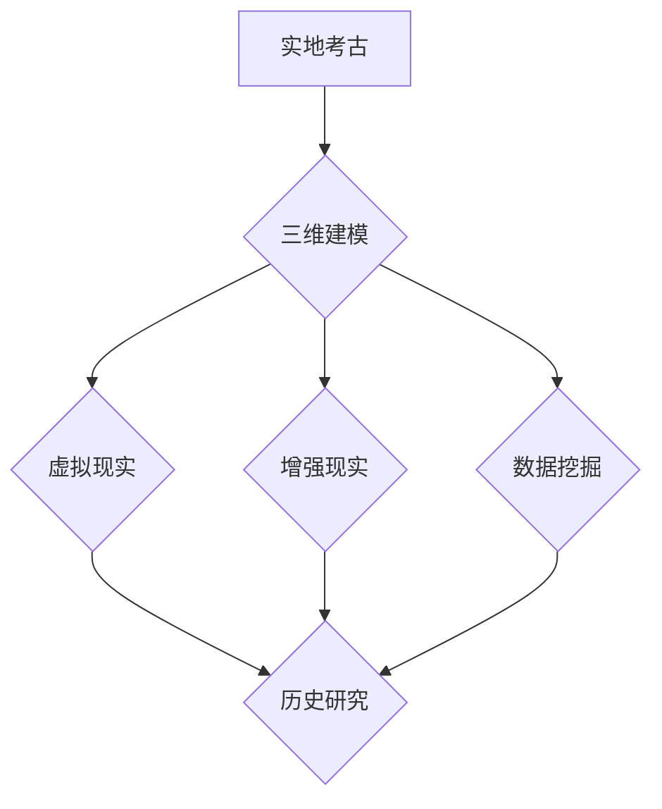

                 

## 数字考古创业：虚拟技术在历史研究中的应用

> 关键词：数字考古学、虚拟现实、增强现实、三维建模、历史研究、数据挖掘、人工智能、遗产保护

## 1. 背景介绍

随着科技的飞速发展，虚拟现实 (VR)、增强现实 (AR) 和三维建模等虚拟技术逐渐成熟，为历史研究开辟了全新的领域。数字考古学应运而生，它利用这些技术手段对历史遗迹进行数字化重建、虚拟体验和数据分析，为我们提供更直观、更深入的历史理解。

传统考古学主要依赖于实地挖掘和文物分析，其过程耗时、成本高，且容易受到环境因素和人为破坏的影响。数字考古学则通过数字化手段，克服了这些局限性，实现了对历史遗迹的无损、可重复、可交互的探索和研究。

## 2. 核心概念与联系

### 2.1 数字考古学

数字考古学是指利用计算机技术和数字工具对考古遗址进行数字化记录、分析和研究的学科。它涵盖了以下几个核心概念：

* **三维建模:** 利用激光扫描、照片grammetry等技术，对考古遗址进行精确的数字化重建，生成三维模型。
* **虚拟现实 (VR):** 通过头戴式设备，将用户沉浸到虚拟的考古遗址环境中，进行身临其境的探索和体验。
* **增强现实 (AR):** 将虚拟信息叠加到现实世界中，例如在实地考古遗址上显示虚拟的建筑、文物或历史场景。
* **数据挖掘:** 利用计算机算法对考古数据进行分析，发现隐藏的模式和规律，从而揭示历史事件和文化现象。

### 2.2 数字考古学架构



## 3. 核心算法原理 & 具体操作步骤

### 3.1 算法原理概述

数字考古学中常用的算法主要包括：

* **点云处理算法:** 用于处理激光扫描等技术获取的点云数据，提取关键信息，生成三维模型。
* **图像配准算法:** 用于对多角度拍摄的照片进行配准，生成完整的三维模型。
* **数据挖掘算法:** 用于分析考古数据，发现隐藏的模式和规律。

### 3.2 算法步骤详解

以三维建模为例，其具体操作步骤如下：

1. **实地测量:** 利用激光扫描仪或照片grammetry等技术，对考古遗址进行精确的测量，获取点云数据或照片序列。
2. **数据预处理:** 对获取的数据进行清洗、去噪、配准等处理，去除误差和冗余信息。
3. **三维建模:** 利用三维建模软件，根据处理后的数据生成三维模型。
4. **模型优化:** 对生成的模型进行优化，例如添加纹理、细节等，使其更加逼真。

### 3.3 算法优缺点

**优点:**

* **无损记录:** 数字化手段可以对历史遗迹进行无损记录，避免人为破坏。
* **可重复性:** 数字模型可以无限次地复制和展示，方便研究和传播。
* **可交互性:** 用户可以自由地探索和交互数字模型，获得更直观的理解。

**缺点:**

* **技术门槛:** 数字考古学需要掌握一定的计算机技术和专业知识。
* **数据量大:** 数字化数据量庞大，需要强大的存储和处理能力。
* **成本高:** 数字化设备和软件成本较高，需要投入大量资金。

### 3.4 算法应用领域

数字考古学算法广泛应用于以下领域:

* **考古遗址保护:** 对历史遗迹进行数字化记录和监测，及时发现和保护文物。
* **历史研究:** 利用数字模型和数据分析，深入研究历史事件和文化现象。
* **教育和传播:** 通过虚拟现实和增强现实技术，让公众体验历史文化，提高历史文化素养。
* **旅游业:** 利用数字技术打造沉浸式的历史旅游体验，吸引更多游客。

## 4. 数学模型和公式 & 详细讲解 & 举例说明

### 4.1 数学模型构建

数字考古学中，常用的数学模型包括：

* **点云模型:** 点云数据可以用数学公式表示为三维空间中的一系列点，每个点都有其坐标和属性。
* **三角网模型:** 三维模型可以被分解成多个三角形，每个三角形可以用三个顶点的坐标表示。
* **曲面模型:** 复杂的曲面可以用数学方程表示，例如球面、圆柱面等。

### 4.2 公式推导过程

以点云模型为例，其数学表示为：

$$
P_i = (x_i, y_i, z_i)
$$

其中，$P_i$ 表示第 $i$ 个点，$(x_i, y_i, z_i)$ 表示该点的三维坐标。

点云数据可以通过激光扫描仪或照片grammetry等技术获取。

### 4.3 案例分析与讲解

假设我们使用激光扫描仪对一座古城遗址进行了扫描，获取了大量的点云数据。我们可以利用点云处理算法对这些数据进行处理，提取出城墙、建筑、道路等关键信息，并生成三维模型。

## 5. 项目实践：代码实例和详细解释说明

### 5.1 开发环境搭建

数字考古学项目开发环境通常包括：

* **操作系统:** Windows、Linux 或 macOS
* **编程语言:** Python、C++ 或 Java
* **三维建模软件:** Blender、Maya 或 3ds Max
* **数据处理软件:** CloudCompare、MeshLab 或 Meshmixer

### 5.2 源代码详细实现

以下是一个使用 Python 和 Open3D 库实现点云处理的简单代码示例：

```python
import open3d as o3d

# 加载点云数据
pcd = o3d.io.read_point_cloud("point_cloud.ply")

# 显示点云
o3d.visualization.draw_geometries([pcd])

# 计算点云的平均点
mean_point = pcd.get_center()

# 打印平均点坐标
print(mean_point)
```

### 5.3 代码解读与分析

这段代码首先使用 Open3D 库加载点云数据，然后使用 `draw_geometries` 函数显示点云。最后，使用 `get_center` 函数计算点云的平均点，并打印其坐标。

### 5.4 运行结果展示

运行这段代码后，将显示一个点云窗口，其中包含加载的点云数据。同时，控制台将打印出点云的平均点坐标。

## 6. 实际应用场景

### 6.1 历史遗址保护

数字考古学可以帮助保护历史遗址免受破坏。例如，可以通过三维建模记录遗址的现状，并利用虚拟现实技术进行模拟重建，帮助研究人员了解遗址的结构和功能，并制定保护方案。

### 6.2 历史研究

数字考古学可以为历史研究提供新的视角和方法。例如，可以通过数据挖掘分析考古遗址的分布规律，揭示古代文明的迁徙路线和社会结构。

### 6.3 教育和传播

数字考古学可以将历史文化知识以更生动的方式呈现给公众。例如，可以通过虚拟现实技术让用户身临其境地体验古代文明，提高公众对历史文化的兴趣和理解。

### 6.4 未来应用展望

数字考古学在未来将会有更广泛的应用，例如：

* **虚拟博物馆:** 利用虚拟现实技术打造沉浸式的虚拟博物馆，让用户可以随时随地参观和体验历史文物。
* **历史游戏:** 利用数字考古学技术开发历史主题游戏，让用户在游戏中学习历史知识。
* **考古机器人:** 利用机器人技术进行考古挖掘，提高效率和安全性。

## 7. 工具和资源推荐

### 7.1 学习资源推荐

* **书籍:**

    * "Digital Archaeology" by Michael Shanks and Christopher Tilley
    * "Virtual Archaeology" by David W. Anthony

* **在线课程:**

    * Coursera: "Introduction to Digital Archaeology"
    * edX: "Digital Humanities"

### 7.2 开发工具推荐

* **三维建模软件:** Blender, Maya, 3ds Max
* **点云处理软件:** CloudCompare, MeshLab, Meshmixer
* **编程语言:** Python, C++, Java

### 7.3 相关论文推荐

* "Digital Archaeology: A New Paradigm for Understanding the Past" by Michael Shanks and Christopher Tilley
* "Virtual Reality in Archaeology: A Review" by David W. Anthony

## 8. 总结：未来发展趋势与挑战

### 8.1 研究成果总结

数字考古学近年来取得了显著的成果，为历史研究提供了新的视角和方法。通过数字化手段，我们可以更深入地了解历史遗迹的结构、功能和文化内涵，并将其与其他学科进行交叉研究，获得更全面的历史理解。

### 8.2 未来发展趋势

数字考古学的发展趋势包括：

* **更精细的数字化重建:** 利用更先进的扫描技术和建模软件，实现对历史遗迹的更精细的数字化重建。
* **更智能的数据分析:** 利用人工智能和机器学习技术，对考古数据进行更智能的数据分析，发现隐藏的模式和规律。
* **更沉浸式的虚拟体验:** 利用虚拟现实和增强现实技术，打造更沉浸式的虚拟体验，让用户可以身临其境地探索历史文化。

### 8.3 面临的挑战

数字考古学也面临着一些挑战，例如：

* **技术门槛高:** 数字考古学需要掌握一定的计算机技术和专业知识，这对于一些研究人员来说是一个门槛。
* **数据量大:** 数字化数据量庞大，需要强大的存储和处理能力。
* **伦理问题:** 数字考古学涉及到历史遗迹的保护和利用，需要考虑伦理问题，例如数据隐私和知识产权。

### 8.4 研究展望

数字考古学是一个充满机遇和挑战的领域，未来将会有更多新的技术和方法涌现，为我们提供更深入的历史理解。


## 9. 附录：常见问题与解答

### 9.1 如何获取点云数据？

点云数据可以通过激光扫描仪、照片grammetry等技术获取。

### 9.2 如何进行三维建模？

可以使用三维建模软件，例如 Blender、Maya 或 3ds Max，根据点云数据或照片序列进行三维建模。

### 9.3 如何分析考古数据？

可以使用数据挖掘算法，例如聚类分析、关联规则挖掘等，对考古数据进行分析，发现隐藏的模式和规律。


作者：禅与计算机程序设计艺术 / Zen and the Art of Computer Programming 
<end_of_turn>

