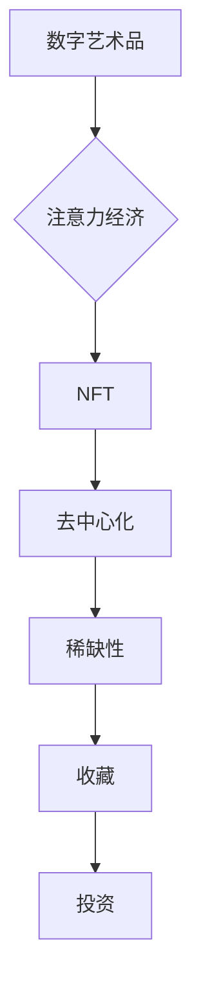

                 

## 数字艺术品市场在注意力经济中的兴起

> 关键词：数字艺术品、注意力经济、NFT、区块链、去中心化、稀缺性、收藏、投资

## 1. 背景介绍

数字艺术品，作为一种新兴的艺术形式，近年来在全球范围内迅速崛起。它利用数字技术创作和传播，打破了传统艺术品的物理限制，赋予艺术作品新的生命力。而注意力经济，作为一种新的经济模式，强调了注意力资源的稀缺性和价值。在数字时代，人们的注意力受到来自互联网、社交媒体等各种平台的竞争，注意力资源变得越来越宝贵。

数字艺术品市场在注意力经济的背景下，呈现出独特的特征和发展趋势。一方面，数字艺术品可以利用区块链技术实现去中心化、可验证的版权保护，保障艺术家权益，吸引更多创作者参与其中。另一方面，数字艺术品的稀缺性和独特的属性，使其成为一种新的投资标的，吸引了越来越多的投资者关注。

## 2. 核心概念与联系

### 2.1 数字艺术品

数字艺术品是指利用数字技术创作和传播的艺术作品，包括但不限于：

* **数字绘画和图像:** 使用数字绘画软件创作的艺术作品。
* **数字雕塑和模型:** 使用3D建模软件创作的艺术作品。
* **数字音乐和音频:** 使用数字音频软件创作的音乐作品。
* **数字视频和动画:** 使用动画软件创作的艺术作品。
* **数字交互式艺术:** 观众可以通过互动的方式参与艺术作品。

### 2.2 注意力经济

注意力经济是指在信息爆炸的时代，人们的注意力资源成为一种稀缺的资源，而能够获取和利用注意力资源的平台和内容创作者能够获得巨大的经济利益。

### 2.3 NFT

NFT（Non-Fungible Token）是指不可替代的代币，它代表着一种独特的数字资产，例如数字艺术品、虚拟物品、游戏道具等。NFT利用区块链技术实现去中心化、可验证的资产所有权，保障了数字艺术品的唯一性和不可复制性。

**核心概念与联系流程图**



## 3. 核心算法原理 & 具体操作步骤

### 3.1 算法原理概述

数字艺术品市场中的核心算法主要涉及以下几个方面：

* **加密算法:** 用于生成NFT的唯一标识符，确保其不可复制性。
* **区块链算法:** 用于记录和验证NFT的交易记录，保障其安全性和透明度。
* **推荐算法:** 用于根据用户的喜好和行为，推荐相关的数字艺术品。

### 3.2 算法步骤详解

**1. 数字艺术品创作:** 艺术家使用数字工具创作艺术作品，并将其转换为数字文件。

**2. NFT生成:** 使用智能合约将数字艺术品与NFT绑定，生成唯一的NFT代币。

**3. NFT上链:** 将NFT代币上传到区块链网络，记录其所有权信息。

**4. NFT交易:** 用户可以通过数字钱包进行NFT的购买、出售和转让。

**5. 数据分析:** 平台收集用户行为数据，利用推荐算法为用户推荐感兴趣的数字艺术品。

### 3.3 算法优缺点

**优点:**

* **去中心化:** NFT的去中心化特性，避免了传统艺术品市场中中介机构的垄断。
* **可验证:** 区块链技术保证了NFT的唯一性和不可篡改性，保障了艺术品的版权和价值。
* **透明度:** NFT的交易记录公开透明，方便用户了解艺术品的 provenance（来源和所有权历史）。

**缺点:**

* **技术门槛:** 对于普通用户来说，使用区块链技术和数字钱包有一定的技术门槛。
* **市场波动:** 数字艺术品市场价格波动较大，存在一定的投资风险。
* **环境问题:** 区块链技术的能源消耗问题，需要进一步解决。

### 3.4 算法应用领域

* **数字艺术品交易:** NFT技术为数字艺术品的交易提供了安全可靠的平台。
* **虚拟物品交易:** NFT可以代表虚拟物品，例如游戏道具、虚拟服装等，为虚拟经济的发展提供了基础。
* **版权保护:** NFT可以用于保护数字内容的版权，防止盗版和侵权。
* **身份认证:** NFT可以作为身份认证工具，例如数字身份、会员卡等。

## 4. 数学模型和公式 & 详细讲解 & 举例说明

### 4.1 数学模型构建

数字艺术品市场的价值可以看作是注意力资源的分配结果。我们可以用以下数学模型来描述：

$$V = f(A, S, R)$$

其中：

* $V$ 代表数字艺术品的价值。
* $A$ 代表艺术品的稀缺性。
* $S$ 代表艺术品的社会影响力。
* $R$ 代表艺术品的真实价值。

### 4.2 公式推导过程

稀缺性、社会影响力和真实价值是影响数字艺术品价值的三大因素。

* **稀缺性:** 稀缺性是指艺术品数量的有限性。稀缺性越高，价值越高。

$$A = \frac{1}{N}$$

其中 $N$ 代表艺术品的总数量。

* **社会影响力:** 社会影响力是指艺术品在社会中的传播力和影响力。社会影响力越高，价值越高。

$$S = \frac{C}{T}$$

其中 $C$ 代表艺术品的传播次数，$T$ 代表艺术品的发布时间。

* **真实价值:** 真实价值是指艺术品本身的艺术性和价值观。

$$R = \frac{E}{P}$$

其中 $E$ 代表艺术品的艺术价值，$P$ 代表艺术品的制作成本。

将以上三个因素代入价值公式，得到：

$$V = f\left(\frac{1}{N}, \frac{C}{T}, \frac{E}{P}\right)$$

### 4.3 案例分析与讲解

例如，一个限量发行的数字艺术品，数量只有100件，并且在社交媒体上获得了广泛传播，其价值会相对较高。而一个数量众多的数字艺术品，即使艺术价值很高，也可能由于稀缺性不足而价值较低。

## 5. 项目实践：代码实例和详细解释说明

### 5.1 开发环境搭建

* **操作系统:** Windows/macOS/Linux
* **编程语言:** Python
* **区块链平台:** Ethereum
* **开发工具:** Remix IDE、Truffle Suite

### 5.2 源代码详细实现

```python
# 智能合约代码示例

pragma solidity ^0.8.0;

contract NFTMarketplace {

    // ...

}
```

### 5.3 代码解读与分析

* **pragma solidity ^0.8.0;:** 指定智能合约的编译版本。
* **contract NFTMarketplace { ... }:** 定义一个名为NFTMarketplace的智能合约。
* **// ...:** 具体合约代码，包括NFT的创建、交易、管理等功能。

### 5.4 运行结果展示

通过部署智能合约到区块链网络，可以创建NFT市场平台，实现数字艺术品的交易和管理。

## 6. 实际应用场景

### 6.1 艺术家

* **展示作品:** 艺术家可以通过NFT平台展示和销售自己的数字艺术品。
* **获得收益:** 艺术家可以通过NFT的交易获得收益，并获得作品的版权保护。
* **与粉丝互动:** 艺术家可以通过NFT平台与粉丝互动，建立更紧密的联系。

### 6.2 收藏家

* **收藏数字艺术品:** 收藏家可以通过NFT平台购买和收藏数字艺术品。
* **投资数字艺术品:** 数字艺术品作为一种新的投资标的，收藏家可以期待其价值的增值。
* **参与社区:** 收藏家可以通过NFT平台加入数字艺术品社区，与其他爱好者交流。

### 6.3 平台运营商

* **搭建平台:** 平台运营商可以搭建数字艺术品交易平台，为艺术家和收藏家提供服务。
* **提供服务:** 平台运营商可以提供数字艺术品鉴定、交易、存储等服务。
* **获取收益:** 平台运营商可以通过交易手续费、广告收入等方式获取收益。

### 6.4 未来应用展望

数字艺术品市场在未来将继续发展壮大，并与其他领域融合，例如：

* **元宇宙:** 数字艺术品将成为元宇宙中不可或缺的一部分，为虚拟世界增添艺术和文化元素。
* **游戏:** 数字艺术品将被应用于游戏中的虚拟物品，提升游戏的趣味性和价值。
* **教育:** 数字艺术品将被用于教育领域，例如虚拟博物馆、艺术教学等。

## 7. 工具和资源推荐

### 7.1 学习资源推荐

* **书籍:**

    * 《区块链技术入门》
    * 《数字艺术品：从概念到实践》

* **在线课程:**

    * Coursera: 区块链技术
    * Udemy: 数字艺术品创作

### 7.2 开发工具推荐

* **Remix IDE:** 在线智能合约开发环境
* **Truffle Suite:** 智能合约测试和部署工具
* **MetaMask:** 数字钱包

### 7.3 相关论文推荐

* **The Economics of Attention**
* **Non-Fungible Tokens: A New Paradigm for Digital Ownership**

## 8. 总结：未来发展趋势与挑战

### 8.1 研究成果总结

数字艺术品市场在注意力经济的背景下，呈现出蓬勃发展的态势。NFT技术为数字艺术品的交易和管理提供了安全可靠的平台，吸引了越来越多的艺术家、收藏家和投资者参与其中。

### 8.2 未来发展趋势

* **技术创新:** 区块链技术、人工智能等技术的不断发展，将推动数字艺术品市场的创新和发展。
* **市场成熟:** 数字艺术品市场的规范和成熟度将不断提高，吸引更多主流机构和投资者参与。
* **应用场景拓展:** 数字艺术品将被应用于更多领域，例如元宇宙、游戏、教育等。

### 8.3 面临的挑战

* **技术门槛:** 区块链技术和数字钱包的使用有一定的技术门槛，需要进一步降低用户的使用难度。
* **市场波动:** 数字艺术品市场价格波动较大，存在一定的投资风险。
* **环境问题:** 区块链技术的能源消耗问题，需要进一步解决。

### 8.4 研究展望

未来，我们需要继续研究数字艺术品市场的经济模型、技术发展趋势和社会影响，并探索如何解决市场面临的挑战，推动数字艺术品市场健康可持续发展。

## 9. 附录：常见问题与解答

* **什么是NFT？**

NFT是指不可替代的代币，它代表着一种独特的数字资产，例如数字艺术品、虚拟物品、游戏道具等。

* **如何购买数字艺术品？**

用户需要使用数字钱包，并通过NFT交易平台购买数字艺术品。

* **数字艺术品的版权如何保护？**

NFT技术可以保障数字艺术品的唯一性和不可复制性，从而保护其版权。

* **数字艺术品的价值如何评估？**

数字艺术品的价值受到稀缺性、社会影响力和真实价值等因素的影响。

* **数字艺术品市场存在哪些风险？**

数字艺术品市场价格波动较大，存在一定的投资风险。


作者：禅与计算机程序设计艺术 / Zen and the Art of Computer Programming 
<end_of_turn>

