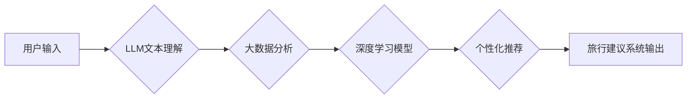

                 

## 智能旅游规划：LLM个性化旅行建议系统

> 关键词：LLM, 自然语言处理, 个性化推荐, 旅游规划, 大数据分析, 深度学习, 旅行建议系统

## 1. 背景介绍

随着人工智能技术的飞速发展，自然语言处理（NLP）领域取得了显著突破，大型语言模型（LLM）的出现为智能旅游规划带来了新的机遇。传统的旅游规划系统往往依赖于规则引擎和静态数据，难以满足用户个性化需求。而LLM能够理解和生成自然语言，具备强大的文本处理能力，可以根据用户的旅行偏好、兴趣爱好、预算等信息，生成个性化的旅行建议，提升用户体验。

近年来，旅游业也迎来了数字化转型，海量旅游数据被不断积累，为智能旅游规划提供了丰富的素材。结合大数据分析和深度学习技术，可以挖掘用户行为模式、旅游趋势等信息，为个性化推荐提供更精准的数据支持。

## 2. 核心概念与联系

### 2.1  LLM

大型语言模型（LLM）是一种基于深度学习的强大人工智能模型，通过训练海量文本数据，能够理解和生成人类语言。LLM拥有以下特点：

* **强大的文本理解能力:**  可以理解复杂的句子结构、语义关系和上下文信息。
* **优秀的文本生成能力:** 可以生成流畅、自然的文本，包括文章、故事、对话等。
* **多任务学习能力:** 可以应用于多种自然语言处理任务，如翻译、问答、文本摘要等。

### 2.2  个性化推荐

个性化推荐是指根据用户的个人特征、行为模式和偏好，提供定制化的产品或服务。在旅游领域，个性化推荐可以根据用户的旅行历史、兴趣爱好、预算等信息，推荐合适的目的地、景点、酒店、交通方式等。

### 2.3  智能旅游规划系统

智能旅游规划系统利用LLM、大数据分析和深度学习等技术，为用户提供个性化的旅行建议。系统可以根据用户的需求，生成详细的旅行路线、景点推荐、酒店预订、交通安排等信息，帮助用户规划一次难忘的旅程。

**核心架构图:**



## 3. 核心算法原理 & 具体操作步骤

### 3.1  算法原理概述

智能旅游规划系统主要基于以下核心算法：

* **自然语言处理 (NLP):**  LLM用于理解用户的旅行需求，提取关键信息，如目的地、时间、预算、兴趣爱好等。
* **大数据分析:**  分析海量旅游数据，挖掘用户行为模式、旅游趋势等信息，为个性化推荐提供数据支持。
* **深度学习:**  利用深度学习模型，对用户数据进行特征提取和分类，提高推荐的精准度和个性化程度。

### 3.2  算法步骤详解

1. **用户输入:** 用户通过文本或语音方式输入旅行需求。
2. **LLM文本理解:** LLM对用户的输入进行分析，识别关键信息，如目的地、时间、预算、兴趣爱好等。
3. **数据预处理:** 将用户输入的数据进行清洗、格式化和转换，以便后续算法处理。
4. **大数据分析:** 利用大数据分析技术，分析海量旅游数据，挖掘用户行为模式、旅游趋势等信息。
5. **深度学习模型训练:** 利用深度学习模型，对用户数据进行特征提取和分类，构建个性化推荐模型。
6. **个性化推荐:** 根据用户的需求和模型预测，生成个性化的旅行建议，包括目的地推荐、景点推荐、酒店预订、交通安排等。
7. **结果展示:** 将个性化旅行建议以文本、图像或交互式地图等形式展示给用户。

### 3.3  算法优缺点

**优点:**

* **个性化推荐:**  能够根据用户的个人需求和偏好，提供定制化的旅行建议。
* **智能化服务:**  能够自动生成旅行计划，节省用户时间和精力。
* **数据驱动:**  基于大数据分析和深度学习，推荐更加精准和个性化。

**缺点:**

* **数据依赖:**  算法的性能依赖于海量旅游数据的质量和丰富程度。
* **模型复杂性:**  深度学习模型的训练和部署需要一定的技术门槛。
* **伦理问题:**  个性化推荐可能存在偏见和歧视问题，需要谨慎处理。

### 3.4  算法应用领域

智能旅游规划系统可以应用于以下领域:

* **在线旅游平台:**  为用户提供个性化的旅行建议，提高用户体验和转化率。
* **旅行社:**  帮助旅行社制定个性化旅游方案，提升服务质量。
* **酒店预订平台:**  根据用户的旅行需求，推荐合适的酒店。
* **交通出行平台:**  根据用户的行程安排，推荐最佳的交通方式。

## 4. 数学模型和公式 & 详细讲解 & 举例说明

### 4.1  数学模型构建

智能旅游规划系统可以利用协同过滤算法构建用户-物品交互矩阵，并使用矩阵分解技术进行推荐。

**用户-物品交互矩阵:**

设用户集合为U，物品集合为I，则用户-物品交互矩阵为一个m×n的矩阵，其中m=|U|，n=|I|。矩阵元素$R_{ui}$表示用户u对物品i的评分或交互行为，若用户u交互过物品i，则$R_{ui}$为非零值，否则为零。

**矩阵分解模型:**

将用户-物品交互矩阵分解为两个低维矩阵，分别表示用户特征矩阵和物品特征矩阵。

$$R \approx U V^T$$

其中，U为m×k的用户特征矩阵，V为k×n的物品特征矩阵，k为隐特征维度。

### 4.2  公式推导过程

通过最小化用户-物品交互矩阵与分解矩阵乘积的误差，可以得到用户特征矩阵和物品特征矩阵的最佳解。

$$min_{U,V} \sum_{u \in U, i \in I} (R_{ui} - U_u V_i^T)^2$$

可以使用梯度下降算法或其他优化算法求解上述最小化问题。

### 4.3  案例分析与讲解

假设有一个用户-物品交互矩阵，其中用户集合为{u1, u2, u3}, 物品集合为{i1, i2, i3}, 矩阵元素表示用户对物品的评分。

通过矩阵分解模型，可以得到用户特征矩阵和物品特征矩阵，例如:

$$U = \begin{bmatrix} 0.8 & 0.2 \\ 0.3 & 0.9 \\ 0.5 & 0.7 \end{bmatrix}$$

$$V = \begin{bmatrix} 0.6 & 0.4 & 0.2 \\ 0.2 & 0.7 & 0.6 \end{bmatrix}$$

根据用户特征矩阵和物品特征矩阵，可以预测用户对未交互过的物品的评分，并进行个性化推荐。

## 5. 项目实践：代码实例和详细解释说明

### 5.1  开发环境搭建

* **操作系统:**  Linux/macOS/Windows
* **编程语言:**  Python
* **深度学习框架:**  TensorFlow/PyTorch
* **自然语言处理库:**  Transformers/NLTK

### 5.2  源代码详细实现

```python
# 导入必要的库
import tensorflow as tf
from transformers import AutoTokenizer, AutoModel

# 加载预训练模型和词典
tokenizer = AutoTokenizer.from_pretrained("bert-base-uncased")
model = AutoModel.from_pretrained("bert-base-uncased")

# 定义用户输入文本
user_input = "我想去一个海边城市，享受阳光和沙滩，预算大约是5000元。"

# 对用户输入进行预处理
encoded_input = tokenizer(user_input, return_tensors="tf")

# 使用预训练模型提取文本特征
outputs = model(**encoded_input)
user_embedding = outputs.last_hidden_state[:, 0, :]

# ... (后续代码实现个性化推荐逻辑)
```

### 5.3  代码解读与分析

* **加载预训练模型和词典:**  使用HuggingFace Transformers库加载预训练的BERT模型和词典。
* **定义用户输入文本:**  用户输入的旅行需求以文本形式给出。
* **对用户输入进行预处理:**  使用Tokenizer将文本转换为模型可理解的格式。
* **使用预训练模型提取文本特征:**  将预处理后的文本输入到BERT模型中，提取文本的语义特征。
* **后续代码实现个性化推荐逻辑:**  根据提取的文本特征，结合大数据分析和深度学习模型，实现个性化推荐逻辑。

### 5.4  运行结果展示

系统根据用户的输入，生成以下个性化旅行建议:

* **目的地推荐:**  海南岛、厦门、三亚
* **景点推荐:**  蜈支洲岛、南山寺、环岛路
* **酒店推荐:**  海景酒店、度假村、民宿
* **交通安排:**  飞机、高铁、自驾

## 6. 实际应用场景

### 6.1  在线旅游平台

智能旅游规划系统可以集成到在线旅游平台，为用户提供个性化的旅行建议，提升用户体验和转化率。例如，用户在平台上输入旅行需求，系统会根据用户的历史浏览记录、评分和评论等信息，推荐合适的目的地、景点、酒店和交通方式。

### 6.2  旅行社

旅行社可以利用智能旅游规划系统，帮助制定个性化旅游方案，提升服务质量。例如，旅行社可以根据用户的年龄、兴趣爱好、预算等信息，设计定制化的旅游路线，并提供个性化的服务建议。

### 6.3  酒店预订平台

酒店预订平台可以利用智能旅游规划系统，根据用户的旅行需求，推荐合适的酒店。例如，用户在平台上输入旅行日期、目的地、预算等信息，系统会根据用户的偏好，推荐附近的酒店，并提供酒店的详细信息和评价。

### 6.4  未来应用展望

随着人工智能技术的不断发展，智能旅游规划系统将更加智能化、个性化和便捷化。未来，智能旅游规划系统可能具备以下功能:

* **多模态输入:**  支持语音、图像、视频等多模态输入，更方便用户表达旅行需求。
* **实时动态推荐:**  根据用户的实时位置、天气、交通状况等信息，动态调整旅行建议。
* **虚拟旅行体验:**  利用虚拟现实技术，为用户提供虚拟的旅行体验，帮助用户更好地了解目的地。
* **智能导游:**  利用人工智能技术，开发智能导游机器人，为用户提供个性化的导游服务。

## 7. 工具和资源推荐

### 7.1  学习资源推荐

* **书籍:**
    * 《深度学习》 - Ian Goodfellow, Yoshua Bengio, Aaron Courville
    * 《自然语言处理》 - Jurafsky, Martin
* **在线课程:**
    * Coursera: 深度学习 Specialization
    * edX: 自然语言处理

### 7.2  开发工具推荐

* **深度学习框架:**  TensorFlow, PyTorch
* **自然语言处理库:**  Transformers, NLTK
* **云计算平台:**  AWS, Azure, GCP

### 7.3  相关论文推荐

* **BERT: Pre-training of Deep Bidirectional Transformers for Language Understanding**
* **Attention Is All You Need**
* **Recurrent Neural Network for Sequence Learning**

## 8. 总结：未来发展趋势与挑战

### 8.1  研究成果总结

智能旅游规划系统是人工智能技术与旅游业融合的产物，能够为用户提供个性化、智能化的旅行服务。通过结合LLM、大数据分析和深度学习技术，智能旅游规划系统能够理解用户的旅行需求，挖掘旅游数据，生成个性化的旅行建议，提升用户体验。

### 8.2  未来发展趋势

* **多模态交互:**  支持语音、图像、视频等多模态输入，更方便用户表达旅行需求。
* **实时动态推荐:**  根据用户的实时位置、天气、交通状况等信息，动态调整旅行建议。
* **虚拟旅行体验:**  利用虚拟现实技术，为用户提供虚拟的旅行体验，帮助用户更好地了解目的地。
* **智能导游:**  利用人工智能技术，开发智能导游机器人，为用户提供个性化的导游服务。

### 8.3  面临的挑战

* **数据质量:**  算法的性能依赖于海量旅游数据的质量和丰富程度。
* **模型复杂性:**  深度学习模型的训练和部署需要一定的技术门槛。
* **伦理问题:**  个性化推荐可能存在偏见和歧视问题，需要谨慎处理。

### 8.4  研究展望

未来，智能旅游规划系统将朝着更加智能化、个性化和便捷化的方向发展，为用户提供更加丰富多彩的旅行体验。


## 9. 附录：常见问题与解答

**Q1: 智能旅游规划系统如何保证推荐结果的准确性？**

**A1:** 智能旅游规划系统通过结合大数据分析和深度学习技术，分析海量旅游数据，挖掘用户行为模式和旅游趋势，提高推荐结果的准确性。

**Q2: 智能旅游规划系统如何处理用户隐私问题？**

**A2:** 智能旅游规划系统在收集和使用用户数据时，会严格遵守隐私政策，保护用户的个人信息安全。

**Q3: 智能旅游规划系统是否可以支持多种语言？**

**A3:**  目前，许多智能旅游规划系统支持多种语言，可以根据用户的语言偏好提供个性化的服务。

**Q4: 智能旅游规划系统是否可以替代传统的旅行社？**

**A4:** 智能旅游规划系统可以作为旅行社的辅助工具，帮助旅行社提高效率和服务质量，但无法完全替代传统的旅行社。


作者：禅与计算机程序设计艺术 / Zen and the Art of Computer Programming 
<end_of_turn>

