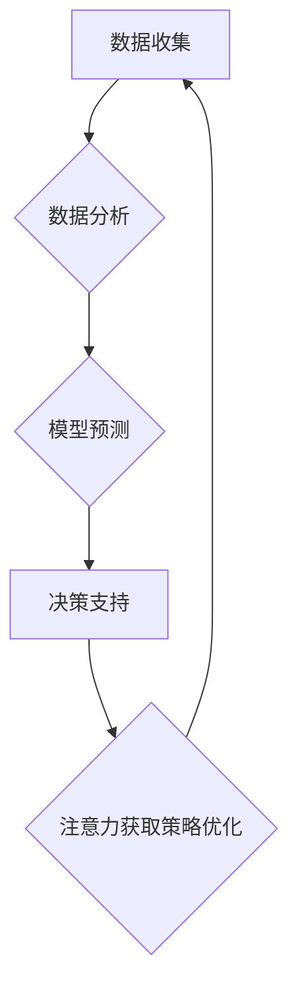

                 

## 1. 背景介绍

在当今信息爆炸的时代，人们面临着前所未有的信息过载。从新闻推送到社交媒体，从电子邮件到广告，信息无处不在，却并非全部都具有价值。如何有效地筛选和处理信息，将注意力集中在真正重要的内容上，成为了当今社会面临的重大挑战。

这种挑战不仅体现在个人生活，也深刻影响着企业和组织的运营。企业需要从海量的数据中挖掘有价值的洞察，做出更明智的决策，才能在激烈的市场竞争中脱颖而出。

注意力经济的概念应运而生，它强调了在信息过载的时代，注意力是稀缺的资源，也是决定企业成功与否的关键因素。数据驱动决策则提供了利用数据来提升决策效率和准确性的方法。

结合注意力经济和数据驱动决策，我们可以构建一个更有效的决策框架，帮助企业更好地理解用户需求，优化产品和服务，提升市场竞争力。

## 2. 核心概念与联系

### 2.1 注意力经济

注意力经济是指在信息过载的时代，人们对信息的注意力是有限的，而能够吸引和获取用户注意力的资源具有价值。

**核心要素：**

* **注意力：** 是一种有限的资源，可以被分配给不同的信息源。
* **竞争：** 各种信息源都在争夺用户的注意力。
* **价值：** 能够吸引和获取用户注意力的信息源具有价值。

**应用场景：**

* **内容营销：** 通过制作吸引人的内容，吸引用户的注意力，并最终转化为客户。
* **广告投放：** 通过精准定位目标用户，投放更有效的广告，提高广告转化率。
* **产品设计：** 通过设计用户体验良好的产品，吸引用户的注意力，并提升用户粘性。

### 2.2 数据驱动决策

数据驱动决策是指利用数据分析和模型预测，来辅助企业做出更明智的决策。

**核心要素：**

* **数据收集：** 收集来自各种渠道的数据，例如用户行为数据、市场数据、财务数据等。
* **数据分析：** 对收集到的数据进行分析，发现其中的规律和趋势。
* **模型预测：** 利用数据分析结果，构建预测模型，预测未来的发展趋势。
* **决策支持：** 将模型预测结果作为决策依据，帮助企业做出更明智的决策。

**应用场景：**

* **市场营销：** 通过分析用户行为数据，预测用户的购买意愿，并制定更有效的营销策略。
* **产品开发：** 通过分析用户反馈数据，了解用户的需求，并开发更符合用户需求的产品。
* **运营管理：** 通过分析运营数据，优化运营流程，提高运营效率。

### 2.3  注意力经济与数据驱动决策的联系

注意力经济和数据驱动决策相互补充，共同构成了一个更有效的决策框架。

数据驱动决策可以帮助企业更好地理解用户的注意力行为，而注意力经济可以帮助企业更好地利用数据，来吸引和获取用户的注意力。

**具体联系：**

* **数据分析可以揭示用户的注意力偏好：** 通过分析用户浏览历史、点击行为、停留时间等数据，可以了解用户的兴趣爱好、偏好类型、注意力集中时间段等信息。
* **注意力经济理论可以指导数据收集和分析：** 了解用户的注意力机制，可以帮助企业设计更有效的用户体验，收集更精准的用户数据，并进行更有针对性的分析。
* **数据驱动决策可以帮助企业优化注意力获取策略：** 通过分析用户数据，可以预测用户的注意力需求，并制定更有效的策略来吸引和获取用户的注意力。

**Mermaid 流程图：**



## 3. 核心算法原理 & 具体操作步骤

### 3.1 算法原理概述

在注意力经济和数据驱动决策的框架下，我们可以利用机器学习算法来分析用户数据，预测用户的注意力行为，并优化注意力获取策略。

常见的机器学习算法包括：

* **回归算法：** 用于预测连续型变量，例如用户停留时间、点击率等。
* **分类算法：** 用于预测离散型变量，例如用户是否会购买商品、用户是否会点击广告等。
* **聚类算法：** 用于将用户数据进行分组，例如将用户按照兴趣爱好进行分类。

### 3.2 算法步骤详解

**具体操作步骤：**

1. **数据收集：** 收集用户行为数据，例如用户浏览历史、点击行为、停留时间、购买记录等。
2. **数据预处理：** 对收集到的数据进行清洗、转换、编码等操作，使其适合机器学习算法的训练。
3. **特征工程：** 从原始数据中提取特征，例如用户年龄、性别、兴趣爱好、浏览时间、点击次数等，这些特征可以帮助机器学习算法更好地理解用户行为。
4. **模型选择：** 根据具体业务需求选择合适的机器学习算法，例如使用回归算法预测用户停留时间，使用分类算法预测用户是否会购买商品。
5. **模型训练：** 使用训练数据训练选择的机器学习模型，并评估模型的性能。
6. **模型优化：** 对模型参数进行调整，以提高模型的预测精度。
7. **模型部署：** 将训练好的模型部署到生产环境中，用于预测用户注意力行为。
8. **结果分析：** 分析模型预测结果，并根据结果优化注意力获取策略。

### 3.3 算法优缺点

**优点：**

* **数据驱动：** 基于数据分析，能够更客观地预测用户注意力行为。
* **精准化：** 可以根据用户的个性化特征，制定更精准的注意力获取策略。
* **可迭代优化：** 可以不断收集用户数据，并对模型进行优化，提升预测精度。

**缺点：**

* **数据依赖：** 需要大量的数据来训练机器学习模型，否则模型的预测精度会降低。
* **算法复杂：** 机器学习算法的训练和优化需要一定的技术门槛。
* **隐私问题：** 需要谨慎处理用户数据，避免泄露用户隐私。

### 3.4 算法应用领域

* **内容推荐：** 根据用户的兴趣爱好和浏览历史，推荐更符合用户需求的内容。
* **广告投放：** 根据用户的画像和行为特征，精准投放广告，提高广告转化率。
* **用户体验优化：** 通过分析用户的注意力行为，优化网站和应用程序的用户体验，提高用户粘性。
* **市场营销：** 通过分析用户的注意力行为，制定更有效的市场营销策略。

## 4. 数学模型和公式 & 详细讲解 & 举例说明

### 4.1 数学模型构建

在注意力经济和数据驱动决策的框架下，我们可以利用数学模型来描述用户注意力行为，并预测用户的注意力分配方式。

**常用的数学模型：**

* **贝叶斯网络：** 用于描述用户注意力行为之间的概率关系，可以预测用户在不同条件下对不同信息源的注意力分配。
* **马尔科夫链：** 用于描述用户注意力行为的转移规律，可以预测用户在不同时间段内对不同信息源的注意力分配。
* **强化学习：** 用于训练用户注意力模型，使其能够根据用户的反馈，不断优化注意力分配策略。

### 4.2 公式推导过程

**举例说明：**

假设我们使用贝叶斯网络来描述用户对不同信息源的注意力分配。

**变量定义：**

* $U$：用户
* $I_1, I_2, ..., I_n$：不同的信息源

**概率关系：**

* $P(I_i | U)$：用户 $U$ 对信息源 $I_i$ 的注意力概率
* $P(U)$：用户 $U$ 的先验概率
* $P(I_i)$：信息源 $I_i$ 的先验概率

**贝叶斯公式：**

$$P(I_i | U) = \frac{P(U | I_i)P(I_i)}{P(U)}$$

**推导过程：**

1. 根据贝叶斯公式，我们可以计算用户 $U$ 对信息源 $I_i$ 的注意力概率。
2. 为了计算 $P(U | I_i)$，我们需要考虑用户 $U$ 的特征和信息源 $I_i$ 的属性。
3. 为了计算 $P(I_i)$，我们需要考虑信息源 $I_i$ 的相关性、受欢迎程度等因素。

### 4.3 案例分析与讲解

**案例：**

假设我们有一个电商平台，想要利用注意力经济和数据驱动决策来优化商品推荐策略。

**数据分析：**

* 分析用户浏览历史、购买记录、评价信息等数据，了解用户的兴趣爱好、购买偏好等信息。
* 分析商品属性、销售数据、用户评价等信息，了解商品的受欢迎程度、用户评价等信息。

**模型构建：**

* 使用贝叶斯网络模型来描述用户对不同商品的注意力分配概率。
* 训练模型，并根据用户的个性化特征和商品属性，预测用户的注意力分配方式。

**策略优化：**

* 根据模型预测结果，优化商品推荐策略，将更符合用户需求的商品推荐给用户。
* 通过 A/B 测试，验证优化后的推荐策略效果。

## 5. 项目实践：代码实例和详细解释说明

### 5.1 开发环境搭建

* **操作系统：** Linux (Ubuntu 18.04 或更高版本)
* **编程语言：** Python 3.6 或更高版本
* **深度学习框架：** TensorFlow 或 PyTorch
* **其他工具：** Jupyter Notebook、Git

### 5.2 源代码详细实现

```python
# 导入必要的库
import tensorflow as tf

# 定义模型结构
model = tf.keras.models.Sequential([
    tf.keras.layers.Dense(64, activation='relu', input_shape=(10,)),
    tf.keras.layers.Dense(32, activation='relu'),
    tf.keras.layers.Dense(1, activation='sigmoid')
])

# 编译模型
model.compile(optimizer='adam', loss='binary_crossentropy', metrics=['accuracy'])

# 训练模型
model.fit(X_train, y_train, epochs=10, batch_size=32)

# 评估模型
loss, accuracy = model.evaluate(X_test, y_test)
print('Loss:', loss)
print('Accuracy:', accuracy)
```

**代码解读与分析：**

* 该代码示例展示了如何使用 TensorFlow 框架构建一个简单的深度学习模型，用于预测用户对商品的注意力分配概率。
* 模型结构包括三个全连接层，第一层输入维度为 10，表示用户特征的维度。
* 激活函数使用 ReLU 函数，输出层使用 sigmoid 函数，用于输出注意力概率。
* 模型使用 Adam 优化器，损失函数使用二分类交叉熵损失函数，评估指标使用准确率。

### 5.3 代码运行结果展示

运行代码后，会输出模型的训练损失和准确率，以及测试集上的损失和准确率。

## 6. 实际应用场景

### 6.1 内容推荐系统

* **场景：** 在线视频平台、新闻网站、社交媒体平台等。
* **应用：** 根据用户的观看历史、点赞记录、评论内容等数据，推荐更符合用户兴趣的视频、文章、帖子等内容。

### 6.2 广告投放系统

* **场景：** 搜索引擎、社交媒体平台、电商平台等。
* **应用：** 根据用户的兴趣爱好、浏览历史、购买记录等数据，精准投放广告，提高广告转化率。

### 6.3 用户体验优化

* **场景：** 网站、应用程序、游戏等。
* **应用：** 通过分析用户的注意力行为，优化页面布局、交互设计、内容呈现方式等，提高用户体验。

### 6.4 未来应用展望

* **个性化学习：** 根据用户的学习风格和知识掌握情况，定制个性化的学习内容和学习路径。
* **智能客服：** 利用自然语言处理和机器学习技术，构建智能客服系统，能够更准确地理解用户的需求，并提供更有效的帮助。
* **医疗诊断：** 利用机器学习算法分析患者的病历、检查结果等数据，辅助医生进行诊断和治疗。

## 7. 工具和资源推荐

### 7.1 学习资源推荐

* **书籍：**
    * 《深度学习》 - Ian Goodfellow, Yoshua Bengio, Aaron Courville
    * 《Python机器学习》 - Sebastian Raschka
* **在线课程：**
    * Coursera: 深度学习 Specialization
    * Udacity: 机器学习 Engineer Nanodegree
* **博客和网站：**
    * TensorFlow 官方博客: https://blog.tensorflow.org/
    * PyTorch 官方博客: https://pytorch.org/blog/

### 7.2 开发工具推荐

* **深度学习框架：** TensorFlow, PyTorch, Keras
* **数据处理工具：** Pandas, NumPy
* **可视化工具：** Matplotlib, Seaborn

### 7.3 相关论文推荐

* **Attention Is All You Need:** https://arxiv.org/abs/1706.03762
* **BERT: Pre-training of Deep Bidirectional Transformers for Language Understanding:** https://arxiv.org/abs/1810.04805

## 8. 总结：未来发展趋势与挑战

### 8.1 研究成果总结

注意力经济和数据驱动决策已经取得了显著的成果，在内容推荐、广告投放、用户体验优化等领域取得了广泛应用。

### 8.2 未来发展趋势

* **更精准的注意力预测：** 利用更先进的机器学习算法和数据分析技术，更精准地预测用户的注意力行为。
* **更个性化的注意力获取策略：** 根据用户的个性化特征和上下文信息，制定更个性化的注意力获取策略。
* **更有效的注意力管理工具：** 开发更有效的注意力管理工具，帮助用户更好地控制自己的注意力，提高工作效率和生活质量。

### 8.3 面临的挑战

* **数据隐私保护：** 如何收集和使用用户数据，同时保护用户的隐私安全，是一个重要的挑战。
* **算法公平性：** 确保机器学习算法的公平性，避免算法歧视和偏见，是一个重要的伦理问题。
* **用户信任问题：** 如何获得用户的信任，让他们相信数据驱动决策的合理性和有效性，是一个重要的挑战。

### 8.4 研究展望

未来，注意力经济和数据驱动决策的研究将继续深入，探索更先进的算法、更有效的策略，并解决相关伦理和社会问题，为构建更智能、更人性化的数字世界做出贡献。

## 9. 附录：常见问题与解答

**常见问题：**

* **注意力经济和数据驱动决策有什么区别？**

**解答：**

注意力经济关注的是注意力作为一种稀缺资源的价值和分配，而数据驱动决策关注的是利用数据分析和模型预测来辅助企业做出更明智的决策。两者相互补充，共同构成了一个更有效的决策框架。

* **如何收集用户注意力数据？**

**解答：**

可以通过多种方式收集用户注意力数据，例如：

* **页面浏览记录：** 记录用户浏览网页的时间、停留时间、点击次数等信息。
* **用户行为数据：** 记录用户在网站或应用程序上的操作行为，例如滚动、滑动、点击、搜索等。
* **眼动追踪数据：** 使用眼动追踪设备记录用户的视线轨迹，了解用户关注的重点。

* **如何保护用户隐私？**

**解答：**

在收集和使用用户数据时，需要严格遵守隐私保护原则，例如：

* **获取用户同意：** 在收集用户数据之前，需要获得用户的明确同意。
* **数据匿名化：** 将用户个人信息匿名化，避免泄露用户隐私。
* **数据安全：** 加强数据安全措施，防止数据泄露和滥用。

作者：禅与计算机程序设计艺术 / Zen and the Art of Computer Programming


<end_of_turn>

