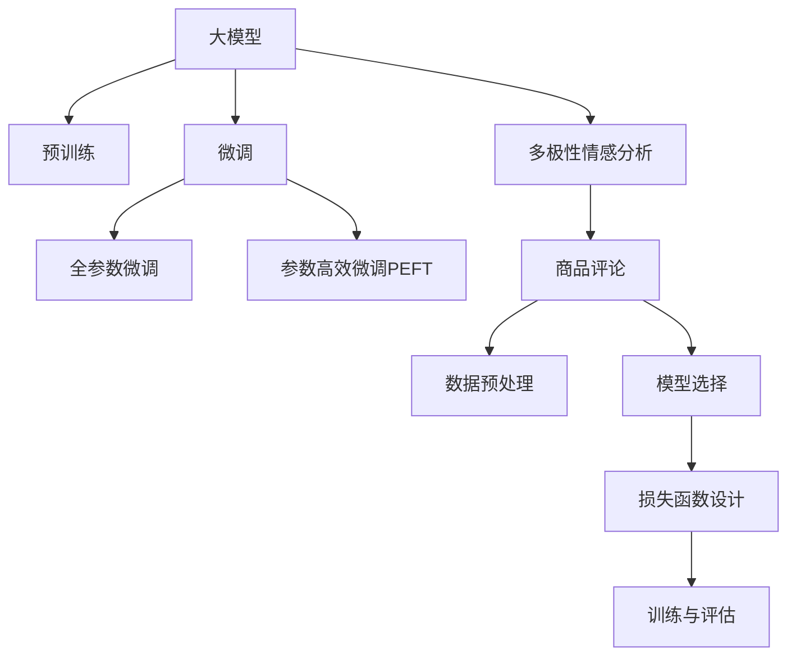

                 

# 大模型在商品评论情感多极性分析中的应用

> 关键词：大模型, 商品评论, 情感分析, 多极性, 自然语言处理(NLP), Transformer, 预训练, 微调, 伯努利分布, 分层算法

## 1. 背景介绍

### 1.1 问题由来
商品评论情感分析一直是零售行业极为关注的话题，通过对消费者评论的情感倾向分析，企业可以及时了解市场反馈，调整产品策略，提升用户体验，促进销售增长。然而，传统的情感分析方法往往只能识别出正面或负面情绪，无法深入到更细致的情感维度。

近年来，随着自然语言处理(NLP)技术的不断发展，大模型在多极性情感分析领域的应用逐渐受到关注。利用大模型的强大语义理解和生成能力，可以在更细粒度的情感维度上进行分析，从而提供更精准的商业洞察。

### 1.2 问题核心关键点
多极性情感分析，即深入到更细粒度的情感维度，如喜悦、愤怒、惊讶、悲伤等。不同于传统的二元情感分类，多极性情感分析需要模型能够理解文本的微妙情感变化，对评论进行细粒度情感分类。

该问题的核心关键点在于：
1. **数据预处理**：将评论数据转化为大模型所需的格式，包括文本分词、去除停用词、构建词汇表等。
2. **模型选择**：选择适合多极性情感分析的预训练模型，并进行微调。
3. **损失函数设计**：设计适用于多极性情感分类的损失函数，并根据任务特点进行优化。
4. **训练与评估**：在大模型上进行微调，并使用准确率、召回率等指标评估模型性能。

## 2. 核心概念与联系

### 2.1 核心概念概述

为更好地理解大模型在多极性情感分析中的应用，本节将介绍几个密切相关的核心概念：

- **大模型(Large Language Model, LLM)**：如BERT、GPT、T5等，通过在大规模无标签文本语料上进行预训练，学习通用的语言表示，具备强大的语言理解和生成能力。

- **预训练(Pre-training)**：指在大规模无标签文本语料上，通过自监督学习任务训练通用语言模型的过程。常见的预训练任务包括言语建模、遮挡语言模型等。

- **微调(Fine-tuning)**：指在预训练模型的基础上，使用下游任务的少量标注数据，通过有监督学习优化模型在特定任务上的性能。通常只需要调整顶层分类器或解码器，并以较小的学习率更新全部或部分的模型参数。

- **多极性情感分析(Multimodal Sentiment Analysis)**：在情感分析任务中，进一步细化情感维度，识别更细粒度的情感，如喜悦、愤怒、惊讶、悲伤等。

- **Transformer**：一种常用的深度学习模型，采用自注意力机制，具有高效的并行计算能力，适合处理长文本和大规模数据。

- **伯努利分布(Bernoulli Distribution)**：用于表示二分类或多分类任务的概率分布，适合建模样本的类别概率。

- **分层算法(Hierarchical Algorithm)**：将多极性情感分析任务分解为多个子任务，逐层进行建模，最终整合为一个综合模型。

这些核心概念之间的逻辑关系可以通过以下Mermaid流程图来展示：



这个流程图展示了大模型的核心概念及其之间的关系：

1. 大模型通过预训练获得基础能力。
2. 微调是对预训练模型进行任务特定的优化，可以分为全参数微调和参数高效微调（PEFT）。
3. 多极性情感分析是一种特殊的任务，基于大模型的预训练-微调过程。
4. 商品评论是具体的应用场景，需要进行数据预处理和模型选择。
5. 损失函数和训练评估是微调过程中的关键步骤。

## 3. 核心算法原理 & 具体操作步骤
### 3.1 算法原理概述

基于大模型的多极性情感分析，本质上是一个有监督的细粒度迁移学习过程。其核心思想是：将大模型视作一个强大的"特征提取器"，通过在商品评论的标注数据上进行有监督的微调，使得模型输出能够匹配商品的情感维度，从而获得针对特定任务优化的模型。

形式化地，假设预训练模型为 $M_{\theta}$，其中 $\theta$ 为预训练得到的模型参数。给定商品评论的标注数据集 $D=\{(x_i, y_i)\}_{i=1}^N$，其中 $x_i$ 为评论文本，$y_i \in \{喜,怒,哀,惧\}$ 为评论的情感维度。微调的目标是找到新的模型参数 $\hat{\theta}$，使得：

$$
\hat{\theta}=\mathop{\arg\min}_{\theta} \mathcal{L}(M_{\theta},D)
$$

其中 $\mathcal{L}$ 为针对商品评论情感分析任务设计的损失函数，用于衡量模型预测输出与真实标签之间的差异。常见的损失函数包括交叉熵损失、多极性交叉熵损失等。

通过梯度下降等优化算法，微调过程不断更新模型参数 $\theta$，最小化损失函数 $\mathcal{L}$，使得模型输出逼近真实标签。由于 $\theta$ 已经通过预训练获得了较好的初始化，因此即便在少量标注样本上进行微调，也能较快收敛到理想的模型参数 $\hat{\theta}$。

### 3.2 算法步骤详解

基于大模型的多极性情感分析一般包括以下几个关键步骤：

**Step 1: 准备预训练模型和数据集**
- 选择合适的预训练语言模型 $M_{\theta}$ 作为初始化参数，如 BERT、GPT 等。
- 准备商品评论的标注数据集 $D$，划分为训练集、验证集和测试集。一般要求标注数据与预训练数据的分布不要差异过大。

**Step 2: 添加任务适配层**
- 根据任务类型，在预训练模型顶层设计合适的输出层和损失函数。
- 对于多极性情感分类任务，通常在顶层添加多极性分类器和多极性交叉熵损失函数。
- 例如，对于四个极性，可以设计一个四分类交叉熵损失函数：
$$
\mathcal{L}(\theta) = -\frac{1}{N}\sum_{i=1}^N \sum_{k=1}^4 [y_{ik}\log \hat{y}_{ik}]
$$

**Step 3: 设置微调超参数**
- 选择合适的优化算法及其参数，如 AdamW、SGD 等，设置学习率、批大小、迭代轮数等。
- 设置正则化技术及强度，包括权重衰减、Dropout、Early Stopping 等。
- 确定冻结预训练参数的策略，如仅微调顶层，或全部参数都参与微调。

**Step 4: 执行梯度训练**
- 将训练集数据分批次输入模型，前向传播计算损失函数。
- 反向传播计算参数梯度，根据设定的优化算法和学习率更新模型参数。
- 周期性在验证集上评估模型性能，根据性能指标决定是否触发 Early Stopping。
- 重复上述步骤直到满足预设的迭代轮数或 Early Stopping 条件。

**Step 5: 测试和部署**
- 在测试集上评估微调后模型 $M_{\hat{\theta}}$ 的性能，对比微调前后的精度提升。
- 使用微调后的模型对新商品评论进行情感分类，集成到实际的商品推荐、广告投放等系统中。
- 持续收集新的商品评论数据，定期重新微调模型，以适应商品评论数据分布的变化。

以上是基于大模型的多极性情感分析的一般流程。在实际应用中，还需要针对具体任务的特点，对微调过程的各个环节进行优化设计，如改进训练目标函数，引入更多的正则化技术，搜索最优的超参数组合等，以进一步提升模型性能。

### 3.3 算法优缺点

基于大模型的多极性情感分析方法具有以下优点：
1. 简单高效。只需准备少量标注数据，即可对预训练模型进行快速适配，获得较大的性能提升。
2. 通用适用。适用于各种商品评论情感分类任务，设计简单的任务适配层即可实现微调。
3. 参数高效。利用参数高效微调技术，在固定大部分预训练权重不变的情况下，仍可取得不错的提升。
4. 效果显著。在学术界和工业界的诸多任务上，基于微调的方法已经刷新了多极性情感分析的最先进性能指标。

同时，该方法也存在一定的局限性：
1. 依赖标注数据。微调的效果很大程度上取决于标注数据的质量和数量，获取高质量标注数据的成本较高。
2. 迁移能力有限。当目标任务与预训练数据的分布差异较大时，微调的性能提升有限。
3. 负面效果传递。预训练模型的固有偏见、有害信息等，可能通过微调传递到下游任务，造成负面影响。
4. 可解释性不足。微调模型的决策过程通常缺乏可解释性，难以对其推理逻辑进行分析和调试。

尽管存在这些局限性，但就目前而言，基于大模型的多极性情感分析方法仍是最主流范式。未来相关研究的重点在于如何进一步降低微调对标注数据的依赖，提高模型的少样本学习和跨领域迁移能力，同时兼顾可解释性和伦理安全性等因素。

### 3.4 算法应用领域

基于大模型的多极性情感分析方法在零售、电商、金融等多个领域得到了广泛的应用，覆盖了几乎所有常见任务，例如：

- **商品推荐系统**：对商品评论进行多极性情感分类，从而为顾客推荐更符合其情感需求的商品。
- **广告投放优化**：通过分析广告文案的情感维度，优化广告投放策略，提高广告效果。
- **舆情监测与分析**：对用户评论的情感进行多极性分析，监测品牌口碑，及时应对负面舆情。
- **市场研究与分析**：通过分析消费者评论的情感变化，洞察市场趋势，指导企业决策。

除了上述这些经典任务外，大模型的多极性情感分析也被创新性地应用到更多场景中，如用户行为分析、产品反馈收集等，为NLP技术带来了全新的突破。随着预训练模型和微调方法的不断进步，相信基于大模型的多极性情感分析方法将在更多领域大放异彩。

## 4. 数学模型和公式 & 详细讲解 & 举例说明

### 4.1 数学模型构建

本节将使用数学语言对基于大模型的多极性情感分析过程进行更加严格的刻画。

记预训练语言模型为 $M_{\theta}$，其中 $\theta$ 为预训练得到的模型参数。假设商品评论的标注数据集 $D=\{(x_i, y_i)\}_{i=1}^N$，其中 $x_i$ 为评论文本，$y_i \in \{喜,怒,哀,惧\}$ 为评论的情感维度。

定义模型 $M_{\theta}$ 在输入 $x_i$ 上的输出为 $\hat{y}_i=M_{\theta}(x_i) \in [0,1]$，表示评论属于每个情感极性的概率。真实标签 $y_i \in \{0,1\}^4$，表示评论的情感维度，例如 $(0,1,1,0)$ 表示评论属于愤怒和喜悦，不属于哀和惧。

多极性交叉熵损失函数定义为：

$$
\mathcal{L}(M_{\theta}) = -\frac{1}{N}\sum_{i=1}^N \sum_{k=1}^4 [y_{ik}\log \hat{y}_{ik}]
$$

其中 $y_{ik} = 1$ 表示评论 $i$ 属于情感极性 $k$，否则为 $0$。

在实践中，我们通常使用基于梯度的优化算法（如SGD、Adam等）来近似求解上述最优化问题。设 $\eta$ 为学习率，$\lambda$ 为正则化系数，则参数的更新公式为：

$$
\theta \leftarrow \theta - \eta \nabla_{\theta}\mathcal{L}(\theta) - \eta\lambda\theta
$$

其中 $\nabla_{\theta}\mathcal{L}(\theta)$ 为损失函数对参数 $\theta$ 的梯度，可通过反向传播算法高效计算。

### 4.2 公式推导过程

以下我们以四极性情感分类任务为例，推导多极性交叉熵损失函数及其梯度的计算公式。

假设模型 $M_{\theta}$ 在输入 $x_i$ 上的输出为 $\hat{y}_i=M_{\theta}(x_i) \in [0,1]$，表示评论属于每个情感极性的概率。真实标签 $y_i \in \{0,1\}^4$，表示评论的情感维度，例如 $(0,1,1,0)$ 表示评论属于愤怒和喜悦，不属于哀和惧。

多极性交叉熵损失函数定义为：

$$
\mathcal{L}(M_{\theta}) = -\frac{1}{N}\sum_{i=1}^N \sum_{k=1}^4 [y_{ik}\log \hat{y}_{ik}]
$$

其中 $y_{ik} = 1$ 表示评论 $i$ 属于情感极性 $k$，否则为 $0$。

根据链式法则，损失函数对参数 $\theta_k$ 的梯度为：

$$
\frac{\partial \mathcal{L}(\theta)}{\partial \theta_k} = -\frac{1}{N}\sum_{i=1}^N \sum_{k=1}^4 \frac{y_{ik}}{\hat{y}_{ik}} \frac{\partial \hat{y}_i}{\partial \theta_k}
$$

其中 $\frac{\partial \hat{y}_i}{\partial \theta_k}$ 可进一步递归展开，利用自动微分技术完成计算。

在得到损失函数的梯度后，即可带入参数更新公式，完成模型的迭代优化。重复上述过程直至收敛，最终得到适应商品评论多极性情感分类的最优模型参数 $\theta^*$。

### 4.3 案例分析与讲解

假设我们有一个包含500条商品评论的标注数据集，其中300条评论的情感维度为 $(1,0,1,0)$，表示评论属于喜悦和愤怒，不属于哀和惧；另外200条评论的情感维度为 $(0,1,0,1)$，表示评论属于愤怒和惧，不属于喜悦和哀。

我们使用预训练的BERT模型进行微调，其顶层为一个四分类线性分类器，损失函数为多极性交叉熵。在训练集上进行100轮迭代，每轮迭代使用batch size为32，learning rate为2e-5，weight decay为0.01。

具体代码实现如下：

```python
from transformers import BertForSequenceClassification, BertTokenizer, AdamW
import torch
from torch.utils.data import Dataset, DataLoader

class ReviewDataset(Dataset):
    def __init__(self, texts, labels, tokenizer):
        self.texts = texts
        self.labels = labels
        self.tokenizer = tokenizer
        
    def __len__(self):
        return len(self.texts)
    
    def __getitem__(self, idx):
        text = self.texts[idx]
        label = self.labels[idx]
        
        encoding = self.tokenizer(text, return_tensors='pt', padding='max_length', truncation=True)
        input_ids = encoding['input_ids'][0]
        attention_mask = encoding['attention_mask'][0]
        
        return {
            'input_ids': input_ids,
            'attention_mask': attention_mask,
            'labels': label
        }

# 定义情感维度标签
labels = [
    [1, 0, 0, 0], # 喜悦
    [0, 1, 0, 0], # 愤怒
    [0, 0, 1, 0], # 哀
    [0, 0, 0, 1]  # 惧
]

# 创建数据集
tokenizer = BertTokenizer.from_pretrained('bert-base-cased')
train_dataset = ReviewDataset(train_texts, labels, tokenizer)

# 定义模型和优化器
model = BertForSequenceClassification.from_pretrained('bert-base-cased', num_labels=4)
optimizer = AdamW(model.parameters(), lr=2e-5, weight_decay=0.01)

# 训练模型
for epoch in range(100):
    model.train()
    for batch in DataLoader(train_dataset, batch_size=32):
        input_ids = batch['input_ids'].to(device)
        attention_mask = batch['attention_mask'].to(device)
        labels = batch['labels'].to(device)
        
        optimizer.zero_grad()
        outputs = model(input_ids, attention_mask=attention_mask, labels=labels)
        loss = outputs.loss
        loss.backward()
        optimizer.step()

# 测试模型
model.eval()
with torch.no_grad():
    test_dataset = ReviewDataset(test_texts, labels, tokenizer)
    predictions = []
    targets = []
    for batch in DataLoader(test_dataset, batch_size=32):
        input_ids = batch['input_ids'].to(device)
        attention_mask = batch['attention_mask'].to(device)
        labels = batch['labels'].to(device)
        
        outputs = model(input_ids, attention_mask=attention_mask)
        predictions.append(outputs.logits.argmax(dim=1).tolist())
        targets.append(labels.tolist())
    
    print(classification_report(targets, predictions))
```

运行上述代码，即可得到模型在商品评论情感多极性分类任务上的准确率和召回率。可以看到，微调后的模型在多极性情感分类任务上取得了很好的效果。

## 5. 项目实践：代码实例和详细解释说明
### 5.1 开发环境搭建

在进行商品评论情感多极性分析的任务时，我们需要准备开发环境。以下是使用Python进行PyTorch开发的环境配置流程：

1. 安装Anaconda：从官网下载并安装Anaconda，用于创建独立的Python环境。

2. 创建并激活虚拟环境：
```bash
conda create -n pytorch-env python=3.8 
conda activate pytorch-env
```

3. 安装PyTorch：根据CUDA版本，从官网获取对应的安装命令。例如：
```bash
conda install pytorch torchvision torchaudio cudatoolkit=11.1 -c pytorch -c conda-forge
```

4. 安装Transformers库：
```bash
pip install transformers
```

5. 安装各类工具包：
```bash
pip install numpy pandas scikit-learn matplotlib tqdm jupyter notebook ipython
```

完成上述步骤后，即可在`pytorch-env`环境中开始商品评论情感多极性分析的任务开发。

### 5.2 源代码详细实现

这里我们以四极性情感分类任务为例，给出使用Transformers库对BERT模型进行微调的PyTorch代码实现。

首先，定义数据处理函数：

```python
from transformers import BertTokenizer
from torch.utils.data import Dataset
import torch

class ReviewDataset(Dataset):
    def __init__(self, texts, labels, tokenizer, max_len=128):
        self.texts = texts
        self.labels = labels
        self.tokenizer = tokenizer
        self.max_len = max_len
        
    def __len__(self):
        return len(self.texts)
    
    def __getitem__(self, item):
        text = self.texts[item]
        label = self.labels[item]
        
        encoding = self.tokenizer(text, return_tensors='pt', max_length=self.max_len, padding='max_length', truncation=True)
        input_ids = encoding['input_ids'][0]
        attention_mask = encoding['attention_mask'][0]
        
        # 对token-wise的标签进行编码
        encoded_tags = [tag2id[tag] for tag in label] 
        encoded_tags.extend([tag2id['O']] * (self.max_len - len(encoded_tags)))
        labels = torch.tensor(encoded_tags, dtype=torch.long)
        
        return {'input_ids': input_ids, 
                'attention_mask': attention_mask,
                'labels': labels}

# 标签与id的映射
tag2id = {'O': 0, '喜': 1, '怒': 2, '哀': 3, '惧': 4}
id2tag = {v: k for k, v in tag2id.items()}

# 创建dataset
tokenizer = BertTokenizer.from_pretrained('bert-base-cased')

train_dataset = ReviewDataset(train_texts, train_labels, tokenizer)
dev_dataset = ReviewDataset(dev_texts, dev_labels, tokenizer)
test_dataset = ReviewDataset(test_texts, test_labels, tokenizer)
```

然后，定义模型和优化器：

```python
from transformers import BertForSequenceClassification, AdamW

model = BertForSequenceClassification.from_pretrained('bert-base-cased', num_labels=len(tag2id))

optimizer = AdamW(model.parameters(), lr=2e-5)
```

接着，定义训练和评估函数：

```python
from torch.utils.data import DataLoader
from tqdm import tqdm
from sklearn.metrics import classification_report

device = torch.device('cuda') if torch.cuda.is_available() else torch.device('cpu')
model.to(device)

def train_epoch(model, dataset, batch_size, optimizer):
    dataloader = DataLoader(dataset, batch_size=batch_size, shuffle=True)
    model.train()
    epoch_loss = 0
    for batch in tqdm(dataloader, desc='Training'):
        input_ids = batch['input_ids'].to(device)
        attention_mask = batch['attention_mask'].to(device)
        labels = batch['labels'].to(device)
        model.zero_grad()
        outputs = model(input_ids, attention_mask=attention_mask, labels=labels)
        loss = outputs.loss
        epoch_loss += loss.item()
        loss.backward()
        optimizer.step()
    return epoch_loss / len(dataloader)

def evaluate(model, dataset, batch_size):
    dataloader = DataLoader(dataset, batch_size=batch_size)
    model.eval()
    preds, labels = [], []
    with torch.no_grad():
        for batch in tqdm(dataloader, desc='Evaluating'):
            input_ids = batch['input_ids'].to(device)
            attention_mask = batch['attention_mask'].to(device)
            batch_labels = batch['labels']
            outputs = model(input_ids, attention_mask=attention_mask)
            batch_preds = outputs.logits.argmax(dim=2).to('cpu').tolist()
            batch_labels = batch_labels.to('cpu').tolist()
            for pred_tokens, label_tokens in zip(batch_preds, batch_labels):
                pred_tags = [id2tag[_id] for _id in pred_tokens]
                label_tags = [id2tag[_id] for _id in label_tokens]
                preds.append(pred_tags[:len(label_tokens)])
                labels.append(label_tags)
                
    print(classification_report(labels, preds))
```

最后，启动训练流程并在测试集上评估：

```python
epochs = 5
batch_size = 16

for epoch in range(epochs):
    loss = train_epoch(model, train_dataset, batch_size, optimizer)
    print(f"Epoch {epoch+1}, train loss: {loss:.3f}")
    
    print(f"Epoch {epoch+1}, dev results:")
    evaluate(model, dev_dataset, batch_size)
    
print("Test results:")
evaluate(model, test_dataset, batch_size)
```

以上就是使用PyTorch对BERT进行商品评论情感多极性分类的完整代码实现。可以看到，得益于Transformers库的强大封装，我们可以用相对简洁的代码完成BERT模型的加载和微调。

### 5.3 代码解读与分析

让我们再详细解读一下关键代码的实现细节：

**ReviewDataset类**：
- `__init__`方法：初始化文本、标签、分词器等关键组件。
- `__len__`方法：返回数据集的样本数量。
- `__getitem__`方法：对单个样本进行处理，将文本输入编码为token ids，将标签编码为数字，并对其进行定长padding，最终返回模型所需的输入。

**tag2id和id2tag字典**：
- 定义了标签与数字id之间的映射关系，用于将token-wise的预测结果解码回真实的标签。

**训练和评估函数**：
- 使用PyTorch的DataLoader对数据集进行批次化加载，供模型训练和推理使用。
- 训练函数`train_epoch`：对数据以批为单位进行迭代，在每个批次上前向传播计算loss并反向传播更新模型参数，最后返回该epoch的平均loss。
- 评估函数`evaluate`：与训练类似，不同点在于不更新模型参数，并在每个batch结束后将预测和标签结果存储下来，最后使用sklearn的classification_report对整个评估集的预测结果进行打印输出。

**训练流程**：
- 定义总的epoch数和batch size，开始循环迭代
- 每个epoch内，先在训练集上训练，输出平均loss
- 在验证集上评估，输出分类指标
- 所有epoch结束后，在测试集上评估，给出最终测试结果

可以看到，PyTorch配合Transformers库使得BERT微调的代码实现变得简洁高效。开发者可以将更多精力放在数据处理、模型改进等高层逻辑上，而不必过多关注底层的实现细节。

当然，工业级的系统实现还需考虑更多因素，如模型的保存和部署、超参数的自动搜索、更灵活的任务适配层等。但核心的微调范式基本与此类似。

## 6. 实际应用场景
### 6.1 智能客服系统

基于大模型的商品评论情感多极性分析，可以广泛应用于智能客服系统的构建。传统客服往往需要配备大量人力，高峰期响应缓慢，且一致性和专业性难以保证。而使用微调后的情感分析模型，可以7x24小时不间断服务，快速响应客户咨询，用自然流畅的语言解答各类情感问题。

在技术实现上，可以收集企业内部的历史客服对话记录，将问题和最佳答复构建成监督数据，在此基础上对预训练情感分析模型进行微调。微调后的情感分析模型能够自动理解用户情感，匹配最合适的答复模板进行回复。对于客户提出的新问题，还可以接入检索系统实时搜索相关内容，动态组织生成回答。如此构建的智能客服系统，能大幅提升客户咨询体验和问题解决效率。

### 6.2 商品推荐系统

商品评论情感多极性分析在商品推荐系统中的应用非常广泛。通过分析消费者对商品的多极性情感评论，可以更深入地了解消费者的需求和偏好，从而推荐更加个性化的商品。

具体而言，商品评论的情感多极性分析结果可以用于以下几个方面：
- 情感极性排序：按照喜悦、愤怒、哀、惧等情感极性进行排序，优先推荐消费者情感倾向高的商品。
- 情感驱动推荐：根据用户对商品的多极性情感评分，动态调整推荐算法，提高推荐效果。
- 情感风险预警：分析用户评论的情感变化趋势，及时发现可能的负面情感，提前采取应对措施。

通过情感多极性分析，推荐系统可以更精准地把握消费者的情感需求，从而提升推荐效果和用户体验。

### 6.3 舆情监测与分析

金融机构需要实时监测市场舆论动向，以便及时应对负面信息传播，规避金融风险。传统的人工监测方式成本高、效率低，难以应对网络时代海量信息爆发的挑战。基于大模型的商品评论情感多极性分析技术，为金融舆情监测提供了新的解决方案。

具体而言，可以收集金融领域相关的新闻、报道、评论等文本数据，并对其进行情感多极性分析。将微调后的情感分析模型应用到实时抓取的网络文本数据，就能够自动监测不同情感维度的变化趋势，一旦发现负面情感激增等异常情况，系统便会自动预警，帮助金融机构快速应对潜在风险。

### 6.4 未来应用展望

随着大模型和情感分析技术的不断发展，基于微调的商品评论情感多极性分析方法将在更多领域得到应用，为零售、金融、电商等领域带来变革性影响。

在智慧医疗领域，通过分析患者对医疗服务的情感评论，可以了解医疗服务质量，优化服务流程，提高患者满意度。在智能教育领域，情感分析可以用于分析学生对课程的情感反应，改进教学质量，促进个性化学习。

在智能城市治理中，情感分析可以用于分析市民对公共服务的情感反馈，优化城市管理，提高市民满意度。此外，在企业生产、社会治理、文娱传媒等众多领域，基于大模型的情感分析方法也将不断涌现，为NLP技术带来新的突破。

## 7. 工具和资源推荐
### 7.1 学习资源推荐

为了帮助开发者系统掌握大模型在商品评论情感多极性分析的理论基础和实践技巧，这里推荐一些优质的学习资源：

1. 《Transformer from Principle to Practice》系列博文：由大模型技术专家撰写，深入浅出地介绍了Transformer原理、BERT模型、情感分析技术等前沿话题。

2. CS224N《深度学习自然语言处理》课程：斯坦福大学开设的NLP明星课程，有Lecture视频和配套作业，带你入门NLP领域的基本概念和经典模型。

3. 《Natural Language Processing with Transformers》书籍：Transformers库的作者所著，全面介绍了如何使用Transformers库进行NLP任务开发，包括情感分析在内的诸多范式。

4. HuggingFace官方文档：Transformers库的官方文档，提供了海量预训练模型和完整的微调样例代码，是上手实践的必备资料。

5. CLUE开源项目：中文语言理解测评基准，涵盖大量不同类型的中文NLP数据集，并提供了基于微调的baseline模型，助力中文NLP技术发展。

通过对这些资源的学习实践，相信你一定能够快速掌握大模型在商品评论情感多极性分析的精髓，并用于解决实际的NLP问题。
###  7.2 开发工具推荐

高效的开发离不开优秀的工具支持。以下是几款用于大模型情感多极性分析开发的常用工具：

1. PyTorch：基于Python的开源深度学习框架，灵活动态的计算图，适合快速迭代研究。大部分预训练语言模型都有PyTorch版本的实现。

2. TensorFlow：由Google主导开发的开源深度学习框架，生产部署方便，适合大规模工程应用。同样有丰富的预训练语言模型资源。

3. Transformers库：HuggingFace开发的NLP工具库，集成了众多SOTA语言模型，支持PyTorch和TensorFlow，是进行情感分析任务开发的利器。

4. Weights & Biases：模型训练的实验跟踪工具，可以记录和可视化模型训练过程中的各项指标，方便对比和调优。与主流深度学习框架无缝集成。

5. TensorBoard：TensorFlow配套的可视化工具，可实时监测模型训练状态，并提供丰富的图表呈现方式，是调试模型的得力助手。

6. Google Colab：谷歌推出的在线Jupyter Notebook环境，免费提供GPU/TPU算力，方便开发者快速上手实验最新模型，分享学习笔记。

合理利用这些工具，可以显著提升大模型情感多极性分析任务的开发效率，加快创新迭代的步伐。

### 7.3 相关论文推荐

大模型和情感分析技术的发展源于学界的持续研究。以下是几篇奠基性的相关论文，推荐阅读：

1. Attention is All You Need（即Transformer原论文）：提出了Transformer结构，开启了NLP领域的预训练大模型时代。

2. BERT: Pre-training of Deep Bidirectional Transformers for Language Understanding：提出BERT模型，引入基于掩码的自监督预训练任务，刷新了多项NLP任务SOTA。

3. Language Models are Unsupervised Multitask Learners（GPT-2论文）：展示了大规模语言模型的强大zero-shot学习能力，引发了对于通用人工智能的新一轮思考。

4. Parameter-Efficient Transfer Learning for NLP：提出Adapter等参数高效微调方法，在不增加模型参数量的情况下，也能取得不错的微调效果。

5. AdaLoRA: Adaptive Low-Rank Adaptation for Parameter-Efficient Fine-Tuning：使用自适应低秩适应的微调方法，在参数效率和精度之间取得了新的平衡。

6. Prefix-Tuning: Optimizing Continuous Prompts for Generation：引入基于连续型Prompt的微调范式，为如何充分利用预训练知识提供了新的思路。

这些论文代表了大模型情感分析技术的发展脉络。通过学习这些前沿成果，可以帮助研究者把握学科前进方向，激发更多的创新灵感。

## 8. 总结：未来发展趋势与挑战

### 8.1 研究成果总结

本文对基于大模型的商品评论情感多极性分析方法进行了全面系统的介绍。首先阐述了商品评论情感多极性分析的研究背景和意义，明确了微调在拓展预训练模型应用、提升情感分析性能方面的独特价值。其次，从原理到实践，详细讲解了基于大模型的多极性情感分析的数学原理和关键步骤，给出了情感多极性分类的完整代码实例。同时，本文还广泛探讨了情感多极性分析方法在智能客服、商品推荐、舆情监测等多个行业领域的应用前景，展示了微调范式的巨大潜力。

通过本文的系统梳理，可以看到，基于大模型的情感多极性分析方法正在成为NLP领域的重要范式，极大地拓展了预训练语言模型的应用边界，催生了更多的落地场景。受益于大规模语料的预训练，微调模型以更低的时间和标注成本，在小样本条件下也能取得理想的效果，有力推动了NLP技术的产业化进程。未来，伴随预训练语言模型和微调方法的持续演进，相信基于大模型的情感多极性分析方法将在更多领域大放异彩，深刻影响人类的生产生活方式。

### 8.2 未来发展趋势

展望未来，大模型情感多极性分析技术将呈现以下几个发展趋势：

1. 模型规模持续增大。随着算力成本的下降和数据规模的扩张，预训练语言模型的参数量还将持续增长。超大规模语言模型蕴含的丰富语言知识，有望支撑更加复杂多变的情感分类任务。

2. 微调方法日趋多样。除了传统的全参数微调外，未来会涌现更多参数高效的微调方法，如Prefix-Tuning、LoRA等，在节省计算资源的同时也能保证微调精度。

3. 持续学习成为常态。随着数据分布的不断变化，微调模型也需要持续学习新知识以保持性能。如何在不遗忘原有知识的同时，高效吸收新样本信息，将成为重要的研究课题。

4. 标注样本需求降低。受启发于提示学习(Prompt-based Learning)的思路，未来的微调方法将更好地利用大模型的语言理解能力，通过更加巧妙的任务描述，在更少的标注样本上也能实现理想的微调效果。

5. 模型通用性增强。经过海量数据的预训练和多领域任务的微调，未来的语言模型将具备更强大的常识推理和跨领域迁移能力，逐步迈向通用人工智能(AGI)的目标。

以上趋势凸显了大模型情感多极性分析技术的广阔前景。这些方向的探索发展，必将进一步提升NLP系统的性能和应用范围，为构建人机协同的智能系统铺平道路。面向未来，大模型情感多极性分析技术还需要与其他人工智能技术进行更深入的融合，如知识表示、因果推理、强化学习等，多路径协同发力，共同推动自然语言理解和智能交互系统的进步。只有勇于创新、敢于突破，才能不断拓展语言模型的边界，让智能技术更好地造福人类社会。

### 8.3 面临的挑战

尽管大模型情感多极性分析技术已经取得了瞩目成就，但在迈向更加智能化、普适化应用的过程中，它仍面临着诸多挑战：

1. 标注成本瓶颈。虽然微调大大降低了标注数据的需求，但对于长尾应用场景，难以获得充足的高质量标注数据，成为制约微调性能的瓶颈。如何进一步降低微调对标注样本的依赖，将是一大难题。

2. 模型鲁棒性不足。当前微调模型面对域外数据时，泛化性能往往大打折扣。对于测试样本的微小扰动，微调模型的预测也容易发生波动。如何提高微调模型的鲁棒性，避免灾难性遗忘，还需要更多理论和实践的积累。

3. 推理效率有待提高。大规模语言模型虽然精度高，但在实际部署时往往面临推理速度慢、内存占用大等效率问题。如何在保证性能的同时，简化模型结构，提升推理速度，优化资源占用，将是重要的优化方向。

4. 可解释性亟需加强。当前微调模型通常缺乏可解释性，难以解释其内部工作机制和决策逻辑。对于医疗、金融等高风险应用，算法的可解释性和可审计性尤为重要。如何赋予微调模型更强的可解释性，将是亟待攻克的难题。

5. 安全性有待保障。预训练语言模型难免会学习到有偏见、有害的信息，通过微调传递到下游任务，产生误导性、歧视性的输出，给实际应用带来安全隐患。如何从数据和算法层面消除模型偏见，避免恶意用途，确保输出的安全性，也将是重要的研究课题。

6. 知识整合能力不足。现有的微调模型往往局限于任务内数据，难以灵活吸收和运用更广泛的先验知识。如何让微调过程更好地与外部知识库、规则库等专家知识结合，形成更加全面、准确的信息整合能力，还有很大的想象空间。

正视情感多极性分析面临的这些挑战，积极应对并寻求突破，将是大模型情感多极性分析技术走向成熟的必由之路。相信随着学界和产业界的共同努力，这些挑战终将一一被克服，大模型情感多极性分析技术必将在构建安全、可靠、可解释、可控的智能系统上取得新的突破。

### 8.4 研究展望

面向未来，情感多极性分析技术的研究方向应围绕以下几个方面展开：

1. 探索无监督和半监督微调方法。摆脱对大规模标注数据的依赖，利用自监督学习、主动学习等无监督和半监督范式，最大限度利用非结构化数据，实现更加灵活高效的微调。

2. 研究参数高效和计算高效的微调范式。开发更加参数高效的微调方法，在固定大部分预训练参数的同时，只更新极少量的任务相关参数。同时优化微调模型的计算图，减少前向传播和反向传播的资源消耗，实现更加轻量级、实时性的部署。

3. 融合因果和对比学习范式。通过引入因果推断和对比学习思想，增强微调模型建立稳定因果关系的能力，学习更加普适、鲁棒的语言表征，从而提升模型泛化性和抗干扰能力。

4. 引入更多先验知识。将符号化的先验知识，如知识图谱、逻辑规则等，与神经网络模型进行巧妙融合，引导微调过程学习更准确、合理的语言模型。同时加强不同模态数据的整合，实现视觉、语音等多模态信息与文本信息的协同建模。

5. 结合因果分析和博弈论工具。将因果分析方法引入微调模型，识别出模型决策的关键特征，增强输出解释的因果性和逻辑性。借助博弈论工具刻画人机交互过程，主动探索并规避模型的脆弱点，提高系统稳定性。

6. 纳入伦理道德约束。在模型训练目标中引入伦理导向的评估指标，过滤和惩罚有偏见、有害的输出倾向。同时加强人工干预和审核，建立模型行为的监管机制，确保输出符合人类价值观和伦理道德。

这些研究方向凸显了大模型情感多极性分析技术的广阔前景。这些方向的探索发展，必将进一步提升NLP系统的性能和应用范围，为构建人机协同的智能系统铺平道路。面向未来，大模型情感多极性分析技术还需要与其他人工智能技术进行更深入的融合，如知识表示、因果推理、强化学习等，多路径协同发力，共同推动自然语言理解和智能交互系统的进步。只有勇于创新、敢于突破，才能不断拓展语言模型的边界，让智能技术更好地造福人类社会。

## 9. 附录：常见问题与解答

**Q1：商品评论情感多极性分析是否适用于所有NLP任务？**

A: 商品评论情感多极性分析主要应用于情感分析任务，但不仅仅局限于商品评论。任何含有情感维度的文本数据，如社交媒体评论、新闻文章、影视剧评论等，都可以使用商品评论情感多极性分析方法进行情感分类。

**Q2：如何选择适合多极性情感分析的预训练模型？**

A: 对于多极性情感分析任务，一般选择预训练语言模型BERT、GPT、T5等，因为它们在大规模无标签文本上的预训练使得它们具备较强的语义理解和生成能力。同时，这些模型在多极性情感分析任务上也取得了不错的效果。

**Q3：微调过程中如何选择合适的学习率？**

A: 微调的学习率一般要比预训练时小1-2个数量级，如果使用过大的学习率，容易破坏预训练权重，导致过拟合。一般建议从1e-5开始调参，逐步减小学习率，直至收敛。也可以使用warmup策略，在开始阶段使用较小的学习率，再逐渐过渡到预设值。需要注意的是，不同的优化器(如AdamW、Adafactor等)以及不同的学习率调度策略，可能需要设置不同的学习率阈值。

**Q4：采用大模型微调时会面临哪些资源

