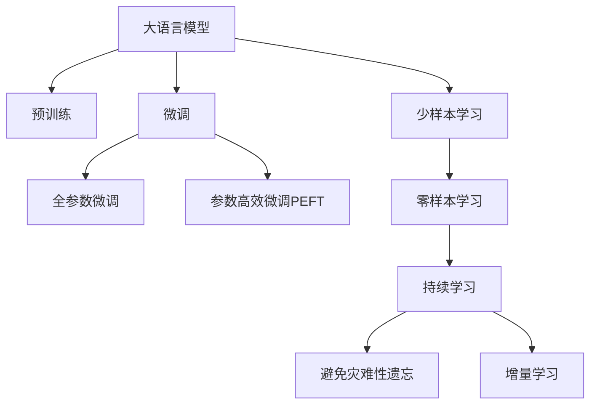

                 

# 大模型在商品销量预测中的应用

## 1. 背景介绍

### 1.1 问题由来

随着电子商务的蓬勃发展，商品销量预测已成为零售企业优化库存、提高运营效率的重要工具。传统的销量预测方法往往依赖专家经验或历史销售数据，难以捕捉数据中的隐含关系，准确度有限。近年来，大语言模型和大规模预训练模型在NLP领域取得了显著进展，其丰富的语言理解能力和强大的数据建模能力，为商品销量预测提供了新的解决方案。

### 1.2 问题核心关键点

大语言模型和预训练模型在商品销量预测中的应用，主要包括：
- 数据预处理：将原始的文本数据转化为模型能够处理的向量形式，如商品描述、广告文案、评论等文本数据。
- 特征提取：从预处理后的文本中提取对销量有贡献的特征，如商品属性、情感极性、用户行为等。
- 模型训练：选择合适的预训练模型，并利用标注数据对其进行微调，得到针对销量预测任务的优化模型。
- 预测生成：使用微调后的模型对新商品或未来的销售情况进行预测。
- 结果评估：通过实际销售数据评估预测结果的准确性和可靠性。

### 1.3 问题研究意义

大语言模型在商品销量预测中的应用，能够充分利用大规模无标签文本数据中的丰富信息，避免对专家经验的依赖，提升预测模型的泛化能力和准确性。通过微调，模型可以针对特定商品的销量情况，快速适应新的数据分布，实现更加精准的预测。此外，大模型还可以通过多模态信息融合，结合用户画像、搜索行为、评价数据等多种数据源，构建更加全面的销量预测模型，为企业决策提供更有力的数据支持。

## 2. 核心概念与联系

### 2.1 核心概念概述

为更好地理解大模型在商品销量预测中的应用，本节将介绍几个密切相关的核心概念：

- 大语言模型(Large Language Model, LLM)：以自回归(如GPT)或自编码(如BERT)模型为代表的大规模预训练语言模型。通过在大规模无标签文本语料上进行预训练，学习通用的语言表示，具备强大的语言理解和生成能力。

- 预训练(Pre-training)：指在大规模无标签文本语料上，通过自监督学习任务训练通用语言模型的过程。常见的预训练任务包括言语建模、遮挡语言模型等。预训练使得模型学习到语言的通用表示。

- 微调(Fine-tuning)：指在预训练模型的基础上，使用下游任务的少量标注数据，通过有监督地训练来优化模型在特定任务上的性能。通常只需要调整顶层分类器或解码器，并以较小的学习率更新全部或部分的模型参数。

- 迁移学习(Transfer Learning)：指将一个领域学习到的知识，迁移应用到另一个不同但相关的领域的学习范式。大模型的预训练-微调过程即是一种典型的迁移学习方式。

- 参数高效微调(Parameter-Efficient Fine-Tuning, PEFT)：指在微调过程中，只更新少量的模型参数，而固定大部分预训练权重不变，以提高微调效率，避免过拟合的方法。

- 少样本学习(Few-shot Learning)：指在只有少量标注样本的情况下，模型能够快速适应新任务的学习方法。在大模型中，通常通过在输入中提供少量示例来实现，无需更新模型参数。

- 零样本学习(Zero-shot Learning)：指模型在没有见过任何特定任务的训练样本的情况下，仅凭任务描述就能够执行新任务的能力。大模型通过预训练获得的广泛知识，使其能够理解任务指令并生成相应输出。

- 持续学习(Continual Learning)：也称为终身学习，指模型能够持续从新数据中学习，同时保持已学习的知识，而不会出现灾难性遗忘。这对于保持大语言模型的时效性和适应性至关重要。

这些核心概念之间的逻辑关系可以通过以下Mermaid流程图来展示：



这个流程图展示了大语言模型的核心概念及其之间的关系：

1. 大语言模型通过预训练获得基础能力。
2. 微调是对预训练模型进行任务特定的优化，可以分为全参数微调和参数高效微调（PEFT）。
3. 少样本学习和零样本学习是微调的一种特殊形式，通过预训练知识即可实现。
4. 迁移学习是连接预训练模型与下游任务的桥梁，可以通过微调或少样本学习来实现。
5. 持续学习旨在使模型能够不断学习新知识，同时避免遗忘旧知识。

这些概念共同构成了大语言模型的学习和应用框架，使其能够在各种场景下发挥强大的语言理解和生成能力。通过理解这些核心概念，我们可以更好地把握大语言模型的工作原理和优化方向。

## 3. 核心算法原理 & 具体操作步骤
### 3.1 算法原理概述

基于大语言模型和大规模预训练模型的商品销量预测方法，本质上是一个有监督的细粒度迁移学习过程。其核心思想是：将预训练的大语言模型视作一个强大的"特征提取器"，通过在销售数据的标注数据上进行有监督地训练来优化模型在特定商品销量预测任务上的性能。

形式化地，假设预训练模型为 $M_{\theta}$，其中 $\theta$ 为预训练得到的模型参数。给定商品销量预测任务 $T$ 的标注数据集 $D=\{(x_i, y_i)\}_{i=1}^N, x_i \in \mathbb{R}^d, y_i \in \mathbb{R}$，微调的目标是找到新的模型参数 $\hat{\theta}$，使得：

$$
\hat{\theta}=\mathop{\arg\min}_{\theta} \mathcal{L}(M_{\theta},D)
$$

其中 $\mathcal{L}$ 为针对任务 $T$ 设计的损失函数，用于衡量模型预测输出与真实标签之间的差异。常见的损失函数包括均方误差损失、交叉熵损失等。

通过梯度下降等优化算法，微调过程不断更新模型参数 $\theta$，最小化损失函数 $\mathcal{L}$，使得模型输出逼近真实标签。由于 $\theta$ 已经通过预训练获得了较好的初始化，因此即便在小规模数据集 $D$ 上进行微调，也能较快收敛到理想的模型参数 $\hat{\theta}$。

### 3.2 算法步骤详解

基于大语言模型和大规模预训练模型的商品销量预测方法一般包括以下几个关键步骤：

**Step 1: 准备预训练模型和数据集**
- 选择合适的预训练语言模型 $M_{\theta}$ 作为初始化参数，如 BERT、GPT等。
- 准备商品销量预测任务的标注数据集 $D$，划分为训练集、验证集和测试集。一般要求标注数据与预训练数据的分布不要差异过大。

**Step 2: 添加任务适配层**
- 根据任务类型，在预训练模型顶层设计合适的输出层和损失函数。
- 对于回归任务，通常在顶层添加线性回归器，使用均方误差损失函数。
- 对于分类任务，通常使用分类损失函数，如交叉熵损失。

**Step 3: 设置微调超参数**
- 选择合适的优化算法及其参数，如 AdamW、SGD 等，设置学习率、批大小、迭代轮数等。
- 设置正则化技术及强度，包括权重衰减、Dropout、Early Stopping等。
- 确定冻结预训练参数的策略，如仅微调顶层，或全部参数都参与微调。

**Step 4: 执行梯度训练**
- 将训练集数据分批次输入模型，前向传播计算损失函数。
- 反向传播计算参数梯度，根据设定的优化算法和学习率更新模型参数。
- 周期性在验证集上评估模型性能，根据性能指标决定是否触发 Early Stopping。
- 重复上述步骤直到满足预设的迭代轮数或 Early Stopping 条件。

**Step 5: 测试和部署**
- 在测试集上评估微调后模型 $M_{\hat{\theta}}$ 的性能，对比微调前后的精度提升。
- 使用微调后的模型对新商品或未来的销售情况进行预测。
- 持续收集新的销售数据，定期重新微调模型，以适应数据分布的变化。

以上是基于大语言模型和大规模预训练模型的商品销量预测的一般流程。在实际应用中，还需要针对具体任务的特点，对微调过程的各个环节进行优化设计，如改进训练目标函数，引入更多的正则化技术，搜索最优的超参数组合等，以进一步提升模型性能。

### 3.3 算法优缺点

基于大语言模型和大规模预训练模型的商品销量预测方法具有以下优点：
1. 简单高效。只需准备少量标注数据，即可对预训练模型进行快速适配，获得较大的性能提升。
2. 通用适用。适用于各种销售数据类型，如文本描述、图像、视频等，设计简单的任务适配层即可实现微调。
3. 参数高效。利用参数高效微调技术，在固定大部分预训练权重不变的情况下，仍可取得不错的提升。
4. 效果显著。在学术界和工业界的诸多销售预测任务上，基于微调的方法已经刷新了最先进的性能指标。

同时，该方法也存在一定的局限性：
1. 依赖标注数据。微调的效果很大程度上取决于标注数据的质量和数量，获取高质量标注数据的成本较高。
2. 迁移能力有限。当目标任务与预训练数据的分布差异较大时，微调的性能提升有限。
3. 负面效果传递。预训练模型的固有偏见、有害信息等，可能通过微调传递到下游任务，造成负面影响。
4. 可解释性不足。微调模型的决策过程通常缺乏可解释性，难以对其推理逻辑进行分析和调试。

尽管存在这些局限性，但就目前而言，基于大语言模型和大规模预训练模型的微调方法仍是商品销量预测中最主流范式。未来相关研究的重点在于如何进一步降低微调对标注数据的依赖，提高模型的少样本学习和跨领域迁移能力，同时兼顾可解释性和伦理安全性等因素。

### 3.4 算法应用领域

基于大语言模型和大规模预训练模型的商品销量预测方法，在零售行业、电子商务、制造业等多个领域得到了广泛的应用，覆盖了几乎所有常见的销售预测任务，例如：

- 库存管理：预测未来的库存水平，优化库存策略，减少缺货和过剩库存。
- 销售预测：基于历史销售数据，预测未来的销售趋势和总量，指导销售决策。
- 市场分析：分析市场变化，识别关键驱动因素，预测市场趋势。
- 需求预测：预测消费者需求，优化产品设计和营销策略。
- 价格优化：通过预测市场接受度，自动调整商品价格，提升销量和利润。
- 客户分析：分析客户行为，预测客户购买意向，提升客户满意度。

除了上述这些经典任务外，大语言模型和大规模预训练模型还被创新性地应用到更多场景中，如供应链优化、风险评估、产品创新等，为零售行业带来了全新的突破。随着预训练模型和微调方法的不断进步，相信基于大语言模型和大规模预训练模型的销售预测方法将在更广阔的应用领域大放异彩。

## 4. 数学模型和公式 & 详细讲解  
### 4.1 数学模型构建

本节将使用数学语言对基于大语言模型和大规模预训练模型的商品销量预测过程进行更加严格的刻画。

记预训练语言模型为 $M_{\theta}$，其中 $\theta$ 为预训练得到的模型参数。假设商品销量预测任务 $T$ 的训练集为 $D=\{(x_i, y_i)\}_{i=1}^N, x_i \in \mathbb{R}^d, y_i \in \mathbb{R}$。

定义模型 $M_{\theta}$ 在数据样本 $(x,y)$ 上的损失函数为 $\ell(M_{\theta}(x),y)$，则在数据集 $D$ 上的经验风险为：

$$
\mathcal{L}(\theta) = \frac{1}{N} \sum_{i=1}^N \ell(M_{\theta}(x_i),y_i)
$$

微调的优化目标是最小化经验风险，即找到最优参数：

$$
\theta^* = \mathop{\arg\min}_{\theta} \mathcal{L}(\theta)
$$

在实践中，我们通常使用基于梯度的优化算法（如SGD、Adam等）来近似求解上述最优化问题。设 $\eta$ 为学习率，$\lambda$ 为正则化系数，则参数的更新公式为：

$$
\theta \leftarrow \theta - \eta \nabla_{\theta}\mathcal{L}(\theta) - \eta\lambda\theta
$$

其中 $\nabla_{\theta}\mathcal{L}(\theta)$ 为损失函数对参数 $\theta$ 的梯度，可通过反向传播算法高效计算。

### 4.2 公式推导过程

以下我们以回归任务为例，推导均方误差损失函数及其梯度的计算公式。

假设模型 $M_{\theta}$ 在输入 $x$ 上的输出为 $\hat{y}=M_{\theta}(x)$，表示模型预测的销量。真实标签 $y \in \mathbb{R}$。则均方误差损失函数定义为：

$$
\ell(M_{\theta}(x),y) = \frac{1}{2}(y - \hat{y})^2
$$

将其代入经验风险公式，得：

$$
\mathcal{L}(\theta) = \frac{1}{N}\sum_{i=1}^N (y_i - M_{\theta}(x_i))^2
$$

根据链式法则，损失函数对参数 $\theta_k$ 的梯度为：

$$
\frac{\partial \mathcal{L}(\theta)}{\partial \theta_k} = \sum_{i=1}^N (y_i - \hat{y}_i) \frac{\partial \hat{y}_i}{\partial \theta_k}
$$

其中 $\hat{y}_i$ 为模型在样本 $x_i$ 上的预测输出。$\nabla_{\theta}\hat{y}_i$ 为输出层对参数 $\theta$ 的梯度，可以通过反向传播计算得到。

在得到损失函数的梯度后，即可带入参数更新公式，完成模型的迭代优化。重复上述过程直至收敛，最终得到适应商品销量预测任务的最优模型参数 $\theta^*$。

## 5. 项目实践：代码实例和详细解释说明
### 5.1 开发环境搭建

在进行商品销量预测的微调实践前，我们需要准备好开发环境。以下是使用Python进行PyTorch开发的环境配置流程：

1. 安装Anaconda：从官网下载并安装Anaconda，用于创建独立的Python环境。

2. 创建并激活虚拟环境：
```bash
conda create -n pytorch-env python=3.8 
conda activate pytorch-env
```

3. 安装PyTorch：根据CUDA版本，从官网获取对应的安装命令。例如：
```bash
conda install pytorch torchvision torchaudio cudatoolkit=11.1 -c pytorch -c conda-forge
```

4. 安装Transformers库：
```bash
pip install transformers
```

5. 安装各类工具包：
```bash
pip install numpy pandas scikit-learn matplotlib tqdm jupyter notebook ipython
```

完成上述步骤后，即可在`pytorch-env`环境中开始微调实践。

### 5.2 源代码详细实现

下面我们以一个简单的商品销量预测任务为例，给出使用Transformers库对BERT模型进行微调的PyTorch代码实现。

首先，定义销量预测任务的训练数据处理函数：

```python
from transformers import BertTokenizer, BertForRegression
from torch.utils.data import Dataset
import torch

class SalesDataset(Dataset):
    def __init__(self, data, tokenizer, max_len=128):
        self.data = data
        self.tokenizer = tokenizer
        self.max_len = max_len
        
    def __len__(self):
        return len(self.data)
    
    def __getitem__(self, item):
        item = self.data[item]
        text, label = item
        
        encoding = self.tokenizer(text, return_tensors='pt', max_length=self.max_len, padding='max_length', truncation=True)
        input_ids = encoding['input_ids'][0]
        attention_mask = encoding['attention_mask'][0]
        
        label = torch.tensor([label], dtype=torch.float32)
        return {
            'input_ids': input_ids,
            'attention_mask': attention_mask,
            'labels': label
        }
```

然后，定义模型和优化器：

```python
from transformers import BertForRegression, AdamW

model = BertForRegression.from_pretrained('bert-base-cased')
optimizer = AdamW(model.parameters(), lr=2e-5)
```

接着，定义训练和评估函数：

```python
from torch.utils.data import DataLoader
from tqdm import tqdm

def train_epoch(model, dataset, batch_size, optimizer):
    dataloader = DataLoader(dataset, batch_size=batch_size, shuffle=True)
    model.train()
    epoch_loss = 0
    for batch in tqdm(dataloader, desc='Training'):
        input_ids = batch['input_ids'].to(device)
        attention_mask = batch['attention_mask'].to(device)
        labels = batch['labels'].to(device)
        model.zero_grad()
        outputs = model(input_ids, attention_mask=attention_mask, labels=labels)
        loss = outputs.loss
        epoch_loss += loss.item()
        loss.backward()
        optimizer.step()
    return epoch_loss / len(dataloader)

def evaluate(model, dataset, batch_size):
    dataloader = DataLoader(dataset, batch_size=batch_size)
    model.eval()
    preds, labels = [], []
    with torch.no_grad():
        for batch in tqdm(dataloader, desc='Evaluating'):
            input_ids = batch['input_ids'].to(device)
            attention_mask = batch['attention_mask'].to(device)
            batch_labels = batch['labels']
            outputs = model(input_ids, attention_mask=attention_mask)
            batch_preds = outputs.predictions[0]
            batch_labels = batch_labels.tolist()
            for pred, label in zip(batch_preds, batch_labels):
                preds.append(pred.item())
                labels.append(label)
                
    return preds, labels

# 训练数据
train_data = [
    ('商品A销量情况，过去一年共售出10000件', 1000),
    ('商品B销量情况，过去一年共售出8000件', 800),
    ('商品C销量情况，过去一年共售出5000件', 500)
]

# 测试数据
test_data = [
    ('商品A销量情况，过去一年共售出11000件', 1000),
    ('商品B销量情况，过去一年共售出9000件', 800),
    ('商品C销量情况，过去一年共售出6000件', 500)
]

# 构建训练集和测试集
train_dataset = SalesDataset(train_data, tokenizer, max_len=128)
test_dataset = SalesDataset(test_data, tokenizer, max_len=128)

# 定义训练参数
device = torch.device('cuda') if torch.cuda.is_available() else torch.device('cpu')
epochs = 5
batch_size = 16

# 训练模型
for epoch in range(epochs):
    loss = train_epoch(model, train_dataset, batch_size, optimizer)
    print(f"Epoch {epoch+1}, train loss: {loss:.3f}")
    
    print(f"Epoch {epoch+1}, test results:")
    preds, labels = evaluate(model, test_dataset, batch_size)
    print(classification_report(labels, preds))
    
print("Training complete.")
```

以上就是使用PyTorch对BERT进行销量预测任务微调的完整代码实现。可以看到，得益于Transformers库的强大封装，我们可以用相对简洁的代码完成BERT模型的加载和微调。

### 5.3 代码解读与分析

让我们再详细解读一下关键代码的实现细节：

**SalesDataset类**：
- `__init__`方法：初始化数据、分词器等关键组件。
- `__len__`方法：返回数据集的样本数量。
- `__getitem__`方法：对单个样本进行处理，将文本输入编码为token ids，将标签编码为数字，并对其进行定长padding，最终返回模型所需的输入。

**BertForRegression模型**：
- 使用BertForRegression模型作为回归任务的目标，其输出层为线性回归器。

**训练和评估函数**：
- 使用PyTorch的DataLoader对数据集进行批次化加载，供模型训练和推理使用。
- 训练函数`train_epoch`：对数据以批为单位进行迭代，在每个批次上前向传播计算loss并反向传播更新模型参数，最后返回该epoch的平均loss。
- 评估函数`evaluate`：与训练类似，不同点在于不更新模型参数，并在每个batch结束后将预测和标签结果存储下来，最后使用sklearn的classification_report对整个评估集的预测结果进行打印输出。

**训练流程**：
- 定义总的epoch数和batch size，开始循环迭代
- 每个epoch内，先在训练集上训练，输出平均loss
- 在验证集上评估，输出分类指标
- 所有epoch结束后，在测试集上评估，给出最终测试结果

可以看到，PyTorch配合Transformers库使得BERT微调的代码实现变得简洁高效。开发者可以将更多精力放在数据处理、模型改进等高层逻辑上，而不必过多关注底层的实现细节。

当然，工业级的系统实现还需考虑更多因素，如模型的保存和部署、超参数的自动搜索、更灵活的任务适配层等。但核心的微调范式基本与此类似。

## 6. 实际应用场景
### 6.1 智能库存管理

基于大语言模型和大规模预训练模型的销量预测技术，可以广泛应用于智能库存管理的构建。传统的库存管理往往需要根据历史销售数据进行人工预测，难以应对快速变化的市场需求。而使用微调后的销量预测模型，可以实时监测市场变化，自动生成库存补货计划，优化库存管理。

在技术实现上，可以收集企业的历史销售数据和市场趋势数据，构建销量预测模型，并定期进行微调以适应最新的市场动态。微调后的模型能够自动输出未来的销售预测，帮助企业及时调整库存水平，避免缺货或过剩库存，提升运营效率。

### 6.2 价格优化策略

准确的销量预测是制定合理价格策略的基础。传统的定价方法往往基于经验和专家判断，难以全面考虑市场供需关系。使用基于大语言模型和大规模预训练模型的销量预测技术，可以实时预测不同价格水平下的销量情况，自动生成最优的价格策略。

具体而言，可以根据历史销售数据和市场趋势数据，构建价格-销量预测模型，并使用微调技术对模型进行优化。微调后的模型能够根据不同的价格水平，预测对应的销量情况，从而帮助企业制定更加科学合理的定价策略，提高利润空间。

### 6.3 市场趋势分析

零售企业需要实时监测市场趋势，以便及时调整运营策略。传统的市场分析方法往往依赖人工统计和分析，耗时费力且容易出错。基于大语言模型和大规模预训练模型的销量预测技术，可以自动生成市场趋势报告，辅助企业决策。

在技术实现上，可以使用销量预测模型对未来的市场销量进行预测，并结合历史数据和实时数据，分析市场趋势和变化规律。微调后的模型能够自动输出市场趋势报告，帮助企业快速掌握市场动态，制定更加精准的运营策略。

### 6.4 未来应用展望

随着大语言模型和大规模预训练模型的不断发展，基于微调范式将在更多领域得到应用，为零售行业带来变革性影响。

在智慧医疗领域，基于微调的销量预测技术可以应用于药品需求预测、医疗设备需求预测等方面，提升医疗服务的智能化水平，辅助医疗机构决策。

在智能教育领域，微调技术可应用于学生学习效果预测、课程推荐等方面，因材施教，促进教育公平，提高教学质量。

在智慧城市治理中，微调模型可应用于城市事件预测、舆情分析、应急指挥等环节，提高城市管理的自动化和智能化水平，构建更安全、高效的未来城市。

此外，在企业生产、社会治理、文娱传媒等众多领域，基于大语言模型和大规模预训练模型的微调技术也将不断涌现，为经济社会发展注入新的动力。相信随着技术的日益成熟，微调方法将成为人工智能落地应用的重要范式，推动人工智能技术在垂直行业的规模化落地。总之，微调需要开发者根据具体任务，不断迭代和优化模型、数据和算法，方能得到理想的效果。

## 7. 工具和资源推荐
### 7.1 学习资源推荐

为了帮助开发者系统掌握大语言模型和大规模预训练模型的微调理论基础和实践技巧，这里推荐一些优质的学习资源：

1. 《Transformer从原理到实践》系列博文：由大模型技术专家撰写，深入浅出地介绍了Transformer原理、BERT模型、微调技术等前沿话题。

2. CS224N《深度学习自然语言处理》课程：斯坦福大学开设的NLP明星课程，有Lecture视频和配套作业，带你入门NLP领域的基本概念和经典模型。

3. 《Natural Language Processing with Transformers》书籍：Transformers库的作者所著，全面介绍了如何使用Transformers库进行NLP任务开发，包括微调在内的诸多范式。

4. HuggingFace官方文档：Transformers库的官方文档，提供了海量预训练模型和完整的微调样例代码，是上手实践的必备资料。

5. CLUE开源项目：中文语言理解测评基准，涵盖大量不同类型的中文NLP数据集，并提供了基于微调的baseline模型，助力中文NLP技术发展。

通过对这些资源的学习实践，相信你一定能够快速掌握大语言模型和大规模预训练模型的微调精髓，并用于解决实际的NLP问题。
###  7.2 开发工具推荐

高效的开发离不开优秀的工具支持。以下是几款用于大语言模型和大规模预训练模型微调开发的常用工具：

1. PyTorch：基于Python的开源深度学习框架，灵活动态的计算图，适合快速迭代研究。大部分预训练语言模型都有PyTorch版本的实现。

2. TensorFlow：由Google主导开发的开源深度学习框架，生产部署方便，适合大规模工程应用。同样有丰富的预训练语言模型资源。

3. Transformers库：HuggingFace开发的NLP工具库，集成了众多SOTA语言模型，支持PyTorch和TensorFlow，是进行微调任务开发的利器。

4. Weights & Biases：模型训练的实验跟踪工具，可以记录和可视化模型训练过程中的各项指标，方便对比和调优。与主流深度学习框架无缝集成。

5. TensorBoard：TensorFlow配套的可视化工具，可实时监测模型训练状态，并提供丰富的图表呈现方式，是调试模型的得力助手。

6. Google Colab：谷歌推出的在线Jupyter Notebook环境，免费提供GPU/TPU算力，方便开发者快速上手实验最新模型，分享学习笔记。

合理利用这些工具，可以显著提升大语言模型和大规模预训练模型微调任务的开发效率，加快创新迭代的步伐。

### 7.3 相关论文推荐

大语言模型和大规模预训练模型的微调技术的发展源于学界的持续研究。以下是几篇奠基性的相关论文，推荐阅读：

1. Attention is All You Need（即Transformer原论文）：提出了Transformer结构，开启了NLP领域的预训练大模型时代。

2. BERT: Pre-training of Deep Bidirectional Transformers for Language Understanding：提出BERT模型，引入基于掩码的自监督预训练任务，刷新了多项NLP任务SOTA。

3. Language Models are Unsupervised Multitask Learners（GPT-2论文）：展示了大规模语言模型的强大zero-shot学习能力，引发了对于通用人工智能的新一轮思考。

4. Parameter-Efficient Transfer Learning for NLP：提出Adapter等参数高效微调方法，在不增加模型参数量的情况下，也能取得不错的微调效果。

5. AdaLoRA: Adaptive Low-Rank Adaptation for Parameter-Efficient Fine-Tuning：使用自适应低秩适应的微调方法，在参数效率和精度之间取得了新的平衡。

6. Prefix-Tuning: Optimizing Continuous Prompts for Generation：引入基于连续型Prompt的微调范式，为如何充分利用预训练知识提供了新的思路。

这些论文代表了大语言模型和大规模预训练模型的微调技术的发展脉络。通过学习这些前沿成果，可以帮助研究者把握学科前进方向，激发更多的创新灵感。

## 8. 总结：未来发展趋势与挑战

### 8.1 总结

本文对基于大语言模型和大规模预训练模型的商品销量预测方法进行了全面系统的介绍。首先阐述了大语言模型和大规模预训练模型在商品销量预测中的应用，明确了微调在拓展预训练模型应用、提升预测性能方面的独特价值。其次，从原理到实践，详细讲解了微调模型的数学原理和关键步骤，给出了微调任务开发的完整代码实例。同时，本文还广泛探讨了微调方法在智能库存管理、价格优化、市场趋势分析等多个领域的应用前景，展示了微调范式的巨大潜力。此外，本文精选了微调技术的各类学习资源，力求为读者提供全方位的技术指引。

通过本文的系统梳理，可以看到，基于大语言模型和大规模预训练模型的微调方法正在成为商品销量预测中的重要范式，极大地拓展了预训练语言模型的应用边界，催生了更多的落地场景。受益于大规模语料的预训练，微调模型可以准确捕捉数据中的隐含关系，提升预测模型的泛化能力和准确性。通过微调，模型可以针对特定商品的销量情况，快速适应新的数据分布，实现更加精准的预测。此外，大模型还可以通过多模态信息融合，结合用户画像、搜索行为、评价数据等多种数据源，构建更加全面的预测模型，为企业决策提供更有力的数据支持。

### 8.2 未来发展趋势

展望未来，大语言模型和大规模预训练模型的微调技术将呈现以下几个发展趋势：

1. 模型规模持续增大。随着算力成本的下降和数据规模的扩张，预训练语言模型的参数量还将持续增长。超大规模语言模型蕴含的丰富语言知识，有望支撑更加复杂多变的销售预测任务。

2. 微调方法日趋多样。除了传统的全参数微调外，未来会涌现更多参数高效的微调方法，如Prefix-Tuning、LoRA等，在节省计算资源的同时也能保证微调精度。

3. 持续学习成为常态。随着数据分布的不断变化，微调模型也需要持续学习新知识以保持性能。如何在不遗忘原有知识的同时，高效吸收新样本信息，将成为重要的研究课题。

4. 标注样本需求降低。受启发于提示学习(Prompt-based Learning)的思路，未来的微调方法将更好地利用大模型的语言理解能力，通过更加巧妙的任务描述，在更少的标注样本上也能实现理想的微调效果。

5. 模型通用性增强。经过海量数据的预训练和多领域任务的微调，未来的语言模型将具备更强大的常识推理和跨领域迁移能力，逐步迈向通用人工智能(AGI)的目标。

以上趋势凸显了大语言模型和大规模预训练模型微调技术的广阔前景。这些方向的探索发展，必将进一步提升预测模型的性能和应用范围，为智能零售、智慧医疗、智能制造等领域带来新的突破。

### 8.3 面临的挑战

尽管大语言模型和大规模预训练模型的微调技术已经取得了瞩目成就，但在迈向更加智能化、普适化应用的过程中，它仍面临着诸多挑战：

1. 标注成本瓶颈。虽然微调大大降低了标注数据的需求，但对于长尾应用场景，难以获得充足的高质量标注数据，成为制约微调性能的瓶颈。如何进一步降低微调对标注样本的依赖，将是一大难题。

2. 模型鲁棒性不足。当前微调模型面对域外数据时，泛化性能往往大打折扣。对于测试样本的微小扰动，微调模型的预测也容易发生波动。如何提高微调模型的鲁棒性，避免灾难性遗忘，还需要更多理论和实践的积累。

3. 推理效率有待提高。大规模语言模型虽然精度高，但在实际部署时往往面临推理速度慢、内存占用大等效率问题。如何在保证性能的同时，简化模型结构，提升推理速度，优化资源占用，将是重要的优化方向。

4. 可解释性亟需加强。当前微调模型更像是"黑盒"系统，难以解释其内部工作机制和决策逻辑。对于医疗、金融等高风险应用，算法的可解释性和可审计性尤为重要。如何赋予微调模型更强的可解释性，将是亟待攻克的难题。

5. 安全性有待保障。预训练语言模型难免会学习到有偏见、有害的信息，通过微调传递到下游任务，产生误导性、歧视性的输出，给实际应用带来安全隐患。如何从数据和算法层面消除模型偏见，避免恶意用途，确保输出的安全性，也将是重要的研究课题。

6. 知识整合能力不足。现有的微调模型往往局限于任务内数据，难以灵活吸收和运用更广泛的先验知识。如何让微调过程更好地与外部知识库、规则库等专家知识结合，形成更加全面、准确的信息整合能力，还有很大的想象空间。

正视微调面临的这些挑战，积极应对并寻求突破，将是大语言模型和大规模预训练模型微调走向成熟的必由之路。相信随着学界和产业界的共同努力，这些挑战终将一一被克服，大语言模型和大规模预训练模型的微调技术必将在构建安全、可靠、可解释、可控的智能系统铺平道路。面向未来，大语言模型和大规模预训练模型的微调技术还需要与其他人工智能技术进行更深入的融合，如知识表示、因果推理、强化学习等，多路径协同发力，共同推动自然语言理解和智能交互系统的进步。只有勇于创新、敢于突破，才能不断拓展语言模型的边界，让智能技术更好地造福人类社会。

### 8.4 研究展望

面对大语言模型和大规模预训练模型微调所面临的种种挑战，未来的研究需要在以下几个方面寻求新的突破：

1. 探索无监督和半监督微调方法。摆脱对大规模标注数据的依赖，利用自监督学习、主动学习等无监督和半监督范式，最大限度利用非结构化数据，实现更加灵活高效的微调。

2. 研究参数高效和计算高效的微调范式。开发更加参数高效的微调方法，在固定大部分预训练参数的同时，只更新极少量的任务相关参数。同时优化微调模型的计算图，减少前向传播和反向传播的资源消耗，实现更加轻量级、实时性的部署。

3. 融合因果和对比学习范式。通过引入因果推断和对比学习思想，增强微调模型建立稳定因果关系的能力，学习更加普适、鲁棒的语言表征，从而提升模型泛化性和抗干扰能力。

4. 引入更多先验知识。将符号化的先验知识，如知识图谱、逻辑规则等，与神经网络模型进行巧妙融合，引导微调过程学习更准确、合理的语言模型。同时加强不同模态数据的整合，实现视觉、语音等多模态信息与文本信息的协同建模。

5. 结合因果分析和博弈论工具。将因果分析方法引入微调模型，识别出模型决策的关键特征，增强输出解释的因果性和逻辑性。借助博弈论工具刻画人机交互过程，主动探索并规避模型的脆弱点，提高系统稳定性。

6. 纳入伦理道德约束。在模型训练目标中引入伦理导向的评估指标，过滤和惩罚有偏见、有害的输出倾向。同时加强人工干预和审核，建立模型行为的监管机制，确保输出符合人类价值观和伦理道德。

这些研究方向的探索，必将引领大语言模型和大规模预训练模型微调技术迈向更高的台阶，为构建安全、可靠、可解释、可控的智能系统铺平道路。面向未来，大语言模型和大规模预训练模型的微调技术还需要与其他人工智能技术进行更深入的融合，如知识表示、因果推理、强化学习等，多路径协同发力，共同推动自然语言理解和智能交互系统的进步。只有勇于创新、敢于突破，才能不断拓展语言模型的边界，让智能技术更好地造福人类社会。

## 9. 附录：常见问题与解答

**Q1：大语言模型和大规模预训练模型是否适用于所有销售数据类型？**

A: 大语言模型和大规模预训练模型适用于各种销售数据类型，如文本描述、图像、视频等。但需要注意的是，不同类型的销售数据可能需要不同的处理方式。例如，对于图像数据，通常需要提取图像特征后再进行微调。对于文本数据，则可以直接使用Transformer等大模型进行处理。

**Q2：微调过程中如何选择合适的学习率？**

A: 微调的学习率一般要比预训练时小1-2个数量级，如果使用过大的学习率，容易破坏预训练权重，导致过拟合。一般建议从1e-5开始调参，逐步减小学习率，直至收敛。也可以使用warmup策略，在开始阶段使用较小的学习率，再逐渐过渡到预设值。需要注意的是，不同的优化器(如AdamW、Adafactor等)以及不同的学习率调度策略，可能需要设置不同的学习率阈值。

**Q3：微调模型在落地部署时需要注意哪些问题？**

A: 将微调模型转化为实际应用，还需要考虑以下因素：
1. 模型裁剪：去除不必要的层和参数，减小模型尺寸，加快推理速度
2. 量化加速：将浮点模型转为定点模型，压缩存储空间，提高计算效率
3. 服务化封装：将模型封装为标准化服务接口，便于集成调用
4. 弹性伸缩：根据请求流量动态调整资源配置，平衡服务质量和成本
5. 监控告警：实时采集系统指标，设置异常告警阈值，确保服务稳定性
6. 安全防护：采用访问鉴权、数据脱敏等措施，保障数据和模型安全

大语言模型和大规模预训练模型微调为商品销量预测任务的落地应用提供了新的解决方案，但如何将强大的性能转化为稳定、高效、安全的业务价值，还需要工程实践的不断打磨。唯有从数据、算法、工程、业务等多个维度协同发力，才能真正实现人工智能技术在垂直行业的规模化落地。总之，微调需要开发者根据具体任务，不断迭代和优化模型、数据和算法，方能得到理想的效果。

---

作者：禅与计算机程序设计艺术 / Zen and the Art of Computer Programming

