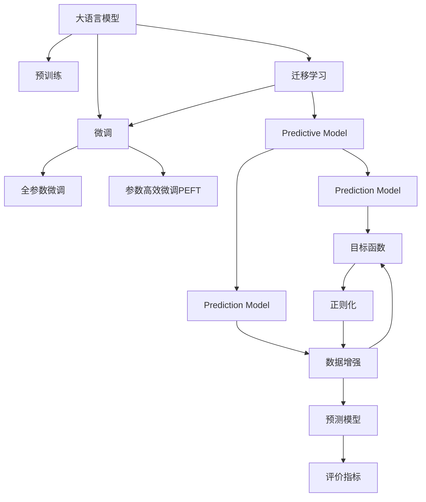

                 

# 大模型在商品需求预测中的应用

## 1. 背景介绍

### 1.1 问题由来
商品需求预测是零售行业中的关键任务，其准确性直接关系到库存管理、定价策略、市场营销等多个环节。传统的商品需求预测方法依赖于时间序列分析、统计模型等，但这些方法对数据的特征提取能力有限，且难以充分利用现代深度学习技术的潜力。近年来，大语言模型（Large Language Model, LLM）在自然语言处理（NLP）等领域取得了突破性进展，其强大的数据建模和特征提取能力，为商品需求预测提供了新的技术路径。

### 1.2 问题核心关键点
大语言模型在商品需求预测中的应用，核心在于如何高效地从历史销售数据中提取有用的特征，并利用语言模型捕捉商品描述和用户评论中的信息，构建预测模型。这需要解决以下几个核心问题：

- 如何设计合适的任务适配层，将大模型与商品需求预测任务衔接。
- 如何利用预训练语言模型丰富的语言知识和上下文信息，提升预测精度。
- 如何避免模型过拟合，提高预测模型的泛化能力。
- 如何设计合理的评价指标，评估预测模型的性能。

### 1.3 问题研究意义
大语言模型在商品需求预测中的应用，对零售行业的智能化转型具有重要意义：

1. 提升预测准确性：大语言模型可以综合考虑商品描述、用户评论等多方面的信息，捕捉深层次的语义关系，提高预测的准确性和可靠性。
2. 优化库存管理：通过精确的预测，商家可以更好地规划库存，避免缺货或积压，减少运营成本。
3. 个性化推荐：利用预测结果进行个性化推荐，提升用户体验和满意度。
4. 辅助定价策略：根据预测的销量趋势，制定更加科学的定价策略，提高收益。
5. 强化供应链管理：预测商品需求，优化供应链资源配置，提高供应链的灵活性和响应速度。

## 2. 核心概念与联系

### 2.1 核心概念概述

为更好地理解大语言模型在商品需求预测中的应用，本节将介绍几个密切相关的核心概念：

- 大语言模型(Large Language Model, LLM)：以自回归(如GPT)或自编码(如BERT)模型为代表的大规模预训练语言模型。通过在大规模无标签文本语料上进行预训练，学习通用的语言表示，具备强大的语言理解和生成能力。

- 预训练(Pre-training)：指在大规模无标签文本语料上，通过自监督学习任务训练通用语言模型的过程。常见的预训练任务包括言语建模、遮挡语言模型等。预训练使得模型学习到语言的通用表示。

- 微调(Fine-tuning)：指在预训练模型的基础上，使用下游任务的少量标注数据，通过有监督学习优化模型在特定任务上的性能。通常只需要调整顶层分类器或解码器，并以较小的学习率更新全部或部分的模型参数。

- 迁移学习(Transfer Learning)：指将一个领域学习到的知识，迁移应用到另一个不同但相关的领域的学习范式。大模型的预训练-微调过程即是一种典型的迁移学习方式。

- 预测模型(Prediction Model)：用于进行商品需求预测的模型，可以是大语言模型，也可以是针对需求预测任务设计的特定模型。

- 目标函数(Objective Function)：用于衡量预测模型性能的函数，如均方误差（MSE）、平均绝对误差（MAE）等。

- 正则化(Regularization)：在模型训练过程中加入正则项，防止模型过拟合，包括L2正则、Dropout、Early Stopping等。

- 数据增强(Data Augmentation)：通过数据转换、生成对抗样本等方式，增加训练数据的多样性，提升模型泛化能力。

这些核心概念之间的逻辑关系可以通过以下Mermaid流程图来展示：



这个流程图展示了大语言模型的核心概念及其之间的关系：

1. 大语言模型通过预训练获得基础能力。
2. 微调是对预训练模型进行任务特定的优化，可以分为全参数微调和参数高效微调（PEFT）。
3. 预测模型用于具体商品需求预测任务。
4. 迁移学习是连接预训练模型与下游任务的桥梁，可以通过微调或迁移学习来实现。
5. 目标函数用于评估预测模型的性能。
6. 正则化技术用于避免模型过拟合。
7. 数据增强技术用于增加训练数据的多样性。
8. 预测模型结合目标函数和正则化技术，最终输出预测结果。
9. 评价指标用于评估预测模型的准确性。

这些概念共同构成了大语言模型在商品需求预测中的应用框架，使其能够在各种场景下发挥强大的语言理解和生成能力。通过理解这些核心概念，我们可以更好地把握大语言模型的工作原理和优化方向。

## 3. 核心算法原理 & 具体操作步骤
### 3.1 算法原理概述

大语言模型在商品需求预测中的应用，本质上是一个有监督的微调过程。其核心思想是：将预训练的大语言模型视作一个强大的"特征提取器"，通过在下游任务的标注数据上进行有监督的微调，使得模型输出能够匹配任务标签，从而获得针对特定任务优化的预测模型。

形式化地，假设预训练模型为 $M_{\theta}$，其中 $\theta$ 为预训练得到的模型参数。给定商品需求预测任务 $T$ 的标注数据集 $D=\{(x_i,y_i)\}_{i=1}^N, x_i \in \mathcal{X}, y_i \in \mathcal{Y}$，微调的目标是找到新的模型参数 $\hat{\theta}$，使得：

$$
\hat{\theta}=\mathop{\arg\min}_{\theta} \mathcal{L}(M_{\theta},D)
$$

其中 $\mathcal{L}$ 为针对任务 $T$ 设计的损失函数，用于衡量模型预测输出与真实标签之间的差异。常见的损失函数包括均方误差（MSE）、平均绝对误差（MAE）等。

通过梯度下降等优化算法，微调过程不断更新模型参数 $\theta$，最小化损失函数 $\mathcal{L}$，使得模型输出逼近真实标签。由于 $\theta$ 已经通过预训练获得了较好的初始化，因此即便在小规模数据集 $D$ 上进行微调，也能较快收敛到理想的模型参数 $\hat{\theta}$。

### 3.2 算法步骤详解

大语言模型在商品需求预测中的应用，一般包括以下几个关键步骤：

**Step 1: 准备预训练模型和数据集**
- 选择合适的预训练语言模型 $M_{\theta}$ 作为初始化参数，如 BERT、GPT 等。
- 准备商品需求预测任务 $T$ 的标注数据集 $D$，划分为训练集、验证集和测试集。一般要求标注数据与预训练数据的分布不要差异过大。

**Step 2: 添加任务适配层**
- 根据任务类型，在预训练模型顶层设计合适的输出层和损失函数。
- 对于回归任务，通常在顶层添加线性回归层和均方误差损失函数。
- 对于分类任务，通常在顶层添加线性分类器和交叉熵损失函数。

**Step 3: 设置微调超参数**
- 选择合适的优化算法及其参数，如 AdamW、SGD 等，设置学习率、批大小、迭代轮数等。
- 设置正则化技术及强度，包括权重衰减、Dropout、Early Stopping 等。
- 确定冻结预训练参数的策略，如仅微调顶层，或全部参数都参与微调。

**Step 4: 执行梯度训练**
- 将训练集数据分批次输入模型，前向传播计算损失函数。
- 反向传播计算参数梯度，根据设定的优化算法和学习率更新模型参数。
- 周期性在验证集上评估模型性能，根据性能指标决定是否触发 Early Stopping。
- 重复上述步骤直到满足预设的迭代轮数或 Early Stopping 条件。

**Step 5: 测试和部署**
- 在测试集上评估微调后模型 $M_{\hat{\theta}}$ 的性能，对比微调前后的精度提升。
- 使用微调后的模型对新样本进行预测，集成到实际的应用系统中。
- 持续收集新的数据，定期重新微调模型，以适应数据分布的变化。

以上是使用大语言模型进行商品需求预测的一般流程。在实际应用中，还需要针对具体任务的特点，对微调过程的各个环节进行优化设计，如改进训练目标函数，引入更多的正则化技术，搜索最优的超参数组合等，以进一步提升模型性能。

### 3.3 算法优缺点

大语言模型在商品需求预测中的应用，具有以下优点：

1. 数据利用效率高：大语言模型能够从商品描述、用户评论等多种数据源中提取有用的特征，充分利用多方面的信息进行预测。
2. 泛化能力强：通过预训练和微调，大模型可以学习到商品的通用特征和市场规律，适应性更强，泛化能力更强。
3. 模型可解释性好：大语言模型的结构和参数可解释性强，便于理解和调试，易于融入实际业务中。
4. 训练速度快：大语言模型使用预训练模型作为初始化参数，减少了从头训练的时间，可以更快地训练出有效的预测模型。

同时，该方法也存在一定的局限性：

1. 对标注数据依赖大：商品需求预测的标注数据获取成本较高，需要大量标注样本才能训练出高精度的模型。
2. 模型资源消耗大：预训练语言模型通常参数量巨大，对计算资源和存储资源的需求较高，需要高性能的硬件支持。
3. 过拟合风险高：商品需求预测数据集相对较小，容易出现过拟合现象，需要更多的正则化技术进行缓解。
4. 适应性不够：大语言模型在特定领域和特定商品上可能表现不佳，需要进一步的领域微调或任务适配。

尽管存在这些局限性，但大语言模型在商品需求预测中的应用前景仍然广阔，随着模型架构的改进和算力水平的提升，这些局限性有望得到逐步缓解。

### 3.4 算法应用领域

大语言模型在商品需求预测中的应用，已在多个实际场景中得到了验证，涵盖多个行业领域，例如：

- 电子商务：预测用户对商品的需求量，优化库存管理和定价策略。
- 零售业：分析季节性销售趋势，制定促销活动和市场策略。
- 制造业：预测生产需求，优化供应链和生产计划。
- 服务业：预测客户服务需求，提升服务质量和客户满意度。
- 金融行业：预测贷款需求，优化贷款审批流程。

除了上述这些经典应用场景外，大语言模型还可以创新性地应用于更多领域，如可控性需求预测、市场趋势分析、广告投放优化等，为商品需求预测带来新的突破。

## 4. 数学模型和公式 & 详细讲解 & 举例说明
### 4.1 数学模型构建

本节将使用数学语言对大语言模型在商品需求预测中的应用过程进行更加严格的刻画。

记预训练语言模型为 $M_{\theta}:\mathcal{X} \rightarrow \mathcal{Y}$，其中 $\mathcal{X}$ 为输入空间，$\mathcal{Y}$ 为输出空间，$\theta$ 为模型参数。假设商品需求预测任务为回归任务，标注数据集为 $D=\{(x_i,y_i)\}_{i=1}^N, x_i \in \mathcal{X}, y_i \in \mathcal{Y}$。

定义模型 $M_{\theta}$ 在输入 $x$ 上的预测为 $\hat{y}=M_{\theta}(x)$，则回归任务的目标函数为：

$$
\mathcal{L}(\theta) = \frac{1}{N} \sum_{i=1}^N (y_i - M_{\theta}(x_i))^2
$$

其中 $y_i$ 为真实需求量，$M_{\theta}(x_i)$ 为模型预测值。

### 4.2 公式推导过程

以下我们以二元回归任务为例，推导均方误差（MSE）损失函数的梯度计算公式。

假设模型 $M_{\theta}$ 在输入 $x$ 上的预测为 $\hat{y}=M_{\theta}(x)$，真实需求量 $y$，则二元回归任务的目标函数为：

$$
\mathcal{L}(\theta) = \frac{1}{N} \sum_{i=1}^N (y_i - \hat{y})^2
$$

根据链式法则，损失函数对参数 $\theta_k$ 的梯度为：

$$
\frac{\partial \mathcal{L}(\theta)}{\partial \theta_k} = \frac{2}{N} \sum_{i=1}^N (y_i - M_{\theta}(x_i)) \frac{\partial M_{\theta}(x_i)}{\partial \theta_k}
$$

其中 $\frac{\partial M_{\theta}(x_i)}{\partial \theta_k}$ 可进一步递归展开，利用自动微分技术完成计算。

在得到损失函数的梯度后，即可带入参数更新公式，完成模型的迭代优化。重复上述过程直至收敛，最终得到适应商品需求预测任务的最优模型参数 $\theta^*$。

## 5. 项目实践：代码实例和详细解释说明
### 5.1 开发环境搭建

在进行商品需求预测实践前，我们需要准备好开发环境。以下是使用Python进行PyTorch开发的环境配置流程：

1. 安装Anaconda：从官网下载并安装Anaconda，用于创建独立的Python环境。

2. 创建并激活虚拟环境：
```bash
conda create -n pytorch-env python=3.8 
conda activate pytorch-env
```

3. 安装PyTorch：根据CUDA版本，从官网获取对应的安装命令。例如：
```bash
conda install pytorch torchvision torchaudio cudatoolkit=11.1 -c pytorch -c conda-forge
```

4. 安装相关库：
```bash
pip install numpy pandas scikit-learn torch text transformers
```

完成上述步骤后，即可在`pytorch-env`环境中开始商品需求预测实践。

### 5.2 源代码详细实现

下面我们以商品需求预测为例，给出使用Transformers库对BERT模型进行微调的PyTorch代码实现。

首先，定义模型和优化器：

```python
from transformers import BertForRegression, AdamW

model = BertForRegression.from_pretrained('bert-base-cased')
optimizer = AdamW(model.parameters(), lr=2e-5)
```

接着，定义训练和评估函数：

```python
from torch.utils.data import Dataset
from torch.utils.data import DataLoader
import torch

class SalesDataset(Dataset):
    def __init__(self, data, tokenizer):
        self.data = data
        self.tokenizer = tokenizer
        
    def __len__(self):
        return len(self.data)
    
    def __getitem__(self, item):
        sales = self.data[item]
        tokenizer = self.tokenizer
        encoding = tokenizer(sales, truncation=True, padding='max_length')
        return {'input_ids': encoding['input_ids'].flatten(), 'attention_mask': encoding['attention_mask'].flatten()}

def train_epoch(model, data_loader, optimizer):
    model.train()
    for batch in data_loader:
        input_ids = batch['input_ids'].to(device)
        attention_mask = batch['attention_mask'].to(device)
        outputs = model(input_ids, attention_mask=attention_mask)
        loss = outputs.loss
        optimizer.zero_grad()
        loss.backward()
        optimizer.step()
    return loss.item()

def evaluate(model, data_loader):
    model.eval()
    total_loss = 0
    for batch in data_loader:
        input_ids = batch['input_ids'].to(device)
        attention_mask = batch['attention_mask'].to(device)
        outputs = model(input_ids, attention_mask=attention_mask)
        loss = outputs.loss
        total_loss += loss.item()
    return total_loss / len(data_loader)
```

然后，定义训练流程：

```python
epochs = 5
batch_size = 16

device = torch.device('cuda') if torch.cuda.is_available() else torch.device('cpu')

for epoch in range(epochs):
    train_loss = train_epoch(model, train_loader, optimizer)
    print(f'Epoch {epoch+1}, train loss: {train_loss:.3f}')
    
    dev_loss = evaluate(model, dev_loader)
    print(f'Epoch {epoch+1}, dev loss: {dev_loss:.3f}')

print('Training complete.')
```

以上就是使用PyTorch对BERT进行商品需求预测任务微调的完整代码实现。可以看到，得益于Transformers库的强大封装，我们可以用相对简洁的代码完成BERT模型的加载和微调。

### 5.3 代码解读与分析

让我们再详细解读一下关键代码的实现细节：

**SalesDataset类**：
- `__init__`方法：初始化数据和分词器等关键组件。
- `__len__`方法：返回数据集的样本数量。
- `__getitem__`方法：对单个样本进行处理，将销售数据输入编码为token ids，进行定长padding。

**训练和评估函数**：
- 使用PyTorch的DataLoader对数据集进行批次化加载，供模型训练和推理使用。
- 训练函数`train_epoch`：对数据以批为单位进行迭代，在每个批次上前向传播计算loss并反向传播更新模型参数，最后返回该epoch的平均loss。
- 评估函数`evaluate`：与训练类似，不同点在于不更新模型参数，并在每个batch结束后将损失值累加。

**训练流程**：
- 定义总的epoch数和batch size，开始循环迭代
- 每个epoch内，先在训练集上训练，输出平均loss
- 在验证集上评估，输出平均loss
- 所有epoch结束后，输出训练完成信息

可以看到，PyTorch配合Transformers库使得BERT微调的代码实现变得简洁高效。开发者可以将更多精力放在数据处理、模型改进等高层逻辑上，而不必过多关注底层的实现细节。

当然，工业级的系统实现还需考虑更多因素，如模型的保存和部署、超参数的自动搜索、更灵活的任务适配层等。但核心的微调范式基本与此类似。

## 6. 实际应用场景
### 6.1 智能仓储管理

基于大语言模型微调的预测技术，可以广泛应用于智能仓储管理系统的构建。传统的仓储管理依赖人工调度，效率低下，且容易出错。使用微调后的预测模型，可以实时预测库存需求，优化货物调度，提升仓库效率和准确性。

在技术实现上，可以收集历史销售数据、库存数据、促销活动等信息，构建多模态数据集。将销售数据输入大语言模型，进行特征提取和预测。实时预测的库存需求可以与现有库存数据对比，生成合理的补货计划，提高仓库的智能化水平。

### 6.2 电商个性化推荐

电商平台的个性化推荐系统，可以根据用户历史行为数据、商品描述、用户评论等信息，预测用户对商品的需求量，推荐符合用户兴趣的商品。通过微调后的预测模型，可以捕捉商品描述中的隐含信息，提升推荐系统的精准度和覆盖度。

在实践中，可以收集用户的浏览记录、购买历史、评价反馈等信息，构建商品描述和用户行为的联合数据集。将商品描述作为输入，使用微调后的模型预测用户的购买概率，结合其他特征进行综合排序，生成个性化推荐列表。

### 6.3 供应链管理

供应链管理依赖于对市场需求的高效预测，以优化生产、物流和库存管理。通过微调大语言模型，可以构建更加精准的需求预测模型，提升供应链的响应速度和灵活性。

在实践中，可以收集历史销售数据、市场趋势、季节性因素等信息，构建多元化的数据集。将数据集输入大语言模型，进行特征提取和预测。根据预测结果，制定科学的生产计划和物流调度策略，优化供应链资源配置。

### 6.4 未来应用展望

随着大语言模型微调技术的发展，基于微调范式将在更多领域得到应用，为各行各业带来变革性影响。

在智慧医疗领域，基于微调的医疗预测、病历分析、药物研发等应用将提升医疗服务的智能化水平，辅助医生诊疗，加速新药开发进程。

在智能教育领域，微调技术可应用于作业批改、学情分析、知识推荐等方面，因材施教，促进教育公平，提高教学质量。

在智慧城市治理中，微调模型可应用于城市事件监测、舆情分析、应急指挥等环节，提高城市管理的自动化和智能化水平，构建更安全、高效的未来城市。

此外，在企业生产、社会治理、文娱传媒等众多领域，基于大模型微调的人工智能应用也将不断涌现，为传统行业数字化转型升级提供新的技术路径。相信随着技术的日益成熟，微调方法将成为人工智能落地应用的重要范式，推动人工智能技术在各行各业的应用深化和扩展。

## 7. 工具和资源推荐
### 7.1 学习资源推荐

为了帮助开发者系统掌握大语言模型微调的理论基础和实践技巧，这里推荐一些优质的学习资源：

1. 《Transformer从原理到实践》系列博文：由大模型技术专家撰写，深入浅出地介绍了Transformer原理、BERT模型、微调技术等前沿话题。

2. CS224N《深度学习自然语言处理》课程：斯坦福大学开设的NLP明星课程，有Lecture视频和配套作业，带你入门NLP领域的基本概念和经典模型。

3. 《Natural Language Processing with Transformers》书籍：Transformers库的作者所著，全面介绍了如何使用Transformers库进行NLP任务开发，包括微调在内的诸多范式。

4. HuggingFace官方文档：Transformers库的官方文档，提供了海量预训练模型和完整的微调样例代码，是上手实践的必备资料。

5. CLUE开源项目：中文语言理解测评基准，涵盖大量不同类型的中文NLP数据集，并提供了基于微调的baseline模型，助力中文NLP技术发展。

通过对这些资源的学习实践，相信你一定能够快速掌握大语言模型微调的精髓，并用于解决实际的NLP问题。
###  7.2 开发工具推荐

高效的开发离不开优秀的工具支持。以下是几款用于大语言模型微调开发的常用工具：

1. PyTorch：基于Python的开源深度学习框架，灵活动态的计算图，适合快速迭代研究。大部分预训练语言模型都有PyTorch版本的实现。

2. TensorFlow：由Google主导开发的开源深度学习框架，生产部署方便，适合大规模工程应用。同样有丰富的预训练语言模型资源。

3. Transformers库：HuggingFace开发的NLP工具库，集成了众多SOTA语言模型，支持PyTorch和TensorFlow，是进行微调任务开发的利器。

4. Weights & Biases：模型训练的实验跟踪工具，可以记录和可视化模型训练过程中的各项指标，方便对比和调优。与主流深度学习框架无缝集成。

5. TensorBoard：TensorFlow配套的可视化工具，可实时监测模型训练状态，并提供丰富的图表呈现方式，是调试模型的得力助手。

6. Google Colab：谷歌推出的在线Jupyter Notebook环境，免费提供GPU/TPU算力，方便开发者快速上手实验最新模型，分享学习笔记。

合理利用这些工具，可以显著提升大语言模型微调任务的开发效率，加快创新迭代的步伐。

### 7.3 相关论文推荐

大语言模型和微调技术的发展源于学界的持续研究。以下是几篇奠基性的相关论文，推荐阅读：

1. Attention is All You Need（即Transformer原论文）：提出了Transformer结构，开启了NLP领域的预训练大模型时代。

2. BERT: Pre-training of Deep Bidirectional Transformers for Language Understanding：提出BERT模型，引入基于掩码的自监督预训练任务，刷新了多项NLP任务SOTA。

3. Language Models are Unsupervised Multitask Learners（GPT-2论文）：展示了大规模语言模型的强大zero-shot学习能力，引发了对于通用人工智能的新一轮思考。

4. Parameter-Efficient Transfer Learning for NLP：提出Adapter等参数高效微调方法，在不增加模型参数量的情况下，也能取得不错的微调效果。

5. Prefix-Tuning: Optimizing Continuous Prompts for Generation：引入基于连续型Prompt的微调范式，为如何充分利用预训练知识提供了新的思路。

6. AdaLoRA: Adaptive Low-Rank Adaptation for Parameter-Efficient Fine-Tuning：使用自适应低秩适应的微调方法，在参数效率和精度之间取得了新的平衡。

这些论文代表了大语言模型微调技术的发展脉络。通过学习这些前沿成果，可以帮助研究者把握学科前进方向，激发更多的创新灵感。

## 8. 总结：未来发展趋势与挑战
### 8.1 总结

本文对大语言模型在商品需求预测中的应用进行了全面系统的介绍。首先阐述了大语言模型和微调技术的研究背景和意义，明确了微调在拓展预训练模型应用、提升下游任务性能方面的独特价值。其次，从原理到实践，详细讲解了微调数学原理和关键步骤，给出了商品需求预测任务的完整代码实例。同时，本文还广泛探讨了微调方法在智能仓储、电商推荐、供应链管理等多个行业领域的应用前景，展示了微调范式的巨大潜力。此外，本文精选了微调技术的各类学习资源，力求为读者提供全方位的技术指引。

通过本文的系统梳理，可以看到，大语言模型微调在商品需求预测中的应用前景广阔，通过高效地利用多模态数据源，捕捉深层次语义信息，实现了预测模型的高性能。得益于深度学习技术的不断进步，未来微调方法还将进一步提升预测精度，适应更广泛的应用场景。

### 8.2 未来发展趋势

展望未来，大语言模型在商品需求预测中的应用，将呈现以下几个发展趋势：

1. 模型规模持续增大。随着算力成本的下降和数据规模的扩张，预训练语言模型参数量还将持续增长。超大模型蕴含的丰富语言知识，有望支撑更加复杂多变的商品需求预测任务。

2. 微调方法日趋多样。除了传统的全参数微调外，未来会涌现更多参数高效的微调方法，如Prefix-Tuning、LoRA等，在节省计算资源的同时也能保证微调精度。

3. 持续学习成为常态。随着数据分布的不断变化，微调模型也需要持续学习新知识以保持性能。如何在不遗忘原有知识的同时，高效吸收新样本信息，将成为重要的研究课题。

4. 标注样本需求降低。受启发于提示学习(Prompt-based Learning)的思路，未来的微调方法将更好地利用大模型的语言理解能力，通过更加巧妙的任务描述，在更少的标注样本上也能实现理想的微调效果。

5. 多模态微调崛起。当前的商品需求预测数据通常只依赖单一的文本数据，未来会进一步拓展到图像、视频、语音等多模态数据微调。多模态信息的融合，将显著提升预测模型的泛化能力。

6. 模型通用性增强。经过海量数据的预训练和多领域任务的微调，未来的商品需求预测模型将具备更强的跨领域迁移能力，逐步迈向通用人工智能(AGI)的目标。

以上趋势凸显了大语言模型在商品需求预测中的应用前景。这些方向的探索发展，必将进一步提升预测模型的性能和应用范围，为各行各业带来深远影响。

### 8.3 面临的挑战

尽管大语言模型在商品需求预测中的应用前景广阔，但在迈向更加智能化、普适化应用的过程中，它仍面临着诸多挑战：

1. 标注成本瓶颈。尽管微调大大降低了标注数据的需求，但对于长尾应用场景，获取高质量标注数据仍需大量投入。如何进一步降低微调对标注样本的依赖，将是一大难题。

2. 模型鲁棒性不足。商品需求预测数据集相对较小，容易出现过拟合现象，需要更多的正则化技术进行缓解。如何提高微调模型的鲁棒性，避免灾难性遗忘，还需要更多理论和实践的积累。

3. 推理效率有待提高。大规模语言模型虽然精度高，但在实际部署时往往面临推理速度慢、内存占用大等效率问题。如何在保证性能的同时，简化模型结构，提升推理速度，优化资源占用，将是重要的优化方向。

4. 可解释性亟需加强。当前微调模型更像是"黑盒"系统，难以解释其内部工作机制和决策逻辑。对于医疗、金融等高风险应用，算法的可解释性和可审计性尤为重要。如何赋予微调模型更强的可解释性，将是亟待攻克的难题。

5. 安全性有待保障。预训练语言模型难免会学习到有偏见、有害的信息，通过微调传递到下游任务，产生误导性、歧视性的输出，给实际应用带来安全隐患。如何从数据和算法层面消除模型偏见，避免恶意用途，确保输出的安全性，也将是重要的研究课题。

6. 知识整合能力不足。现有的微调模型往往局限于任务内数据，难以灵活吸收和运用更广泛的先验知识。如何让微调过程更好地与外部知识库、规则库等专家知识结合，形成更加全面、准确的信息整合能力，还有很大的想象空间。

正视微调面临的这些挑战，积极应对并寻求突破，将是大语言模型在商品需求预测中走向成熟的必由之路。相信随着学界和产业界的共同努力，这些挑战终将一一被克服，大语言模型微调必将在构建智能商品推荐、智能仓储管理等系统方面发挥更大的作用。

### 8.4 研究展望

未来的大语言模型在商品需求预测中的应用，可以从以下几个方面进行深入探索：

1. 探索无监督和半监督微调方法。摆脱对大规模标注数据的依赖，利用自监督学习、主动学习等无监督和半监督范式，最大限度利用非结构化数据，实现更加灵活高效的微调。

2. 研究参数高效和计算高效的微调范式。开发更加参数高效的微调方法，在固定大部分预训练参数的同时，只更新极少量的任务相关参数。同时优化微调模型的计算图，减少前向传播和反向传播的资源消耗，实现更加轻量级、实时性的部署。

3. 引入因果和对比学习范式。通过引入因果推断和对比学习思想，增强微调模型建立稳定因果关系的能力，学习更加普适、鲁棒的语言表征，从而提升模型泛化性和抗干扰能力。

4. 融合因果分析和博弈论工具。将因果分析方法引入微调模型，识别出模型决策的关键特征，增强输出解释的因果性和逻辑性。借助博弈论工具刻画人机交互过程，主动探索并规避模型的脆弱点，提高系统稳定性。

5. 纳入伦理道德约束。在模型训练目标中引入伦理导向的评估指标，过滤和惩罚有偏见、有害的输出倾向。同时加强人工干预和审核，建立模型行为的监管机制，确保输出符合人类价值观和伦理道德。

这些研究方向的探索，必将引领大语言模型在商品需求预测中的技术进步，为构建安全、可靠、可解释、可控的智能推荐系统铺平道路。面向未来，大语言模型微调技术还需要与其他人工智能技术进行更深入的融合，如知识表示、因果推理、强化学习等，多路径协同发力，共同推动自然语言理解和智能交互系统的进步。只有勇于创新、敢于突破，才能不断拓展语言模型的边界，让智能技术更好地造福人类社会。

## 9. 附录：常见问题与解答

**Q1：大语言模型在商品需求预测中的数据获取成本是否过高？**

A: 大语言模型在商品需求预测中的数据获取成本相对较高，需要收集商品描述、销售数据、用户评论等多方面的信息。但随着数据采集技术的进步，数据获取成本正在逐步降低。例如，电子商务平台可以直接利用用户的浏览记录、购买历史等数据作为训练集，无需额外收集。此外，数据标注工作也可以通过众包平台快速完成。因此，虽然数据获取的初始成本较高，但随着数据量的积累和数据采集技术的进步，未来数据获取的边际成本将逐步下降。

**Q2：大语言模型在商品需求预测中的训练时间是否过长？**

A: 大语言模型在商品需求预测中的训练时间相对较长，尤其是对于大规模预训练模型和复杂预测任务。为了缩短训练时间，可以采用以下方法：

1. 预训练模型压缩：通过剪枝、量化等技术，减小预训练模型的参数量，加速训练过程。
2. 小规模预训练：使用小规模预训练模型作为基础模型，再在其上进行微调，可以减少训练时间。
3. 分布式训练：利用多机多卡、云平台等资源进行分布式训练，提高训练效率。
4. 模型并行：通过数据并行、模型并行等技术，加速模型训练。

通过这些方法，可以在保证预测精度的情况下，显著缩短训练时间，提高预测模型的实用性和可部署性。

**Q3：大语言模型在商品需求预测中的过拟合问题如何解决？**

A: 大语言模型在商品需求预测中的过拟合问题可以通过以下方法缓解：

1. 数据增强：通过数据改写、数据扩充等方式增加训练数据的多样性，防止模型对特定数据过拟合。
2. 正则化：使用L2正则、Dropout等正则化技术，防止模型复杂度过高，出现过拟合。
3. 提前停止：在验证集上监控模型性能，一旦性能不再提升，提前停止训练，避免过拟合。
4. 混合精度训练：通过混合精度训练，减少计算资源消耗，提高模型泛化能力。
5. 模型集成：通过集成多个微调模型，取平均输出，抑制过拟合风险。

这些方法可以结合使用，根据具体任务和数据特点进行灵活调整，有效缓解大语言模型在商品需求预测中的过拟合问题。

**Q4：大语言模型在商品需求预测中的推理速度是否足够快？**

A: 大语言模型在商品需求预测中的推理速度相对较慢，尤其是在大规模预训练模型上。为了提高推理速度，可以采用以下方法：

1. 模型裁剪：通过剪枝、量化等技术，减小模型规模，提高推理速度。
2. 优化计算图：通过优化模型的计算图，减少前向传播和反向传播的资源消耗，提高推理效率。
3. 分布式推理：利用多机多卡、云平台等资源进行分布式推理，提高推理速度。
4. 模型并行：通过数据并行、模型并行等技术，加速推理过程。

通过这些方法，可以在保证预测精度的同时，显著提高推理速度，提高系统的响应性和可用性。

**Q5：大语言模型在商品需求预测中的可解释性是否足够强？**

A: 大语言模型在商品需求预测中的可解释性相对较弱，其内部工作机制较为复杂，难以直观解释模型的预测结果。为了增强模型的可解释性，可以采用以下方法：

1. 特征可视化：通过特征可视化技术，直观展示模型对输入数据的关注点和特征提取效果。
2. 模型分解：将复杂模型分解为多个子模块，分别解释各个子模块的功能和输出。
3. 模型解释工具：使用模型解释工具，如LIME、SHAP等，对模型进行解释和分析，提高模型的可解释性。
4. 任务特定解释：根据具体任务需求，设计针对性的解释方法，提高模型的可理解性。

通过这些方法，可以增强大语言模型在商品需求预测中的可解释性，提高模型的透明性和可理解性，便于用户和开发者理解和调试模型。

---

作者：禅与计算机程序设计艺术 / Zen and the Art of Computer Programming

