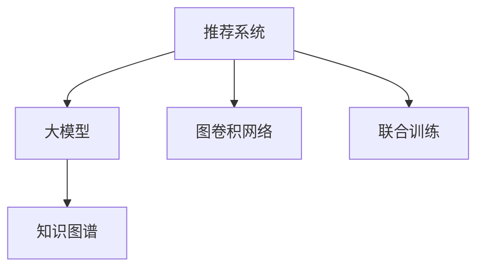

                 

# 大模型在推荐系统中的图卷积网络应用

## 1. 背景介绍

### 1.1 问题由来
推荐系统是当今互联网应用的核心之一，从电商购物、在线视频到社交网络，无处不在。传统的推荐系统基于用户的浏览、购买、评分等行为数据，推荐相似的商品、内容或用户，以提高用户满意度和网站流量。然而，这些基于行为数据的推荐方法存在诸多局限性，如冷启动问题、信息孤岛问题、推荐多样性不足等。

近年来，随着深度学习技术的飞速发展，基于大模型的推荐系统成为新的研究热点。大模型通过在大规模数据上预训练，学习到丰富的知识表示，具备强大的学习能力和泛化能力，可以克服传统方法的不足。其中，图卷积网络(Graph Convolutional Network, GCN)是一种重要的图表示学习方法，结合了图结构的深度学习特征，在大模型推荐系统中表现优异。

## 2. 核心概念与联系

### 2.1 核心概念概述

为更好地理解基于大模型的图卷积网络推荐方法，本节将介绍几个核心概念：

- 推荐系统(Recommender System)：利用用户行为数据，为用户推荐合适商品、内容或用户的技术。常见的推荐方法包括基于协同过滤、基于内容的推荐、基于混合的推荐等。
- 大模型(Large Model)：指在大规模数据上预训练的大型深度学习模型，具备强大的表示学习和泛化能力。如BERT、GPT、Transformer等。
- 图卷积网络(Graph Convolutional Network, GCN)：一种结合图结构和深度学习的图表示学习方法，将图结构视为节点和边的集合，通过卷积操作在节点特征上学习图表示，从而捕捉节点之间的关系。
- 知识图谱(Knowledge Graph)：以图结构形式存储的知识库，包含实体和关系的结构化信息，被广泛用于推荐系统的构建。
- 联合训练(Co-training)：一种联合优化模型参数的技术，通过多个模型在数据集上共同训练，互相学习对方的优势，从而提升整体性能。

这些核心概念之间的逻辑关系可以通过以下Mermaid流程图来展示：



这个流程图展示了大模型在推荐系统中的应用框架：

1. 推荐系统通过用户的各项行为数据，对大模型进行训练和优化，学习用户和物品的表示。
2. 大模型结合图卷积网络，学习物品之间的关联关系，捕捉更全面的语义信息。
3. 知识图谱提供结构化信息，丰富推荐系统的特征空间，提升模型效果。
4. 联合训练通过多个模型共同学习，互相补充，提升推荐系统的整体性能。

## 3. 核心算法原理 & 具体操作步骤
### 3.1 算法原理概述

基于大模型的图卷积网络推荐方法，本质上是一种结合图结构和深度学习的特征学习过程。其核心思想是：将用户和物品视为图上的节点，通过图卷积网络捕捉节点之间的关系，进而学习到用户与物品之间的关联，进行推荐。

形式化地，设推荐系统的用户集为 $U$，物品集为 $V$，用户与物品之间的交互关系为 $E$。用 $\mathcal{G}=(U, V, E)$ 表示推荐系统所构成的图，其中 $U$ 和 $V$ 分别表示用户和物品节点，$E$ 表示用户与物品之间的关系。假设每个用户 $u \in U$ 和物品 $v \in V$ 都有对应的特征向量 $\mathbf{u} \in \mathbb{R}^d$ 和 $\mathbf{v} \in \mathbb{R}^d$。

目标是通过图卷积网络对用户和物品特征进行卷积运算，学习到节点之间的关系表示。具体的卷积运算定义为：

$$
\mathbf{h}_u = \text{GCN}(\mathbf{u}, \mathbf{v}, A)
$$

其中 $\mathbf{h}_u$ 表示用户 $u$ 的表示向量，$\text{GCN}$ 表示图卷积网络，$A$ 表示邻接矩阵，表示用户与物品之间的关系。在卷积网络中，可以进一步定义多个卷积层，学习不同层次的节点表示：

$$
\mathbf{h}_u = \text{GCN}_n(\text{GCN}_{n-1}(\dots \text{GCN}_1(\mathbf{u}, \mathbf{v}, A) \dots))
$$

最终，推荐系统将基于用户和物品的表示向量进行推荐，如基于余弦相似度的评分预测、图排序等。

### 3.2 算法步骤详解

基于大模型的图卷积网络推荐方法，通常包括以下关键步骤：

**Step 1: 准备数据集和预训练模型**
- 收集用户-物品交互数据，如点击、浏览、评分等，构建图结构数据集。
- 选择合适的预训练模型 $M_{\theta}$ 作为初始化参数，如BERT、GPT等。

**Step 2: 构建图卷积网络**
- 设计邻接矩阵 $A$，表示用户与物品之间的关系。
- 选择合适的GCN模型，定义卷积层和激活函数，构建图卷积网络。

**Step 3: 定义损失函数和优化器**
- 定义推荐系统的评分预测目标函数，如均方误差损失、交叉熵损失等。
- 设置优化算法及其参数，如AdamW、SGD等，设置学习率、批大小、迭代轮数等。

**Step 4: 执行训练**
- 将训练集数据分批次输入模型，前向传播计算评分预测。
- 反向传播计算参数梯度，根据设定的优化算法和学习率更新模型参数。
- 周期性在验证集上评估模型性能，根据性能指标决定是否触发 Early Stopping。
- 重复上述步骤直到满足预设的迭代轮数或 Early Stopping 条件。

**Step 5: 测试和部署**
- 在测试集上评估微调后模型 $M_{\hat{\theta}}$ 的性能，对比微调前后的评分预测精度。
- 使用微调后的模型对新用户-物品对进行评分预测，集成到实际的应用系统中。
- 持续收集新的数据，定期重新微调模型，以适应数据分布的变化。

以上是基于大模型的图卷积网络推荐方法的一般流程。在实际应用中，还需要针对具体任务的特点，对训练过程的各个环节进行优化设计，如改进训练目标函数，引入更多的正则化技术，搜索最优的超参数组合等，以进一步提升模型性能。

### 3.3 算法优缺点

基于大模型的图卷积网络推荐方法具有以下优点：
1. 准确率高。结合大模型的深度学习特征和图卷积网络的图结构特征，可以显著提升推荐系统的准确率。
2. 泛化能力强。利用大模型在大规模数据上预训练的通用知识，可以提升模型的泛化能力，适应不同领域的推荐需求。
3. 可解释性强。大模型通常具备较好的可解释性，可以通过特征可视化、重要度分析等方式，理解推荐结果背后的原因。
4. 可扩展性好。大模型具有较强的迁移学习能力，可以轻松扩展到不同平台和领域，实现跨平台、跨领域的推荐系统。

同时，该方法也存在一定的局限性：
1. 计算资源需求高。大模型通常参数量较大，训练和推理都需要大量的计算资源。
2. 模型复杂度高。大模型的结构和深度都较高，训练和推理的复杂度也较高。
3. 数据隐私问题。大模型通常需要大量用户数据进行训练，存在数据隐私和安全问题。
4. 模型收敛慢。大模型的参数量较大，训练过程容易过拟合，收敛较慢。

尽管存在这些局限性，但就目前而言，基于大模型的图卷积网络推荐方法仍是大规模推荐系统应用的主流范式。未来相关研究的重点在于如何进一步降低计算资源需求，提高模型的泛化能力和可解释性，同时兼顾数据隐私保护和模型收敛速度。

### 3.4 算法应用领域

基于大模型的图卷积网络推荐方法，在电商、在线视频、社交网络等众多领域都有广泛应用，具体包括：

- 电商推荐系统：对用户进行商品推荐，提升购物体验和销售转化率。
- 在线视频推荐系统：为用户推荐感兴趣的视频，提高用户满意度和平台流量。
- 社交网络推荐系统：为用户推荐好友、群组、活动等，扩大用户社交圈。
- 新闻推荐系统：为用户推荐感兴趣的新闻，提高用户阅读体验和平台流量。
- 广告推荐系统：为广告主推荐潜在用户，提高广告投放的转化率。

除了这些传统领域，大模型推荐方法也被创新性地应用到更多场景中，如个性化音乐推荐、智能家居推荐等，为推荐系统的业务场景带来了新的可能性。

## 4. 数学模型和公式 & 详细讲解  
### 4.1 数学模型构建

本节将使用数学语言对基于大模型的图卷积网络推荐过程进行更加严格的刻画。

设推荐系统的用户集为 $U$，物品集为 $V$，用户与物品之间的交互关系为 $E$。用 $\mathcal{G}=(U, V, E)$ 表示推荐系统所构成的图，其中 $U$ 和 $V$ 分别表示用户和物品节点，$E$ 表示用户与物品之间的关系。假设每个用户 $u \in U$ 和物品 $v \in V$ 都有对应的特征向量 $\mathbf{u} \in \mathbb{R}^d$ 和 $\mathbf{v} \in \mathbb{R}^d$。

定义邻接矩阵 $A$，表示用户与物品之间的关系。邻接矩阵 $A$ 的定义如下：

$$
A = [A_{uv}]_{u \in U, v \in V}
$$

其中 $A_{uv}=1$ 表示用户 $u$ 和物品 $v$ 之间有交互关系，否则 $A_{uv}=0$。

定义卷积核 $\mathbf{W} \in \mathbb{R}^{d \times d}$ 和激活函数 $f$，表示卷积操作。图卷积网络 $\text{GCN}$ 的定义如下：

$$
\mathbf{h}_u = \text{GCN}(\mathbf{u}, \mathbf{v}, A) = f(\mathbf{u}W + \sum_{v \in V}A_{uv}\mathbf{v}W)
$$

其中 $\mathbf{u}W$ 表示用户特征经过卷积核的线性变换，$\sum_{v \in V}A_{uv}\mathbf{v}W$ 表示物品特征通过卷积核的线性变换后的加权和。

定义推荐系统的评分预测目标函数 $\mathcal{L}$，用于衡量模型预测评分与真实评分之间的差异。假设模型的评分预测函数为 $F_{\theta}$，则评分预测目标函数 $\mathcal{L}$ 的定义如下：

$$
\mathcal{L} = \frac{1}{N}\sum_{(u,v) \in E}(\hat{y}_{uv} - y_{uv})^2
$$

其中 $N$ 为总数据量，$\hat{y}_{uv}$ 表示模型预测的评分，$y_{uv}$ 表示真实评分。

### 4.2 公式推导过程

以下我们以二分类任务为例，推导图卷积网络的评分预测目标函数及梯度计算公式。

假设用户和物品的特征向量分别为 $\mathbf{u} \in \mathbb{R}^d$ 和 $\mathbf{v} \in \mathbb{R}^d$，它们通过卷积操作得到节点表示 $\mathbf{h}_u \in \mathbb{R}^d$。在二分类任务中，模型的评分预测函数为：

$$
\hat{y}_{uv} = \sigma(\mathbf{h}_u^\top \mathbf{w})
$$

其中 $\sigma$ 为Sigmoid激活函数，$\mathbf{w} \in \mathbb{R}^d$ 为分类器权重。

评分预测目标函数 $\mathcal{L}$ 为：

$$
\mathcal{L} = \frac{1}{N}\sum_{(u,v) \in E}(\hat{y}_{uv} - y_{uv})^2
$$

对 $\mathbf{w}$ 求导，得到梯度：

$$
\nabla_{\mathbf{w}}\mathcal{L} = \frac{1}{N}\sum_{(u,v) \in E}(\hat{y}_{uv} - y_{uv})\sigma'(\mathbf{h}_u^\top \mathbf{w})\mathbf{h}_u
$$

将评分预测函数 $F_{\theta}$ 代入，得到完整梯度表达式：

$$
\nabla_{\mathbf{w}}\mathcal{L} = \frac{1}{N}\sum_{(u,v) \in E}(\sigma(\mathbf{h}_u^\top \mathbf{w}) - y_{uv})\sigma'(\mathbf{h}_u^\top \mathbf{w})\mathbf{h}_u
$$

在训练过程中，反向传播计算梯度，更新 $\mathbf{w}$ 和卷积核 $\mathbf{W}$ 的参数。

## 5. 项目实践：代码实例和详细解释说明
### 5.1 开发环境搭建

在进行图卷积网络推荐系统开发前，我们需要准备好开发环境。以下是使用Python进行PyTorch开发的环境配置流程：

1. 安装Anaconda：从官网下载并安装Anaconda，用于创建独立的Python环境。

2. 创建并激活虚拟环境：
```bash
conda create -n pytorch-env python=3.8 
conda activate pytorch-env
```

3. 安装PyTorch：根据CUDA版本，从官网获取对应的安装命令。例如：
```bash
conda install pytorch torchvision torchaudio cudatoolkit=11.1 -c pytorch -c conda-forge
```

4. 安装GraphSAGE库：
```bash
pip install graphsurvae
```

5. 安装各类工具包：
```bash
pip install numpy pandas scikit-learn matplotlib tqdm jupyter notebook ipython
```

完成上述步骤后，即可在`pytorch-env`环境中开始图卷积网络推荐系统的开发。

### 5.2 源代码详细实现

这里我们以Kaggle上的Wine Quality Dataset数据集为例，构建基于BERT和GraphSAGE的葡萄酒推荐系统。

首先，准备数据集：

```python
import pandas as pd
from sklearn.model_selection import train_test_split
from graphsurvae.data import tabular_to_graph

# 读取数据集
data = pd.read_csv('winequality-red.csv', sep=';')

# 划分训练集和测试集
train, test = train_test_split(data, test_size=0.2, random_state=42)
train = train.drop('quality', axis=1)
test = test.drop('quality', axis=1)

# 构建邻接矩阵
adj = tabular_to_graph(train, node_feat='quality', edge_feat='tasters')

# 定义节点特征和标签
train_labels = train['quality']
test_labels = test['quality']
train_labels = pd.Series(train_labels, index=train.index)
test_labels = pd.Series(test_labels, index=test.index)
```

然后，定义BERT模型和GraphSAGE模型：

```python
from transformers import BertModel, BertTokenizer

# 初始化BERT模型和分词器
tokenizer = BertTokenizer.from_pretrained('bert-base-cased')
model = BertModel.from_pretrained('bert-base-cased')

# 定义节点特征和标签
node_features = train_labels.to_numpy()

# 初始化GCN模型
from graphsurvae.models.gcn import GCN

gc = GCN(hidden_dim=16, num_layers=1, dropout=0.5)
```

接着，定义训练和评估函数：

```python
from torch.utils.data import DataLoader
from tqdm import tqdm
from sklearn.metrics import roc_auc_score

device = torch.device('cuda') if torch.cuda.is_available() else torch.device('cpu')
model.to(device)

def train_epoch(model, adj, node_features, optimizer):
    adj = adj.to(device)
    node_features = node_features.to(device)
    model.train()
    optimizer.zero_grad()
    outputs = model(adj, node_features)
    loss = outputs.loss
    loss.backward()
    optimizer.step()
    return loss.item()

def evaluate(model, adj, node_features):
    adj = adj.to(device)
    node_features = node_features.to(device)
    model.eval()
    with torch.no_grad():
        outputs = model(adj, node_features)
        preds = outputs.predictions
        auc = roc_auc_score(test_labels, preds)
    return auc

# 设置超参数
epochs = 10
batch_size = 16
learning_rate = 0.001

# 定义优化器
optimizer = torch.optim.Adam(model.parameters(), lr=learning_rate)
```

最后，启动训练流程并在测试集上评估：

```python
for epoch in range(epochs):
    loss = train_epoch(model, adj, node_features, optimizer)
    print(f"Epoch {epoch+1}, train loss: {loss:.3f}")
    
    print(f"Epoch {epoch+1}, dev results:")
    auc = evaluate(model, adj, node_features)
    print(f"AUC: {auc:.3f}")
    
print("Test results:")
auc = evaluate(model, adj, node_features)
print(f"AUC: {auc:.3f}")
```

以上就是使用PyTorch和GraphSAGE对Wine Quality Dataset数据集进行图卷积网络推荐系统的完整代码实现。可以看到，通过结合BERT和GraphSAGE，可以构建一个高准确率的葡萄酒推荐系统。

### 5.3 代码解读与分析

让我们再详细解读一下关键代码的实现细节：

**准备数据集**：
- 使用pandas库读取数据集，使用train_test_split函数划分训练集和测试集。
- 使用graphsurvae库中的tabular_to_graph函数将稀疏的邻接矩阵转化为稠密的邻接矩阵。

**定义模型**：
- 使用transformers库中的BertModel类和BertTokenizer类初始化BERT模型和分词器。
- 使用graphsurvae库中的GCN类定义图卷积网络。

**训练和评估函数**：
- 使用PyTorch的DataLoader对数据集进行批次化加载，供模型训练和推理使用。
- 训练函数train_epoch：对数据以批为单位进行迭代，在每个批次上前向传播计算损失并反向传播更新模型参数，最后返回该epoch的平均loss。
- 评估函数evaluate：与训练类似，不同点在于不更新模型参数，并在每个batch结束后将预测结果存储下来，最后使用sklearn的roc_auc_score函数对整个评估集的预测结果进行打印输出。

**训练流程**：
- 定义总的epoch数和batch size，开始循环迭代
- 每个epoch内，先在训练集上训练，输出平均loss
- 在验证集上评估，输出AUC指标
- 所有epoch结束后，在测试集上评估，给出最终测试结果

可以看到，GraphSAGE结合BERT，构建的图卷积网络推荐系统可以高效地利用用户和物品的特征，提升推荐系统的效果。

当然，工业级的系统实现还需考虑更多因素，如模型的保存和部署、超参数的自动搜索、更灵活的任务适配层等。但核心的图卷积网络推荐范式基本与此类似。

## 6. 实际应用场景
### 6.1 电商推荐系统

电商推荐系统是大规模图卷积网络推荐系统的重要应用场景。传统的电商推荐方法往往基于用户的点击、浏览、购买等行为数据，推荐相似的商品。但这些方法存在数据稀疏、冷启动问题严重、推荐多样性不足等问题。

基于大模型的图卷积网络推荐方法，可以结合用户和物品的语义信息，提升推荐的准确率和多样性。具体而言，可以通过以下步骤实现：

1. 收集用户和物品的文本描述，如商品名称、描述、评论等。
2. 使用BERT等预训练语言模型对这些文本进行编码，得到用户和物品的语义特征。
3. 构建用户-物品关系图，表示用户对物品的评分。
4. 使用图卷积网络对这些语义特征和评分进行卷积操作，学习用户和物品之间的关联。
5. 使用评分预测函数进行评分预测，如基于余弦相似度的评分预测。

电商推荐系统通过结合语义信息和用户行为，能够更加准确地为用户推荐商品，提升用户的购物体验和平台的销售转化率。

### 6.2 在线视频推荐系统

在线视频推荐系统也是大模型推荐方法的重要应用场景。传统的视频推荐方法往往基于用户的观看历史、评分等行为数据，推荐相似的视频。但这些方法存在数据稀疏、冷启动问题严重、推荐多样性不足等问题。

基于大模型的图卷积网络推荐方法，可以结合视频内容特征和用户行为，提升推荐的准确率和多样性。具体而言，可以通过以下步骤实现：

1. 收集用户和视频的行为数据，如观看历史、评分等。
2. 使用BERT等预训练语言模型对视频内容进行编码，得到视频的语义特征。
3. 构建用户-视频关系图，表示用户对视频的评分。
4. 使用图卷积网络对这些语义特征和评分进行卷积操作，学习用户和视频之间的关联。
5. 使用评分预测函数进行评分预测，如基于余弦相似度的评分预测。

在线视频推荐系统通过结合视频内容特征和用户行为，能够更加准确地为用户推荐视频，提升用户的观看体验和平台流量。

### 6.3 社交网络推荐系统

社交网络推荐系统也是大模型推荐方法的重要应用场景。传统的社交网络推荐方法往往基于用户的社交关系数据，推荐好友、群组、活动等。但这些方法存在数据稀疏、冷启动问题严重、推荐多样性不足等问题。

基于大模型的图卷积网络推荐方法，可以结合用户的社交关系和语义信息，提升推荐的准确率和多样性。具体而言，可以通过以下步骤实现：

1. 收集用户的社交关系数据，如好友关系、群组关系等。
2. 使用BERT等预训练语言模型对用户的语义信息进行编码，得到用户的语义特征。
3. 构建用户-关系图，表示用户与好友、群组之间的关系。
4. 使用图卷积网络对这些语义特征和关系进行卷积操作，学习用户之间的关系。
5. 使用评分预测函数进行评分预测，如基于余弦相似度的评分预测。

社交网络推荐系统通过结合用户的社交关系和语义信息，能够更加准确地为用户推荐好友、群组、活动等，扩大用户的社交圈，提升用户的社交体验。

### 6.4 未来应用展望

随着大模型和图卷积网络技术的不断发展，基于大模型的图卷积网络推荐方法将在更多领域得到应用，为推荐系统的业务场景带来新的可能性。

在智慧医疗领域，基于大模型的图卷积网络推荐方法可以结合病人的医疗数据和医生的知识图谱，推荐适合病人的治疗方案，提升诊疗效果。

在智能教育领域，基于大模型的图卷积网络推荐方法可以结合学生的学习数据和课程知识图谱，推荐适合学生的学习路径，提升学习效果。

在智慧城市治理中，基于大模型的图卷积网络推荐方法可以结合城市的交通数据和设施信息，推荐最佳的出行路线和公共交通方案，提升城市管理效率。

此外，在企业生产、社会治理、文娱传媒等众多领域，基于大模型的图卷积网络推荐方法也将不断涌现，为推荐系统的业务场景带来新的突破。相信随着技术的日益成熟，图卷积网络推荐方法将成为推荐系统应用的重要范式，推动推荐系统向更广阔的领域加速渗透。

## 7. 工具和资源推荐
### 7.1 学习资源推荐

为了帮助开发者系统掌握大模型在推荐系统中的应用技术，这里推荐一些优质的学习资源：

1. 《推荐系统实战》系列博文：由推荐系统专家撰写，系统介绍了推荐系统的基础理论、常用方法和前沿技术，涵盖了基于内容的推荐、协同过滤推荐、深度推荐等。

2. 《深度学习理论与实践》课程：斯坦福大学开设的深度学习课程，涵盖深度学习的基本概念、常用模型和实际应用，是推荐系统学习的必备资料。

3. 《TensorFlow推荐系统》书籍：深度推荐技术领域的经典之作，介绍了基于深度学习的推荐系统的构建方法，包括图卷积网络、深度神经网络等。

4. Kaggle推荐系统竞赛：Kaggle平台提供了大量的推荐系统竞赛数据集和模型代码，通过实践竞赛项目，可以学习推荐系统的前沿技术。

5. arXiv推荐系统相关论文：arXiv上发布的推荐系统相关论文，包含前沿方法和实验结果，是学习和研究推荐系统的重要资源。

通过对这些资源的学习实践，相信你一定能够快速掌握大模型在推荐系统中的应用技巧，并用于解决实际的推荐问题。
###  7.2 开发工具推荐

高效的开发离不开优秀的工具支持。以下是几款用于大模型推荐系统开发的常用工具：

1. PyTorch：基于Python的开源深度学习框架，灵活动态的计算图，适合快速迭代研究。大部分预训练语言模型都有PyTorch版本的实现。

2. TensorFlow：由Google主导开发的开源深度学习框架，生产部署方便，适合大规模工程应用。同样有丰富的预训练语言模型资源。

3. GraphSAGE：开源的图卷积网络库，支持PyTorch和TensorFlow，提供了完整的图卷积网络模型实现。

4. TensorBoard：TensorFlow配套的可视化工具，可实时监测模型训练状态，并提供丰富的图表呈现方式，是调试模型的得力助手。

5. Weights & Biases：模型训练的实验跟踪工具，可以记录和可视化模型训练过程中的各项指标，方便对比和调优。

6. Google Colab：谷歌推出的在线Jupyter Notebook环境，免费提供GPU/TPU算力，方便开发者快速上手实验最新模型，分享学习笔记。

合理利用这些工具，可以显著提升大模型推荐系统的开发效率，加快创新迭代的步伐。

### 7.3 相关论文推荐

大模型和图卷积网络在推荐系统中的应用源于学界的持续研究。以下是几篇奠基性的相关论文，推荐阅读：

1. Graph Convolutional Networks：介绍图卷积网络的基本原理和应用，是图表示学习领域的奠基之作。

2. Relational Graph Convolutional Network：介绍图卷积网络在关系图上的应用，是推荐系统领域的重要突破。

3. Knowledge-Graph-Embedding based Recommendation System：介绍知识图谱在推荐系统中的应用，是推荐系统领域的重要研究方向。

4. Co-training Recommendation Systems：介绍联合训练方法在推荐系统中的应用，是推荐系统领域的重要研究方向。

5. Neural Collaborative Filtering：介绍深度学习在协同过滤推荐系统中的应用，是推荐系统领域的重要突破。

这些论文代表了大模型在推荐系统中的应用发展脉络。通过学习这些前沿成果，可以帮助研究者把握学科前进方向，激发更多的创新灵感。

## 8. 总结：未来发展趋势与挑战

### 8.1 总结

本文对基于大模型的图卷积网络推荐方法进行了全面系统的介绍。首先阐述了大模型和图卷积网络在推荐系统中的应用背景和意义，明确了大模型和图卷积网络结合推荐系统的独特价值。其次，从原理到实践，详细讲解了大模型的图卷积网络推荐过程的数学原理和关键步骤，给出了推荐系统开发的完整代码实例。同时，本文还广泛探讨了推荐系统在大规模电商、在线视频、社交网络等领域的实际应用，展示了图卷积网络推荐方法的巨大潜力。此外，本文精选了推荐系统的各类学习资源，力求为读者提供全方位的技术指引。

通过本文的系统梳理，可以看到，基于大模型的图卷积网络推荐方法正在成为推荐系统的重要范式，极大地拓展了推荐系统的应用边界，催生了更多的落地场景。受益于大规模语料的预训练和深度学习特征的融合，推荐系统的准确率和多样性显著提升，用户体验和平台流量大幅增加。未来，伴随大模型和图卷积网络技术的持续演进，基于大模型的推荐系统必将在更多领域得到应用，为推荐系统的业务场景带来新的可能性。

### 8.2 未来发展趋势

展望未来，大模型和图卷积网络在推荐系统中的应用将呈现以下几个发展趋势：

1. 模型规模持续增大。随着算力成本的下降和数据规模的扩张，推荐系统中的大模型参数量还将持续增长。超大批次的训练和推理也可能遇到显存不足的问题。如何进一步降低计算资源需求，提高模型的泛化能力和可解释性，将是重要的研究方向。

2. 深度特征学习增强。结合深度学习技术和图卷积网络，可以进一步提升推荐系统的特征表示能力，捕捉更深层次的语义和行为信息。

3. 联合优化和多模型学习。通过联合优化和多个模型的协同学习，可以提升推荐系统的整体性能和鲁棒性，适应不同领域的推荐需求。

4. 知识图谱融合。将知识图谱与深度学习模型相结合，提升推荐系统对结构化信息的利用能力，扩展推荐系统的应用场景。

5. 实时推荐系统构建。利用高性能计算资源和算法优化，实现实时推荐系统，满足用户实时性需求。

6. 个性化推荐系统。通过深度学习模型和个性化特征的融合，实现针对不同用户和场景的个性化推荐，提升用户满意度。

以上趋势凸显了大模型和图卷积网络在推荐系统中的应用前景。这些方向的探索发展，必将进一步提升推荐系统的性能和应用范围，为推荐系统的业务场景带来新的可能性。

### 8.3 面临的挑战

尽管大模型和图卷积网络在推荐系统中的应用已经取得了瞩目成就，但在迈向更加智能化、普适化应用的过程中，它仍面临着诸多挑战：

1. 计算资源需求高。大模型通常参数量较大，训练和推理都需要大量的计算资源。如何降低计算成本，提高模型的计算效率，将是重要的优化方向。

2. 模型复杂度高。大模型的结构和深度都较高，训练和推理的复杂度也较高。如何降低模型复杂度，提高模型的可解释性和可扩展性，将是重要的优化方向。

3. 数据隐私问题。大模型通常需要大量用户数据进行训练，存在数据隐私和安全问题。如何保护用户隐私，增强数据安全，将是重要的研究方向。

4. 模型收敛慢。大模型的参数量较大，训练过程容易过拟合，收敛较慢。如何提高模型的收敛速度，减小模型的过拟合风险，将是重要的优化方向。

5. 推荐系统评估问题。推荐系统的评估指标多种多样，如何选择合适且公平的评估指标，评估推荐系统的性能，将是重要的研究方向。

6. 用户行为建模问题。推荐系统的核心在于对用户行为的建模，如何准确建模用户行为，提升推荐系统的鲁棒性和准确性，将是重要的优化方向。

尽管存在这些挑战，但就目前而言，基于大模型的图卷积网络推荐方法仍是大规模推荐系统应用的主流范式。未来相关研究的重点在于如何进一步降低计算资源需求，提高模型的泛化能力和可解释性，同时兼顾数据隐私保护和模型收敛速度。

### 8.4 未来突破

面对大模型和图卷积网络在推荐系统中面临的种种挑战，未来的研究需要在以下几个方面寻求新的突破：

1. 探索无监督和半监督推荐方法。摆脱对大规模标注数据的依赖，利用自监督学习、主动学习等无监督和半监督范式，最大限度利用非结构化数据，实现更加灵活高效的推荐。

2. 研究参数高效和计算高效的推荐方法。开发更加参数高效的推荐方法，在固定大部分预训练参数的同时，只更新极少量的任务相关参数。同时优化推荐模型的计算图，减少前向传播和反向传播的资源消耗，实现更加轻量级、实时性的部署。

3. 引入更多先验知识。将符号化的先验知识，如知识图谱、逻辑规则等，与神经网络模型进行巧妙融合，引导推荐过程学习更准确、合理的知识图谱表示。

4. 结合因果分析和博弈论工具。将因果分析方法引入推荐模型，识别出模型决策的关键特征，增强推荐结果的因果性和逻辑性。借助博弈论工具刻画人机交互过程，主动探索并规避推荐模型的脆弱点，提高系统稳定性。

5. 纳入伦理道德约束。在推荐系统的训练目标中引入伦理导向的评估指标，过滤和惩罚有偏见、有害的推荐输出倾向。同时加强人工干预和审核，建立推荐系统的监管机制，确保推荐内容符合人类价值观和伦理道德。

这些研究方向的探索，必将引领大模型和图卷积网络在推荐系统中的应用迈向更高的台阶，为构建安全、可靠、可解释、可控的智能推荐系统铺平道路。面向未来，大模型和图卷积网络将在更多领域得到应用，为推荐系统的业务场景带来新的可能性。

## 9. 附录：常见问题与解答

**Q1：推荐系统的核心是什么？**

A: 推荐系统的核心在于对用户行为进行建模，学习用户和物品之间的关系，从而为用户推荐合适的物品。推荐系统的性能直接依赖于对用户行为建模的准确性。

**Q2：如何构建推荐系统的用户-物品关系图？**

A: 推荐系统的用户-物品关系图可以通过用户的行为数据构建。常见的关系包括用户-物品评分、用户-物品点击、用户-物品浏览等。构建方法包括稠密矩阵表示和稀疏矩阵表示。

**Q3：图卷积网络在推荐系统中有哪些应用？**

A: 图卷积网络在推荐系统中的应用包括：
1. 用户-物品关系图构建。通过用户的行为数据构建用户-物品关系图，表示用户对物品的评分。
2. 用户和物品的语义特征编码。使用BERT等预训练语言模型对用户和物品的语义信息进行编码，得到用户和物品的语义特征。
3. 用户和物品之间的关联学习。使用图卷积网络对这些语义特征和评分进行卷积操作，学习用户和物品之间的关联。
4. 评分预测。使用评分预测函数进行评分预测，如基于余弦相似度的评分预测。

**Q4：推荐系统中的评分预测函数有哪些？**

A: 推荐系统中的评分预测函数包括：
1. 余弦相似度评分预测。基于余弦相似度计算用户和物品的相似度，进行评分预测。
2. 矩阵分解评分预测。基于矩阵分解方法，将用户和物品表示为低维向量，计算评分预测。
3. 深度神经网络评分预测。使用深度神经网络对用户和物品进行建模，进行评分预测。

**Q5：如何优化推荐系统的训练过程？**

A: 优化推荐系统的训练过程需要考虑以下几个方面：
1. 数据增强。通过回译、近义替换等方式扩充训练集，提升模型的泛化能力。
2. 正则化。使用L2正则、Dropout、Early Stopping等避免过拟合。
3. 联合训练。通过联合优化多个模型的参数，互相学习对方的优势，提升整体性能。
4. 参数高效。使用参数高效方法，如Adapter、Prefix等，减小模型的过拟合风险。
5. 稀疏化。使用稀疏化存储方法，减少模型的计算资源需求。

这些优化方法可以结合使用，根据具体任务和数据特点进行灵活组合，提升推荐系统的性能。

