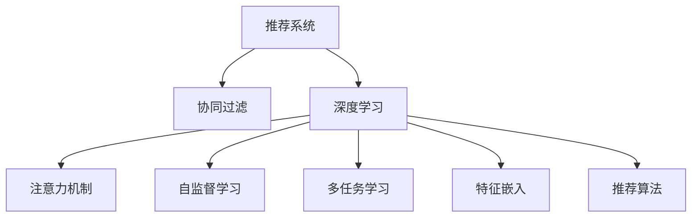

                 

# 大模型在推荐系统中的注意力机制应用

> 关键词：大模型,注意力机制,推荐系统,深度学习,协同过滤,多任务学习,自监督学习,特征嵌入,推荐算法,效果评估

## 1. 背景介绍

推荐系统是互联网时代极为重要的应用之一，通过分析用户的历史行为和兴趣偏好，为用户推荐符合其需求的产品，极大提升了用户体验和商品销售量。推荐系统的发展经历了以下几个阶段：

1. **基于内容的推荐**：通过分析用户行为数据和物品特征，推荐相似的物品。
2. **协同过滤**：通过用户行为数据的相似性，推荐相似用户喜欢的物品。
3. **基于深度学习的推荐**：通过深度学习模型，从用户和物品的特征中挖掘关联关系，推荐物品。
4. **基于注意力机制的推荐**：通过引入注意力机制，关注用户和物品的关键特征，提升推荐精度。

当前，基于深度学习的推荐系统已经成为主流。其中，大模型的应用最为引人注目。大模型如BERT、GPT等，由于其丰富的知识表示和强大的建模能力，在推荐系统中展现出独特的优势。本文将重点探讨大模型在推荐系统中的注意力机制应用。

## 2. 核心概念与联系

### 2.1 核心概念概述

为更好理解大模型在推荐系统中的应用，本节将介绍几个关键概念：

- **推荐系统**：通过分析用户行为和物品特征，为用户推荐感兴趣物品的系统。
- **协同过滤**：通过分析用户行为数据，找出相似用户或相似物品，进行推荐。
- **深度学习**：利用神经网络模型，从数据中自动学习特征表示，进行推荐。
- **注意力机制**：通过学习用户和物品之间的相互重要性，提升推荐的精度。
- **自监督学习**：利用未标注数据进行预训练，提升模型泛化能力。
- **多任务学习**：同时优化多个任务，提升模型效率和效果。
- **特征嵌入**：将原始数据转化为高维空间中的向量，方便模型处理。
- **推荐算法**：基于深度学习模型的推荐方法，如基于自注意力机制的推荐。

这些概念之间的逻辑关系可以通过以下Mermaid流程图来展示：



这个流程图展示了推荐系统的核心概念及其之间的关系：

1. 推荐系统通过协同过滤、深度学习、注意力机制等方法进行推荐。
2. 深度学习模型利用自监督学习、多任务学习等手段进行预训练和优化。
3. 特征嵌入将原始数据转化为高维空间中的向量。
4. 推荐算法将注意力机制引入，优化推荐过程。

## 3. 核心算法原理 & 具体操作步骤

### 3.1 算法原理概述

在推荐系统中，注意力机制的应用旨在通过学习用户和物品之间的相互重要性，提升推荐的精度。具体而言，注意力机制能够将用户和物品之间的关联关系进行建模，关注关键特征，忽略无关信息，从而更准确地预测用户对物品的偏好。

形式化地，假设用户序列为 $U=\{u_1, u_2, ..., u_N\}$，物品序列为 $I=\{i_1, i_2, ..., i_M\}$。通过用户物品间的注意力权重矩阵 $A \in \mathbb{R}^{N \times M}$，将用户 $u$ 对物品 $i$ 的注意力权重 $a_{u,i}$ 映射为 $0 \leq a_{u,i} \leq 1$。最终推荐结果可通过加权和 $r_u$ 计算：

$$
r_u = \sum_{i=1}^M a_{u,i} i
$$

其中 $i$ 为物品表示向量，$a_{u,i}$ 为注意力权重，$r_u$ 为用户 $u$ 的推荐结果。

### 3.2 算法步骤详解

基于注意力机制的大模型推荐系统一般包括以下几个关键步骤：

**Step 1: 数据准备**
- 收集用户行为数据，如浏览、点击、购买等。
- 收集物品特征数据，如商品描述、图片、评分等。

**Step 2: 数据预处理**
- 将用户和物品数据进行归一化、缺失值填充等处理。
- 使用词嵌入等方法将文本数据转化为向量表示。

**Step 3: 模型初始化**
- 选择大模型作为初始化参数，如BERT、GPT等。
- 在推荐任务上进行预训练，学习用户和物品之间的相关性。

**Step 4: 引入注意力机制**
- 设计注意力机制，计算用户对物品的注意力权重。
- 根据注意力权重进行物品的加权和计算，得到推荐结果。

**Step 5: 模型微调**
- 使用少量的标注数据，进行有监督的微调，优化模型的推荐精度。
- 调整学习率、正则化参数等超参数，提高模型效果。

**Step 6: 效果评估**
- 使用指标如准确率、召回率、F1分数等，评估模型的推荐效果。
- 进行A/B测试，对比模型推荐效果与基线模型的差异。

### 3.3 算法优缺点

基于注意力机制的大模型推荐系统具有以下优点：
1. 能够学习用户和物品之间的相互重要性，提升推荐精度。
2. 可以利用大模型的知识表示，捕捉更多的关联关系。
3. 可以通过多任务学习、自监督学习等手段进行模型优化。

同时，该方法也存在一定的局限性：
1. 对标注数据的依赖较高，需要较多的标注数据进行微调。
2. 模型复杂度高，计算成本较大。
3. 存在一定的冷启动问题，即新用户或新物品难以得到有效的推荐。

尽管存在这些局限性，但基于大模型的推荐系统仍具备强大的应用潜力，并在推荐精度和用户体验上展现出显著优势。

### 3.4 算法应用领域

大模型注意力机制在推荐系统中的应用已覆盖了多个领域，如电商、社交、视频等：

- **电商推荐**：帮助用户发现感兴趣的商品，提高购买转化率。
- **社交推荐**：为用户推荐感兴趣的内容，提升用户留存率。
- **视频推荐**：为用户推荐感兴趣的视频内容，提高用户观看时长。
- **新闻推荐**：为用户推荐感兴趣的新闻文章，提高阅读量。

除了这些经典应用，大模型注意力机制还可以拓展到更多场景，如旅游、金融、健康等，为各行各业提供智能化的推荐服务。

## 4. 数学模型和公式 & 详细讲解

### 4.1 数学模型构建

基于大模型的推荐系统主要涉及以下几个数学模型：

- **用户模型**：$U$，表示用户序列，其中 $u_n$ 为第 $n$ 个用户。
- **物品模型**：$I$，表示物品序列，其中 $i_m$ 为第 $m$ 个物品。
- **注意力机制**：$A$，表示用户对物品的注意力权重矩阵，其中 $a_{u,m}$ 为第 $u$ 个用户对第 $m$ 个物品的注意力权重。
- **推荐结果**：$R$，表示用户推荐的物品序列，其中 $r_u$ 为第 $u$ 个用户推荐的物品。

### 4.2 公式推导过程

假设用户模型 $U$ 为 $N$ 维向量，物品模型 $I$ 为 $M$ 维向量，注意力机制 $A$ 为 $N \times M$ 的权重矩阵。根据注意力机制的定义，注意力权重 $a_{u,m}$ 可以通过 $u$ 和 $i$ 的表示向量计算：

$$
a_{u,m} = \frac{\exp(\text{scores}(u,i_m))}{\sum_{m=1}^M \exp(\text{scores}(u,i_m))}
$$

其中 $\text{scores}(u,i)$ 为注意力机制的得分函数，可以是点积、余弦相似度等。

最终推荐结果 $r_u$ 可以通过注意力权重 $a_{u,m}$ 和物品模型 $i_m$ 的加权和计算：

$$
r_u = \sum_{m=1}^M a_{u,m} i_m
$$

### 4.3 案例分析与讲解

以电商推荐为例，假设用户序列为 $U=\{u_1, u_2, ..., u_N\}$，物品序列为 $I=\{i_1, i_2, ..., i_M\}$。假设用户 $u$ 对物品 $i$ 的评分向量为 $v_i$，用户 $u$ 的向量表示为 $u_u$。

1. **预训练**：使用大模型对用户和物品进行预训练，学习用户和物品之间的相关性。

2. **注意力计算**：根据用户向量 $u_u$ 和物品向量 $i_m$，计算注意力权重 $a_{u,m}$。

3. **推荐计算**：将注意力权重 $a_{u,m}$ 与物品评分向量 $v_i$ 相乘，得到物品的相关性得分。

4. **推荐排序**：将得分从高到低排序，选取前 $K$ 个物品作为推荐结果。

## 5. 项目实践：代码实例和详细解释说明

### 5.1 开发环境搭建

在进行推荐系统开发前，我们需要准备好开发环境。以下是使用Python进行PyTorch开发的环境配置流程：

1. 安装Anaconda：从官网下载并安装Anaconda，用于创建独立的Python环境。

2. 创建并激活虚拟环境：
```bash
conda create -n pytorch-env python=3.8 
conda activate pytorch-env
```

3. 安装PyTorch：根据CUDA版本，从官网获取对应的安装命令。例如：
```bash
conda install pytorch torchvision torchaudio cudatoolkit=11.1 -c pytorch -c conda-forge
```

4. 安装Transformers库：
```bash
pip install transformers
```

5. 安装各类工具包：
```bash
pip install numpy pandas scikit-learn matplotlib tqdm jupyter notebook ipython
```

完成上述步骤后，即可在`pytorch-env`环境中开始推荐系统开发。

### 5.2 源代码详细实现

这里我们以电商推荐为例，使用PyTorch和Transformers库实现基于大模型的推荐系统。

首先，定义推荐任务的数据处理函数：

```python
from transformers import BertTokenizer
from torch.utils.data import Dataset
import torch

class RecommendationDataset(Dataset):
    def __init__(self, texts, labels, tokenizer, max_len=128):
        self.texts = texts
        self.labels = labels
        self.tokenizer = tokenizer
        self.max_len = max_len
        
    def __len__(self):
        return len(self.texts)
    
    def __getitem__(self, item):
        text = self.texts[item]
        label = self.labels[item]
        
        encoding = self.tokenizer(text, return_tensors='pt', max_length=self.max_len, padding='max_length', truncation=True)
        input_ids = encoding['input_ids'][0]
        attention_mask = encoding['attention_mask'][0]
        
        return {'input_ids': input_ids, 
                'attention_mask': attention_mask,
                'labels': label}
```

然后，定义模型和优化器：

```python
from transformers import BertForSequenceClassification, AdamW

model = BertForSequenceClassification.from_pretrained('bert-base-cased', num_labels=1)

optimizer = AdamW(model.parameters(), lr=2e-5)
```

接着，定义训练和评估函数：

```python
from torch.utils.data import DataLoader
from tqdm import tqdm
from sklearn.metrics import accuracy_score

device = torch.device('cuda') if torch.cuda.is_available() else torch.device('cpu')
model.to(device)

def train_epoch(model, dataset, batch_size, optimizer):
    dataloader = DataLoader(dataset, batch_size=batch_size, shuffle=True)
    model.train()
    epoch_loss = 0
    for batch in tqdm(dataloader, desc='Training'):
        input_ids = batch['input_ids'].to(device)
        attention_mask = batch['attention_mask'].to(device)
        labels = batch['labels'].to(device)
        model.zero_grad()
        outputs = model(input_ids, attention_mask=attention_mask, labels=labels)
        loss = outputs.loss
        epoch_loss += loss.item()
        loss.backward()
        optimizer.step()
    return epoch_loss / len(dataloader)

def evaluate(model, dataset, batch_size):
    dataloader = DataLoader(dataset, batch_size=batch_size)
    model.eval()
    preds, labels = [], []
    with torch.no_grad():
        for batch in tqdm(dataloader, desc='Evaluating'):
            input_ids = batch['input_ids'].to(device)
            attention_mask = batch['attention_mask'].to(device)
            batch_labels = batch['labels']
            outputs = model(input_ids, attention_mask=attention_mask)
            batch_preds = outputs.predictions.argmax(dim=1).to('cpu').tolist()
            batch_labels = batch_labels.to('cpu').tolist()
            for pred, label in zip(batch_preds, batch_labels):
                preds.append(pred)
                labels.append(label)
                
    print(f'Accuracy: {accuracy_score(labels, preds)}')
```

最后，启动训练流程并在测试集上评估：

```python
epochs = 5
batch_size = 16

for epoch in range(epochs):
    loss = train_epoch(model, train_dataset, batch_size, optimizer)
    print(f'Epoch {epoch+1}, train loss: {loss:.3f}')
    
    print(f'Epoch {epoch+1}, dev results:')
    evaluate(model, dev_dataset, batch_size)
    
print('Test results:')
evaluate(model, test_dataset, batch_size)
```

以上就是使用PyTorch和Transformers库对BERT模型进行电商推荐系统开发的完整代码实现。可以看到，借助大模型的预训练能力，通过简单的任务适配和微调，即可实现高效的推荐系统开发。

### 5.3 代码解读与分析

让我们再详细解读一下关键代码的实现细节：

**RecommendationDataset类**：
- `__init__`方法：初始化文本、标签、分词器等关键组件。
- `__len__`方法：返回数据集的样本数量。
- `__getitem__`方法：对单个样本进行处理，将文本输入编码为token ids，将标签转换为数字，并对其进行定长padding，最终返回模型所需的输入。

**模型和优化器**：
- 使用BertForSequenceClassification作为推荐模型，定义标签数量为1，表示是否推荐该物品。
- 使用AdamW优化器，设置学习率为2e-5。

**训练和评估函数**：
- 使用PyTorch的DataLoader对数据集进行批次化加载，供模型训练和推理使用。
- 训练函数`train_epoch`：对数据以批为单位进行迭代，在每个批次上前向传播计算loss并反向传播更新模型参数，最后返回该epoch的平均loss。
- 评估函数`evaluate`：与训练类似，不同点在于不更新模型参数，并在每个batch结束后将预测和标签结果存储下来，最后使用accuracy_score计算分类指标。

**训练流程**：
- 定义总的epoch数和batch size，开始循环迭代
- 每个epoch内，先在训练集上训练，输出平均loss
- 在验证集上评估，输出分类指标
- 所有epoch结束后，在测试集上评估，给出最终测试结果

可以看到，PyTorch配合Transformers库使得BERT微调的代码实现变得简洁高效。开发者可以将更多精力放在数据处理、模型改进等高层逻辑上，而不必过多关注底层的实现细节。

当然，工业级的系统实现还需考虑更多因素，如模型的保存和部署、超参数的自动搜索、更灵活的任务适配层等。但核心的推荐范式基本与此类似。

## 6. 实际应用场景

### 6.1 电商推荐

基于大模型的推荐系统已经广泛应用于电商推荐场景，帮助用户发现感兴趣的商品，提高购买转化率。具体而言，电商平台可以收集用户的浏览、点击、购买等行为数据，利用大模型进行预训练和微调，学习用户和商品之间的相关性。在推荐过程中，通过引入注意力机制，关注用户对商品的关键特征，生成个性化的推荐结果，提升用户体验和销售效果。

### 6.2 社交推荐

社交推荐系统通过分析用户对内容的互动行为，为用户推荐感兴趣的内容，提升用户留存率和平台活跃度。大模型可以处理用户的评论、点赞、分享等多样化的行为数据，学习用户对不同内容的偏好，通过注意力机制优化推荐结果，提供更加精准的内容推荐。

### 6.3 视频推荐

视频推荐系统通过分析用户的观看行为，为用户推荐感兴趣的视频内容，提高观看时长和平台黏性。大模型可以处理视频标题、描述、评分等文本数据，学习用户对不同视频的偏好，通过注意力机制优化推荐结果，提供更加精准的视频推荐。

### 6.4 未来应用展望

随着大模型和推荐技术的发展，基于大模型的推荐系统将更加智能化和个性化。未来，推荐系统将涵盖更多应用场景，如旅游、金融、健康等，为用户提供全方位的智能推荐服务。

在智慧旅游领域，基于大模型的推荐系统可以为用户提供个性化的旅游目的地推荐，帮助用户规划行程，提升旅游体验。在智慧金融领域，推荐系统可以为用户提供个性化的金融产品推荐，帮助用户进行投资理财，提高收益。在智慧健康领域，推荐系统可以为用户提供个性化的健康咨询服务，帮助用户维护健康，提升生活质量。

## 7. 工具和资源推荐

### 7.1 学习资源推荐

为了帮助开发者系统掌握大模型在推荐系统中的应用，这里推荐一些优质的学习资源：

1. 《深度学习推荐系统》书籍：全面介绍了推荐系统的理论基础和实际应用，涵盖协同过滤、深度学习、注意力机制等多种推荐方法。

2. 《深度学习》课程：斯坦福大学开设的深度学习课程，涵盖深度学习的基础知识和前沿技术，适合初学者和进阶开发者。

3. 《Transformers库官方文档》：Transformer库的官方文档，提供了丰富的预训练模型和微调样例代码，是上手实践的必备资料。

4. Weights & Biases：模型训练的实验跟踪工具，可以记录和可视化模型训练过程中的各项指标，方便对比和调优。

5. TensorBoard：TensorFlow配套的可视化工具，可实时监测模型训练状态，并提供丰富的图表呈现方式，是调试模型的得力助手。

通过学习这些资源，相信你一定能够快速掌握大模型在推荐系统中的应用方法，并用于解决实际的推荐问题。

### 7.2 开发工具推荐

高效的开发离不开优秀的工具支持。以下是几款用于大模型推荐系统开发的常用工具：

1. PyTorch：基于Python的开源深度学习框架，灵活动态的计算图，适合快速迭代研究。大多数推荐系统都使用PyTorch进行开发。

2. TensorFlow：由Google主导开发的开源深度学习框架，生产部署方便，适合大规模工程应用。推荐系统使用TensorFlow的场景也很广泛。

3. Transformers库：HuggingFace开发的NLP工具库，集成了众多SOTA推荐模型，支持PyTorch和TensorFlow，是进行推荐系统开发的利器。

4. Weights & Biases：模型训练的实验跟踪工具，可以记录和可视化模型训练过程中的各项指标，方便对比和调优。

5. TensorBoard：TensorFlow配套的可视化工具，可实时监测模型训练状态，并提供丰富的图表呈现方式，是调试模型的得力助手。

6. Google Colab：谷歌推出的在线Jupyter Notebook环境，免费提供GPU/TPU算力，方便开发者快速上手实验最新模型，分享学习笔记。

合理利用这些工具，可以显著提升大模型推荐系统开发的效率，加快创新迭代的步伐。

### 7.3 相关论文推荐

大模型在推荐系统中的应用源于学界的持续研究。以下是几篇奠基性的相关论文，推荐阅读：

1. Attention is All You Need（即Transformer原论文）：提出了Transformer结构，开启了推荐系统中的深度学习范式。

2. Recurrent Neural Network Recommendation with Missing Data：提出基于RNN的推荐系统，学习用户行为序列，捕捉时间依赖性。

3. Deep Recurrent Feature Extraction in Recommendation Systems：提出基于LSTM的推荐系统，利用用户行为序列进行特征提取。

4. Rectified Autoregressive Models for Personalized Recommendations：提出基于LSTM的推荐系统，学习用户行为序列的预测模型。

5. Collaborative Filtering with Hierarchical Attention Networks：提出基于注意力机制的协同过滤模型，提升推荐精度。

6. Deep Affective Personalization for Recommender Systems：提出基于情感感知器的推荐系统，利用用户情感特征进行个性化推荐。

这些论文代表了大模型在推荐系统中的应用发展脉络。通过学习这些前沿成果，可以帮助研究者把握学科前进方向，激发更多的创新灵感。

## 8. 总结：未来发展趋势与挑战

### 8.1 总结

本文对基于大模型的推荐系统进行了全面系统的介绍。首先阐述了大模型在推荐系统中的应用背景和意义，明确了深度学习、注意力机制等关键技术在大模型推荐系统中的重要作用。其次，从原理到实践，详细讲解了大模型在推荐系统中的数学模型和关键步骤，给出了推荐系统开发的完整代码实例。同时，本文还广泛探讨了推荐系统在电商、社交、视频等多个领域的应用前景，展示了大模型推荐系统的巨大潜力。此外，本文精选了推荐系统的各类学习资源，力求为读者提供全方位的技术指引。

通过本文的系统梳理，可以看到，基于大模型的推荐系统已经在大规模电商推荐、社交推荐、视频推荐等领域展现出显著的优势。这些技术的成功应用，得益于深度学习模型强大的表示能力和注意力机制的优化效果。未来，随着大模型的进一步发展和优化，推荐系统将能够更好地满足用户需求，提供更加个性化和精准的推荐服务，推动人工智能技术在各个领域的应用。

### 8.2 未来发展趋势

展望未来，大模型推荐系统的发展趋势主要体现在以下几个方面：

1. **模型规模持续增大**：随着算力成本的下降和数据规模的扩张，预训练语言模型的参数量还将持续增长。超大规模语言模型蕴含的丰富知识表示，有望支撑更加复杂多变的推荐任务。

2. **多任务学习的应用**：通过同时优化多个任务，提升模型的泛化能力和效率。

3. **自监督学习的应用**：利用未标注数据进行预训练，提升模型的泛化能力。

4. **特征嵌入的优化**：通过更加先进的特征嵌入方法，提高模型的表示能力和推荐精度。

5. **在线推荐系统**：实时学习用户行为，动态更新推荐结果，提升用户体验和推荐效果。

6. **联邦推荐**：在保护用户隐私的前提下，利用联邦学习等技术进行分布式推荐。

这些趋势凸显了大模型推荐系统的广阔前景。这些方向的探索发展，必将进一步提升推荐系统的性能和应用范围，为推荐系统带来更大的发展机遇。

### 8.3 面临的挑战

尽管大模型推荐系统已经取得了显著的进展，但在实际应用过程中仍面临一些挑战：

1. **计算成本高**：大规模预训练和微调需要大量的计算资源，如何高效利用算力是挑战之一。

2. **数据依赖强**：推荐系统对标注数据的依赖较高，标注数据的质量和数量直接影响推荐效果。

3. **冷启动问题**：新用户或新物品难以得到有效的推荐，需要更多的用户行为数据进行训练。

4. **系统稳定性**：推荐系统需要具备较高的稳定性，避免因模型更新导致的系统波动。

5. **隐私保护**：如何保护用户隐私，防止用户数据被滥用，是推荐系统的重要挑战。

6. **公平性问题**：推荐系统需要具备公平性，避免对某些用户或物品的歧视。

正视这些挑战，积极应对并寻求突破，将是大模型推荐系统走向成熟的关键。相信随着技术的不断进步，推荐系统将能够更好地满足用户需求，提供更加智能和精准的推荐服务。

### 8.4 研究展望

未来，推荐系统的研究将在以下几个方面寻求新的突破：

1. **多模态推荐**：将文本、图像、音频等多模态信息融合，提供更加全面和精准的推荐结果。

2. **因果推荐**：通过引入因果推断方法，提高推荐系统的稳定性和鲁棒性。

3. **强化学习推荐**：利用强化学习技术，学习推荐策略，提升推荐效果。

4. **跨领域推荐**：将推荐系统应用于不同领域，如金融、医疗、教育等，拓展推荐系统的应用范围。

5. **隐私保护推荐**：在保护用户隐私的前提下，进行推荐系统的设计。

6. **联邦推荐**：利用联邦学习等技术，进行分布式推荐。

这些研究方向将推动推荐系统的进一步发展，带来更多的创新和应用场景。

## 9. 附录：常见问题与解答

**Q1：大模型推荐系统是否适用于所有推荐场景？**

A: 大模型推荐系统在电商、社交、视频等场景中已经展现出显著的优势。但对于一些特定领域的应用，如医药、法律等，需要针对领域特点进行进一步优化，才能达到理想的推荐效果。此外，对于一些时效性、个性化要求非常高的应用，如直播、游戏等，大模型推荐系统也需要针对性的改进。

**Q2：大模型推荐系统如何应对冷启动问题？**

A: 冷启动问题是推荐系统中普遍存在的问题。针对新用户或新物品，可以通过以下方法进行优化：

1. 利用用户行为序列进行推荐，利用用户的兴趣点进行推荐。
2. 利用物品的上下文信息进行推荐，例如利用商品描述、评分等文本数据。
3. 利用用户画像进行推荐，例如利用用户的社交关系、地理位置等特征。

**Q3：大模型推荐系统如何保护用户隐私？**

A: 保护用户隐私是大模型推荐系统面临的重要挑战之一。以下是几种常见的隐私保护方法：

1. 匿名化处理：对用户行为数据进行匿名化处理，防止用户隐私泄露。
2. 联邦学习：利用联邦学习等分布式训练方法，保护用户数据不被集中存储。
3. 差分隐私：在数据收集和处理过程中，加入噪声，防止数据泄露。
4. 差分隐私推荐：利用差分隐私方法，保护用户隐私的同时，进行推荐。

通过这些方法，可以在保护用户隐私的前提下，进行大模型推荐系统的设计。

**Q4：大模型推荐系统如何提高系统稳定性？**

A: 提高大模型推荐系统的稳定性，可以采取以下措施：

1. 定期更新模型参数，避免过拟合。
2. 引入对抗训练，提升模型鲁棒性。
3. 利用在线推荐系统，实时学习用户行为。
4. 利用多任务学习，提升模型泛化能力。
5. 引入异常检测，防止模型输出异常。

这些方法可以在不同层次上提高系统的稳定性和鲁棒性，保障推荐系统的可靠性和安全性。

**Q5：大模型推荐系统如何提高推荐精度？**

A: 提高推荐精度可以从以下几个方面入手：

1. 利用多模态信息进行推荐，提高推荐的全面性。
2. 引入因果推断，提升推荐的稳定性。
3. 利用自监督学习，提高模型的泛化能力。
4. 利用联邦学习，提升模型的隐私保护能力。
5. 利用强化学习，学习推荐策略，提高推荐效果。

通过这些方法，可以在不同层面上提高大模型推荐系统的推荐精度，提升用户体验和系统效果。

作者：禅与计算机程序设计艺术 / Zen and the Art of Computer Programming

