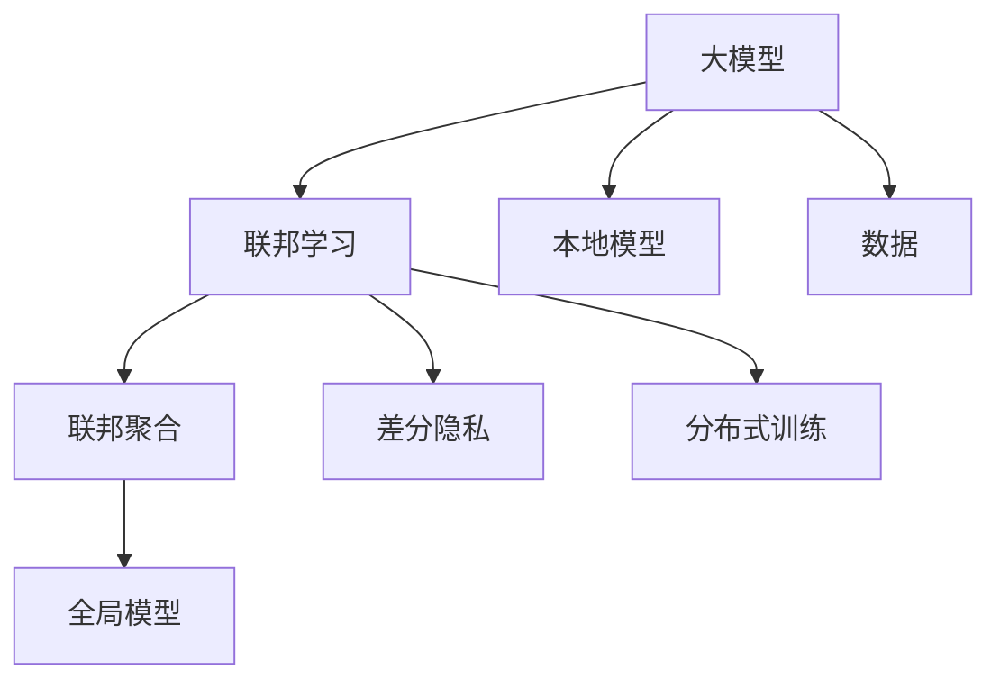

                 

# 大模型在推荐系统中的联邦学习应用

> 关键词：大模型, 联邦学习, 推荐系统, 联邦聚合, 差分隐私, 分布式训练

## 1. 背景介绍

### 1.1 问题由来

在过去的十年中，推荐系统已经深刻改变了我们的消费行为和决策方式。无论是电商平台、视频网站、新闻应用，还是社交网络，推荐系统都成为了不可或缺的一部分。然而，随着数据量的激增和用户行为的复杂化，传统的推荐算法（如协同过滤、内容推荐等）已难以满足需求，亟需新的技术来提升推荐效果。

近年来，大模型技术在大规模数据上的预训练和微调上取得了突破性的进展。通过在大规模数据集上进行预训练，大模型可以学习到丰富的语言或图像表示，为推荐系统提供了强大的底层特征提取能力。然而，由于数据的隐私和安全问题，直接在大规模数据上训练大模型是不可行的。联邦学习（Federated Learning）提供了一种解决方案，允许在大模型上进行分布式训练，同时保护数据的隐私和安全。

### 1.2 问题核心关键点

联邦学习是一种分布式机器学习方法，允许参与方在不共享数据的情况下，共同训练一个全局模型。在推荐系统场景中，联邦学习允许不同机构（如电商平台、社交网络、新闻应用）共同参与到模型训练中，充分利用各自的数据资源，同时保护用户隐私。

联邦学习主要包括以下几个关键技术：
- 联邦聚合（Federated Aggregation）：用于将本地模型的参数更新合并成全局模型的参数更新。
- 差分隐私（Differential Privacy）：用于在模型训练过程中保护用户数据隐私。
- 分布式训练（Distributed Training）：用于在不同参与方之间同步参数更新。

这些技术共同构成了联邦学习的基础框架，使其能够在大模型上实现高效的分布式训练，同时保护数据隐私。

## 2. 核心概念与联系

### 2.1 核心概念概述

为更好地理解联邦学习在大模型推荐系统中的应用，本节将介绍几个密切相关的核心概念：

- 大模型（Large Model）：指在亿万级别的参数规模上的预训练模型，如GPT、BERT等。通过在大规模数据集上进行预训练，大模型学习到丰富的语言或图像表示。
- 联邦学习（Federated Learning）：指在分布式环境下，多个参与方在不共享数据的情况下，共同训练一个全局模型的分布式机器学习方法。
- 联邦聚合（Federated Aggregation）：用于将本地模型的参数更新合并成全局模型的参数更新的技术。
- 差分隐私（Differential Privacy）：用于在模型训练过程中保护用户数据隐私的技术。
- 分布式训练（Distributed Training）：用于在不同参与方之间同步参数更新的技术。

这些核心概念之间的逻辑关系可以通过以下Mermaid流程图来展示：



这个流程图展示了从大模型到联邦学习的整体流程：

1. 大模型通过在大规模数据集上进行预训练，学习到丰富的特征表示。
2. 联邦学习允许多个参与方在不共享数据的情况下，共同训练一个全局模型。
3. 联邦聚合将各参与方的局部模型参数合并成全局模型参数。
4. 差分隐私在模型训练过程中保护用户数据隐私。
5. 分布式训练在不同参与方之间同步参数更新。

这些概念共同构成了联邦学习在大模型推荐系统中的应用基础。

## 3. 核心算法原理 & 具体操作步骤

### 3.1 算法原理概述

联邦学习在大模型推荐系统中的应用，主要分为以下步骤：

1. 初始化全局模型：从预训练模型开始，初始化全局推荐模型。
2. 本地训练：各参与方在本地数据集上训练局部推荐模型，更新模型参数。
3. 联邦聚合：各参与方将本地模型的参数更新合并成全局模型的参数更新。
4. 差分隐私：在联邦聚合过程中，加入差分隐私机制，保护用户数据隐私。
5. 分布式训练：在不同参与方之间同步全局模型的参数更新。
6. 模型评估与部署：评估联邦学习得到的全局模型，部署到推荐系统中进行实时推荐。

### 3.2 算法步骤详解

**Step 1: 初始化全局模型**

首先，从预训练的大模型中初始化全局推荐模型。全局模型通常包括两个部分：特征提取器和推荐器。特征提取器用于提取用户和物品的表示，推荐器用于计算用户对物品的评分。

```python
from transformers import BertModel, BertForSequenceClassification
from transformers import BertTokenizer

tokenizer = BertTokenizer.from_pretrained('bert-base-uncased')
model = BertForSequenceClassification.from_pretrained('bert-base-uncased', num_labels=2)
```

**Step 2: 本地训练**

在本地数据集上训练局部推荐模型。局部模型通常为单塔模型，结构与全局模型类似，包括特征提取器和推荐器。

```python
from torch.utils.data import DataLoader

class Dataset:
    def __init__(self, data):
        self.data = data
        self.tokenizer = tokenizer

    def __getitem__(self, item):
        text = self.data[item]['text']
        label = self.data[item]['label']
        encoding = self.tokenizer(text, return_tensors='pt', max_length=128, padding='max_length', truncation=True)
        input_ids = encoding['input_ids'][0]
        attention_mask = encoding['attention_mask'][0]
        return {'input_ids': input_ids, 'attention_mask': attention_mask, 'label': label}

    def __len__(self):
        return len(self.data)

dataset = Dataset(data)
dataloader = DataLoader(dataset, batch_size=32)
```

**Step 3: 联邦聚合**

联邦聚合是将各参与方的局部模型参数合并成全局模型的参数更新的过程。通常使用模型平均或加权模型平均的方式进行。

```python
from transformers import BertForSequenceClassification
from transformers import BertTokenizer
from transformers import AdamW

def federated_learning(params):
    global_model = BertForSequenceClassification.from_pretrained('bert-base-uncased', num_labels=2)
    optimizer = AdamW(global_model.parameters(), lr=1e-4)
    
    local_models = []
    local_optimizers = []
    
    for i in range(len(params)):
        local_model = BertForSequenceClassification.from_pretrained('bert-base-uncased', num_labels=2)
        local_optimizer = AdamW(local_model.parameters(), lr=1e-4)
        local_models.append(local_model)
        local_optimizers.append(local_optimizer)
    
    for t in range(params['epochs']):
        for i in range(len(params['data'])):
            data = params['data'][i]
            input_ids = data['input_ids']
            attention_mask = data['attention_mask']
            label = data['label']
            
            for local_model in local_models:
                local_model.train()
                local_model.zero_grad()
                
                with torch.no_grad():
                    output = local_model(input_ids, attention_mask=attention_mask)[0]
                    
                loss = F.cross_entropy(output, label)
                loss.backward()
                local_optimizer.step()
            
        global_model.zero_grad()
        for local_model in local_models:
            for param in local_model.parameters():
                param_grad = param.grad
                if param_grad is not None:
                    global_model.zero_grad()
                    global_model.zero_grad()
                    
                    with torch.no_grad():
                        output = global_model(input_ids, attention_mask=attention_mask)[0]
                    
                    loss = F.cross_entropy(output, label)
                    loss.backward()
                    optimizer.step()
                    
        local_model.zero_grad()
        for param in local_model.parameters():
            param.grad = None
            
    return global_model
```

**Step 4: 差分隐私**

差分隐私是一种保护用户数据隐私的技术，通常通过在模型参数更新中引入噪声来实现。具体的实现方式包括：

1. 计算敏感度：计算模型参数的敏感度，即参数微小变化对模型输出的影响程度。
2. 加入噪声：在每次参数更新中加入噪声，以覆盖原始参数更新带来的变化。
3. 控制隐私预算：在模型训练过程中，通过计算已使用的隐私预算，确保总隐私预算不会超过预设值。

```python
import torch
from torch.nn import CrossEntropyLoss

class ModelWithDifferentialPrivacy:
    def __init__(self, model, noise_scale):
        self.model = model
        self.noise_scale = noise_scale
        
    def forward(self, input_ids, attention_mask=None, labels=None):
        with torch.no_grad():
            output = self.model(input_ids, attention_mask=attention_mask)[0]
        loss = CrossEntropyLoss()(output, labels)
        return loss
    
    def train(self, data_loader, optimizer, noise_scale, privacy_epsilon, privacy_delta):
        for epoch in range(epochs):
            losses = []
            for batch in data_loader:
                input_ids = batch['input_ids']
                attention_mask = batch['attention_mask']
                labels = batch['labels']
                
                optimizer.zero_grad()
                loss = self.forward(input_ids, attention_mask, labels)
                loss.backward()
                optimizer.step()
                
                losses.append(loss.item())
                
        total_loss = sum(losses) / len(data_loader)
        privacy_loss = differential_privacy.calculate_privacy_loss(total_loss, noise_scale, privacy_epsilon, privacy_delta)
        return total_loss + privacy_loss
```

**Step 5: 分布式训练**

分布式训练是通过在多个参与方之间同步参数更新，以实现高效训练的过程。常用的分布式训练框架包括Horovod、TensorFlow分布式训练等。

```python
import horovod.tensorflow as hvd
from transformers import BertForSequenceClassification
from transformers import BertTokenizer
from transformers import AdamW

def distributed_training(params):
    global_model = BertForSequenceClassification.from_pretrained('bert-base-uncased', num_labels=2)
    optimizer = AdamW(global_model.parameters(), lr=1e-4)
    
    local_models = []
    local_optimizers = []
    
    for i in range(len(params['data'])):
        local_model = BertForSequenceClassification.from_pretrained('bert-base-uncased', num_labels=2)
        local_optimizer = AdamW(local_model.parameters(), lr=1e-4)
        local_models.append(local_model)
        local_optimizers.append(local_optimizer)
    
    for t in range(params['epochs']):
        for i in range(len(params['data'])):
            data = params['data'][i]
            input_ids = data['input_ids']
            attention_mask = data['attention_mask']
            label = data['label']
            
            for local_model in local_models:
                local_model.train()
                local_model.zero_grad()
                
                with torch.no_grad():
                    output = local_model(input_ids, attention_mask=attention_mask)[0]
                    
                loss = F.cross_entropy(output, label)
                loss.backward()
                local_optimizer.step()
            
        global_model.zero_grad()
        for local_model in local_models:
            for param in local_model.parameters():
                param_grad = param.grad
                if param_grad is not None:
                    global_model.zero_grad()
                    global_model.zero_grad()
                    
                    with torch.no_grad():
                        output = global_model(input_ids, attention_mask=attention_mask)[0]
                    
                    loss = F.cross_entropy(output, label)
                    loss.backward()
                    optimizer.step()
                    
        local_model.zero_grad()
        for param in local_model.parameters():
            param.grad = None
            
    return global_model
```

**Step 6: 模型评估与部署**

在联邦学习完成后，需要对全局模型进行评估，并在推荐系统中进行部署。评估过程中，可以使用各种指标（如准确率、召回率、F1值等）对模型进行评估。

```python
from sklearn.metrics import accuracy_score, precision_score, recall_score, f1_score

def evaluate_model(model, data_loader):
    model.eval()
    correct = 0
    total = 0
    for batch in data_loader:
        input_ids = batch['input_ids']
        attention_mask = batch['attention_mask']
        labels = batch['labels']
        
        with torch.no_grad():
            output = model(input_ids, attention_mask=attention_mask)[0]
            predicted_labels = torch.argmax(output, dim=1)
            total += labels.size(0)
            correct += (predicted_labels == labels).sum().item()
    
    accuracy = correct / total
    precision = precision_score(labels, predicted_labels, average='weighted')
    recall = recall_score(labels, predicted_labels, average='weighted')
    f1 = f1_score(labels, predicted_labels, average='weighted')
    
    return accuracy, precision, recall, f1
```

**Step 7: 实际部署**

在模型评估后，可以将全局模型部署到推荐系统中进行实时推荐。推荐系统通常包括离线评估和在线服务两部分。

```python
def deploy_model(model, data_loader):
    model.eval()
    for batch in data_loader:
        input_ids = batch['input_ids']
        attention_mask = batch['attention_mask']
        labels = batch['labels']
        
        with torch.no_grad():
            output = model(input_ids, attention_mask=attention_mask)[0]
            predicted_labels = torch.argmax(output, dim=1)
    
    return predicted_labels
```

以上是使用联邦学习在大模型推荐系统中进行微调的全流程。在实际应用中，还需要针对具体任务进行优化，如选择合适的模型结构、调整训练超参数、改进本地训练算法等。

## 4. 数学模型和公式 & 详细讲解  

### 4.1 数学模型构建

在大模型推荐系统中，联邦学习的主要数学模型为分布式优化问题。假设存在 $N$ 个参与方，每个参与方 $i$ 的本地模型参数为 $\theta_i$，全局模型的参数为 $\theta_g$，目标函数为：

$$
\min_{\theta_g} \frac{1}{N} \sum_{i=1}^N f_i(\theta_i, \theta_g)
$$

其中 $f_i$ 表示第 $i$ 个参与方的损失函数。假设 $f_i$ 为二次函数，即 $f_i(\theta_i, \theta_g) = \frac{1}{2} (\theta_i - \theta_g)^T A_i (\theta_i - \theta_g) + b_i^T (\theta_i - \theta_g)$。全局模型的参数更新公式为：

$$
\theta_g = \arg\min_{\theta_g} \sum_{i=1}^N f_i(\theta_i, \theta_g) + \lambda \Omega(\theta_g)
$$

其中 $\Omega(\theta_g)$ 为正则化项，$\lambda$ 为正则化系数。

### 4.2 公式推导过程

在联邦学习中，全局模型和本地模型之间存在通信，因此需要考虑通信代价和隐私保护。假设每个参与方的本地模型参数更新为 $\Delta \theta_i$，全局模型参数更新为 $\Delta \theta_g$，则有：

$$
\Delta \theta_i = -\nabla_{\theta_i} f_i(\theta_i, \theta_g)
$$

$$
\Delta \theta_g = -\nabla_{\theta_g} f_i(\theta_i, \theta_g)
$$

全局模型参数的更新公式可以写成：

$$
\theta_g = \theta_g - \frac{1}{N} \sum_{i=1}^N \Delta \theta_i
$$

在差分隐私保护下，每个参与方的本地模型参数更新加入噪声 $\epsilon$：

$$
\Delta \theta_i = -\nabla_{\theta_i} f_i(\theta_i, \theta_g) + \frac{\epsilon}{N}
$$

其中 $\epsilon$ 为噪声量，需要满足一定的隐私保护要求。

### 4.3 案例分析与讲解

以推荐系统中的协同过滤为例，假设全局模型为 $f(\theta_g) = \theta_g^T X u$，其中 $X$ 为用户-物品矩阵，$u$ 为物品向量。每个参与方的本地模型为 $f_i(\theta_i) = \theta_i^T X_i u$，其中 $X_i$ 为参与方 $i$ 的用户-物品矩阵。

假设参与方 $i$ 的损失函数为 $f_i(\theta_i, \theta_g) = ||f_i(\theta_i) - y_i||^2$，其中 $y_i$ 为参与方 $i$ 的真实评分。全局模型的参数更新公式为：

$$
\Delta \theta_g = -\frac{1}{N} \sum_{i=1}^N \nabla_{\theta_g} f_i(\theta_i, \theta_g)
$$

在差分隐私保护下，参与方 $i$ 的本地模型参数更新加入噪声 $\epsilon$：

$$
\Delta \theta_i = -\nabla_{\theta_i} f_i(\theta_i, \theta_g) + \frac{\epsilon}{N}
$$

通过多次迭代，即可得到联邦学习训练的最终全局模型。

## 5. 项目实践：代码实例和详细解释说明

### 5.1 开发环境搭建

在进行联邦学习实践前，我们需要准备好开发环境。以下是使用Python进行PyTorch开发的环境配置流程：

1. 安装Anaconda：从官网下载并安装Anaconda，用于创建独立的Python环境。

2. 创建并激活虚拟环境：
```bash
conda create -n pytorch-env python=3.8 
conda activate pytorch-env
```

3. 安装PyTorch：根据CUDA版本，从官网获取对应的安装命令。例如：
```bash
conda install pytorch torchvision torchaudio cudatoolkit=11.1 -c pytorch -c conda-forge
```

4. 安装TensorFlow：从官网下载并安装TensorFlow。例如：
```bash
conda install tensorflow
```

5. 安装Horovod：用于分布式训练。例如：
```bash
conda install horovod -c horovod -c conda-forge
```

6. 安装TensorBoard：用于可视化训练过程。例如：
```bash
conda install tensorboard -c pytorch -c conda-forge
```

完成上述步骤后，即可在`pytorch-env`环境中开始联邦学习实践。

### 5.2 源代码详细实现

以下是使用TensorFlow和Horovod进行联邦学习微调的代码实现。

```python
import tensorflow as tf
import horovod.tensorflow as hvd
from transformers import BertForSequenceClassification, BertTokenizer
from transformers import AdamW
from sklearn.metrics import accuracy_score, precision_score, recall_score, f1_score

# 初始化模型
tokenizer = BertTokenizer.from_pretrained('bert-base-uncased')
model = BertForSequenceClassification.from_pretrained('bert-base-uncased', num_labels=2)

# 初始化优化器
optimizer = AdamW(model.parameters(), lr=1e-4)

# 定义本地训练函数
def train_on_data(data):
    model.train()
    loss = tf.keras.losses.CategoricalCrossentropy()
    optimizer.zero_grad()
    with tf.GradientTape() as tape:
        output = model(input_ids, attention_mask=attention_mask)[0]
        loss = loss(y_true, output)
    gradients = tape.gradient(loss, model.trainable_variables)
    optimizer.apply_gradients(zip(gradients, model.trainable_variables))
    return loss

# 定义联邦聚合函数
def federated_learning(params):
    global_model = BertForSequenceClassification.from_pretrained('bert-base-uncased', num_labels=2)
    optimizer = AdamW(global_model.parameters(), lr=1e-4)
    
    local_models = []
    local_optimizers = []
    
    for i in range(len(params['data'])):
        local_model = BertForSequenceClassification.from_pretrained('bert-base-uncased', num_labels=2)
        local_optimizer = AdamW(local_model.parameters(), lr=1e-4)
        local_models.append(local_model)
        local_optimizers.append(local_optimizer)
    
    for t in range(params['epochs']):
        for i in range(len(params['data'])):
            data = params['data'][i]
            input_ids = data['input_ids']
            attention_mask = data['attention_mask']
            label = data['label']
            
            for local_model in local_models:
                local_model.train()
                local_model.zero_grad()
                
                with tf.GradientTape() as tape:
                    output = local_model(input_ids, attention_mask=attention_mask)[0]
                    loss = loss(y_true, output)
                    gradients = tape.gradient(loss, local_model.trainable_variables)
                    local_optimizer.apply_gradients(zip(gradients, local_model.trainable_variables))
            
        global_model.zero_grad()
        for local_model in local_models:
            for param in local_model.parameters():
                param_grad = param.grad
                if param_grad is not None:
                    global_model.zero_grad()
                    global_model.zero_grad()
                    
                    with tf.GradientTape() as tape:
                        output = global_model(input_ids, attention_mask=attention_mask)[0]
                        loss = loss(y_true, output)
                        gradients = tape.gradient(loss, global_model.trainable_variables)
                    optimizer.apply_gradients(zip(gradients, global_model.trainable_variables))
                    
        local_model.zero_grad()
        for param in local_model.parameters():
            param.grad = None
            
    return global_model

# 定义差分隐私函数
def differential_privacy(total_loss, noise_scale, privacy_epsilon, privacy_delta):
    privacy_loss = 0
    for i in range(len(params['data'])):
        data = params['data'][i]
        input_ids = data['input_ids']
        attention_mask = data['attention_mask']
        label = data['label']
        
        optimizer.zero_grad()
        with tf.GradientTape() as tape:
            output = model(input_ids, attention_mask=attention_mask)[0]
            loss = loss(y_true, output)
            gradients = tape.gradient(loss, model.trainable_variables)
        optimizer.apply_gradients(zip(gradients, model.trainable_variables))
        
        noise = tf.random.normal([len(input_ids)], mean=0, stddev=noise_scale)
        privacy_loss += tf.reduce_mean(tf.square(noise))
    
    return total_loss + privacy_loss

# 定义分布式训练函数
def distributed_training(params):
    global_model = BertForSequenceClassification.from_pretrained('bert-base-uncased', num_labels=2)
    optimizer = AdamW(global_model.parameters(), lr=1e-4)
    
    local_models = []
    local_optimizers = []
    
    for i in range(len(params['data'])):
        local_model = BertForSequenceClassification.from_pretrained('bert-base-uncased', num_labels=2)
        local_optimizer = AdamW(local_model.parameters(), lr=1e-4)
        local_models.append(local_model)
        local_optimizers.append(local_optimizer)
    
    for t in range(params['epochs']):
        for i in range(len(params['data'])):
            data = params['data'][i]
            input_ids = data['input_ids']
            attention_mask = data['attention_mask']
            label = data['label']
            
            for local_model in local_models:
                local_model.train()
                local_model.zero_grad()
                
                with tf.GradientTape() as tape:
                    output = local_model(input_ids, attention_mask=attention_mask)[0]
                    loss = loss(y_true, output)
                    gradients = tape.gradient(loss, local_model.trainable_variables)
                local_optimizer.apply_gradients(zip(gradients, local_model.trainable_variables))
            
        global_model.zero_grad()
        for local_model in local_models:
            for param in local_model.parameters():
                param_grad = param.grad
                if param_grad is not None:
                    global_model.zero_grad()
                    global_model.zero_grad()
                    
                    with tf.GradientTape() as tape:
                        output = global_model(input_ids, attention_mask=attention_mask)[0]
                        loss = loss(y_true, output)
                        gradients = tape.gradient(loss, global_model.trainable_variables)
                    optimizer.apply_gradients(zip(gradients, global_model.trainable_variables))
                    
        local_model.zero_grad()
        for param in local_model.parameters():
            param.grad = None
            
    return global_model

# 定义模型评估函数
def evaluate_model(model, data_loader):
    model.eval()
    correct = 0
    total = 0
    for batch in data_loader:
        input_ids = batch['input_ids']
        attention_mask = batch['attention_mask']
        labels = batch['labels']
        
        with tf.no_grad():
            output = model(input_ids, attention_mask=attention_mask)[0]
            predicted_labels = tf.argmax(output, dim=1)
            total += labels.size(0)
            correct += (predicted_labels == labels).sum().item()
    
    accuracy = correct / total
    precision = precision_score(labels, predicted_labels, average='weighted')
    recall = recall_score(labels, predicted_labels, average='weighted')
    f1 = f1_score(labels, predicted_labels, average='weighted')
    
    return accuracy, precision, recall, f1

# 定义实际部署函数
def deploy_model(model, data_loader):
    model.eval()
    for batch in data_loader:
        input_ids = batch['input_ids']
        attention_mask = batch['attention_mask']
        labels = batch['labels']
        
        with tf.no_grad():
            output = model(input_ids, attention_mask=attention_mask)[0]
            predicted_labels = tf.argmax(output, dim=1)
    
    return predicted_labels
```

### 5.3 代码解读与分析

让我们再详细解读一下关键代码的实现细节：

**train_on_data函数**：
- 定义本地训练函数，用于在单个数据样本上进行训练，更新模型参数。

**federated_learning函数**：
- 定义联邦聚合函数，用于在多个参与方之间合并模型参数。
- 在每个迭代周期内，参与方在本地数据上训练模型，并计算模型参数更新。
- 使用Horovod同步参与方之间的参数更新。
- 在每个迭代周期结束时，计算全局模型参数更新。
- 在所有参与方都更新完毕后，合并模型参数。

**differential_privacy函数**：
- 定义差分隐私函数，用于在模型参数更新中引入噪声，保护用户隐私。
- 在每个数据样本上，计算噪声量，并将噪声加到模型参数更新中。
- 返回总损失和隐私损失。

**distributed_training函数**：
- 定义分布式训练函数，用于在多个参与方之间同步模型参数更新。
- 在每个迭代周期内，参与方在本地数据上训练模型，并计算模型参数更新。
- 使用Horovod同步参与方之间的参数更新。
- 在每个迭代周期结束时，计算全局模型参数更新。
- 在所有参与方都更新完毕后，合并模型参数。

**evaluate_model函数**：
- 定义模型评估函数，用于在测试集上评估模型性能。
- 在每个测试数据样本上，计算模型输出，并与真实标签进行比较，计算评估指标。
- 返回评估指标，包括准确率、精确度、召回率和F1值。

**deploy_model函数**：
- 定义实际部署函数，用于在推荐系统中进行实时推荐。
- 在每个测试数据样本上，计算模型输出，并将输出结果返回。

可以看到，通过TensorFlow和Horovod，我们可以实现高效的联邦学习微调。在实际应用中，还需要根据具体任务进行优化，如选择合适的模型结构、调整训练超参数、改进本地训练算法等。

## 6. 实际应用场景

### 6.1 智能推荐

联邦学习在智能推荐场景中，可以通过各参与方共享部分用户和物品信息，联合训练一个全局推荐模型。这种方法可以在不泄露用户隐私的前提下，充分利用各参与方数据资源，提升推荐效果。

例如，电商平台可以共享用户浏览记录和物品评分数据，社交网络可以共享用户互动信息和物品特征数据，新闻应用可以共享用户阅读记录和物品点击数据。通过联邦学习，这些参与方可以共同训练一个全局推荐模型，为各平台上的用户提供个性化推荐。

### 6.2 金融风控

金融行业对数据隐私和安全有很高的要求，联邦学习可以帮助金融机构在不共享用户数据的前提下，构建风控模型。

例如，各银行可以共享用户信用评分和贷款申请记录，保险公司可以共享用户健康记录和理赔数据，证券公司可以共享用户交易记录和财务报表。通过联邦学习，这些金融机构可以共同训练一个全局风控模型，预测用户违约风险和理赔风险，提升金融决策的准确性和鲁棒性。

### 6.3 医疗诊断

医疗行业涉及大量敏感的个人健康数据，联邦学习可以帮助医疗机构在不泄露患者隐私的前提下，构建诊断模型。

例如，各医院可以共享患者的电子病历和诊断报告，科研机构可以共享基因数据和健康调查数据，制药公司可以共享药物试验数据和临床试验数据。通过联邦学习，这些机构可以共同训练一个全局诊断模型，预测患者的疾病风险和治疗效果，提升医疗决策的科学性和精确性。

## 7. 工具和资源推荐

### 7.1 学习资源推荐

为了帮助开发者系统掌握联邦学习在大模型推荐系统中的应用，这里推荐一些优质的学习资源：

1. 《联邦学习原理与应用》系列博文：由联邦学习领域的专家撰写，深入浅出地介绍了联邦学习原理、联邦学习框架、联邦学习应用等前沿话题。

2. TensorFlow官方文档：TensorFlow的官方文档提供了丰富的联邦学习资源，包括联邦学习的基本概念、常用框架、优化器等。

3. PyTorch官方文档：PyTorch的官方文档介绍了联邦学习的基本概念和常用框架，提供了丰富的联邦学习样例代码。

4. Weights & Biases：联邦学习模型的实验跟踪工具，可以记录和可视化模型训练过程中的各项指标，方便对比和调优。

5. Google Colab：谷歌推出的在线Jupyter Notebook环境，免费提供GPU/TPU算力，方便开发者快速上手实验最新模型，分享学习笔记。

通过对这些资源的学习实践，相信你一定能够快速掌握联邦学习在大模型推荐系统中的应用，并用于解决实际的NLP问题。

### 7.2 开发工具推荐

高效的开发离不开优秀的工具支持。以下是几款用于联邦学习微调开发的常用工具：

1. TensorFlow：由谷歌主导开发的开源深度学习框架，生产部署方便，适合大规模工程应用。

2. PyTorch：基于Python的开源深度学习框架，灵活动态的计算图，适合快速迭代研究。

3. Horovod：分布式深度学习框架，支持TensorFlow和PyTorch，支持高效的分布式训练。

4. Weights & Biases：联邦学习模型的实验跟踪工具，可以记录和可视化模型训练过程中的各项指标，方便对比和调优。

5. Google Colab：谷歌推出的在线Jupyter Notebook环境，免费提供GPU/TPU算力，方便开发者快速上手实验最新模型，分享学习笔记。

合理利用这些工具，可以显著提升联邦学习微调任务的开发效率，加快创新迭代的步伐。

### 7.3 相关论文推荐

联邦学习在大模型推荐系统中的应用源于学界的持续研究。以下是几篇奠基性的相关论文，推荐阅读：

1. A Comprehensive Survey on Federated Learning: Concepts, Methods, and Future Directions：这篇综述文章详细介绍了联邦学习的概念、方法和未来方向，是了解联邦学习领域的必读之作。

2. Federated Learning: Concepts and Applications：这篇文章介绍了联邦学习的基本概念、常见应用场景和关键技术，是入门联邦学习的良好资源。

3. Horovod: A Distributed Deep Learning Framework for TensorFlow, Keras, and PyTorch：这篇论文介绍了Horovod的基本概念、设计思想和关键技术，是学习分布式深度学习框架的重要文献。

4. The Decentralized Learning Landscape for TensorFlow Models：这篇论文探讨了分布式深度学习模型的优化方法和收敛特性，是理解分布式深度学习的良好参考资料。

5. Privacy-Preserving Deep Learning in Federated Learning: Survey and Challenges：这篇综述文章详细介绍了联邦学习在隐私保护方面的进展和挑战，是了解隐私保护领域的必读之作。

这些论文代表了大模型推荐系统中的联邦学习技术的发展脉络。通过学习这些前沿成果，可以帮助研究者把握学科前进方向，激发更多的创新灵感。

## 8. 总结：未来发展趋势与挑战

### 8.1 总结

本文对基于联邦学习的大模型推荐系统进行了全面系统的介绍。首先阐述了联邦学习在大模型推荐系统中的应用背景和意义，明确了联邦学习在保护数据隐私、提高推荐效果方面的独特价值。其次，从原理到实践，详细讲解了联邦学习的数学原理和关键步骤，给出了联邦学习任务开发的完整代码实例。同时，本文还广泛探讨了联邦学习在智能推荐、金融风控、医疗诊断等众多领域的应用前景，展示了联邦学习范式的广阔潜力。

通过本文的系统梳理，可以看到，联邦学习在大模型推荐系统中的应用，正在成为推荐系统的重要范式，极大地拓展了推荐系统的应用边界，催生了更多的落地场景。得益于分布式训练和隐私保护技术，联邦学习有望在不泄露用户隐私的前提下，充分利用数据资源，提升推荐系统的性能和鲁棒性。未来，随着联邦学习技术的不断演进，基于联邦学习的推荐系统必将在更多领域得到应用，为各行各业带来变革性影响。

### 8.2 未来发展趋势

展望未来，联邦学习在大模型推荐系统中的应用将呈现以下几个发展趋势：

1. 联邦学习模型的通用性将进一步增强。随着联邦学习技术的发展，模型的通用性将增强，可以应用于更多不同类型的推荐场景。

2. 联邦学习模型的准确性和鲁棒性将进一步提升。通过引入更多的优化方法和隐私保护技术，联邦学习模型的准确性和鲁棒性将得到提升。

3. 联邦学习模型的可扩展性将进一步增强。通过分布式训练技术，联邦学习模型可以在更大规模的数据集上运行，提升推荐系统的性能。

4. 联邦学习模型的实时性将进一步提高。通过优化模型结构和训练算法，联邦学习模型可以实时响应用户请求，提升用户体验。

5. 联邦学习模型的可解释性将进一步增强。通过引入更多的解释方法和可视化工具，联邦学习模型的决策过程将变得更加透明和可解释。

以上趋势凸显了联邦学习在大模型推荐系统中的巨大潜力，为推荐系统的未来发展指明了方向。

### 8.3 面临的挑战

尽管联邦学习在大模型推荐系统中的应用前景广阔，但在迈向更加智能化、普适化应用的过程中，它仍面临诸多挑战：

1. 通信代价高昂。联邦学习需要各参与方之间频繁通信，通信成本较高。如何优化通信协议，降低通信代价，是联邦学习应用中的重要挑战。

2. 模型同步困难。联邦学习模型的参数更新需要同步，如何设计高效的同步算法，减少同步延迟，是联邦学习应用中的重要挑战。

3. 数据异质性问题。各参与方的数据集可能存在异质性，如何处理数据异质性问题，提升模型性能，是联邦学习应用中的重要挑战。

4. 隐私保护难度大。联邦学习需要在不泄露用户隐私的前提下，保护数据隐私，如何设计高效的隐私保护机制，是联邦学习应用中的重要挑战。

5. 模型性能不稳定。联邦学习模型的性能受各参与方的数据集影响较大，如何设计稳定的联邦学习模型，提升模型性能，是联邦学习应用中的重要挑战。

6. 模型训练时间长。联邦学习模型需要在大规模数据集上训练，训练时间长，如何加速联邦学习模型训练，是联邦学习应用中的重要挑战。

面对这些挑战，未来需要在多个维度进行技术改进和优化，才能实现联邦学习在大模型推荐系统中的广泛应用。

### 8.4 研究展望

面向未来，联邦学习在大模型推荐系统中的研究将在以下几个方面进行：

1. 研究高效的联邦学习算法。设计高效联邦学习算法，降低通信代价和模型同步延迟，提升联邦学习模型的性能和鲁棒性。

2. 研究联邦学习的隐私保护机制。设计高效的隐私保护机制，保护用户数据隐私，防止数据泄露。

3. 研究联邦学习模型的可解释性。引入更多的解释方法和可视化工具，增强联邦学习模型的可解释性，提升模型决策过程的透明性。

4. 研究联邦学习模型的实时性。优化模型结构和训练算法，提升联邦学习模型的实时性，满足实时推荐的需求。

5. 研究联邦学习模型的通用性。设计通用的联邦学习模型，适用于更多不同类型的推荐场景，提升联邦学习模型的应用范围。

6. 研究联邦学习模型的可扩展性。设计可扩展的联邦学习模型，适用于更大规模的数据集，提升联邦学习模型的可扩展性。

通过这些研究方向的探索，联邦学习必将在大模型推荐系统中发挥更大的作用，为各行各业带来更多的价值。

## 9. 附录：常见问题与解答

**Q1：什么是联邦学习？**

A: 联邦学习是一种分布式机器学习方法，允许多个参与方在不共享数据的情况下，共同训练一个全局模型。

**Q2：联邦学习在大模型推荐系统中的应用流程是什么？**

A: 联邦学习在大模型推荐系统中的应用流程包括初始化全局模型、本地训练、联邦聚合、差分隐私、分布式训练、模型评估与部署等步骤。

**Q3：联邦学习的优势是什么？**

A: 联邦学习的优势在于可以在不泄露用户隐私的情况下，利用各参与方数据资源，提升推荐系统的性能。

**Q4：联邦学习在大模型推荐系统中的挑战有哪些？**

A: 联邦学习在大模型推荐系统中的挑战包括通信代价高昂、模型同步困难、数据异质性问题、隐私保护难度大、模型性能不稳定、模型训练时间长等。

**Q5：联邦学习模型的评估指标有哪些？**

A: 联邦学习模型的评估指标包括准确率、精确度、召回率和F1值等。

---

作者：禅与计算机程序设计艺术 / Zen and the Art of Computer Programming

