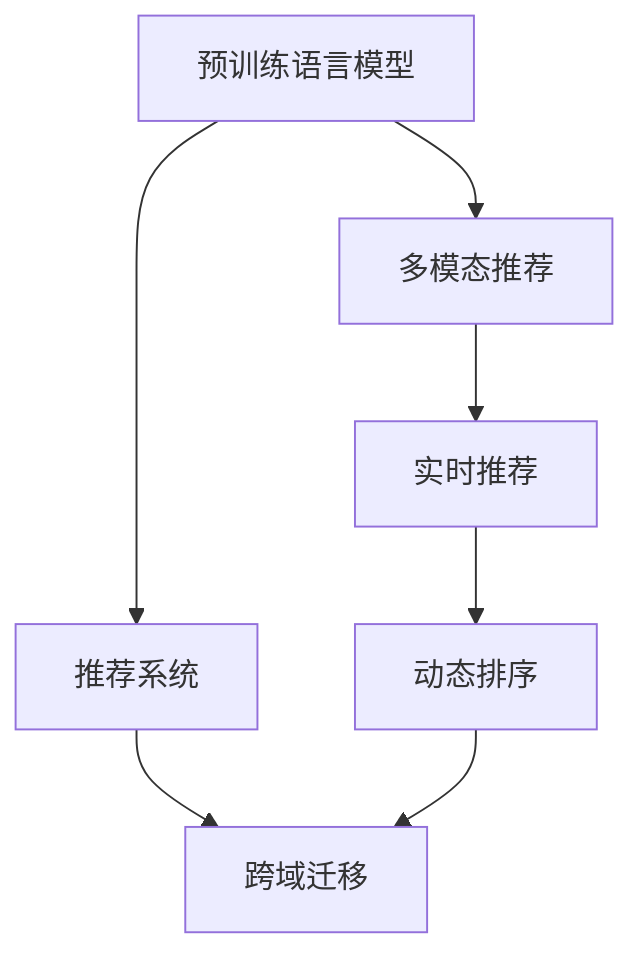

                 

# 大模型在推荐系统多场景适配中的应用

> 关键词：大模型,推荐系统,多场景适配,预训练,微调,自适应,泛化性能,实时推荐,动态排序,跨域迁移

## 1. 背景介绍

### 1.1 问题由来
随着互联网和移动互联网的迅猛发展，推荐系统已成为各大在线平台提供个性化服务、提升用户体验的重要手段。其基本思想是通过分析用户的历史行为和偏好，预测其可能的兴趣点，然后推荐符合用户口味的内容。推荐系统包括内容推荐、商品推荐、广告推荐等多种类型，广泛应用于电商、新闻、社交媒体等场景。

推荐系统中最核心的组件是用户-物品交互矩阵。该矩阵记录了用户与物品之间的交互历史，是推荐算法进行预测的基础。然而，传统推荐系统往往只能处理结构化数据，对于非结构化文本数据、多模态数据等处理能力不足。

随着深度学习技术的成熟，基于深度神经网络模型的推荐系统逐步取代传统协同过滤算法，成为推荐系统的主流架构。在这些模型中，预训练语言模型通过在大规模文本语料上自监督学习，可以自动获取丰富的语言知识和上下文信息，被广泛应用于文本推荐、多模态推荐等多个场景中。

### 1.2 问题核心关键点
预训练语言模型在推荐系统中的应用，本质上是将语言模型作为"特征提取器"，提取文本信息，再通过下游推荐任务微调进行优化。其主要问题包括：

1. 数据特征提取。如何高效提取文本信息特征，并将其转化为推荐模型的输入。
2. 多模态融合。如何在推荐过程中将文本信息与其他模态（如视觉、音频）进行有效融合。
3. 模型泛化性能。如何提高模型在不同领域、不同场景下的泛化能力，避免过拟合。
4. 实时推荐。如何在保证推荐效果的同时，实现快速响应，满足实时性要求。
5. 动态排序。如何实时调整排序权重，优化推荐结果。
6. 跨域迁移。如何实现模型在不同类型的推荐任务之间进行迁移。

这些问题共同构成了大模型在推荐系统中应用的挑战。

### 1.3 问题研究意义
在大规模文本数据的支持下，预训练语言模型可以显著提升推荐系统的推荐精度和个性化程度。但其应用过程中仍面临诸多挑战，如数据特征提取、多模态融合等。解决这些问题，将有助于拓展预训练语言模型的应用范围，提升推荐系统的性能和用户体验。

## 2. 核心概念与联系

### 2.1 核心概念概述

为更好地理解大模型在推荐系统中的多场景适配，本节将介绍几个密切相关的核心概念：

- 预训练语言模型(Pre-trained Language Model, PLM)：指在大规模无标签文本数据上进行自监督预训练的语言模型，如BERT、GPT-3等。通过预训练，模型学习到通用的语言知识和语义理解能力。
- 推荐系统(Recommendation System, RS)：通过预测用户对物品的兴趣，自动为用户推荐合适的商品、新闻、视频等。推荐系统包括协同过滤、基于内容的推荐、混合推荐等类型。
- 多模态推荐(Multi-modal Recommendation)：指融合视觉、音频、文本等多模态信息，提升推荐系统性能的推荐方法。
- 泛化性能(Generalization Performance)：指模型在不同数据集、不同场景下的表现能力。泛化性能强的模型，能在新数据上保持稳定的性能。
- 实时推荐(Real-time Recommendation)：指在用户实时交互过程中，根据最新数据实时调整推荐结果的推荐系统。
- 动态排序(Dynamic Ranking)：指在推荐过程中，根据用户的实时行为和反馈，动态调整物品排序权重，提升推荐效果。
- 跨域迁移(Cross-domain Transfer)：指在多个推荐任务之间，实现模型的迁移和复用，提升模型迁移学习能力。

这些核心概念之间的逻辑关系可以通过以下Mermaid流程图来展示：



这个流程图展示了大模型在推荐系统中的多场景适配过程：

1. 预训练语言模型通过自监督学习提取通用语言知识，作为特征提取器。
2. 通过微调或自适应，将预训练模型适配到不同的推荐任务，如文本推荐、多模态推荐等。
3. 在实时推荐和动态排序中，利用预训练模型的泛化能力和多模态融合能力，提供高效的推荐服务。
4. 通过跨域迁移，提升模型在不同推荐任务之间的复用性和泛化能力。

这些概念共同构成了大模型在推荐系统中的多场景适配框架，使其能够在各种推荐场景中发挥强大优势。

## 3. 核心算法原理 & 具体操作步骤
### 3.1 算法原理概述

基于预训练语言模型的推荐系统，核心思想是利用预训练模型提取文本特征，再进行下游推荐任务的微调或自适应。其主要流程包括：

1. 预训练语言模型的特征提取。
2. 对特征进行微调或自适应，适配到具体的推荐任务。
3. 融合多模态信息，提升推荐效果。
4. 实时调整排序权重，动态优化推荐结果。
5. 通过跨域迁移，提升模型在不同推荐任务之间的泛化能力。

形式化地，假设预训练语言模型为 $M_{\theta}$，其中 $\theta$ 为预训练得到的模型参数。给定推荐系统的输入数据集 $D=\{(x_i, y_i)\}_{i=1}^N, x_i \in \mathcal{X}, y_i \in \mathcal{Y}$，推荐系统的目标是最小化损失函数，使推荐结果逼近真实标签 $y_i$。

### 3.2 算法步骤详解

基于预训练语言模型的推荐系统，一般包括以下几个关键步骤：

**Step 1: 准备预训练模型和数据集**
- 选择合适的预训练语言模型 $M_{\theta}$ 作为特征提取器，如BERT、GPT等。
- 准备推荐系统的输入数据集 $D$，划分为训练集、验证集和测试集。通常推荐数据集包括用户行为数据、物品属性数据、文本描述数据等。

**Step 2: 特征提取与转换**
- 对输入数据进行特征提取和转换，生成适合模型的输入格式。如将文本转化为token序列，将图片转换为特征向量。
- 使用预训练语言模型对文本特征进行提取，生成向量表示。

**Step 3: 微调或自适应**
- 根据推荐任务类型，设计合适的输出层和损失函数。如分类任务使用交叉熵损失，回归任务使用均方误差损失。
- 在预训练模型的基础上，使用推荐数据集进行微调或自适应，优化模型在推荐任务上的性能。
- 设置微调超参数，包括学习率、批大小、迭代轮数等。

**Step 4: 多模态融合**
- 融合文本特征与其他模态信息，如视觉特征、音频特征等，生成多模态融合后的特征向量。
- 使用深度学习模型对多模态特征进行融合，得到最终推荐向量。

**Step 5: 动态排序与推荐**
- 根据排序目标，设计合适的排序函数，如基于排序权重的多目标优化函数。
- 在推荐数据集上训练排序模型，根据用户实时行为和反馈，动态调整排序权重。
- 使用训练好的排序模型对候选物品进行排序，生成推荐结果。

**Step 6: 跨域迁移**
- 在不同类型的推荐任务之间，进行模型迁移。如在文本推荐和商品推荐之间迁移，提升模型在不同场景下的泛化能力。
- 设计通用的推荐模型架构，支持跨域迁移。如使用适配器层(Adapters)适应不同的推荐任务。

### 3.3 算法优缺点

基于预训练语言模型的推荐系统，具有以下优点：
1. 高效特征提取。预训练语言模型通过自监督学习，提取通用语言知识，作为高效的特征提取器。
2. 提升推荐精度。预训练语言模型能够学习到丰富的语言语义信息，显著提升推荐系统的效果。
3. 适应性强。预训练模型具有跨领域泛化能力，能够适应不同类型的推荐任务。
4. 模型可解释性。预训练语言模型是透明的结构，易于理解其内部工作机制和推理逻辑。

但该方法也存在以下局限性：
1. 数据需求量大。推荐系统对标注数据的依赖程度较高，尤其是在新领域或新场景中。
2. 计算成本高。大规模预训练模型的训练和推理资源消耗大，尤其是对于实时推荐系统。
3. 泛化能力有限。预训练模型在特定领域或特定数据集上，可能仍存在泛化性能不足的问题。

尽管存在这些局限性，但就目前而言，基于预训练语言模型的推荐系统仍是推荐系统的主流范式。未来相关研究的重点在于如何进一步降低推荐系统对标注数据的依赖，提高模型的实时推荐能力，优化多模态融合效果，同时兼顾可解释性和计算效率等因素。

### 3.4 算法应用领域

基于预训练语言模型的推荐系统，已在电商推荐、新闻推荐、音乐推荐等多个领域得到广泛应用，提升了用户体验和平台收益。

**电商推荐系统**：通过分析用户浏览、购买历史，推荐相关商品。使用预训练语言模型提取商品描述文本特征，与用户行为数据融合，生成个性化推荐结果。

**新闻推荐系统**：根据用户历史阅读行为，推荐感兴趣的新闻内容。使用预训练语言模型提取新闻标题和摘要文本特征，与用户行为数据融合，生成新闻推荐列表。

**音乐推荐系统**：根据用户听歌历史，推荐相似音乐。使用预训练语言模型提取音乐歌词和名称文本特征，与用户行为数据融合，生成音乐推荐结果。

除了这些经典应用外，基于预训练语言模型的推荐系统还被创新性地应用于内容推荐、广告推荐、图像推荐等更多场景中，为NLP技术带来了新的突破。随着预训练语言模型和推荐技术的不断发展，相信推荐系统必将在更广阔的应用领域大放异彩。

## 4. 数学模型和公式 & 详细讲解  
### 4.1 数学模型构建

本节将使用数学语言对基于预训练语言模型的推荐系统进行更加严格的刻画。

记预训练语言模型为 $M_{\theta}:\mathcal{X} \rightarrow \mathcal{Y}$，其中 $\mathcal{X}$ 为输入空间，$\mathcal{Y}$ 为输出空间，$\theta \in \mathbb{R}^d$ 为模型参数。假设推荐系统的训练集为 $D=\{(x_i,y_i)\}_{i=1}^N, x_i \in \mathcal{X}, y_i \in \mathcal{Y}$。

定义模型 $M_{\theta}$ 在输入数据 $x_i$ 上的输出为 $\hat{y}=M_{\theta}(x_i)$，则在数据集 $D$ 上的经验风险为：

$$
\mathcal{L}(\theta) = \frac{1}{N}\sum_{i=1}^N \ell(\hat{y}_i,y_i)
$$

其中 $\ell$ 为推荐系统的损失函数，用于衡量模型预测输出与真实标签之间的差异。常见的损失函数包括交叉熵损失、均方误差损失等。

### 4.2 公式推导过程

以下我们以文本推荐任务为例，推导交叉熵损失函数及其梯度的计算公式。

假设推荐系统输入为 $x_i$ 表示的用户行为数据，$y_i$ 表示的文本描述。模型预测的推荐结果为 $\hat{y}=M_{\theta}(x_i)$，其中 $M_{\theta}$ 为预训练语言模型。

定义推荐系统在输入 $x_i$ 上的损失函数为 $\ell(\hat{y}_i,y_i)$，则在数据集 $D$ 上的经验风险为：

$$
\mathcal{L}(\theta) = \frac{1}{N}\sum_{i=1}^N \ell(\hat{y}_i,y_i)
$$

根据链式法则，损失函数对参数 $\theta_k$ 的梯度为：

$$
\frac{\partial \mathcal{L}(\theta)}{\partial \theta_k} = -\frac{1}{N}\sum_{i=1}^N \frac{\partial \ell(\hat{y}_i,y_i)}{\partial \hat{y}_i}\frac{\partial \hat{y}_i}{\partial \theta_k}
$$

其中 $\frac{\partial \ell(\hat{y}_i,y_i)}{\partial \hat{y}_i}$ 为推荐系统的损失函数对预测输出的梯度，$\frac{\partial \hat{y}_i}{\partial \theta_k}$ 为预训练语言模型的输出对模型参数的梯度，可通过自动微分技术完成计算。

在得到损失函数的梯度后，即可带入参数更新公式，完成模型的迭代优化。重复上述过程直至收敛，最终得到适应推荐任务的最优模型参数 $\theta^*$。

## 5. 项目实践：代码实例和详细解释说明
### 5.1 开发环境搭建

在进行推荐系统微调实践前，我们需要准备好开发环境。以下是使用Python进行PyTorch开发的环境配置流程：

1. 安装Anaconda：从官网下载并安装Anaconda，用于创建独立的Python环境。

2. 创建并激活虚拟环境：
```bash
conda create -n pytorch-env python=3.8 
conda activate pytorch-env
```

3. 安装PyTorch：根据CUDA版本，从官网获取对应的安装命令。例如：
```bash
conda install pytorch torchvision torchaudio cudatoolkit=11.1 -c pytorch -c conda-forge
```

4. 安装Transformers库：
```bash
pip install transformers
```

5. 安装各类工具包：
```bash
pip install numpy pandas scikit-learn matplotlib tqdm jupyter notebook ipython
```

完成上述步骤后，即可在`pytorch-env`环境中开始微调实践。

### 5.2 源代码详细实现

下面我们以电商推荐系统为例，给出使用Transformers库对BERT模型进行微调的PyTorch代码实现。

首先，定义推荐系统的数据处理函数：

```python
from transformers import BertTokenizer
from torch.utils.data import Dataset
import torch

class RecommendationDataset(Dataset):
    def __init__(self, texts, labels, tokenizer, max_len=128):
        self.texts = texts
        self.labels = labels
        self.tokenizer = tokenizer
        self.max_len = max_len
        
    def __len__(self):
        return len(self.texts)
    
    def __getitem__(self, item):
        text = self.texts[item]
        label = self.labels[item]
        
        encoding = self.tokenizer(text, return_tensors='pt', max_length=self.max_len, padding='max_length', truncation=True)
        input_ids = encoding['input_ids'][0]
        attention_mask = encoding['attention_mask'][0]
        
        # 对标签进行one-hot编码
        encoded_labels = [0] * len(label)
        encoded_labels[label] = 1
        labels = torch.tensor(encoded_labels, dtype=torch.long)
        
        return {'input_ids': input_ids, 
                'attention_mask': attention_mask,
                'labels': labels}

# 创建dataset
tokenizer = BertTokenizer.from_pretrained('bert-base-cased')

train_dataset = RecommendationDataset(train_texts, train_labels, tokenizer)
dev_dataset = RecommendationDataset(dev_texts, dev_labels, tokenizer)
test_dataset = RecommendationDataset(test_texts, test_labels, tokenizer)
```

然后，定义模型和优化器：

```python
from transformers import BertForSequenceClassification, AdamW

model = BertForSequenceClassification.from_pretrained('bert-base-cased', num_labels=2)

optimizer = AdamW(model.parameters(), lr=2e-5)
```

接着，定义训练和评估函数：

```python
from torch.utils.data import DataLoader
from tqdm import tqdm
from sklearn.metrics import classification_report

device = torch.device('cuda') if torch.cuda.is_available() else torch.device('cpu')
model.to(device)

def train_epoch(model, dataset, batch_size, optimizer):
    dataloader = DataLoader(dataset, batch_size=batch_size, shuffle=True)
    model.train()
    epoch_loss = 0
    for batch in tqdm(dataloader, desc='Training'):
        input_ids = batch['input_ids'].to(device)
        attention_mask = batch['attention_mask'].to(device)
        labels = batch['labels'].to(device)
        model.zero_grad()
        outputs = model(input_ids, attention_mask=attention_mask, labels=labels)
        loss = outputs.loss
        epoch_loss += loss.item()
        loss.backward()
        optimizer.step()
    return epoch_loss / len(dataloader)

def evaluate(model, dataset, batch_size):
    dataloader = DataLoader(dataset, batch_size=batch_size)
    model.eval()
    preds, labels = [], []
    with torch.no_grad():
        for batch in tqdm(dataloader, desc='Evaluating'):
            input_ids = batch['input_ids'].to(device)
            attention_mask = batch['attention_mask'].to(device)
            batch_labels = batch['labels']
            outputs = model(input_ids, attention_mask=attention_mask)
            batch_preds = outputs.logits.argmax(dim=2).to('cpu').tolist()
            batch_labels = batch_labels.to('cpu').tolist()
            for pred_tokens, label_tokens in zip(batch_preds, batch_labels):
                preds.append(pred_tokens[:len(label_tokens)])
                labels.append(label_tokens)
                
    print(classification_report(labels, preds))
```

最后，启动训练流程并在测试集上评估：

```python
epochs = 5
batch_size = 16

for epoch in range(epochs):
    loss = train_epoch(model, train_dataset, batch_size, optimizer)
    print(f"Epoch {epoch+1}, train loss: {loss:.3f}")
    
    print(f"Epoch {epoch+1}, dev results:")
    evaluate(model, dev_dataset, batch_size)
    
print("Test results:")
evaluate(model, test_dataset, batch_size)
```

以上就是使用PyTorch对BERT进行电商推荐系统微调的完整代码实现。可以看到，得益于Transformers库的强大封装，我们可以用相对简洁的代码完成BERT模型的加载和微调。

### 5.3 代码解读与分析

让我们再详细解读一下关键代码的实现细节：

**RecommendationDataset类**：
- `__init__`方法：初始化文本、标签、分词器等关键组件。
- `__len__`方法：返回数据集的样本数量。
- `__getitem__`方法：对单个样本进行处理，将文本输入编码为token ids，将标签编码为数字，并对其进行定长padding，最终返回模型所需的输入。

**交叉熵损失函数**：
- 使用PyTorch自带的`F.cross_entropy`函数计算交叉熵损失。

**训练和评估函数**：
- 使用PyTorch的DataLoader对数据集进行批次化加载，供模型训练和推理使用。
- 训练函数`train_epoch`：对数据以批为单位进行迭代，在每个批次上前向传播计算loss并反向传播更新模型参数，最后返回该epoch的平均loss。
- 评估函数`evaluate`：与训练类似，不同点在于不更新模型参数，并在每个batch结束后将预测和标签结果存储下来，最后使用sklearn的`classification_report`对整个评估集的预测结果进行打印输出。

**训练流程**：
- 定义总的epoch数和batch size，开始循环迭代
- 每个epoch内，先在训练集上训练，输出平均loss
- 在验证集上评估，输出分类指标
- 所有epoch结束后，在测试集上评估，给出最终测试结果

可以看到，PyTorch配合Transformers库使得BERT微调的代码实现变得简洁高效。开发者可以将更多精力放在数据处理、模型改进等高层逻辑上，而不必过多关注底层的实现细节。

当然，工业级的系统实现还需考虑更多因素，如模型的保存和部署、超参数的自动搜索、更灵活的任务适配层等。但核心的微调范式基本与此类似。

## 6. 实际应用场景
### 6.1 电商推荐系统

基于大语言模型微调的电商推荐系统，能够根据用户浏览、购买历史，推荐相关商品。具体流程如下：

1. 收集用户行为数据，包括浏览、点击、购买记录等。
2. 使用BERT等预训练语言模型提取商品描述文本的特征表示。
3. 在商品-用户行为数据上，对预训练模型进行微调，学习商品与用户的兴趣匹配度。
4. 利用多模态融合技术，将文本特征与视觉特征、价格信息等融合，生成综合推荐结果。
5. 实时调整排序权重，根据用户最新行为和反馈，动态优化推荐结果。

基于BERT的电商推荐系统，已经在各大电商平台上得到广泛应用，显著提升了推荐效果和用户满意度。

### 6.2 新闻推荐系统

新闻推荐系统根据用户历史阅读行为，推荐感兴趣的新闻内容。具体流程如下：

1. 收集用户阅读新闻的历史数据。
2. 使用BERT等预训练语言模型提取新闻标题和摘要的文本特征。
3. 在新闻-用户行为数据上，对预训练模型进行微调，学习新闻与用户的兴趣匹配度。
4. 利用多模态融合技术，将文本特征与新闻图片、作者信息等融合，生成综合推荐结果。
5. 实时调整排序权重，根据用户最新行为和反馈，动态优化推荐结果。

基于BERT的新闻推荐系统，已经在新闻聚合平台得到应用，显著提升了新闻阅读的个性化程度和平台流量。

### 6.3 音乐推荐系统

音乐推荐系统根据用户听歌历史，推荐相似音乐。具体流程如下：

1. 收集用户听歌历史，包括听歌时长、评分、跳过次数等。
2. 使用BERT等预训练语言模型提取音乐歌词和名称的文本特征。
3. 在音乐-用户行为数据上，对预训练模型进行微调，学习音乐与用户的兴趣匹配度。
4. 利用多模态融合技术，将文本特征与音乐图片、艺术家信息等融合，生成综合推荐结果。
5. 实时调整排序权重，根据用户最新行为和反馈，动态优化推荐结果。

基于BERT的音乐推荐系统，已经在音乐流媒体平台得到应用，显著提升了音乐推荐的个性化程度和用户满意度。

### 6.4 未来应用展望

随着大语言模型和微调方法的不断发展，基于微调范式将在更多领域得到应用，为各行业带来变革性影响。

在智慧医疗领域，基于微调的推荐系统可推荐相关病历、药物、治疗方法，辅助医生诊疗，加速新药研发进程。

在智能教育领域，推荐系统可推荐个性化学习资源、作业、课程等，因材施教，促进教育公平，提高教学质量。

在智慧城市治理中，推荐系统可推荐公共事件、舆情分析、应急响应等，提高城市管理的智能化水平，构建更安全、高效的未来城市。

此外，在企业生产、社会治理、文娱传媒等众多领域，基于大模型微调的人工智能应用也将不断涌现，为经济社会发展注入新的动力。相信随着技术的日益成熟，微调方法将成为人工智能落地应用的重要范式，推动人工智能技术在垂直行业的规模化落地。

## 7. 工具和资源推荐
### 7.1 学习资源推荐

为了帮助开发者系统掌握大语言模型微调的理论基础和实践技巧，这里推荐一些优质的学习资源：

1. 《Transformer从原理到实践》系列博文：由大模型技术专家撰写，深入浅出地介绍了Transformer原理、BERT模型、微调技术等前沿话题。

2. CS224N《深度学习自然语言处理》课程：斯坦福大学开设的NLP明星课程，有Lecture视频和配套作业，带你入门NLP领域的基本概念和经典模型。

3. 《Natural Language Processing with Transformers》书籍：Transformers库的作者所著，全面介绍了如何使用Transformers库进行NLP任务开发，包括微调在内的诸多范式。

4. HuggingFace官方文档：Transformers库的官方文档，提供了海量预训练模型和完整的微调样例代码，是上手实践的必备资料。

5. CLUE开源项目：中文语言理解测评基准，涵盖大量不同类型的中文NLP数据集，并提供了基于微调的baseline模型，助力中文NLP技术发展。

通过对这些资源的学习实践，相信你一定能够快速掌握大语言模型微调的精髓，并用于解决实际的NLP问题。
###  7.2 开发工具推荐

高效的开发离不开优秀的工具支持。以下是几款用于大语言模型微调开发的常用工具：

1. PyTorch：基于Python的开源深度学习框架，灵活动态的计算图，适合快速迭代研究。大部分预训练语言模型都有PyTorch版本的实现。

2. TensorFlow：由Google主导开发的开源深度学习框架，生产部署方便，适合大规模工程应用。同样有丰富的预训练语言模型资源。

3. Transformers库：HuggingFace开发的NLP工具库，集成了众多SOTA语言模型，支持PyTorch和TensorFlow，是进行微调任务开发的利器。

4. Weights & Biases：模型训练的实验跟踪工具，可以记录和可视化模型训练过程中的各项指标，方便对比和调优。与主流深度学习框架无缝集成。

5. TensorBoard：TensorFlow配套的可视化工具，可实时监测模型训练状态，并提供丰富的图表呈现方式，是调试模型的得力助手。

6. Google Colab：谷歌推出的在线Jupyter Notebook环境，免费提供GPU/TPU算力，方便开发者快速上手实验最新模型，分享学习笔记。

合理利用这些工具，可以显著提升大语言模型微调任务的开发效率，加快创新迭代的步伐。

### 7.3 相关论文推荐

大语言模型和微调技术的发展源于学界的持续研究。以下是几篇奠基性的相关论文，推荐阅读：

1. Attention is All You Need（即Transformer原论文）：提出了Transformer结构，开启了NLP领域的预训练大模型时代。

2. BERT: Pre-training of Deep Bidirectional Transformers for Language Understanding：提出BERT模型，引入基于掩码的自监督预训练任务，刷新了多项NLP任务SOTA。

3. Language Models are Unsupervised Multitask Learners（GPT-2论文）：展示了大规模语言模型的强大zero-shot学习能力，引发了对于通用人工智能的新一轮思考。

4. Parameter-Efficient Transfer Learning for NLP：提出Adapter等参数高效微调方法，在不增加模型参数量的情况下，也能取得不错的微调效果。

5. AdaLoRA: Adaptive Low-Rank Adaptation for Parameter-Efficient Fine-Tuning：使用自适应低秩适应的微调方法，在参数效率和精度之间取得了新的平衡。

这些论文代表了大语言模型微调技术的发展脉络。通过学习这些前沿成果，可以帮助研究者把握学科前进方向，激发更多的创新灵感。

## 8. 总结：未来发展趋势与挑战
### 8.1 总结

本文对基于预训练语言模型的推荐系统进行了全面系统的介绍。首先阐述了预训练语言模型在推荐系统中的应用背景和意义，明确了推荐系统对标注数据的依赖和微调方法的优势。其次，从原理到实践，详细讲解了推荐系统的数学原理和关键步骤，给出了推荐系统开发的完整代码实例。同时，本文还广泛探讨了推荐系统在电商、新闻、音乐等多个领域的应用前景，展示了预训练语言模型微调范式的巨大潜力。此外，本文精选了推荐系统的各类学习资源，力求为读者提供全方位的技术指引。

通过本文的系统梳理，可以看到，基于预训练语言模型的推荐系统正在成为推荐系统的主流范式，极大地拓展了推荐系统的应用边界，提升了推荐系统的效果和用户体验。未来，伴随预训练语言模型和微调方法的持续演进，相信推荐系统必将在更广阔的应用领域大放异彩，深刻影响人类社会的各个方面。

### 8.2 未来发展趋势

展望未来，基于预训练语言模型的推荐系统将呈现以下几个发展趋势：

1. 推荐算法的智能化。推荐系统将从传统协同过滤、基于内容的推荐向深度学习推荐模型转型，进一步提升推荐精度和个性化程度。

2. 多模态推荐的普及。在电商、新闻、音乐等推荐场景中，将融合文本、视觉、音频等多模态信息，提升推荐效果。

3. 实时推荐和动态排序的普及。基于实时数据的推荐系统和动态排序算法将更加普遍，提升推荐系统的响应速度和用户体验。

4. 跨域迁移的普及。推荐系统将更加灵活，能够在不同领域和场景中快速迁移和复用。

5. 数据质量保障的重视。推荐系统将更加重视数据的质量，通过数据清洗、标注、预处理等手段，提升推荐效果。

6. 用户隐私保护。推荐系统将更加注重用户隐私保护，通过数据匿名化、差分隐私等技术，保障用户数据安全。

7. 推荐系统的可解释性。推荐系统将更加透明，通过可解释模型、解释接口等手段，提升系统可信度和用户满意度。

以上趋势凸显了推荐系统的未来发展方向。这些方向的探索发展，必将进一步提升推荐系统的性能和用户体验，构建更智能、更公平、更安全的人工智能推荐系统。

### 8.3 面临的挑战

尽管基于预训练语言模型的推荐系统已经取得了瞩目成就，但在迈向更加智能化、普适化应用的过程中，仍面临诸多挑战：

1. 数据质量瓶颈。推荐系统对标注数据的依赖程度较高，尤其是在新领域或新场景中，获取高质量标注数据成本较高。如何降低推荐系统对标注数据的依赖，提高数据利用率，将是一大难题。

2. 推荐系统的公平性。在推荐过程中，可能存在算法偏见，导致特定群体的推荐结果不公平。如何提升推荐系统的公平性，避免性别、年龄、地域等偏见，还需要更多理论和实践的积累。

3. 推荐系统的实时性。推荐系统需要在短时间内生成推荐结果，对计算资源和推理速度的要求较高。如何在保证推荐效果的同时，实现快速响应，提升实时推荐能力，将是重要的优化方向。

4. 推荐系统的安全性。推荐系统可能遭受恶意攻击，如数据注入、假数据攻击等，导致模型输出不安全。如何保障推荐系统的安全性，防止恶意攻击，将需要多方面的技术保障。

5. 推荐系统的泛化能力。推荐系统需要具备跨领域泛化能力，适应不同类型的推荐任务。如何在保持推荐效果的同时，提升模型的泛化能力，将是重要的研究课题。

6. 推荐系统的隐私保护。推荐系统需要保护用户隐私，避免用户行为数据泄露。如何在推荐过程中保护用户隐私，同时满足业务需求，将需要多方面的技术保障。

这些挑战需要从多个维度进行突破，才能使推荐系统更加智能、公平、安全、可解释、高效、可信。

### 8.4 研究展望

面对推荐系统所面临的挑战，未来的研究需要在以下几个方面寻求新的突破：

1. 探索无监督和半监督推荐方法。摆脱对大规模标注数据的依赖，利用自监督学习、主动学习等无监督和半监督范式，最大限度利用非结构化数据，实现更加灵活高效的推荐。

2. 研究推荐系统的多模态融合。融合文本、视觉、音频等多模态信息，提升推荐系统的效果和用户体验。

3. 研究推荐系统的实时推荐和动态排序。在推荐过程中，实时调整排序权重，动态优化推荐结果，提升推荐系统响应速度和用户体验。

4. 研究推荐系统的跨域迁移。在不同类型的推荐任务之间，实现模型的迁移和复用，提升推荐系统在多场景下的泛化能力。

5. 研究推荐系统的公平性和安全性。在设计推荐算法时，考虑性别、年龄、地域等敏感因素，提升推荐系统的公平性。同时引入安全性技术，保障推荐系统的安全性。

6. 研究推荐系统的隐私保护。在推荐过程中，采用数据匿名化、差分隐私等技术，保护用户隐私，防止数据泄露。

这些研究方向的探索，必将引领推荐系统向更智能、更公平、更安全、更可解释、更高效的方向发展。面向未来，推荐系统需要与其他人工智能技术进行更深入的融合，如知识表示、因果推理、强化学习等，协同发力，共同推动推荐系统技术的进步。

## 9. 附录：常见问题与解答

**Q1：大语言模型在推荐系统中的应用是否限于文本推荐？**

A: 大语言模型在推荐系统中的应用不限于文本推荐。除了文本推荐，大语言模型还可以应用于电商推荐、新闻推荐、音乐推荐等多种场景。通过预训练模型的泛化能力，模型可以处理不同类型的推荐数据，提升推荐效果。

**Q2：大语言模型在推荐系统中的多模态融合是如何实现的？**

A: 大语言模型在推荐系统中的多模态融合，主要是通过将文本特征与其他模态信息（如视觉特征、音频特征等）进行拼接或融合，形成综合特征向量，再进行下游推荐任务微调。常用的方法包括使用深度学习模型（如CNN、LSTM等）对多模态信息进行融合，或者使用预训练的多模态表示模型（如Vision Transformer、Audio Transformer等）提取不同模态的信息。

**Q3：大语言模型在推荐系统中如何进行实时推荐？**

A: 大语言模型在推荐系统中的实时推荐，主要是通过在线学习技术（如在线梯度下降、在线强化学习等），在用户实时交互过程中，根据最新数据实时调整推荐模型参数，实现快速推荐。同时，还可以通过分布式计算技术（如Spark、Flink等），并行处理大规模推荐数据，提升实时推荐性能。

**Q4：大语言模型在推荐系统中如何进行动态排序？**

A: 大语言模型在推荐系统中的动态排序，主要是通过引入排序函数，根据推荐结果的重要性和用户反馈，动态调整排序权重，优化推荐结果。常用的排序函数包括基于排序权重的多目标优化函数、基于序列的排序算法（如Seq2Seq）等。

**Q5：大语言模型在推荐系统中如何进行跨域迁移？**

A: 大语言模型在推荐系统中的跨域迁移，主要是通过设计通用的推荐模型架构，支持在不同类型的推荐任务之间迁移。常用的方法包括使用适配器层(Adapters)、迁移学习技术（如微调、自适应等）等，提升模型的泛化能力和迁移学习能力。

这些解答涵盖了大语言模型在推荐系统中的核心应用场景和关键技术，相信对你理解该问题有所帮助。

---

作者：禅与计算机程序设计艺术 / Zen and the Art of Computer Programming

