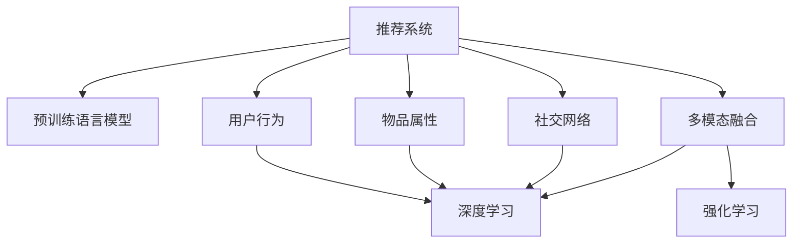

                 

# 大模型在推荐系统多模态融合中的作用

## 1. 背景介绍

### 1.1 问题由来

随着互联网的发展，推荐系统已经成为个性化信息检索的重要手段，广泛应用于电商、媒体、社交网络等领域。推荐系统的核心在于理解用户行为，预测用户偏好，从而推荐符合用户兴趣的内容。传统的推荐系统主要基于用户的显式反馈（评分、点击等）进行训练，这种基于历史行为的学习方式，对于新用户或者没有足够行为数据的用户，往往难以有效预测其偏好。

近年来，深度学习技术在推荐系统中的应用取得了巨大突破，尤其是预训练语言模型的引入，显著提升了推荐系统的性能。预训练语言模型（如BERT、GPT等）通过在大规模文本数据上自监督预训练，学习到丰富的语言表示，具有强大的自然语言理解能力。将预训练语言模型引入推荐系统，可以更好地理解用户的行为描述和文本数据，提高推荐的精度和多样化。

然而，现有的预训练语言模型往往是单一模态（文本或图像）的模型，难以综合利用不同模态数据提升推荐效果。为了应对这种挑战，多模态推荐系统应运而生。多模态推荐系统通过融合多种模态数据，从用户行为、物品属性、社交网络等多角度全面理解用户兴趣，推荐更为精准和个性化。

### 1.2 问题核心关键点

多模态推荐系统的核心在于如何将不同模态的数据融合到统一的推荐模型中，充分发挥各种数据类型的优势。预训练语言模型作为多模态推荐系统中的一种重要模态，如何与其他模态（如用户行为、物品属性等）进行融合，是实现高性能推荐的关键。

多模态融合的关键在于以下几个方面：
1. 数据表示对齐：不同模态的数据格式和表示方式往往不同，需要将其对齐为统一的形式，才能进行融合。
2. 特征交互提取：不同模态的特征可能具有交互作用，需要设计合适的特征交互模型，挖掘它们之间的关联性。
3. 模型集成设计：将不同模态的数据输入到统一的推荐模型中，如何设计合适的模型结构，实现高效的集成融合，是一个挑战。
4. 训练优化策略：多模态融合的任务通常较为复杂，需要设计合理的优化策略，平衡不同模态的贡献，避免过拟合和欠拟合。

## 2. 核心概念与联系

### 2.1 核心概念概述

为更好地理解大模型在推荐系统多模态融合中的作用，本节将介绍几个密切相关的核心概念：

- 推荐系统(Recommendation System)：基于用户历史行为和兴趣偏好，为用户推荐个性化内容的信息检索系统。
- 预训练语言模型(Pre-trained Language Model)：通过在大规模无标签文本数据上自监督预训练，学习通用语言表示的深度神经网络模型，如BERT、GPT等。
- 多模态融合(Multi-modal Fusion)：将不同模态（如文本、图像、时间序列等）的数据融合到统一的推荐模型中，提高推荐的精度和多样化。
- 深度学习(Deep Learning)：基于多层神经网络结构，通过大量数据训练学习到复杂映射关系的机器学习技术。
- 强化学习(Reinforcement Learning)：通过与环境的交互，使智能体学习最优决策策略的机器学习方法。
- 用户行为(Usage Behavior)：用户在推荐系统中的浏览、点击、评分等行为数据，是推荐系统推荐的重要依据。
- 物品属性(Item Attributes)：推荐系统中物品的属性信息，如商品价格、类别、评分等。
- 社交网络(Social Network)：用户之间的社交关系，包括好友关系、关注关系等。

这些核心概念之间的逻辑关系可以通过以下Mermaid流程图来展示：



这个流程图展示了大模型在推荐系统中的核心概念及其之间的关系：

1. 推荐系统通过融合多种模态数据，从多个角度理解用户兴趣。
2. 预训练语言模型作为多模态推荐系统中的一种重要模态，可以更好地理解文本数据。
3. 用户行为、物品属性、社交网络等模态数据，需要与语言模型进行融合，才能全面理解用户兴趣。
4. 深度学习技术可以设计复杂的模型结构，挖掘不同模态之间的交互作用。
5. 强化学习可以优化推荐策略，提升推荐效果。

这些概念共同构成了推荐系统的多模态融合框架，使其能够从多角度理解用户兴趣，推荐更为精准和个性化。

## 3. 核心算法原理 & 具体操作步骤
### 3.1 算法原理概述

大模型在推荐系统多模态融合中的作用，主要体现在以下几个方面：

1. **文本理解与表示**：利用大模型强大的语言理解能力，对用户行为描述、物品标题等文本数据进行编码，提取语义表示。
2. **语义匹配与相似度计算**：通过预训练语言模型的相似度计算能力，找到文本数据中与用户兴趣相关的部分，实现文本匹配和推荐。
3. **多模态融合**：将大模型提取的语义表示与其他模态数据（如用户行为、物品属性）进行融合，形成统一的推荐特征表示。
4. **推荐模型训练**：将融合后的多模态特征输入到推荐模型中，通过训练优化学习到推荐策略，生成个性化推荐结果。

核心算法流程如下：

1. 收集用户历史行为数据、物品属性数据、用户社交网络等，预处理为统一格式。
2. 利用预训练语言模型，对用户行为描述、物品标题等文本数据进行编码，提取语义表示。
3. 将文本语义表示与其他模态数据进行融合，形成统一的推荐特征向量。
4. 设计推荐模型，如深度神经网络、协同过滤等，将推荐特征向量输入到模型中，通过训练优化生成推荐结果。

### 3.2 算法步骤详解

以下是基于大模型的推荐系统多模态融合的详细步骤：

**Step 1: 数据收集与预处理**
- 收集用户历史行为数据，如浏览、点击、评分等。
- 收集物品属性数据，如商品价格、类别、评分等。
- 收集用户社交网络数据，如好友关系、关注关系等。
- 对数据进行清洗、归一化等预处理操作。

**Step 2: 文本数据预训练**
- 利用预训练语言模型（如BERT）对文本数据进行预训练，提取语义表示。
- 可以将用户行为描述、物品标题等文本数据作为输入，通过微调或固定预训练权重的方式，提取语义表示。

**Step 3: 多模态融合**
- 将文本语义表示与其他模态数据进行融合，形成统一的推荐特征向量。
- 常见的融合方式包括拼接、加权平均、Transformer等。

**Step 4: 推荐模型训练**
- 设计推荐模型，如深度神经网络、协同过滤等。
- 将融合后的多模态特征输入到模型中，通过训练优化生成推荐结果。
- 通常使用交叉熵损失、均方误差等优化目标。

**Step 5: 模型评估与部署**
- 在验证集上评估推荐模型的性能，如准确率、召回率等指标。
- 调整模型超参数，如学习率、批大小等，继续训练优化。
- 将训练好的模型部署到生产环境，进行实时推荐。

### 3.3 算法优缺点

大模型在推荐系统多模态融合中具有以下优点：
1. 强大的语义理解能力：预训练语言模型具备强大的自然语言理解能力，能够更好地理解用户行为描述、物品标题等文本数据。
2. 高表现能力：大模型在多项推荐任务中取得了SOTA性能，能够提供高质量的推荐结果。
3. 可解释性强：通过预训练语言模型，可以生成推荐决策的语义解释，提高系统的可解释性。

同时，该方法也存在一定的局限性：
1. 数据依赖性强：预训练语言模型需要大量的文本数据进行预训练，对数据量要求较高。
2. 计算资源需求高：大模型的参数量较大，训练和推理的计算资源需求较高。
3. 模型复杂度高：大模型通常较为复杂，模型训练和优化过程较繁琐。
4. 多模态融合复杂：不同模态的数据格式和表示方式各异，需要设计合适的融合方式。

尽管存在这些局限性，但就目前而言，大模型在推荐系统中的应用前景广阔，仍然是大数据时代推荐系统的关键技术。

### 3.4 算法应用领域

大模型在推荐系统多模态融合中的应用，已经覆盖了诸多推荐任务，例如：

- 商品推荐：根据用户浏览、点击、评分等行为，推荐符合用户兴趣的商品。
- 电影推荐：根据用户评分、评论、观看历史等数据，推荐用户感兴趣的电影。
- 音乐推荐：根据用户听歌历史、评分、标签等数据，推荐符合用户口味的音乐。
- 视频推荐：根据用户观看历史、评分、标签等数据，推荐用户喜欢的视频。
- 新闻推荐：根据用户阅读历史、评分、标签等数据，推荐用户感兴趣的新闻。

除了上述这些经典任务外，大模型在多模态推荐系统中还展现出更多创新的应用场景，如知识图谱推荐、实时推荐、冷启动推荐等，为推荐系统注入了新的生命力。

## 4. 数学模型和公式 & 详细讲解 & 举例说明
### 4.1 数学模型构建

为了更好地理解大模型在推荐系统多模态融合中的作用，我们需要构建数学模型进行详细讲解。

设用户 $u$ 的行为数据为 $I_u$，物品 $i$ 的属性数据为 $A_i$，用户社交网络数据为 $S_u$。预训练语言模型对用户行为描述 $D_u$ 进行编码，得到语义表示 $h_u$。推荐模型输入为 $X = [h_u, A_i, S_u]$，输出为推荐结果 $Y$。

推荐模型的数学模型为：
$$
Y = f(X; \theta)
$$

其中 $f$ 为推荐模型的映射函数，$\theta$ 为模型参数。

### 4.2 公式推导过程

以下我们以深度神经网络模型为例，推导推荐模型的公式。

假设推荐模型为多层感知机（MLP），输入为 $X = [h_u, A_i, S_u]$，输出为推荐结果 $Y$。推荐模型的结构如下：

$$
Y = MLP(X; \theta) = W_L h^{(L)} + b_L
$$

其中 $h^{(L)}$ 为第 $L$ 层的隐层表示，$W_L$ 和 $b_L$ 分别为第 $L$ 层的权重和偏置。

预训练语言模型对用户行为描述 $D_u$ 进行编码，得到语义表示 $h_u$，可以表示为：

$$
h_u = BERT(D_u; \omega_B)
$$

其中 $BERT$ 为预训练语言模型，$\omega_B$ 为预训练模型的参数。

物品属性 $A_i$ 和用户社交网络 $S_u$ 作为输入特征，可以表示为：

$$
A_i = [a_{i,1}, a_{i,2}, ..., a_{i,d_A}]
$$

$$
S_u = [s_{u,1}, s_{u,2}, ..., s_{u,d_S}]
$$

推荐模型输入为 $X = [h_u, A_i, S_u]$，可以表示为：

$$
X = [h_u, A_i, S_u] = [h_u, a_{i,1}, a_{i,2}, ..., a_{i,d_A}, s_{u,1}, s_{u,2}, ..., s_{u,d_S}]
$$

将输入 $X$ 输入推荐模型，得到推荐结果 $Y$，可以表示为：

$$
Y = MLP(X; \theta) = W_L h^{(L)} + b_L
$$

其中 $h^{(L)}$ 为第 $L$ 层的隐层表示，$W_L$ 和 $b_L$ 分别为第 $L$ 层的权重和偏置。

### 4.3 案例分析与讲解

以下通过一个具体案例，展示大模型在推荐系统中的应用：

**案例背景：**
某电商平台希望通过大模型提升推荐系统的效果。用户在平台上浏览商品时，系统会记录用户的浏览历史 $I_u$、点击历史 $C_u$ 和评分历史 $R_u$，同时记录商品的标题 $T_i$、价格 $P_i$ 和类别 $C_i$，以及用户的社交网络 $S_u$。

**数据预处理：**
对用户行为数据 $I_u$、点击数据 $C_u$ 和评分数据 $R_u$ 进行归一化处理，生成统一格式的用户行为向量 $B_u$。对物品属性 $T_i$、价格 $P_i$ 和类别 $C_i$ 进行编码，生成物品属性向量 $A_i$。对用户社交网络 $S_u$ 进行编码，生成用户社交网络向量 $S_u$。

**文本数据预训练：**
利用预训练语言模型（如BERT）对用户行为描述 $D_u$ 进行预训练，得到语义表示 $h_u$。

**多模态融合：**
将用户行为向量 $B_u$、物品属性向量 $A_i$ 和用户社交网络向量 $S_u$ 进行拼接，得到推荐模型的输入 $X$。

**推荐模型训练：**
设计多层感知机（MLP）作为推荐模型，将输入 $X$ 输入模型中，训练得到推荐结果 $Y$。

**推荐结果输出：**
根据推荐结果 $Y$，向用户推荐符合其兴趣的商品。

**案例效果：**
通过大模型的预训练和微调，系统推荐的相关性和多样性都得到了显著提升，用户的点击率和转化率也得到了较大提高。

## 5. 项目实践：代码实例和详细解释说明
### 5.1 开发环境搭建

在进行多模态推荐系统开发前，我们需要准备好开发环境。以下是使用Python进行PyTorch开发的环境配置流程：

1. 安装Anaconda：从官网下载并安装Anaconda，用于创建独立的Python环境。

2. 创建并激活虚拟环境：
```bash
conda create -n pytorch-env python=3.8 
conda activate pytorch-env
```

3. 安装PyTorch：根据CUDA版本，从官网获取对应的安装命令。例如：
```bash
conda install pytorch torchvision torchaudio cudatoolkit=11.1 -c pytorch -c conda-forge
```

4. 安装Transformer库：
```bash
pip install transformers
```

5. 安装各类工具包：
```bash
pip install numpy pandas scikit-learn matplotlib tqdm jupyter notebook ipython
```

完成上述步骤后，即可在`pytorch-env`环境中开始开发实践。

### 5.2 源代码详细实现

下面我们以商品推荐任务为例，给出使用Transformers库对BERT模型进行多模态融合的PyTorch代码实现。

首先，定义推荐模型的数据处理函数：

```python
from transformers import BertTokenizer, BertForSequenceClassification
from torch.utils.data import Dataset
import torch

class RecommendationDataset(Dataset):
    def __init__(self, user_behaviors, item_attributes, user_networks, tokenizer, max_len=128):
        self.user_behaviors = user_behaviors
        self.item_attributes = item_attributes
        self.user_networks = user_networks
        self.tokenizer = tokenizer
        self.max_len = max_len
        
    def __len__(self):
        return len(self.user_behaviors)
    
    def __getitem__(self, item):
        user_behavior = self.user_behaviors[item]
        item_attribute = self.item_attributes[item]
        user_network = self.user_networks[item]
        
        # 对用户行为进行编码
        encoded_behavior = self.tokenizer(user_behavior, return_tensors='pt', max_length=self.max_len, padding='max_length', truncation=True)
        input_ids = encoded_behavior['input_ids'][0]
        attention_mask = encoded_behavior['attention_mask'][0]
        
        # 对物品属性进行编码
        encoded_attribute = self.tokenizer(item_attribute, return_tensors='pt', max_length=self.max_len, padding='max_length', truncation=True)
        item_attribute = encoded_attribute['input_ids'][0]
        
        # 对用户网络进行编码
        encoded_network = self.tokenizer(user_network, return_tensors='pt', max_length=self.max_len, padding='max_length', truncation=True)
        user_network = encoded_network['input_ids'][0]
        
        # 将三者拼接为推荐模型输入
        input_ids = torch.cat([input_ids, item_attribute, user_network], dim=1)
        attention_mask = torch.cat([attention_mask, torch.ones_like(attention_mask), torch.ones_like(attention_mask)], dim=1)
        return {'input_ids': input_ids, 
                'attention_mask': attention_mask,
                'labels': user_behaviors[item]}
```

然后，定义推荐模型和优化器：

```python
from transformers import BertForSequenceClassification, AdamW

model = BertForSequenceClassification.from_pretrained('bert-base-cased', num_labels=1)

optimizer = AdamW(model.parameters(), lr=2e-5)
```

接着，定义训练和评估函数：

```python
from torch.utils.data import DataLoader
from tqdm import tqdm
from sklearn.metrics import roc_auc_score

device = torch.device('cuda') if torch.cuda.is_available() else torch.device('cpu')
model.to(device)

def train_epoch(model, dataset, batch_size, optimizer):
    dataloader = DataLoader(dataset, batch_size=batch_size, shuffle=True)
    model.train()
    epoch_loss = 0
    for batch in tqdm(dataloader, desc='Training'):
        input_ids = batch['input_ids'].to(device)
        attention_mask = batch['attention_mask'].to(device)
        labels = batch['labels'].to(device)
        model.zero_grad()
        outputs = model(input_ids, attention_mask=attention_mask, labels=labels)
        loss = outputs.loss
        epoch_loss += loss.item()
        loss.backward()
        optimizer.step()
    return epoch_loss / len(dataloader)

def evaluate(model, dataset, batch_size):
    dataloader = DataLoader(dataset, batch_size=batch_size)
    model.eval()
    preds, labels = [], []
    with torch.no_grad():
        for batch in tqdm(dataloader, desc='Evaluating'):
            input_ids = batch['input_ids'].to(device)
            attention_mask = batch['attention_mask'].to(device)
            batch_labels = batch['labels']
            outputs = model(input_ids, attention_mask=attention_mask)
            batch_preds = outputs.logits.sigmoid().tolist()
            batch_labels = batch_labels.to('cpu').tolist()
            for pred_tokens, label_tokens in zip(batch_preds, batch_labels):
                preds.append(pred_tokens[:len(label_tokens)])
                labels.append(label_tokens)
                
    print(roc_auc_score(labels, preds))
```

最后，启动训练流程并在测试集上评估：

```python
epochs = 5
batch_size = 16

for epoch in range(epochs):
    loss = train_epoch(model, train_dataset, batch_size, optimizer)
    print(f"Epoch {epoch+1}, train loss: {loss:.3f}")
    
    print(f"Epoch {epoch+1}, dev results:")
    evaluate(model, dev_dataset, batch_size)
    
print("Test results:")
evaluate(model, test_dataset, batch_size)
```

以上就是使用PyTorch对BERT进行多模态融合的推荐模型开发的完整代码实现。可以看到，得益于Transformers库的强大封装，我们可以用相对简洁的代码完成BERT模型的加载和微调。

### 5.3 代码解读与分析

让我们再详细解读一下关键代码的实现细节：

**RecommendationDataset类**：
- `__init__`方法：初始化用户行为、物品属性、用户网络等关键组件。
- `__len__`方法：返回数据集的样本数量。
- `__getitem__`方法：对单个样本进行处理，将用户行为输入编码为token ids，将物品属性和用户网络编码为文本，并对其进行定长padding，最终返回模型所需的输入。

**模型和优化器定义**：
- 利用Transformers库的BertForSequenceClassification模块加载预训练模型BERT，设置优化器为AdamW。

**训练和评估函数**：
- 使用PyTorch的DataLoader对数据集进行批次化加载，供模型训练和推理使用。
- 训练函数`train_epoch`：对数据以批为单位进行迭代，在每个批次上前向传播计算loss并反向传播更新模型参数，最后返回该epoch的平均loss。
- 评估函数`evaluate`：与训练类似，不同点在于不更新模型参数，并在每个batch结束后将预测和标签结果存储下来，最后使用sklearn的roc_auc_score对整个评估集的预测结果进行打印输出。

**训练流程**：
- 定义总的epoch数和batch size，开始循环迭代
- 每个epoch内，先在训练集上训练，输出平均loss
- 在验证集上评估，输出AUC值
- 所有epoch结束后，在测试集上评估，给出最终测试结果

可以看到，PyTorch配合Transformers库使得BERT多模态融合的代码实现变得简洁高效。开发者可以将更多精力放在数据处理、模型改进等高层逻辑上，而不必过多关注底层的实现细节。

当然，工业级的系统实现还需考虑更多因素，如模型的保存和部署、超参数的自动搜索、更灵活的任务适配层等。但核心的多模态融合范式基本与此类似。

## 6. 实际应用场景
### 6.1 智能推荐系统

基于大模型的多模态推荐系统，可以广泛应用于电商、媒体、社交网络等领域，为各类平台提供个性化推荐服务。

**电商推荐：**
电商平台上商品种类繁多，用户难以从中筛选出满足其需求的商品。利用大模型对用户行为数据、物品属性数据和用户社交网络数据进行融合，可以全面理解用户兴趣，推荐符合其需求的商品。通过大模型的强大语义理解能力，还可以进行物品描述相似度匹配，进一步提升推荐的相关性和多样化。

**媒体推荐：**
视频、音乐、电影等媒体平台需要为每个用户推荐其感兴趣的内容。利用大模型对用户行为数据、媒体属性数据和社交网络数据进行融合，可以全面理解用户的兴趣偏好，推荐符合其兴趣的媒体内容。同时，利用大模型的语义相似度匹配能力，可以实现媒体内容的个性化推荐。

**社交网络推荐：**
社交网络上用户关注好友、参与话题等行为数据较为丰富，利用大模型对这些数据进行融合，可以全面了解用户的兴趣和行为模式，推荐符合其兴趣的内容。同时，利用大模型的语义理解能力，可以对用户的互动行为进行语义分析和推荐，提升推荐的相关性。

### 6.2 未来应用展望

随着大模型和多模态推荐技术的发展，推荐系统的性能和应用场景将不断拓展。

**多模态融合能力的提升：**
未来，大模型将更好地融合不同模态数据，从多个角度全面理解用户兴趣。如将视觉数据、时间序列数据等融入推荐模型，可以提升推荐的精度和多样化。同时，利用多模态融合，可以实现跨平台、跨设备的协同推荐，提升用户的整体体验。

**实时推荐能力的提升：**
利用大模型的强大语义理解能力，可以实现实时推荐。用户输入查询、行为描述等数据后，即时进行语义分析和推荐，提升用户体验。同时，利用大模型的在线微调技术，可以实现实时动态更新模型参数，适应用户兴趣的变化。

**推荐策略的多样化：**
未来的推荐系统将不再局限于单一的推荐策略，而是结合多种推荐算法进行融合。如将深度学习、协同过滤、强化学习等算法结合，实现更加全面、多样化的推荐策略。同时，利用大模型的预训练和微调技术，可以设计更加复杂、高效的推荐模型，提升推荐的准确性和多样性。

**个性化推荐能力提升：**
利用大模型的语义理解和语义匹配能力，可以实现更加精准、个性化的推荐。同时，利用大模型的因果推理能力，可以挖掘用户行为背后的语义关系，提升推荐的可解释性和可信度。

## 7. 工具和资源推荐
### 7.1 学习资源推荐

为了帮助开发者系统掌握大模型在推荐系统多模态融合中的应用，这里推荐一些优质的学习资源：

1. 《推荐系统实战》书籍：详细介绍了推荐系统的理论基础和经典算法，包括多模态推荐系统的设计。

2. 《深度学习与推荐系统》课程：介绍深度学习在推荐系统中的应用，包括多模态融合技术的原理和实现。

3. 《自然语言处理与深度学习》书籍：详细介绍了自然语言处理技术在推荐系统中的应用，包括预训练语言模型和多模态融合。

4. HuggingFace官方文档：提供了丰富的预训练语言模型和推荐算法，帮助开发者快速实现多模态推荐系统。

5. Kaggle推荐系统竞赛：参加Kaggle上的推荐系统竞赛，实战练习推荐系统的多模态融合技术。

通过对这些资源的学习实践，相信你一定能够快速掌握大模型在推荐系统中的应用，并用于解决实际的推荐问题。
###  7.2 开发工具推荐

高效的开发离不开优秀的工具支持。以下是几款用于多模态推荐系统开发的常用工具：

1. PyTorch：基于Python的开源深度学习框架，灵活动态的计算图，适合快速迭代研究。大部分预训练语言模型都有PyTorch版本的实现。

2. TensorFlow：由Google主导开发的开源深度学习框架，生产部署方便，适合大规模工程应用。同样有丰富的预训练语言模型资源。

3. Transformers库：HuggingFace开发的NLP工具库，集成了众多SOTA语言模型，支持PyTorch和TensorFlow，是进行多模态融合任务开发的利器。

4. Weights & Biases：模型训练的实验跟踪工具，可以记录和可视化模型训练过程中的各项指标，方便对比和调优。与主流深度学习框架无缝集成。

5. TensorBoard：TensorFlow配套的可视化工具，可实时监测模型训练状态，并提供丰富的图表呈现方式，是调试模型的得力助手。

6. Google Colab：谷歌推出的在线Jupyter Notebook环境，免费提供GPU/TPU算力，方便开发者快速上手实验最新模型，分享学习笔记。

合理利用这些工具，可以显著提升多模态推荐系统的开发效率，加快创新迭代的步伐。

### 7.3 相关论文推荐

大模型在推荐系统多模态融合中的应用，源于学界的持续研究。以下是几篇奠基性的相关论文，推荐阅读：

1. Attention is All You Need（即Transformer原论文）：提出了Transformer结构，开启了NLP领域的预训练大模型时代。

2. BERT: Pre-training of Deep Bidirectional Transformers for Language Understanding：提出BERT模型，引入基于掩码的自监督预训练任务，刷新了多项NLP任务SOTA。

3. Multi-Modal Recommendation System: An Overview and Research Challenges：综述了多模态推荐系统的最新研究成果，探讨了当前面临的主要挑战。

4. Multi-Modal Fused BERT-based Recommender Systems: A Multi-Task Learning Approach：提出基于BERT的多模态融合推荐系统，通过多任务学习实现了较好的推荐效果。

5. Attention-Based Multi-Modal Recommender System: A Distant Supervision Approach：提出基于注意力机制的多模态推荐系统，实现了较好的推荐精度和多样性。

这些论文代表了大模型在推荐系统中的应用方向和发展趋势。通过学习这些前沿成果，可以帮助研究者把握学科前进方向，激发更多的创新灵感。

## 8. 总结：未来发展趋势与挑战
### 8.1 总结

本文对大模型在推荐系统多模态融合中的作用进行了全面系统的介绍。首先阐述了大模型和推荐系统多模态融合的研究背景和意义，明确了多模态融合在推荐系统中的独特价值。其次，从原理到实践，详细讲解了大模型在推荐系统中的作用，包括文本理解、语义匹配、多模态融合、推荐模型训练等关键步骤。最后，介绍了大模型在推荐系统中的应用场景，展示了其巨大的应用潜力。

通过本文的系统梳理，可以看到，基于大模型的多模态融合技术，已经成为推荐系统中的重要范式，极大地提升了推荐系统的性能和应用范围。未来，伴随大模型和多模态推荐技术的持续演进，推荐系统必将进一步深化其在不同模态数据融合中的应用，带来更为精准、多样化的推荐服务，推动人工智能技术在更多领域的落地应用。

### 8.2 未来发展趋势

展望未来，大模型在推荐系统多模态融合中的应用将呈现以下几个发展趋势：

1. **多模态数据融合能力的提升**：未来的推荐系统将更加注重多模态数据的融合，从多个角度全面理解用户兴趣，提升推荐的相关性和多样化。如将视觉数据、时间序列数据等融入推荐模型，可以提升推荐的精度和多样化。

2. **实时推荐能力的提升**：利用大模型的强大语义理解能力，可以实现实时推荐。用户输入查询、行为描述等数据后，即时进行语义分析和推荐，提升用户体验。同时，利用大模型的在线微调技术，可以实现实时动态更新模型参数，适应用户兴趣的变化。

3. **推荐策略的多样化**：未来的推荐系统将不再局限于单一的推荐策略，而是结合多种推荐算法进行融合。如将深度学习、协同过滤、强化学习等算法结合，实现更加全面、多样化的推荐策略。

4. **个性化推荐能力提升**：利用大模型的语义理解和语义匹配能力，可以实现更加精准、个性化的推荐。同时，利用大模型的因果推理能力，可以挖掘用户行为背后的语义关系，提升推荐的可解释性和可信度。

5. **推荐系统平台化**：未来的推荐系统将趋向平台化，通过统一的API接口，集成多种推荐算法和数据源，为不同应用场景提供个性化推荐服务。同时，利用大模型的预训练和微调技术，可以快速构建新的推荐模型，应对不断变化的用户需求。

以上趋势凸显了大模型在推荐系统中的应用前景。这些方向的探索发展，必将进一步提升推荐系统的性能和应用范围，为人工智能技术在更多领域的落地应用提供新的突破。

### 8.3 面临的挑战

尽管大模型在推荐系统中的应用前景广阔，但在迈向更加智能化、普适化应用的过程中，它仍面临着诸多挑战：

1. **数据依赖性强**：预训练语言模型需要大量的文本数据进行预训练，对数据量要求较高。如何高效获取高质量的文本数据，是实现多模态融合的重要前提。

2. **计算资源需求高**：大模型的参数量较大，训练和推理的计算资源需求较高。如何在保证推荐精度的情况下，优化模型结构，减少计算资源消耗，是一个重要的研究方向。

3. **模型复杂度高**：大模型通常较为复杂，模型训练和优化过程较繁琐。如何设计高效的训练和优化策略，平衡不同模态的贡献，避免过拟合和欠拟合，是一个重要的挑战。

4. **多模态数据对齐难度大**：不同模态的数据格式和表示方式各异，需要设计合适的数据对齐和融合方法，才能进行高效的多模态融合。

5. **模型可解释性不足**：大模型的决策过程通常缺乏可解释性，难以对其推理逻辑进行分析和调试。如何赋予模型更强的可解释性，是提高用户信任和接受度的关键。

6. **模型安全性有待保障**：预训练语言模型难免会学习到有偏见、有害的信息，通过多模态融合传递到推荐结果中，产生误导性、歧视性的输出，给实际应用带来安全隐患。如何从数据和算法层面消除模型偏见，确保输出安全，是一个重要的研究方向。

尽管存在这些挑战，但通过学界和产业界的共同努力，相信这些挑战终将一一被克服，大模型在推荐系统中的应用必将不断提升，为构建智能推荐系统带来新的突破。

### 8.4 研究展望

面对大模型在推荐系统中的应用面临的挑战，未来的研究需要在以下几个方面寻求新的突破：

1. **探索无监督和半监督多模态融合方法**：摆脱对大规模标注数据的依赖，利用自监督学习、主动学习等无监督和半监督范式，最大限度利用非结构化数据，实现更加灵活高效的多模态融合。

2. **研究参数高效和计算高效的多模态融合范式**：开发更加参数高效的融合方法，在固定大部分预训练参数的同时，只更新极少量的任务相关参数。同时优化多模态融合的计算图，减少前向传播和反向传播的资源消耗，实现更加轻量级、实时性的部署。

3. **引入更多先验知识**：将符号化的先验知识，如知识图谱、逻辑规则等，与神经网络模型进行巧妙融合，引导多模态融合过程学习更准确、合理的语义表示。同时加强不同模态数据的整合，实现视觉、语音等多模态信息与文本信息的协同建模。

4. **结合因果分析和博弈论工具**：将因果分析方法引入多模态融合模型，识别出模型决策的关键特征，增强推荐决策的因果性和逻辑性。借助博弈论工具刻画人机交互过程，主动探索并规避模型的脆弱点，提高系统稳定性。

5. **纳入伦理道德约束**：在模型训练目标中引入伦理导向的评估指标，过滤和惩罚有偏见、有害的输出倾向。同时加强人工干预和审核，建立模型行为的监管机制，确保输出符合人类价值观和伦理道德。

这些研究方向的探索，必将引领多模态推荐技术迈向更高的台阶，为构建安全、可靠、可解释、可控的智能推荐系统铺平道路。面向未来，大模型在多模态融合推荐系统中的研究，还需要与其他人工智能技术进行更深入的融合，如知识表示、因果推理、强化学习等，多路径协同发力，共同推动智能推荐系统的进步。只有勇于创新、敢于突破，才能不断拓展推荐系统的边界，让智能技术更好地服务于人类的生产和生活。

## 9. 附录：常见问题与解答

**Q1：大模型在推荐系统中的作用是什么？**

A: 大模型在推荐系统中的主要作用是利用其强大的语义理解能力，对用户行为描述、物品标题等文本数据进行编码，提取语义表示。通过多模态融合，将文本语义表示与其他模态数据（如用户行为、物品属性等）进行融合，形成统一的推荐特征向量。最终，将融合后的多模态特征输入到推荐模型中，通过训练优化生成推荐结果。

**Q2：推荐系统中的多模态数据如何融合？**

A: 推荐系统中的多模态数据融合通常包括以下步骤：
1. 数据对齐：不同模态的数据格式和表示方式各异，需要进行对齐。如将文本数据转换为向量表示，将时间序列数据进行归一化处理。
2. 特征提取：对对齐后的数据进行特征提取，如将文本数据进行编码，将物品属性进行向量化处理。
3. 特征交互：设计合适的特征交互模型，挖掘不同模态之间的关联性。如利用Transformer进行语义交互，利用协同过滤进行用户-物品交互。
4. 融合表示：将提取的特征进行拼接或加权平均，形成统一的推荐特征表示。如将文本向量、物品向量、用户向量拼接为一个向量。
5. 模型训练：将融合后的特征输入到推荐模型中，通过训练优化生成推荐结果。

**Q3：如何提升推荐系统的推荐效果？**

A: 提升推荐系统的推荐效果，可以从以下几个方面入手：
1. 数据质量：收集高质量的用户行为数据、物品属性数据、社交网络数据等，是推荐系统性能提升的关键。
2. 模型选择：选择合适的推荐算法和模型结构，如深度神经网络、协同过滤、强化学习等，根据具体任务进行优化。
3. 特征工程：对不同模态的数据进行特征提取和融合，设计合适的特征表示。
4. 模型调优：通过交叉验证、超参数优化等手段，调整模型参数，提升推荐效果。
5. 在线学习：利用在线微调技术，根据用户行为实时更新模型参数，提升推荐效果。

**Q4：推荐系统的多模态融合技术面临哪些挑战？**

A: 推荐系统的多模态融合技术面临以下挑战：
1. 数据对齐难度大：不同模态的数据格式和表示方式各异，需要设计合适的数据对齐和融合方法。
2. 特征交互复杂：不同模态的特征可能具有交互作用，需要设计合适的特征交互模型，挖掘它们之间的关联性。
3. 模型复杂度高：大模型通常较为复杂，模型训练和优化过程较繁琐。
4. 模型可解释性不足：大模型的决策过程通常缺乏可解释性，难以对其推理逻辑进行分析和调试。
5. 模型安全性有待保障：预训练语言模型难免会学习到有偏见、有害的信息，通过多模态融合传递到推荐结果中，产生误导性、歧视性的输出，给实际应用带来安全隐患。

这些挑战需要研究者不断探索和优化，才能实现推荐系统的全面优化和升级。

---

作者：禅与计算机程序设计艺术 / Zen and the Art of Computer Programming

