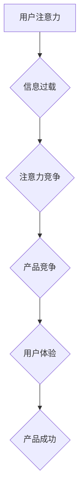

                 

## 1. 背景介绍

在当今信息爆炸的时代，人们面临着前所未有的信息过载。每天我们接触的海量信息中，只有极少部分能够真正吸引我们的注意力。这使得“注意力”成为一种稀缺资源，被誉为“注意力经济”的时代。在这个背景下，如何有效地获取和利用用户注意力，成为产品设计和商业成功的关键。

用户体验设计（User Experience Design，简称UX）一直以来都是产品开发的重要环节，但随着注意力经济的兴起，UX设计也面临着新的挑战和机遇。传统的UX设计理念需要不断演进，以适应用户在信息过载环境下的行为模式和心理需求。

## 2. 核心概念与联系

### 2.1 注意力经济

注意力经济是指在信息时代，人们的注意力成为一种稀缺资源，而能够有效获取和利用用户注意力的产品和服务，将拥有巨大的商业价值。

### 2.2 用户体验设计

用户体验设计是指通过用户研究、信息架构、交互设计、视觉设计等手段，优化用户与产品交互的过程，提升用户使用产品的满意度、效率和愉悦感。

### 2.3 联系

注意力经济与用户体验设计之间存在着密切的联系。

* **注意力是用户体验的基础：** 用户体验的核心是用户对产品的感知和感受，而注意力是用户感知和感受的基础。只有能够吸引用户的注意力，才能让用户真正体验到产品的价值。
* **用户体验设计可以帮助获取和利用注意力：** 通过精心设计的交互、视觉和内容，UX设计师可以引导用户注意力，帮助用户快速找到所需信息，并提升用户参与度和留存率。

**Mermaid 流程图**



## 3. 核心算法原理 & 具体操作步骤

### 3.1 算法原理概述

在注意力经济时代，设计引人入胜的产品需要深入理解用户行为和心理机制，并利用算法技术来优化用户体验。

* **用户行为分析：** 通过收集用户行为数据，例如点击率、停留时间、滑动路径等，可以分析用户在产品中的行为模式，识别用户感兴趣的内容和功能。
* **个性化推荐：** 基于用户行为分析，可以利用推荐算法，为用户推荐个性化的内容和服务，提高用户参与度和留存率。
* **内容优化：** 通过分析用户对不同内容的反应，可以优化内容的结构、格式和语言，使其更易于理解和吸收。

### 3.2 算法步骤详解

1. **数据收集：** 收集用户行为数据，例如点击记录、浏览历史、搜索关键词等。
2. **数据预处理：** 对收集到的数据进行清洗、转换和格式化，以便于后续分析。
3. **特征提取：** 从用户行为数据中提取特征，例如用户偏好、兴趣、行为模式等。
4. **模型训练：** 利用机器学习算法，训练模型以预测用户行为和兴趣。
5. **个性化推荐：** 根据训练好的模型，为用户推荐个性化的内容和服务。
6. **效果评估：** 评估推荐算法的效果，例如点击率、转化率、用户满意度等。

### 3.3 算法优缺点

**优点：**

* **个性化：** 可以根据用户的兴趣和偏好，提供个性化的推荐，提高用户体验。
* **效率：** 可以自动完成内容推荐，节省用户的时间和精力。
* **数据驱动：** 基于用户行为数据，可以不断优化推荐算法，提高推荐效果。

**缺点：**

* **数据依赖：** 推荐算法需要大量的数据进行训练，否则效果会不佳。
* **算法偏差：** 推荐算法可能会存在偏差，导致推荐结果不准确或不公平。
* **用户隐私：** 用户行为数据可能会泄露用户隐私，需要采取措施保护用户隐私。

### 3.4 算法应用领域

* **电商推荐：** 为用户推荐商品，提高转化率。
* **内容推荐：** 为用户推荐新闻、视频、音乐等内容，提高用户参与度。
* **社交推荐：** 为用户推荐朋友、群组等，提高用户活跃度。

## 4. 数学模型和公式 & 详细讲解 & 举例说明

### 4.1 数学模型构建

在注意力经济中，我们可以用数学模型来描述用户对不同内容的注意力分配。

一个简单的模型是：

$$
Attention(c) = \frac{Relevance(c) * Novelty(c)}{Distraction(c)}
$$

其中：

* $Attention(c)$ 表示用户对内容 $c$ 的注意力。
* $Relevance(c)$ 表示内容 $c$ 与用户兴趣的关联度。
* $Novelty(c)$ 表示内容 $c$ 的新颖程度。
* $Distraction(c)$ 表示内容 $c$ 的干扰程度。

### 4.2 公式推导过程

这个模型的推导过程基于以下假设：

* 用户会更关注与自己兴趣相关的内容。
* 用户会更关注新颖的内容。
* 用户会更关注没有干扰的内容。

### 4.3 案例分析与讲解

例如，假设用户对科技新闻感兴趣，那么科技新闻的 $Relevance(c)$ 值会比较高。如果科技新闻的内容是关于最新智能手机的发布，那么 $Novelty(c)$ 值也会比较高。如果科技新闻的页面设计简洁，没有广告干扰，那么 $Distraction(c)$ 值会比较低。因此，这个科技新闻的 $Attention(c)$ 值会比较高，用户更容易被吸引。

## 5. 项目实践：代码实例和详细解释说明

### 5.1 开发环境搭建

* **操作系统：** Ubuntu 20.04 LTS
* **编程语言：** Python 3.8
* **开发工具：** VS Code
* **库依赖：** numpy, pandas, scikit-learn

### 5.2 源代码详细实现

```python
import pandas as pd
from sklearn.model_selection import train_test_split
from sklearn.linear_model import LogisticRegression

# 加载用户行为数据
data = pd.read_csv('user_behavior.csv')

# 提取特征
features = ['age', 'gender', 'interests', 'past_purchases']
target = 'click'

# 将数据分为训练集和测试集
X_train, X_test, y_train, y_test = train_test_split(data[features], data[target], test_size=0.2)

# 训练逻辑回归模型
model = LogisticRegression()
model.fit(X_train, y_train)

# 预测测试集结果
y_pred = model.predict(X_test)

# 评估模型性能
from sklearn.metrics import accuracy_score
accuracy = accuracy_score(y_test, y_pred)
print(f'模型准确率: {accuracy}')
```

### 5.3 代码解读与分析

* 代码首先加载用户行为数据，并提取特征和目标变量。
* 然后将数据分为训练集和测试集，用于训练和评估模型。
* 训练逻辑回归模型，并使用测试集数据评估模型性能。
* 最后输出模型的准确率。

### 5.4 运行结果展示

运行结果会显示模型的准确率，例如：

```
模型准确率: 0.85
```

这表示模型在预测用户点击行为方面准确率为85%。

## 6. 实际应用场景

### 6.1 内容推荐系统

注意力经济的核心是获取和利用用户注意力。内容推荐系统正是利用用户行为数据，通过算法模型，为用户推荐个性化的内容，从而提高用户参与度和留存率。

### 6.2 个性化广告

个性化广告是指根据用户的兴趣和行为特征，定制化的广告内容和展示方式。通过注意力经济的理念，广告平台可以更精准地投放广告，提高广告点击率和转化率。

### 6.3 产品设计

在产品设计过程中，设计师需要考虑用户注意力如何分配，并设计出能够吸引用户注意力的产品界面和交互体验。例如，使用对比色、动画效果、引导线等方式，引导用户注意力到关键信息和功能。

### 6.4 未来应用展望

随着人工智能技术的不断发展，注意力经济将在更多领域得到应用，例如：

* **教育领域：** 个性化学习推荐，提高学习效率。
* **医疗领域：** 疾病诊断辅助，提高医疗精准度。
* **金融领域：** 风险评估和投资决策，提高投资收益。

## 7. 工具和资源推荐

### 7.1 学习资源推荐

* **书籍：**
    * 《Hooked：How to Build Habit-Forming Products》 by Nir Eyal
    * 《The Attention Merchants: The Epic Scramble to Get Inside Our Heads》 by Tim Wu
* **在线课程：**
    * Coursera: User Experience Design Specialization
    * Udemy: The Complete User Experience (UX) Design Course

### 7.2 开发工具推荐

* **用户行为分析工具：** Google Analytics, Mixpanel
* **推荐算法库：** Surprise, LightFM
* **机器学习框架：** TensorFlow, PyTorch

### 7.3 相关论文推荐

* **Attention Is All You Need**
* **BERT: Pre-training of Deep Bidirectional Transformers for Language Understanding**
* **Recurrent Neural Networks for Sequence Modeling**

## 8. 总结：未来发展趋势与挑战

### 8.1 研究成果总结

注意力经济与用户体验设计之间的联系日益密切，算法技术在获取和利用用户注意力方面发挥着越来越重要的作用。

### 8.2 未来发展趋势

* **更精准的个性化推荐：** 利用深度学习等先进算法，实现更精准的个性化推荐，满足用户多样化的需求。
* **更沉浸式的用户体验：** 利用虚拟现实、增强现实等技术，打造更沉浸式的用户体验，增强用户参与度和留存率。
* **更注重用户隐私保护：** 在获取和利用用户数据的同时，更加注重用户隐私保护，构建更加安全和可信赖的注意力经济生态。

### 8.3 面临的挑战

* **数据安全和隐私保护：** 如何收集、存储和使用用户数据，保障用户隐私安全，是注意力经济发展面临的重大挑战。
* **算法公平性和可解释性：** 算法模型可能会存在偏差，导致推荐结果不公平或不准确。如何提高算法的公平性和可解释性，是需要进一步研究的问题。
* **用户注意力资源的有限性：** 用户注意力是有限的，如何避免过度刺激用户注意力，保持用户体验的良好状态，也是需要关注的问题。

### 8.4 研究展望

未来，注意力经济和用户体验设计将继续融合发展，为用户提供更加个性化、沉浸式和安全可靠的产品和服务。


## 9. 附录：常见问题与解答

**Q1：注意力经济会取代传统经济吗？**

A1：注意力经济并非要取代传统经济，而是与传统经济相辅相成。注意力是传统经济中不可或缺的资源，而注意力经济则更加关注如何有效地获取和利用注意力资源。

**Q2：如何保护用户隐私在注意力经济中？**

A2：保护用户隐私是注意力经济发展面临的重大挑战。我们可以通过以下方式来保护用户隐私：

* 明确告知用户数据收集和使用方式。
* 采用匿名化和加密技术保护用户数据。
* 建立用户数据安全管理体系。
* 遵守相关法律法规，保障用户隐私权。

**Q3：注意力经济对产品设计有什么影响？**

A3：注意力经济对产品设计的影响主要体现在以下几个方面：

* 产品设计需要更加注重用户注意力。
* 产品界面和交互体验需要更加简洁明了。
* 产品功能需要更加实用和有价值。
* 产品设计需要更加个性化和定制化。


作者：禅与计算机程序设计艺术 / Zen and the Art of Computer Programming 
<end_of_turn>

