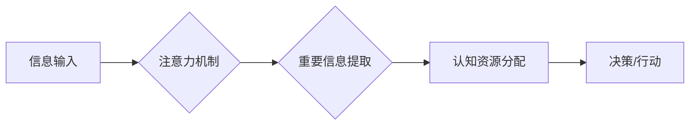

                 

## 注意力经济学家：AI驱动的认知资源配置

> 关键词：注意力机制、深度学习、认知资源、AI应用、信息过滤、个性化推荐

### 1. 背景介绍

在信息爆炸的时代，我们每天面临着海量的信息涌入。如何有效地筛选和处理这些信息，成为了一个至关重要的挑战。人类的认知资源有限，注意力是宝贵的资源，而如何合理配置注意力，成为了决定我们能否高效学习、工作和生活的重要因素。

近年来，深度学习技术取得了长足的进步，特别是注意力机制的出现，为解决信息过载问题提供了新的思路。注意力机制能够模拟人类的注意力机制，学习识别和关注信息中的重要部分，从而提高信息处理效率。

### 2. 核心概念与联系

**2.1 注意力机制**

注意力机制是一种模仿人类注意力机制的机器学习技术。它允许模型在处理信息时，根据信息的 relevance 和 importance，分配不同的计算资源。

**2.2 认知资源**

认知资源是指人类大脑处理信息的能力，包括注意力、记忆、推理等。这些资源是有限的，在处理信息时需要进行分配。

**2.3 AI驱动的认知资源配置**

AI驱动的认知资源配置是指利用人工智能技术，帮助人类更好地管理和分配认知资源。通过注意力机制等技术，AI可以帮助我们识别和过滤重要信息，从而提高我们的信息处理效率和决策能力。

**2.4  Mermaid 流程图**



### 3. 核心算法原理 & 具体操作步骤

**3.1 算法原理概述**

注意力机制的核心思想是通过一个加权机制，将输入序列中的不同元素赋予不同的权重，从而突出重要信息。常见的注意力机制包括：

* **自注意力机制 (Self-Attention):**  用于处理序列数据，例如文本，可以捕捉序列中不同元素之间的关系。
* **交叉注意力机制 (Cross-Attention):** 用于处理多个序列数据，例如文本和图像，可以学习不同模态之间的关系。

**3.2 算法步骤详解**

1. **计算注意力权重:**  根据输入序列中的元素，计算每个元素与其他元素之间的相似度，并将其转换为注意力权重。
2. **加权求和:**  将注意力权重与输入序列中的元素相乘，并求和，得到加权后的输出。

**3.3 算法优缺点**

**优点:**

* 可以有效地捕捉序列数据中的重要信息。
* 可以学习不同元素之间的关系。
* 可以提高模型的表达能力和泛化能力。

**缺点:**

* 计算复杂度较高。
* 需要大量的训练数据。

**3.4 算法应用领域**

* **自然语言处理:**  机器翻译、文本摘要、问答系统等。
* **计算机视觉:**  图像识别、目标检测、图像 captioning 等。
* **语音识别:**  语音转文本、语音合成等。

### 4. 数学模型和公式 & 详细讲解 & 举例说明

**4.1 数学模型构建**

假设我们有一个输入序列 X = {x1, x2, ..., xn}，其中每个元素 xi 是一个向量。我们想要学习一个注意力机制，来计算每个元素 xi 与其他元素之间的注意力权重。

**4.2 公式推导过程**

1. **计算注意力权重:**  对于每个元素 xi，我们计算它与其他元素之间的相似度，可以使用点积或余弦相似度等方法。

$$
a_{ij} = \text{sim}(x_i, x_j)
$$

2. **归一化注意力权重:**  将所有元素 xi 与其他元素之间的相似度归一化，得到注意力权重矩阵 A。

$$
A_{ij} = \frac{a_{ij}}{\sum_{k=1}^{n} a_{ik}}
$$

3. **加权求和:**  将注意力权重矩阵 A 与输入序列 X 相乘，并求和，得到加权后的输出。

$$
\text{output}_i = \sum_{j=1}^{n} A_{ij} x_j
$$

**4.3 案例分析与讲解**

例如，在机器翻译任务中，我们可以使用注意力机制来学习源语言和目标语言之间的关系。

* 源语言句子: "The cat sat on the mat."
* 目标语言句子: "Le chat s'est assis sur le tapis."

通过注意力机制，模型可以学习到 "cat" 与 "chat" 之间的关系， "sat" 与 "s'est assis" 之间的关系，以及 "mat" 与 "tapis" 之间的关系。

### 5. 项目实践：代码实例和详细解释说明

**5.1 开发环境搭建**

* Python 3.6+
* TensorFlow/PyTorch

**5.2 源代码详细实现**

```python
import tensorflow as tf

# 定义一个简单的自注意力机制
def self_attention(inputs, num_heads):
    # ... (代码实现)

# 使用自注意力机制进行文本分类
model = tf.keras.Sequential([
    # ... (其他层)
    self_attention(num_heads=8),
    # ... (其他层)
])

# 训练模型
model.compile(optimizer='adam', loss='categorical_crossentropy', metrics=['accuracy'])
model.fit(train_data, train_labels, epochs=10)

```

**5.3 代码解读与分析**

* `self_attention` 函数实现了一个简单的自注意力机制，可以根据输入序列和头数计算注意力权重。
* `model` 是一个简单的文本分类模型，使用了自注意力机制作为其中一层。
* `model.compile` 函数配置了模型的训练参数。
* `model.fit` 函数训练了模型。

**5.4 运行结果展示**

* 模型训练完成后，可以评估模型的性能，例如准确率等。

### 6. 实际应用场景

**6.1 个性化推荐系统**

注意力机制可以帮助推荐系统学习用户对不同商品的兴趣偏好，并推荐更个性化的商品。

**6.2 信息过滤和摘要**

注意力机制可以帮助过滤掉无关信息，并生成更简洁的文本摘要。

**6.3 医疗诊断辅助系统**

注意力机制可以帮助医生识别医学图像中的重要特征，并辅助进行诊断。

**6.4 未来应用展望**

随着深度学习技术的不断发展，注意力机制将在更多领域得到应用，例如：

* **教育领域:**  个性化学习、智能辅导等。
* **金融领域:**  风险评估、欺诈检测等。
* **自动驾驶领域:**  目标检测、路径规划等。

### 7. 工具和资源推荐

**7.1 学习资源推荐**

* **论文:**  "Attention Is All You Need"
* **博客:**  https://towardsdatascience.com/
* **在线课程:**  Coursera, edX

**7.2 开发工具推荐**

* **TensorFlow:**  https://www.tensorflow.org/
* **PyTorch:**  https://pytorch.org/

**7.3 相关论文推荐**

* "Attention Is All You Need"
* "BERT: Pre-training of Deep Bidirectional Transformers for Language Understanding"
* "Transformer-XL: Attentive Language Models Beyond a Fixed-Length Context"

### 8. 总结：未来发展趋势与挑战

**8.1 研究成果总结**

注意力机制在深度学习领域取得了显著的成果，为解决信息过载问题提供了新的思路。

**8.2 未来发展趋势**

* **更有效的注意力机制:**  研究更有效的注意力机制，例如可解释性更强、计算效率更高的注意力机制。
* **跨模态注意力机制:**  研究跨模态注意力机制，例如文本和图像、音频和视频之间的注意力机制。
* **动态注意力机制:**  研究动态注意力机制，例如能够根据任务需求动态调整注意力权重的机制。

**8.3 面临的挑战**

* **计算复杂度:**  注意力机制的计算复杂度较高，需要更高效的算法和硬件支持。
* **数据需求:**  注意力机制需要大量的训练数据，如何获取高质量的训练数据是一个挑战。
* **可解释性:**  注意力机制的决策过程相对复杂，如何提高注意力机制的可解释性是一个重要的研究方向。

**8.4 研究展望**

未来，注意力机制将继续在深度学习领域发挥重要作用，并推动人工智能技术的进一步发展。


### 9. 附录：常见问题与解答

**9.1 什么是注意力机制？**

注意力机制是一种模仿人类注意力机制的机器学习技术，它允许模型在处理信息时，根据信息的 relevance 和 importance，分配不同的计算资源。

**9.2 注意力机制的应用场景有哪些？**

注意力机制在自然语言处理、计算机视觉、语音识别等领域都有广泛的应用。

**9.3 如何实现注意力机制？**

注意力机制的实现方式有很多种，常见的实现方式包括自注意力机制和交叉注意力机制。

**9.4 注意力机制的优势和劣势是什么？**

注意力机制的优势在于可以有效地捕捉序列数据中的重要信息，并学习不同元素之间的关系。劣势在于计算复杂度较高，需要大量的训练数据。


作者：禅与计算机程序设计艺术 / Zen and the Art of Computer Programming 
<end_of_turn>

