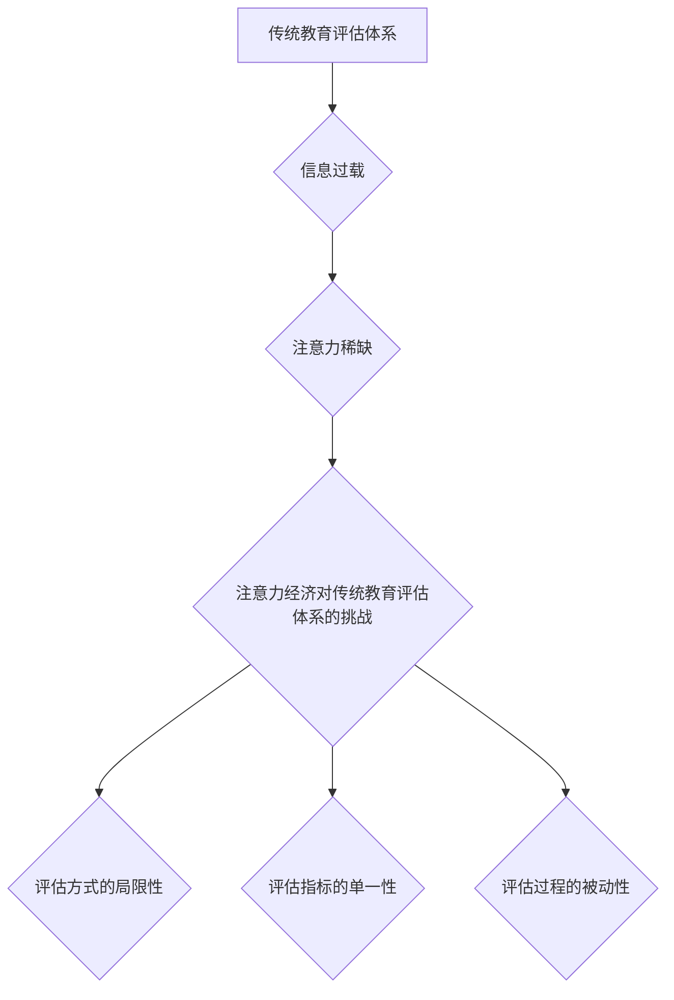

                 

## 1. 背景介绍

在当今信息爆炸的时代，人们面临着前所未有的信息过载。注意力，作为人类认知的核心资源，变得越来越稀缺。这种“注意力经济”的到来对传统教育评估体系提出了前所未有的挑战。

传统教育评估体系主要依赖于考试和作业等静态评估方式，这些方式难以全面反映学生的学习能力、思维方式和创新潜力。而注意力经济强调的是个体对信息的主动选择和深度理解，这与传统的被动接受式学习模式存在着本质的差异。

## 2. 核心概念与联系

### 2.1 注意力经济

注意力经济是指在信息过载的时代，注意力成为一种稀缺资源，而能够有效获取和利用注意力的能力成为重要的竞争优势。

* **信息过载:**  互联网和移动互联网的普及，使人们每天接触的信息量呈指数级增长，导致注意力分散，难以集中。
* **注意力稀缺:**  人们对信息的筛选能力有限，难以有效地过滤掉无关的信息，从而导致注意力稀缺。
* **注意力价值:**  能够有效地获取和利用注意力的能力，能够帮助人们更好地学习、工作和生活，因此注意力成为了重要的经济资源。

### 2.2 传统教育评估体系

传统教育评估体系主要通过以下方式来评估学生的学习成果：

* **考试:**  考试是评估学生知识掌握程度最常用的方式，但它往往只关注学生的记忆力和应试能力，难以反映学生的理解能力和应用能力。
* **作业:**  作业可以帮助学生巩固课堂学习内容，但它也存在着抄袭和依赖他人完成的风险。
* **课堂表现:**  课堂表现可以反映学生的学习态度和参与度，但它也受到教师主观评价的影响。

### 2.3  注意力经济对传统教育评估体系的挑战

注意力经济的到来对传统教育评估体系提出了以下挑战：

* **评估方式的局限性:**  传统的静态评估方式难以反映学生在信息时代所需的注意力集中、信息筛选和深度理解等能力。
* **评估指标的单一性:**  传统的评估指标往往只关注学生的知识掌握程度，而忽略了学生的思维方式、创新潜力和学习动机等重要因素。
* **评估过程的被动性:**  传统的评估过程往往是学生被动接受评估，而缺乏学生主动参与和反思的机会。

**Mermaid 流程图**



## 3. 核心算法原理 & 具体操作步骤

### 3.1  算法原理概述

为了应对注意力经济带来的挑战，我们需要探索新的教育评估方法，这些方法需要能够更加全面地反映学生的学习能力和潜力。

一种新的评估方法是基于注意力机制的评估方法。注意力机制是一种模仿人类注意力机制的算法，它能够帮助模型更好地理解和处理信息。

### 3.2  算法步骤详解

基于注意力机制的教育评估方法通常包括以下步骤：

1. **数据收集:**  收集学生的学习行为数据，例如学习时长、阅读量、点击次数、错误率等。
2. **数据预处理:**  对收集到的数据进行清洗、转换和特征提取。
3. **模型训练:**  使用注意力机制的算法模型，对预处理后的数据进行训练，学习学生的注意力模式和学习能力。
4. **评估结果生成:**  根据训练好的模型，对学生的学习行为数据进行预测和分析，生成学生的学习能力评估结果。

### 3.3  算法优缺点

**优点:**

* **更加全面:**  能够更加全面地反映学生的学习能力和潜力，包括学生的注意力集中能力、信息筛选能力和深度理解能力。
* **更加个性化:**  能够根据学生的学习行为数据，生成个性化的评估结果，帮助学生更好地了解自己的学习特点。
* **更加动态:**  能够实时监测学生的学习状态，及时发现学生的学习问题，并提供个性化的学习建议。

**缺点:**

* **数据依赖:**  基于注意力机制的评估方法需要大量的学习行为数据，而这些数据往往难以收集和获取。
* **算法复杂:**  注意力机制的算法模型比较复杂，需要专业的技术人员进行开发和维护。
* **伦理问题:**  基于注意力机制的评估方法可能会涉及到学生的隐私问题，需要谨慎处理。

### 3.4  算法应用领域

基于注意力机制的评估方法可以应用于以下领域:

* **个性化教育:**  根据学生的学习能力和特点，提供个性化的学习内容和学习路径。
* **学习效率提升:**  通过监测学生的注意力状态，帮助学生提高学习效率。
* **学习障碍诊断:**  通过分析学生的注意力模式，帮助诊断学习障碍。

## 4. 数学模型和公式 & 详细讲解 & 举例说明

### 4.1  数学模型构建

基于注意力机制的评估方法通常使用以下数学模型：

* **注意力权重:**  注意力权重表示模型对不同输入信息的关注程度。

$$
\alpha_i = \frac{exp(e_i)}{\sum_{j=1}^{n} exp(e_j)}
$$

其中，$e_i$ 表示第 $i$ 个输入信息的得分，$n$ 表示输入信息的总数。

* **加权求和:**  模型对输入信息进行加权求和，得到最终的输出。

$$
\mathbf{h} = \sum_{i=1}^{n} \alpha_i \mathbf{x}_i
$$

其中，$\mathbf{h}$ 表示最终的输出，$\mathbf{x}_i$ 表示第 $i$ 个输入信息。

### 4.2  公式推导过程

注意力权重的计算公式是基于softmax函数的，softmax函数将输入的得分转换为概率分布。

* **softmax函数:**

$$
softmax(x_i) = \frac{exp(x_i)}{\sum_{j=1}^{n} exp(x_j)}
$$

其中，$x_i$ 表示第 $i$ 个输入信息的得分。

### 4.3  案例分析与讲解

例如，在评估学生的阅读理解能力时，我们可以使用注意力机制来分析学生对文章不同部分的关注程度。

* **输入信息:**  文章的每个句子。
* **得分:**  模型根据句子的语义内容和与问题相关的程度，计算出每个句子的得分。
* **注意力权重:**  模型根据句子的得分，计算出每个句子的注意力权重。
* **加权求和:**  模型对文章的每个句子进行加权求和，得到最终的阅读理解得分。

## 5. 项目实践：代码实例和详细解释说明

### 5.1  开发环境搭建

* **操作系统:**  Linux/macOS/Windows
* **编程语言:**  Python
* **深度学习框架:**  TensorFlow/PyTorch
* **其他工具:**  Git、Jupyter Notebook

### 5.2  源代码详细实现

```python
import tensorflow as tf

# 定义注意力机制模型
class AttentionModel(tf.keras.Model):
    def __init__(self, units):
        super(AttentionModel, self).__init__()
        self.W1 = tf.keras.layers.Dense(units)
        self.W2 = tf.keras.layers.Dense(units)
        self.v = tf.keras.layers.Dense(1)

    def call(self, inputs):
        # 计算注意力权重
        scores = tf.nn.tanh(self.W1(inputs) + self.W2(tf.transpose(inputs, perm=[1, 0])))
        scores = self.v(scores)
        attention_weights = tf.nn.softmax(scores, axis=1)

        # 加权求和
        context_vector = tf.matmul(attention_weights, inputs)
        return context_vector

# 实例化模型
model = AttentionModel(units=128)

# 训练模型
# ...

# 使用模型进行预测
# ...
```

### 5.3  代码解读与分析

* **AttentionModel类:**  定义了注意力机制模型的结构。
* **W1和W2:**  两个全连接层，用于计算注意力权重。
* **v:**  一个全连接层，用于将计算出的注意力权重转换为概率分布。
* **call方法:**  模型的调用方法，用于计算注意力权重和加权求和。

### 5.4  运行结果展示

* **注意力权重分布:**  可以直观地看到模型对不同输入信息的关注程度。
* **预测结果:**  可以评估模型的预测准确率。

## 6. 实际应用场景

### 6.1  个性化教育

基于注意力机制的评估方法可以帮助教育机构提供个性化的学习内容和学习路径。例如，可以根据学生的注意力模式，推荐他们感兴趣的学习资源，或者调整学习节奏，帮助他们更好地掌握知识。

### 6.2  学习效率提升

基于注意力机制的评估方法可以帮助学生提高学习效率。例如，可以监测学生的注意力状态，提醒他们及时休息，或者提供个性化的学习建议，帮助他们更好地集中注意力。

### 6.3  学习障碍诊断

基于注意力机制的评估方法可以帮助诊断学习障碍。例如，可以通过分析学生的注意力模式，发现他们是否存在注意力缺陷/多动障碍 (ADHD) 等问题。

### 6.4  未来应用展望

未来，基于注意力机制的评估方法将会在教育领域得到更广泛的应用，例如：

* **虚拟现实/增强现实教育:**  利用虚拟现实和增强现实技术，创造更加沉浸式的学习环境，并根据学生的注意力模式，提供个性化的学习体验。
* **人工智能助教:**  开发人工智能助教，帮助学生进行学习规划、知识复习和问题解答，并根据学生的注意力模式，提供个性化的学习建议。
* **跨学科学习评估:**  评估学生在跨学科学习中的能力，例如，评估学生在阅读历史文献时，能够将历史知识与地理知识、政治知识等其他学科知识进行整合的能力。

## 7. 工具和资源推荐

### 7.1  学习资源推荐

* **书籍:**
    * 《深度学习》
    * 《注意力机制》
* **在线课程:**
    * Coursera: 深度学习
    * edX: 自然语言处理
* **博客:**
    * TensorFlow Blog
    * PyTorch Blog

### 7.2  开发工具推荐

* **深度学习框架:**
    * TensorFlow
    * PyTorch
* **编程语言:**
    * Python
* **数据可视化工具:**
    * Matplotlib
    * Seaborn

### 7.3  相关论文推荐

* **Attention Is All You Need**
* **BERT: Pre-training of Deep Bidirectional Transformers for Language Understanding**
* **Transformer-XL: Attentive Language Models Beyond a Fixed-Length Context**

## 8. 总结：未来发展趋势与挑战

### 8.1  研究成果总结

基于注意力机制的教育评估方法取得了显著的进展，能够更加全面地反映学生的学习能力和潜力。

### 8.2  未来发展趋势

未来，基于注意力机制的教育评估方法将会朝着以下方向发展：

* **更加个性化:**  根据学生的学习特点和需求，提供更加个性化的学习评估和建议。
* **更加实时:**  实时监测学生的学习状态，及时发现学习问题，并提供个性化的学习支持。
* **更加跨学科:**  评估学生在跨学科学习中的能力，例如，评估学生在阅读历史文献时，能够将历史知识与地理知识、政治知识等其他学科知识进行整合的能力。

### 8.3  面临的挑战

基于注意力机制的教育评估方法也面临着一些挑战：

* **数据获取和隐私保护:**  收集学生的学习行为数据需要考虑学生的隐私问题，需要制定相应的隐私保护机制。
* **算法复杂性和可解释性:**  注意力机制的算法模型比较复杂，需要进一步研究其可解释性，以便更好地理解模型的决策过程。
* **伦理问题:**  基于注意力机制的评估方法可能会涉及到学生的公平性、准确性和可信度等伦理问题，需要谨慎处理。

### 8.4  研究展望

未来，我们需要继续深入研究基于注意力机制的教育评估方法，解决其面临的挑战，并将其应用于更多的教育场景，为学生提供更加个性化、高效和公平的学习体验。

## 9. 附录：常见问题与解答

### 9.1  Q1:  注意力机制的原理是什么？

**A1:**  注意力机制是一种模仿人类注意力机制的算法，它能够帮助模型更好地理解和处理信息。

### 9.2  Q2:  基于注意力机制的教育评估方法有哪些优势？

**A2:**  基于注意力机制的教育评估方法能够更加全面地反映学生的学习能力和潜力，包括学生的注意力集中能力、信息筛选能力和深度理解能力。

### 9.3  Q3:  基于注意力机制的教育评估方法有哪些挑战？

**A3:**  基于注意力机制的教育评估方法面临着数据获取和隐私保护、算法复杂性和可解释性、伦理问题等挑战。


作者：禅与计算机程序设计艺术 / Zen and the Art of Computer Programming 
<end_of_turn>

