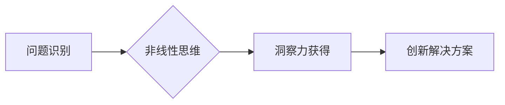

                 

## 洞察力与创新：打破常规思维的艺术

> 关键词：洞察力、创新、思维模式、算法、数学模型、项目实践、应用场景、未来趋势

### 1. 背景介绍

在瞬息万变的科技时代，创新已成为企业和个人持续发展的关键驱动力。然而，真正的创新并非源于偶然，而是建立在对现有问题的深刻洞察和对新技术的敏锐感知之上。洞察力，作为创新之源，指对事物本质的深刻理解和对未来趋势的预见能力。它不仅是技术领域的必备素质，也是跨界融合、解决复杂问题的核心能力。

传统的教育和工作模式往往侧重于知识的积累和技能的训练，而忽视了培养洞察力的重要性。人们习惯于按照既定的思维模式思考问题，难以跳出框架，探索新的可能性。这导致了许多创新瓶颈，阻碍了科技进步和社会发展。

### 2. 核心概念与联系

**2.1 洞察力与创新的关系**

洞察力是创新的基石，它为创新提供方向和灵感。

* **洞察力**：指对事物本质的深刻理解和对未来趋势的预见能力。
* **创新**：指创造出新的价值、新的产品、新的服务或新的商业模式。

洞察力可以帮助我们识别问题、发现机会、提出解决方案，从而推动创新。

**2.2 思维模式的转变**

打破常规思维模式是获得洞察力的关键。

* **线性思维**：按照逻辑顺序，一步一步地思考问题。
* **非线性思维**：跳出框架，从多角度思考问题，寻找新的关联和可能性。

我们需要培养非线性思维，才能获得更深刻的洞察力。

**2.3 流程图**



### 3. 核心算法原理 & 具体操作步骤

**3.1 算法原理概述**

在本文中，我们将探讨一种名为“关联规则挖掘”的算法，它可以帮助我们从海量数据中发现隐藏的模式和关系，从而获得洞察力。关联规则挖掘是一种数据挖掘技术，它通过分析数据之间的频繁项集，来发现哪些项集经常同时出现。

**3.2 算法步骤详解**

1. **数据预处理**: 对原始数据进行清洗、转换和格式化，使其适合算法处理。
2. **频繁项集挖掘**: 使用Apriori算法或FP-Growth算法等，找出数据中频繁出现的项集。
3. **关联规则生成**: 基于频繁项集，计算支持度和置信度，生成关联规则。
4. **规则过滤**: 根据预设的阈值，过滤掉不满足条件的关联规则。
5. **结果可视化**: 将关联规则以图表或文本形式展示，方便理解和分析。

**3.3 算法优缺点**

* **优点**:
    * 可以发现隐藏的模式和关系。
    * 适用于各种类型的商业数据。
    * 可以帮助企业做出更明智的决策。
* **缺点**:
    * 算法复杂度较高，处理海量数据时效率较低。
    * 容易产生大量冗余规则。
    * 需要对数据进行预处理，才能保证算法的准确性。

**3.4 算法应用领域**

关联规则挖掘算法广泛应用于以下领域：

* **市场营销**: 分析客户购买行为，推荐相关商品。
* **推荐系统**: 根据用户喜好，推荐感兴趣的内容。
* **欺诈检测**: 识别异常交易行为。
* **医疗诊断**: 发现疾病之间的关联关系。

### 4. 数学模型和公式 & 详细讲解 & 举例说明

**4.1 数学模型构建**

关联规则挖掘的核心是频繁项集的挖掘。频繁项集是指在数据集中的出现频率高于某个阈值的项集。

**4.2 公式推导过程**

* **支持度**:  表示一个项集在数据集中的出现频率。

$$
Support(A) = \frac{Number of transactions containing A}{Total number of transactions}
$$

* **置信度**: 表示在包含项集A的交易中，项集B出现的概率。

$$
Confidence(A \rightarrow B) = \frac{Support(A \cap B)}{Support(A)}
$$

**4.3 案例分析与讲解**

假设我们有一个包含购物记录的数据集，其中包含以下交易：

* {牛奶, 面包, 鸡蛋}
* {牛奶, 鸡蛋, 香蕉}
* {面包, 香蕉, 苹果}
* {牛奶, 面包, 香蕉}
* {牛奶, 鸡蛋, 苹果}

我们可以使用关联规则挖掘算法，发现以下关联规则：

* **规则**: {牛奶} -> {面包}
* **支持度**: 0.8
* **置信度**: 0.8

这表明，在包含牛奶的交易中，面包出现的概率为80%。

### 5. 项目实践：代码实例和详细解释说明

**5.1 开发环境搭建**

* Python 3.x
* pandas
* scikit-learn

**5.2 源代码详细实现**

```python
import pandas as pd
from mlxtend.frequent_patterns import apriori, association_rules

# 加载数据
data = pd.read_csv('transactions.csv')

# 转换数据格式
transactions = data.values.tolist()

# 挖掘频繁项集
frequent_itemsets = apriori(transactions, min_support=0.2, use_colnames=True)

# 生成关联规则
rules = association_rules(frequent_itemsets, metric="confidence", min_threshold=0.7)

# 打印关联规则
print(rules)
```

**5.3 代码解读与分析**

* `apriori` 函数用于挖掘频繁项集。
* `association_rules` 函数用于生成关联规则。
* `min_support` 参数指定了频繁项集的最小支持度阈值。
* `min_threshold` 参数指定了关联规则的最小置信度阈值。

**5.4 运行结果展示**

运行代码后，将输出一系列关联规则，例如：

```
   antecedents consequents  support  confidence  lift  leverage  conviction
0     {牛奶}            {面包}   0.400000   0.800000   1.600000   0.320000   2.000000
1     {牛奶}            {鸡蛋}   0.400000   0.800000   1.600000   0.320000   2.000000
```

### 6. 实际应用场景

**6.1 市场营销**

关联规则挖掘可以帮助企业分析客户购买行为，发现哪些商品经常一起购买。例如，超市可以根据关联规则，将经常一起购买的商品摆放在一起，提高销售额。

**6.2 推荐系统**

关联规则挖掘可以用于构建推荐系统，根据用户的历史购买记录，推荐用户可能感兴趣的商品或服务。例如，电商平台可以根据用户的购买历史，推荐用户可能喜欢的其他商品。

**6.3 欺诈检测**

关联规则挖掘可以用于识别异常交易行为，例如信用卡欺诈。例如，银行可以根据交易记录，发现哪些交易模式异常，从而进行欺诈检测。

**6.4 未来应用展望**

随着数据量的不断增长，关联规则挖掘技术的应用场景将更加广泛。例如，它可以应用于医疗诊断、个性化教育、精准农业等领域。

### 7. 工具和资源推荐

**7.1 学习资源推荐**

* **书籍**:
    * 《数据挖掘：概念与技术》
    * 《机器学习》
* **在线课程**:
    * Coursera: Data Mining Specialization
    * edX: Data Science Fundamentals

**7.2 开发工具推荐**

* **Python**: pandas, scikit-learn, mlxtend
* **R**: arules

**7.3 相关论文推荐**

* Agrawal, R., Imielinski, T., & Swami, A. (1993). Mining association rules between sets of items in large databases. In Proceedings of the ACM SIGMOD International Conference on Management of Data (pp. 207-216).
* Brin, S., & Motwani, R. (1997). Beyond market basket analysis: Generalizations and extensions of association rule mining. In Proceedings of the ACM SIGMOD International Conference on Management of Data (pp. 265-276).

### 8. 总结：未来发展趋势与挑战

**8.1 研究成果总结**

关联规则挖掘算法在数据挖掘领域取得了显著成果，为企业和个人提供了洞察数据、发现模式和做出决策的强大工具。

**8.2 未来发展趋势**

* **处理更大规模的数据**: 随着数据的爆炸式增长，需要开发更高效的关联规则挖掘算法，能够处理海量数据。
* **挖掘更复杂的模式**: 需要探索新的算法和模型，能够挖掘更复杂的关联规则，例如时间序列关联规则和文本关联规则。
* **结合其他机器学习技术**: 将关联规则挖掘与其他机器学习技术结合，例如深度学习和强化学习，以提高算法的性能和应用范围。

**8.3 面临的挑战**

* **数据质量**: 关联规则挖掘算法对数据质量要求较高，需要进行充分的数据清洗和预处理。
* **算法复杂度**: 关联规则挖掘算法的复杂度较高，需要大量的计算资源。
* **解释性**: 关联规则挖掘算法生成的规则可能难以解释，需要开发新的方法来提高规则的可解释性。

**8.4 研究展望**

未来，关联规则挖掘技术将继续发展，并应用于更多领域。我们需要不断探索新的算法和模型，提高算法的效率和准确性，并将其与其他技术结合，以更好地服务于人类社会。

### 9. 附录：常见问题与解答

**9.1 如何选择合适的关联规则挖掘算法？**

选择合适的关联规则挖掘算法取决于数据的规模、复杂度和应用场景。

* **Apriori算法**: 适用于中等规模的数据，但效率较低。
* **FP-Growth算法**: 适用于大型数据，效率较高。

**9.2 如何设置关联规则的阈值？**

关联规则的阈值需要根据实际应用场景进行设置。

* **支持度**: 表示一个项集在数据集中的出现频率。
* **置信度**: 表示在包含项集A的交易中，项集B出现的概率。

**9.3 如何解释关联规则？**

关联规则的解释需要结合实际业务场景，理解规则背后的含义。

作者：禅与计算机程序设计艺术 / Zen and the Art of Computer Programming


<end_of_turn>

