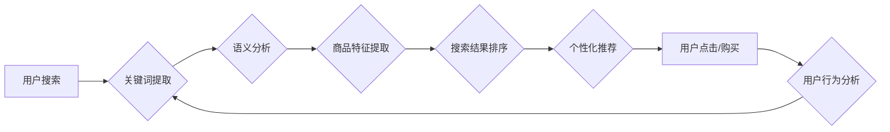

                 

## 深度学习在电商搜索引擎优化中的应用

> 关键词：深度学习、电商搜索引擎、推荐系统、自然语言处理、信息检索、用户行为分析、个性化搜索

## 1. 背景介绍

电商平台的搜索引擎是用户获取商品信息的关键入口，其搜索结果的质量直接影响着用户体验和平台的商业成功。传统的基于关键词匹配的搜索引擎在处理用户复杂的需求时往往表现不足，难以提供精准、个性化的搜索结果。近年来，深度学习技术在自然语言处理、计算机视觉等领域取得了突破性进展，为电商搜索引擎的优化提供了新的思路和方法。

深度学习能够从海量数据中学习用户行为模式、商品特征和搜索意图，从而实现更智能、更精准的搜索结果推荐。例如，深度学习可以用于：

* **理解用户搜索意图:**  深度学习模型可以分析用户输入的关键词、搜索历史、浏览记录等信息，识别用户的真实需求，并提供更相关的搜索结果。
* **个性化搜索结果:**  深度学习可以根据用户的兴趣偏好、购买历史、地理位置等信息，个性化推荐商品，提升用户体验。
* **商品特征提取:**  深度学习可以从商品图片、描述、评论等多模态数据中提取商品特征，帮助用户更快速、更准确地找到所需商品。
* **搜索结果排序:**  深度学习可以学习用户点击、购买等行为数据，对搜索结果进行排序，提升用户点击率和转化率。

## 2. 核心概念与联系

电商搜索引擎优化基于深度学习的核心概念包括：

* **自然语言处理 (NLP):**  用于理解和处理人类语言，例如关键词提取、文本分类、语义分析等。
* **信息检索 (IR):**  用于从海量数据中检索相关信息，例如关键词匹配、文本相似度计算、排名算法等。
* **推荐系统 (RS):**  用于根据用户的历史行为和偏好，推荐相关的商品或内容。
* **用户行为分析 (UBA):**  用于分析用户的搜索行为、浏览行为、购买行为等，以了解用户的需求和偏好。

这些概念相互关联，共同构成了深度学习在电商搜索引擎优化中的应用框架。

**Mermaid 流程图:**



## 3. 核心算法原理 & 具体操作步骤

### 3.1  算法原理概述

深度学习在电商搜索引擎优化中常用的算法包括：

* **卷积神经网络 (CNN):**  擅长处理图像数据，可以用于商品特征提取。
* **循环神经网络 (RNN):**  擅长处理序列数据，可以用于理解用户搜索历史和文本语义。
* **Transformer:**  一种新型的深度学习架构，可以有效处理长文本序列，在自然语言处理领域取得了突破性进展。

这些算法通过多层神经网络结构，学习数据中的复杂特征和模式，从而实现更精准的搜索结果推荐。

### 3.2  算法步骤详解

以商品特征提取为例，使用CNN算法的具体操作步骤如下：

1. **数据预处理:**  将商品图片进行尺寸调整、数据增强等预处理操作，使其适合CNN模型的输入。
2. **模型构建:**  搭建CNN模型，包含多个卷积层、池化层和全连接层。
3. **模型训练:**  使用训练数据训练CNN模型，通过反向传播算法调整模型参数，使其能够准确提取商品特征。
4. **模型评估:**  使用测试数据评估模型的性能，例如准确率、召回率等指标。
5. **模型部署:**  将训练好的模型部署到生产环境中，用于提取新商品的特征。

### 3.3  算法优缺点

**优点:**

* 能够学习数据中的复杂特征和模式，提升搜索结果的精准度。
* 可以处理多模态数据，例如文本、图片、视频等，提供更全面的商品信息。
* 能够根据用户行为进行个性化推荐，提升用户体验。

**缺点:**

* 需要大量的训练数据，训练成本较高。
* 模型训练时间较长，部署难度较大。
* 对硬件资源要求较高，需要强大的计算能力。

### 3.4  算法应用领域

深度学习在电商搜索引擎优化中的应用领域广泛，包括：

* **商品搜索:**  根据用户搜索关键词，提供精准的商品搜索结果。
* **商品推荐:**  根据用户的兴趣偏好和购买历史，推荐相关的商品。
* **个性化搜索:**  根据用户的个人信息和行为数据，提供个性化的搜索结果。
* **搜索结果排序:**  根据用户的点击、购买等行为数据，对搜索结果进行排序，提升用户体验。

## 4. 数学模型和公式 & 详细讲解 & 举例说明

### 4.1  数学模型构建

深度学习模型的构建通常基于神经网络架构，其中每个神经元都接收来自前一层神经元的输入，并通过激活函数进行处理，输出到下一层神经元。

**举例说明:**

一个简单的深度学习模型可以表示为：

$$
y = f(W_1x_1 + b_1)
$$

其中：

* $x_1$ 是输入数据
* $W_1$ 是权重矩阵
* $b_1$ 是偏置项
* $f$ 是激活函数
* $y$ 是输出结果

### 4.2  公式推导过程

深度学习模型的训练过程是通过优化模型参数来最小化损失函数的过程。损失函数通常定义为预测结果与真实结果之间的差异。

**举例说明:**

常用的损失函数包括均方误差 (MSE) 和交叉熵损失 (Cross-Entropy Loss)。

* **均方误差 (MSE):**

$$
MSE = \frac{1}{n}\sum_{i=1}^{n}(y_i - \hat{y}_i)^2
$$

其中：

* $y_i$ 是真实值
* $\hat{y}_i$ 是预测值
* $n$ 是样本数量

* **交叉熵损失 (Cross-Entropy Loss):**

$$
Cross-Entropy Loss = -\sum_{i=1}^{n}y_i \log(\hat{y}_i)
$$

其中：

* $y_i$ 是真实值
* $\hat{y}_i$ 是预测值

### 4.3  案例分析与讲解

以商品推荐为例，可以使用协同过滤算法构建深度学习模型。协同过滤算法基于用户的历史行为数据，预测用户对商品的评分或购买意愿。

**举例说明:**

可以使用矩阵分解技术将用户-商品交互矩阵分解成用户特征矩阵和商品特征矩阵，然后使用深度学习模型学习这些特征矩阵，从而实现商品推荐。

## 5. 项目实践：代码实例和详细解释说明

### 5.1  开发环境搭建

* **操作系统:**  Linux 或 macOS
* **编程语言:**  Python
* **深度学习框架:**  TensorFlow 或 PyTorch
* **其他工具:**  Git、Jupyter Notebook

### 5.2  源代码详细实现

以下是一个使用 TensorFlow 实现商品特征提取的简单代码示例：

```python
import tensorflow as tf

# 定义 CNN 模型
model = tf.keras.models.Sequential([
    tf.keras.layers.Conv2D(32, (3, 3), activation='relu', input_shape=(128, 128, 3)),
    tf.keras.layers.MaxPooling2D((2, 2)),
    tf.keras.layers.Conv2D(64, (3, 3), activation='relu'),
    tf.keras.layers.MaxPooling2D((2, 2)),
    tf.keras.layers.Flatten(),
    tf.keras.layers.Dense(10, activation='softmax')
])

# 编译模型
model.compile(optimizer='adam',
              loss='categorical_crossentropy',
              metrics=['accuracy'])

# 训练模型
model.fit(x_train, y_train, epochs=10)

# 评估模型
loss, accuracy = model.evaluate(x_test, y_test)
print('Loss:', loss)
print('Accuracy:', accuracy)
```

### 5.3  代码解读与分析

* **模型定义:**  代码定义了一个简单的 CNN 模型，包含卷积层、池化层和全连接层。
* **模型编译:**  使用 Adam 优化器、交叉熵损失函数和准确率作为评估指标编译模型。
* **模型训练:**  使用训练数据训练模型，训练 epochs 次。
* **模型评估:**  使用测试数据评估模型的性能，输出损失值和准确率。

### 5.4  运行结果展示

训练完成后，可以将模型应用于新商品的特征提取。

## 6. 实际应用场景

深度学习在电商搜索引擎优化中的应用场景广泛，例如：

* **淘宝:**  淘宝使用深度学习技术进行商品搜索、推荐和个性化搜索，提升用户体验。
* **京东:**  京东利用深度学习算法分析用户行为，提供精准的商品推荐和个性化服务。
* **亚马逊:**  亚马逊使用深度学习技术进行商品分类、搜索结果排序和推荐系统，提高搜索效率和转化率。

### 6.4  未来应用展望

未来，深度学习在电商搜索引擎优化中的应用将更加深入和广泛，例如：

* **多模态搜索:**  结合文本、图片、视频等多模态数据，提供更全面的商品信息和搜索体验。
* **实时搜索:**  利用实时数据流，实现对用户搜索意图的实时理解和响应。
* **跨语言搜索:**  突破语言障碍，实现跨语言的商品搜索和推荐。

## 7. 工具和资源推荐

### 7.1  学习资源推荐

* **书籍:**  
    * 深度学习
    * 自然语言处理
* **在线课程:**  
    * Coursera
    * edX
    * Udacity

### 7.2  开发工具推荐

* **深度学习框架:**  TensorFlow, PyTorch
* **数据处理工具:**  Pandas, NumPy
* **可视化工具:**  Matplotlib, Seaborn

### 7.3  相关论文推荐

* **Attention Is All You Need**
* **BERT: Pre-training of Deep Bidirectional Transformers for Language Understanding**
* **Recurrent Neural Network for Sequence Classification**

## 8. 总结：未来发展趋势与挑战

### 8.1  研究成果总结

深度学习技术在电商搜索引擎优化领域取得了显著成果，例如：

* **提升搜索精准度:**  深度学习模型能够学习用户搜索意图和商品特征，提供更精准的搜索结果。
* **个性化推荐:**  深度学习可以根据用户的兴趣偏好和购买历史，提供个性化的商品推荐。
* **提升用户体验:**  深度学习技术可以优化搜索结果排序、提供多模态搜索等功能，提升用户体验。

### 8.2  未来发展趋势

未来，深度学习在电商搜索引擎优化领域将继续发展，主要趋势包括：

* **多模态搜索:**  结合文本、图片、视频等多模态数据，提供更全面的商品信息和搜索体验。
* **实时搜索:**  利用实时数据流，实现对用户搜索意图的实时理解和响应。
* **跨语言搜索:**  突破语言障碍，实现跨语言的商品搜索和推荐。

### 8.3  面临的挑战

深度学习在电商搜索引擎优化领域也面临一些挑战，例如：

* **数据质量:**  深度学习模型的性能依赖于高质量的数据，而电商平台的数据往往存在噪声、不完整等问题。
* **模型解释性:**  深度学习模型的决策过程往往难以解释，这使得模型的应用受到限制。
* **计算资源:**  深度学习模型的训练和部署需要大量的计算资源，这对于中小电商平台来说是一个挑战。

### 8.4  研究展望

未来，需要进一步研究以下问题：

* 如何提高深度学习模型对低质量数据的鲁棒性。
* 如何提高深度学习模型的解释性，使其决策过程更加透明。
* 如何降低深度学习模型的计算资源需求，使其更易于部署。


## 9. 附录：常见问题与解答

**Q1: 深度学习在电商搜索引擎优化中有哪些优势？**

**A1:** 深度学习能够学习数据中的复杂特征和模式，提升搜索结果的精准度和个性化程度。

**Q2: 深度学习在电商搜索引擎优化中有哪些挑战？**

**A2:** 深度学习需要大量的训练数据，模型训练时间较长，对硬件资源要求较高。

**Q3: 如何学习深度学习技术？**

**A3:** 可以阅读相关书籍、参加在线课程、学习开源深度学习框架等。

**作者：禅与计算机程序设计艺术 / Zen and the Art of Computer Programming**<end_of_turn>

