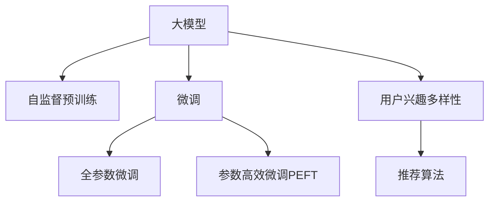

                 

# 大模型在推荐系统用户兴趣多样性建模中的作用

## 1. 背景介绍

在数字化时代，推荐系统成为互联网上连接用户与内容的重要桥梁。为了提供个性化、精准的推荐服务，推荐系统必须了解用户的兴趣和行为。然而，用户的兴趣是多方面的，涉及多种不同的信息源，包括浏览记录、点击行为、评价反馈等。如何有效建模用户兴趣的多样性，成为推荐系统研究的重要课题。近年来，基于大模型的推荐方法通过在海量数据上预训练获得强大的语义理解能力，能够更准确地捕捉用户的深层次兴趣，逐步成为推荐系统领域的主流技术。

### 1.1 推荐系统的发展历程

推荐系统经历了从基于规则、协同过滤到基于内容的演变过程。早期推荐系统主要依赖简单的规则进行推荐，如最相似邻居、基于图模型的协同过滤等，这些方法简单高效，但难以处理复杂的用户兴趣。后来，基于内容的推荐方法通过用户历史行为和项目属性进行推荐，更加灵活和可解释，但仍面临稀疏性问题。

近年来，随着深度学习技术的发展，基于深度学习的推荐系统逐渐兴起。其中，基于神经网络的推荐方法，如深度协同过滤、神经协同过滤等，能够处理大规模数据，并在推荐效果上显著优于传统方法。然而，这些方法往往依赖大量标注数据进行训练，无法满足实时推荐的需求，且难以捕捉用户兴趣的多样性。

### 1.2 大模型推荐系统的出现

大模型在推荐系统中的应用，源于其在自然语言处理(NLP)、图像处理等领域的广泛应用。通过在大规模无标签数据上进行预训练，大模型获得了强大的语义理解能力，能够在推荐任务中发挥重要作用。与传统的基于深度学习的推荐方法相比，基于大模型的推荐系统具有以下优势：

1. 自监督预训练：大模型在预训练阶段不需要标注数据，能够在大规模无标签数据上学习丰富的语义信息。
2. 泛化能力强：大模型能够泛化到多种不同的任务和数据类型，捕捉用户多样化的兴趣。
3. 参数高效性：大模型的参数量较大，但在微调过程中可以通过参数高效微调(PFPT)技术，只更新少量参数，避免过拟合。
4. 模型灵活性：大模型具备较强的模型灵活性，能够适应多种推荐策略，如基于内容、协同过滤、基于注意机制的推荐等。

### 1.3 本文贡献

本文将系统介绍大模型在推荐系统中的作用，特别是其对用户兴趣多样性建模的影响。通过结合最新的研究进展和实际案例，探讨大模型推荐系统的潜在优势和挑战，并提出未来的研究方向。本文旨在为推荐系统的研究者和开发者提供全面、深入的技术参考和实践指南。

## 2. 核心概念与联系

### 2.1 核心概念概述

为更好地理解大模型在推荐系统中的应用，本节将介绍几个密切相关的核心概念：

- **大模型（Large Models）**：以自回归模型（如GPT、BERT）和自编码模型（如BERT、T5）为代表的大规模预训练语言模型。通过在大规模无标签文本语料上进行预训练，学习到丰富的语言知识和常识，具备强大的语言理解和生成能力。

- **自监督学习（Self-Supervised Learning）**：在大规模无标签数据上，通过设计自监督任务（如掩码语言模型、下一个句子预测等）进行模型训练，使得模型能够自主学习语言规律，无需标注数据。

- **微调（Fine-Tuning）**：将预训练模型当作初始化参数，通过在有标签数据上进行有监督的训练，优化模型在特定任务上的性能。微调能够显著提升模型在特定任务上的表现。

- **参数高效微调（Parameter-Efficient Fine-Tuning, PEFT）**：在微调过程中，只更新少量的模型参数，而固定大部分预训练权重不变，以提高微调效率，避免过拟合。

- **用户兴趣多样性（User Interest Diversity）**：用户兴趣的多样性涉及多种不同的信息源和行为模式，包括浏览记录、点击行为、评价反馈等。如何有效建模用户兴趣的多样性，是推荐系统研究的重要课题。

- **推荐算法（Recommender Algorithms）**：包括基于内容的推荐、协同过滤、基于注意机制的推荐等，是推荐系统实现的核心技术。

这些核心概念之间的逻辑关系可以通过以下Mermaid流程图来展示：



这个流程图展示了大模型的核心概念及其之间的关系：

1. 大模型通过自监督预训练获得基础能力。
2. 微调是对预训练模型进行任务特定的优化，可以分为全参数微调和参数高效微调（PEFT）。
3. 用户兴趣多样性建模是推荐系统的核心任务。
4. 推荐算法将用户兴趣与项目特征进行匹配，生成推荐结果。
5. 参数高效微调可以显著提高微调效率，避免过拟合。

这些概念共同构成了大模型在推荐系统中的应用框架，使得推荐系统能够更好地理解和满足用户的多样化需求。

## 3. 核心算法原理 & 具体操作步骤

### 3.1 算法原理概述

基于大模型的推荐系统，本质上是一个有监督的细粒度迁移学习过程。其核心思想是：将预训练的大模型视作一个强大的"特征提取器"，通过在有标签数据上进行有监督的训练，优化模型在推荐任务上的性能。

具体而言，假设推荐任务 $T$ 的训练集为 $D=\{(x_i, y_i)\}_{i=1}^N$，其中 $x_i$ 为项目特征向量，$y_i$ 为用户对项目 $x_i$ 的评分。微调的目标是找到新的模型参数 $\hat{\theta}$，使得：

$$
\hat{\theta}=\mathop{\arg\min}_{\theta} \mathcal{L}(M_{\theta},D)
$$

其中 $\mathcal{L}$ 为针对任务 $T$ 设计的损失函数，用于衡量模型预测输出与真实标签之间的差异。常见的损失函数包括均方误差损失、交叉熵损失等。

通过梯度下降等优化算法，微调过程不断更新模型参数 $\theta$，最小化损失函数 $\mathcal{L}$，使得模型输出逼近真实标签。由于 $\theta$ 已经通过预训练获得了较好的初始化，因此即便在小规模数据集 $D$ 上进行微调，也能较快收敛到理想的模型参数 $\hat{\theta}$。

### 3.2 算法步骤详解

基于大模型的推荐系统一般包括以下几个关键步骤：

**Step 1: 准备预训练模型和数据集**

1. 选择合适的预训练语言模型 $M_{\theta}$ 作为初始化参数，如 BERT、GPT 等。
2. 准备推荐任务的标注数据集 $D$，划分为训练集、验证集和测试集。一般要求标注数据与预训练数据的分布不要差异过大。

**Step 2: 添加推荐目标函数**

1. 根据推荐任务类型，设计合适的输出层和损失函数。
2. 对于评分预测任务，通常在顶层添加线性回归器或评分函数，以均方误差为损失函数。
3. 对于二分类推荐任务，通常在顶层添加二元分类器，以交叉熵为损失函数。

**Step 3: 设置微调超参数**

1. 选择合适的优化算法及其参数，如 AdamW、SGD 等，设置学习率、批大小、迭代轮数等。
2. 设置正则化技术及强度，包括权重衰减、Dropout、Early Stopping 等。
3. 确定冻结预训练参数的策略，如仅微调顶层，或全部参数都参与微调。

**Step 4: 执行梯度训练**

1. 将训练集数据分批次输入模型，前向传播计算损失函数。
2. 反向传播计算参数梯度，根据设定的优化算法和学习率更新模型参数。
3. 周期性在验证集上评估模型性能，根据性能指标决定是否触发 Early Stopping。
4. 重复上述步骤直到满足预设的迭代轮数或 Early Stopping 条件。

**Step 5: 测试和部署**

1. 在测试集上评估微调后模型 $M_{\hat{\theta}}$ 的性能，对比微调前后的性能提升。
2. 使用微调后的模型对新样本进行推理预测，集成到实际的应用系统中。
3. 持续收集新的数据，定期重新微调模型，以适应数据分布的变化。

以上是基于大模型微调的推荐系统的一般流程。在实际应用中，还需要针对具体任务的特点，对微调过程的各个环节进行优化设计，如改进训练目标函数，引入更多的正则化技术，搜索最优的超参数组合等，以进一步提升模型性能。

### 3.3 算法优缺点

基于大模型的推荐系统具有以下优点：

1. **自监督学习能力**：大模型在预训练阶段无需标注数据，能够在大规模无标签数据上学习丰富的语义信息。
2. **泛化能力**：大模型能够泛化到多种不同的推荐任务和数据类型，捕捉用户多样化的兴趣。
3. **参数高效性**：大模型的参数量较大，但在微调过程中可以通过参数高效微调技术，只更新少量参数，避免过拟合。
4. **模型灵活性**：大模型具备较强的模型灵活性，能够适应多种推荐策略，如基于内容、协同过滤、基于注意机制的推荐等。

同时，该方法也存在以下局限性：

1. **依赖标注数据**：微调过程需要大量的标注数据，标注成本较高。
2. **模型复杂性**：大模型参数量较大，训练和推理需要高性能计算资源。
3. **可解释性不足**：大模型的决策过程通常缺乏可解释性，难以对其推理逻辑进行分析和调试。
4. **泛化能力有限**：当目标任务与预训练数据的分布差异较大时，微调的性能提升有限。

尽管存在这些局限性，但就目前而言，基于大模型的推荐方法仍是目前推荐系统的主流范式。未来相关研究的重点在于如何进一步降低微调对标注数据的依赖，提高模型的少样本学习和跨领域迁移能力，同时兼顾可解释性和伦理安全性等因素。

### 3.4 算法应用领域

基于大模型的推荐系统在推荐领域已经得到了广泛的应用，覆盖了推荐系统中的几乎所有任务，例如：

- **评分预测**：预测用户对项目的评分。
- **物品推荐**：推荐用户可能感兴趣的项目。
- **序列推荐**：推荐用户可能感兴趣的项目序列。
- **个性化推荐**：根据用户历史行为和兴趣推荐个性化项目。

除了上述这些经典任务外，大模型推荐系统还被创新性地应用到更多场景中，如可控文本生成、序列预测、多模态推荐等，为推荐系统带来了全新的突破。随着预训练模型和推荐方法的不断进步，相信推荐系统必将在更广阔的应用领域大放异彩。

## 4. 数学模型和公式 & 详细讲解 & 举例说明

### 4.1 数学模型构建

本节将使用数学语言对基于大模型的推荐系统进行更加严格的刻画。

假设推荐任务 $T$ 的训练集为 $D=\{(x_i, y_i)\}_{i=1}^N$，其中 $x_i$ 为项目特征向量，$y_i$ 为用户对项目 $x_i$ 的评分。定义模型 $M_{\theta}$ 在输入 $x$ 上的输出为 $\hat{y}=M_{\theta}(x)$，其中 $\theta \in \mathbb{R}^d$ 为模型参数。

定义模型 $M_{\theta}$ 在数据样本 $(x,y)$ 上的损失函数为 $\ell(M_{\theta}(x),y)$，则在数据集 $D$ 上的经验风险为：

$$
\mathcal{L}(\theta) = \frac{1}{N} \sum_{i=1}^N \ell(M_{\theta}(x_i),y_i)
$$

微调的优化目标是最小化经验风险，即找到最优参数：

$$
\theta^* = \mathop{\arg\min}_{\theta} \mathcal{L}(\theta)
$$

在实践中，我们通常使用基于梯度的优化算法（如SGD、Adam等）来近似求解上述最优化问题。设 $\eta$ 为学习率，$\lambda$ 为正则化系数，则参数的更新公式为：

$$
\theta \leftarrow \theta - \eta \nabla_{\theta}\mathcal{L}(\theta) - \eta\lambda\theta
$$

其中 $\nabla_{\theta}\mathcal{L}(\theta)$ 为损失函数对参数 $\theta$ 的梯度，可通过反向传播算法高效计算。

### 4.2 公式推导过程

以下我们以评分预测任务为例，推导均方误差损失函数及其梯度的计算公式。

假设模型 $M_{\theta}$ 在输入 $x$ 上的输出为 $\hat{y}=M_{\theta}(x)$，其中 $y \in \mathbb{R}$ 为用户对项目的真实评分。则均方误差损失函数定义为：

$$
\ell(M_{\theta}(x),y) = \frac{1}{2}(\hat{y} - y)^2
$$

将其代入经验风险公式，得：

$$
\mathcal{L}(\theta) = \frac{1}{2N} \sum_{i=1}^N (\hat{y_i} - y_i)^2
$$

根据链式法则，损失函数对参数 $\theta_k$ 的梯度为：

$$
\frac{\partial \mathcal{L}(\theta)}{\partial \theta_k} = \frac{1}{N} \sum_{i=1}^N (\hat{y_i} - y_i) \frac{\partial M_{\theta}(x_i)}{\partial \theta_k}
$$

其中 $\frac{\partial M_{\theta}(x_i)}{\partial \theta_k}$ 可进一步递归展开，利用自动微分技术完成计算。

在得到损失函数的梯度后，即可带入参数更新公式，完成模型的迭代优化。重复上述过程直至收敛，最终得到适应推荐任务的最优模型参数 $\theta^*$。

## 5. 项目实践：代码实例和详细解释说明

### 5.1 开发环境搭建

在进行推荐系统开发前，我们需要准备好开发环境。以下是使用Python进行PyTorch开发的环境配置流程：

1. 安装Anaconda：从官网下载并安装Anaconda，用于创建独立的Python环境。

2. 创建并激活虚拟环境：
```bash
conda create -n pytorch-env python=3.8 
conda activate pytorch-env
```

3. 安装PyTorch：根据CUDA版本，从官网获取对应的安装命令。例如：
```bash
conda install pytorch torchvision torchaudio cudatoolkit=11.1 -c pytorch -c conda-forge
```

4. 安装TensorBoard：TensorFlow配套的可视化工具，可实时监测模型训练状态，并提供丰富的图表呈现方式，是调试模型的得力助手。

5. 安装Weights & Biases：模型训练的实验跟踪工具，可以记录和可视化模型训练过程中的各项指标，方便对比和调优。与主流深度学习框架无缝集成。

完成上述步骤后，即可在`pytorch-env`环境中开始推荐系统开发。

### 5.2 源代码详细实现

这里我们以评分预测任务为例，给出使用Transformers库对BERT模型进行推荐系统微调的PyTorch代码实现。

首先，定义评分预测任务的模型：

```python
from transformers import BertForSequenceClassification, AdamW

class Recommender:
    def __init__(self, model_name='bert-base-cased', num_labels=1):
        self.model = BertForSequenceClassification.from_pretrained(model_name, num_labels=num_labels)
        self.optimizer = AdamW(self.model.parameters(), lr=2e-5)
        self.criterion = torch.nn.MSELoss()

    def forward(self, input_ids, attention_mask, labels):
        output = self.model(input_ids, attention_mask=attention_mask)
        return output, self.criterion(output, labels)

    def train_step(self, batch):
        input_ids, attention_mask, labels = batch
        output, loss = self.forward(input_ids, attention_mask, labels)
        self.optimizer.zero_grad()
        loss.backward()
        self.optimizer.step()
        return loss.item()

    def evaluate(self, dataloader):
        self.model.eval()
        with torch.no_grad():
            total_loss = 0
            total_preds = []
            for batch in dataloader:
                input_ids, attention_mask, labels = batch
                output, loss = self.forward(input_ids, attention_mask, labels)
                total_loss += loss.item()
                total_preds.append(output)
            return total_loss / len(dataloader), torch.stack(total_preds).mean().item()
```

然后，准备评分预测任务的训练集和测试集：

```python
from torch.utils.data import Dataset, DataLoader

class RecommenderDataset(Dataset):
    def __init__(self, data, tokenizer):
        self.data = data
        self.tokenizer = tokenizer
        
    def __len__(self):
        return len(self.data)
    
    def __getitem__(self, item):
        item = self.data[item]
        sequence = [item[0], item[1]]  # 输入和标签
        tokenized_input = self.tokenizer(sequence, return_tensors='pt', padding=True, truncation=True, max_length=128)
        return {key: tokenized_input[key].to(device) for key in tokenized_input}

# 数据处理函数
def collate_fn(batch):
    return {key: torch.stack([sample[key] for sample in batch]) for key in batch[0].keys()}

# 准备训练集和测试集
train_data = ...
test_data = ...

tokenizer = BertTokenizer.from_pretrained('bert-base-cased')
train_dataset = RecommenderDataset(train_data, tokenizer)
test_dataset = RecommenderDataset(test_data, tokenizer)

train_dataloader = DataLoader(train_dataset, batch_size=16, shuffle=True, collate_fn=collate_fn)
test_dataloader = DataLoader(test_dataset, batch_size=16, shuffle=False, collate_fn=collate_fn)
```

最后，启动训练流程并在测试集上评估：

```python
epochs = 5
batch_size = 16
device = torch.device('cuda') if torch.cuda.is_available() else torch.device('cpu')

for epoch in range(epochs):
    total_loss = 0
    for batch in train_dataloader:
        input_ids = batch['input_ids'].to(device)
        attention_mask = batch['attention_mask'].to(device)
        labels = batch['labels'].to(device)
        loss = self.train_step(batch)
        total_loss += loss
    print(f'Epoch {epoch+1}, train loss: {total_loss/len(train_dataloader)}')

    print(f'Epoch {epoch+1}, test loss: {self.evaluate(test_dataloader)[0]}')
```

以上就是使用PyTorch对BERT进行评分预测任务微调的完整代码实现。可以看到，得益于Transformers库的强大封装，我们可以用相对简洁的代码完成BERT模型的加载和微调。

### 5.3 代码解读与分析

让我们再详细解读一下关键代码的实现细节：

**Recommender类**：
- `__init__`方法：初始化BERT模型、优化器、损失函数。
- `forward`方法：前向传播计算模型的输出和损失。
- `train_step`方法：进行单批次训练，更新模型参数。
- `evaluate`方法：在测试集上评估模型性能，返回损失和预测值。

**RecommenderDataset类**：
- `__init__`方法：初始化训练集和测试集，分词器。
- `__len__`方法：返回数据集的样本数量。
- `__getitem__`方法：对单个样本进行处理，将输入和标签转换为分词器所需格式。

**数据处理函数collate_fn**：
- 用于对数据进行批次化处理，统一返回值的格式。

**训练流程**：
- 定义总的epoch数和batch size，开始循环迭代
- 每个epoch内，在训练集上进行训练，输出每个epoch的平均损失
- 在测试集上评估，输出测试集的平均损失

可以看到，PyTorch配合Transformers库使得BERT微调的代码实现变得简洁高效。开发者可以将更多精力放在数据处理、模型改进等高层逻辑上，而不必过多关注底层的实现细节。

当然，工业级的系统实现还需考虑更多因素，如模型的保存和部署、超参数的自动搜索、更灵活的任务适配层等。但核心的微调范式基本与此类似。

## 6. 实际应用场景

### 6.1 电商推荐

电商推荐系统通过分析用户的浏览记录、购买历史等行为数据，为用户推荐可能感兴趣的商品。大模型推荐系统能够从用户浏览的文本中学习其兴趣点，提供更加个性化的商品推荐。例如，亚马逊的推荐系统通过分析用户评论、搜索记录等文本数据，能够预测用户可能感兴趣的商品，提升销售额和用户体验。

### 6.2 视频推荐

视频推荐系统通过分析用户的观看历史和评分数据，为用户推荐可能感兴趣的视频内容。大模型推荐系统能够从视频标题、描述、标签等文本信息中捕捉用户的兴趣，提供更加精准的视频推荐。例如，YouTube的推荐系统通过分析用户观看的视频标题和评论，能够预测用户可能感兴趣的新视频，提升用户粘性和平台活跃度。

### 6.3 新闻推荐

新闻推荐系统通过分析用户的阅读历史和评论数据，为用户推荐可能感兴趣的新闻内容。大模型推荐系统能够从新闻标题、摘要、标签等文本信息中捕捉用户的兴趣，提供更加个性化的新闻推荐。例如，今日头条的推荐系统通过分析用户阅读的新闻标题和评论，能够预测用户可能感兴趣的新闻内容，提升用户阅读量和平台活跃度。

### 6.4 未来应用展望

随着大模型推荐系统的不断发展，其应用场景将更加多样化。未来，大模型推荐系统将在更多领域得到应用，为各行各业带来变革性影响。

在智慧医疗领域，推荐系统可以根据用户的健康数据和医疗记录，推荐个性化的医疗建议和药品，提升诊疗效果。

在智能教育领域，推荐系统可以根据学生的学习行为和成绩，推荐个性化的学习内容和方法，提升学习效果。

在智能交通领域，推荐系统可以根据用户的出行数据和偏好，推荐个性化的出行路线和方式，提升出行体验。

此外，在社交媒体、音乐、游戏等众多领域，大模型推荐系统也将不断涌现，为人们的生活带来更多便利和乐趣。相信随着技术的日益成熟，大模型推荐系统必将在更广阔的应用领域大放异彩，深刻影响人类的生活方式。

## 7. 工具和资源推荐

### 7.1 学习资源推荐

为了帮助开发者系统掌握大模型推荐系统的理论基础和实践技巧，这里推荐一些优质的学习资源：

1. 《Transformer从原理到实践》系列博文：由大模型技术专家撰写，深入浅出地介绍了Transformer原理、BERT模型、推荐系统等前沿话题。

2. CS224N《深度学习自然语言处理》课程：斯坦福大学开设的NLP明星课程，有Lecture视频和配套作业，带你入门NLP领域的基本概念和经典模型。

3. 《Natural Language Processing with Transformers》书籍：Transformers库的作者所著，全面介绍了如何使用Transformers库进行NLP任务开发，包括推荐系统的在内的诸多范式。

4. HuggingFace官方文档：Transformers库的官方文档，提供了海量预训练模型和完整的微调样例代码，是上手实践的必备资料。

5. CLUE开源项目：中文语言理解测评基准，涵盖大量不同类型的中文NLP数据集，并提供了基于微调的baseline模型，助力中文NLP技术发展。

通过对这些资源的学习实践，相信你一定能够快速掌握大模型推荐系统的精髓，并用于解决实际的推荐问题。

### 7.2 开发工具推荐

高效的开发离不开优秀的工具支持。以下是几款用于大模型推荐系统开发的常用工具：

1. PyTorch：基于Python的开源深度学习框架，灵活动态的计算图，适合快速迭代研究。大部分预训练语言模型都有PyTorch版本的实现。

2. TensorFlow：由Google主导开发的开源深度学习框架，生产部署方便，适合大规模工程应用。同样有丰富的预训练语言模型资源。

3. Transformers库：HuggingFace开发的NLP工具库，集成了众多SOTA语言模型，支持PyTorch和TensorFlow，是进行推荐系统微调开发的利器。

4. Weights & Biases：模型训练的实验跟踪工具，可以记录和可视化模型训练过程中的各项指标，方便对比和调优。与主流深度学习框架无缝集成。

5. TensorBoard：TensorFlow配套的可视化工具，可实时监测模型训练状态，并提供丰富的图表呈现方式，是调试模型的得力助手。

6. Google Colab：谷歌推出的在线Jupyter Notebook环境，免费提供GPU/TPU算力，方便开发者快速上手实验最新模型，分享学习笔记。

合理利用这些工具，可以显著提升大模型推荐系统的开发效率，加快创新迭代的步伐。

### 7.3 相关论文推荐

大模型推荐系统的研究源于学界的持续研究。以下是几篇奠基性的相关论文，推荐阅读：

1. Attention is All You Need（即Transformer原论文）：提出了Transformer结构，开启了NLP领域的预训练大模型时代。

2. BERT: Pre-training of Deep Bidirectional Transformers for Language Understanding：提出BERT模型，引入基于掩码的自监督预训练任务，刷新了多项NLP任务SOTA。

3. Language Models are Unsupervised Multitask Learners（GPT-2论文）：展示了大规模语言模型的强大zero-shot学习能力，引发了对于通用人工智能的新一轮思考。

4. Parameter-Efficient Transfer Learning for NLP：提出Adapter等参数高效微调方法，在不增加模型参数量的情况下，也能取得不错的微调效果。

5. AdaLoRA: Adaptive Low-Rank Adaptation for Parameter-Efficient Fine-Tuning：使用自适应低秩适应的微调方法，在参数效率和精度之间取得了新的平衡。

6. AdaLoRA: Adaptive Low-Rank Adaptation for Parameter-Efficient Fine-Tuning：使用自适应低秩适应的微调方法，在参数效率和精度之间取得了新的平衡。

这些论文代表了大模型推荐系统的发展脉络。通过学习这些前沿成果，可以帮助研究者把握学科前进方向，激发更多的创新灵感。

## 8. 总结：未来发展趋势与挑战

### 8.1 总结

本文对基于大模型的推荐系统进行了全面系统的介绍。首先阐述了大模型和推荐系统的研究背景和意义，明确了微调在拓展预训练模型应用、提升推荐系统性能方面的独特价值。其次，从原理到实践，详细讲解了基于大模型的推荐系统的工作原理和关键步骤，给出了推荐系统微调任务的完整代码实例。同时，本文还广泛探讨了大模型推荐系统在电商、视频、新闻等多个行业领域的应用前景，展示了其巨大的潜力。此外，本文精选了推荐系统的各类学习资源，力求为开发者提供全方位的技术指引。

通过本文的系统梳理，可以看到，基于大模型的推荐系统在推荐领域取得了显著的进展，能够更好地理解和满足用户的多样化需求。大模型的引入使得推荐系统具备更强的自监督学习能力、泛化能力和参数高效性，成为推荐系统的主流范式。未来，随着技术的发展和应用的深入，大模型推荐系统将在更多领域得到广泛应用，为各行各业带来变革性影响。

### 8.2 未来发展趋势

展望未来，大模型推荐系统将呈现以下几个发展趋势：

1. **自监督学习能力**：大模型在预训练阶段无需标注数据，能够在大规模无标签数据上学习丰富的语义信息。随着预训练技术的进步，大模型的自监督学习能力将进一步提升，推荐系统也将从中获益。

2. **多模态推荐**：未来的推荐系统将不仅仅依赖文本信息，还将融合图像、音频等多模态数据。大模型推荐系统能够处理多种模态数据，提供更加全面和精准的推荐结果。

3. **用户兴趣多样性建模**：用户兴趣的多样性涉及多种不同的信息源和行为模式，推荐系统需要更加全面地捕捉和建模。大模型推荐系统可以通过自然语言处理、图像处理等多种技术，全面建模用户的多样化兴趣。

4. **跨领域迁移能力**：推荐系统需要具备跨领域的迁移能力，能够在不同领域和任务中泛化。大模型推荐系统能够通过微调技术，快速适应新领域和任务，提升推荐效果。

5. **持续学习与增量学习**：推荐系统需要具备持续学习的能力，能够根据用户的新行为和反馈，动态更新推荐策略。大模型推荐系统可以通过微调和增量学习技术，不断优化推荐模型。

6. **参数高效与资源优化**：大模型推荐系统需要平衡模型精度和资源消耗。未来，更多参数高效和资源优化的技术将被引入，提升推荐系统的实时性和可扩展性。

以上趋势凸显了大模型推荐系统的广阔前景。这些方向的探索发展，必将进一步提升推荐系统的性能和应用范围，为各行各业带来新的机遇和挑战。

### 8.3 面临的挑战

尽管大模型推荐系统取得了显著进展，但在迈向更加智能化、普适化应用的过程中，仍面临诸多挑战：

1. **标注成本瓶颈**：尽管微调过程相比从头训练所需标注数据较少，但对于长尾应用场景，难以获得充足的高质量标注数据，成为制约微调性能的瓶颈。如何进一步降低微调对标注样本的依赖，将是一大难题。

2. **模型鲁棒性不足**：当前推荐模型面对域外数据时，泛化性能往往大打折扣。对于测试样本的微小扰动，推荐模型的预测也容易发生波动。如何提高推荐模型的鲁棒性，避免灾难性遗忘，还需要更多理论和实践的积累。

3. **推理效率有待提高**：大规模语言模型虽然精度高，但在实际部署时往往面临推理速度慢、内存占用大等效率问题。如何在保证性能的同时，简化模型结构，提升推理速度，优化资源占用，将是重要的优化方向。

4. **可解释性亟需加强**：当前推荐模型更像是"黑盒"系统，难以解释其内部工作机制和决策逻辑。对于医疗、金融等高风险应用，算法的可解释性和可审计性尤为重要。如何赋予推荐模型更强的可解释性，将是亟待攻克的难题。

5. **安全性有待保障**：预训练语言模型难免会学习到有偏见、有害的信息，通过推荐传递到用户，产生误导性、歧视性的输出，给实际应用带来安全隐患。如何从数据和算法层面消除模型偏见，避免恶意用途，确保输出的安全性，也将是重要的研究课题。

6. **知识整合能力不足**：现有的推荐模型往往局限于任务内数据，难以灵活吸收和运用更广泛的先验知识。如何让推荐过程更好地与外部知识库、规则库等专家知识结合，形成更加全面、准确的信息整合能力，还有很大的想象空间。

正视推荐系统面临的这些挑战，积极应对并寻求突破，将是大模型推荐系统走向成熟的必由之路。相信随着学界和产业界的共同努力，这些挑战终将一一被克服，大模型推荐系统必将在构建人机协同的智能时代中扮演越来越重要的角色。

### 8.4 研究展望

面对大模型推荐系统所面临的种种挑战，未来的研究需要在以下几个方面寻求新的突破：

1. **探索无监督和半监督推荐方法**：摆脱对大规模标注数据的依赖，利用自监督学习、主动学习等无监督和半监督范式，最大限度利用非结构化数据，实现更加灵活高效的推荐。

2. **研究参数高效和计算高效的推荐范式**：开发更加参数高效和计算高效的推荐方法，在固定大部分预训练参数的同时，只更新极少量的任务相关参数。同时优化推荐模型的计算图，减少前向传播和反向传播的资源消耗，实现更加轻量级、实时性的部署。

3. **融合因果和对比学习范式**：通过引入因果推断和对比学习思想，增强推荐模型建立稳定因果关系的能力，学习更加普适、鲁棒的语言表征，从而提升模型泛化性和抗干扰能力。

4. **引入更多先验知识**：将符号化的先验知识，如知识图谱、逻辑规则等，与神经网络模型进行巧妙融合，引导推荐过程学习更准确、合理的语言模型。同时加强不同模态数据的整合，实现视觉、语音等多模态信息与文本信息的协同建模。

5. **结合因果分析和博弈论工具**：将因果分析方法引入推荐模型，识别出模型决策的关键特征，增强输出解释的因果性和逻辑性。借助博弈论工具刻画人机交互过程，主动探索并规避模型的脆弱点，提高系统稳定性。

6. **纳入伦理道德约束**：在推荐模型训练目标中引入伦理导向的评估指标，过滤和惩罚有偏见、有害的输出倾向。同时加强人工干预和审核，建立模型行为的监管机制，确保输出符合人类价值观和伦理道德。

这些研究方向的探索，必将引领大模型推荐系统迈向更高的台阶，为构建安全、可靠、可解释、可控的推荐系统铺平道路。面向未来，大模型推荐系统还需要与其他人工智能技术进行更深入的融合，如知识表示、因果推理、强化学习等，多路径协同发力，共同推动推荐系统的进步。只有勇于创新、敢于突破，才能不断拓展推荐系统的边界，让智能技术更好地造福人类社会。

## 9. 附录：常见问题与解答

**Q1：大模型推荐系统是否适用于所有推荐任务？**

A: 大模型推荐系统在大多数推荐任务上都能取得不错的效果，特别是对于数据量较小的任务。但对于一些特定领域的任务，如医学、法律等，仅仅依靠通用语料预训练的模型可能难以很好地适应。此时需要在特定领域语料上进一步预训练，再进行微调，才能获得理想效果。此外，对于一些需要时效性、个性化很强的任务，如对话推荐、实时推荐等，微调方法也需要针对性的改进优化。

**Q2：微调过程中如何选择合适的学习率？**

A: 微调过程中，学习率的选择至关重要。通常情况下，微调的学习率要比预训练时小1-2个数量级，如果使用过大的学习率，容易破坏预训练权重，导致过拟合。一般建议从1e-5开始调参，逐步减小学习率，直至收敛。也可以使用warmup策略，在开始阶段使用较小的学习率，再逐渐过渡到预设值。需要注意的是，不同的优化器(如AdamW、Adafactor等)以及不同的学习率调度策略，可能需要设置不同的学习率阈值。

**Q3：采用大模型推荐时会面临哪些资源瓶颈？**

A: 目前主流的预训练大模型动辄以亿计的参数规模，对算力、内存、存储都提出了很高的要求。GPU/TPU等高性能设备是必不可少的，但即便如此，超大批次的训练和推理也可能遇到显存不足的问题。因此需要采用一些资源优化技术，如梯度积累、混合精度训练、模型并行等，来突破硬件瓶颈。同时，模型的存储和读取也可能占用大量时间和空间，需要采用模型压缩、稀疏化存储等方法进行优化。

**Q4：如何缓解推荐过程中的过拟合问题？**

A: 过拟合是推荐系统面临的主要挑战，尤其是在标注数据不足的情况下。常见的缓解策略包括：

1. 数据增强：通过回译、近义替换等方式扩充训练集
2. 正则化：使用L2正则、Dropout、Early Stopping等避免过拟合
3. 对抗训练：引入对抗样本，提高模型鲁棒性
4. 参数高效微调：只调整少量参数(如Adapter、Prefix等)，减小过拟合风险
5. 多模型集成：训练多个推荐模型，取平均输出，抑制过拟合

这些策略往往需要根据具体任务和数据特点进行灵活组合。只有在数据、模型、训练、推理等各环节进行全面优化，才能最大限度地发挥大模型推荐系统的威力。

**Q5：推荐算法在实际部署时需要注意哪些问题？**

A: 将推荐算法转化为实际应用，还需要考虑以下因素：

1. 模型裁剪：去除不必要的层和参数，减小模型尺寸，加快推理速度
2. 量化加速：将浮点模型转为定点模型，压缩存储空间，提高计算效率
3. 服务化封装：将模型封装为标准化服务接口，便于集成调用
4. 弹性伸缩：根据请求流量动态调整资源配置，平衡服务质量和成本
5. 监控告警：实时采集系统指标，设置异常告警阈值，确保服务稳定性
6. 安全防护：采用访问鉴权、数据脱敏等措施，保障数据和模型安全

大模型推荐系统为推荐系统带来了新的突破，但如何将强大的性能转化为稳定、高效、安全的业务价值，还需要工程实践的不断打磨。唯有从数据、算法、工程、业务等多个维度协同发力，才能真正实现推荐算法的落地应用。总之，推荐系统需要开发者根据具体任务，不断迭代和优化算法、数据和模型，方能得到理想的效果。

---

作者：禅与计算机程序设计艺术 / Zen and the Art of Computer Programming

