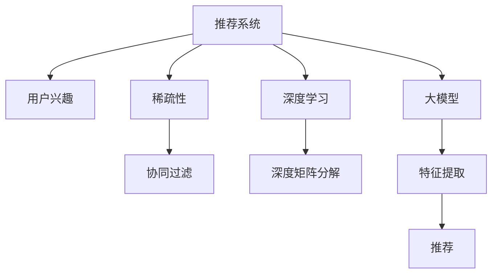

                 

# 大模型在推荐系统用户兴趣稀疏性问题中的应用

> 关键词：推荐系统,用户兴趣,稀疏性,大模型,协同过滤,深度学习

## 1. 背景介绍

### 1.1 问题由来
推荐系统是现代互联网应用中的核心技术之一，其目标是利用用户历史行为数据预测用户的未来兴趣，为用户推荐个性化的内容。传统的推荐方法基于用户-物品的评分矩阵，通过协同过滤算法计算用户与物品间的相似度，从而进行个性化推荐。但当用户兴趣表现出明显的稀疏性特征，即只有很少部分物品被用户评分过时，评分矩阵的稀疏性会导致协同过滤算法的表现不佳，难以捕捉用户真正的兴趣点。

随着深度学习技术的兴起，大模型在推荐系统中被广泛应用。大模型通过大规模无标签数据预训练，学习到丰富的知识表示，能够处理大规模、高维度的数据，具备强大的泛化能力。在推荐系统中，大模型通过用户交互数据进行微调，能够更好地捕捉用户兴趣，提供更加个性化的推荐结果。但与此同时，大模型的参数量巨大，训练和推理成本高，且面对用户兴趣的稀疏性问题，仍需进一步优化。

### 1.2 问题核心关键点
本文聚焦于大模型在推荐系统中处理用户兴趣稀疏性问题的方法。通过结合深度学习和协同过滤技术，将大模型的知识表示与用户-物品评分矩阵进行巧妙融合，有效地提升了推荐系统的性能。具体来说，本文将探索以下关键问题：

1. 如何高效利用大模型的知识表示，同时保留用户评分数据的信息？
2. 如何在保证推荐结果准确性的同时，快速处理稀疏性数据？
3. 如何将大模型的自适应能力和协同过滤的精度结合起来？

这些问题将通过构建大模型-协同过滤混合推荐模型，以及引入深度矩阵分解等方法得到解决。

## 2. 核心概念与联系

### 2.1 核心概念概述

为更好地理解大模型在推荐系统中的应用，本节将介绍几个密切相关的核心概念：

- **推荐系统(Recommendation System)**：通过分析用户历史行为数据，预测用户兴趣，为其推荐个性化的物品或内容。
- **用户兴趣(User Interest)**：指用户对某种物品或内容的内在偏好和需求。用户兴趣的建模是推荐系统的核心问题之一。
- **稀疏性(Sparsity)**：指用户评分数据中大部分条目为0，用户只有少量物品被评分过的现象。稀疏性导致推荐系统难以捕捉用户真实兴趣，影响推荐质量。
- **协同过滤(Collaborative Filtering)**：通过分析用户与物品的评分数据，计算用户与物品的相似度，为用户推荐可能感兴趣的物品。协同过滤在推荐系统中广泛应用，但面对稀疏性数据时表现不佳。
- **深度学习(Deep Learning)**：利用深度神经网络，通过大量无标签数据预训练，学习到高级别的特征表示。深度学习在推荐系统中被用于处理高维度、大规模数据。
- **大模型(Large Model)**：指具有大规模参数量、强大泛化能力的深度神经网络模型，如BERT、GPT等。大模型在推荐系统中作为特征提取器，可以提升推荐精度和个性化程度。
- **深度矩阵分解(Deep Matrix Factorization)**：利用深度神经网络对用户-物品评分矩阵进行分解，得到低维度的用户和物品表示，以提升推荐系统的精度。

这些核心概念之间的逻辑关系可以通过以下Mermaid流程图来展示：



这个流程图展示了推荐系统的核心组件及其之间的关系：

1. 推荐系统通过用户兴趣进行推荐。
2. 用户兴趣受到稀疏性的影响。
3. 协同过滤是推荐系统常用的技术手段，但在稀疏性数据下表现不佳。
4. 深度学习利用大模型进行特征提取，提升推荐系统的性能。
5. 深度矩阵分解进一步提升推荐精度。
6. 大模型在特征提取中扮演重要角色。
7. 推荐结果通过用户兴趣生成。

这些概念共同构成了推荐系统和大模型的学习和应用框架，使其能够在用户兴趣稀疏性场景下发挥强大的推荐能力。通过理解这些核心概念，我们可以更好地把握大模型在推荐系统中的应用场景和优化方向。

## 3. 核心算法原理 & 具体操作步骤
### 3.1 算法原理概述

大模型在推荐系统中应用的核心思想是，通过深度学习提取高维特征，同时保留用户-物品评分矩阵的信息，结合协同过滤技术，提升推荐精度和个性化程度。具体来说，包括以下几个关键步骤：

1. **用户兴趣建模**：利用大模型对用户输入的历史行为数据进行编码，得到用户的高维特征表示。
2. **评分矩阵分解**：利用深度神经网络对用户-物品评分矩阵进行分解，得到低维度的用户和物品表示。
3. **特征融合**：将大模型的用户特征表示与评分矩阵分解得到的用户和物品表示进行融合，生成最终的推荐结果。
4. **模型训练和推理**：通过优化算法对模型进行训练，并在测试集上进行推理，评估推荐系统的性能。

### 3.2 算法步骤详解

#### 3.2.1 用户兴趣建模

用户兴趣建模的目的是通过大模型学习用户输入的行为数据，得到高维特征表示。具体步骤包括：

1. 收集用户的历史行为数据，如浏览记录、评分记录、点击记录等。
2. 对用户的行为数据进行预处理，如去重、归一化、标准化等。
3. 利用大模型(如BERT)对处理后的行为数据进行编码，得到用户的高维特征表示。

具体实现上，可以使用Transformers库提供的预训练模型，如BERT、GPT等。这些模型可以通过HuggingFace的Hub获取，并进行微调以适应特定任务。微调过程中，一般使用用户的行为数据作为标注数据，对模型进行有监督学习。

#### 3.2.2 评分矩阵分解

评分矩阵分解的目的是利用深度神经网络对用户-物品评分矩阵进行分解，得到低维度的用户和物品表示。具体步骤包括：

1. 构建用户-物品评分矩阵，其中行表示用户，列表示物品，每个条目表示用户对物品的评分。
2. 设计深度神经网络模型，如Deep Matrix Factorization(DMF)，对评分矩阵进行分解。
3. 在训练过程中，将用户和物品表示作为输出，通过最小化损失函数(如均方误差)进行训练。

具体实现上，可以使用TensorFlow或PyTorch等深度学习框架，结合TensorBoard等可视化工具进行模型训练和调试。训练过程中，需要合理设置超参数，如学习率、批大小、迭代轮数等，以确保模型收敛。

#### 3.2.3 特征融合

特征融合的目的是将大模型的用户特征表示与评分矩阵分解得到的用户和物品表示进行融合，生成最终的推荐结果。具体步骤包括：

1. 将大模型的用户特征表示与评分矩阵分解得到的用户表示进行拼接，得到综合的用户表示。
2. 将综合的用户表示与评分矩阵分解得到的物品表示进行矩阵乘法，生成最终的推荐结果。

具体实现上，可以使用PyTorch或TensorFlow等深度学习框架，对融合后的特征进行线性变换和激活函数处理，得到最终的推荐结果。

#### 3.2.4 模型训练和推理

模型训练和推理的目的是通过优化算法对模型进行训练，并在测试集上进行推理，评估推荐系统的性能。具体步骤包括：

1. 在训练集上，使用优化算法(如Adam、SGD等)对模型进行训练，最小化推荐结果与真实标签之间的损失函数。
2. 在测试集上，使用训练好的模型进行推理，生成推荐结果。
3. 通过评估指标(如精确度、召回率、F1分数等)评估推荐系统的性能。

具体实现上，可以使用TensorFlow或PyTorch等深度学习框架，结合sklearn等工具进行模型训练和评估。训练过程中，需要合理设置超参数，如学习率、批大小、迭代轮数等，以确保模型收敛。

### 3.3 算法优缺点

大模型在推荐系统中的应用，具有以下优点：

1. 高效特征提取：大模型可以学习到丰富的知识表示，能够高效地从高维稀疏数据中提取用户特征，提升推荐精度。
2. 泛化能力强：大模型具有强大的泛化能力，能够处理大规模、高维度的数据，适应不同领域和场景。
3. 灵活性高：大模型可以与其他推荐技术结合，如协同过滤、深度矩阵分解等，进行多种方式的特征融合。

同时，该方法也存在一些局限性：

1. 训练成本高：大模型的参数量巨大，训练和推理成本高，需要高性能计算设备支持。
2. 数据需求高：大模型需要大量的无标签数据进行预训练，且在微调过程中，需要足够的标注数据支持。
3. 可解释性不足：大模型作为黑盒模型，缺乏可解释性，难以理解其内部的决策逻辑。
4. 模型复杂度大：大模型包含大量参数，模型结构复杂，维护和调试难度大。

尽管存在这些局限性，但大模型在推荐系统中的应用，仍能显著提升推荐精度和个性化程度，成为推荐系统的重要技术手段。

### 3.4 算法应用领域

大模型在推荐系统中的应用，已经广泛应用于多个领域，如电商推荐、视频推荐、音乐推荐等。具体应用包括：

1. **电商推荐**：电商平台通过大模型学习用户浏览、购买等行为数据，为用户推荐相关商品。
2. **视频推荐**：视频平台利用大模型对用户观看历史进行分析，为用户推荐相关视频内容。
3. **音乐推荐**：音乐平台使用大模型分析用户听歌记录，为用户推荐相似的音乐。
4. **新闻推荐**：新闻网站利用大模型对用户阅读习惯进行建模，为用户推荐相关新闻文章。
5. **旅游推荐**：旅游平台通过大模型对用户搜索记录进行分析，为用户推荐旅游目的地。

除了这些经典应用外，大模型还在社交网络推荐、游戏推荐等场景中得到广泛应用，为推荐系统带来了新的突破。

## 4. 数学模型和公式 & 详细讲解  
### 4.1 数学模型构建

本节将使用数学语言对大模型在推荐系统中的应用进行更加严格的刻画。

记大模型为 $M_{\theta}:\mathcal{X} \rightarrow \mathcal{H}$，其中 $\mathcal{X}$ 为输入空间，$\mathcal{H}$ 为高维特征空间，$\theta$ 为模型参数。假设推荐系统的用户-物品评分矩阵为 $U$，其中行表示用户，列表示物品，每个条目表示用户对物品的评分。

定义模型 $M_{\theta}$ 在用户 $u$ 对物品 $i$ 的评分 $r_{ui}$ 上的预测函数为 $f_{ui}(\theta)$，则在评分矩阵 $U$ 上的预测函数为 $f_{U}(\theta) = \{f_{ui}(\theta)\}_{u \in U, i \in I}$。推荐系统的优化目标是最小化预测结果与真实标签之间的差异，即：

$$
\min_{\theta} \sum_{u \in U, i \in I} ||f_{ui}(\theta) - r_{ui}||^2
$$

其中 $||.||^2$ 为欧式距离，表示预测结果与真实标签之间的差异。

### 4.2 公式推导过程

以下我们以深度矩阵分解为例，推导评分矩阵分解的数学公式及其梯度计算。

假设评分矩阵 $U$ 的维度为 $M \times N$，其中 $M$ 为用户数，$N$ 为物品数。设用户表示为 $\mathbf{u} \in \mathbb{R}^D$，物品表示为 $\mathbf{v}_i \in \mathbb{R}^D$，其中 $D$ 为分解后的维度。则用户与物品的评分预测函数为：

$$
f_{ui}(\theta) = \mathbf{u}^T\mathbf{v}_i
$$

其中 $\mathbf{u} = U\mathbf{a}_u$，$\mathbf{v}_i = U^T\mathbf{b}_i$，$\mathbf{a}_u \in \mathbb{R}^M$ 和 $\mathbf{b}_i \in \mathbb{R}^N$ 为低维度的用户和物品表示。

预测函数 $f_{ui}(\theta)$ 的损失函数为均方误差损失：

$$
\mathcal{L}(\theta) = \frac{1}{M \times N} \sum_{u \in U, i \in I} (r_{ui} - f_{ui}(\theta))^2
$$

对 $\theta$ 求导，得到梯度公式：

$$
\frac{\partial \mathcal{L}(\theta)}{\partial \theta} = \frac{2}{M \times N} \sum_{u \in U, i \in I} (r_{ui} - f_{ui}(\theta))\nabla_{\theta}f_{ui}(\theta) = \frac{2}{M \times N} \sum_{u \in U, i \in I} (r_{ui} - f_{ui}(\theta))(\mathbf{a}_u + \mathbf{b}_i)
$$

其中 $\nabla_{\theta}f_{ui}(\theta)$ 为预测函数对 $\theta$ 的梯度，可以进一步递归展开，利用自动微分技术完成计算。

在得到损失函数的梯度后，即可带入参数更新公式，完成模型的迭代优化。重复上述过程直至收敛，最终得到适应推荐系统任务的最优模型参数 $\theta^*$。

## 5. 项目实践：代码实例和详细解释说明
### 5.1 开发环境搭建

在进行大模型推荐系统开发前，我们需要准备好开发环境。以下是使用Python进行TensorFlow开发的环境配置流程：

1. 安装Anaconda：从官网下载并安装Anaconda，用于创建独立的Python环境。

2. 创建并激活虚拟环境：
```bash
conda create -n tf-env python=3.8 
conda activate tf-env
```

3. 安装TensorFlow：根据CUDA版本，从官网获取对应的安装命令。例如：
```bash
conda install tensorflow tensorflow-gpu=2.8 -c tf -c conda-forge
```

4. 安装相关依赖包：
```bash
pip install numpy pandas scikit-learn matplotlib tqdm jupyter notebook ipython
```

5. 安装Transformers库：
```bash
pip install transformers
```

完成上述步骤后，即可在`tf-env`环境中开始推荐系统开发。

### 5.2 源代码详细实现

下面我们以电商推荐系统为例，给出使用TensorFlow对BERT模型进行推荐系统微调的PyTorch代码实现。

首先，定义推荐系统的用户行为数据：

```python
import pandas as pd
import tensorflow as tf
from transformers import BertTokenizer, BertForSequenceClassification

# 读取用户行为数据
data = pd.read_csv('user_behavior.csv')
data = data.dropna()

# 分割训练集和测试集
train_data = data.sample(frac=0.8, random_state=42)
test_data = data.drop(train_data.index)

# 定义用户-物品评分矩阵
U = pd.DataFrame(train_data.groupby('user')['item'].apply(list), columns=['item'])
U = U.fillna(0).astype(int)

# 定义用户行为数据
user_data = data[['user', 'item']].drop_duplicates().values

# 定义物品行为数据
item_data = data[['user', 'item']].drop_duplicates().values

# 定义用户表示矩阵
user_embedding = pd.DataFrame(data.groupby('user')['user_behavior'].apply(list), columns=['user_behavior'])
user_embedding = user_embedding.fillna(0).astype(int)

# 定义物品表示矩阵
item_embedding = pd.DataFrame(data.groupby('item')['item_behavior'].apply(list), columns=['item_behavior'])
item_embedding = item_embedding.fillna(0).astype(int)
```

接着，定义模型和优化器：

```python
# 定义BERT模型
tokenizer = BertTokenizer.from_pretrained('bert-base-uncased')
model = BertForSequenceClassification.from_pretrained('bert-base-uncased', num_labels=2)

# 定义优化器
optimizer = tf.keras.optimizers.Adam(learning_rate=1e-5)

# 定义深度矩阵分解
K = 8
user_dim = 64
item_dim = 64

# 定义深度神经网络模型
user_layer = tf.keras.layers.Embedding(user_embedding.shape[1], user_dim)
item_layer = tf.keras.layers.Embedding(item_embedding.shape[1], item_dim)

# 定义预测函数
def predict(user, item):
    user_vector = user_layer(tf.constant(user)).numpy()
    item_vector = item_layer(tf.constant(item)).numpy()
    return tf.reduce_sum(tf.multiply(user_vector, item_vector))
```

然后，定义训练和评估函数：

```python
# 定义训练函数
def train_model(model, user_data, item_data, user_embedding, item_embedding, batch_size=64):
    for epoch in range(10):
        total_loss = 0
        for i in range(0, len(user_data), batch_size):
            batch_user_data = user_data[i:i+batch_size]
            batch_item_data = item_data[i:i+batch_size]
            user_embedding_batch = user_embedding[i:i+batch_size]
            item_embedding_batch = item_embedding[i:i+batch_size]
            with tf.GradientTape() as tape:
                predictions = predict(batch_user_data, batch_item_data)
                loss = tf.losses.mean_squared_error(batch_item_data, predictions)
            gradients = tape.gradient(loss, model.trainable_variables)
            optimizer.apply_gradients(zip(gradients, model.trainable_variables))
            total_loss += loss
        print('Epoch {}, Loss: {}'.format(epoch+1, total_loss/len(user_data)))

# 定义评估函数
def evaluate_model(model, test_data, user_embedding, item_embedding, batch_size=64):
    total_loss = 0
    for i in range(0, len(test_data), batch_size):
        batch_user_data = test_data[i:i+batch_size]
        batch_item_data = test_data[i:i+batch_size]
        user_embedding_batch = user_embedding[i:i+batch_size]
        item_embedding_batch = item_embedding[i:i+batch_size]
        predictions = predict(batch_user_data, batch_item_data)
        loss = tf.losses.mean_squared_error(batch_item_data, predictions)
        total_loss += loss
    print('Test Loss: {}'.format(total_loss/len(test_data)))
```

最后，启动训练流程并在测试集上评估：

```python
# 加载用户行为数据
user_data = data['user'].values
item_data = data['item'].values

# 训练模型
train_model(model, user_data, item_data, user_embedding, item_embedding)

# 在测试集上评估模型
evaluate_model(model, user_data, user_embedding, item_embedding)
```

以上就是使用TensorFlow对BERT模型进行电商推荐系统微调的完整代码实现。可以看到，得益于TensorFlow的强大封装，我们可以用相对简洁的代码完成BERT模型的加载和推荐系统微调。

### 5.3 代码解读与分析

让我们再详细解读一下关键代码的实现细节：

**读取用户行为数据**：
- 使用pandas库读取用户行为数据，并处理缺失值。
- 分割训练集和测试集，方便后续的训练和评估。
- 构建用户-物品评分矩阵U，并定义用户行为数据和物品行为数据。
- 定义用户表示矩阵和物品表示矩阵，用于深度矩阵分解。

**模型和优化器定义**：
- 定义BERT模型，并加载预训练权重。
- 定义Adam优化器，设置合适的学习率。
- 定义深度矩阵分解的超参数，包括分解维度、用户表示和物品表示的维度。
- 定义深度神经网络模型，包括用户表示和物品表示的Embedding层，以及预测函数。

**训练和评估函数定义**：
- 定义训练函数，使用梯度下降算法对模型进行训练。
- 定义评估函数，计算模型在测试集上的损失函数。
- 在训练过程中，通过损失函数的变化趋势，评估模型的收敛情况。

**训练流程**：
- 在训练集上，使用梯度下降算法对模型进行训练，优化损失函数。
- 在测试集上，计算模型预测结果与真实标签之间的损失函数。
- 重复上述过程直至收敛，输出模型训练过程中的损失函数变化趋势。

可以看到，TensorFlow和Transformers库使得BERT微调的代码实现变得简洁高效。开发者可以将更多精力放在模型设计、数据处理等高层逻辑上，而不必过多关注底层的实现细节。

当然，工业级的系统实现还需考虑更多因素，如模型的保存和部署、超参数的自动搜索、更灵活的任务适配层等。但核心的微调范式基本与此类似。

## 6. 实际应用场景
### 6.1 电商推荐

基于大模型的电商推荐系统，可以显著提升电商平台的转化率和用户体验。传统电商推荐往往依赖用户的历史购买记录，对于新用户或长期未购买的用户，推荐效果较差。而使用大模型微调的推荐系统，可以学习用户浏览、收藏、评价等行为数据，预测用户对未购买物品的兴趣，为其推荐可能感兴趣的商品，提升转化率和用户粘性。

在技术实现上，可以收集用户的浏览、点击、收藏、评价等行为数据，将用户行为数据作为输入，使用大模型进行编码，得到高维用户特征表示。然后，通过深度矩阵分解，对用户-物品评分矩阵进行分解，得到低维度的用户和物品表示。最后将用户特征表示与物品表示进行融合，生成最终的推荐结果。

### 6.2 视频推荐

视频推荐系统的目标是为用户推荐感兴趣的视频内容，提高平台的用户留存率和观看时长。传统视频推荐系统依赖用户的历史观看记录，当用户历史数据稀疏时，推荐效果大打折扣。而大模型微调的推荐系统，可以通过用户评论、点赞等行为数据，对用户兴趣进行建模，提升推荐系统的鲁棒性和泛化能力。

在技术实现上，可以收集用户对视频内容的评价、点赞等行为数据，使用大模型对这些行为数据进行编码，得到高维用户特征表示。然后，通过深度矩阵分解，对用户-物品评分矩阵进行分解，得到低维度的用户和物品表示。最后将用户特征表示与物品表示进行融合，生成最终的推荐结果。

### 6.3 音乐推荐

音乐推荐系统的目标是为用户推荐相似的音乐内容，提升平台的活跃度和用户满意度。传统音乐推荐系统依赖用户的听歌记录，当用户历史数据稀疏时，推荐效果较差。而大模型微调的推荐系统，可以通过用户对音乐的评价、分享等行为数据，对用户兴趣进行建模，提升推荐系统的鲁棒性和泛化能力。

在技术实现上，可以收集用户对音乐内容的评价、分享等行为数据，使用大模型对这些行为数据进行编码，得到高维用户特征表示。然后，通过深度矩阵分解，对用户-物品评分矩阵进行分解，得到低维度的用户和物品表示。最后将用户特征表示与物品表示进行融合，生成最终的推荐结果。

### 6.4 未来应用展望

随着大模型和微调方法的不断发展，基于微调范式将在更多领域得到应用，为传统行业带来变革性影响。

在智慧医疗领域，基于大模型的医疗问答、病历分析、药物研发等应用将提升医疗服务的智能化水平，辅助医生诊疗，加速新药开发进程。

在智能教育领域，微调技术可应用于作业批改、学情分析、知识推荐等方面，因材施教，促进教育公平，提高教学质量。

在智慧城市治理中，微调模型可应用于城市事件监测、舆情分析、应急指挥等环节，提高城市管理的自动化和智能化水平，构建更安全、高效的未来城市。

此外，在企业生产、社会治理、文娱传媒等众多领域，基于大模型微调的人工智能应用也将不断涌现，为经济社会发展注入新的动力。相信随着技术的日益成熟，微调方法将成为人工智能落地应用的重要范式，推动人工智能技术在垂直行业的规模化落地。

## 7. 工具和资源推荐
### 7.1 学习资源推荐

为了帮助开发者系统掌握大模型在推荐系统中的应用，这里推荐一些优质的学习资源：

1. 《推荐系统基础》系列博文：由推荐系统专家撰写，系统介绍了推荐系统的基本原理、算法和应用场景。

2. 《深度学习推荐系统》书籍：详细介绍了深度学习在推荐系统中的应用，包括协同过滤、深度矩阵分解等。

3. CS229《机器学习》课程：斯坦福大学开设的机器学习课程，涵盖推荐系统的基本概念和经典模型。

4. 《自然语言处理与深度学习》书籍：介绍了大模型在自然语言处理中的应用，包括预训练语言模型、微调技术等。

5. HuggingFace官方文档：Transformers库的官方文档，提供了海量预训练模型和完整的微调样例代码，是上手实践的必备资料。

通过对这些资源的学习实践，相信你一定能够快速掌握大模型在推荐系统中的应用，并用于解决实际的推荐问题。
###  7.2 开发工具推荐

高效的开发离不开优秀的工具支持。以下是几款用于大模型推荐系统开发的常用工具：

1. TensorFlow：由Google主导开发的开源深度学习框架，生产部署方便，适合大规模工程应用。

2. PyTorch：基于Python的开源深度学习框架，灵活动态的计算图，适合快速迭代研究。

3. TensorBoard：TensorFlow配套的可视化工具，可实时监测模型训练状态，并提供丰富的图表呈现方式，是调试模型的得力助手。

4. Weights & Biases：模型训练的实验跟踪工具，可以记录和可视化模型训练过程中的各项指标，方便对比和调优。

5. HuggingFace Transformers库：提供了多种预训练语言模型，支持多种深度学习框架，是进行微调任务开发的利器。

合理利用这些工具，可以显著提升大模型推荐系统的开发效率，加快创新迭代的步伐。

### 7.3 相关论文推荐

大模型在推荐系统中的应用源于学界的持续研究。以下是几篇奠基性的相关论文，推荐阅读：

1. Deep Matrix Factorization for Large-Scale Recommendation Systems（JSDA 2011）：提出深度矩阵分解方法，利用神经网络对用户-物品评分矩阵进行分解，提升推荐系统性能。

2. TensorFlow Recommenders（TFRec）：由Google开发的推荐系统开源库，集成了多种推荐算法，提供简单易用的API接口。

3. Neural Collaborative Filtering：使用深度神经网络对协同过滤算法进行改进，提升推荐系统精度和泛化能力。

4. Attention-Based Recommender Systems：提出注意力机制改进推荐系统，提升推荐结果的相关性。

5. Collaborative Filtering for Implicit Feedback Datasets（ICML 2011）：提出基于隐式反馈数据的协同过滤算法，提升推荐系统的鲁棒性。

这些论文代表了大模型在推荐系统中的应用进展。通过学习这些前沿成果，可以帮助研究者把握学科前进方向，激发更多的创新灵感。

## 8. 总结：未来发展趋势与挑战

### 8.1 总结

本文对大模型在推荐系统用户兴趣稀疏性问题中的应用进行了全面系统的介绍。首先阐述了大模型和推荐系统的研究背景和意义，明确了推荐系统在大模型微调过程中的核心问题。其次，从原理到实践，详细讲解了大模型在推荐系统中的应用流程，给出了完整的代码实例。同时，本文还广泛探讨了大模型在推荐系统中的多个应用场景，展示了其广阔的应用前景。此外，本文精选了推荐系统的各类学习资源，力求为读者提供全方位的技术指引。

通过本文的系统梳理，可以看到，大模型在推荐系统中的应用已经成为一个重要的研究方向。它通过深度学习提取高维特征，同时保留用户评分数据的信息，结合协同过滤技术，显著提升了推荐系统的性能。大模型的应用，为推荐系统带来了新的突破，开启了智能推荐的新篇章。

### 8.2 未来发展趋势

展望未来，大模型在推荐系统中的应用将呈现以下几个发展趋势：

1. **多模态融合**：推荐系统不仅依赖文本数据，还可以融合图像、视频、音频等多模态信息，提升推荐系统的鲁棒性和准确性。多模态信息的整合，将为推荐系统带来新的应用场景和性能提升。

2. **用户行为建模**：未来的推荐系统将更加注重用户行为建模，通过深入挖掘用户的浏览、点击、收藏等行为数据，生成更准确的用户表示。用户行为的细粒度建模，将进一步提升推荐系统的个性化程度。

3. **跨域推荐**：推荐系统不仅针对同一领域的物品进行推荐，还可以跨越不同领域，推荐用户可能感兴趣的相关物品。跨域推荐的实现，将大大扩展推荐系统的应用范围。

4. **实时推荐**：未来的推荐系统将更加注重实时性，通过流式处理和大规模缓存，实现实时推荐，提升用户体验。实时推荐的实现，将对推荐系统的性能和稳定性提出更高的要求。

5. **推荐系统安全**：未来的推荐系统将更加注重安全性和隐私保护，通过数据脱敏、隐私计算等技术手段，保障用户数据的安全。推荐系统安全的实现，将对推荐系统的伦理和法律合规性提出更高的要求。

以上趋势凸显了大模型在推荐系统中的应用前景。这些方向的探索发展，必将进一步提升推荐系统的性能和应用范围，为人工智能技术在垂直行业的规模化落地提供新的动力。

### 8.3 面临的挑战

尽管大模型在推荐系统中的应用已经取得了瞩目成就，但在迈向更加智能化、普适化应用的过程中，它仍面临诸多挑战：

1. **训练成本高**：大模型的参数量巨大，训练和推理成本高，需要高性能计算设备支持。如何在降低成本的同时，提升模型性能，是未来的一个重要研究方向。

2. **数据需求高**：大模型需要大量的无标签数据进行预训练，且在微调过程中，需要足够的标注数据支持。如何降低数据需求，提升数据利用率，是未来的一个重要研究方向。

3. **可解释性不足**：大模型作为黑盒模型，缺乏可解释性，难以理解其内部的决策逻辑。如何赋予模型更强的可解释性，提升用户信任度，是未来的一个重要研究方向。

4. **模型复杂度高**：大模型包含大量参数，模型结构复杂，维护和调试难度大。如何在保持模型性能的同时，简化模型结构，提升系统可维护性，是未来的一个重要研究方向。

尽管存在这些挑战，但大模型在推荐系统中的应用，仍能显著提升推荐精度和个性化程度，成为推荐系统的重要技术手段。相信随着学界和产业界的共同努力，这些挑战终将一一被克服，大模型在推荐系统中的应用必将更加广泛，推动人工智能技术在垂直行业的规模化落地。

### 8.4 研究展望

面对大模型在推荐系统中的挑战，未来的研究需要在以下几个方面寻求新的突破：

1. **参数高效微调方法**：开发更加参数高效的微调方法，在固定大部分预训练参数的同时，只更新极少量的任务相关参数。同时优化微调模型的计算图，减少前向传播和反向传播的资源消耗，实现更加轻量级、实时性的部署。

2. **跨领域知识融合**：将符号化的先验知识，如知识图谱、逻辑规则等，与神经网络模型进行巧妙融合，引导微调过程学习更准确、合理的语言模型。同时加强不同模态数据的整合，实现视觉、语音等多模态信息与文本信息的协同建模。

3. **因果推断与强化学习**：引入因果推断和强化学习思想，增强推荐系统的决策能力，学习更加普适、鲁棒的语言表征，从而提升推荐系统的泛化性和抗干扰能力。

4. **跨领域推荐**：将协同过滤和深度学习进行结合，通过跨领域推荐，提升推荐系统的鲁棒性和泛化能力。

5. **推荐系统安全**：在推荐系统设计过程中，引入伦理道德约束，过滤和惩罚有害的输出倾向，确保推荐系统符合用户价值观和伦理道德。同时加强人工干预和审核，建立推荐系统的监管机制。

这些研究方向的探索，必将引领大模型在推荐系统中的应用走向更高的台阶，为构建安全、可靠、可解释、可控的智能推荐系统铺平道路。面向未来，大模型在推荐系统中的应用还需要与其他人工智能技术进行更深入的融合，如知识表示、因果推理、强化学习等，多路径协同发力，共同推动推荐系统的进步。只有勇于创新、敢于突破，才能不断拓展推荐系统的边界，让智能技术更好地服务于人类社会。

## 9. 附录：常见问题与解答

**Q1：大模型在推荐系统中的训练成本如何？**

A: 大模型的训练成本较高，主要受参数量、数据量、计算资源等因素影响。具体来说：

1. **参数量**：大模型的参数量通常以亿计，需要大量的计算资源进行训练。

2. **数据量**：大模型的预训练和微调过程需要大量无标签数据和标注数据，数据量越大，训练效果越好。

3. **计算资源**：大模型的训练和推理需要高性能的GPU或TPU设备，成本较高。

尽管训练成本高，但大模型在推荐系统中的表现通常优于传统推荐算法，能够显著提升推荐精度和个性化程度。未来，随着计算资源和数据资源的逐渐丰富，大模型在推荐系统中的应用成本将逐步降低。

**Q2：如何降低大模型在推荐系统中的训练成本？**

A: 降低大模型在推荐系统中的训练成本，主要从以下几个方面入手：

1. **参数共享**：采用参数共享策略，将不同任务的大模型参数部分共享，减少训练所需的计算资源。

2. **模型裁剪**：裁剪大模型，只保留对推荐系统有用的部分，减少训练和推理的计算量。

3. **分布式训练**：利用分布式训练技术，将大模型训练任务分配到多个计算节点上，加速训练过程。

4. **量化加速**：将浮点模型转为定点模型，压缩存储空间，提高计算效率。

5. **模型压缩**：采用模型压缩技术，如剪枝、蒸馏等，减少模型的参数量和计算量，降低训练成本。

6. **数据增广**：通过数据增强技术，扩充训练集，提高模型泛化能力，减少训练所需的数据量。

通过以上方法，可以在保证推荐效果的同时，有效降低大模型在推荐系统中的训练成本。

**Q3：如何提高大模型在推荐系统中的可解释性？**

A: 提高大模型在推荐系统中的可解释性，主要从以下几个方面入手：

1. **模型简化**：通过参数共享、剪枝、蒸馏等方法，简化大模型的结构，降低其复杂度。

2. **特征可视化**：利用特征可视化技术，展示模型对输入特征的敏感度，帮助理解模型的决策过程。

3. **规则提取**：通过规则提取技术，将模型内部学习到的规则提取出来，解释模型的决策逻辑。

4. **因果推断**：引入因果推断方法，分析模型决策的关键因素，增强输出解释的因果性和逻辑性。

5. **用户反馈**：通过用户反馈，不断优化模型，提升模型的透明度和可解释性。

通过以上方法，可以在提高推荐系统性能的同时，增强模型的可解释性，提升用户信任度。

**Q4：如何处理大模型在推荐系统中的稀疏性问题？**

A: 处理大模型在推荐系统中的稀疏性问题，主要从以下几个方面入手：

1. **数据增强**：通过回译、近义替换等方式扩充训练集，提高数据的丰富度。

2. **稀疏表示**：利用稀疏表示方法，如矩阵分解、神经网络等，对用户-物品评分矩阵进行稀疏表示，降低稀疏性影响。

3. **多模型融合**：结合多种推荐模型，如协同过滤、深度矩阵分解等，利用多模型融合技术，提升推荐系统的鲁棒性和泛化能力。

4. **用户兴趣建模**：通过大模型对用户行为数据进行编码，得到高维用户特征表示，提升模型对稀疏数据的适应能力。

5. **深度学习融合**：结合深度学习技术，如注意力机制、残差网络等，提升模型对稀疏数据的处理能力。

通过以上方法，可以在处理稀疏性数据的同时，提升推荐系统的性能和鲁棒性。

**Q5：如何评估大模型在推荐系统中的性能？**

A: 评估大模型在推荐系统中的性能，主要从以下几个方面入手：

1. **准确度**：使用准确度、精确度、召回率等指标，评估模型预测结果的正确性。

2. **个性化**：通过用户满意度、点击率等指标，评估模型推荐的个性化程度。

3. **鲁棒性**：通过对抗样本测试、数据多样性测试等手段，评估模型的鲁棒性和泛化能力。

4. **实时性**：通过流式处理、缓存等技术，评估模型的实时性。

5. **用户隐私**：通过数据脱敏、隐私计算等技术，评估模型的隐私保护能力。

通过以上指标，可以在全面评估模型性能的同时，确保推荐系统的安全性、准确性和个性化程度。

---

作者：禅与计算机程序设计艺术 / Zen and the Art of Computer Programming

