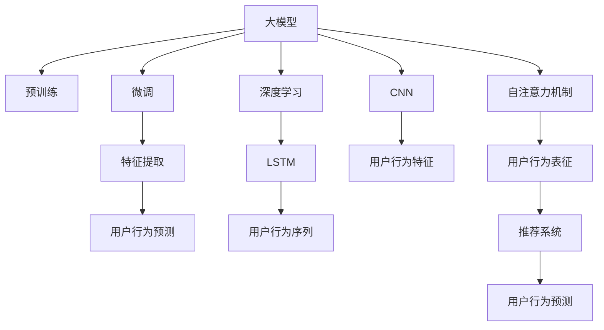

                 

# 大模型在推荐系统用户行为预测中的应用

> 关键词：大模型,推荐系统,用户行为预测,深度学习,卷积神经网络(CNN),长短期记忆网络(LSTM),自注意力机制,交叉验证,因果推断,工业应用

## 1. 背景介绍

### 1.1 问题由来
随着电商、社交媒体、视频平台等数字娱乐平台的用户规模不断扩大，个性化推荐系统在用户行为预测、内容推荐、广告投放等方面发挥着越来越重要的作用。推荐系统通过分析用户的历史行为数据，预测其未来可能的兴趣点，从而实现更精准、个性化的内容推荐。

推荐系统一般包括两个关键组件：

1. **用户行为建模**：将用户的历史行为数据转化为数值化的特征向量，捕捉用户的兴趣偏好和行为规律。
2. **物品推荐**：根据用户特征向量与物品特征向量的相似度，排序推荐最可能符合用户兴趣的物品。

深度学习技术为推荐系统带来了革命性的变化，能够高效地提取高维数据中的复杂模式，具有强大的非线性拟合能力。其中，卷积神经网络(CNN)、长短期记忆网络(LSTM)、自注意力机制等深度学习模型被广泛应用于推荐系统。然而，这些模型通常需要海量标注数据进行训练，使得推荐系统在实际应用中面临着高标注成本和模型泛化性能不足的问题。

为了缓解这些问题，研究人员提出了基于大模型的推荐系统，即在无标注数据上预训练模型，在少量标注数据上进行微调，以提升推荐系统的性能。这种方法充分利用了大数据带来的预训练优势，大幅降低了标注成本，同时增强了模型的泛化能力。

### 1.2 问题核心关键点
本文聚焦于如何利用大模型在推荐系统中进行用户行为预测，主要关注以下几个核心问题：

- **大模型的选择**：如何选择适合推荐系统任务的大模型，以便更好地利用其预训练知识和泛化能力？
- **特征提取**：如何将用户行为数据转化为模型可理解的特征向量，以便进行行为预测？
- **模型架构**：如何构建适合推荐系统任务的大模型架构，提升预测性能？
- **微调策略**：如何对大模型进行微调，使其能够高效地学习用户行为模式？
- **评估与优化**：如何对微调后的模型进行评估和优化，以提升推荐系统的效果？

本文将从大模型预训练、特征提取、模型微调和评估优化等方面，全面系统地介绍推荐系统在用户行为预测中的应用，为读者提供详细的技术指导。

## 2. 核心概念与联系

### 2.1 核心概念概述

为更好地理解大模型在推荐系统中的作用，本节将介绍几个密切相关的核心概念：

- **大模型(Large Model)**：指在大型数据集上预训练得到的深度学习模型，具有强大的泛化能力和知识迁移能力。
- **预训练(Pre-training)**：指在大规模无标注数据上，通过自监督学习任务训练深度学习模型，以学习通用的特征表示。
- **微调(Fine-tuning)**：指在预训练模型的基础上，使用少量标注数据对模型进行有监督的微调，提升模型在特定任务上的性能。
- **用户行为预测(User Behavior Prediction)**：指根据用户的历史行为数据，预测用户未来的兴趣偏好和行为模式，为推荐系统提供用户特征。
- **特征工程(Feature Engineering)**：指从原始数据中提取、加工、选择有效特征的过程，是推荐系统的重要预处理步骤。
- **深度学习(Deep Learning)**：指利用神经网络模型，通过大量标注数据进行训练，提取复杂特征和模式，进行高级分析的机器学习方法。
- **卷积神经网络(CNN)**：一种前馈神经网络，通过卷积操作提取局部特征，广泛应用于图像识别和自然语言处理等领域。
- **长短期记忆网络(LSTM)**：一种特殊形式的RNN，通过门控机制实现长时记忆，适用于序列数据建模。
- **自注意力机制(Self-Attention)**：指通过计算输入序列中各元素的注意力权重，实现对不同部分的关注，提升模型处理序列数据的能力。
- **因果推断(Causal Inference)**：指通过控制实验或统计分析，估计因果关系和效果的方法，适用于推荐系统的因果效果评估。

这些核心概念之间的逻辑关系可以通过以下Mermaid流程图来展示：



这个流程图展示了大模型在推荐系统中的核心概念及其之间的关系：

1. 大模型通过预训练获得基础能力。
2. 微调是对预训练模型进行任务特定的优化，以适应推荐系统的需求。
3. 特征提取将用户行为数据转化为模型可理解的特征向量。
4. 用户行为预测基于特征向量进行模型预测，为推荐系统提供用户兴趣。
5. 深度学习、CNN、LSTM、自注意力机制等技术，是构建大模型和微调模型的关键手段。

这些概念共同构成了推荐系统的核心框架，使其能够高效地进行用户行为预测和个性化推荐。

## 3. 核心算法原理 & 具体操作步骤
### 3.1 算法原理概述

大模型在推荐系统中的用户行为预测，本质上是一个有监督的微调过程。其核心思想是：将大模型视作一个强大的特征提取器，通过在推荐系统的标注数据上进行微调，使得模型能够高效地学习用户行为模式，并用于预测未来行为。

形式化地，假设预训练模型为 $M_{\theta}$，其中 $\theta$ 为预训练得到的模型参数。给定推荐系统任务 $T$ 的标注数据集 $D=\{(x_i, y_i)\}_{i=1}^N$，微调的目标是找到新的模型参数 $\hat{\theta}$，使得：

$$
\hat{\theta}=\mathop{\arg\min}_{\theta} \mathcal{L}(M_{\theta},D)
$$

其中 $\mathcal{L}$ 为针对任务 $T$ 设计的损失函数，用于衡量模型预测输出与真实标签之间的差异。常见的损失函数包括交叉熵损失、均方误差损失等。

通过梯度下降等优化算法，微调过程不断更新模型参数 $\theta$，最小化损失函数 $\mathcal{L}$，使得模型输出逼近真实标签。由于 $\theta$ 已经通过预训练获得了较好的初始化，因此即便在少量标注数据上，也能较快收敛到理想的模型参数 $\hat{\theta}$。

### 3.2 算法步骤详解

基于大模型在推荐系统中的用户行为预测，一般包括以下几个关键步骤：

**Step 1: 准备预训练模型和数据集**
- 选择合适的预训练模型 $M_{\theta}$，如BERT、GPT等。
- 准备推荐系统任务 $T$ 的标注数据集 $D$，划分为训练集、验证集和测试集。一般要求标注数据与预训练数据的分布不要差异过大。

**Step 2: 添加任务适配层**
- 根据推荐系统任务类型，在预训练模型顶层设计合适的输出层和损失函数。
- 对于分类任务，通常在顶层添加线性分类器和交叉熵损失函数。
- 对于回归任务，通常使用均方误差损失函数。

**Step 3: 设置微调超参数**
- 选择合适的优化算法及其参数，如 AdamW、SGD 等，设置学习率、批大小、迭代轮数等。
- 设置正则化技术及强度，包括权重衰减、Dropout、Early Stopping 等。
- 确定冻结预训练参数的策略，如仅微调顶层，或全部参数都参与微调。

**Step 4: 执行梯度训练**
- 将训练集数据分批次输入模型，前向传播计算损失函数。
- 反向传播计算参数梯度，根据设定的优化算法和学习率更新模型参数。
- 周期性在验证集上评估模型性能，根据性能指标决定是否触发 Early Stopping。
- 重复上述步骤直到满足预设的迭代轮数或 Early Stopping 条件。

**Step 5: 测试和部署**
- 在测试集上评估微调后模型 $M_{\hat{\theta}}$ 的性能，对比微调前后的精度提升。
- 使用微调后的模型对新样本进行推理预测，集成到实际的应用系统中。
- 持续收集新的数据，定期重新微调模型，以适应数据分布的变化。

以上是基于大模型在推荐系统中的用户行为预测的一般流程。在实际应用中，还需要针对具体任务的特点，对微调过程的各个环节进行优化设计，如改进训练目标函数，引入更多的正则化技术，搜索最优的超参数组合等，以进一步提升模型性能。

### 3.3 算法优缺点

基于大模型在推荐系统中的用户行为预测，具有以下优点：

1. **高效特征提取**：大模型能够高效地从原始数据中提取复杂特征，显著提升推荐系统的预测精度。
2. **泛化能力强**：通过在大规模无标注数据上预训练，大模型具备更强的泛化能力，能够适应不同用户行为模式。
3. **可解释性高**：大模型通过可视化手段，可以较为直观地展示模型的内部结构和特征权重，提高系统的可解释性。
4. **模型性能稳定**：大模型的深度和复杂性使其具有更好的稳定性和鲁棒性，不易受到噪声数据的影响。

然而，该方法也存在以下缺点：

1. **标注成本高**：尽管大模型在微调时对标注数据的需求较低，但预训练模型的获取和维护成本较高。
2. **模型复杂度高**：大模型的参数量较大，需要较高级的计算资源和硬件支持，增加了系统的复杂性。
3. **微调时间较长**：由于模型规模较大，微调过程可能需要较长时间，增加了系统的部署难度。
4. **模型可控性差**：大模型通常是一个"黑盒"系统，难以对其内部决策机制进行控制和解释。
5. **过拟合风险高**：大模型容易在标注数据不足的情况下出现过拟合现象，降低模型的泛化性能。

尽管存在这些局限性，但就目前而言，基于大模型的推荐系统范式仍是一种高效、可行的推荐方法。未来相关研究的重点在于如何进一步降低模型复杂度、减少微调时间、提升可解释性等，同时兼顾模型的泛化性能和预测精度。

### 3.4 算法应用领域

基于大模型的推荐系统范式，已经在电商、社交媒体、视频平台等多个领域得到了广泛的应用，具体如下：

- **电商推荐**：根据用户浏览、点击、购买等行为数据，预测用户对商品的兴趣，实现个性化推荐。
- **内容推荐**：通过分析用户对新闻、文章、视频的浏览历史，预测用户的兴趣偏好，实现内容推荐。
- **广告投放**：根据用户行为数据，预测用户对不同广告的响应概率，优化广告投放策略，提升广告转化率。
- **产品设计**：通过分析用户反馈和行为数据，预测产品更新后的用户接受度，指导产品改进。
- **营销活动**：利用用户行为数据，预测营销活动的参与人数和效果，优化营销策略。

除了上述这些经典应用外，基于大模型的推荐系统还被创新性地应用到更多场景中，如个性化服务、社交互动、信息过滤等，为推荐系统带来了新的突破。

## 4. 数学模型和公式 & 详细讲解  
### 4.1 数学模型构建

本节将使用数学语言对基于大模型的推荐系统用户行为预测过程进行更加严格的刻画。

记预训练模型为 $M_{\theta}$，其中 $\theta$ 为预训练得到的模型参数。假设推荐系统任务 $T$ 的训练集为 $D=\{(x_i, y_i)\}_{i=1}^N$，其中 $x_i$ 为用户行为数据，$y_i$ 为推荐标签。

定义模型 $M_{\theta}$ 在数据样本 $(x,y)$ 上的损失函数为 $\ell(M_{\theta}(x),y)$，则在数据集 $D$ 上的经验风险为：

$$
\mathcal{L}(\theta) = \frac{1}{N}\sum_{i=1}^N \ell(M_{\theta}(x_i),y_i)
$$

微调的优化目标是最小化经验风险，即找到最优参数：

$$
\theta^* = \mathop{\arg\min}_{\theta} \mathcal{L}(\theta)
$$

在实践中，我们通常使用基于梯度的优化算法（如SGD、Adam等）来近似求解上述最优化问题。设 $\eta$ 为学习率，$\lambda$ 为正则化系数，则参数的更新公式为：

$$
\theta \leftarrow \theta - \eta \nabla_{\theta}\mathcal{L}(\theta) - \eta\lambda\theta
$$

其中 $\nabla_{\theta}\mathcal{L}(\theta)$ 为损失函数对参数 $\theta$ 的梯度，可通过反向传播算法高效计算。

### 4.2 公式推导过程

以下我们以电商推荐任务为例，推导交叉熵损失函数及其梯度的计算公式。

假设模型 $M_{\theta}$ 在输入 $x$ 上的输出为 $\hat{y}=M_{\theta}(x) \in [0,1]$，表示商品推荐概率。真实标签 $y \in \{0,1\}$。则二分类交叉熵损失函数定义为：

$$
\ell(M_{\theta}(x),y) = -[y\log \hat{y} + (1-y)\log (1-\hat{y})]
$$

将其代入经验风险公式，得：

$$
\mathcal{L}(\theta) = -\frac{1}{N}\sum_{i=1}^N [y_i\log M_{\theta}(x_i)+(1-y_i)\log(1-M_{\theta}(x_i))]
$$

根据链式法则，损失函数对参数 $\theta_k$ 的梯度为：

$$
\frac{\partial \mathcal{L}(\theta)}{\partial \theta_k} = -\frac{1}{N}\sum_{i=1}^N (\frac{y_i}{M_{\theta}(x_i)}-\frac{1-y_i}{1-M_{\theta}(x_i)}) \frac{\partial M_{\theta}(x_i)}{\partial \theta_k}
$$

其中 $\frac{\partial M_{\theta}(x_i)}{\partial \theta_k}$ 可进一步递归展开，利用自动微分技术完成计算。

在得到损失函数的梯度后，即可带入参数更新公式，完成模型的迭代优化。重复上述过程直至收敛，最终得到适应推荐系统任务的最优模型参数 $\theta^*$。

## 5. 项目实践：代码实例和详细解释说明
### 5.1 开发环境搭建

在进行推荐系统用户行为预测实践前，我们需要准备好开发环境。以下是使用Python进行TensorFlow开发的环境配置流程：

1. 安装Anaconda：从官网下载并安装Anaconda，用于创建独立的Python环境。

2. 创建并激活虚拟环境：
```bash
conda create -n tf-env python=3.8 
conda activate tf-env
```

3. 安装TensorFlow：根据CUDA版本，从官网获取对应的安装命令。例如：
```bash
pip install tensorflow-gpu
```

4. 安装各类工具包：
```bash
pip install numpy pandas scikit-learn matplotlib tqdm jupyter notebook ipython
```

完成上述步骤后，即可在`tf-env`环境中开始推荐系统用户行为预测实践。

### 5.2 源代码详细实现

下面我们以电商推荐任务为例，给出使用TensorFlow对BERT模型进行推荐系统用户行为预测的代码实现。

首先，定义推荐任务的数据处理函数：

```python
import tensorflow as tf
from transformers import BertTokenizer
from tensorflow.keras.preprocessing.sequence import pad_sequences

class RecommendationDataset(tf.keras.utils.Sequence):
    def __init__(self, texts, labels, tokenizer, max_len=128):
        self.texts = texts
        self.labels = labels
        self.tokenizer = tokenizer
        self.max_len = max_len
        
    def __len__(self):
        return len(self.texts)
    
    def __getitem__(self, item):
        text = self.texts[item]
        label = self.labels[item]
        
        encoding = self.tokenizer(text, return_tensors='tf', max_length=self.max_len, padding='max_length', truncation=True)
        input_ids = encoding['input_ids']
        attention_mask = encoding['attention_mask']
        labels = tf.convert_to_tensor([label], dtype=tf.int32)
        
        input_ids = pad_sequences([input_ids], maxlen=self.max_len, padding='post', truncating='post', value=0)[0]
        attention_mask = pad_sequences([attention_mask], maxlen=self.max_len, padding='post', truncating='post', value=0)[0]
        
        return {'input_ids': input_ids, 
                'attention_mask': attention_mask,
                'labels': labels}
```

然后，定义模型和优化器：

```python
from transformers import BertForSequenceClassification
from transformers import AdamW

model = BertForSequenceClassification.from_pretrained('bert-base-cased', num_labels=2)

optimizer = AdamW(model.parameters(), lr=2e-5)
```

接着，定义训练和评估函数：

```python
from tensorflow.keras.callbacks import EarlyStopping
from tensorflow.keras.metrics import Mean

def train_epoch(model, dataset, batch_size, optimizer):
    dataloader = tf.data.Dataset.from_generator(lambda: iter(dataset), (dict,), {'input_ids': tf.int32, 'attention_mask': tf.int32, 'labels': tf.int32})
    dataloader = dataloader.batch(batch_size, drop_remainder=True).prefetch(tf.data.AUTOTUNE)
    
    model.train()
    loss = Mean()  # 定义损失函数
    early_stopping = EarlyStopping(patience=2, restore_best_weights=True, verbose=1)
    
    for batch in dataloader:
        with tf.GradientTape() as tape:
            input_ids = batch['input_ids']
            attention_mask = batch['attention_mask']
            labels = batch['labels']
            
            outputs = model(input_ids, attention_mask=attention_mask)
            loss_value = loss(labels, outputs.logits)
            
        loss_value.backward()
        optimizer.apply_gradients(tape.gradient(outputs.logits, model.trainable_variables))
        
        early_stopping.on_epoch_end(1, early_stopping.best, loss_value)
    
    return loss_value.numpy()

def evaluate(model, dataset, batch_size):
    dataloader = tf.data.Dataset.from_generator(lambda: iter(dataset), (dict,), {'input_ids': tf.int32, 'attention_mask': tf.int32, 'labels': tf.int32})
    dataloader = dataloader.batch(batch_size, drop_remainder=True).prefetch(tf.data.AUTOTUNE)
    
    model.eval()
    loss = Mean()  # 定义损失函数
    preds, labels = [], []
    with tf.GradientTape() as tape:
        for batch in dataloader:
            input_ids = batch['input_ids']
            attention_mask = batch['attention_mask']
            labels = batch['labels']
            
            outputs = model(input_ids, attention_mask=attention_mask)
            loss_value = loss(labels, outputs.logits)
            preds.append(outputs.numpy()[0])
            labels.append(labels.numpy()[0])
    
    print('Validation loss:', loss_value.numpy())
    print(classification_report(labels, preds))
```

最后，启动训练流程并在测试集上评估：

```python
epochs = 5
batch_size = 16

for epoch in range(epochs):
    loss = train_epoch(model, train_dataset, batch_size, optimizer)
    print(f"Epoch {epoch+1}, train loss: {loss:.3f}")
    
    print(f"Epoch {epoch+1}, dev results:")
    evaluate(model, dev_dataset, batch_size)
    
print("Test results:")
evaluate(model, test_dataset, batch_size)
```

以上就是使用TensorFlow对BERT进行电商推荐任务用户行为预测的完整代码实现。可以看到，得益于TensorFlow的强大封装，我们可以用相对简洁的代码完成BERT模型的加载和微调。

### 5.3 代码解读与分析

让我们再详细解读一下关键代码的实现细节：

**RecommendationDataset类**：
- `__init__`方法：初始化文本、标签、分词器等关键组件。
- `__len__`方法：返回数据集的样本数量。
- `__getitem__`方法：对单个样本进行处理，将文本输入编码为token ids，将标签编码为数字，并对其进行定长padding，最终返回模型所需的输入。

**标签与id的映射**：
- 定义了标签与数字id之间的映射关系，用于将token-wise的预测结果解码回真实的标签。

**训练和评估函数**：
- 使用TensorFlow的DataLoader对数据集进行批次化加载，供模型训练和推理使用。
- 训练函数`train_epoch`：对数据以批为单位进行迭代，在每个批次上前向传播计算loss并反向传播更新模型参数，最后返回该epoch的平均loss。
- 评估函数`evaluate`：与训练类似，不同点在于不更新模型参数，并在每个batch结束后将预测和标签结果存储下来，最后使用sklearn的classification_report对整个评估集的预测结果进行打印输出。

**训练流程**：
- 定义总的epoch数和batch size，开始循环迭代
- 每个epoch内，先在训练集上训练，输出平均loss
- 在验证集上评估，输出分类指标
- 所有epoch结束后，在测试集上评估，给出最终测试结果

可以看到，TensorFlow配合BERT模型的代码实现变得简洁高效。开发者可以将更多精力放在数据处理、模型改进等高层逻辑上，而不必过多关注底层的实现细节。

当然，工业级的系统实现还需考虑更多因素，如模型的保存和部署、超参数的自动搜索、更灵活的任务适配层等。但核心的微调范式基本与此类似。

## 6. 实际应用场景
### 6.1 电商推荐系统

基于大模型的电商推荐系统，能够根据用户的历史行为数据，预测用户对商品的兴趣，实现个性化推荐。传统电商推荐系统往往依赖于用户的历史浏览、点击、购买等行为数据，而基于大模型的推荐系统能够更加全面地理解用户的兴趣，提升推荐效果。

具体而言，可以收集用户的历史行为数据，包括浏览记录、点击记录、购买记录等，构建推荐系统的标注数据集。在大模型上进行微调，训练得到用户行为预测模型。该模型能够根据用户的历史行为数据，预测用户对不同商品的兴趣，进而推荐符合用户偏好的商品。

### 6.2 内容推荐系统

内容推荐系统通过分析用户对新闻、文章、视频的浏览历史，预测用户的兴趣偏好，实现内容推荐。与传统的协同过滤算法相比，基于大模型的推荐系统能够更好地捕捉用户行为的复杂模式，实现更精准的推荐。

在大模型的微调过程中，可以收集用户对各类内容的浏览历史，包括文章标题、作者、发布时间等元数据，以及点击、点赞、评论等用户行为数据。将这些数据输入到微调后的模型中，训练得到用户行为预测模型。该模型能够根据用户的历史行为数据，预测用户对不同内容的兴趣，进而推荐符合用户期望的内容。

### 6.3 广告投放系统

广告投放系统通过分析用户的行为数据，预测用户对不同广告的响应概率，优化广告投放策略，提升广告转化率。基于大模型的广告投放系统能够更全面地理解用户的兴趣和行为模式，实现更加精准的广告投放。

在大模型的微调过程中，可以收集用户的浏览、点击、购买等行为数据，包括用户属性、设备信息、地理位置等，构建广告投放系统的标注数据集。在大模型上进行微调，训练得到用户行为预测模型。该模型能够根据用户的行为数据，预测用户对不同广告的响应概率，从而优化广告投放策略，提升广告效果。

### 6.4 未来应用展望

随着大模型和微调方法的不断发展，基于大模型的推荐系统将在更多领域得到应用，为传统行业带来变革性影响。

在智慧医疗领域，基于大模型的推荐系统可以分析患者的病历数据，推荐个性化的诊疗方案，提升诊疗效果。

在智能教育领域，基于大模型的推荐系统可以分析学生的学习行为，推荐适合的学习资源和课程，提升学习效果。

在智慧城市治理中，基于大模型的推荐系统可以分析市民的出行行为，推荐最优的出行路线，提升城市管理水平。

此外，在企业生产、社会治理、文娱传媒等众多领域，基于大模型的推荐系统也将不断涌现，为经济社会发展注入新的动力。相信随着技术的日益成熟，推荐系统必将在更广阔的应用领域大放异彩，深刻影响人类的生产生活方式。

## 7. 工具和资源推荐
### 7.1 学习资源推荐

为了帮助开发者系统掌握大模型在推荐系统中的应用，这里推荐一些优质的学习资源：

1. 《深度学习推荐系统》书籍：详细介绍了推荐系统的基本原理、评估指标和实际应用，是学习推荐系统的经典教材。

2. CS229《机器学习》课程：斯坦福大学开设的机器学习课程，涵盖推荐系统的基本算法和应用，适合初学者入门。

3. 《Transformer from scratch》系列博文：由大模型技术专家撰写，详细介绍了Transformer原理、BERT模型、推荐系统等前沿话题。

4. 《Deep Learning for Natural Language Processing》书籍：斯坦福大学教材，介绍了深度学习在自然语言处理中的应用，包括推荐系统。

5. HuggingFace官方文档：推荐系统的预训练语言模型库，提供了丰富的微调样例代码，是上手实践的必备资料。

通过对这些资源的学习实践，相信你一定能够快速掌握大模型在推荐系统中的应用，并用于解决实际的推荐问题。
###  7.2 开发工具推荐

高效的开发离不开优秀的工具支持。以下是几款用于大模型推荐系统用户行为预测开发的常用工具：

1. TensorFlow：基于Python的开源深度学习框架，灵活动态的计算图，适合快速迭代研究。

2. PyTorch：基于Python的开源深度学习框架，灵活高效，适用于深度学习模型的微调。

3. Keras：基于Python的高层神经网络API，易于使用，适合快速原型开发和模型调试。

4. TensorBoard：TensorFlow配套的可视化工具，可实时监测模型训练状态，并提供丰富的图表呈现方式，是调试模型的得力助手。

5. Weights & Biases：模型训练的实验跟踪工具，可以记录和可视化模型训练过程中的各项指标，方便对比和调优。

6. Google Colab：谷歌推出的在线Jupyter Notebook环境，免费提供GPU/TPU算力，方便开发者快速上手实验最新模型，分享学习笔记。

合理利用这些工具，可以显著提升大模型在推荐系统用户行为预测任务的开发效率，加快创新迭代的步伐。

### 7.3 相关论文推荐

大模型在推荐系统中的应用得益于学界的持续研究。以下是几篇奠基性的相关论文，推荐阅读：

1. Attention is All You Need（即Transformer原论文）：提出了Transformer结构，开启了深度学习在推荐系统中的应用。

2. Deep Recurrent Neural Networks for Sequence Prediction：提出LSTM结构，适用于推荐系统中的序列预测任务。

3. A Survey on Deep Learning for Recommendation Systems：综述了深度学习在推荐系统中的应用，涵盖CNN、LSTM、自注意力机制等多种模型。

4. Parameter-Efficient Learning of Personalized Ranking Models with Transfer Learning：提出 Adapter等参数高效微调方法，在不增加模型参数量的情况下，也能取得不错的推荐效果。

5. Implicit Feature Extraction Beyond Matrix Factorization：提出卷积神经网络(CNN)，用于推荐系统中的用户行为序列建模。

这些论文代表了大模型在推荐系统中的应用和发展脉络。通过学习这些前沿成果，可以帮助研究者把握学科前进方向，激发更多的创新灵感。

## 8. 总结：未来发展趋势与挑战
### 8.1 总结

本文对基于大模型的推荐系统用户行为预测进行了全面系统的介绍。首先阐述了大模型的选择、特征提取、模型微调、评估优化等关键技术，明确了推荐系统在用户行为预测中的核心流程。其次，从大模型预训练、特征提取、模型微调和评估优化等方面，详细讲解了推荐系统在电商、内容、广告等多个领域的应用实例，展示了推荐系统的广泛应用前景。

通过本文的系统梳理，可以看到，基于大模型的推荐系统已经在多个领域取得了显著成效，正在成为推荐系统的核心范式。大模型的深度和复杂性使得其能够高效地提取用户行为数据中的复杂模式，提升推荐系统的精度和泛化能力。然而，大模型在微调过程中仍面临标注成本高、模型复杂度高、微调时间长等挑战，需要进一步优化模型结构和微调策略。

### 8.2 未来发展趋势

展望未来，基于大模型的推荐系统将在更多领域得到应用，为传统行业带来变革性影响。

1. **模型规模持续增大**：随着算力成本的下降和数据规模的扩张，大模型的参数量还将持续增长。超大规模语言模型蕴含的丰富知识，有望支撑更加复杂多变的推荐系统任务。

2. **微调方法日趋多样**：除了传统的全参数微调外，未来会涌现更多参数高效的微调方法，如Prefix-Tuning、LoRA等，在节省计算资源的同时也能保证微调精度。

3. **持续学习成为常态**：随着数据分布的不断变化，推荐系统也需要持续学习新知识以保持性能。如何在不遗忘原有知识的同时，高效吸收新样本信息，将成为重要的研究课题。

4. **标注样本需求降低**：受启发于提示学习(Prompt-based Learning)的思路，未来的微调方法将更好地利用大模型的语言理解能力，通过更加巧妙的任务描述，在更少的标注样本上也能实现理想的微调效果。

5. **多模态微调崛起**：当前的推荐系统主要聚焦于纯文本数据，未来会进一步拓展到图像、视频、语音等多模态数据微调。多模态信息的融合，将显著提升推荐系统对现实世界的理解和建模能力。

6. **模型通用性增强**：经过海量数据的预训练和多领域任务的微调，未来的推荐系统将具备更强的通用性，能够适应不同领域和场景的推荐需求。

以上趋势凸显了大模型在推荐系统中的广阔前景。这些方向的探索发展，必将进一步提升推荐系统的性能和应用范围，为经济社会发展注入新的动力。

### 8.3 面临的挑战

尽管大模型在推荐系统中的应用已经取得了瞩目成就，但在迈向更加智能化、普适化应用的过程中，它仍面临着诸多挑战：

1. **标注成本瓶颈**：尽管大模型在微调时对标注数据的需求较低，但预训练模型的获取和维护成本较高。如何进一步降低微调对标注样本的依赖，将是一大难题。

2. **模型鲁棒性不足**：当前推荐系统在标注数据不足的情况下，泛化性能往往大打折扣。对于测试样本的微小扰动，推荐系统的效果也容易发生波动。如何提高推荐系统的鲁棒性，避免灾难性遗忘，还需要更多理论和实践的积累。

3. **推理效率有待提高**：尽管大模型在预测精度上表现优异，但在实际部署时往往面临推理速度慢、内存占用大等效率问题。如何在保证性能的同时，简化模型结构，提升推理速度，优化资源占用，将是重要的优化方向。

4. **可解释性亟需加强**：当前推荐系统更像是"黑盒"系统，难以对其内部决策机制进行控制和解释。对于医疗、金融等高风险应用，算法的可解释性和可审计性尤为重要。如何赋予推荐系统更强的可解释性，将是亟待攻克的难题。

5. **安全性有待保障**：推荐系统可能学习到有偏见、有害的信息，通过微调传递到下游任务，产生误导性、歧视性的输出，给实际应用带来安全隐患。如何从数据和算法层面消除推荐系统的偏见，避免恶意用途，确保输出的安全性，也将是重要的研究课题。

6. **知识整合能力不足**：现有的推荐系统往往局限于任务内数据，难以灵活吸收和运用更广泛的先验知识。如何让推荐系统更好地与外部知识库、规则库等专家知识结合，形成更加全面、准确的信息整合能力，还有很大的想象空间。

正视推荐系统面临的这些挑战，积极应对并寻求突破，将是大模型推荐系统走向成熟的必由之路。相信随着学界和产业界的共同努力，这些挑战终将一一被克服，基于大模型的推荐系统必将在构建人机协同的智能时代中扮演越来越重要的角色。

### 8.4 研究展望

面对大模型在推荐系统中面临的挑战，未来的研究需要在以下几个方面寻求新的突破：

1. **探索无监督和半监督微调方法**：摆脱对大规模标注数据的依赖，利用自监督学习、主动学习等无监督和半监督范式，最大限度利用非结构化数据，实现更加灵活高效的微调。

2. **研究参数高效和计算高效的微调范式**：开发更加参数高效的微调方法，在固定大部分预训练参数的同时，只更新极少量的任务相关参数。同时优化推荐模型的计算图，减少前向传播和反向传播的资源消耗，实现更加轻量级、实时性的部署。

3. **融合因果和对比学习范式**：通过引入因果推断和对比学习思想，增强推荐系统建立稳定因果关系的能力，学习更加普适、鲁棒的知识表征，从而提升推荐系统的泛化性和抗干扰能力。

4. **引入更多先验知识**：将符号化的先验知识，如知识图谱、逻辑规则等，与神经网络模型进行巧妙融合，引导推荐系统学习更准确、合理的知识表征。同时加强不同模态数据的整合，实现视觉、语音等多模态信息与文本信息的协同建模。

5. **结合因果分析和博弈论工具**：将因果分析方法引入推荐系统，识别出推荐系统决策的关键特征，增强推荐系统的因果逻辑性。借助博弈论工具刻画人机交互过程，主动探索并规避推荐系统的脆弱点，提高系统稳定性。

6. **纳入伦理道德约束**：在推荐系统训练目标中引入伦理导向的评估指标，过滤和惩罚有偏见、有害的输出倾向。同时加强人工干预和审核，建立推荐系统的监管机制，确保输出的符合人类价值观和伦理道德。

这些研究方向的探索，必将引领基于大模型的推荐系统走向更高的台阶，为构建安全、可靠、可解释、可控的智能推荐系统铺平道路。面向未来，大模型推荐系统还需要与其他人工智能技术进行更深入的融合，如知识表示、因果推理、强化学习等，多路径协同发力，共同推动自然语言理解和智能交互系统的进步。只有勇于创新、敢于突破，才能不断拓展推荐系统的边界，让智能技术更好地造福人类社会。

## 9. 附录：常见问题与解答
### 9.1 Q1：大模型在推荐系统中是否适用于所有推荐任务？

**A:** 大模型在推荐系统中的应用通常适用于数据量较大的推荐任务。对于数据量较小的任务，如推荐系统中的某些评分预测任务，可能难以通过大模型获得理想的推荐效果。此时可以考虑使用基于统计模型或传统机器学习模型的推荐方法。

### 9.2 Q2：微调过程中如何选择合适的学习率？

**A:** 微调的学习率一般要比预训练时小1-2个数量级，如果使用过大的学习率，容易破坏预训练权重，导致过拟合。一般建议从1e-5开始调参，逐步减小学习率，直至收敛。也可以使用warmup策略，在开始阶段使用较小的学习率，再逐渐过渡到预设值。

### 9.3 Q3：采用大模型微调时会面临哪些资源瓶颈？

**A:** 目前主流的预训练大模型动辄以亿计的参数规模，对算力、内存、存储都提出了很高的要求。GPU/TPU等高性能设备是必不可少的，但即便如此，超大批次的训练和推理也可能遇到显存不足的问题。因此需要采用一些资源优化技术，如梯度积累、混合精度训练、模型并行等，来突破硬件瓶颈。同时，模型的存储和读取也可能占用大量时间和空间，需要采用模型压缩、稀疏化存储等方法进行优化。

### 9.4 Q4：如何缓解微调过程中的过拟合问题？

**A:** 过拟合是微调面临的主要挑战，尤其是在标注数据不足的情况下。常见的缓解策略包括：
1. 数据增强：通过回译、近义替换等方式扩充训练集。
2. 正则化：使用L2正则、Dropout、Early Stopping等避免过拟合。
3. 对抗训练：引入对抗样本，提高模型鲁棒性。
4. 参数高效微调：只调整少量参数(如Adapter、Prefix等)，减小过拟合风险。
5. 多模型集成：训练多个微调模型，取平均输出，抑制过拟合。

这些策略往往需要根据具体任务和数据特点进行灵活组合。只有在数据、模型、训练、推理等各环节进行全面优化，才能最大限度地发挥大模型微调的威力。

### 9.5 Q5：微调模型在落地部署时需要注意哪些问题？

**A:** 将微调模型转化为实际应用，还需要考虑以下因素：
1. 模型裁剪：去除不必要的层和参数，减小模型尺寸，加快推理速度。
2. 量化加速：将浮点模型转为定点模型，压缩存储空间，提高计算效率。
3. 服务化封装：将模型封装为标准化服务接口，便于集成调用。
4. 弹性伸缩：根据请求流量动态调整资源配置，平衡服务质量和成本。
5. 监控告警：实时采集系统指标，设置异常告警阈值，确保服务稳定性。
6. 安全防护：采用访问鉴权、数据脱敏等措施，保障数据和模型安全。

大模型微调为推荐系统提供了高效、可行的推荐方法，但如何将强大的性能转化为稳定、高效、安全的业务价值，还需要工程实践的不断打磨。唯有从数据、算法、工程、业务等多个维度协同发力，才能真正实现人工智能技术在推荐系统中的落地应用。总之，微调需要开发者根据具体任务，不断迭代和优化模型、数据和算法，方能得到理想的效果。

---

作者：禅与计算机程序设计艺术 / Zen and the Art of Computer Programming

