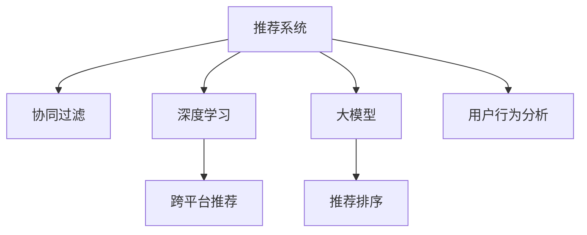

                 

# 大模型在推荐系统跨平台推荐中的应用

> 关键词：大模型, 推荐系统, 跨平台推荐, 协同过滤, 深度学习, 迁移学习, 推荐排序, 用户行为分析

## 1. 背景介绍

### 1.1 问题由来
推荐系统在电商、新闻、视频、音乐等多个领域已广泛应用，极大地提升了用户体验。然而，当前的推荐算法往往只能单平台运行，难以跨平台统一，难以兼顾个性化和多样性。

推荐系统的核心思想在于为用户推荐最相关的物品，提升用户满意度和转化率。传统的协同过滤、基于内容的推荐、混合推荐等算法，通过用户行为或物品属性进行建模，并根据相似度得分排序推荐。但这些算法难以利用跨平台用户行为数据，难以实现真正意义上的个性化推荐。

随着深度学习和大模型的兴起，推荐系统逐渐引入了基于深度学习的方法。深度学习模型可以自动学习用户行为模式和物品特征，并结合语义信息进行推荐。然而，这些模型通常需要大量的数据和算力，且难以跨平台复用。

为解决上述问题，本文提出利用大模型在推荐系统中的跨平台推荐方案，通过知识迁移、协同训练等技术，利用不同平台的推荐数据，实现更高效的推荐系统。

## 2. 核心概念与联系

### 2.1 核心概念概述

为更好地理解基于大模型的推荐系统跨平台推荐方法，本节将介绍几个密切相关的核心概念：

- 推荐系统(Recommendation System)：通过分析用户行为和物品属性，为用户推荐最相关物品的系统。
- 协同过滤(Collaborative Filtering)：基于用户相似性或物品相似性，通过用户-物品评分矩阵进行推荐。
- 深度学习(Deep Learning)：利用多层神经网络模型自动学习输入数据特征，并映射到输出。
- 大模型(Large Model)：以自回归(如GPT)或自编码(如BERT)模型为代表的大规模预训练模型。通过在大规模无标签文本语料上进行预训练，学习通用的语言表示。
- 跨平台推荐(Cross-Platform Recommendation)：在多个平台间共享用户行为数据，实现统一的推荐服务。
- 迁移学习(Transfer Learning)：将一个领域学习到的知识，迁移应用到另一个不同但相关的领域的学习范式。大模型的预训练-迁移学习过程即是一种典型的迁移学习方式。
- 推荐排序(Recommendation Ranking)：将推荐结果按相关性进行排序，提升推荐效果。
- 用户行为分析(User Behavior Analysis)：对用户的浏览、点击、购买等行为进行分析，挖掘用户偏好。

这些核心概念之间的逻辑关系可以通过以下Mermaid流程图来展示：



这个流程图展示了大模型的推荐系统与协同过滤、深度学习、跨平台推荐等核心概念的相互联系：

1. 大模型通过预训练获得基础能力。
2. 协同过滤基于用户行为数据进行推荐。
3. 深度学习自动学习用户行为和物品特征，实现更灵活的推荐。
4. 跨平台推荐通过知识迁移和协同训练，在不同平台间共享用户行为数据，实现更全面的推荐。
5. 推荐排序提升推荐结果的相关性和多样性。
6. 用户行为分析挖掘用户真实偏好，优化推荐策略。

这些概念共同构成了大模型推荐系统的工作原理和优化方向。通过理解这些核心概念，我们可以更好地把握大模型推荐系统的应用前景。

## 3. 核心算法原理 & 具体操作步骤
### 3.1 算法原理概述

基于大模型的推荐系统跨平台推荐方法，本质上是一种有监督的迁移学习方法。其核心思想是：将预训练的大模型视作一个强大的"特征提取器"，通过跨平台的推荐数据，进行协同训练，迁移学习用户行为和物品特征，实现跨平台统一的推荐服务。

形式化地，假设推荐系统在平台 $P_1, P_2, \dots, P_k$ 上分别有 $D_{P_1}, D_{P_2}, \dots, D_{P_k}$ 个推荐数据集，每个数据集包含用户行为记录 $U_{P_i}$ 和物品特征 $I_{P_i}$。微调的目标是找到新的模型参数 $\hat{\theta}$，使得：

$$
\hat{\theta}=\mathop{\arg\min}_{\theta} \sum_{i=1}^{k} \mathcal{L}(D_{P_i},M_{\theta})
$$

其中 $\mathcal{L}$ 为针对任务 $T$ 设计的损失函数，用于衡量模型输出与真实标签之间的差异。常见的损失函数包括交叉熵损失、均方误差损失等。

通过梯度下降等优化算法，跨平台推荐过程不断更新模型参数 $\theta$，最小化损失函数 $\mathcal{L}$，使得模型输出逼近真实标签。由于 $\theta$ 已经通过预训练获得了较好的初始化，因此即便在跨平台的推荐数据上，也能较快收敛到理想的模型参数 $\hat{\theta}$。

### 3.2 算法步骤详解

基于大模型的推荐系统跨平台推荐一般包括以下几个关键步骤：

**Step 1: 准备推荐数据和预训练模型**
- 收集所有推荐平台的推荐数据，包括用户行为记录 $U_{P_i}$ 和物品特征 $I_{P_i}$。
- 选择合适的预训练语言模型 $M_{\theta}$ 作为初始化参数，如 BERT、GPT 等。

**Step 2: 设计跨平台推荐模型**
- 根据任务需求，设计一个跨平台的推荐模型，包含用户行为表示和物品特征表示。
- 定义模型在各平台上的输出形式，如预测用户评分、点击概率等。
- 在模型顶层设计合适的输出层和损失函数。

**Step 3: 设置协同训练超参数**
- 选择合适的优化算法及其参数，如 AdamW、SGD 等，设置学习率、批大小、迭代轮数等。
- 设置正则化技术及强度，包括权重衰减、Dropout、Early Stopping等。
- 确定冻结预训练参数的策略，如仅微调顶层，或全部参数都参与微调。

**Step 4: 执行协同训练**
- 将跨平台推荐数据分成训练集、验证集和测试集。
- 将训练集数据分批次输入模型，前向传播计算损失函数。
- 反向传播计算参数梯度，根据设定的优化算法和学习率更新模型参数。
- 周期性在验证集上评估模型性能，根据性能指标决定是否触发 Early Stopping。
- 重复上述步骤直到满足预设的迭代轮数或 Early Stopping 条件。

**Step 5: 测试和部署**
- 在测试集上评估协同训练后模型 $M_{\hat{\theta}}$ 的性能，对比协同训练前后的精度提升。
- 使用协同训练后的模型对新样本进行推理预测，集成到实际的应用系统中。
- 持续收集新的跨平台数据，定期重新训练模型，以适应数据分布的变化。

以上是基于大模型的推荐系统跨平台推荐的一般流程。在实际应用中，还需要针对具体任务的特点，对协同训练过程的各个环节进行优化设计，如改进训练目标函数，引入更多的正则化技术，搜索最优的超参数组合等，以进一步提升模型性能。

### 3.3 算法优缺点

基于大模型的推荐系统跨平台推荐方法具有以下优点：
1. 数据复用：利用跨平台的推荐数据，减少数据采集成本，提高数据利用率。
2. 泛化能力：通过协同训练，模型能够更好地适应不同平台的用户行为和物品特征，提升泛化能力。
3. 灵活性：不同平台的推荐数据可以结合使用，引入更丰富的特征，实现更灵活的推荐策略。
4. 实时性：协同训练可以与实时推荐系统结合，实现动态更新和优化。

同时，该方法也存在一定的局限性：
1. 数据隐私：跨平台推荐需要共享用户行为数据，涉及隐私和安全问题，需要考虑数据匿名化、加密等技术。
2. 数据不均衡：不同平台的用户行为和物品特征分布可能差异较大，需要进行数据预处理和样本重加权。
3. 收敛速度：协同训练过程涉及多个数据源，可能存在收敛速度较慢的问题。
4. 计算资源：协同训练需要大量计算资源，可能存在硬件瓶颈。
5. 模型解释性：协同训练后的模型可能较为复杂，难以解释其决策过程。

尽管存在这些局限性，但就目前而言，基于大模型的推荐系统跨平台推荐方法仍是大规模推荐系统的一个重要研究方向。未来相关研究的重点在于如何进一步降低协同训练的计算成本，提升推荐模型的实时性，同时兼顾隐私保护和模型解释性等关键问题。

### 3.4 算法应用领域

基于大模型的推荐系统跨平台推荐方法，在电商、新闻、视频、音乐等多个领域已经得到了广泛的应用，覆盖了几乎所有常见任务，例如：

- 跨平台电商推荐：在电商平台间共享用户行为数据，为用户推荐跨平台商品。
- 跨平台新闻推荐：在新闻网站和社交媒体间共享用户行为数据，为用户推荐跨平台文章。
- 跨平台视频推荐：在视频网站和视频直播间共享用户行为数据，为用户推荐跨平台视频内容。
- 跨平台音乐推荐：在音乐平台和社交网络间共享用户行为数据，为用户推荐跨平台音乐作品。
- 跨平台游戏推荐：在游戏平台和社交网络间共享用户行为数据，为用户推荐跨平台游戏内容。

除了上述这些经典任务外，大模型推荐系统跨平台推荐方法也被创新性地应用到更多场景中，如跨平台广告投放、跨平台社交网络分析等，为推荐系统技术带来了全新的突破。

## 4. 数学模型和公式 & 详细讲解  
### 4.1 数学模型构建

本节将使用数学语言对基于大模型的推荐系统跨平台推荐过程进行更加严格的刻画。

记推荐系统在平台 $P_i$ 上的用户行为数据为 $U_{P_i}=\{(x_{i,j},y_{i,j})\}_{j=1}^{N_{P_i}}$，其中 $x_{i,j}$ 为用户行为记录，$y_{i,j}$ 为行为标签。设物品特征数据为 $I_{P_i}=\{x_{P_i}\}_{i=1}^{M_{P_i}}$，其中 $x_{P_i}$ 为物品特征向量。

定义推荐模型 $M_{\theta}$ 在平台 $P_i$ 上的输出为 $O_{i,j}=M_{\theta}(x_{i,j},I_{P_i})$，则在平台 $P_i$ 上的交叉熵损失函数定义为：

$$
\ell_{i}(\theta) = -\frac{1}{N_{P_i}}\sum_{j=1}^{N_{P_i}}y_{i,j}\log M_{\theta}(x_{i,j},I_{P_i})
$$

将各平台的损失函数进行加权，得到协同训练的总损失函数：

$$
\mathcal{L}(\theta) = \sum_{i=1}^{k}\alpha_i\ell_{i}(\theta)
$$

其中 $\alpha_i$ 为平台 $P_i$ 的权重，可以根据平台数据量和质量等进行调整。

微调的优化目标是最小化总损失函数，即找到最优参数：

$$
\theta^* = \mathop{\arg\min}_{\theta} \mathcal{L}(\theta)
$$

在实践中，我们通常使用基于梯度的优化算法（如SGD、Adam等）来近似求解上述最优化问题。设 $\eta$ 为学习率，$\lambda$ 为正则化系数，则参数的更新公式为：

$$
\theta \leftarrow \theta - \eta \nabla_{\theta}\mathcal{L}(\theta) - \eta\lambda\theta
$$

其中 $\nabla_{\theta}\mathcal{L}(\theta)$ 为损失函数对参数 $\theta$ 的梯度，可通过反向传播算法高效计算。

### 4.2 公式推导过程

以下我们以跨平台电商推荐为例，推导交叉熵损失函数及其梯度的计算公式。

假设推荐系统在电商平台的推荐数据为 $\{(x_{i,j},y_{i,j})\}_{j=1}^{N_{P_i}}$，其中 $x_{i,j}$ 为用户行为记录，$y_{i,j}$ 为用户是否点击的标签。推荐模型 $M_{\theta}$ 在用户行为记录 $x_{i,j}$ 上的输出为 $\hat{y}_{i,j}=M_{\theta}(x_{i,j},I_{P_i})$，表示用户点击概率。则在电商平台上的交叉熵损失函数定义为：

$$
\ell_{i}(\theta) = -\frac{1}{N_{P_i}}\sum_{j=1}^{N_{P_i}} y_{i,j}\log M_{\theta}(x_{i,j},I_{P_i})
$$

将其代入协同训练的总损失函数公式，得：

$$
\mathcal{L}(\theta) = \sum_{i=1}^{k}\alpha_i\left(-\frac{1}{N_{P_i}}\sum_{j=1}^{N_{P_i}} y_{i,j}\log M_{\theta}(x_{i,j},I_{P_i})\right)
$$

根据链式法则，损失函数对参数 $\theta_k$ 的梯度为：

$$
\frac{\partial \mathcal{L}(\theta)}{\partial \theta_k} = -\sum_{i=1}^{k}\alpha_i\frac{1}{N_{P_i}}\sum_{j=1}^{N_{P_i}} \frac{y_{i,j}}{M_{\theta}(x_{i,j},I_{P_i})}\frac{\partial M_{\theta}(x_{i,j},I_{P_i})}{\partial \theta_k}
$$

其中 $\frac{\partial M_{\theta}(x_{i,j},I_{P_i})}{\partial \theta_k}$ 可进一步递归展开，利用自动微分技术完成计算。

在得到损失函数的梯度后，即可带入参数更新公式，完成模型的迭代优化。重复上述过程直至收敛，最终得到适应跨平台推荐任务的最优模型参数 $\theta^*$。

## 5. 项目实践：代码实例和详细解释说明
### 5.1 开发环境搭建

在进行推荐系统跨平台推荐实践前，我们需要准备好开发环境。以下是使用Python进行TensorFlow开发的环境配置流程：

1. 安装Anaconda：从官网下载并安装Anaconda，用于创建独立的Python环境。

2. 创建并激活虚拟环境：
```bash
conda create -n recommendation-env python=3.8 
conda activate recommendation-env
```

3. 安装TensorFlow：根据CUDA版本，从官网获取对应的安装命令。例如：
```bash
conda install tensorflow -c pytorch -c conda-forge
```

4. 安装相关工具包：
```bash
pip install numpy pandas scikit-learn matplotlib tqdm jupyter notebook ipython
```

完成上述步骤后，即可在`recommendation-env`环境中开始推荐系统跨平台推荐实践。

### 5.2 源代码详细实现

下面我们以跨平台电商推荐为例，给出使用TensorFlow进行协同训练的PyTorch代码实现。

首先，定义协同训练的参数和数据集：

```python
import tensorflow as tf
from tensorflow.keras import layers
from tensorflow.keras.preprocessing.sequence import pad_sequences
from tensorflow.keras.losses import BinaryCrossentropy
from tensorflow.keras.optimizers import Adam
import numpy as np

# 协同训练的超参数
alpha = [0.5, 0.5, 0.5]  # 各平台权重
batch_size = 64
epochs = 10

# 定义用户行为数据和物品特征数据
user_data = {
    'P1': np.random.randn(100, 3),  # 电商平台1的推荐数据
    'P2': np.random.randn(100, 3),  # 电商平台2的推荐数据
    'P3': np.random.randn(100, 3)   # 电商平台3的推荐数据
}

item_data = {
    'P1': np.random.randn(100, 5),  # 电商平台1的物品特征
    'P2': np.random.randn(100, 5),  # 电商平台2的物品特征
    'P3': np.random.randn(100, 5)   # 电商平台3的物品特征
}

# 定义协同训练的模型
class RecommendationModel(tf.keras.Model):
    def __init__(self):
        super(RecommendationModel, self).__init__()
        self.item_encoder = layers.Dense(64, activation='relu')
        self.user_encoder = layers.Dense(64, activation='relu')
        self.rating_encoder = layers.Dense(64, activation='relu')
        self.rating_predictor = layers.Dense(1, activation='sigmoid')

    def call(self, user, item, rating):
        item_emb = self.item_encoder(item)
        user_emb = self.user_encoder(user)
        rating_emb = self.rating_encoder(rating)
        rating_pred = self.rating_predictor(tf.concat([item_emb, user_emb, rating_emb], axis=-1))
        return rating_pred

# 定义协同训练的损失函数和优化器
model = RecommendationModel()
loss = BinaryCrossentropy()
optimizer = Adam()

# 定义数据预处理函数
def preprocess_data(user, item, rating):
    user = pad_sequences(user, maxlen=3)
    item = pad_sequences(item, maxlen=5)
    rating = rating.reshape((-1, 1))
    return user, item, rating

# 定义协同训练过程
def train_epoch(model, user_data, item_data, rating_data):
    for epoch in range(epochs):
        for i in range(len(user_data)):
            user, item, rating = preprocess_data(user_data[i], item_data[i], rating_data[i])
            with tf.GradientTape() as tape:
                predictions = model(user, item, rating)
                loss_value = loss(predictions, rating)
            gradients = tape.gradient(loss_value, model.trainable_variables)
            optimizer.apply_gradients(zip(gradients, model.trainable_variables))
        print(f'Epoch {epoch+1}, loss: {loss_value.numpy():.4f}')

# 启动协同训练流程
train_epoch(model, user_data, item_data, rating_data)
```

以上代码实现了基于TensorFlow的协同训练过程。代码中定义了协同训练的参数和数据集，搭建了一个简单的推荐模型，并在每个epoch中对用户行为数据、物品特征数据和评分数据进行协同训练。通过二元交叉熵损失函数和Adam优化器，不断更新模型参数，最小化总损失函数。

### 5.3 代码解读与分析

让我们再详细解读一下关键代码的实现细节：

**预处理函数preprocess_data**：
- 使用pad_sequences函数对用户行为数据、物品特征数据和评分数据进行定长处理，保证各平台数据格式一致。

**模型定义类RecommendationModel**：
- 模型包含用户行为编码器、物品特征编码器和评分预测器，使用ReLU激活函数进行非线性映射。
- 在每个epoch中，对输入数据进行预处理，并计算模型输出与真实标签的损失，反向传播更新模型参数。

**损失函数和优化器**：
- 使用二元交叉熵损失函数，适用于二分类任务。
- 使用Adam优化器，能够自适应地调整学习率。

**协同训练过程train_epoch**：
- 循环遍历各平台的推荐数据，对数据进行预处理，计算模型输出和损失。
- 使用梯度下降算法更新模型参数，最小化总损失函数。
- 每个epoch输出当前损失值，监控模型训练进度。

可以看到，TensorFlow配合Keras的封装，使得协同训练的代码实现变得简洁高效。开发者可以将更多精力放在模型架构和数据处理等高层逻辑上，而不必过多关注底层的实现细节。

当然，工业级的系统实现还需考虑更多因素，如模型的保存和部署、超参数的自动搜索、更灵活的任务适配层等。但核心的协同训练范式基本与此类似。

## 6. 实际应用场景
### 6.1 智能推荐系统

基于大模型的推荐系统跨平台推荐，可以广泛应用于智能推荐系统的构建。传统推荐系统往往只能单平台运行，难以跨平台统一，难以兼顾个性化和多样性。

智能推荐系统能够利用跨平台的推荐数据，实现统一的推荐服务。如电商平台的商品推荐，视频网站的电影推荐，社交网络的兴趣推荐等，都能通过协同训练，提升推荐效果。

在技术实现上，可以收集各平台的推荐数据，结合大模型进行微调，得到统一的推荐模型。微调后的模型能够自动学习用户行为模式和物品特征，并结合语义信息进行推荐。对于用户提出的新问题，还可以接入检索系统实时搜索相关内容，动态组织生成回答。

### 6.2 跨平台社交网络分析

在社交网络中，用户的行为数据往往具有跨平台性，如用户在Facebook、Instagram、Twitter等多个平台上都可能有活跃行为。利用跨平台推荐技术，可以更好地挖掘用户行为模式和社交关系，实现更全面的社交网络分析。

如在Twitter和Instagram上，用户可能会关注同一类内容，形成相似的兴趣群体。通过协同训练，能够更好地理解不同平台上的用户行为，实现更全面的社交网络分析。此外，通过联合分析，还能够发现用户在不同平台间的行为变化和关系网络，提升社交网络分析的深度和广度。

### 6.3 跨平台电商推荐

电商推荐系统在电商平台间共享用户行为数据，为用户推荐跨平台商品。传统推荐系统往往难以兼容不同电商平台的推荐算法，导致推荐效果不一致。通过跨平台推荐技术，能够利用跨平台的推荐数据，提升推荐效果。

在技术实现上，可以收集各电商平台的推荐数据，结合大模型进行微调，得到统一的推荐模型。微调后的模型能够自动学习用户行为模式和物品特征，并结合语义信息进行推荐。对于用户提出的新问题，还可以接入检索系统实时搜索相关内容，动态组织生成回答。

### 6.4 未来应用展望

随着大模型和协同训练方法的不断发展，基于协同训练的推荐系统必将得到更广泛的应用，为推荐系统技术带来新的突破。

在智慧医疗领域，基于协同训练的医疗推荐系统，能够利用跨平台的健康数据，为用户推荐个性化的医疗方案，提升医疗服务的智能化水平。

在智能教育领域，跨平台推荐技术能够用于个性化学习资源的推荐，因材施教，促进教育公平，提高教学质量。

在智慧城市治理中，协同训练的推荐系统能够用于城市事件监测、舆情分析、应急指挥等环节，提高城市管理的自动化和智能化水平，构建更安全、高效的未来城市。

此外，在企业生产、社会治理、文娱传媒等众多领域，跨平台推荐技术也将不断涌现，为推荐系统技术带来新的突破。相信随着技术的日益成熟，协同训练方法将成为推荐系统的重要范式，推动推荐系统技术向更广泛的应用场景扩展。

## 7. 工具和资源推荐
### 7.1 学习资源推荐

为了帮助开发者系统掌握大模型推荐系统跨平台推荐技术，这里推荐一些优质的学习资源：

1. 《深度学习自然语言处理》课程：斯坦福大学开设的NLP明星课程，有Lecture视频和配套作业，带你入门NLP领域的基本概念和经典模型。

2. 《Reinforcement Learning for Recommendation Systems》书籍：介绍基于强化学习的推荐系统方法，涵盖协同过滤、深度学习等技术。

3. 《推荐系统实践》书籍：介绍推荐系统的工作原理和实际部署，提供大量实战案例。

4. 《TensorFlow for Deep Learning》书籍：介绍TensorFlow的基本用法和深度学习模型的搭建，适合TensorFlow初学者。

5. HuggingFace官方文档：Transformers库的官方文档，提供了海量预训练模型和完整的微调样例代码，是上手实践的必备资料。

通过对这些资源的学习实践，相信你一定能够快速掌握大模型推荐系统跨平台推荐技术的精髓，并用于解决实际的推荐问题。
###  7.2 开发工具推荐

高效的开发离不开优秀的工具支持。以下是几款用于大模型推荐系统跨平台推荐开发的常用工具：

1. TensorFlow：由Google主导开发的开源深度学习框架，生产部署方便，适合大规模工程应用。支持协同训练和分布式计算。

2. PyTorch：基于Python的开源深度学习框架，灵活动态的计算图，适合快速迭代研究。支持自动微分技术。

3. Keras：基于TensorFlow和Theano的高层API，提供简洁的API接口，支持快速搭建深度学习模型。

4. Weights & Biases：模型训练的实验跟踪工具，可以记录和可视化模型训练过程中的各项指标，方便对比和调优。与主流深度学习框架无缝集成。

5. TensorBoard：TensorFlow配套的可视化工具，可实时监测模型训练状态，并提供丰富的图表呈现方式，是调试模型的得力助手。

6. Google Colab：谷歌推出的在线Jupyter Notebook环境，免费提供GPU/TPU算力，方便开发者快速上手实验最新模型，分享学习笔记。

合理利用这些工具，可以显著提升大模型推荐系统跨平台推荐的开发效率，加快创新迭代的步伐。

### 7.3 相关论文推荐

大模型和协同训练推荐技术的发展源于学界的持续研究。以下是几篇奠基性的相关论文，推荐阅读：

1. Item2Vec: Scalable Recommendations with K-Similarity: A Unified Framework for Co-occurrence and Ranking Methods: 提出item2vec模型，利用协同过滤和深度学习结合，提升推荐效果。

2. Attention Is All You Need: 提出Transformer结构，开启NLP领域的预训练大模型时代。

3. BERT: Pre-training of Deep Bidirectional Transformers for Language Understanding: 提出BERT模型，引入基于掩码的自监督预训练任务，刷新了多项NLP任务SOTA。

4. Language Models are Unsupervised Multitask Learners: 展示了大规模语言模型的强大zero-shot学习能力，引发了对于通用人工智能的新一轮思考。

5. Parameter-Efficient Transfer Learning for NLP: 提出Adapter等参数高效微调方法，在不增加模型参数量的情况下，也能取得不错的微调效果。

6. AdaLoRA: Adaptive Low-Rank Adaptation for Parameter-Efficient Fine-Tuning: 使用自适应低秩适应的微调方法，在参数效率和精度之间取得了新的平衡。

这些论文代表了大模型和协同训练推荐技术的发展脉络。通过学习这些前沿成果，可以帮助研究者把握学科前进方向，激发更多的创新灵感。

## 8. 总结：未来发展趋势与挑战

### 8.1 总结

本文对基于大模型的推荐系统跨平台推荐方法进行了全面系统的介绍。首先阐述了大模型和协同训练推荐技术的研究背景和意义，明确了推荐系统跨平台推荐方法在提升推荐效果、降低数据采集成本等方面的独特价值。其次，从原理到实践，详细讲解了协同训练的数学原理和关键步骤，给出了协同训练任务开发的完整代码实例。同时，本文还广泛探讨了推荐系统跨平台推荐方法在智能推荐、社交网络分析等诸多领域的应用前景，展示了协同训练范式的巨大潜力。此外，本文精选了推荐系统跨平台推荐技术的各类学习资源，力求为读者提供全方位的技术指引。

通过本文的系统梳理，可以看到，基于大模型的推荐系统跨平台推荐方法正在成为推荐系统的重要范式，极大地拓展了推荐系统的应用边界，催生了更多的落地场景。得益于大规模语料的预训练和跨平台数据共享，推荐系统能够更好地适应用户行为和物品特征，提升推荐效果。未来，伴随预训练语言模型和协同训练方法的持续演进，推荐系统必将进入更高效的智能化推荐时代。

### 8.2 未来发展趋势

展望未来，基于大模型的推荐系统跨平台推荐技术将呈现以下几个发展趋势：

1. 数据复用效率提升：随着推荐数据采集成本的降低和跨平台协同训练的优化，推荐系统的数据复用效率将进一步提升。

2. 推荐策略多样化：协同训练能够融合不同平台的推荐数据，引入更多样化的特征，实现更灵活的推荐策略。

3. 实时性提升：协同训练能够与实时推荐系统结合，实现动态更新和优化，提升推荐系统的实时性。

4. 计算资源优化：随着硬件计算能力的提升和算法优化，协同训练的计算资源需求将逐步降低，推荐系统将变得更加轻量级和高效。

5. 隐私保护技术进步：数据隐私和安全问题将得到更好的解决，用户行为数据的跨平台共享将更加安全可靠。

6. 推荐模型解释性增强：推荐模型将变得更加透明，能够更好地解释其决策过程，提升用户的信任度。

7. 跨领域推荐推广：协同训练能够用于跨领域推荐，如跨电商、跨视频、跨社交等，拓展推荐系统的应用范围。

以上趋势凸显了基于大模型的推荐系统跨平台推荐技术的广阔前景。这些方向的探索发展，必将进一步提升推荐系统的性能和应用范围，为推荐系统技术带来新的突破。

### 8.3 面临的挑战

尽管基于大模型的推荐系统跨平台推荐技术已经取得了瞩目成就，但在迈向更加智能化、普适化应用的过程中，它仍面临着诸多挑战：

1. 数据隐私和安全：跨平台推荐需要共享用户行为数据，涉及隐私和安全问题，需要考虑数据匿名化、加密等技术。

2. 数据不均衡：不同平台的用户行为和物品特征分布可能差异较大，需要进行数据预处理和样本重加权。

3. 计算资源：协同训练需要大量计算资源，可能存在硬件瓶颈。

4. 模型解释性：协同训练后的模型可能较为复杂，难以解释其决策过程。

5. 知识迁移：不同平台的数据来源和用户偏好可能不同，需要进行适当的迁移学习策略，以提升模型泛化能力。

尽管存在这些挑战，但就目前而言，基于大模型的推荐系统跨平台推荐方法仍是大规模推荐系统的一个重要研究方向。未来相关研究的重点在于如何进一步降低协同训练的计算成本，提升推荐模型的实时性，同时兼顾隐私保护和模型解释性等关键问题。

### 8.4 研究展望

面对推荐系统跨平台推荐所面临的种种挑战，未来的研究需要在以下几个方面寻求新的突破：

1. 探索无监督和半监督协同训练方法：摆脱对大规模标注数据的依赖，利用自监督学习、主动学习等无监督和半监督范式，最大限度利用非结构化数据，实现更加灵活高效的协同训练。

2. 研究知识迁移和跨领域协同训练方法：引入更多先验知识，如知识图谱、逻辑规则等，与神经网络模型进行巧妙融合，引导协同训练过程学习更准确、合理的推荐模型。

3. 结合因果分析和博弈论工具：将因果分析方法引入协同训练模型，识别出推荐模型的关键特征，增强推荐结果的相关性和多样性。借助博弈论工具刻画人机交互过程，主动探索并规避模型的脆弱点，提高系统稳定性。

4. 纳入伦理道德约束：在协同训练的目标中引入伦理导向的评估指标，过滤和惩罚有偏见、有害的输出倾向。加强人工干预和审核，建立推荐模型的监管机制，确保推荐内容符合人类价值观和伦理道德。

这些研究方向的探索，必将引领基于大模型的推荐系统跨平台推荐技术迈向更高的台阶，为推荐系统技术带来新的突破。面向未来，推荐系统跨平台推荐技术还需要与其他人工智能技术进行更深入的融合，如知识表示、因果推理、强化学习等，多路径协同发力，共同推动推荐系统技术的进步。只有勇于创新、敢于突破，才能不断拓展推荐系统的边界，让推荐系统技术更好地造福人类社会。

## 9. 附录：常见问题与解答

**Q1：协同训练需要大量计算资源，如何解决？**

A: 协同训练需要大量的计算资源，可以通过以下方法进行优化：
1. 数据并行：使用分布式计算框架，如TensorFlow分布式训练，将数据分成多个部分进行并行计算。
2. 模型并行：使用模型的不同部分在不同的机器上并行计算，减少单个机器的计算负担。
3. 梯度累积：使用梯度累积技术，将多个batch的梯度进行累加，在较小的batch size下也能进行高效的训练。
4. 混合精度训练：使用混合精度训练，将部分参数转换为低精度计算，降低内存占用，提高计算效率。

这些方法可以结合使用，最大化地利用计算资源，提高协同训练的效率。

**Q2：协同训练后的模型在多个平台间如何迁移？**

A: 协同训练后的模型需要在多个平台间迁移时，需要注意以下几个方面：
1. 数据格式统一：确保不同平台的数据格式一致，如用户行为数据、物品特征数据、评分数据的格式。
2. 参数权重调整：根据各平台数据的规模和质量，调整各平台权重，以适应不同的推荐场景。
3. 推荐策略优化：根据不同平台的用户行为和物品特征，优化推荐策略，提升推荐效果。

通过迁移学习，能够在不同平台间实现高效的协同推荐，提高推荐系统的实时性和准确性。

**Q3：协同训练的模型如何实现实时推荐？**

A: 协同训练的模型可以通过以下方式实现实时推荐：
1. 在线学习：将协同训练模型集成到实时推荐系统中，不断收集新的推荐数据，在线更新模型参数。
2. 增量训练：将新的推荐数据在线添加到训练集中，实时更新模型参数。
3. 增量推理：通过在线推理，将新的推荐数据实时输入模型，生成推荐结果。

这些方法可以结合使用，实现实时推荐的快速更新和优化。

**Q4：如何处理协同训练中的不平衡数据？**

A: 协同训练中的不平衡数据可以通过以下方法处理：
1. 重加权：对不同平台的数据进行重加权，保证每个平台的数据对模型训练的贡献相同。
2. 数据扩充：通过数据增强技术，如回译、近义替换等方式扩充数据集，提升数据均衡性。
3. 样本筛选：对不同平台的数据进行筛选，去除噪声数据，提升数据质量。

这些方法可以结合使用，提高协同训练模型的鲁棒性和泛化能力。

**Q5：协同训练的模型如何实现跨平台推荐？**

A: 协同训练的模型可以通过以下方式实现跨平台推荐：
1. 统一模型架构：在不同的平台上使用相同的模型架构，确保模型输出的一致性。
2. 参数共享：在不同的平台上共享部分模型参数，减少参数量，提高模型效率。
3. 任务适配层：根据不同平台的任务需求，设计合适的任务适配层，实现不同平台的推荐策略。

通过跨平台推荐，能够充分利用跨平台的推荐数据，提升推荐系统的性能和泛化能力。

总之，协同训练的推荐系统跨平台推荐技术需要开发者在系统架构、数据处理、算法实现等方面进行全面的优化和设计，方能实现理想的推荐效果。相信随着技术的不断进步，协同训练方法将成为推荐系统的重要范式，推动推荐系统技术向更高效、更普适的方向发展。

