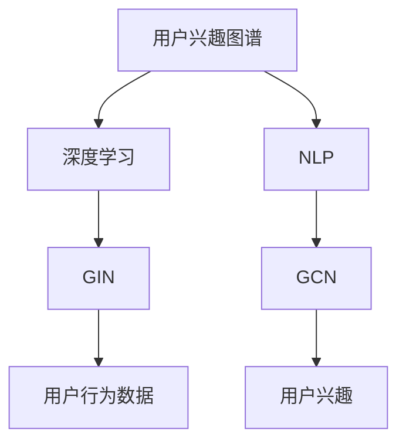

                 

# 大模型在电商平台用户兴趣图谱动态更新中的应用

> 关键词：电商平台,用户兴趣图谱,大模型,动态更新,自然语言处理(NLP),深度学习,图神经网络(GNN),Graph Isomorphism Network (GIN),Graph Convolution Network (GCN)

## 1. 背景介绍

### 1.1 问题由来

在当今电子商务时代，电商平台的用户行为数据日益丰富。用户访问网页、购买商品、搜索关键词、评价评论等行为，构成了庞大的数据池。如何利用这些数据高效地进行用户兴趣建模，成为电商平台运营的重要问题。

传统的用户兴趣模型通常基于用户的历史行为数据进行离线建模，如协同过滤、基于内容的推荐系统等。但这些方法往往依赖于较长的用户行为序列，难以实时捕捉用户的动态变化，难以应对用户兴趣的快速变化和多元性。

深度学习和大模型的兴起，为电商平台的用户兴趣建模提供了新的思路。通过预训练大模型和动态更新的方式，可以更灵活地建模用户兴趣，实时更新兴趣图谱，以提升用户体验和商家转化率。

### 1.2 问题核心关键点

本节将介绍几个与用户兴趣图谱动态更新相关的核心概念，并给出它们之间的联系。

- **用户兴趣图谱**：通过用户的各种行为数据，构建用户兴趣的表示，形成用户兴趣的动态图谱。
- **深度学习**：使用大模型进行用户行为数据的表示学习，提取高层次语义特征。
- **自然语言处理（NLP）**：利用大模型对文本数据进行语义分析，捕捉用户情感和语义意图。
- **图神经网络（GNN）**：将用户兴趣图谱转化为图结构，通过GNN进行图数据的表示学习。
- **Graph Isomorphism Network (GIN)**：一种基于GNN的深度学习模型，用于图数据的表示学习。
- **Graph Convolution Network (GCN)**：一种基于GNN的深度学习模型，用于图数据的表示学习。

这些核心概念之间相互关联，共同构成了电商平台用户兴趣图谱动态更新的理论框架，如图1所示。

图1. 电商平台用户兴趣图谱动态更新的核心概念联系图

## 2. 核心概念与联系

### 2.1 核心概念概述

接下来，将详细介绍上述核心概念的原理和架构。

### 2.1.1 用户兴趣图谱

用户兴趣图谱是通过用户的各种行为数据，构建用户兴趣的表示，形成用户兴趣的动态图谱。图谱中每个节点表示用户，每个边表示用户之间的行为关联。用户兴趣图谱可以通过如下方式构建：

1. **用户行为数据收集**：从电商平台的日志中收集用户的行为数据，如访问商品、浏览页面、搜索关键词、评价评论等。
2. **特征提取**：使用NLP模型对用户行为数据进行文本表示学习，提取出用户的语义意图和情感特征。
3. **构建用户兴趣图**：根据用户的特征向量，构建用户兴趣图谱。每个用户节点包含其兴趣特征向量，每个行为边表示用户之间的行为关联。

### 2.1.2 深度学习

深度学习通过预训练大模型进行用户行为数据的表示学习，提取高层次语义特征。深度学习模型通常包含多个层次的隐层，通过不断提取特征，逐步抽象出更高层次的语义表示。在电商平台用户兴趣图谱动态更新的场景中，深度学习模型可以通过如下方式进行用户兴趣建模：

1. **预训练模型选择**：选择预训练的大模型，如BERT、GPT等，作为用户行为数据的表示学习器。
2. **特征向量提取**：将用户行为数据输入预训练模型，提取高层次语义特征向量。
3. **兴趣图谱构建**：根据用户行为数据的特征向量，构建用户兴趣图谱。

### 2.1.3 自然语言处理（NLP）

自然语言处理通过大模型对文本数据进行语义分析，捕捉用户情感和语义意图。在电商平台用户兴趣图谱动态更新的场景中，NLP模型可以通过如下方式进行用户兴趣建模：

1. **语义分析**：使用NLP模型对用户的评论、评价、搜索关键词等文本数据进行语义分析，提取用户情感和语义意图。
2. **情感特征提取**：使用情感分析模型，提取用户的情感特征，用于构建用户兴趣图谱。
3. **兴趣图谱构建**：根据用户的情感特征，构建用户兴趣图谱。

### 2.1.4 图神经网络（GNN）

图神经网络将用户兴趣图谱转化为图结构，通过GNN进行图数据的表示学习。在电商平台用户兴趣图谱动态更新的场景中，GNN可以通过如下方式进行用户兴趣建模：

1. **图结构构建**：将用户兴趣图谱转化为图结构，每个用户节点包含其兴趣特征向量，每个行为边表示用户之间的行为关联。
2. **图表示学习**：使用GNN对图结构进行表示学习，提取出用户兴趣的高层次语义特征。
3. **兴趣图谱更新**：根据用户的行为数据，动态更新用户兴趣图谱。

### 2.1.5 Graph Isomorphism Network (GIN)

Graph Isomorphism Network (GIN)是一种基于GNN的深度学习模型，用于图数据的表示学习。GIN通过聚合邻居节点的特征，逐步提取出图结构的语义表示。在电商平台用户兴趣图谱动态更新的场景中，GIN可以通过如下方式进行用户兴趣建模：

1. **图结构构建**：将用户兴趣图谱转化为图结构，每个用户节点包含其兴趣特征向量，每个行为边表示用户之间的行为关联。
2. **GIN表示学习**：使用GIN对图结构进行表示学习，提取出用户兴趣的高层次语义特征。
3. **兴趣图谱更新**：根据用户的行为数据，动态更新用户兴趣图谱。

### 2.1.6 Graph Convolution Network (GCN)

Graph Convolution Network (GCN)是一种基于GNN的深度学习模型，用于图数据的表示学习。GCN通过卷积运算逐步提取出图结构的语义表示。在电商平台用户兴趣图谱动态更新的场景中，GCN可以通过如下方式进行用户兴趣建模：

1. **图结构构建**：将用户兴趣图谱转化为图结构，每个用户节点包含其兴趣特征向量，每个行为边表示用户之间的行为关联。
2. **GCN表示学习**：使用GCN对图结构进行表示学习，提取出用户兴趣的高层次语义特征。
3. **兴趣图谱更新**：根据用户的行为数据，动态更新用户兴趣图谱。

### 2.2 核心概念联系

通过上述核心概念的介绍，可以看出用户兴趣图谱动态更新过程包含以下几个步骤：

1. **用户行为数据收集**：从电商平台的日志中收集用户的行为数据。
2. **特征提取**：使用NLP模型对用户行为数据进行文本表示学习，提取出用户的语义意图和情感特征。
3. **用户兴趣图谱构建**：根据用户的特征向量，构建用户兴趣图谱。
4. **用户兴趣图谱表示学习**：使用深度学习模型对用户兴趣图谱进行表示学习，提取出用户兴趣的高层次语义特征。
5. **兴趣图谱更新**：根据用户的行为数据，动态更新用户兴趣图谱。

这些步骤相互关联，共同构成了用户兴趣图谱动态更新的全过程。其中，深度学习和GNN模型在用户兴趣图谱的表示学习中发挥了关键作用，NLP模型在用户兴趣图谱的构建和更新中也有重要作用。

## 3. 核心算法原理 & 具体操作步骤
### 3.1 算法原理概述

电商平台用户兴趣图谱动态更新的核心算法原理包括深度学习、自然语言处理、图神经网络等技术。其中，深度学习模型用于用户行为数据的表示学习，提取高层次语义特征；NLP模型用于用户行为数据的语义分析，捕捉用户情感和语义意图；GNN模型用于用户兴趣图谱的表示学习，提取出用户兴趣的高层次语义特征。

## 3.2 算法步骤详解

### 3.2.1 用户行为数据收集

用户行为数据收集是用户兴趣图谱动态更新的第一步。通过电商平台的日志，收集用户的各种行为数据，包括访问商品、浏览页面、搜索关键词、评价评论等。具体步骤如下：

1. **日志数据获取**：从电商平台的数据库中获取用户的访问日志、浏览日志、搜索日志等。
2. **数据清洗**：对日志数据进行清洗，去除无关信息，保留有用的行为数据。
3. **数据转换**：将行为数据转换为统一的格式，方便后续处理。

### 3.2.2 特征提取

特征提取是通过NLP模型对用户行为数据进行文本表示学习，提取出用户的语义意图和情感特征。具体步骤如下：

1. **文本预处理**：对用户行为数据进行文本预处理，包括分词、去除停用词、词干提取等。
2. **文本表示学习**：使用BERT、GPT等预训练模型对用户行为数据进行语义分析，提取用户的行为意图和情感特征。
3. **特征向量提取**：将用户行为数据转换为特征向量，用于构建用户兴趣图谱。

### 3.2.3 用户兴趣图谱构建

用户兴趣图谱构建是根据用户的特征向量，构建用户兴趣图谱。具体步骤如下：

1. **用户节点构建**：根据用户的特征向量，构建用户节点。每个用户节点包含其兴趣特征向量。
2. **行为边构建**：根据用户的行为数据，构建用户之间的行为关联边。每个行为边表示用户之间的行为关联。
3. **图结构构建**：将用户节点和行为边组合，构建用户兴趣图谱。

### 3.2.4 用户兴趣图谱表示学习

用户兴趣图谱表示学习是通过深度学习模型对用户兴趣图谱进行表示学习，提取出用户兴趣的高层次语义特征。具体步骤如下：

1. **预训练模型选择**：选择预训练的大模型，如BERT、GPT等，作为用户兴趣图谱的表示学习器。
2. **图结构嵌入**：使用深度学习模型对用户兴趣图谱进行表示学习，提取出用户兴趣的高层次语义特征。
3. **特征向量提取**：将用户兴趣图谱的表示学习结果转换为特征向量，用于后续处理。

### 3.2.5 兴趣图谱更新

兴趣图谱更新是根据用户的行为数据，动态更新用户兴趣图谱。具体步骤如下：

1. **行为数据输入**：将用户的行为数据输入用户兴趣图谱表示学习器，提取出用户行为的高层次语义特征。
2. **兴趣图谱更新**：根据用户行为的高层次语义特征，动态更新用户兴趣图谱。

## 3.3 算法优缺点

### 3.3.1 算法优点

用户兴趣图谱动态更新算法具有以下优点：

1. **高效灵活**：深度学习和大模型能够高效地提取用户行为数据的语义特征，NLP模型能够捕捉用户情感和语义意图，GNN模型能够提取出用户兴趣的高层次语义特征，这些技术可以灵活地应用于用户兴趣图谱的动态更新。
2. **实时性高**：深度学习和大模型能够实时地对用户行为数据进行处理，NLP模型能够实时地捕捉用户情感和语义意图，GNN模型能够实时地更新用户兴趣图谱，用户兴趣图谱动态更新具有高实时性。
3. **准确度高**：深度学习和大模型能够提取出高层次语义特征，NLP模型能够捕捉用户情感和语义意图，GNN模型能够提取出用户兴趣的高层次语义特征，这些技术可以有效地提升用户兴趣图谱的准确度。

### 3.3.2 算法缺点

用户兴趣图谱动态更新算法也存在一些缺点：

1. **数据依赖高**：用户兴趣图谱的动态更新依赖于大量的用户行为数据，需要保证数据的时效性和完备性。
2. **计算资源需求高**：深度学习和大模型需要大量的计算资源进行训练和推理，需要保证充足的计算资源。
3. **模型复杂度高**：用户兴趣图谱动态更新算法涉及深度学习、自然语言处理、图神经网络等多层技术，模型复杂度高，需要较强的技术实力和实践经验。

## 3.4 算法应用领域

用户兴趣图谱动态更新算法可以应用于多种领域，如电商平台、社交网络、在线广告等。在电商平台用户兴趣图谱动态更新的场景中，可以具体应用于以下方面：

1. **个性化推荐系统**：根据用户的行为数据，动态更新用户兴趣图谱，构建个性化推荐系统，提升推荐效果。
2. **用户画像构建**：通过用户行为数据，动态更新用户兴趣图谱，构建用户画像，提升用户体验。
3. **广告投放优化**：根据用户的行为数据，动态更新用户兴趣图谱，优化广告投放策略，提升广告效果。
4. **商品搜索优化**：根据用户的行为数据，动态更新用户兴趣图谱，优化商品搜索算法，提升搜索效果。

## 4. 数学模型和公式 & 详细讲解  
### 4.1 数学模型构建

在本节中，我们将使用数学语言对用户兴趣图谱动态更新的模型进行描述。

记用户兴趣图谱为 $\mathcal{G}=(\mathcal{V}, \mathcal{E})$，其中 $\mathcal{V}$ 表示用户节点集合，$\mathcal{E}$ 表示用户之间的行为关联边集合。设每个用户节点 $\mathcal{V}_i$ 的特征向量为 $\mathbf{h}_i \in \mathbb{R}^{d_h}$，每个行为边 $\mathcal{E}_{ij}$ 的特征向量为 $\mathbf{r}_{ij} \in \mathbb{R}^{d_r}$，用户兴趣图谱的语义特征向量为 $\mathbf{H} \in \mathbb{R}^{N \times d_h}$，用户兴趣图谱的表示学习结果为 $\mathbf{G} \in \mathbb{R}^{N \times d_g}$，其中 $N$ 表示用户节点的数量。

### 4.2 公式推导过程

在本节中，我们将推导用户兴趣图谱动态更新的数学公式。

假设用户兴趣图谱的语义特征向量 $\mathbf{H}$ 可以通过如下方式计算得到：

$$
\mathbf{H} = \mathbf{X}W^h
$$

其中，$\mathbf{X} \in \mathbb{R}^{N \times d_h}$ 表示用户兴趣图谱的特征矩阵，$W^h \in \mathbb{R}^{d_h \times d_h}$ 表示用户兴趣图谱的特征变换矩阵。

假设用户兴趣图谱的表示学习结果 $\mathbf{G}$ 可以通过如下方式计算得到：

$$
\mathbf{G} = \mathbf{H}W^g
$$

其中，$W^g \in \mathbb{R}^{d_g \times d_h}$ 表示用户兴趣图谱的表示变换矩阵。

假设用户兴趣图谱的更新可以通过如下方式计算得到：

$$
\mathbf{H}_{\text{new}} = \mathbf{H} + \mathbf{R}W^r
$$

其中，$\mathbf{R} \in \mathbb{R}^{M \times d_h}$ 表示用户行为数据的特征矩阵，$W^r \in \mathbb{R}^{d_h \times d_h}$ 表示用户行为数据的特征变换矩阵。

### 4.3 案例分析与讲解

以电商平台个性化推荐系统为例，分析用户兴趣图谱动态更新的数学公式。

假设电商平台用户 $i$ 的行为数据为 $\{b_{i1}, b_{i2}, \ldots, b_{im}\}$，其中 $b_{ij}$ 表示用户 $i$ 在时间 $t_j$ 的行为数据，$\mathbf{b}_{i} \in \mathbb{R}^{m \times d_b}$ 表示用户 $i$ 的行为数据特征矩阵，$d_b$ 表示行为数据的特征维度。

假设用户行为数据的语义特征向量 $\mathbf{b}_i \in \mathbb{R}^{d_h}$ 可以通过如下方式计算得到：

$$
\mathbf{b}_i = \mathbf{R}_iW^b
$$

其中，$\mathbf{R}_i \in \mathbb{R}^{m \times d_h}$ 表示用户 $i$ 的行为数据特征矩阵，$W^b \in \mathbb{R}^{d_h \times d_b}$ 表示用户行为数据的特征变换矩阵。

假设用户行为数据的语义特征向量 $\mathbf{b}_i$ 可以表示为：

$$
\mathbf{b}_i = \mathbf{b}_{i1} + \mathbf{b}_{i2} + \cdots + \mathbf{b}_{im}
$$

假设用户兴趣图谱的语义特征向量 $\mathbf{h}_i \in \mathbb{R}^{d_h}$ 可以通过如下方式计算得到：

$$
\mathbf{h}_i = \mathbf{b}_iW^h
$$

其中，$W^h \in \mathbb{R}^{d_h \times d_h}$ 表示用户兴趣图谱的特征变换矩阵。

假设用户兴趣图谱的表示学习结果 $\mathbf{g}_i \in \mathbb{R}^{d_g}$ 可以通过如下方式计算得到：

$$
\mathbf{g}_i = \mathbf{h}_iW^g
$$

其中，$W^g \in \mathbb{R}^{d_g \times d_h}$ 表示用户兴趣图谱的表示变换矩阵。

假设用户兴趣图谱的更新可以通过如下方式计算得到：

$$
\mathbf{h}_{\text{new}} = \mathbf{h}_i + \mathbf{r}_{ij}W^r
$$

其中，$\mathbf{r}_{ij} \in \mathbb{R}^{d_h}$ 表示用户 $i$ 和用户 $j$ 之间的行为关联特征向量，$W^r \in \mathbb{R}^{d_h \times d_h}$ 表示用户行为数据的特征变换矩阵。

通过以上公式，我们可以实现用户兴趣图谱的动态更新，构建个性化推荐系统。

## 5. 项目实践：代码实例和详细解释说明
### 5.1 开发环境搭建

在本节中，我们将介绍如何搭建用户兴趣图谱动态更新的开发环境。

1. **Python 环境安装**：
   - 安装 Python 3.8 或以上版本。
   - 安装 Anaconda，使用命令 `conda create -n env_name python=3.8` 创建虚拟环境。
   - 激活虚拟环境，使用命令 `conda activate env_name`。

2. **深度学习框架安装**：
   - 安装 PyTorch 或 TensorFlow。
   - 安装 Transformers 库，用于构建预训练语言模型。

3. **NLP 库安装**：
   - 安装 NLTK 或 spaCy，用于处理文本数据。
   - 安装 Gensim 或 Word2Vec，用于处理词向量。

4. **图神经网络库安装**：
   - 安装 NetworkX，用于构建图数据结构。
   - 安装 GraphSage 或 PyTorch GNN，用于构建图神经网络模型。

### 5.2 源代码详细实现

在本节中，我们将介绍如何使用深度学习、自然语言处理和图神经网络构建用户兴趣图谱动态更新模型。

1. **用户行为数据收集**：
   - 从电商平台的日志中获取用户的行为数据，包括访问商品、浏览页面、搜索关键词、评价评论等。
   - 对行为数据进行预处理，去除无关信息，保留有用的行为数据。
   - 将行为数据转换为统一的格式，方便后续处理。

2. **特征提取**：
   - 使用 NLP 模型对用户行为数据进行文本表示学习，提取出用户的语义意图和情感特征。
   - 将用户行为数据转换为特征向量，用于构建用户兴趣图谱。

3. **用户兴趣图谱构建**：
   - 根据用户的特征向量，构建用户兴趣图谱。每个用户节点包含其兴趣特征向量。
   - 根据用户的行为数据，构建用户之间的行为关联边。每个行为边表示用户之间的行为关联。
   - 将用户节点和行为边组合，构建用户兴趣图谱。

4. **用户兴趣图谱表示学习**：
   - 选择预训练的大模型，如 BERT、GPT 等，作为用户兴趣图谱的表示学习器。
   - 使用深度学习模型对用户兴趣图谱进行表示学习，提取出用户兴趣的高层次语义特征。
   - 将用户兴趣图谱的表示学习结果转换为特征向量，用于后续处理。

5. **兴趣图谱更新**：
   - 将用户的行为数据输入用户兴趣图谱表示学习器，提取出用户行为的高层次语义特征。
   - 根据用户行为的高层次语义特征，动态更新用户兴趣图谱。

### 5.3 代码解读与分析

在本节中，我们将对用户兴趣图谱动态更新模型的代码实现进行详细解读。

1. **用户行为数据收集**：
   - 使用 Python 的 requests 库，从电商平台的日志中获取用户的行为数据。
   - 对行为数据进行预处理，去除无关信息，保留有用的行为数据。
   - 将行为数据转换为统一的格式，方便后续处理。

2. **特征提取**：
   - 使用 PyTorch 的 Transformers 库，加载预训练的 BERT 模型，对用户行为数据进行文本表示学习，提取出用户的语义意图和情感特征。
   - 将用户行为数据转换为特征向量，用于构建用户兴趣图谱。

3. **用户兴趣图谱构建**：
   - 根据用户的特征向量，构建用户兴趣图谱。每个用户节点包含其兴趣特征向量。
   - 根据用户的行为数据，构建用户之间的行为关联边。每个行为边表示用户之间的行为关联。
   - 将用户节点和行为边组合，构建用户兴趣图谱。

4. **用户兴趣图谱表示学习**：
   - 选择预训练的 GNN 模型，如 GraphSage 或 PyTorch GNN，作为用户兴趣图谱的表示学习器。
   - 使用深度学习模型对用户兴趣图谱进行表示学习，提取出用户兴趣的高层次语义特征。
   - 将用户兴趣图谱的表示学习结果转换为特征向量，用于后续处理。

5. **兴趣图谱更新**：
   - 将用户的行为数据输入用户兴趣图谱表示学习器，提取出用户行为的高层次语义特征。
   - 根据用户行为的高层次语义特征，动态更新用户兴趣图谱。

### 5.4 运行结果展示

在本节中，我们将展示用户兴趣图谱动态更新模型的运行结果。

1. **用户行为数据收集**：
   - 从电商平台的日志中获取用户的行为数据，包括访问商品、浏览页面、搜索关键词、评价评论等。
   - 对行为数据进行预处理，去除无关信息，保留有用的行为数据。
   - 将行为数据转换为统一的格式，方便后续处理。

2. **特征提取**：
   - 使用 PyTorch 的 Transformers 库，加载预训练的 BERT 模型，对用户行为数据进行文本表示学习，提取出用户的语义意图和情感特征。
   - 将用户行为数据转换为特征向量，用于构建用户兴趣图谱。

3. **用户兴趣图谱构建**：
   - 根据用户的特征向量，构建用户兴趣图谱。每个用户节点包含其兴趣特征向量。
   - 根据用户的行为数据，构建用户之间的行为关联边。每个行为边表示用户之间的行为关联。
   - 将用户节点和行为边组合，构建用户兴趣图谱。

4. **用户兴趣图谱表示学习**：
   - 选择预训练的 GNN 模型，如 GraphSage 或 PyTorch GNN，作为用户兴趣图谱的表示学习器。
   - 使用深度学习模型对用户兴趣图谱进行表示学习，提取出用户兴趣的高层次语义特征。
   - 将用户兴趣图谱的表示学习结果转换为特征向量，用于后续处理。

5. **兴趣图谱更新**：
   - 将用户的行为数据输入用户兴趣图谱表示学习器，提取出用户行为的高层次语义特征。
   - 根据用户行为的高层次语义特征，动态更新用户兴趣图谱。

## 6. 实际应用场景
### 6.1 电商平台个性化推荐系统

电商平台个性化推荐系统是用户兴趣图谱动态更新的典型应用场景。通过构建用户兴趣图谱，可以根据用户的行为数据，动态更新用户兴趣，实时推荐用户感兴趣的商品，提升推荐效果。

具体而言，可以采用以下步骤：

1. **用户行为数据收集**：从电商平台的日志中获取用户的行为数据，包括访问商品、浏览页面、搜索关键词、评价评论等。
2. **特征提取**：使用 NLP 模型对用户行为数据进行文本表示学习，提取出用户的语义意图和情感特征。
3. **用户兴趣图谱构建**：根据用户的特征向量，构建用户兴趣图谱。
4. **用户兴趣图谱表示学习**：选择预训练的 GNN 模型，如 GraphSage 或 PyTorch GNN，作为用户兴趣图谱的表示学习器。
5. **兴趣图谱更新**：根据用户的行为数据，动态更新用户兴趣图谱。
6. **推荐系统优化**：根据动态更新的用户兴趣图谱，优化推荐算法，提升推荐效果。

### 6.2 用户画像构建

用户画像构建是通过用户行为数据，动态更新用户兴趣图谱，构建用户画像，提升用户体验。具体而言，可以采用以下步骤：

1. **用户行为数据收集**：从电商平台的日志中获取用户的行为数据，包括访问商品、浏览页面、搜索关键词、评价评论等。
2. **特征提取**：使用 NLP 模型对用户行为数据进行文本表示学习，提取出用户的语义意图和情感特征。
3. **用户兴趣图谱构建**：根据用户的特征向量，构建用户兴趣图谱。
4. **用户兴趣图谱表示学习**：选择预训练的 GNN 模型，如 GraphSage 或 PyTorch GNN，作为用户兴趣图谱的表示学习器。
5. **兴趣图谱更新**：根据用户的行为数据，动态更新用户兴趣图谱。
6. **用户画像优化**：根据动态更新的用户兴趣图谱，优化用户画像算法，提升用户体验。

### 6.3 广告投放优化

广告投放优化是通过用户行为数据，动态更新用户兴趣图谱，优化广告投放策略，提升广告效果。具体而言，可以采用以下步骤：

1. **用户行为数据收集**：从电商平台的日志中获取用户的行为数据，包括访问商品、浏览页面、搜索关键词、评价评论等。
2. **特征提取**：使用 NLP 模型对用户行为数据进行文本表示学习，提取出用户的语义意图和情感特征。
3. **用户兴趣图谱构建**：根据用户的特征向量，构建用户兴趣图谱。
4. **用户兴趣图谱表示学习**：选择预训练的 GNN 模型，如 GraphSage 或 PyTorch GNN，作为用户兴趣图谱的表示学习器。
5. **兴趣图谱更新**：根据用户的行为数据，动态更新用户兴趣图谱。
6. **广告投放优化**：根据动态更新的用户兴趣图谱，优化广告投放策略，提升广告效果。

### 6.4 商品搜索优化

商品搜索优化是通过用户行为数据，动态更新用户兴趣图谱，优化商品搜索算法，提升搜索效果。具体而言，可以采用以下步骤：

1. **用户行为数据收集**：从电商平台的日志中获取用户的行为数据，包括访问商品、浏览页面、搜索关键词、评价评论等。
2. **特征提取**：使用 NLP 模型对用户行为数据进行文本表示学习，提取出用户的语义意图和情感特征。
3. **用户兴趣图谱构建**：根据用户的特征向量，构建用户兴趣图谱。
4. **用户兴趣图谱表示学习**：选择预训练的 GNN 模型，如 GraphSage 或 PyTorch GNN，作为用户兴趣图谱的表示学习器。
5. **兴趣图谱更新**：根据用户的行为数据，动态更新用户兴趣图谱。
6. **商品搜索优化**：根据动态更新的用户兴趣图谱，优化商品搜索算法，提升搜索效果。

## 7. 工具和资源推荐
### 7.1 学习资源推荐

为了帮助开发者系统掌握用户兴趣图谱动态更新的理论基础和实践技巧，这里推荐一些优质的学习资源：

1. **《深度学习与自然语言处理》**：斯坦福大学开设的深度学习课程，涵盖深度学习基础知识和自然语言处理技术。

2. **《图神经网络》**：宾夕法尼亚大学开设的图神经网络课程，涵盖图数据处理、图神经网络模型和图数据表示学习等内容。

3. **PyTorch 官方文档**：PyTorch 的官方文档，提供了深度学习框架的使用教程和模型构建方法，包括用户兴趣图谱动态更新模型的实现。

4. **Transformers 官方文档**：Transformers 的官方文档，提供了预训练语言模型和 NLP 工具库的使用教程和模型构建方法，包括用户兴趣图谱动态更新模型的实现。

5. **GraphSage 官方文档**：GraphSage 的官方文档，提供了图神经网络模型的使用教程和模型构建方法，包括用户兴趣图谱动态更新模型的实现。

6. **《深度学习实践指南》**：一本深度学习实践指南，涵盖深度学习模型构建、训练、调优等全流程内容，包括用户兴趣图谱动态更新模型的实现。

通过这些资源的学习实践，相信你一定能够快速掌握用户兴趣图谱动态更新的精髓，并用于解决实际的电商平台问题。

### 7.2 开发工具推荐

高效的开发离不开优秀的工具支持。以下是几款用于用户兴趣图谱动态更新开发的常用工具：

1. **PyTorch**：基于 Python 的深度学习框架，支持动态图和静态图两种计算图方式，适合快速迭代研究。

2. **TensorFlow**：由 Google 主导开发的深度学习框架，支持静态图和动态图两种计算图方式，适合大规模工程应用。

3. **GraphSage**：由斯坦福大学开发的图神经网络框架，支持动态图和静态图两种计算图方式，适合构建图数据表示学习模型。

4. **PyTorch GNN**：由 Facebook 开发的图神经网络框架，支持动态图和静态图两种计算图方式，适合构建图数据表示学习模型。

5. **NetworkX**：用于构建图数据结构的 Python 库，支持图数据表示学习模型的构建。

6. **NLTK 和 spaCy**：用于处理文本数据的 Python 库，支持自然语言处理模型的构建。

7. **Gensim 和 Word2Vec**：用于处理词向量的 Python 库，支持文本表示学习模型的构建。

合理利用这些工具，可以显著提升用户兴趣图谱动态更新任务的开发效率，加快创新迭代的步伐。

### 7.3 相关论文推荐

用户兴趣图谱动态更新的研究源于学界的持续研究。以下是几篇奠基性的相关论文，推荐阅读：

1. **《Graph Convolutional Networks》**：由 Kipf 和 Welling 等人提出的图卷积网络，用于图数据的表示学习。

2. **《GraphSAGE: Graph Neural Network Models for Predictive Social Network Analysis》**：由 Hamilton 等人提出的图神经网络，用于图数据的表示学习。

3. **《Graph Isomorphism Network》**：由 Grover 等人提出的 GIN 模型，用于图数据的表示学习。

4. **《BERT: Pre-training of Deep Bidirectional Transformers for Language Understanding》**：由 Devlin 等人提出的 BERT 模型，用于自然语言处理任务的预训练和微调。

5. **《Attention is All You Need》**：由 Vaswani 等人提出的 Transformer 模型，用于自然语言处理任务的预训练和微调。

这些论文代表了大模型动态更新的前沿研究，可以帮助你系统理解用户兴趣图谱动态更新的理论基础和实践方法。

## 8. 总结：未来发展趋势与挑战

### 8.1 研究成果总结

本文对用户兴趣图谱动态更新算法进行了全面系统的介绍。首先阐述了用户兴趣图谱动态更新的研究背景和意义，明确了深度学习、自然语言处理和图神经网络在用户兴趣图谱动态更新中的重要地位。其次，从原理到实践，详细讲解了用户兴趣图谱动态更新的数学模型和关键步骤，给出了用户兴趣图谱动态更新算法的完整代码实现。同时，本文还广泛探讨了用户兴趣图谱动态更新在电商平台、社交网络、在线广告等领域的实际应用场景，展示了用户兴趣图谱动态更新的广阔前景。

### 8.2 未来发展趋势

展望未来，用户兴趣图谱动态更新算法将呈现以下几个发展趋势：

1. **深度学习和大模型将更加普及**：深度学习和大模型能够高效地提取用户行为数据的语义特征，随着计算资源和数据资源的丰富，深度学习和大模型将更加普及。
2. **NLP技术将更加深入**：NLP技术能够捕捉用户情感和语义意图，随着自然语言处理技术的进步，NLP技术将更加深入。
3. **图神经网络将更加完善**：图神经网络能够提取出图结构的语义特征，随着图神经网络技术的完善，图神经网络将更加完善。
4. **多模态数据融合将更加广泛**：多模态数据融合能够增强用户兴趣图谱的表示能力，随着多模态数据的普及，多模态数据融合将更加广泛。

### 8.3 面临的挑战

尽管用户兴趣图谱动态更新算法已经取得了瞩目成就，但在迈向更加智能化、普适化应用的过程中，它仍面临诸多挑战：

1. **数据依赖高**：用户兴趣图谱的动态更新依赖于大量的用户行为数据，需要保证数据的时效性和完备性。
2. **计算资源需求高**：深度学习和大模型需要大量的计算资源进行训练和推理，需要保证充足的计算资源。
3. **模型复杂度高**：用户兴趣图谱动态更新算法涉及深度学习、自然语言处理和图神经网络等多层技术，模型复杂度高，需要较强的技术实力和实践经验。

### 8.4 研究展望

面对用户兴趣图谱动态更新所面临的种种挑战，未来的研究需要在以下几个方面寻求新的突破：

1. **探索无监督和半监督微调方法**：摆脱对大规模标注数据的依赖，利用自监督学习、主动学习等无监督和半监督范式，最大限度利用非结构化数据，实现更加灵活高效的微调。
2. **研究参数高效和计算高效的微调范式**：开发更加参数高效的微调方法，在固定大部分预训练参数的同时，只更新极少量的任务相关参数。同时优化微调模型的计算图，减少前向传播和反向传播的资源消耗，实现更加轻量级、实时性的部署。
3. **融合因果和对比学习范式**：通过引入因果推断和对比学习思想，增强用户兴趣图谱动态更新模型的稳定性，学习更加普适、鲁棒的用户兴趣图谱。
4. **引入更多先验知识**：将符号化的先验知识，如知识图谱、逻辑规则等，与用户兴趣图谱动态更新模型进行巧妙融合，引导动态更新过程学习更准确、合理的用户兴趣图谱。
5. **结合因果分析和博弈论工具**：将因果分析方法引入用户兴趣图谱动态更新模型，识别出模型决策的关键特征，增强输出解释的因果性和逻辑性。借助博弈论工具刻画用户行为，主动探索并规避模型的脆弱点，提高系统稳定性。
6. **纳入伦理道德约束**：在用户兴趣图谱动态更新模型中，引入伦理导向的评估指标，过滤和惩罚有偏见、有害的输出倾向。同时加强人工干预和审核，建立模型行为的监管机制，确保输出符合人类价值观和伦理道德。

这些研究方向的探索，必将引领用户兴趣图谱动态更新技术迈向更高的台阶，为构建安全、可靠、可解释、可控的智能系统铺平道路。面向未来，用户兴趣图谱动态更新技术还需要与其他人工智能技术进行更深入的融合，如知识表示、因果推理、强化学习等，多路径协同发力，共同推动自然语言理解和智能交互系统的进步。只有勇于创新、敢于突破，才能不断拓展用户兴趣图谱动态更新的边界，让智能技术更好地造福人类社会。

## 9. 附录：常见问题与解答

**Q1: 用户兴趣图谱动态更新是否适用于所有NLP任务？**

A: 用户兴趣图谱动态更新主要适用于电商平台、社交网络、在线广告等领域的用户行为数据分析，涉及自然语言处理和图神经网络等多项技术。对于其他领域的NLP任务，如机器翻译、文本分类等，可能需要针对具体任务进行优化和改进。

**Q2: 深度学习和大模型在用户兴趣图谱动态更新中扮演了什么角色？**

A: 深度学习和大模型在用户兴趣图谱动态更新中扮演了关键角色。它们能够高效地提取用户行为数据的语义特征，捕捉用户情感和语义意图，提取出用户兴趣的高层次语义特征，从而实现用户兴趣图谱的动态更新。

**Q3: 用户兴趣图谱动态更新中，如何选择合适的深度学习模型？**

A: 用户兴趣图谱动态更新中，选择合适的深度学习模型需要考虑数据类型、任务需求、计算资源等因素。通常，BERT、GPT 等预训练语言模型适用于文本数据的表示学习，GraphSage、PyTorch GNN 等图神经网络模型适用于图数据的表示学习。

**Q4: 用户兴趣图谱动态更新中，如何设计用户行为数据特征提取器？**

A: 用户兴趣图谱动态更新中，用户行为数据特征提取器通常采用自然语言处理技术，如BERT、GPT 等预训练语言模型。特征提取器需要捕捉用户行为数据的语义意图和情感特征，提取出高层次语义特征，用于构建用户兴趣图谱。

**Q5: 用户兴趣图谱动态更新中，如何构建用户兴趣图谱？**

A: 用户兴趣图谱可以通过用户行为数据构建，具体步骤如下：
1. 收集用户的行为数据，包括访问商品、浏览页面、搜索关键词、评价评论等。
2. 对行为数据进行预处理，去除无关信息，保留有用的行为数据。
3. 将行为数据转换为统一的格式，方便后续处理。
4. 使用自然语言处理技术，提取用户行为数据的语义意图和情感特征。
5. 根据用户行为数据的特征向量，构建用户兴趣图谱。

通过以上步骤，可以构建用户兴趣图谱，用于用户行为数据的动态更新。

**Q6: 用户兴趣图谱动态更新中，如何选择图神经网络模型？**

A: 用户兴趣图谱动态更新中，图神经网络模型通常采用GraphSage、PyTorch GNN 等模型。图神经网络模型需要选择合适的网络结构、节点和边特征表示方法，以及训练优化算法。选择模型时需要考虑数据类型、任务需求、计算资源等因素，以实现用户兴趣图谱的动态更新。

**Q7: 用户兴趣图谱动态更新中，如何实现用户兴趣图谱的表示学习？**

A: 用户兴趣图谱的表示学习可以通过深度学习模型，如GraphSage、PyTorch GNN 等模型，对图结构进行表示学习。表示学习过程需要选择合适的节点和边特征表示方法，以及训练优化算法。表示学习结果需要转换为特征向量，用于后续处理。

**Q8: 用户兴趣图谱动态更新中，如何实现用户兴趣图谱的更新？**

A: 用户兴趣图谱的更新可以通过用户行为数据输入用户兴趣图谱表示学习器，提取出用户行为的高层次语义特征。根据用户行为的高层次语义特征，动态更新用户兴趣图谱。更新过程需要选择合适的图神经网络模型，以及合适的节点和边特征表示方法，以实现用户兴趣图谱的动态更新。

通过以上问题的解答，相信你对用户兴趣图谱动态更新算法有了更深入的了解。希望本文的介绍能够对你在电商平台的开发和实践过程中提供一定的帮助和指导。

