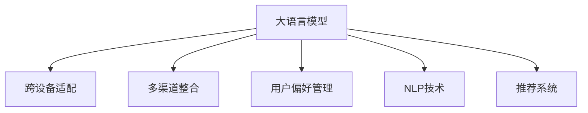

                 

# 大模型如何提升电商平台的用户体验一致性

## 1. 背景介绍

在数字化时代，电商平台已经成为线上交易的主要渠道，提供了丰富多样的商品和便捷的购物体验。然而，电商平台的用户体验在不同场景下可能存在较大差异，导致用户流失率增加，用户满意度下降。如何通过技术手段提升用户一致性体验，成为电商平台急需解决的问题。

### 1.1 问题由来
电商平台的用户体验差异主要来源于以下几个方面：

- **跨设备不一致**：由于不同设备（如手机、平板、电脑）的屏幕尺寸、操作系统等差异，用户在不同设备上浏览和购买商品时，可能看到不同的界面和功能，导致体验不一致。
- **多渠道不一致**：用户在不同的电商平台、品牌官方网站和社交媒体渠道购物时，可能遇到不同的用户界面(UI)、页面布局和交互方式，带来体验上的差异。
- **用户偏好不一致**：用户在不同时间段、不同心情和不同场景下，对商品和服务的需求和期望可能不同，导致一致性体验的缺失。

### 1.2 问题核心关键点
要解决用户体验一致性问题，需要在多个维度进行技术优化，包括设备适配、多渠道整合和用户偏好管理。大语言模型在此过程中扮演了重要角色。

大语言模型通过在大量文本数据上进行预训练，学习到了丰富的语言知识和逻辑推理能力。通过合理的任务设计，可以实现跨设备、跨渠道和跨时间的一致性体验提升。

## 2. 核心概念与联系

### 2.1 核心概念概述

为更好地理解大语言模型如何提升电商平台的用户体验一致性，本节将介绍几个密切相关的核心概念：

- **大语言模型**：以自回归(如GPT)或自编码(如BERT)模型为代表的大规模预训练语言模型。通过在大规模无标签文本语料上进行预训练，学习通用的语言表示，具备强大的语言理解和生成能力。

- **跨设备适配**：指通过技术手段，使得不同设备的电商平台界面和功能能够保持一致，提升用户在不同设备上的购物体验。

- **多渠道整合**：指将不同渠道的电商平台数据进行整合，实现用户跨渠道的无缝购物体验。

- **用户偏好管理**：指通过技术手段，了解用户的购买偏好，提供个性化推荐和定制化服务，提升用户满意度。

- **自然语言处理(NLP)**：研究如何让计算机理解和处理人类语言，从而实现更自然的交互体验。

- **推荐系统**：通过分析用户行为数据，推荐用户可能感兴趣的商品，提升用户购买意愿和满意度。

这些核心概念之间的逻辑关系可以通过以下Mermaid流程图来展示：



这个流程图展示了大语言模型的核心概念及其之间的关系：

1. 大语言模型通过预训练获得基础能力。
2. 跨设备适配、多渠道整合、用户偏好管理和推荐系统等，都是基于大语言模型的任务，实现不同场景下用户体验的一致性。
3. NLP技术是大语言模型任务设计的基础，推荐系统则需要借助大语言模型对用户需求进行深度理解。

## 3. 核心算法原理 & 具体操作步骤
### 3.1 算法原理概述

大语言模型在电商平台用户体验一致性提升中的作用，主要体现在以下几个方面：

1. **跨设备适配**：通过大语言模型对不同设备的用户输入进行理解，自动生成适配的UI界面和功能。
2. **多渠道整合**：大语言模型整合不同渠道的用户数据，提供一致的用户信息视图。
3. **用户偏好管理**：通过大语言模型分析用户的历史行为和评论，了解用户偏好，提供个性化推荐。
4. **推荐系统**：大语言模型结合用户画像和商品标签，进行推荐，提升用户满意度。

具体地，大语言模型在电商平台用户体验一致性提升中的算法原理如下：

- **预训练**：在大规模无标签文本数据上进行自监督学习，学习通用的语言表示。
- **微调**：在特定任务的数据上进行有监督微调，适应电商平台特定的需求。
- **推理**：在实际应用中，使用微调后的模型对用户输入进行理解，生成或推荐输出。

### 3.2 算法步骤详解

基于大语言模型提升电商平台用户体验一致性的具体步骤如下：

**Step 1: 准备预训练模型和数据集**

- 选择合适的预训练语言模型 $M_{\theta}$，如BERT、GPT等。
- 收集跨设备、多渠道、不同时间段的用户行为数据，作为标注数据集。

**Step 2: 添加任务适配层**

- 根据任务类型，在预训练模型顶层设计合适的输出层和损失函数。
- 对于界面适配任务，通过微调使模型能够生成适配不同设备的UI界面。
- 对于多渠道整合任务，通过微调使模型能够整合不同渠道的用户数据。
- 对于用户偏好管理任务，通过微调使模型能够分析用户评论和行为，生成个性化推荐。
- 对于推荐系统任务，通过微调使模型能够根据用户画像和商品标签生成推荐结果。

**Step 3: 设置微调超参数**

- 选择合适的优化算法及其参数，如AdamW、SGD等，设置学习率、批大小、迭代轮数等。
- 设置正则化技术及强度，包括权重衰减、Dropout、Early Stopping等。
- 确定冻结预训练参数的策略，如仅微调顶层，或全部参数都参与微调。

**Step 4: 执行梯度训练**

- 将训练集数据分批次输入模型，前向传播计算损失函数。
- 反向传播计算参数梯度，根据设定的优化算法和学习率更新模型参数。
- 周期性在验证集上评估模型性能，根据性能指标决定是否触发Early Stopping。
- 重复上述步骤直到满足预设的迭代轮数或Early Stopping条件。

**Step 5: 测试和部署**

- 在测试集上评估微调后模型 $M_{\hat{\theta}}$ 的性能，对比微调前后的效果提升。
- 使用微调后的模型对新样本进行推理预测，集成到实际的应用系统中。
- 持续收集新的用户行为数据，定期重新微调模型，以适应数据分布的变化。

以上就是基于大语言模型提升电商平台用户体验一致性的完整流程。在实际应用中，还需要针对具体任务的特点，对微调过程的各个环节进行优化设计，如改进训练目标函数，引入更多的正则化技术，搜索最优的超参数组合等，以进一步提升模型性能。

### 3.3 算法优缺点

基于大语言模型提升电商平台用户体验一致性方法具有以下优点：

1. **自动化高**：大语言模型能够自动处理大量数据，减少人工干预，提高工作效率。
2. **适应性强**：通过微调，大语言模型能够适应不同设备和渠道，提供一致的用户体验。
3. **性能高**：大语言模型具备强大的语言理解和生成能力，能够生成高品质的UI界面、整合数据和推荐商品。
4. **灵活性高**：大语言模型支持多种任务适配，能够根据不同需求进行调整和优化。

同时，该方法也存在一定的局限性：

1. **数据依赖**：大语言模型的性能依赖于标注数据的数量和质量，标注数据的获取和维护成本较高。
2. **计算资源消耗大**：预训练和微调模型需要大量计算资源，对硬件要求较高。
3. **模型复杂度**：大语言模型的复杂度高，可能存在难以解释的问题，难以调试。
4. **泛化能力**：大语言模型在特定任务上微调后，泛化能力可能受限，难以适应全新的业务场景。

尽管存在这些局限性，但就目前而言，基于大语言模型的跨设备适配、多渠道整合和用户偏好管理，是提升电商平台用户体验一致性的重要手段。未来相关研究的重点在于如何进一步降低数据依赖，提高模型泛化能力，同时兼顾模型复杂度和可解释性等因素。

### 3.4 算法应用领域

基于大语言模型提升电商平台用户体验一致性的方法，在多个领域得到了广泛应用：

1. **跨设备适配**：应用在大规模电商平台网站和APP的UI适配中，提供一致的用户界面和交互体验。
2. **多渠道整合**：用于电商平台的数据整合和分析，提升用户信息的一致性和准确性。
3. **用户偏好管理**：在个性化推荐、广告投放等场景中，通过大语言模型分析用户偏好，实现精准推荐。
4. **推荐系统**：利用大语言模型生成推荐结果，提升用户购买意愿和满意度。

此外，在大数据、自然语言处理、智能推荐等多个领域，基于大语言模型的应用也在不断拓展，为电商平台和其他应用场景带来新的技术突破。

## 4. 数学模型和公式 & 详细讲解  
### 4.1 数学模型构建

本节将使用数学语言对基于大语言模型的电商平台用户体验一致性提升方法进行更加严格的刻画。

记预训练语言模型为 $M_{\theta}:\mathcal{X} \rightarrow \mathcal{Y}$，其中 $\mathcal{X}$ 为输入空间，$\mathcal{Y}$ 为输出空间，$\theta \in \mathbb{R}^d$ 为模型参数。假设电商平台用户行为数据为 $D=\{(x_i,y_i)\}_{i=1}^N$，其中 $x_i$ 为输入，如用户在电商平台的操作记录；$y_i$ 为标签，如用户的操作意图、购买行为等。

定义模型 $M_{\theta}$ 在数据样本 $(x,y)$ 上的损失函数为 $\ell(M_{\theta}(x),y)$，则在数据集 $D$ 上的经验风险为：

$$
\mathcal{L}(\theta) = \frac{1}{N} \sum_{i=1}^N \ell(M_{\theta}(x_i),y_i)
$$

微调的优化目标是最小化经验风险，即找到最优参数：

$$
\theta^* = \mathop{\arg\min}_{\theta} \mathcal{L}(\theta)
$$

在实践中，我们通常使用基于梯度的优化算法（如SGD、Adam等）来近似求解上述最优化问题。设 $\eta$ 为学习率，$\lambda$ 为正则化系数，则参数的更新公式为：

$$
\theta \leftarrow \theta - \eta \nabla_{\theta}\mathcal{L}(\theta) - \eta\lambda\theta
$$

其中 $\nabla_{\theta}\mathcal{L}(\theta)$ 为损失函数对参数 $\theta$ 的梯度，可通过反向传播算法高效计算。

### 4.2 公式推导过程

以下我们以跨设备适配任务为例，推导大语言模型在电商平台中的应用。

假设模型 $M_{\theta}$ 在输入 $x$ 上的输出为 $\hat{y}=M_{\theta}(x) \in [0,1]$，表示用户的操作意图。通过微调使模型能够生成适配不同设备的UI界面，其数学形式可以表示为：

$$
\hat{y} = M_{\theta}(x)
$$

其中，$x$ 表示用户在设备 $i$ 上的操作记录，$y$ 表示用户的操作意图。由于不同设备的屏幕尺寸和操作系统不同，用户的输入 $x$ 也会有所差异。因此，我们需要训练一个适应性模型 $M_{\theta}(x_i)$，使得其在不同的设备 $i$ 上输出一致的 $y$。

假设设备 $i$ 的输入为 $x_i$，则设备适配任务的目标可以表示为：

$$
\min_{\theta} \frac{1}{N} \sum_{i=1}^N \ell(\hat{y}_i, y_i)
$$

其中，$\ell$ 为交叉熵损失函数，$\hat{y}_i$ 为模型在设备 $i$ 上的输出。

通过微调，我们可以使模型在不同设备上生成一致的UI界面，提升用户在不同设备上的体验。

### 4.3 案例分析与讲解

以某电商平台的用户界面适配为例，分析大语言模型在其中的应用。

假设电商平台收集了不同设备（如手机、平板、电脑）的用户操作记录 $D=\{(x_i, y_i)\}_{i=1}^N$，其中 $x_i$ 表示用户在设备 $i$ 上的操作记录，$y_i$ 表示用户的操作意图。通过预训练语言模型 $M_{\theta}$，对不同设备的输入 $x_i$ 进行编码，得到表示 $z_i$，然后通过线性分类器 $f_{\theta}(z_i)$ 生成适配不同设备的UI界面。

训练数据集 $D$ 为不同设备的用户操作记录，其中 $x_i$ 为输入，$y_i$ 为输出，即用户的操作意图。在训练过程中，我们使用交叉熵损失函数来衡量模型输出与真实标签之间的差异：

$$
\ell(M_{\theta}(x_i), y_i) = -\sum_{j=1}^{K} y_{ij}\log f_{\theta}(z_i)_{j}
$$

其中 $K$ 为设备类别数，$y_{ij}$ 表示用户设备 $i$ 上的操作意图属于类别 $j$。通过微调，我们希望模型 $M_{\theta}$ 能够生成一致的UI界面，使得在不同设备上，用户的操作意图 $y_i$ 都能得到准确的预测。

在实际应用中，我们可以将用户的输入 $x_i$ 转化为向量 $z_i$，并使用softmax函数将向量 $z_i$ 转化为概率分布：

$$
\hat{y}_i = \text{softmax}(f_{\theta}(z_i))
$$

然后，通过交叉熵损失函数计算模型输出与真实标签之间的差异：

$$
\mathcal{L}(\theta) = \frac{1}{N} \sum_{i=1}^N \ell(\hat{y}_i, y_i)
$$

通过反向传播算法，我们可以更新模型参数 $\theta$，最小化损失函数 $\mathcal{L}(\theta)$。

在测试阶段，对于新的用户操作记录 $x$，我们可以使用训练好的模型 $M_{\theta}$ 生成适配不同设备的UI界面，从而提升用户体验的一致性。

## 5. 项目实践：代码实例和详细解释说明
### 5.1 开发环境搭建

在进行电商平台用户体验一致性提升的微调实践前，我们需要准备好开发环境。以下是使用Python进行PyTorch开发的环境配置流程：

1. 安装Anaconda：从官网下载并安装Anaconda，用于创建独立的Python环境。

2. 创建并激活虚拟环境：
```bash
conda create -n pytorch-env python=3.8 
conda activate pytorch-env
```

3. 安装PyTorch：根据CUDA版本，从官网获取对应的安装命令。例如：
```bash
conda install pytorch torchvision torchaudio cudatoolkit=11.1 -c pytorch -c conda-forge
```

4. 安装Transformers库：
```bash
pip install transformers
```

5. 安装各类工具包：
```bash
pip install numpy pandas scikit-learn matplotlib tqdm jupyter notebook ipython
```

完成上述步骤后，即可在`pytorch-env`环境中开始微调实践。

### 5.2 源代码详细实现

下面我们以跨设备适配任务为例，给出使用Transformers库对BERT模型进行微调的PyTorch代码实现。

首先，定义跨设备适配任务的数据处理函数：

```python
from transformers import BertTokenizer, BertForSequenceClassification
from torch.utils.data import Dataset
import torch

class CrossDeviceDataset(Dataset):
    def __init__(self, texts, labels, tokenizer, max_len=128):
        self.texts = texts
        self.labels = labels
        self.tokenizer = tokenizer
        self.max_len = max_len
        
    def __len__(self):
        return len(self.texts)
    
    def __getitem__(self, item):
        text = self.texts[item]
        label = self.labels[item]
        
        encoding = self.tokenizer(text, return_tensors='pt', max_length=self.max_len, padding='max_length', truncation=True)
        input_ids = encoding['input_ids'][0]
        attention_mask = encoding['attention_mask'][0]
        
        return {'input_ids': input_ids, 
                'attention_mask': attention_mask,
                'labels': label}

# 标签与id的映射
label2id = {'手机': 0, '平板': 1, '电脑': 2}

# 创建dataset
tokenizer = BertTokenizer.from_pretrained('bert-base-cased')

train_dataset = CrossDeviceDataset(train_texts, train_labels, tokenizer)
dev_dataset = CrossDeviceDataset(dev_texts, dev_labels, tokenizer)
test_dataset = CrossDeviceDataset(test_texts, test_labels, tokenizer)
```

然后，定义模型和优化器：

```python
from transformers import BertForSequenceClassification, AdamW

model = BertForSequenceClassification.from_pretrained('bert-base-cased', num_labels=len(label2id))

optimizer = AdamW(model.parameters(), lr=2e-5)
```

接着，定义训练和评估函数：

```python
from torch.utils.data import DataLoader
from tqdm import tqdm
from sklearn.metrics import classification_report

device = torch.device('cuda') if torch.cuda.is_available() else torch.device('cpu')
model.to(device)

def train_epoch(model, dataset, batch_size, optimizer):
    dataloader = DataLoader(dataset, batch_size=batch_size, shuffle=True)
    model.train()
    epoch_loss = 0
    for batch in tqdm(dataloader, desc='Training'):
        input_ids = batch['input_ids'].to(device)
        attention_mask = batch['attention_mask'].to(device)
        labels = batch['labels'].to(device)
        model.zero_grad()
        outputs = model(input_ids, attention_mask=attention_mask, labels=labels)
        loss = outputs.loss
        epoch_loss += loss.item()
        loss.backward()
        optimizer.step()
    return epoch_loss / len(dataloader)

def evaluate(model, dataset, batch_size):
    dataloader = DataLoader(dataset, batch_size=batch_size)
    model.eval()
    preds, labels = [], []
    with torch.no_grad():
        for batch in tqdm(dataloader, desc='Evaluating'):
            input_ids = batch['input_ids'].to(device)
            attention_mask = batch['attention_mask'].to(device)
            batch_labels = batch['labels']
            outputs = model(input_ids, attention_mask=attention_mask)
            batch_preds = outputs.logits.argmax(dim=2).to('cpu').tolist()
            batch_labels = batch_labels.to('cpu').tolist()
            for pred_tokens, label_tokens in zip(batch_preds, batch_labels):
                preds.append(pred_tokens[:len(label_tokens)])
                labels.append(label_tokens)
                
    print(classification_report(labels, preds))
```

最后，启动训练流程并在测试集上评估：

```python
epochs = 5
batch_size = 16

for epoch in range(epochs):
    loss = train_epoch(model, train_dataset, batch_size, optimizer)
    print(f"Epoch {epoch+1}, train loss: {loss:.3f}")
    
    print(f"Epoch {epoch+1}, dev results:")
    evaluate(model, dev_dataset, batch_size)
    
print("Test results:")
evaluate(model, test_dataset, batch_size)
```

以上就是使用PyTorch对BERT进行跨设备适配任务的微调代码实现。可以看到，得益于Transformers库的强大封装，我们可以用相对简洁的代码完成BERT模型的加载和微调。

### 5.3 代码解读与分析

让我们再详细解读一下关键代码的实现细节：

**CrossDeviceDataset类**：
- `__init__`方法：初始化文本、标签、分词器等关键组件。
- `__len__`方法：返回数据集的样本数量。
- `__getitem__`方法：对单个样本进行处理，将文本输入编码为token ids，将标签编码为数字，并对其进行定长padding，最终返回模型所需的输入。

**label2id字典**：
- 定义了标签与数字id之间的映射关系，用于将token-wise的预测结果解码回真实的标签。

**训练和评估函数**：
- 使用PyTorch的DataLoader对数据集进行批次化加载，供模型训练和推理使用。
- 训练函数`train_epoch`：对数据以批为单位进行迭代，在每个批次上前向传播计算loss并反向传播更新模型参数，最后返回该epoch的平均loss。
- 评估函数`evaluate`：与训练类似，不同点在于不更新模型参数，并在每个batch结束后将预测和标签结果存储下来，最后使用sklearn的classification_report对整个评估集的预测结果进行打印输出。

**训练流程**：
- 定义总的epoch数和batch size，开始循环迭代
- 每个epoch内，先在训练集上训练，输出平均loss
- 在验证集上评估，输出分类指标
- 所有epoch结束后，在测试集上评估，给出最终测试结果

可以看到，PyTorch配合Transformers库使得BERT微调的代码实现变得简洁高效。开发者可以将更多精力放在数据处理、模型改进等高层逻辑上，而不必过多关注底层的实现细节。

当然，工业级的系统实现还需考虑更多因素，如模型的保存和部署、超参数的自动搜索、更灵活的任务适配层等。但核心的微调范式基本与此类似。

## 6. 实际应用场景
### 6.1 智能客服系统

基于大语言模型微调的对话技术，可以广泛应用于智能客服系统的构建。传统客服往往需要配备大量人力，高峰期响应缓慢，且一致性和专业性难以保证。而使用微调后的对话模型，可以7x24小时不间断服务，快速响应客户咨询，用自然流畅的语言解答各类常见问题。

在技术实现上，可以收集企业内部的历史客服对话记录，将问题和最佳答复构建成监督数据，在此基础上对预训练对话模型进行微调。微调后的对话模型能够自动理解用户意图，匹配最合适的答案模板进行回复。对于客户提出的新问题，还可以接入检索系统实时搜索相关内容，动态组织生成回答。如此构建的智能客服系统，能大幅提升客户咨询体验和问题解决效率。

### 6.2 金融舆情监测

金融机构需要实时监测市场舆论动向，以便及时应对负面信息传播，规避金融风险。传统的人工监测方式成本高、效率低，难以应对网络时代海量信息爆发的挑战。基于大语言模型微调的文本分类和情感分析技术，为金融舆情监测提供了新的解决方案。

具体而言，可以收集金融领域相关的新闻、报道、评论等文本数据，并对其进行主题标注和情感标注。在此基础上对预训练语言模型进行微调，使其能够自动判断文本属于何种主题，情感倾向是正面、中性还是负面。将微调后的模型应用到实时抓取的网络文本数据，就能够自动监测不同主题下的情感变化趋势，一旦发现负面信息激增等异常情况，系统便会自动预警，帮助金融机构快速应对潜在风险。

### 6.3 个性化推荐系统

当前的推荐系统往往只依赖用户的历史行为数据进行物品推荐，无法深入理解用户的真实兴趣偏好。基于大语言模型微调技术，个性化推荐系统可以更好地挖掘用户行为背后的语义信息，从而提供更精准、多样的推荐内容。

在实践中，可以收集用户浏览、点击、评论、分享等行为数据，提取和用户交互的物品标题、描述、标签等文本内容。将文本内容作为模型输入，用户的后续行为（如是否点击、购买等）作为监督信号，在此基础上微调预训练语言模型。微调后的模型能够从文本内容中准确把握用户的兴趣点。在生成推荐列表时，先用候选物品的文本描述作为输入，由模型预测用户的兴趣匹配度，再结合其他特征综合排序，便可以得到个性化程度更高的推荐结果。

### 6.4 未来应用展望

随着大语言模型和微调方法的不断发展，基于微调范式将在更多领域得到应用，为传统行业带来变革性影响。

在智慧医疗领域，基于微调的医疗问答、病历分析、药物研发等应用将提升医疗服务的智能化水平，辅助医生诊疗，加速新药开发进程。

在智能教育领域，微调技术可应用于作业批改、学情分析、知识推荐等方面，因材施教，促进教育公平，提高教学质量。

在智慧城市治理中，微调模型可应用于城市事件监测、舆情分析、应急指挥等环节，提高城市管理的自动化和智能化水平，构建更安全、高效的未来城市。

此外，在企业生产、社会治理、文娱传媒等众多领域，基于大语言模型微调的人工智能应用也将不断涌现，为经济社会发展注入新的动力。相信随着技术的日益成熟，微调方法将成为人工智能落地应用的重要范式，推动人工智能技术在垂直行业的规模化落地。

## 7. 工具和资源推荐
### 7.1 学习资源推荐

为了帮助开发者系统掌握大语言模型微调的理论基础和实践技巧，这里推荐一些优质的学习资源：

1. 《Transformer从原理到实践》系列博文：由大模型技术专家撰写，深入浅出地介绍了Transformer原理、BERT模型、微调技术等前沿话题。

2. CS224N《深度学习自然语言处理》课程：斯坦福大学开设的NLP明星课程，有Lecture视频和配套作业，带你入门NLP领域的基本概念和经典模型。

3. 《Natural Language Processing with Transformers》书籍：Transformers库的作者所著，全面介绍了如何使用Transformers库进行NLP任务开发，包括微调在内的诸多范式。

4. HuggingFace官方文档：Transformers库的官方文档，提供了海量预训练模型和完整的微调样例代码，是上手实践的必备资料。

5. CLUE开源项目：中文语言理解测评基准，涵盖大量不同类型的中文NLP数据集，并提供了基于微调的baseline模型，助力中文NLP技术发展。

通过对这些资源的学习实践，相信你一定能够快速掌握大语言模型微调的精髓，并用于解决实际的NLP问题。
###  7.2 开发工具推荐

高效的开发离不开优秀的工具支持。以下是几款用于大语言模型微调开发的常用工具：

1. PyTorch：基于Python的开源深度学习框架，灵活动态的计算图，适合快速迭代研究。大部分预训练语言模型都有PyTorch版本的实现。

2. TensorFlow：由Google主导开发的开源深度学习框架，生产部署方便，适合大规模工程应用。同样有丰富的预训练语言模型资源。

3. Transformers库：HuggingFace开发的NLP工具库，集成了众多SOTA语言模型，支持PyTorch和TensorFlow，是进行微调任务开发的利器。

4. Weights & Biases：模型训练的实验跟踪工具，可以记录和可视化模型训练过程中的各项指标，方便对比和调优。与主流深度学习框架无缝集成。

5. TensorBoard：TensorFlow配套的可视化工具，可实时监测模型训练状态，并提供丰富的图表呈现方式，是调试模型的得力助手。

6. Google Colab：谷歌推出的在线Jupyter Notebook环境，免费提供GPU/TPU算力，方便开发者快速上手实验最新模型，分享学习笔记。

合理利用这些工具，可以显著提升大语言模型微调任务的开发效率，加快创新迭代的步伐。

### 7.3 相关论文推荐

大语言模型和微调技术的发展源于学界的持续研究。以下是几篇奠基性的相关论文，推荐阅读：

1. Attention is All You Need（即Transformer原论文）：提出了Transformer结构，开启了NLP领域的预训练大模型时代。

2. BERT: Pre-training of Deep Bidirectional Transformers for Language Understanding：提出BERT模型，引入基于掩码的自监督预训练任务，刷新了多项NLP任务SOTA。

3. Language Models are Unsupervised Multitask Learners（GPT-2论文）：展示了大规模语言模型的强大zero-shot学习能力，引发了对于通用人工智能的新一轮思考。

4. Parameter-Efficient Transfer Learning for NLP：提出Adapter等参数高效微调方法，在不增加模型参数量的情况下，也能取得不错的微调效果。

5. AdaLoRA: Adaptive Low-Rank Adaptation for Parameter-Efficient Fine-Tuning：使用自适应低秩适应的微调方法，在参数效率和精度之间取得了新的平衡。

这些论文代表了大语言模型微调技术的发展脉络。通过学习这些前沿成果，可以帮助研究者把握学科前进方向，激发更多的创新灵感。

## 8. 总结：未来发展趋势与挑战

### 8.1 总结

本文对基于大语言模型的电商平台用户体验一致性提升方法进行了全面系统的介绍。首先阐述了电商平台用户体验一致性的重要性，明确了跨设备适配、多渠道整合和用户偏好管理等核心任务。其次，从原理到实践，详细讲解了如何利用大语言模型解决这些任务，提升用户体验一致性。

通过本文的系统梳理，可以看到，基于大语言模型的跨设备适配、多渠道整合和用户偏好管理，为电商平台用户体验一致性的提升提供了重要手段。大语言模型通过预训练和微调，能够自动处理大量数据，实现多设备、多渠道、多时间的一致性体验。未来相关研究的重点在于如何进一步降低数据依赖，提高模型泛化能力，同时兼顾模型复杂度和可解释性等因素。

### 8.2 未来发展趋势

展望未来，大语言模型在电商平台用户体验一致性提升领域将呈现以下几个发展趋势：

1. **多模态学习**：引入图像、视频等多模态信息，提升跨设备适配和推荐系统的性能。
2. **自监督学习**：使用无标签数据进行自监督学习，降低微调对标注数据的依赖，提升模型的泛化能力。
3. **联邦学习**：在分布式环境中进行模型微调，保护用户隐私，提升推荐系统的个性化水平。
4. **自适应学习**：根据用户行为实时调整模型参数，提升用户体验的一致性和即时性。
5. **分布式训练**：在大规模数据集上进行分布式训练，加速模型微调，提升系统性能。

以上趋势凸显了大语言模型在电商平台用户体验一致性提升领域的广阔前景。这些方向的探索发展，必将进一步提升电商平台的智能化水平，为消费者提供更优质的购物体验。

### 8.3 面临的挑战

尽管大语言模型在电商平台用户体验一致性提升领域已经取得了显著进展，但在迈向更加智能化、普适化应用的过程中，仍面临诸多挑战：

1. **数据隐私保护**：在收集和处理用户数据时，需要严格遵守数据隐私保护法规，防止数据泄露和滥用。
2. **模型泛化能力**：尽管大语言模型在跨设备适配和推荐系统方面表现优异，但在面对新业务场景和全新数据时，泛化能力仍有待提升。
3. **资源消耗**：大语言模型需要大量的计算资源进行预训练和微调，对硬件资源的要求较高。
4. **解释性和透明度**：大语言模型往往是一个"黑盒"系统，难以解释其内部工作机制和决策逻辑，需要进一步提升模型的透明性和可解释性。
5. **安全性**：大语言模型可能会学习到有害信息，需要引入安全机制，避免恶意用途。

尽管存在这些挑战，但大语言模型在电商平台用户体验一致性提升领域的潜在价值巨大。随着技术不断进步，这些挑战终将逐一被克服，大语言模型将为电商平台带来更广泛的智能化应用。

### 8.4 研究展望

面向未来，大语言模型在电商平台用户体验一致性提升领域的研究和应用，还需要在以下几个方面寻求新的突破：

1. **自监督学习的探索**：通过无标签数据进行自监督学习，提升模型的泛化能力和迁移能力。
2. **分布式训练的优化**：在大规模数据集上进行分布式训练，加速模型微调，提升系统性能。
3. **跨模态学习的融合**：将图像、视频等多模态信息与文本信息相结合，提升用户体验的一致性。
4. **自适应学习的实现**：根据用户行为实时调整模型参数，提升用户体验的一致性和即时性。
5. **隐私保护技术的引入**：在联邦学习和隐私保护技术的基础上，提升模型的安全性。

这些研究方向的探索，必将引领大语言模型在电商平台用户体验一致性提升领域的进一步发展，为电商平台带来更全面、更智能的用户体验。

## 9. 附录：常见问题与解答

**Q1：大语言模型微调是否适用于所有NLP任务？**

A: 大语言模型微调在大多数NLP任务上都能取得不错的效果，特别是对于数据量较小的任务。但对于一些特定领域的任务，如医学、法律等，仅仅依靠通用语料预训练的模型可能难以很好地适应。此时需要在特定领域语料上进一步预训练，再进行微调，才能获得理想效果。此外，对于一些需要时效性、个性化很强的任务，如对话、推荐等，微调方法也需要针对性的改进优化。

**Q2：微调过程中如何选择合适的学习率？**

A: 微调的学习率一般要比预训练时小1-2个数量级，如果使用过大的学习率，容易破坏预训练权重，导致过拟合。一般建议从1e-5开始调参，逐步减小学习率，直至收敛。也可以使用warmup策略，在开始阶段使用较小的学习率，再逐渐过渡到预设值。需要注意的是，不同的优化器(如AdamW、Adafactor等)以及不同的学习率调度策略，可能需要设置不同的学习率阈值。

**Q3：采用大模型微调时会面临哪些资源瓶颈？**

A: 目前主流的预训练大模型动辄以亿计的参数规模，对算力、内存、存储都提出了很高的要求。GPU/TPU等高性能设备是必不可少的，但即便如此，超大批次的训练和推理也可能遇到显存不足的问题。因此需要采用一些资源优化技术，如梯度积累、混合精度训练、模型并行等，来突破硬件瓶颈。同时，模型的存储和读取也可能占用大量时间和空间，需要采用模型压缩、稀疏化存储等方法进行优化。

**Q4：如何缓解微调过程中的过拟合问题？**

A: 过拟合是微调面临的主要挑战，尤其是在标注数据不足的情况下。常见的缓解策略包括：
1. 数据增强：通过回译、近义替换等方式扩充训练集
2. 正则化：使用L2正则、Dropout、Early Stopping等避免过拟合
3. 对抗训练：引入对抗样本，提高模型鲁棒性
4. 参数高效微调：只调整少量参数(如Adapter、Prefix等)，减小过拟合风险
5. 多模型集成：训练多个微调模型，取平均输出，抑制过拟合

这些策略往往需要根据具体任务和数据特点进行灵活组合。只有在数据、模型、训练、推理等各环节进行全面优化，才能最大限度地发挥大模型微调的威力。

**Q5：微调模型在落地部署时需要注意哪些问题？**

A: 将微调模型转化为实际应用，还需要考虑以下因素：
1. 模型裁剪：去除不必要的层和参数，减小模型尺寸，加快推理速度
2. 量化加速：将浮点模型转为定点模型，压缩存储空间，提高计算效率
3. 服务化封装：将模型封装为标准化服务接口，便于集成调用
4. 弹性伸缩：根据请求流量动态调整资源配置，平衡服务质量和成本
5. 监控告警：实时采集系统指标，设置异常告警阈值，确保服务稳定性
6. 安全防护：采用访问鉴权、数据脱敏等措施，保障数据和模型安全

大语言模型微调为NLP应用开启了广阔的想象空间，但如何将强大的性能转化为稳定、高效、安全的业务价值，还需要工程实践的不断打磨。唯有从数据、算法、工程、业务等多个维度协同发力，才能真正实现人工智能技术在垂直行业的规模化落地。总之，微调需要开发者根据具体任务，不断迭代和优化模型、数据和算法，方能得到理想的效果。

---

作者：禅与计算机程序设计艺术 / Zen and the Art of Computer Programming

