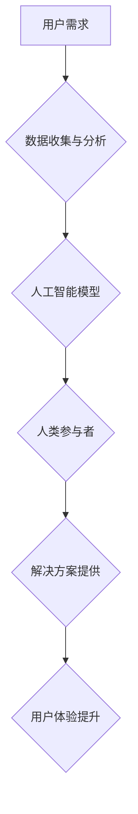

                 

## 关键词：用户体验，人类计算，客户满意度，交互设计，人工智能，数据分析，用户行为，情感计算

## 1. 背景介绍

在当今数字化时代，用户体验 (User Experience，简称 UX) 已成为企业竞争力的关键因素。用户对产品和服务的体验直接影响着他们的满意度、忠诚度和最终的购买决策。而人类计算 (Human Computation) 作为一种将人类智能与计算机计算相结合的新兴范式，为提升用户体验提供了全新的思路和方法。

人类计算的核心思想是利用人类的独特优势，例如创造力、判断力和理解复杂情境的才能，来解决计算机难以处理的问题。通过将一些任务分配给人类参与者，并结合计算机的计算能力和数据分析能力，可以实现更高效、更精准的用户体验。

## 2. 核心概念与联系

### 2.1 人类计算

人类计算是指利用人类智能和计算机计算相结合的方式，完成各种任务。它可以分为以下几种类型：

* **微任务 (Micro-tasks):** 将大型任务分解成许多简单易完成的小任务，由人类参与者分担完成。
* **协作计算 (Collaborative Computation):** 多个人类参与者共同合作完成一个复杂的任务，例如翻译、数据标注等。
* **大众科学 (Citizen Science):** 利用大众参与者进行科学研究，例如收集天文观测数据、分析基因序列等。

### 2.2 用户体验

用户体验是指用户与产品或服务交互时所感受到的整体感受。它包括以下几个方面：

* **可用性 (Usability):** 产品或服务是否易于使用和理解。
* **易用性 (Ease of Use):** 产品或服务是否简单直观，用户可以轻松完成目标任务。
* **愉悦性 (Enjoyment):** 用户使用产品或服务时是否感到愉悦和满足。
* **价值 (Value):** 产品或服务是否能够为用户提供实际的价值和帮助。

### 2.3 人类计算与用户体验的联系

人类计算可以有效提升用户体验，主要体现在以下几个方面：

* **个性化体验 (Personalized Experience):** 通过收集用户数据，人类计算可以为每个用户提供个性化的产品推荐、服务建议等，提升用户满意度。
* **情感感知 (Emotional Intelligence):** 人类计算可以结合情感计算技术，识别用户的潜在情感需求，并提供相应的解决方案，例如提供更人性化的客服服务。
* **复杂问题解决 (Complex Problem Solving):** 人类计算可以帮助解决一些计算机难以处理的复杂问题，例如图像识别、自然语言理解等，从而提升用户体验。

**Mermaid 流程图**



## 3. 核心算法原理 & 具体操作步骤

### 3.1 算法原理概述

人类计算算法通常基于以下几个核心原理：

* **分而治之 (Divide and Conquer):** 将大型任务分解成许多简单易完成的小任务，由多个人类参与者分担完成。
* **协同工作 (Collaboration):** 利用多个人类参与者的智慧和经验，共同解决复杂问题。
* **反馈机制 (Feedback Loop):** 通过收集用户反馈，不断优化算法和流程，提升用户体验。

### 3.2 算法步骤详解

一个典型的微任务人类计算算法流程如下：

1. **任务分解:** 将大型任务分解成许多简单易完成的小任务。
2. **任务分配:** 将任务分配给合适的参与者，例如根据参与者的技能、经验和兴趣进行分配。
3. **任务执行:** 参与者完成分配的任务，并提交结果。
4. **结果验证:** 系统对参与者提交的结果进行验证，例如通过人工审核、算法评估等方式。
5. **结果整合:** 将所有参与者提交的结果整合在一起，形成最终的解决方案。
6. **反馈机制:** 收集用户反馈，并根据反馈进行算法和流程的优化。

### 3.3 算法优缺点

**优点:**

* **高效:** 可以利用大量人类参与者的力量，快速完成大型任务。
* **精准:** 人类参与者可以根据上下文和理解进行判断，提高任务完成的准确性。
* **灵活:** 可以根据任务需求灵活调整算法和流程。

**缺点:**

* **成本:** 人类参与者需要付出时间和精力，因此成本相对较高。
* **效率:** 人类参与者的效率可能不如计算机，尤其是在重复性任务方面。
* **质量控制:** 需要建立有效的质量控制机制，确保参与者提交的结果质量。

### 3.4 算法应用领域

人类计算算法广泛应用于以下领域:

* **数据标注:** 为机器学习模型提供训练数据。
* **图像识别:** 识别图像中的物体、场景等。
* **自然语言处理:** 理解和生成自然语言文本。
* **客服服务:** 提供个性化和人性化的客服服务。
* **科学研究:** 利用大众参与者进行科学研究。

## 4. 数学模型和公式 & 详细讲解 & 举例说明

### 4.1 数学模型构建

人类计算的数学模型通常基于概率论和统计学，例如贝叶斯网络、马尔可夫链等。这些模型可以用来预测人类参与者的行为，评估任务完成的概率，以及优化算法和流程。

### 4.2 公式推导过程

例如，在微任务人类计算中，我们可以使用贝叶斯定理来计算参与者完成任务的概率。假设：

* P(T) 是任务完成的概率。
* P(H|T) 是参与者完成任务的概率，给定任务完成的情况下。
* P(H) 是参与者完成任务的概率，不考虑任务完成情况。

则根据贝叶斯定理，我们可以得到：

$$P(T|H) = \frac{P(H|T)P(T)}{P(H)}$$

其中，P(T|H) 是参与者完成任务的情况下，任务完成的概率。

### 4.3 案例分析与讲解

例如，假设我们有一个图像识别任务，需要人类参与者标注图像中的物体。我们可以使用贝叶斯网络来建模参与者标注的准确率，并根据参与者的历史标注数据，预测其标注当前图像的准确率。

## 5. 项目实践：代码实例和详细解释说明

### 5.1 开发环境搭建

* **操作系统:** Linux/macOS/Windows
* **编程语言:** Python
* **框架:** Flask/Django
* **数据库:** MySQL/PostgreSQL
* **工具:** Git、Docker

### 5.2 源代码详细实现

```python
# 这是一个简单的微任务人类计算示例代码

from flask import Flask, request, jsonify

app = Flask(__name__)

# 任务数据
tasks = [
    {
        'id': 1,
        'title': '标注图像中的物体',
        'description': '请标注图像中出现的物体类型',
        'status': 'pending'
    }
]

# 任务分配逻辑
def assign_task(task_id):
    # 根据参与者的技能和经验，分配任务
    # ...

# 任务结果验证逻辑
def validate_result(task_id, result):
    # 验证参与者提交的结果
    # ...

@app.route('/tasks', methods=['GET'])
def get_tasks():
    return jsonify(tasks)

@app.route('/tasks/<int:task_id>', methods=['POST'])
def submit_result(task_id):
    data = request.get_json()
    result = data['result']

    # 验证结果
    if validate_result(task_id, result):
        # 更新任务状态
        tasks[task_id]['status'] = 'completed'
        return jsonify({'message': '任务完成'})
    else:
        return jsonify({'error': '结果验证失败'}), 400

if __name__ == '__main__':
    app.run(debug=True)
```

### 5.3 代码解读与分析

* 该代码示例是一个简单的微任务人类计算系统，使用 Flask 框架构建。
* 系统包含任务数据、任务分配逻辑、任务结果验证逻辑等模块。
* 用户可以通过 API 接口提交任务结果，系统会验证结果并更新任务状态。

### 5.4 运行结果展示

* 运行该代码后，可以访问 http://127.0.0.1:5000/tasks 接口获取任务列表。
* 用户可以通过 http://127.0.0.1:5000/tasks/<task_id> 接口提交任务结果。

## 6. 实际应用场景

### 6.1 个性化推荐

* 利用人类计算收集用户数据，例如浏览历史、购买记录、评价等，构建用户画像，并根据用户画像提供个性化的产品推荐。

### 6.2 情感分析

* 利用人类计算识别用户在文本、语音、图像等多种媒介中的情感表达，例如快乐、悲伤、愤怒等，并根据情感分析结果提供相应的解决方案，例如个性化客服服务、情感支持等。

### 6.3 内容审核

* 利用人类计算对用户上传的内容进行审核，例如文本、图像、视频等，识别违规内容，例如色情、暴力、垃圾信息等，并进行相应的处理。

### 6.4 知识图谱构建

* 利用人类计算收集和标注知识，构建知识图谱，例如人物关系、事件关联等，为搜索引擎、问答系统等提供知识支持。

### 6.5 未来应用展望

* 人类计算与人工智能技术的结合将带来更多创新应用，例如：
    * 更智能的虚拟助手
    * 更精准的医疗诊断
    * 更个性化的教育体验
    * 更高效的科学研究

## 7. 工具和资源推荐

### 7.1 学习资源推荐

* **书籍:**
    * Human Computation: A Guide to the Future of Work
    * The Age of AI: And Our Human Future
* **在线课程:**
    * Coursera: Human Computation
    * edX: Introduction to Artificial Intelligence

### 7.2 开发工具推荐

* **Amazon Mechanical Turk:** 人工智能任务平台
* **Figure Eight:** 数据标注平台
* **CrowdFlower:** 人工智能数据平台

### 7.3 相关论文推荐

* **Human Computation: A Guide to the Future of Work**
* **The Age of AI: And Our Human Future**
* **Human-in-the-Loop Machine Learning**

## 8. 总结：未来发展趋势与挑战

### 8.1 研究成果总结

人类计算为提升用户体验提供了新的思路和方法，并取得了显著的成果。例如，在图像识别、自然语言处理、数据标注等领域，人类计算算法能够有效提高任务完成的准确性和效率。

### 8.2 未来发展趋势

* 人类计算与人工智能技术的深度融合，例如将人类智能融入到人工智能算法中，提升人工智能的泛化能力和鲁棒性。
* 人类计算平台的更加智能化和自动化，例如自动分配任务、自动验证结果、自动优化算法等。
* 人类计算的应用场景更加广泛，例如医疗诊断、教育培训、科学研究等。

### 8.3 面临的挑战

* 如何保证人类参与者的质量和效率。
* 如何建立有效的激励机制，吸引更多的人参与人类计算。
* 如何解决人类计算带来的伦理和隐私问题。

### 8.4 研究展望

未来，人类计算将继续朝着更加智能化、自动化、普惠化的方向发展，为提升用户体验做出更大的贡献。


## 9. 附录：常见问题与解答

* **什么是人类计算？**

人类计算是指利用人类智能和计算机计算相结合的方式，完成各种任务。

* **人类计算有哪些应用场景？**

人类计算广泛应用于数据标注、图像识别、自然语言处理、客服服务、科学研究等领域。

* **人类计算的优势和劣势是什么？**

人类计算的优势在于能够利用人类的独特优势，例如创造力、判断力和理解复杂情境的才能，解决计算机难以处理的问题。劣势在于成本相对较高，效率可能不如计算机。

* **如何参与人类计算？**

可以通过一些在线平台参与人类计算，例如 Amazon Mechanical Turk、Figure Eight 等。

* **人类计算的未来发展趋势是什么？**

未来，人类计算将更加智能化、自动化、普惠化，并与人工智能技术深度融合，为提升用户体验做出更大的贡献。


作者：禅与计算机程序设计艺术 / Zen and the Art of Computer Programming 
<end_of_turn>

