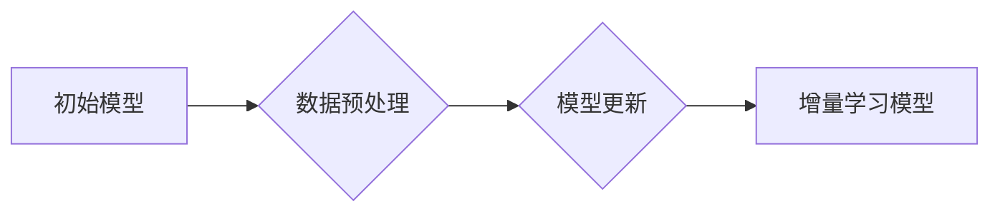

                 

## 电商平台中AI大模型的增量学习技术

> 关键词：电商平台、AI大模型、增量学习、迁移学习、知识蒸馏、模型更新、效率优化

## 1. 背景介绍

随着人工智能技术的飞速发展，大模型在电商平台的应用日益广泛，例如商品推荐、搜索引擎、客户服务等领域。然而，训练大型语言模型（LLM）通常需要海量数据和巨大的计算资源，这对于电商平台来说是一个巨大的挑战。

增量学习作为一种高效的模型更新方法，能够在不重新训练整个模型的情况下，利用新数据不断提升模型性能，从而有效解决电商平台大模型训练成本高、更新周期长的问题。

## 2. 核心概念与联系

增量学习的核心思想是，在训练新模型时，可以利用之前已训练好的模型的知识，从而减少训练时间和资源消耗。

**增量学习与迁移学习的关系：**

增量学习可以看作是迁移学习的一种特殊形式，它侧重于利用之前模型的知识进行模型更新，而迁移学习则更广泛，可以包括多种知识迁移方式，例如特征迁移、参数迁移等。

**增量学习与知识蒸馏的关系：**

知识蒸馏是一种将知识从大型模型迁移到小型模型的技术，它可以作为增量学习的一部分，帮助构建更轻量级的模型，从而降低部署成本。

**增量学习架构：**



## 3. 核心算法原理 & 具体操作步骤

### 3.1  算法原理概述

增量学习算法的核心是找到一种方法，能够有效地将新数据融入到之前模型的知识中，从而提升模型性能。常见的增量学习算法包括：

* **基于梯度的更新：** 这种方法直接利用新数据的梯度信息，更新模型参数，从而实现模型的增量更新。
* **基于知识蒸馏的更新：** 这种方法将大型模型作为教师模型，将小型模型作为学生模型，通过最小化教师模型和学生模型的输出差异，实现知识迁移。
* **基于元学习的更新：** 这种方法利用元学习的思想，学习如何学习，从而能够更有效地适应新的数据分布。

### 3.2  算法步骤详解

以基于梯度的更新为例，其具体操作步骤如下：

1. **数据预处理：** 将新数据进行预处理，例如文本清洗、特征提取等。
2. **模型加载：** 加载之前训练好的模型参数。
3. **梯度计算：** 使用新数据计算模型的梯度。
4. **参数更新：** 根据梯度信息，更新模型参数。
5. **模型评估：** 使用验证集评估模型性能，并根据评估结果调整学习率等超参数。

### 3.3  算法优缺点

**优点：**

* **效率高：** 相比于重新训练整个模型，增量学习可以显著减少训练时间和资源消耗。
* **性能提升：** 通过不断学习新数据，增量学习可以不断提升模型性能。
* **可持续发展：** 增量学习可以实现模型的持续更新，从而适应不断变化的数据分布。

**缺点：**

* **灾难性遗忘：** 当模型学习新数据时，可能会遗忘之前学习到的知识，导致性能下降。
* **数据质量依赖：** 增量学习的性能依赖于新数据的质量，如果新数据质量较差，可能会导致模型性能下降。
* **算法复杂度：** 一些增量学习算法的复杂度较高，需要更多的计算资源和开发时间。

### 3.4  算法应用领域

增量学习在电商平台的应用场景非常广泛，例如：

* **商品推荐：** 利用用户行为数据进行增量学习，不断优化商品推荐算法，提高推荐准确率。
* **搜索引擎：** 利用用户搜索词和点击行为数据进行增量学习，不断优化搜索结果排序，提高用户搜索体验。
* **客户服务：** 利用用户咨询记录进行增量学习，不断优化聊天机器人模型，提高客户服务效率。

## 4. 数学模型和公式 & 详细讲解 & 举例说明

### 4.1  数学模型构建

增量学习的数学模型通常基于梯度下降算法，其目标是最小化模型预测值与真实值的损失函数。

假设模型参数为$\theta$, 训练数据为$\{x_i, y_i\}$, 损失函数为$L(\theta, x_i, y_i)$, 则模型训练的目标函数为：

$$
J(\theta) = \frac{1}{N} \sum_{i=1}^{N} L(\theta, x_i, y_i)
$$

其中，$N$为训练数据样本数量。

### 4.2  公式推导过程

利用梯度下降算法，模型参数的更新公式为：

$$
\theta = \theta - \eta \nabla J(\theta)
$$

其中，$\eta$为学习率，$\nabla J(\theta)$为目标函数$J(\theta)$的梯度。

在增量学习中，新数据加入到训练数据集中后，需要重新计算梯度，并更新模型参数。

### 4.3  案例分析与讲解

假设电商平台要训练一个商品推荐模型，使用用户点击历史数据进行训练。

* **初始模型：** 使用之前训练好的商品推荐模型作为初始模型。
* **新数据：** 收集用户最近一段时间内的点击数据。
* **增量学习：** 使用新数据计算模型梯度，并更新模型参数。

通过不断迭代更新模型参数，最终可以得到一个性能更优的商品推荐模型。

## 5. 项目实践：代码实例和详细解释说明

### 5.1  开发环境搭建

* **操作系统：** Ubuntu 20.04
* **编程语言：** Python 3.8
* **深度学习框架：** TensorFlow 2.x
* **其他依赖：** numpy, pandas, matplotlib等

### 5.2  源代码详细实现

```python
import tensorflow as tf

# 定义模型
class RecommenderModel(tf.keras.Model):
    def __init__(self):
        super(RecommenderModel, self).__init__()
        # ... 模型结构定义 ...

    def call(self, inputs):
        # ... 模型前向传播过程 ...

# 加载初始模型
initial_model = tf.keras.models.load_model('initial_model.h5')

# 加载新数据
new_data = ...

# 训练增量学习模型
optimizer = tf.keras.optimizers.Adam(learning_rate=0.001)
for epoch in range(10):
    with tf.GradientTape() as tape:
        predictions = initial_model(new_data)
        loss = tf.keras.losses.MeanSquaredError()(predictions, new_data_labels)
    gradients = tape.gradient(loss, initial_model.trainable_variables)
    optimizer.apply_gradients(zip(gradients, initial_model.trainable_variables))

# 保存增量学习模型
initial_model.save('incremental_model.h5')
```

### 5.3  代码解读与分析

* **模型定义：** 代码定义了一个名为`RecommenderModel`的模型，其结构和前向传播过程需要根据实际应用场景进行定制。
* **模型加载：** 使用`tf.keras.models.load_model`函数加载之前训练好的初始模型。
* **数据加载：** 使用`...`代表实际加载新数据的代码，需要根据数据格式进行调整。
* **训练增量学习模型：** 使用`tf.keras.optimizers.Adam`优化器，对模型参数进行更新。
* **模型保存：** 使用`initial_model.save`函数保存训练后的增量学习模型。

### 5.4  运行结果展示

运行代码后，可以得到一个性能更优的增量学习模型，并将其用于实际应用场景中。

## 6. 实际应用场景

### 6.1  商品推荐

电商平台可以利用用户浏览历史、购买记录等数据进行增量学习，不断优化商品推荐算法，提高推荐准确率和用户满意度。

### 6.2  搜索引擎

电商平台可以利用用户搜索词和点击行为数据进行增量学习，不断优化搜索结果排序，提高用户搜索体验。

### 6.3  客户服务

电商平台可以利用用户咨询记录进行增量学习，不断优化聊天机器人模型，提高客户服务效率和用户满意度。

### 6.4  未来应用展望

随着人工智能技术的不断发展，增量学习在电商平台的应用场景将会更加广泛，例如：

* **个性化营销：** 利用用户画像数据进行增量学习，实现个性化商品推荐和营销活动。
* **智能客服：** 利用用户咨询记录进行增量学习，构建更智能、更精准的客服机器人。
* **欺诈检测：** 利用用户行为数据进行增量学习，识别和预防欺诈行为。

## 7. 工具和资源推荐

### 7.1  学习资源推荐

* **书籍：**
    * 《深度学习》 - Ian Goodfellow, Yoshua Bengio, Aaron Courville
    * 《机器学习》 - Tom Mitchell
* **在线课程：**
    * Coursera: Deep Learning Specialization
    * Udacity: Machine Learning Engineer Nanodegree

### 7.2  开发工具推荐

* **深度学习框架：** TensorFlow, PyTorch, Keras
* **数据处理工具：** Pandas, NumPy
* **可视化工具：** Matplotlib, Seaborn

### 7.3  相关论文推荐

* **增量学习：**
    * Continual Learning: A Review
    * Elastic Weight Consolidation: Preventing Catastrophic Forgetting in Neural Networks
* **知识蒸馏：**
    * Distilling the Knowledge in a Neural Network
    * Teacher-Student Generative Adversarial Networks

## 8. 总结：未来发展趋势与挑战

### 8.1  研究成果总结

增量学习技术在电商平台的应用取得了显著成果，能够有效降低模型训练成本，提高模型性能，并实现模型的持续更新。

### 8.2  未来发展趋势

* **更有效的灾难性遗忘缓解方法：** 研究更有效的算法和方法，能够有效缓解增量学习中的灾难性遗忘问题。
* **更鲁棒的增量学习算法：** 研究更鲁棒的增量学习算法，能够适应更复杂的数据分布和更动态的环境。
* **更广泛的应用场景：** 将增量学习技术应用到更多电商平台的场景中，例如个性化营销、智能客服等。

### 8.3  面临的挑战

* **数据质量问题：** 增量学习的性能依赖于新数据的质量，如果新数据质量较差，可能会导致模型性能下降。
* **算法复杂度问题：** 一些增量学习算法的复杂度较高，需要更多的计算资源和开发时间。
* **模型解释性问题：** 增量学习模型的内部机制较为复杂，难以解释模型的决策过程。

### 8.4  研究展望

未来，我们将继续研究增量学习技术，致力于开发更有效、更鲁棒、更易解释的增量学习算法，并将其应用到更多电商平台的场景中，为用户提供更优质的体验。

## 9. 附录：常见问题与解答

**问题 1：增量学习与微调有什么区别？**

**解答：** 增量学习和微调都是模型更新的方法，但它们侧重点不同。微调是指在预训练模型的基础上，使用少量新数据进行训练，而增量学习则是利用新数据不断更新模型，并保留之前模型的知识。

**问题 2：增量学习有哪些常见的算法？**

**解答：** 常见的增量学习算法包括基于梯度的更新、基于知识蒸馏的更新和基于元学习的更新。

**问题 3：增量学习有哪些应用场景？**

**解答：** 增量学习在电商平台的应用场景非常广泛，例如商品推荐、搜索引擎、客户服务等。


作者：禅与计算机程序设计艺术 / Zen and the Art of Computer Programming 
<end_of_turn>

