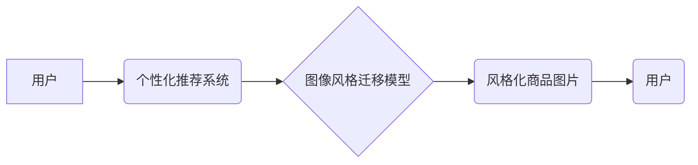

                 

## 电商平台中的图像风格迁移个性化推荐：大模型的创新应用

> 关键词：图像风格迁移、个性化推荐、大模型、深度学习、电商平台

## 1. 背景介绍

随着电商平台的蓬勃发展，个性化推荐已成为提升用户体验、提高转化率的关键技术。传统的个性化推荐方法主要依赖用户行为数据和商品属性信息，但这些方法难以捕捉用户对商品的审美偏好和情感共鸣。图像风格迁移技术作为一种能够将图像风格从一个图像迁移到另一个图像的技术，为电商平台个性化推荐提供了新的思路。

图像风格迁移技术能够根据用户的审美偏好，将商品图片风格化，使其更符合用户的视觉体验，从而提升用户对商品的兴趣和购买意愿。例如，一个用户喜欢复古风格，电商平台可以通过图像风格迁移技术将商品图片风格化成复古风格，从而提高用户对该商品的购买意愿。

## 2. 核心概念与联系

### 2.1 核心概念

* **图像风格迁移:**  一种将图像的风格从一个图像迁移到另一个图像的技术。风格迁移算法通常利用深度学习模型，提取图像的风格特征和内容特征，并通过优化过程将风格特征迁移到目标图像。

* **个性化推荐:**  根据用户的兴趣、偏好、行为等信息，推荐个性化的商品或服务。

* **大模型:**  参数量巨大、训练数据海量、能力强大的深度学习模型。

### 2.2 架构关系



## 3. 核心算法原理 & 具体操作步骤

### 3.1 算法原理概述

图像风格迁移算法通常基于深度学习模型，主要分为两类：

* **基于神经网络的风格迁移算法:**  这类算法利用卷积神经网络 (CNN) 提取图像的风格特征和内容特征，并通过优化过程将风格特征迁移到目标图像。

* **基于梯度下降的风格迁移算法:**  这类算法利用梯度下降算法优化目标图像，使其风格更接近风格图像。

### 3.2 算法步骤详解

1. **选择风格图像和内容图像:**  选择一个风格图像作为风格源，一个内容图像作为内容源。

2. **提取风格特征和内容特征:**  利用预训练的 CNN 模型提取风格图像和内容图像的风格特征和内容特征。

3. **构建损失函数:**  定义一个损失函数，用于衡量风格化图像与风格图像和内容图像之间的差异。

4. **优化目标图像:**  利用梯度下降算法优化目标图像，使其风格更接近风格图像，同时保留内容图像的内容。

5. **生成风格化图像:**  得到最终的风格化图像。

### 3.3 算法优缺点

**优点:**

* 可以生成高质量的风格化图像。
* 可以根据用户的审美偏好进行个性化风格化。

**缺点:**

* 算法复杂度高，计算量大。
* 需要大量的训练数据。

### 3.4 算法应用领域

* **图像编辑:**  将图像风格化，例如将照片风格化成油画风格。
* **艺术创作:**  生成新的艺术作品。
* **游戏开发:**  为游戏场景生成风格化的图像。
* **电商平台:**  个性化推荐商品，提升用户体验。

## 4. 数学模型和公式 & 详细讲解 & 举例说明

### 4.1 数学模型构建

图像风格迁移模型通常采用一个生成对抗网络 (GAN) 的架构，包含两个网络：生成网络 (Generator) 和判别网络 (Discriminator)。

* **生成网络:**  负责生成风格化图像。
* **判别网络:**  负责判断图像是否为真实图像或生成图像。

### 4.2 公式推导过程

损失函数通常由两个部分组成：

* **风格损失:**  衡量生成图像与风格图像的风格相似度。

* **内容损失:**  衡量生成图像与内容图像的内容相似度。

**风格损失:**

$$L_{style} = \sum_{i} \frac{1}{2} \left\| \mathbf{G}(I_{content})_{i} - \mathbf{S}_{i} \right\|^2$$

其中：

* $\mathbf{G}(I_{content})$ 是生成网络生成的图像。
* $\mathbf{S}_{i}$ 是风格图像的第 i 层特征图。

**内容损失:**

$$L_{content} = \sum_{i} \frac{1}{2} \left\| \mathbf{G}(I_{content})_{i} - I_{content}_{i} \right\|^2$$

其中：

* $I_{content}$ 是内容图像。

**总损失函数:**

$$L = L_{style} + \lambda L_{content}$$

其中：

* $\lambda$ 是权重参数，用于平衡风格损失和内容损失。

### 4.3 案例分析与讲解

假设我们想要将一张风景照片风格化成梵高的风格。

1. 选择一张风景照片作为内容图像，一张梵高的画作作为风格图像。

2. 利用预训练的 CNN 模型提取内容图像和风格图像的风格特征和内容特征。

3. 构建损失函数，并设置权重参数 $\lambda$。

4. 利用梯度下降算法优化生成网络，使其生成风格化图像。

5. 得到最终的风格化图像，其风格接近梵高的风格，同时保留了风景照片的内容。

## 5. 项目实践：代码实例和详细解释说明

### 5.1 开发环境搭建

* Python 3.7+
* TensorFlow 2.0+
* PyTorch 1.0+
* CUDA 10.0+

### 5.2 源代码详细实现

```python
import tensorflow as tf

# 定义生成网络
def generator(input_tensor):
    # ...

# 定义判别网络
def discriminator(input_tensor):
    # ...

# 定义损失函数
def loss_function(real_output, fake_output, style_targets, content_targets):
    # ...

# 训练模型
for epoch in range(num_epochs):
    # ...

```

### 5.3 代码解读与分析

* 生成网络负责将内容图像和风格特征融合生成风格化图像。
* 判别网络负责判断图像是否为真实图像或生成图像。
* 损失函数由风格损失和内容损失组成，用于指导模型训练。

### 5.4 运行结果展示

* 展示风格化图像的示例，并与原始图像和风格图像进行对比。

## 6. 实际应用场景

### 6.1 电商平台个性化推荐

* 根据用户的浏览历史、购买记录等数据，分析用户的审美偏好。
* 利用图像风格迁移技术将商品图片风格化，使其更符合用户的审美偏好。
* 展示风格化商品图片，提升用户对商品的兴趣和购买意愿。

### 6.2 其他应用场景

* **社交媒体:**  用户可以将自己的照片风格化成不同的艺术风格，并分享到社交媒体平台。
* **广告营销:**  广告商可以利用图像风格迁移技术将广告图片风格化，使其更吸引眼球。
* **教育培训:**  教师可以利用图像风格迁移技术将教材图片风格化，使其更生动有趣。

### 6.4 未来应用展望

* **更个性化的风格化:**  根据用户的细粒度偏好，生成更个性化的风格化图像。
* **多模态风格迁移:**  将图像风格迁移扩展到多模态数据，例如文本、音频等。
* **实时风格迁移:**  实现实时图像风格迁移，例如在视频直播中实时风格化画面。

## 7. 工具和资源推荐

### 7.1 学习资源推荐

* **书籍:**

    * 《深度学习》 - Ian Goodfellow, Yoshua Bengio, Aaron Courville
    * 《Generative Deep Learning》 - David Foster

* **在线课程:**

    * Coursera: Deep Learning Specialization
    * Udacity: Deep Learning Nanodegree

### 7.2 开发工具推荐

* **TensorFlow:**  开源深度学习框架，支持图像风格迁移。
* **PyTorch:**  开源深度学习框架，支持图像风格迁移。
* **Keras:**  基于 TensorFlow 或 Theano 的高层深度学习框架，易于使用。

### 7.3 相关论文推荐

* **《Image Style Transfer Using Convolutional Neural Networks》** - Leon A. Gatys, Alexander S. Ecker, Matthias Bethge
* **《Neural Style Transfer》** - Justin Johnson, Alexandre Alahi, Fei-Fei Li

## 8. 总结：未来发展趋势与挑战

### 8.1 研究成果总结

图像风格迁移技术在电商平台个性化推荐领域具有巨大的应用潜力。通过将商品图片风格化，可以提升用户体验，提高转化率。

### 8.2 未来发展趋势

* **更个性化的风格化:**  根据用户的细粒度偏好，生成更个性化的风格化图像。
* **多模态风格迁移:**  将图像风格迁移扩展到多模态数据，例如文本、音频等。
* **实时风格迁移:**  实现实时图像风格迁移，例如在视频直播中实时风格化画面。

### 8.3 面临的挑战

* **算法复杂度高:**  图像风格迁移算法通常复杂度高，计算量大。
* **训练数据需求量大:**  需要大量的训练数据才能训练出高质量的风格迁移模型。
* **风格迁移效果的评估:**  如何客观地评估风格迁移效果是一个挑战。

### 8.4 研究展望

未来，我们将继续研究图像风格迁移技术，使其更个性化、更智能、更易于应用。


## 9. 附录：常见问题与解答

* **Q1: 图像风格迁移技术有哪些局限性？**

* **A1:**  图像风格迁移技术目前还存在一些局限性，例如：

    * 难以完全保留内容图像的内容。
    * 难以生成高质量的风格化图像，特别是对于复杂图像。
    * 需要大量的训练数据。

* **Q2: 如何选择合适的风格图像？**

* **A2:**  选择风格图像时，需要考虑以下因素：

    * 风格图像的质量。
    * 风格图像与内容图像的风格相似度。
    * 用户的审美偏好。

* **Q3: 图像风格迁移技术有哪些应用场景？**

* **A3:**  图像风格迁移技术有广泛的应用场景，例如：

    * 图像编辑
    * 艺术创作
    * 游戏开发
    * 电商平台个性化推荐

* **Q4: 如何学习图像风格迁移技术？**

* **A4:**  可以学习以下资源：

    * 深度学习书籍和在线课程
    * 相关论文和开源代码

* **Q5: 图像风格迁移技术有哪些未来的发展趋势？**

* **A5:**  图像风格迁移技术未来的发展趋势包括：

    * 更个性化的风格化
    * 多模态风格迁移
    * 实时风格迁移


作者：禅与计算机程序设计艺术 / Zen and the Art of Computer Programming 
<end_of_turn>

