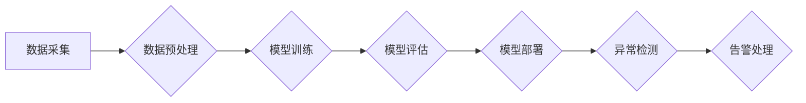

                 

## 电商平台中的异常检测：大模型的创新应用

> 关键词：异常检测、电商平台、大模型、深度学习、推荐系统、欺诈检测、数据分析

## 1. 背景介绍

在当今数据爆炸的时代，电商平台作为信息和交易的中心枢纽，面临着日益复杂的挑战。其中，异常检测作为一种关键技术，在保障平台安全、提升用户体验、优化运营效率等方面发挥着至关重要的作用。传统的异常检测方法往往依赖于手工特征工程和规则匹配，难以应对海量数据和复杂模式的挑战。近年来，大模型的兴起为电商平台异常检测带来了新的机遇。

大模型，指的是参数规模庞大、训练数据海量的人工智能模型，其强大的学习能力和泛化能力能够有效识别复杂异常模式。在电商平台中，大模型可以应用于多种异常检测场景，例如：

* **欺诈检测:** 识别虚假账户、恶意刷单、假货交易等欺诈行为。
* **用户行为异常检测:** 识别恶意评论、账号盗用、数据泄露等用户行为异常。
* **商品价格异常检测:** 识别恶意价格操控、价格欺诈等商品价格异常。
* **物流异常检测:** 识别包裹丢失、物流延误、货物损坏等物流异常。

## 2. 核心概念与联系

### 2.1 异常检测概述

异常检测是指从正常数据集中识别出与众不同的数据点，这些数据点可能代表着异常事件或潜在风险。异常检测在各个领域都有广泛应用，例如金融、医疗、网络安全等。

### 2.2 大模型的优势

大模型在异常检测领域具有以下优势：

* **强大的学习能力:** 大模型能够从海量数据中学习到复杂的模式和特征，识别出传统方法难以发现的异常。
* **泛化能力强:** 大模型在训练完成后能够应用于不同的场景和数据集，具有较强的泛化能力。
* **自动特征提取:** 大模型能够自动提取数据中的特征，无需人工特征工程，降低了开发成本和时间。

### 2.3 大模型在电商平台异常检测中的应用

大模型可以应用于电商平台的多种异常检测场景，例如：

* **欺诈检测:** 利用大模型识别虚假账户、恶意刷单、假货交易等欺诈行为。
* **用户行为异常检测:** 利用大模型识别恶意评论、账号盗用、数据泄露等用户行为异常。
* **商品价格异常检测:** 利用大模型识别恶意价格操控、价格欺诈等商品价格异常。
* **物流异常检测:** 利用大模型识别包裹丢失、物流延误、货物损坏等物流异常。

**Mermaid 流程图**



## 3. 核心算法原理 & 具体操作步骤

### 3.1 算法原理概述

在电商平台异常检测中，常用的大模型算法包括：

* **深度学习:** 深度学习算法能够自动学习数据中的复杂特征，识别出传统方法难以发现的异常模式。常见的深度学习算法包括卷积神经网络（CNN）、循环神经网络（RNN）和变分自编码器（VAE）。
* **强化学习:** 强化学习算法能够学习如何从环境中获取奖励，并通过不断调整策略来最大化奖励。在异常检测中，强化学习可以用于训练模型识别出具有高风险的异常数据点。

### 3.2 算法步骤详解

**深度学习算法步骤:**

1. **数据采集:** 收集电商平台相关的业务数据，例如用户行为数据、商品信息数据、交易记录数据等。
2. **数据预处理:** 对收集到的数据进行清洗、转换、特征工程等操作，使其适合深度学习模型的训练。
3. **模型选择:** 根据具体的异常检测场景选择合适的深度学习模型，例如CNN、RNN或VAE。
4. **模型训练:** 利用训练数据训练深度学习模型，并通过调整模型参数来优化模型性能。
5. **模型评估:** 利用测试数据评估模型的性能，例如准确率、召回率、F1-score等。
6. **模型部署:** 将训练好的模型部署到电商平台，用于实时异常检测。

**强化学习算法步骤:**

1. **环境定义:** 定义异常检测的具体环境，例如电商平台的交易系统。
2. **奖励函数设计:** 设计一个奖励函数，用于衡量模型识别异常数据的准确性。
3. **策略选择:** 选择合适的强化学习算法，例如Q-learning或Deep Q-Network (DQN)。
4. **模型训练:** 利用强化学习算法训练模型，使其能够最大化奖励。
5. **模型评估:** 利用测试数据评估模型的性能，例如准确率、召回率、F1-score等。
6. **模型部署:** 将训练好的模型部署到电商平台，用于实时异常检测。

### 3.3 算法优缺点

**深度学习算法:**

* **优点:** 能够学习到复杂特征，识别出传统方法难以发现的异常模式。
* **缺点:** 需要大量的训练数据，训练时间较长，模型解释性较差。

**强化学习算法:**

* **优点:** 可以学习如何从环境中获取奖励，并通过不断调整策略来最大化奖励。
* **缺点:** 需要设计合适的奖励函数，训练过程较为复杂，模型稳定性较差。

### 3.4 算法应用领域

* **欺诈检测:** 识别虚假账户、恶意刷单、假货交易等欺诈行为。
* **用户行为异常检测:** 识别恶意评论、账号盗用、数据泄露等用户行为异常。
* **商品价格异常检测:** 识别恶意价格操控、价格欺诈等商品价格异常。
* **物流异常检测:** 识别包裹丢失、物流延误、货物损坏等物流异常。

## 4. 数学模型和公式 & 详细讲解 & 举例说明

### 4.1 数学模型构建

在深度学习算法中，常用的数学模型包括神经网络和损失函数。

* **神经网络:** 神经网络是一种模仿人脑神经网络结构的算法，由多个层级的神经元组成。每个神经元接收来自前一层神经元的输入，并通过激活函数进行处理，输出到下一层神经元。

* **损失函数:** 损失函数用于衡量模型预测结果与真实结果之间的差异。常用的损失函数包括均方误差（MSE）、交叉熵损失（Cross-Entropy Loss）等。

### 4.2 公式推导过程

**均方误差 (MSE):**

$$MSE = \frac{1}{n} \sum_{i=1}^{n} (y_i - \hat{y}_i)^2$$

其中：

* $y_i$ 是真实值
* $\hat{y}_i$ 是模型预测值
* $n$ 是样本数量

**交叉熵损失 (Cross-Entropy Loss):**

$$CE = -\sum_{i=1}^{n} y_i \log(\hat{y}_i) + (1-y_i) \log(1-\hat{y}_i)$$

其中：

* $y_i$ 是真实标签 (0 或 1)
* $\hat{y}_i$ 是模型预测概率

### 4.3 案例分析与讲解

**举例说明:**

假设我们使用深度学习模型进行欺诈检测，训练数据包含用户交易记录，其中每个交易记录包含用户ID、交易金额、交易时间等特征。模型的目标是识别出具有高欺诈风险的交易记录。

我们可以使用MSE损失函数来训练模型，并通过调整模型参数来最小化损失值。训练完成后，模型能够根据用户的交易记录预测交易是否具有欺诈风险。

## 5. 项目实践：代码实例和详细解释说明

### 5.1 开发环境搭建

* **操作系统:** Ubuntu 20.04
* **Python 版本:** 3.8
* **深度学习框架:** TensorFlow 2.0
* **其他依赖库:** pandas, numpy, matplotlib

### 5.2 源代码详细实现

```python
import tensorflow as tf
from tensorflow.keras.models import Sequential
from tensorflow.keras.layers import Dense, Dropout

# 构建模型
model = Sequential()
model.add(Dense(64, activation='relu', input_shape=(10,)))
model.add(Dropout(0.2))
model.add(Dense(32, activation='relu'))
model.add(Dropout(0.2))
model.add(Dense(1, activation='sigmoid'))

# 编译模型
model.compile(optimizer='adam', loss='binary_crossentropy', metrics=['accuracy'])

# 训练模型
model.fit(X_train, y_train, epochs=10, batch_size=32)

# 评估模型
loss, accuracy = model.evaluate(X_test, y_test)
print('Loss:', loss)
print('Accuracy:', accuracy)
```

### 5.3 代码解读与分析

* **模型构建:** 代码首先构建了一个简单的多层感知机模型，包含三个全连接层和两个Dropout层。
* **模型编译:** 然后，模型使用Adam优化器、二分类交叉熵损失函数和精度指标进行编译。
* **模型训练:** 使用训练数据训练模型，设置训练轮数为10，每次训练批大小为32。
* **模型评估:** 使用测试数据评估模型的性能，输出损失值和精度。

### 5.4 运行结果展示

运行代码后，会输出模型的训练损失值和精度，以及测试集上的损失值和精度。

## 6. 实际应用场景

### 6.1 欺诈检测

电商平台面临着各种欺诈行为，例如虚假账户注册、恶意刷单、假货交易等。大模型可以学习到这些欺诈行为的特征，并识别出潜在的欺诈交易。

### 6.2 用户行为异常检测

用户行为异常检测可以识别出恶意评论、账号盗用、数据泄露等异常行为。大模型可以学习到用户的正常行为模式，并识别出与之不同的异常行为。

### 6.3 商品价格异常检测

商品价格异常检测可以识别出恶意价格操控、价格欺诈等异常价格。大模型可以学习到商品价格的正常波动规律，并识别出异常价格。

### 6.4 未来应用展望

随着大模型技术的不断发展，其在电商平台异常检测领域的应用将更加广泛和深入。例如：

* **个性化异常检测:** 根据用户的行为特征和购买习惯，进行个性化的异常检测。
* **多模态异常检测:** 利用文本、图像、视频等多模态数据进行异常检测，提高检测的准确性和鲁棒性。
* **实时异常检测:** 利用大模型进行实时异常检测，及时发现和处理异常事件。

## 7. 工具和资源推荐

### 7.1 学习资源推荐

* **书籍:**
    * 深度学习
    * 自然语言处理
    * 强化学习
* **在线课程:**
    * Coursera
    * edX
    * Udacity

### 7.2 开发工具推荐

* **深度学习框架:** TensorFlow, PyTorch, Keras
* **数据处理工具:** pandas, NumPy
* **可视化工具:** matplotlib, seaborn

### 7.3 相关论文推荐

* **深度学习在异常检测中的应用:**
    * Anomaly Detection with Deep Learning
    * Deep Learning for Fraud Detection
* **强化学习在异常检测中的应用:**
    * Reinforcement Learning for Anomaly Detection
    * Deep Reinforcement Learning for Anomaly Detection

## 8. 总结：未来发展趋势与挑战

### 8.1 研究成果总结

大模型在电商平台异常检测领域取得了显著的成果，能够有效识别出各种异常行为，提高平台安全性和运营效率。

### 8.2 未来发展趋势

* **模型规模和能力的提升:** 大模型的规模和能力将不断提升，能够学习到更复杂的模式和特征，识别出更精细的异常。
* **多模态数据融合:** 大模型将能够融合文本、图像、视频等多模态数据进行异常检测，提高检测的准确性和鲁棒性。
* **个性化异常检测:** 大模型将能够根据用户的行为特征和购买习惯，进行个性化的异常检测。

### 8.3 面临的挑战

* **数据质量和标注问题:** 大模型的训练需要大量高质量的数据，而数据标注成本高昂，难以保证数据的准确性和完整性。
* **模型解释性和可解释性:** 大模型的决策过程较为复杂，难以解释模型的决策结果，这可能会导致模型的信任度降低。
* **模型部署和维护成本:** 大模型的部署和维护成本较高，需要强大的计算资源和专业技术人员。

### 8.4 研究展望

未来，研究者将继续探索大模型在电商平台异常检测领域的应用，解决上述挑战，并推动大模型技术在该领域的进一步发展。


## 9. 附录：常见问题与解答

**Q1: 大模型的训练需要多少数据？**

A1: 大模型的训练需要大量的训练数据，通常需要百万甚至数百万个样本。

**Q2: 如何评估大模型的性能？**

A2: 大模型的性能可以通过准确率、召回率、F1-score等指标进行评估。

**Q3: 如何部署大模型？**

A3: 大模型的部署需要强大的计算资源，可以使用云计算平台或搭建自己的服务器集群。

**作者：禅与计算机程序设计艺术 / Zen and the Art of Computer Programming**<end_of_turn>

