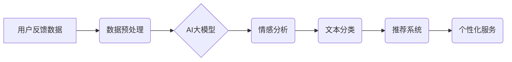

                 

## 电商平台用户反馈分析：AI大模型的新方法

> 关键词：电商平台、用户反馈、AI大模型、自然语言处理、情感分析、文本分类、推荐系统、个性化服务

## 1. 背景介绍

在当今数据爆炸的时代，电商平台的用户反馈数据已成为宝贵的资源。这些反馈信息包含用户对商品、服务、体验等方面的评价和建议，蕴含着丰富的商业价值。传统的用户反馈分析方法往往依赖于人工标注和规则匹配，效率低下，难以捕捉用户反馈中的复杂情感和意图。

近年来，随着深度学习技术的快速发展，AI大模型在自然语言处理（NLP）领域取得了突破性进展。这些模型能够自动学习用户语言的语义和结构，并进行更精准、更全面的分析。因此，利用AI大模型进行电商平台用户反馈分析，具有重要的理论意义和实际应用价值。

## 2. 核心概念与联系

### 2.1  用户反馈数据

电商平台的用户反馈数据主要包括：

* **评论文本:** 用户对商品、服务、体验等方面的评价和描述。
* **评分:** 用户对商品、服务、体验等方面的评分。
* **问答:** 用户对商品、服务、平台等方面的提问和解答。
* **聊天记录:** 用户与客服人员的对话记录。

### 2.2  AI大模型

AI大模型是指参数量巨大、训练数据海量、能够处理复杂任务的深度学习模型。常见的AI大模型包括：

* **BERT:** 基于Transformer架构的预训练语言模型，擅长理解上下文关系。
* **GPT:** 基于Transformer架构的文本生成模型，能够生成流畅自然的文本。
* **T5:** 基于Transformer架构的文本到文本转换模型，能够完成多种NLP任务，如文本分类、问答、摘要等。

### 2.3  核心概念架构



## 3. 核心算法原理 & 具体操作步骤

### 3.1  算法原理概述

AI大模型在用户反馈分析中的应用主要基于以下核心算法：

* **情感分析:** 通过分析用户文本中的情感倾向，判断用户对商品、服务、体验等方面的满意度。
* **文本分类:** 将用户反馈文本分类到不同的类别，例如产品评价、服务投诉、建议反馈等。
* **主题提取:** 从用户反馈文本中提取出主要的主题和关键词，了解用户关注的方面。

### 3.2  算法步骤详解

**情感分析:**

1. **数据预处理:** 清洗用户反馈文本，去除停用词、标点符号等，进行分词和词干提取。
2. **特征提取:** 使用词向量模型（如Word2Vec、GloVe）将文本转换为向量表示，提取文本的情感特征。
3. **情感分类:** 利用机器学习算法（如支持向量机、随机森林）对文本进行情感分类，判断用户的情感倾向（例如正面、负面、中性）。

**文本分类:**

1. **数据预处理:** 与情感分析类似，对用户反馈文本进行预处理。
2. **特征提取:** 使用词向量模型或深度学习模型（如CNN、RNN）提取文本的特征。
3. **分类模型训练:** 利用机器学习算法或深度学习模型对文本进行分类，将文本分配到不同的类别。

**主题提取:**

1. **数据预处理:** 对用户反馈文本进行预处理。
2. **主题建模:** 使用主题模型（如LDA、NMF）对文本进行主题建模，提取出文本中的主要主题和关键词。

### 3.3  算法优缺点

**优点:**

* **自动化:** AI大模型能够自动学习用户语言的语义和结构，自动化完成用户反馈分析任务。
* **精准度:** AI大模型能够捕捉用户反馈中的复杂情感和意图，提高分析的精准度。
* **效率:** AI大模型能够处理海量用户反馈数据，提高分析效率。

**缺点:**

* **数据依赖:** AI大模型的性能依赖于训练数据的质量和数量。
* **解释性:** AI大模型的决策过程往往难以解释，难以理解模型是如何得出结论的。
* **成本:** 训练和部署AI大模型需要大量的计算资源和专业人才。

### 3.4  算法应用领域

AI大模型在电商平台用户反馈分析中的应用领域广泛，包括：

* **产品改进:** 分析用户对产品的评价和建议，改进产品功能和设计。
* **服务优化:** 分析用户对服务的评价和投诉，优化服务流程和质量。
* **营销策略:** 分析用户对商品和促销活动的评价，制定更有效的营销策略。
* **个性化推荐:** 分析用户对商品的偏好和兴趣，提供个性化的商品推荐。

## 4. 数学模型和公式 & 详细讲解 & 举例说明

### 4.1  数学模型构建

情感分析的数学模型通常基于机器学习算法，例如支持向量机（SVM）和随机森林（RF）。

**支持向量机 (SVM):**

SVM是一种监督学习算法，用于分类和回归问题。其核心思想是找到一个超平面，将不同类别的样本分开。

**随机森林 (RF):**

RF是一种集成学习算法，由多个决策树组成。每个决策树对样本进行独立分类，最终通过投票或平均的方式得出最终分类结果。

### 4.2  公式推导过程

SVM的决策边界可以表示为：

$$w^Tx + b = 0$$

其中，$w$是权重向量，$x$是样本特征向量，$b$是偏置项。

RF的决策过程可以概括为以下步骤：

1. 从训练数据中随机抽取样本和特征，构建决策树。
2. 构建多个决策树，每个决策树独立训练。
3. 对新样本进行分类，每个决策树进行分类投票，最终通过投票或平均的方式得出最终分类结果。

### 4.3  案例分析与讲解

假设我们有一个电商平台的用户评论数据集，包含商品评论文本和对应的情感标签（例如正面、负面、中性）。我们可以使用SVM或RF算法对这些评论进行情感分析。

训练完成后，我们可以将新的用户评论输入到模型中，模型会预测该评论的情感倾向。例如，如果一个用户评论说“这款商品非常棒，质量很好”，模型可能会预测其情感倾向为“正面”。

## 5. 项目实践：代码实例和详细解释说明

### 5.1  开发环境搭建

* Python 3.6+
* TensorFlow/PyTorch
* NLTK/spaCy

### 5.2  源代码详细实现

```python
# 导入必要的库
import nltk
from sklearn.model_selection import train_test_split
from sklearn.linear_model import LogisticRegression

# 加载用户评论数据集
data = nltk.corpus.movie_reviews.words()

# 数据预处理
# ...

# 特征提取
# ...

# 将数据分成训练集和测试集
X_train, X_test, y_train, y_test = train_test_split(X, y, test_size=0.2)

# 训练模型
model = LogisticRegression()
model.fit(X_train, y_train)

# 模型评估
# ...

# 使用模型预测新评论的情感倾向
# ...
```

### 5.3  代码解读与分析

* 代码首先导入必要的库，包括自然语言处理库NLTK和机器学习库scikit-learn。
* 然后，加载用户评论数据集，并进行数据预处理，例如去除停用词、标点符号等。
* 接着，提取文本特征，例如词向量表示。
* 将数据分成训练集和测试集，用于训练和评估模型。
* 使用LogisticRegression算法训练模型，并评估模型的性能。
* 最后，使用训练好的模型预测新评论的情感倾向。

### 5.4  运行结果展示

运行代码后，可以得到模型的训练结果和预测结果。例如，模型的准确率、召回率、F1-score等指标。

## 6. 实际应用场景

### 6.1  电商平台产品改进

通过分析用户对产品的评价和建议，电商平台可以了解用户对产品的满意度和痛点，从而改进产品的功能和设计，提升用户体验。

### 6.2  电商平台服务优化

通过分析用户对服务的评价和投诉，电商平台可以了解用户对服务的满意度和问题点，从而优化服务流程和质量，提升用户满意度。

### 6.3  电商平台营销策略

通过分析用户对商品和促销活动的评价，电商平台可以了解用户对商品和促销活动的兴趣和偏好，从而制定更有效的营销策略，提升转化率。

### 6.4  未来应用展望

随着AI技术的不断发展，AI大模型在电商平台用户反馈分析中的应用将更加广泛和深入。例如，可以利用AI大模型进行更精准的个性化推荐、更智能的客服服务、更有效的用户画像分析等。

## 7. 工具和资源推荐

### 7.1  学习资源推荐

* **斯坦福大学CS224N课程:** https://web.stanford.edu/class/cs224n/
* **Hugging Face Transformers库:** https://huggingface.co/transformers/
* **TensorFlow官方文档:** https://www.tensorflow.org/

### 7.2  开发工具推荐

* **Jupyter Notebook:** https://jupyter.org/
* **PyCharm:** https://www.jetbrains.com/pycharm/
* **VS Code:** https://code.visualstudio.com/

### 7.3  相关论文推荐

* **BERT: Pre-training of Deep Bidirectional Transformers for Language Understanding:** https://arxiv.org/abs/1810.04805
* **GPT-3: Language Models are Few-Shot Learners:** https://arxiv.org/abs/2005.14165
* **T5: Text-to-Text Transfer Transformer:** https://arxiv.org/abs/1910.10683

## 8. 总结：未来发展趋势与挑战

### 8.1  研究成果总结

AI大模型在电商平台用户反馈分析领域取得了显著的成果，能够自动化、精准地分析用户反馈数据，为电商平台提供 valuable insights。

### 8.2  未来发展趋势

* **模型规模和能力的提升:** 未来，AI大模型的规模和能力将进一步提升，能够处理更复杂的用户反馈数据，并进行更深入的分析。
* **多模态用户反馈分析:** 未来，AI大模型将能够处理多种类型的用户反馈数据，例如文本、图像、音频等，进行更全面的分析。
* **个性化用户体验:** 未来，AI大模型将能够根据用户的个性化需求，提供更精准的商品推荐、更智能的客服服务等。

### 8.3  面临的挑战

* **数据质量和隐私保护:** AI大模型的性能依赖于训练数据的质量，而用户反馈数据往往包含敏感信息，需要进行严格的隐私保护处理。
* **模型解释性和可信度:** AI大模型的决策过程往往难以解释，难以理解模型是如何得出结论的，这可能会影响用户的信任度。
* **模型部署和维护成本:** 训练和部署AI大模型需要大量的计算资源和专业人才，这可能会成为一些电商平台难以克服的挑战。

### 8.4  研究展望

未来，研究者将继续探索AI大模型在电商平台用户反馈分析领域的应用，并致力于解决上述挑战，推动AI技术在电商领域的更广泛应用。

## 9. 附录：常见问题与解答

**Q1: 如何选择合适的AI大模型？**

**A1:** 选择合适的AI大模型需要根据具体应用场景和数据特点进行选择。例如，对于情感分析任务，BERT和RoBERTa等预训练语言模型效果较好；对于文本分类任务，CNN和RNN等深度学习模型效果较好。

**Q2: 如何处理用户反馈数据中的噪音和异常值？**

**A2:** 可以使用数据清洗和预处理技术来处理用户反馈数据中的噪音和异常值。例如，去除停用词、标点符号、HTML标签等，并对文本进行分词和词干提取。

**Q3: 如何评估AI大模型的性能？**

**A3:** 可以使用准确率、召回率、F1-score等指标来评估AI大模型的性能。

**作者：禅与计算机程序设计艺术 / Zen and the Art of Computer Programming**


<end_of_turn>

