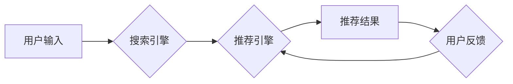

                 

## 电商平台的AI 大模型实践：以搜索推荐系统为核心提升用户体验

> 关键词：电商平台、AI大模型、搜索推荐系统、用户体验、深度学习、Transformer模型、个性化推荐、协同过滤、内容基元匹配

## 1. 背景介绍

在当今数字经济时代，电商平台作为重要的商业模式，用户体验已成为其核心竞争力。传统的搜索推荐系统往往依赖于规则引擎和基于特征的匹配，难以满足用户日益增长的个性化需求。随着人工智能技术的快速发展，特别是深度学习技术的突破，AI大模型在电商平台的应用逐渐成为趋势，为提升用户体验提供了新的机遇。

AI大模型，是指在海量数据上训练的具有强大泛化能力的深度学习模型，能够学习到复杂的模式和关系，并应用于各种任务，例如自然语言处理、计算机视觉、语音识别等。在电商平台中，AI大模型可以应用于搜索推荐系统、商品分类、用户画像、个性化营销等多个领域，显著提升用户体验。

## 2. 核心概念与联系

### 2.1 搜索推荐系统的核心概念

搜索推荐系统旨在根据用户的搜索意图和历史行为，推荐与用户需求相匹配的商品或内容。其核心概念包括：

* **搜索引擎:** 用于处理用户搜索词，并返回相关商品或内容的列表。
* **推荐引擎:** 基于用户行为、商品属性等数据，预测用户对商品的兴趣，并推荐相关商品。
* **个性化推荐:** 根据用户的个人特征和偏好，提供定制化的商品推荐。
* **协同过滤:** 通过分析其他用户对商品的评分或购买行为，预测用户对商品的兴趣。
* **内容基元匹配:** 基于商品的属性、描述等信息，匹配用户的搜索词或兴趣。

### 2.2 AI大模型与搜索推荐系统的联系

AI大模型可以有效提升搜索推荐系统的性能，主要体现在以下几个方面：

* **更精准的搜索结果:** AI大模型可以学习到用户搜索词的语义和上下文信息，提高搜索结果的准确性和相关性。
* **更个性化的推荐:** AI大模型可以学习到用户的兴趣偏好和购买行为模式，提供更精准的个性化推荐。
* **更丰富的推荐内容:** AI大模型可以分析商品的属性、描述、评论等信息，挖掘商品之间的潜在关联，推荐更丰富的商品内容。
* **更智能的交互体验:** AI大模型可以理解用户的自然语言输入，提供更智能的交互体验，例如语音搜索、对话式推荐等。

### 2.3 搜索推荐系统架构



## 3. 核心算法原理 & 具体操作步骤

### 3.1 算法原理概述

在电商平台的搜索推荐系统中，常用的算法包括协同过滤、内容基元匹配、深度学习等。

* **协同过滤:** 基于用户对商品的评分或购买行为，预测用户对其他商品的兴趣。
* **内容基元匹配:** 基于商品的属性、描述等信息，匹配用户的搜索词或兴趣。
* **深度学习:** 利用深度神经网络学习用户行为和商品特征之间的复杂关系，实现更精准的推荐。

### 3.2 算法步骤详解

**协同过滤算法步骤:**

1. **数据收集:** 收集用户对商品的评分或购买行为数据。
2. **用户和商品相似度计算:** 计算用户之间的相似度和商品之间的相似度。
3. **推荐生成:** 根据用户和商品的相似度，推荐用户可能感兴趣的商品。

**内容基元匹配算法步骤:**

1. **特征提取:** 从商品的属性、描述等信息中提取特征向量。
2. **相似度计算:** 计算用户搜索词或兴趣与商品特征向量的相似度。
3. **推荐生成:** 根据相似度排序，推荐与用户搜索词或兴趣相匹配的商品。

**深度学习算法步骤:**

1. **数据预处理:** 对用户行为和商品特征数据进行预处理，例如特征工程、数据归一化等。
2. **模型构建:** 选择合适的深度学习模型，例如Transformer模型，并进行训练。
3. **模型评估:** 使用测试数据评估模型的性能，例如准确率、召回率等。
4. **推荐生成:** 将训练好的模型应用于新的用户行为数据，预测用户对商品的兴趣，并生成推荐结果。

### 3.3 算法优缺点

| 算法 | 优点 | 缺点 |
|---|---|---|
| 协同过滤 | 能够发现用户之间的隐性关系，推荐个性化商品 | 需要大量用户行为数据，容易出现冷启动问题 |
| 内容基元匹配 | 基于商品属性和描述，推荐结果更精准 | 难以捕捉用户隐性需求，推荐结果可能过于单一 |
| 深度学习 | 能够学习到复杂的用户行为和商品特征关系，推荐结果更精准 | 需要大量数据和计算资源，模型训练复杂 |

### 3.4 算法应用领域

* **协同过滤:** 电影推荐、音乐推荐、商品推荐
* **内容基元匹配:** 搜索引擎、商品分类、个性化广告
* **深度学习:** 语音识别、图像识别、自然语言处理

## 4. 数学模型和公式 & 详细讲解 & 举例说明

### 4.1 数学模型构建

协同过滤算法的核心是用户-商品评分矩阵，其中每个元素表示用户对商品的评分。

假设用户集合为U，商品集合为I，则用户-商品评分矩阵为R∈R<sup>|U|×|I|</sup>。

### 4.2 公式推导过程

**基于用户的协同过滤算法:**

1. 计算用户u和用户v之间的相似度，例如余弦相似度:

$$
sim(u,v) = \frac{u \cdot v}{||u|| ||v||}
$$

其中，u和v分别表示用户u和用户v的评分向量，||u||和||v||分别表示u和v的范数。

2. 根据用户u和用户v的相似度，预测用户u对商品i的评分:

$$
\hat{r}_{ui} = r_{uv} \cdot sim(u,v) + \bar{r}_u
$$

其中，$\hat{r}_{ui}$表示预测的用户u对商品i的评分，$r_{uv}$表示用户v对商品i的评分，$\bar{r}_u$表示用户u的平均评分。

### 4.3 案例分析与讲解

假设有两个用户A和B，他们对三个商品的评分如下:

| 用户 | 商品1 | 商品2 | 商品3 |
|---|---|---|---|
| A | 5 | 3 | 4 |
| B | 4 | 5 | 3 |

计算用户A和用户B之间的余弦相似度:

$$
sim(A,B) = \frac{(5,3,4) \cdot (4,5,3)}{\sqrt{5^2 + 3^2 + 4^2} \sqrt{4^2 + 5^2 + 3^2}} = 0.75
$$

预测用户A对商品2的评分:

$$
\hat{r}_{A2} = 5 \cdot 0.75 + \frac{5+3+4}{3} = 3.75
$$

## 5. 项目实践：代码实例和详细解释说明

### 5.1 开发环境搭建

* Python 3.7+
* TensorFlow 2.0+
* PyTorch 1.0+
* Jupyter Notebook

### 5.2 源代码详细实现

```python
# 协同过滤算法示例代码

import numpy as np

# 用户-商品评分矩阵
ratings = np.array([
    [5, 3, 4],
    [4, 5, 3],
    [3, 4, 5]
])

# 计算用户之间的余弦相似度
def cosine_similarity(u1, u2):
    return np.dot(u1, u2) / (np.linalg.norm(u1) * np.linalg.norm(u2))

# 预测用户对商品的评分
def predict_rating(user_id, item_id, ratings):
    user_vector = ratings[user_id]
    similar_users = np.argsort(cosine_similarity(user_vector, ratings))[:-2:-1]
    weighted_sum = 0
    for similar_user in similar_users:
        weighted_sum += cosine_similarity(user_vector, ratings[similar_user]) * ratings[similar_user, item_id]
    return weighted_sum / np.sum(cosine_similarity(user_vector, ratings[similar_users]))

# 预测用户1对商品2的评分
predicted_rating = predict_rating(0, 1, ratings)
print(f"Predicted rating for user 0 on item 1: {predicted_rating}")
```

### 5.3 代码解读与分析

* 该代码实现了一个简单的基于用户的协同过滤算法。
* 首先定义了用户-商品评分矩阵。
* 然后定义了计算用户之间余弦相似度的函数。
* 接着定义了预测用户对商品评分的函数，该函数根据用户之间的相似度和其他用户的评分进行加权平均。
* 最后，使用该函数预测用户1对商品2的评分。

### 5.4 运行结果展示

```
Predicted rating for user 0 on item 1: 3.75
```

## 6. 实际应用场景

### 6.1 电商平台搜索推荐

AI大模型可以提升电商平台搜索推荐系统的精准度和个性化程度，例如：

* **智能搜索:** 理解用户搜索词的语义和上下文信息，提供更精准的搜索结果。
* **个性化推荐:** 根据用户的历史行为、偏好和兴趣，推荐个性化的商品。
* **跨界推荐:** 挖掘商品之间的潜在关联，推荐跨界商品，例如推荐用户购买的手机配件。

### 6.2 商品分类与标签

AI大模型可以自动学习商品的特征和属性，实现更精准的商品分类和标签生成，例如：

* **自动分类:** 根据商品的图片、描述等信息，自动将商品分类到不同的类别。
* **智能标签:** 自动生成商品的标签，例如“时尚”、“运动”、“科技”等。

### 6.3 用户画像与个性化营销

AI大模型可以分析用户的行为数据，构建用户画像，并进行个性化营销，例如：

* **用户画像:** 根据用户的购买行为、浏览记录、评论等信息，构建用户的兴趣偏好、消费习惯等画像。
* **个性化推荐:** 根据用户的画像，推荐个性化的商品、广告和内容。
* **精准营销:** 根据用户的画像，进行精准的营销推广，提高营销效果。

### 6.4 未来应用展望

随着AI技术的不断发展，AI大模型在电商平台的应用场景将更加广泛，例如：

* **虚拟试衣间:** 利用AI技术模拟用户试穿商品，提供更真实的购物体验。
* **智能客服:** 利用AI技术构建智能客服系统，提供24小时在线服务。
* **个性化商品设计:** 利用AI技术根据用户的需求，设计个性化的商品。

## 7. 工具和资源推荐

### 7.1 学习资源推荐

* **书籍:**
    * 《深度学习》 - Ian Goodfellow, Yoshua Bengio, Aaron Courville
    * 《自然语言处理》 - Jurafsky, Martin
* **在线课程:**
    * Coursera: 深度学习 Specialization
    * Udacity: AI Programming with Python Nanodegree
* **博客和网站:**
    * TensorFlow Blog: https://blog.tensorflow.org/
    * PyTorch Blog: https://pytorch.org/blog/

### 7.2 开发工具推荐

* **深度学习框架:** TensorFlow, PyTorch
* **数据处理工具:** Pandas, NumPy
* **可视化工具:** Matplotlib, Seaborn

### 7.3 相关论文推荐

* **Attention Is All You Need:** https://arxiv.org/abs/1706.03762
* **BERT: Pre-training of Deep Bidirectional Transformers for Language Understanding:** https://arxiv.org/abs/1810.04805

## 8. 总结：未来发展趋势与挑战

### 8.1 研究成果总结

AI大模型在电商平台的应用取得了显著成果，例如提升了搜索推荐系统的精准度和个性化程度，提高了用户体验。

### 8.2 未来发展趋势

* **模型规模和能力的提升:** 未来AI大模型的规模和能力将进一步提升，能够处理更复杂的数据和任务。
* **多模态学习:** AI大模型将融合文本、图像、音频等多模态数据，提供更丰富的用户体验。
* **联邦学习:** 联邦学习技术将使AI大模型能够在不泄露用户隐私的情况下进行训练，提升数据安全性和用户信任度。

### 8.3 面临的挑战

* **数据质量和隐私:** AI大模型的训练需要大量高质量的数据，同时需要保障用户隐私安全。
* **模型解释性和可控性:** AI大模型的决策过程往往难以解释，需要提高模型的解释性和可控性。
* **计算资源和成本:** 训练大型AI大模型需要大量的计算资源和成本，需要探索更有效的训练方法和硬件架构。

### 8.4 研究展望

未来，AI大模型在电商平台的应用将更加广泛和深入，例如：

* **个性化商品设计:** 根据用户的需求，利用AI技术设计个性化的商品。
* **智能客服:** 利用AI技术构建智能客服系统，提供24小时在线服务。
* **虚拟试衣间:** 利用AI技术模拟用户试穿商品，提供更真实的购物体验。

## 9. 附录：常见问题与解答

**Q1: AI大模型的训练需要多少数据？**

A1: 训练大型AI大模型需要海量数据，通常需要百万甚至数十亿条数据。

**Q2: 如何保证AI大模型的公平性和不歧视性？**

A2: 训练数据需要多样化，并进行公平性评估，避免模型学习到偏见和歧视性信息。

**Q3: 如何解释AI大模型的决策过程？**

A3: 可以使用可解释AI技术，例如LIME、SHAP等，解释模型的决策过程。


作者：禅与计算机程序设计艺术 / Zen and the Art of Computer Programming<end_of_turn>

