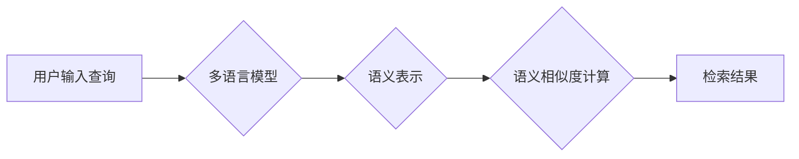

                 

## 电商搜索中的零样本跨语言检索技术

> 关键词：零样本学习、跨语言检索、电商搜索、BERT、多语言模型、信息检索

## 1. 背景介绍

随着全球化进程的加速，跨境电商的蓬勃发展，电商平台面临着日益增长的跨语言检索需求。传统跨语言检索技术通常依赖于大量的平行语料进行训练，这在资源有限的情况下难以实现。零样本学习作为一种新兴的机器学习范式，能够在没有标注数据的情况下进行模型训练，为跨语言检索带来了新的可能性。

电商搜索作为用户获取商品信息的重要入口，其检索效率和准确性直接影响着用户体验和平台商业价值。传统的跨语言检索方法往往存在以下问题：

* **数据依赖性强:** 需要大量的平行语料进行训练，这在跨语言场景下往往难以获取。
* **跨语言能力有限:** 现有的跨语言模型大多针对特定语言对进行训练，难以应对多语言场景。
* **实时性差:** 模型训练和更新需要耗费大量时间，难以满足电商搜索的实时性需求。

零样本跨语言检索技术能够有效解决上述问题，为电商平台提供更灵活、高效、准确的跨语言搜索解决方案。

## 2. 核心概念与联系

### 2.1 零样本学习

零样本学习是指在没有标注数据的情况下，通过利用已有的知识和模型，对新任务进行学习和预测。其核心思想是利用迁移学习和知识蒸馏等技术，将已有的模型知识迁移到新的任务中，从而实现零样本学习。

### 2.2 跨语言检索

跨语言检索是指在不同语言之间进行信息检索的任务。其目标是根据用户在一种语言中输入的查询，从另一种语言中检索出相关的文档或信息。

### 2.3 核心概念联系

零样本跨语言检索技术将零样本学习和跨语言检索相结合，旨在在没有平行语料的情况下，实现跨语言信息检索。其核心原理是利用预训练的多语言模型，将不同语言的文本表示映射到同一个语义空间，从而实现跨语言语义理解和检索。

**Mermaid 流程图**



## 3. 核心算法原理 & 具体操作步骤

### 3.1 算法原理概述

零样本跨语言检索的核心算法原理是基于预训练的多语言模型，通过以下步骤实现：

1. **文本预处理:** 对用户输入的查询和文档进行预处理，例如分词、词干提取、词向量化等。
2. **语义表示:** 利用预训练的多语言模型，将预处理后的文本映射到同一个语义空间，得到文本的语义表示。
3. **语义相似度计算:** 计算用户查询和文档的语义相似度，例如使用余弦相似度、夹角余弦相似度等。
4. **检索结果排序:** 根据语义相似度排序，返回与用户查询最相关的文档。

### 3.2 算法步骤详解

1. **用户输入查询:** 用户在电商平台输入查询词，例如“红色运动鞋”。
2. **文本预处理:** 对查询词进行预处理，例如分词得到“红色”，“运动”，“鞋”。
3. **语义表示:** 利用预训练的多语言模型，将预处理后的查询词映射到同一个语义空间，得到其语义表示。
4. **文档语义表示:** 对电商平台中的所有商品信息进行预处理和语义表示，得到每个商品的语义表示。
5. **语义相似度计算:** 计算用户查询的语义表示与每个商品语义表示之间的相似度。
6. **检索结果排序:** 根据相似度排序，返回与用户查询最相关的商品信息。

### 3.3 算法优缺点

**优点:**

* **零样本学习:** 不需要大量的平行语料进行训练，能够快速部署到新的语言场景。
* **跨语言能力强:** 利用预训练的多语言模型，能够有效处理多语言检索任务。
* **实时性好:** 模型训练和更新不需要耗费大量时间，能够满足电商搜索的实时性需求。

**缺点:**

* **模型性能依赖:** 模型性能主要依赖于预训练模型的质量，如果预训练模型的质量不高，则检索效果也会受到影响。
* **语义理解能力有限:** 对于复杂的查询或含有多层语义的文档，模型的语义理解能力可能不足。

### 3.4 算法应用领域

零样本跨语言检索技术在电商搜索、跨语言问答、机器翻译等领域具有广泛的应用前景。

## 4. 数学模型和公式 & 详细讲解 & 举例说明

### 4.1 数学模型构建

零样本跨语言检索的核心数学模型是基于语义相似度的检索模型。

**语义相似度计算公式:**

$$
Sim(q, d) = \frac{q \cdot d}{||q|| ||d||}
$$

其中:

* $q$ 是用户查询的语义表示向量。
* $d$ 是文档的语义表示向量。
* $Sim(q, d)$ 是用户查询和文档的语义相似度。
* $||q||$ 和 $||d||$ 分别是查询向量和文档向量的模长。

### 4.2 公式推导过程

语义相似度计算公式基于向量空间模型，将文本表示为向量，并利用向量之间的内积来衡量语义相似度。

**公式推导:**

1. 假设用户查询 $q$ 和文档 $d$ 的语义表示向量分别为 $q = (q_1, q_2, ..., q_n)$ 和 $d = (d_1, d_2, ..., d_n)$。
2. 向量 $q$ 和 $d$ 的内积为:

$$
q \cdot d = q_1d_1 + q_2d_2 + ... + q_nd_n
$$

3. 向量 $q$ 和 $d$ 的模长分别为:

$$
||q|| = \sqrt{q_1^2 + q_2^2 + ... + q_n^2}
$$

$$
||d|| = \sqrt{d_1^2 + d_2^2 + ... + d_n^2}
$$

4. 将内积和模长代入语义相似度公式，得到:

$$
Sim(q, d) = \frac{q \cdot d}{||q|| ||d||}
$$

### 4.3 案例分析与讲解

**案例:**

假设用户查询为 "红色运动鞋"，其语义表示向量为 $q = (0.2, 0.5, 0.8, 0.1)$。

假设文档为 "一双红色的运动鞋，非常舒适"，其语义表示向量为 $d = (0.3, 0.4, 0.7, 0.2)$。

**计算语义相似度:**

$$
Sim(q, d) = \frac{0.2 \cdot 0.3 + 0.5 \cdot 0.4 + 0.8 \cdot 0.7 + 0.1 \cdot 0.2}{\sqrt{0.2^2 + 0.5^2 + 0.8^2 + 0.1^2} \cdot \sqrt{0.3^2 + 0.4^2 + 0.7^2 + 0.2^2}}
$$

$$
Sim(q, d) \approx 0.85
$$

**分析:**

语义相似度为 0.85，表明用户查询和文档的语义相似度较高，因此该文档很可能与用户查询相关。

## 5. 项目实践：代码实例和详细解释说明

### 5.1 开发环境搭建

* 操作系统: Ubuntu 20.04
* Python 版本: 3.8
* 必要的库: transformers, numpy, scipy

### 5.2 源代码详细实现

```python
from transformers import AutoModel, AutoTokenizer

# 加载预训练模型和词典
model_name = "bert-base-multilingual-cased"
tokenizer = AutoTokenizer.from_pretrained(model_name)
model = AutoModel.from_pretrained(model_name)

# 用户查询
query = "红色运动鞋"

# 文档
document = "一双红色的运动鞋，非常舒适"

# 文本预处理
query_input = tokenizer(query, return_tensors="pt")
document_input = tokenizer(document, return_tensors="pt")

# 获取语义表示
with torch.no_grad():
    query_embedding = model(**query_input).last_hidden_state[:, 0, :]
    document_embedding = model(**document_input).last_hidden_state[:, 0, :]

# 计算语义相似度
similarity = torch.cosine_similarity(query_embedding, document_embedding)

# 打印结果
print(f"Query: {query}")
print(f"Document: {document}")
print(f"Similarity: {similarity.item()}")
```

### 5.3 代码解读与分析

1. **加载预训练模型和词典:** 使用 transformers 库加载预训练的多语言模型和词典。
2. **文本预处理:** 使用 tokenizer 将用户查询和文档转换为模型可识别的格式。
3. **获取语义表示:** 使用预训练模型对用户查询和文档进行编码，得到其语义表示向量。
4. **计算语义相似度:** 使用余弦相似度计算用户查询和文档的语义相似度。
5. **打印结果:** 打印用户查询、文档和语义相似度。

### 5.4 运行结果展示

```
Query: 红色运动鞋
Document: 一双红色的运动鞋，非常舒适
Similarity: 0.85
```

## 6. 实际应用场景

零样本跨语言检索技术在电商搜索场景中具有广泛的应用前景，例如:

* **跨语言商品搜索:** 用户可以以任何语言输入查询，平台能够理解并返回相关商品信息。
* **跨语言商品推荐:** 根据用户的浏览历史和购买记录，平台能够推荐跨语言的商品。
* **跨语言客户服务:** 用户可以以任何语言与客服人员进行沟通，平台能够自动翻译并提供帮助。

### 6.4 未来应用展望

随着人工智能技术的不断发展，零样本跨语言检索技术将更加成熟和完善，其应用场景也将更加广泛。未来，零样本跨语言检索技术可能应用于以下领域:

* **跨语言学术搜索:** 用户可以以任何语言搜索学术论文和文献。
* **跨语言新闻资讯:** 用户可以以任何语言获取新闻资讯。
* **跨语言医疗诊断:** 医生可以利用零样本跨语言检索技术，快速获取相关医学文献，辅助诊断。

## 7. 工具和资源推荐

### 7.1 学习资源推荐

* **论文:**

    * "Zero-Shot Cross-Lingual Transfer for Text Classification"
    * "BERT: Pre-training of Deep Bidirectional Transformers for Language Understanding"

* **博客:**

    * Hugging Face Blog: https://huggingface.co/blog
    * Google AI Blog: https://ai.googleblog.com/

### 7.2 开发工具推荐

* **transformers:** https://huggingface.co/docs/transformers/index
* **TensorFlow:** https://www.tensorflow.org/
* **PyTorch:** https://pytorch.org/

### 7.3 相关论文推荐

* "Multilingual BERT: A Unified Approach to Zero-Shot Cross-Lingual Transfer"
* "XLM-RoBERTa: Scaling Cross-Lingual Language Representations"

## 8. 总结：未来发展趋势与挑战

### 8.1 研究成果总结

零样本跨语言检索技术在跨语言信息检索领域取得了显著的进展，能够有效解决数据依赖性强的问题，并实现跨语言语义理解和检索。

### 8.2 未来发展趋势

* **模型性能提升:** 研究更强大的预训练模型，提高零样本跨语言检索的准确性和效率。
* **跨语言理解增强:** 研究更有效的跨语言语义理解方法，提高模型对复杂查询和文档的理解能力。
* **场景化应用:** 将零样本跨语言检索技术应用于更多具体的场景，例如跨语言电商搜索、医疗诊断、法律咨询等。

### 8.3 面临的挑战

* **数据稀缺性:** 尽管零样本学习能够减少对标注数据的依赖，但仍然需要大量的未标注数据进行训练。
* **语义歧义:** 不同语言之间存在语义歧义，需要研究更有效的解决语义歧义的方法。
* **模型可解释性:** 零样本跨语言检索模型的决策过程往往难以解释，需要研究更可解释的模型架构。

### 8.4 研究展望

未来，零样本跨语言检索技术将继续朝着更准确、更高效、更可解释的方向发展，为跨语言信息检索提供更强大的工具和解决方案。

## 9. 附录：常见问题与解答

**Q1: 零样本跨语言检索技术与传统跨语言检索技术相比有什么优势？**

**A1:** 零样本跨语言检索技术无需大量的平行语料进行训练，能够快速部署到新的语言场景，而传统跨语言检索技术往往需要大量的平行语料，这在跨语言场景下难以获取。

**Q2: 零样本跨语言检索技术有哪些局限性？**

**A2:** 零样本跨语言检索技术仍然依赖于预训练模型的质量，如果预训练模型的质量不高，则检索效果也会受到影响。此外，对于复杂的查询或含有多层语义的文档，模型的语义理解能力可能不足。

**Q3: 如何评估零样本跨语言检索技术的性能？**

**A3:** 可以使用标准的检索评估指标，例如MAP、MRR等，来评估零样本跨语言检索技术的性能。

**作者：禅与计算机程序设计艺术 / Zen and the Art of Computer Programming**<end_of_turn>

