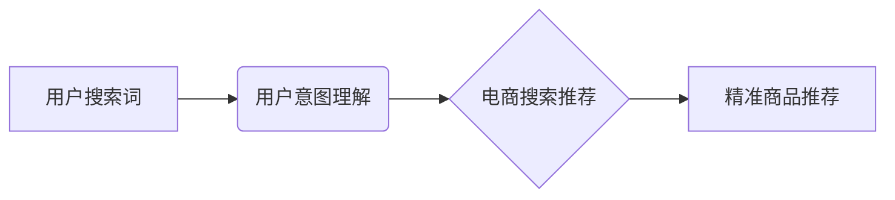

                 

## 1. 背景介绍

在当今数字经济时代，电商平台已成为人们获取商品和服务的首选渠道。然而，庞大的商品种类和海量用户需求使得精准的商品推荐成为电商平台发展的重要课题。传统的基于规则或协同过滤的推荐算法难以满足用户个性化需求和复杂搜索场景。近年来，随着深度学习技术的快速发展，基于AI大模型的用户意图理解技术逐渐成为电商搜索推荐领域的热点。

AI大模型凭借其强大的语义理解能力和泛化能力，能够从用户搜索词、浏览历史、购买行为等多方面数据中挖掘用户潜在需求，并将其转化为精准的商品推荐。本文将深入探讨电商搜索推荐中的AI大模型用户意图理解技术，涵盖核心概念、算法原理、数学模型、项目实践以及未来发展趋势等方面。

## 2. 核心概念与联系

### 2.1 用户意图理解

用户意图理解是指从用户输入的文本信息中识别用户真实需求的计算机技术。在电商搜索场景中，用户意图理解的关键在于理解用户搜索词背后的含义，例如用户搜索“运动鞋”可能想要购买篮球鞋、跑步鞋、网球鞋等不同类型的运动鞋，AI大模型需要根据上下文信息和用户历史行为等进行判断，精准识别用户的具体需求。

### 2.2 AI大模型

AI大模型是指在海量数据上训练的深度学习模型，具有强大的泛化能力和语义理解能力。常见的AI大模型包括BERT、GPT、T5等，它们能够学习语言的复杂结构和语义关系，并应用于各种自然语言处理任务，例如文本分类、问答系统、机器翻译等。

### 2.3 电商搜索推荐

电商搜索推荐是指根据用户搜索词和历史行为，推荐与用户需求相匹配的商品。传统的电商搜索推荐算法主要基于规则或协同过滤，但这些算法难以应对用户个性化需求和复杂搜索场景。AI大模型用户意图理解技术能够从用户搜索词中挖掘更深层的意图，并结合用户历史行为等信息，提供更精准、更个性化的商品推荐。

**核心概念架构图**



## 3. 核心算法原理 & 具体操作步骤

### 3.1 算法原理概述

AI大模型用户意图理解技术主要基于Transformer模型架构，该模型能够学习文本序列中的长距离依赖关系，并捕捉语义信息。在电商搜索场景中，常用的算法包括：

* **BERT (Bidirectional Encoder Representations from Transformers):** BERT是一种双向编码模型，能够理解上下文信息，并对搜索词进行语义表示。
* **RoBERTa (A Robustly Optimized BERT Pretraining Approach):** RoBERTa是BERT的改进版本，在预训练阶段进行了优化，提升了模型的性能。
* **XLNet (Generalized Autoregressive Pretraining for Language Understanding):** XLNet是一种更强大的Transformer模型，能够学习更复杂的语言关系。

### 3.2 算法步骤详解

1. **数据预处理:** 将用户搜索词进行清洗、分词、词向量化等预处理操作，以便模型能够理解和处理文本数据。
2. **模型训练:** 使用预训练的AI大模型，例如BERT或RoBERTa，对电商平台的搜索词数据进行训练，学习用户意图与搜索词之间的映射关系。
3. **意图分类:** 将用户搜索词输入到训练好的模型中，模型会输出每个意图的概率分布，从而识别用户的真实意图。
4. **商品推荐:** 根据识别的用户意图，从商品数据库中推荐与用户需求相匹配的商品。

### 3.3 算法优缺点

**优点:**

* **精准度高:** AI大模型能够学习复杂的语义关系，提高用户意图识别的精准度。
* **泛化能力强:** 预训练的AI大模型能够应用于不同的电商平台和搜索场景。
* **个性化推荐:** AI大模型能够根据用户的历史行为和搜索习惯，提供个性化的商品推荐。

**缺点:**

* **训练成本高:** 训练大型AI模型需要大量的计算资源和数据。
* **解释性差:** AI模型的决策过程较为复杂，难以解释模型的推荐结果。
* **数据依赖性强:** AI模型的性能取决于训练数据的质量和数量。

### 3.4 算法应用领域

AI大模型用户意图理解技术在电商搜索推荐领域有着广泛的应用，例如：

* **商品搜索:** 根据用户的搜索词，精准识别用户的商品需求，并推荐相关商品。
* **个性化推荐:** 根据用户的浏览历史、购买记录等信息，推荐个性化的商品。
* **广告投放:** 根据用户的搜索意图，精准投放相关的广告。
* **用户画像:** 通过分析用户的搜索行为，构建用户的兴趣画像，为用户提供更精准的服务。

## 4. 数学模型和公式 & 详细讲解 & 举例说明

### 4.1 数学模型构建

AI大模型用户意图理解技术通常基于Transformer模型架构，其核心是注意力机制。注意力机制能够学习文本序列中不同词语之间的关系，并赋予每个词语不同的权重，从而更好地理解上下文信息。

**注意力机制公式:**

$$
Attention(Q, K, V) = \frac{exp(Q \cdot K^T / \sqrt{d_k})}{exp(Q \cdot K^T / \sqrt{d_k})} \cdot V
$$

其中：

* $Q$：查询矩阵
* $K$：键矩阵
* $V$：值矩阵
* $d_k$：键向量的维度

### 4.2 公式推导过程

注意力机制的公式通过计算查询矩阵 $Q$ 与键矩阵 $K$ 的点积，并将其归一化，得到每个词语的注意力权重。然后，将注意力权重与值矩阵 $V$ 相乘，得到最终的输出。

### 4.3 案例分析与讲解

假设用户搜索了“买篮球鞋”，我们可以将搜索词分解为三个词语：“买”、“篮球”、“鞋”。

* $Q$：查询矩阵包含每个词语的向量表示。
* $K$：键矩阵包含所有词语的向量表示。
* $V$：值矩阵包含每个词语的语义信息。

通过计算 $Q$ 与 $K$ 的点积，我们可以得到每个词语对“买篮球鞋”的注意力权重。例如，“篮球” 的注意力权重可能比“买” 和 “鞋” 更高，因为“篮球” 更直接地与用户需求相关。

最终，通过将注意力权重与 $V$ 相乘，我们可以得到“买篮球鞋” 的语义表示，并将其用于商品推荐。

## 5. 项目实践：代码实例和详细解释说明

### 5.1 开发环境搭建

* Python 3.7+
* TensorFlow 2.0+
* PyTorch 1.0+
* CUDA 10.0+ (可选)

### 5.2 源代码详细实现

```python
# 使用BERT模型进行用户意图理解
from transformers import BertTokenizer, BertModel

# 加载预训练的BERT模型
tokenizer = BertTokenizer.from_pretrained('bert-base-uncased')
model = BertModel.from_pretrained('bert-base-uncased')

# 用户搜索词
query = "买篮球鞋"

# 将搜索词转换为BERT模型输入格式
input_ids = tokenizer.encode(query, add_special_tokens=True)

# 将输入数据送入BERT模型进行处理
outputs = model(input_ids)

# 获取模型输出的语义表示
last_hidden_state = outputs.last_hidden_state

# ...后续代码用于意图分类和商品推荐
```

### 5.3 代码解读与分析

* 使用`transformers`库加载预训练的BERT模型和词典。
* 将用户搜索词转换为BERT模型输入格式，并添加特殊标记。
* 将输入数据送入BERT模型进行处理，获取模型输出的语义表示。
* 后续代码可以根据模型输出的语义表示进行意图分类和商品推荐。

### 5.4 运行结果展示

运行上述代码后，模型会输出BERT模型对用户搜索词“买篮球鞋”的语义表示。

## 6. 实际应用场景

AI大模型用户意图理解技术在电商搜索推荐领域有着广泛的应用场景，例如：

* **精准商品搜索:** 根据用户的搜索词，精准识别用户的商品需求，并推荐相关商品。例如，用户搜索“运动鞋”，AI大模型可以识别用户想要购买的运动鞋类型，并推荐篮球鞋、跑步鞋、网球鞋等不同类型的运动鞋。
* **个性化商品推荐:** 根据用户的浏览历史、购买记录等信息，推荐个性化的商品。例如，用户之前购买过篮球鞋，AI大模型可以推荐用户可能感兴趣的其他篮球鞋款式或品牌。
* **智能客服:** AI大模型可以理解用户的自然语言问题，并提供智能客服服务。例如，用户询问“篮球鞋的尺码是多少”，AI大模型可以根据用户搜索历史和商品信息，提供准确的尺码信息。

### 6.4 未来应用展望

随着AI技术的不断发展，AI大模型用户意图理解技术在电商搜索推荐领域将有更广泛的应用，例如：

* **多模态搜索:** 将文本、图像、视频等多模态数据融合，实现更精准的商品搜索和推荐。
* **场景化推荐:** 根据用户的场景信息，例如时间、地点、活动等，提供更精准的商品推荐。
* **个性化营销:** 利用AI大模型分析用户的兴趣和需求，进行个性化的营销推广。

## 7. 工具和资源推荐

### 7.1 学习资源推荐

* **论文:**
    * BERT: Pre-training of Deep Bidirectional Transformers for Language Understanding
    * RoBERTa: A Robustly Optimized BERT Pretraining Approach
    * XLNet: Generalized Autoregressive Pretraining for Language Understanding
* **博客:**
    * The Illustrated Transformer
    * Understanding BERT

### 7.2 开发工具推荐

* **transformers:** 一个用于加载和使用预训练的AI大模型的Python库。
* **TensorFlow:** 一个开源的机器学习框架。
* **PyTorch:** 另一个开源的机器学习框架。

### 7.3 相关论文推荐

* **BERT: Pre-training of Deep Bidirectional Transformers for Language Understanding**
* **RoBERTa: A Robustly Optimized BERT Pretraining Approach**
* **XLNet: Generalized Autoregressive Pretraining for Language Understanding**
* **Attention Is All You Need**

## 8. 总结：未来发展趋势与挑战

### 8.1 研究成果总结

AI大模型用户意图理解技术在电商搜索推荐领域取得了显著的成果，能够提高商品推荐的精准度和个性化程度。

### 8.2 未来发展趋势

* **多模态搜索:** 将文本、图像、视频等多模态数据融合，实现更精准的商品搜索和推荐。
* **场景化推荐:** 根据用户的场景信息，例如时间、地点、活动等，提供更精准的商品推荐。
* **个性化营销:** 利用AI大模型分析用户的兴趣和需求，进行个性化的营销推广。

### 8.3 面临的挑战

* **数据质量:** AI模型的性能取决于训练数据的质量和数量。
* **解释性:** AI模型的决策过程较为复杂，难以解释模型的推荐结果。
* **公平性:** AI模型可能存在偏见，导致推荐结果不公平。

### 8.4 研究展望

未来，AI大模型用户意图理解技术将继续朝着更精准、更个性化、更智能的方向发展。研究者将继续探索新的算法和模型，以解决现有技术面临的挑战，并推动AI技术在电商搜索推荐领域的应用。

## 9. 附录：常见问题与解答

**Q1: AI大模型用户意图理解技术与传统的搜索推荐算法相比有哪些优势？**

**A1:** AI大模型用户意图理解技术能够学习复杂的语义关系，提高用户意图识别的精准度，并根据用户的历史行为和搜索习惯，提供个性化的商品推荐。传统的搜索推荐算法主要基于规则或协同过滤，难以应对用户个性化需求和复杂搜索场景。

**Q2: 如何评估AI大模型用户意图理解技术的性能？**

**A2:** 常见的评估指标包括准确率、召回率、F1-score等。

**Q3: 如何解决AI模型数据依赖性强的问题？**

**A3:** 可以通过数据增强、迁移学习等方法来缓解数据依赖性问题。

**作者：禅与计算机程序设计艺术 / Zen and the Art of Computer Programming**<end_of_turn>

