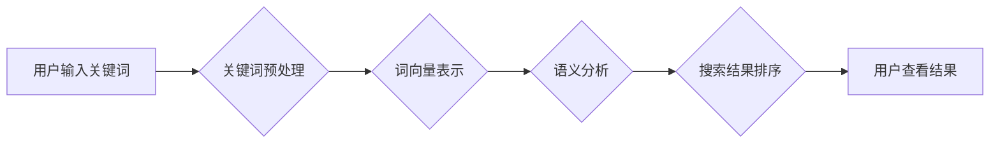

                 

## 电商搜索的语义理解与纠错：AI大模型的新突破

> 关键词：电商搜索、语义理解、纠错、AI大模型、自然语言处理、BERT、Transformer

## 1. 背景介绍

电商搜索是电商平台的核心功能之一，用户通过输入关键词来查找心仪商品。然而，用户搜索的关键词往往存在着多种问题，例如：

* **表达模糊不清:** 用户可能使用过于宽泛或过于具体的关键词，导致搜索结果不精准。
* **语法错误:** 用户输入的关键词可能存在语法错误，导致搜索引擎无法理解用户意图。
* **拼写错误:** 用户可能由于输入失误而导致关键词拼写错误，导致无法找到相关商品。
* **同义词替换:** 用户可能使用不同的同义词来表达相同的意图，导致搜索引擎无法识别出用户真实需求。

这些问题都会影响用户搜索体验，降低电商平台的转化率。传统的基于关键词匹配的搜索算法难以解决这些问题，因此，近年来，基于语义理解的电商搜索技术逐渐成为研究热点。

## 2. 核心概念与联系

语义理解是指计算机能够理解人类语言的深层含义，并将其转换为机器可理解的表示形式。在电商搜索领域，语义理解主要用于解决以下问题：

* **关键词意图识别:** 识别用户输入的关键词所表达的真实意图，例如用户是想查找商品信息、比较商品价格还是了解商品评价。
* **关键词关系抽取:** 识别用户输入的关键词之间的语义关系，例如“红色”和“衬衫”之间的颜色关系，“价格”和“便宜”之间的价格关系。
* **同义词识别:** 识别用户输入的关键词和数据库中商品信息的同义词关系，例如“手机”和“智能手机”之间的同义词关系。

**核心概念原理和架构的 Mermaid 流程图**



## 3. 核心算法原理 & 具体操作步骤

### 3.1  算法原理概述

基于AI大模型的语义理解算法主要利用深度学习技术，通过训练大量的语料数据，学习语言的语义表示和关系。其中，BERT（Bidirectional Encoder Representations from Transformers）和Transformer模型是目前最常用的语义理解算法。

BERT模型通过双向编码器结构，对输入的文本序列进行编码，学习到每个词语在句子中的上下文语义信息。Transformer模型则通过注意力机制，学习到不同词语之间的语义关系，能够更好地理解长距离依赖关系。

### 3.2  算法步骤详解

1. **数据预处理:** 将用户输入的关键词进行预处理，例如去除停用词、进行词形还原等。
2. **词向量表示:** 将预处理后的关键词转换为词向量表示，例如使用Word2Vec、GloVe等词向量模型。
3. **语义分析:** 利用BERT或Transformer模型对词向量表示进行语义分析，例如识别关键词意图、提取关键词关系等。
4. **搜索结果排序:** 根据语义分析结果，对搜索结果进行排序，将与用户意图最匹配的商品排在前面。

### 3.3  算法优缺点

**优点:**

* **语义理解能力强:** 基于AI大模型的算法能够更好地理解用户输入的深层含义，提高搜索结果的精准度。
* **适应性强:** 可以根据不同的电商平台和用户群体进行模型训练和调整，提高算法的适应性。
* **持续学习:** 可以通过不断收集用户搜索数据进行模型更新，不断提高算法的性能。

**缺点:**

* **计算资源消耗大:** 训练和使用AI大模型需要大量的计算资源，成本较高。
* **数据依赖性强:** 算法的性能取决于训练数据的质量和数量，如果训练数据不足或质量较差，算法性能会受到影响。
* **解释性差:** AI大模型的决策过程较为复杂，难以解释模型的决策结果。

### 3.4  算法应用领域

基于AI大模型的语义理解算法在电商搜索领域具有广泛的应用前景，例如：

* **商品搜索:** 提高商品搜索的精准度，帮助用户快速找到心仪商品。
* **个性化推荐:** 根据用户的搜索历史和偏好，提供个性化的商品推荐。
* **智能客服:** 利用语义理解技术，帮助用户解决购物问题，提高用户体验。

## 4. 数学模型和公式 & 详细讲解 & 举例说明

### 4.1  数学模型构建

BERT模型的核心是Transformer结构，其主要包含以下几个模块：

* **嵌入层:** 将输入的词语转换为词向量表示。
* **多头注意力层:** 学习到不同词语之间的语义关系。
* **前馈神经网络层:** 对每个词语的上下文语义信息进行进一步处理。
* **位置编码层:** 为每个词语添加位置信息，以便模型理解词语在句子中的顺序关系。

### 4.2  公式推导过程

Transformer模型的注意力机制的核心公式如下：

$$
Attention(Q, K, V) = softmax(\frac{QK^T}{\sqrt{d_k}})V
$$

其中：

* $Q$：查询矩阵
* $K$：键矩阵
* $V$：值矩阵
* $d_k$：键向量的维度
* $softmax$：softmax函数

该公式计算了查询向量与键向量的相似度，并根据相似度对值向量进行加权求和，得到最终的注意力输出。

### 4.3  案例分析与讲解

例如，用户输入的关键词是“红色长款外套”，BERT模型会将该关键词序列转换为词向量表示，并利用多头注意力机制学习到“红色”和“长款外套”之间的颜色和款式关系。

## 5. 项目实践：代码实例和详细解释说明

### 5.1  开发环境搭建

* Python 3.6+
* TensorFlow 2.0+
* PyTorch 1.0+
* CUDA 10.0+

### 5.2  源代码详细实现

```python
# 使用BERT模型进行语义理解
from transformers import BertTokenizer, BertModel

# 加载预训练的BERT模型
tokenizer = BertTokenizer.from_pretrained('bert-base-uncased')
model = BertModel.from_pretrained('bert-base-uncased')

# 将用户输入的关键词转换为BERT模型的输入格式
input_ids = tokenizer.encode("红色长款外套", add_special_tokens=True)

# 将输入序列送入BERT模型进行编码
outputs = model(input_ids)

# 获取BERT模型的输出结果
last_hidden_states = outputs.last_hidden_state

# 对输出结果进行进一步处理，例如提取关键词关系
```

### 5.3  代码解读与分析

* 该代码首先加载预训练的BERT模型和词语分词器。
* 然后将用户输入的关键词转换为BERT模型的输入格式，并将其送入BERT模型进行编码。
* 最后，获取BERT模型的输出结果，并对输出结果进行进一步处理，例如提取关键词关系。

### 5.4  运行结果展示

BERT模型的输出结果是一个多维度的向量，可以用于后续的语义分析任务。例如，可以利用该向量进行关键词意图识别、关键词关系抽取等操作。

## 6. 实际应用场景

### 6.1  电商搜索场景

* **精准搜索:** 基于语义理解的电商搜索可以理解用户搜索的深层含义，提高搜索结果的精准度。例如，用户搜索“苹果手机”，系统可以理解用户是想查找苹果品牌的手机，而不是苹果水果。
* **个性化推荐:** 根据用户的搜索历史和偏好，电商平台可以利用语义理解技术提供个性化的商品推荐。例如，如果用户经常搜索“运动鞋”，系统可以推荐用户购买运动鞋相关的商品。

### 6.2  智能客服场景

* **自然语言交互:** 基于语义理解的智能客服可以理解用户的自然语言输入，并提供更自然的回复。例如，用户可以向智能客服询问商品价格、库存情况等信息，智能客服可以理解用户的意图并提供准确的回复。
* **问题解决:** 智能客服可以利用语义理解技术识别用户的疑问，并提供相应的解决方案。例如，如果用户询问商品的售后服务，智能客服可以提供售后服务的相关信息。

### 6.3  内容推荐场景

* **个性化内容推荐:** 基于语义理解的算法可以分析用户的阅读兴趣，并推荐与用户兴趣相关的文章、视频等内容。例如，如果用户经常阅读科技新闻，系统可以推荐用户阅读最新的科技资讯。
* **内容分类:** 语义理解算法可以用于对内容进行分类，例如将新闻文章分类为科技、财经、娱乐等类别。

### 6.4  未来应用展望

随着AI技术的不断发展，语义理解技术将在更多领域得到应用，例如：

* **医疗诊断:** 利用语义理解技术，帮助医生更快、更准确地诊断疾病。
* **法律服务:** 利用语义理解技术，帮助律师更快、更准确地分析法律文件。
* **教育领域:** 利用语义理解技术，个性化定制学习内容，提高学习效率。

## 7. 工具和资源推荐

### 7.1  学习资源推荐

* **Stanford NLP Group:** https://nlp.stanford.edu/
* **Hugging Face:** https://huggingface.co/
* **OpenAI:** https://openai.com/

### 7.2  开发工具推荐

* **TensorFlow:** https://www.tensorflow.org/
* **PyTorch:** https://pytorch.org/
* **SpaCy:** https://spacy.io/

### 7.3  相关论文推荐

* **BERT: Pre-training of Deep Bidirectional Transformers for Language Understanding**
* **Attention Is All You Need**
* **XLNet: Generalized Autoregressive Pretraining for Language Understanding**

## 8. 总结：未来发展趋势与挑战

### 8.1  研究成果总结

近年来，基于AI大模型的语义理解技术取得了显著进展，例如BERT、XLNet等模型的出现，为电商搜索的语义理解提供了新的思路和方法。

### 8.2  未来发展趋势

* **模型规模和能力的提升:** 未来，AI大模型的规模和能力将会进一步提升，能够更好地理解复杂的语言表达和语义关系。
* **多模态语义理解:** 将文本、图像、音频等多模态信息融合在一起，实现更全面的语义理解。
* **个性化语义理解:** 根据用户的个性化需求和偏好，提供更精准、更个性化的语义理解服务。

### 8.3  面临的挑战

* **数据质量和数量:** 语义理解算法的性能取决于训练数据的质量和数量，如何获取高质量的语料数据仍然是一个挑战。
* **模型解释性和可解释性:** AI大模型的决策过程较为复杂，难以解释模型的决策结果，如何提高模型的解释性和可解释性是一个重要的研究方向。
* **伦理和安全问题:** 语义理解技术可能会被用于恶意目的，例如生成虚假信息、进行身份欺诈等，如何确保语义理解技术的安全和伦理使用是一个需要认真考虑的问题。

### 8.4  研究展望

未来，语义理解技术将会在更多领域得到应用，并对人们的生活产生深远的影响。我们期待看到更多创新性的研究成果，推动语义理解技术的发展，并将其应用于更多有益的领域。

## 9. 附录：常见问题与解答

**Q1: BERT模型和Transformer模型有什么区别？**

**A1:** BERT模型是基于Transformer结构的，但BERT模型的训练目标是通过Masked Language Modeling和Next Sentence Prediction两种预训练任务来学习语言的上下文语义信息。而Transformer模型则是一个更通用的架构，可以用于各种自然语言处理任务，例如机器翻译、文本摘要等。

**Q2: 如何评估语义理解算法的性能？**

**A2:** 语义理解算法的性能可以评估多种指标，例如准确率、召回率、F1-score等。具体的评估指标取决于具体的语义理解任务。

**Q3: 如何解决语义理解算法的数据依赖性问题？**

**A3:** 

* 尝试使用迁移学习技术，将预训练模型应用于新的任务和领域。
* 探索使用少量数据进行训练的方法，例如主动学习、半监督学习等。
* 鼓励开源社区共同构建高质量的语料数据。


作者：禅与计算机程序设计艺术 / Zen and the Art of Computer Programming 
<end_of_turn>

