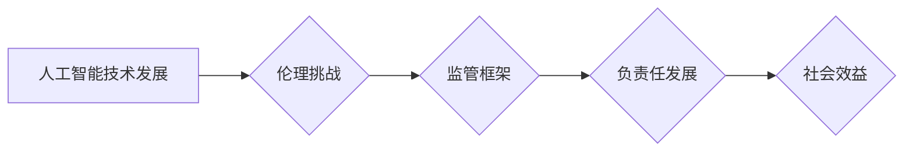

                 

## 监管与创新：确保人工智能负责任发展

> 关键词：人工智能、监管、伦理、安全、可解释性、公平性、创新

### 1. 背景介绍

人工智能（AI）正以惊人的速度发展，其应用领域不断扩展，从医疗保健和金融到交通和娱乐，AI正在深刻地改变着我们的生活。然而，AI技术的快速发展也带来了新的挑战和风险，例如算法偏见、数据隐私、工作岗位替代等。因此，如何平衡AI的创新发展与负责任的应用，成为全球范围内亟待解决的重要问题。

**1.1 AI技术发展现状**

近年来，深度学习算法的突破性进展推动了AI技术的飞速发展。基于大规模数据训练的深度学习模型在图像识别、自然语言处理、语音识别等领域取得了令人瞩目的成果，甚至超越了人类水平。

**1.2 AI带来的机遇与挑战**

AI技术为人类社会带来了巨大的机遇，例如提高生产效率、改善医疗服务、促进科学研究等。然而，AI技术也带来了潜在的风险，例如：

* **算法偏见:** AI算法的训练数据可能包含社会偏见，导致算法输出结果存在偏见，加剧社会不平等。
* **数据隐私:** AI算法需要大量数据进行训练，这可能导致个人隐私泄露和滥用。
* **工作岗位替代:** AI自动化技术可能导致大量工作岗位被取代，引发社会失业问题。
* **安全风险:** 恶意利用AI技术可能导致网络攻击、虚假信息传播等安全风险。

**1.3 监管与创新之间的平衡**

如何平衡AI的创新发展与负责任的应用，是当前全球范围内面临的重大挑战。过度的监管可能会抑制AI技术的创新，而缺乏监管则可能导致AI技术被滥用，带来不可预知的风险。因此，我们需要制定合理的监管框架，既鼓励AI技术的创新发展，又确保AI技术的安全、公平、可解释和负责任地应用。

### 2. 核心概念与联系

**2.1 核心概念**

* **人工智能 (AI):** 人工智能是指模拟人类智能行为的计算机系统，包括学习、推理、决策、感知和语言理解等能力。
* **监管 (Regulation):** 监管是指政府或其他机构对特定领域或活动制定和实施规则和标准，以确保其安全、公平、合法和可持续发展。
* **伦理 (Ethics):** 伦理是指关于什么是对的和什么是错的道德准则和价值观。

**2.2 核心概念联系**

AI技术的快速发展带来了新的伦理挑战，因此需要制定相应的监管框架来确保AI技术的负责任发展。监管可以帮助解决AI技术带来的潜在风险，例如算法偏见、数据隐私、安全风险等，同时也能促进AI技术的创新发展，确保AI技术造福人类社会。

**2.3 Mermaid 流程图**



### 3. 核心算法原理 & 具体操作步骤

**3.1 算法原理概述**

深度学习算法是目前AI技术发展最前沿的算法之一，其核心原理是利用多层神经网络模拟人类大脑的学习过程。深度学习算法能够从海量数据中自动学习特征，并进行复杂的模式识别和预测。

**3.2 算法步骤详解**

1. **数据预处理:** 将原始数据进行清洗、转换和格式化，使其适合深度学习算法的训练。
2. **网络结构设计:** 根据具体任务需求设计深度神经网络的结构，包括神经元数量、层数、激活函数等。
3. **参数初始化:** 为神经网络中的参数进行随机初始化。
4. **前向传播:** 将输入数据通过神经网络进行逐层传递，最终得到输出结果。
5. **损失函数计算:** 计算模型输出结果与真实值的差异，即损失函数值。
6. **反向传播:** 根据损失函数值，反向传播误差信号，调整神经网络参数。
7. **优化算法:** 使用优化算法，例如梯度下降法，更新神经网络参数，降低损失函数值。
8. **模型评估:** 使用测试数据评估模型的性能，例如准确率、召回率、F1-score等。

**3.3 算法优缺点**

**优点:**

* 能够自动学习特征，无需人工特征工程。
* 能够处理海量数据，学习复杂模式。
* 在图像识别、自然语言处理等领域取得了突破性成果。

**缺点:**

* 训练数据量大，计算资源消耗高。
* 训练过程复杂，需要专业知识和技术。
* 模型解释性差，难以理解模型的决策过程。

**3.4 算法应用领域**

深度学习算法广泛应用于以下领域：

* **计算机视觉:** 图像识别、物体检测、图像分割、人脸识别等。
* **自然语言处理:** 文本分类、情感分析、机器翻译、对话系统等。
* **语音识别:** 语音转文本、语音助手等。
* **推荐系统:** 商品推荐、内容推荐等。
* **医疗诊断:** 疾病诊断、影像分析等。

### 4. 数学模型和公式 & 详细讲解 & 举例说明

**4.1 数学模型构建**

深度学习算法的核心是多层神经网络，每个神经元接收多个输入信号，并通过激活函数进行处理，输出一个信号。神经网络的输出结果是多个神经元的输出信号的线性组合。

**4.2 公式推导过程**

假设一个神经网络有L层，每层有n个神经元，输入数据为x，输出结果为y。

* **前向传播公式:**

```latex
h^{(l)} = f^{(l)}(W^{(l)}h^{(l-1)} + b^{(l)})
```

其中：

* $h^{(l)}$ 是第l层的激活输出
* $f^{(l)}$ 是第l层的激活函数
* $W^{(l)}$ 是第l层的权重矩阵
* $b^{(l)}$ 是第l层的偏置向量
* $h^{(0)} = x$ 是输入数据

* **损失函数:**

```latex
L = \frac{1}{N} \sum_{i=1}^{N} \left\| y^{(i)} - \hat{y}^{(i)} \right\|^2
```

其中：

* $L$ 是损失函数值
* $N$ 是样本数量
* $y^{(i)}$ 是第i个样本的真实值
* $\hat{y}^{(i)}$ 是第i个样本的预测值

* **反向传播公式:**

```latex
\frac{\partial L}{\partial W^{(l)}} = \frac{\partial L}{\partial h^{(l)}} \cdot \frac{\partial h^{(l)}}{\partial W^{(l)}}
```

**4.3 案例分析与讲解**

例如，在图像识别任务中，深度学习算法可以学习图像特征，并将其映射到不同的类别。训练数据包括大量图像和对应的类别标签。通过前向传播和反向传播算法，深度学习模型可以不断调整权重和偏置，最终能够准确识别图像的类别。

### 5. 项目实践：代码实例和详细解释说明

**5.1 开发环境搭建**

* 操作系统: Ubuntu 20.04
* Python 版本: 3.8
* 深度学习框架: TensorFlow 2.0

**5.2 源代码详细实现**

```python
import tensorflow as tf

# 定义模型结构
model = tf.keras.models.Sequential([
    tf.keras.layers.Conv2D(32, (3, 3), activation='relu', input_shape=(28, 28, 1)),
    tf.keras.layers.MaxPooling2D((2, 2)),
    tf.keras.layers.Conv2D(64, (3, 3), activation='relu'),
    tf.keras.layers.MaxPooling2D((2, 2)),
    tf.keras.layers.Flatten(),
    tf.keras.layers.Dense(10, activation='softmax')
])

# 编译模型
model.compile(optimizer='adam',
              loss='sparse_categorical_crossentropy',
              metrics=['accuracy'])

# 加载数据集
(x_train, y_train), (x_test, y_test) = tf.keras.datasets.mnist.load_data()

# 数据预处理
x_train = x_train.astype('float32') / 255
x_test = x_test.astype('float32') / 255
x_train = x_train.reshape((x_train.shape[0], 28, 28, 1))
x_test = x_test.reshape((x_test.shape[0], 28, 28, 1))

# 训练模型
model.fit(x_train, y_train, epochs=5)

# 评估模型
loss, accuracy = model.evaluate(x_test, y_test)
print('Test loss:', loss)
print('Test accuracy:', accuracy)
```

**5.3 代码解读与分析**

这段代码实现了使用TensorFlow框架训练一个简单的图像识别模型。

* 首先定义了模型结构，包括卷积层、池化层和全连接层。
* 然后编译模型，指定优化器、损失函数和评价指标。
* 加载MNIST数据集，并进行数据预处理，将图像数据转换为适合模型输入的格式。
* 训练模型，指定训练轮数。
* 最后评估模型，计算测试集上的损失和准确率。

**5.4 运行结果展示**

训练完成后，模型能够识别MNIST数据集中的手写数字。

### 6. 实际应用场景

**6.1 医疗诊断**

AI算法可以辅助医生进行疾病诊断，例如分析医学影像，识别肿瘤、骨折等异常情况。

**6.2 金融风险管理**

AI算法可以分析金融数据，识别欺诈交易、预测市场风险等。

**6.3 自动驾驶**

AI算法可以帮助车辆感知周围环境，做出决策，实现自动驾驶。

**6.4 未来应用展望**

随着AI技术的不断发展，其应用场景将更加广泛，例如个性化教育、智能家居、精准农业等。

### 7. 工具和资源推荐

**7.1 学习资源推荐**

* **在线课程:** Coursera、edX、Udacity等平台提供丰富的AI课程。
* **书籍:** 《深度学习》、《人工智能：一种现代方法》等书籍。
* **开源项目:** TensorFlow、PyTorch等开源深度学习框架。

**7.2 开发工具推荐**

* **Python:** 广泛应用于AI开发的编程语言。
* **TensorFlow:** Google开发的开源深度学习框架。
* **PyTorch:** Facebook开发的开源深度学习框架。

**7.3 相关论文推荐**

* **《ImageNet Classification with Deep Convolutional Neural Networks》**
* **《Attention Is All You Need》**
* **《BERT: Pre-training of Deep Bidirectional Transformers for Language Understanding》**

### 8. 总结：未来发展趋势与挑战

**8.1 研究成果总结**

近年来，AI技术取得了显著进展，在图像识别、自然语言处理等领域取得了突破性成果。

**8.2 未来发展趋势**

* **模型规模和能力的提升:** 未来AI模型将更加强大，能够处理更复杂的任务。
* **模型解释性和可信度的提升:** 研究者将更加关注AI模型的解释性和可信度，使其更加透明和可理解。
* **边缘计算和联邦学习:** AI模型将更加轻量化，能够在边缘设备上运行，并通过联邦学习方式进行训练。

**8.3 面临的挑战**

* **数据安全和隐私保护:** AI算法需要大量数据进行训练，如何确保数据安全和隐私保护是一个重要挑战。
* **算法偏见和公平性:** AI算法可能存在偏见，导致不公平的结果，需要研究如何解决算法偏见问题。
* **伦理和社会影响:** AI技术的快速发展可能带来伦理和社会问题，需要进行深入的伦理思考和社会讨论。

**8.4 研究展望**

未来，AI研究将更加注重可解释性、公平性、安全性等方面，并与其他领域交叉融合，例如生物学、物理学等，推动人工智能技术的健康发展。

### 9. 附录：常见问题与解答

**9.1 如何解决AI算法的偏见问题？**

* 使用更加多样化的训练数据，减少数据偏差。
* 开发算法去偏见的方法，例如对抗训练、公平学习等。
* 对算法输出结果进行监控和评估，及时发现和解决偏见问题。

**9.2 如何确保AI算法的安全性和可靠性？**

* 对算法进行安全评估，识别潜在的漏洞和风险。
* 使用安全可靠的硬件和软件平台进行部署。
* 建立完善的监控和报警机制，及时发现和处理异常情况。

**9.3 如何促进AI技术的伦理发展？**

* 制定相关的法律法规和伦理准则，规范AI技术的应用。
* 加强公众对AI技术的认知和理解，促进社会共识。
* 鼓励学术界和产业界开展伦理研究，探索AI技术的伦理问题。


作者：禅与计算机程序设计艺术 / Zen and the Art of Computer Programming<end_of_turn>

