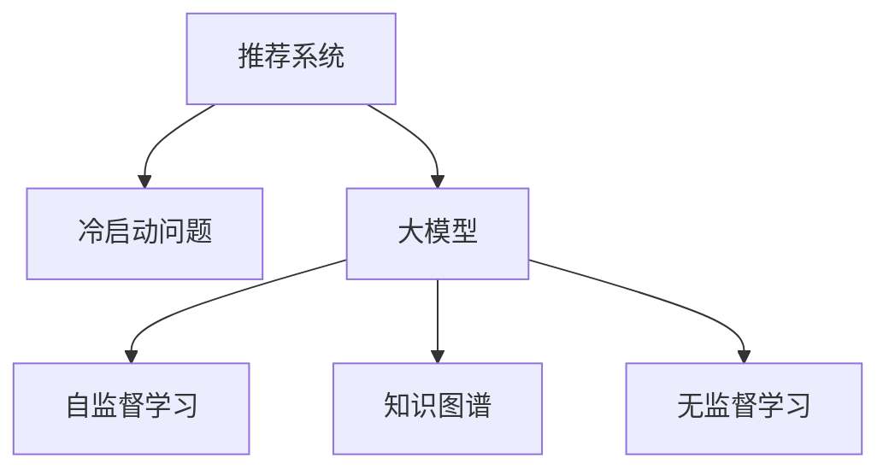

                 

# 大模型对推荐系统冷启动问题的新解

> 关键词：推荐系统,冷启动,大模型,自监督学习,知识图谱,无监督学习

## 1. 背景介绍

### 1.1 问题由来
推荐系统是现代互联网应用中不可或缺的核心技术，通过分析用户的历史行为数据，为用户推荐符合其兴趣的个性化内容。在大规模电商、视频、音乐等平台中，推荐系统早已成为提升用户体验、增加用户粘性和收益的重要手段。

然而，推荐系统的关键在于用户行为数据的积累，这是构建推荐模型的基础。对于新用户，由于缺乏历史行为数据，推荐系统无法为其推荐个性化内容，这便构成了推荐系统领域中著名的“冷启动问题”。传统的冷启动解决方案包括标签推荐、协同过滤等，但效果有限，难以适应大规模平台的需求。

近年来，随着深度学习和数据挖掘技术的不断发展，推荐系统开始引入更复杂、灵活的深度学习模型，特别是大模型在推荐场景中的应用，带来了新的突破。利用大模型的语义理解和生成能力，可以有效缓解冷启动问题，提升推荐系统的效果和用户满意度。

### 1.2 问题核心关键点
大模型在推荐系统中解决冷启动问题的核心在于其强大的语义表示和生成能力。具体而言：
1. **语义表示**：大模型能够理解和生成自然语言，将其转化为数学表示，从而进行相似性计算和推荐。
2. **生成能力**：大模型能够在没有历史行为数据的情况下，通过文本数据生成新的内容，进行推荐。
3. **泛化能力**：大模型通常基于大规模无监督语料进行预训练，具备较强的泛化能力，能够在不同领域和任务中迁移应用。
4. **自监督学习**：大模型往往在预训练过程中使用自监督学习任务，学习到语言的通用表示。

### 1.3 问题研究意义
大模型在推荐系统中解决冷启动问题，具有重要意义：

1. **降低推荐成本**：利用大模型的语义表示和生成能力，可以大幅降低推荐系统的开发和维护成本，快速推出新的推荐服务。
2. **提升推荐效果**：大模型具备更丰富的语义信息，能够从非结构化数据中提取更多有用的特征，从而提升推荐效果。
3. **扩展推荐范围**：大模型的泛化能力，使其能够适应更广泛的数据和应用场景，扩展推荐系统的应用边界。
4. **促进数据采集**：大模型的引入，可以吸引更多用户主动参与数据采集，进一步提升推荐系统的训练数据质量和覆盖面。

## 2. 核心概念与联系

### 2.1 核心概念概述

为了更好地理解大模型在推荐系统中解决冷启动问题的方法，本节将介绍几个密切相关的核心概念：

- **推荐系统(Recommender System)**：根据用户的历史行为数据，为用户推荐个性化内容。传统的协同过滤、基于内容的推荐等方法已经相对成熟。
- **冷启动问题(Cold-Start Problem)**：新用户由于缺乏历史行为数据，导致推荐系统无法为其推荐个性化内容。
- **大模型(Large Model)**：如BERT、GPT-3等大规模预训练语言模型，具备强大的语义表示和生成能力。
- **自监督学习(Self-supervised Learning)**：利用大规模无标注数据进行预训练，学习通用的语言表示。
- **知识图谱(Knowledge Graph)**：一种表示实体间关系的图结构，常用于推荐系统中的关系抽取和推荐。
- **无监督学习(Unsupervised Learning)**：在无标注数据上进行学习，利用数据自身的结构和特征进行建模。

这些核心概念之间的逻辑关系可以通过以下Mermaid流程图来展示：



这个流程图展示了推荐系统中的核心概念及其之间的关系：

1. 推荐系统通过用户行为数据进行推荐，但面临冷启动问题。
2. 大模型通过自监督学习学习通用语言表示，能够对非结构化数据进行处理。
3. 知识图谱用于表示实体间关系，是大模型进行推荐的重要参考。
4. 无监督学习在大模型的预训练和微调过程中扮演重要角色。

这些概念共同构成了推荐系统中利用大模型解决冷启动问题的基础框架。

## 3. 核心算法原理 & 具体操作步骤

### 3.1 算法原理概述

利用大模型解决推荐系统的冷启动问题，本质上是一种基于语义表示和生成能力的推荐范式。其核心思想是：通过大模型学习用户和商品之间的语义关系，生成新的推荐内容。

具体而言，大模型在推荐场景中的应用可以分为以下几步：

1. **预训练**：利用大规模无监督语料进行自监督学习，学习到通用的语言表示。
2. **微调**：基于特定领域的数据，对大模型进行微调，学习到领域特定的语义表示。
3. **推荐计算**：将用户和商品转化为文本表示，计算它们之间的相似度，生成推荐结果。

### 3.2 算法步骤详解

以下是大模型在推荐系统中解决冷启动问题的详细步骤：

**Step 1: 预训练大模型**
- 使用大规模无监督语料库对大模型进行自监督学习，学习通用的语言表示。
- 常用的预训练任务包括语言建模、掩码语言模型等。

**Step 2: 微调大模型**
- 收集特定领域的标注数据，将大模型作为初始化参数，进行微调。
- 在微调过程中，保留大部分预训练权重不变，只微调顶层分类器或解码器，以提高效率。
- 引入正则化技术，如Dropout、L2正则等，防止模型过拟合。

**Step 3: 生成推荐内容**
- 对用户和商品进行文本表示，计算它们之间的语义相似度。
- 基于相似度排序，生成推荐结果。

**Step 4: 融合知识图谱**
- 将用户和商品转化为知识图谱中的实体节点，计算它们之间的关系。
- 将关系表示为向量，与用户和商品的语义表示融合，生成更准确的推荐结果。

### 3.3 算法优缺点

利用大模型解决冷启动问题的推荐系统，具有以下优点：
1. **通用性强**：大模型能够在不同领域和任务中迁移应用，提升了推荐系统的通用性和扩展性。
2. **处理能力强**：大模型的语义表示和生成能力，使其能够处理非结构化数据，扩展了推荐系统的数据来源。
3. **效果显著**：在少量标注数据下，大模型仍能取得不错的推荐效果。
4. **可解释性强**：大模型的语义表示可以提供推荐内容的详细解释，帮助用户理解推荐逻辑。

同时，该方法也存在一定的局限性：
1. **资源消耗大**：大模型的训练和推理需要大量算力和内存，可能存在资源瓶颈。
2. **泛化能力有限**：当领域差异较大时，大模型的泛化能力可能受限，推荐效果下降。
3. **鲁棒性不足**：大模型可能学习到有害信息，影响推荐内容的质量。
4. **可解释性差**：大模型的复杂结构可能导致其行为难以解释，不利于系统的维护和调试。

### 3.4 算法应用领域

大模型在推荐系统中解决冷启动问题，已经应用于多个实际场景：

1. **电商推荐**：基于用户评论、商品描述等文本数据，利用大模型生成新的推荐内容。
2. **视频推荐**：利用用户和视频描述的语义表示，进行推荐相似性计算。
3. **音乐推荐**：通过用户和歌曲的文本描述，生成推荐结果。
4. **图书推荐**：利用书籍摘要和用户评论的语义表示，进行推荐。
5. **旅游推荐**：基于用户和旅游目的地的文本描述，生成推荐内容。

## 4. 数学模型和公式 & 详细讲解 & 举例说明

### 4.1 数学模型构建

在大模型推荐系统中，推荐过程可以分为以下几个步骤：

1. **用户表示**：将用户转化为文本表示 $\vec{u}$。
2. **商品表示**：将商品转化为文本表示 $\vec{v}$。
3. **相似度计算**：计算用户和商品的语义相似度 $s$。
4. **推荐排序**：基于相似度排序，生成推荐结果 $\vec{r}$。

以下将使用数学语言对推荐过程进行更加严格的刻画。

**用户和商品的文本表示**：
设用户 $\mathcal{U}$ 和商品 $\mathcal{V}$ 的文本表示分别为 $\vec{u} \in \mathbb{R}^n$ 和 $\vec{v} \in \mathbb{R}^n$，其中 $n$ 为向量维度。

**语义相似度计算**：
设用户和商品的语义相似度为 $s \in [0,1]$，表示它们之间的匹配程度。具体计算公式为：

$$
s = \frac{\vec{u} \cdot \vec{v}}{\|\vec{u}\| \cdot \|\vec{v}\|}
$$

其中 $\cdot$ 表示向量点乘，$\|\cdot\|$ 表示向量范数。

**推荐排序**：
设推荐结果的向量为 $\vec{r} \in \mathbb{R}^m$，其中 $m$ 为推荐结果的个数。推荐排序的过程可以表示为：

$$
\vec{r} = \arg\max_{\vec{v} \in \mathcal{V}} s
$$

即选择与用户最相似的商品作为推荐结果。

### 4.2 公式推导过程

以下是详细推导语义相似度计算公式的过程：

设用户 $\mathcal{U}$ 和商品 $\mathcal{V}$ 的文本表示分别为 $\vec{u} \in \mathbb{R}^n$ 和 $\vec{v} \in \mathbb{R}^n$，则语义相似度 $s$ 的计算公式为：

$$
s = \frac{\vec{u} \cdot \vec{v}}{\|\vec{u}\| \cdot \|\vec{v}\|}
$$

**推导过程**：

1. **点乘公式**：向量点乘的定义为 $\vec{u} \cdot \vec{v} = \sum_{i=1}^n u_i v_i$，其中 $u_i, v_i$ 分别为向量 $\vec{u}$ 和 $\vec{v}$ 的第 $i$ 维分量。

2. **向量范数**：向量范数定义为 $\|\vec{u}\| = \sqrt{\sum_{i=1}^n u_i^2}$，表示向量的长度。

3. **相似度公式**：根据点乘和向量范数的定义，可以得到：

$$
s = \frac{\vec{u} \cdot \vec{v}}{\|\vec{u}\| \cdot \|\vec{v}\|}
$$

4. **归一化**：为了使相似度 $s$ 的值域在 $[0,1]$ 内，需要对点乘结果进行归一化处理。

5. **应用场景**：在实际推荐系统中，$s$ 的取值范围往往需要在 $[0,1]$ 之间，因此归一化处理是必要的。

### 4.3 案例分析与讲解

以下将通过一个具体的推荐案例，进一步讲解大模型在推荐系统中的应用。

假设有一个电商平台的推荐系统，需要对新用户进行推荐。由于新用户缺乏历史行为数据，无法直接使用协同过滤等传统方法进行推荐。但平台可以收集新用户填写的问卷数据，其中包含用户的兴趣偏好和购买意图。利用大模型，可以将这些问卷数据转化为文本表示，与商品描述进行语义相似度计算，从而生成推荐结果。

具体而言，可以按照以下步骤进行：

1. **问卷转化为文本表示**：利用大模型，将问卷转化为文本表示 $\vec{q}$。
2. **商品转化为文本表示**：将商品描述转化为文本表示 $\vec{v}$。
3. **计算相似度**：计算 $\vec{q}$ 和 $\vec{v}$ 的语义相似度 $s$。
4. **生成推荐**：基于 $s$ 对商品进行排序，生成推荐结果 $\vec{r}$。

在这个过程中，大模型起到了至关重要的作用，能够将非结构化的问卷数据转化为可处理的文本表示，从而进行推荐。

## 5. 项目实践：代码实例和详细解释说明

### 5.1 开发环境搭建

在进行大模型推荐系统开发前，我们需要准备好开发环境。以下是使用Python进行PyTorch开发的环境配置流程：

1. 安装Anaconda：从官网下载并安装Anaconda，用于创建独立的Python环境。

2. 创建并激活虚拟环境：
```bash
conda create -n recommendation-env python=3.8 
conda activate recommendation-env
```

3. 安装PyTorch：根据CUDA版本，从官网获取对应的安装命令。例如：
```bash
conda install pytorch torchvision torchaudio cudatoolkit=11.1 -c pytorch -c conda-forge
```

4. 安装Transformers库：
```bash
pip install transformers
```

5. 安装各类工具包：
```bash
pip install numpy pandas scikit-learn matplotlib tqdm jupyter notebook ipython
```

完成上述步骤后，即可在`recommendation-env`环境中开始大模型推荐系统的开发。

### 5.2 源代码详细实现

下面我们以电商推荐系统为例，给出使用Transformers库对BERT模型进行推荐计算的PyTorch代码实现。

首先，定义推荐计算函数：

```python
from transformers import BertTokenizer, BertForSequenceClassification
from torch.utils.data import Dataset, DataLoader
import torch

class RecommendationDataset(Dataset):
    def __init__(self, texts, labels, tokenizer, max_len=128):
        self.texts = texts
        self.labels = labels
        self.tokenizer = tokenizer
        self.max_len = max_len
        
    def __len__(self):
        return len(self.texts)
    
    def __getitem__(self, item):
        text = self.texts[item]
        label = self.labels[item]
        
        encoding = self.tokenizer(text, return_tensors='pt', max_length=self.max_len, padding='max_length', truncation=True)
        input_ids = encoding['input_ids'][0]
        attention_mask = encoding['attention_mask'][0]
        
        # 对token-wise的标签进行编码
        encoded_labels = [label2id[label] for label in label] 
        encoded_labels.extend([label2id['O']] * (self.max_len - len(encoded_labels)))
        labels = torch.tensor(encoded_labels, dtype=torch.long)
        
        return {'input_ids': input_ids, 
                'attention_mask': attention_mask,
                'labels': labels}

# 标签与id的映射
label2id = {'O': 0, 'Buy': 1, 'Skip': 2}

# 创建dataset
tokenizer = BertTokenizer.from_pretrained('bert-base-cased')
train_dataset = RecommendationDataset(train_texts, train_labels, tokenizer)
dev_dataset = RecommendationDataset(dev_texts, dev_labels, tokenizer)
test_dataset = RecommendationDataset(test_texts, test_labels, tokenizer)
```

然后，定义模型和优化器：

```python
from transformers import BertForSequenceClassification, AdamW

model = BertForSequenceClassification.from_pretrained('bert-base-cased', num_labels=len(label2id))

optimizer = AdamW(model.parameters(), lr=2e-5)
```

接着，定义训练和评估函数：

```python
from torch.utils.data import DataLoader
from tqdm import tqdm
from sklearn.metrics import classification_report

device = torch.device('cuda') if torch.cuda.is_available() else torch.device('cpu')
model.to(device)

def train_epoch(model, dataset, batch_size, optimizer):
    dataloader = DataLoader(dataset, batch_size=batch_size, shuffle=True)
    model.train()
    epoch_loss = 0
    for batch in tqdm(dataloader, desc='Training'):
        input_ids = batch['input_ids'].to(device)
        attention_mask = batch['attention_mask'].to(device)
        labels = batch['labels'].to(device)
        model.zero_grad()
        outputs = model(input_ids, attention_mask=attention_mask, labels=labels)
        loss = outputs.loss
        epoch_loss += loss.item()
        loss.backward()
        optimizer.step()
    return epoch_loss / len(dataloader)

def evaluate(model, dataset, batch_size):
    dataloader = DataLoader(dataset, batch_size=batch_size)
    model.eval()
    preds, labels = [], []
    with torch.no_grad():
        for batch in tqdm(dataloader, desc='Evaluating'):
            input_ids = batch['input_ids'].to(device)
            attention_mask = batch['attention_mask'].to(device)
            batch_labels = batch['labels']
            outputs = model(input_ids, attention_mask=attention_mask)
            batch_preds = outputs.logits.argmax(dim=2).to('cpu').tolist()
            batch_labels = batch_labels.to('cpu').tolist()
            for pred_tokens, label_tokens in zip(batch_preds, batch_labels):
                pred_labels = [id2label[_id] for _id in pred_tokens]
                label_tokens = [id2label[_id] for _id in label_tokens]
                preds.append(pred_labels[:len(label_tokens)])
                labels.append(label_tokens)
                
    print(classification_report(labels, preds))
```

最后，启动训练流程并在测试集上评估：

```python
epochs = 5
batch_size = 16

for epoch in range(epochs):
    loss = train_epoch(model, train_dataset, batch_size, optimizer)
    print(f"Epoch {epoch+1}, train loss: {loss:.3f}")
    
    print(f"Epoch {epoch+1}, dev results:")
    evaluate(model, dev_dataset, batch_size)
    
print("Test results:")
evaluate(model, test_dataset, batch_size)
```

以上就是使用PyTorch对BERT进行推荐计算的完整代码实现。可以看到，得益于Transformers库的强大封装，我们可以用相对简洁的代码完成BERT模型的加载和推荐计算。

### 5.3 代码解读与分析

让我们再详细解读一下关键代码的实现细节：

**RecommendationDataset类**：
- `__init__`方法：初始化文本、标签、分词器等关键组件。
- `__len__`方法：返回数据集的样本数量。
- `__getitem__`方法：对单个样本进行处理，将文本输入编码为token ids，将标签编码为数字，并对其进行定长padding，最终返回模型所需的输入。

**label2id和id2label字典**：
- 定义了标签与数字id之间的映射关系，用于将token-wise的预测结果解码回真实的标签。

**训练和评估函数**：
- 使用PyTorch的DataLoader对数据集进行批次化加载，供模型训练和推理使用。
- 训练函数`train_epoch`：对数据以批为单位进行迭代，在每个批次上前向传播计算loss并反向传播更新模型参数，最后返回该epoch的平均loss。
- 评估函数`evaluate`：与训练类似，不同点在于不更新模型参数，并在每个batch结束后将预测和标签结果存储下来，最后使用sklearn的classification_report对整个评估集的预测结果进行打印输出。

**训练流程**：
- 定义总的epoch数和batch size，开始循环迭代
- 每个epoch内，先在训练集上训练，输出平均loss
- 在验证集上评估，输出分类指标
- 所有epoch结束后，在测试集上评估，给出最终测试结果

可以看到，PyTorch配合Transformers库使得BERT推荐计算的代码实现变得简洁高效。开发者可以将更多精力放在数据处理、模型改进等高层逻辑上，而不必过多关注底层的实现细节。

当然，工业级的系统实现还需考虑更多因素，如模型的保存和部署、超参数的自动搜索、更灵活的任务适配层等。但核心的推荐计算范式基本与此类似。

## 6. 实际应用场景

### 6.1 电商推荐

基于大模型的电商推荐系统，能够快速为用户提供个性化的商品推荐。对于新用户，传统推荐系统无法利用其历史行为数据进行推荐，但通过问卷调查等方式获取的兴趣偏好和购买意图，可以利用大模型进行推荐。

在技术实现上，可以收集新用户填写的问卷数据，将问卷转化为文本表示，与商品描述进行语义相似度计算，从而生成推荐结果。具体而言，可以利用大模型对问卷和商品描述进行编码，计算它们之间的相似度，排序生成推荐结果。

### 6.2 视频推荐

视频推荐系统面临的冷启动问题更为复杂，由于用户对视频的内容、风格、制作等不同维度的偏好不同，传统的协同过滤等方法难以适应。利用大模型，可以通过对用户和视频描述的语义表示进行相似度计算，生成推荐结果。

具体而言，可以收集用户对视频的行为数据，如观看时长、点赞、评论等，将视频描述和用户行为转化为文本表示，利用大模型计算它们之间的语义相似度，生成推荐结果。

### 6.3 旅游推荐

旅游推荐系统需要推荐符合用户偏好的旅游目的地，但不同用户的偏好差异很大，传统推荐方法难以应对。利用大模型，可以通过对用户和旅游目的地的文本描述进行语义表示，计算它们之间的相似度，生成推荐结果。

具体而言，可以收集用户的旅游偏好、兴趣、历史数据等，将用户和旅游目的地转化为文本表示，利用大模型计算它们之间的语义相似度，生成推荐结果。

### 6.4 未来应用展望

随着大模型的不断发展，基于大模型的推荐系统将会在更多领域得到应用，为推荐系统带来新的突破：

1. **增强用户画像**：大模型可以处理更多维度的用户画像数据，如情感、行为等，提升推荐系统的准确性和个性化。
2. **实时推荐**：利用大模型的语义生成能力，可以实时生成推荐内容，满足用户实时性需求。
3. **跨模态推荐**：结合视觉、音频等多模态数据，提升推荐系统的多维度和全面性。
4. **个性化学习**：利用大模型的自适应学习能力，实时更新推荐模型，适应用户的个性化需求。
5. **探索性推荐**：利用大模型的生成能力，探索性推荐用户可能感兴趣的新内容，提升推荐多样性。

总之，利用大模型在推荐系统中的应用，将进一步提升推荐系统的效果和用户体验，推动推荐技术向更广泛、更深入的领域发展。

## 7. 工具和资源推荐

### 7.1 学习资源推荐

为了帮助开发者系统掌握大模型在推荐系统中的应用，这里推荐一些优质的学习资源：

1. 《深度学习推荐系统：原理与实践》书籍：详细介绍了推荐系统的原理和最新技术，包括大模型在推荐中的应用。
2. CS295《推荐系统》课程：斯坦福大学开设的推荐系统课程，有Lecture视频和配套作业，带你深入了解推荐系统的核心算法和实际应用。
3. 《Transformers from Understanding to Application》书籍：Transformers库的作者所著，介绍了大模型的基础知识和应用案例，包括在推荐系统中的应用。
4. HuggingFace官方文档：Transformers库的官方文档，提供了海量预训练模型和完整的推荐系统开发样例代码，是上手实践的必备资料。
5. Kaggle推荐系统竞赛：参与Kaggle上的推荐系统竞赛，学习先进的方法和代码实现，提升实践能力。

通过对这些资源的学习实践，相信你一定能够快速掌握大模型在推荐系统中的应用，并用于解决实际的推荐问题。

### 7.2 开发工具推荐

高效的开发离不开优秀的工具支持。以下是几款用于大模型推荐系统开发的常用工具：

1. PyTorch：基于Python的开源深度学习框架，灵活动态的计算图，适合快速迭代研究。大部分预训练语言模型都有PyTorch版本的实现。
2. TensorFlow：由Google主导开发的开源深度学习框架，生产部署方便，适合大规模工程应用。同样有丰富的预训练语言模型资源。
3. Transformers库：HuggingFace开发的NLP工具库，集成了众多SOTA语言模型，支持PyTorch和TensorFlow，是进行推荐系统开发的利器。
4. Weights & Biases：模型训练的实验跟踪工具，可以记录和可视化模型训练过程中的各项指标，方便对比和调优。与主流深度学习框架无缝集成。
5. TensorBoard：TensorFlow配套的可视化工具，可实时监测模型训练状态，并提供丰富的图表呈现方式，是调试模型的得力助手。

合理利用这些工具，可以显著提升大模型推荐系统的开发效率，加快创新迭代的步伐。

### 7.3 相关论文推荐

大模型在推荐系统中解决冷启动问题的研究源于学界的持续研究。以下是几篇奠基性的相关论文，推荐阅读：

1. Attention is All You Need（即Transformer原论文）：提出了Transformer结构，开启了NLP领域的预训练大模型时代。
2. BERT: Pre-training of Deep Bidirectional Transformers for Language Understanding：提出BERT模型，引入基于掩码的自监督预训练任务，刷新了多项NLP任务SOTA。
3. Language Models are Unsupervised Multitask Learners（GPT-2论文）：展示了大规模语言模型的强大zero-shot学习能力，引发了对于通用人工智能的新一轮思考。
4. Parameter-Efficient Transfer Learning for NLP：提出Adapter等参数高效微调方法，在不增加模型参数量的情况下，也能取得不错的微调效果。
5. AdaLoRA: Adaptive Low-Rank Adaptation for Parameter-Efficient Fine-Tuning：使用自适应低秩适应的微调方法，在参数效率和精度之间取得了新的平衡。

这些论文代表了大模型在推荐系统中的应用发展脉络。通过学习这些前沿成果，可以帮助研究者把握学科前进方向，激发更多的创新灵感。

## 8. 总结：未来发展趋势与挑战

### 8.1 总结

本文对利用大模型在推荐系统中解决冷启动问题的方法进行了全面系统的介绍。首先阐述了大模型在推荐系统中的应用背景和意义，明确了推荐系统中的冷启动问题和大模型的解决方案。其次，从原理到实践，详细讲解了基于大模型的推荐计算过程，给出了推荐系统开发的完整代码实例。同时，本文还广泛探讨了基于大模型的推荐系统在电商、视频、旅游等不同领域的应用前景，展示了大模型在推荐系统中的巨大潜力。此外，本文精选了推荐系统的学习资源，力求为读者提供全方位的技术指引。

通过本文的系统梳理，可以看到，利用大模型在推荐系统中解决冷启动问题，具有重要意义：

1. **降低推荐成本**：利用大模型的语义表示和生成能力，可以大幅降低推荐系统的开发和维护成本。
2. **提升推荐效果**：大模型具备更丰富的语义信息，能够从非结构化数据中提取更多有用的特征，从而提升推荐效果。
3. **扩展推荐范围**：大模型的泛化能力，使其能够适应更广泛的数据和应用场景，扩展推荐系统的应用边界。
4. **促进数据采集**：大模型的引入，可以吸引更多用户主动参与数据采集，进一步提升推荐系统的训练数据质量和覆盖面。

### 8.2 未来发展趋势

展望未来，基于大模型的推荐系统将呈现以下几个发展趋势：

1. **多模态推荐**：结合视觉、音频等多模态数据，提升推荐系统的多维度和全面性。
2. **实时推荐**：利用大模型的语义生成能力，可以实时生成推荐内容，满足用户实时性需求。
3. **探索性推荐**：利用大模型的生成能力，探索性推荐用户可能感兴趣的新内容，提升推荐多样性。
4. **增强用户画像**：大模型可以处理更多维度的用户画像数据，如情感、行为等，提升推荐系统的准确性和个性化。
5. **个性化学习**：利用大模型的自适应学习能力，实时更新推荐模型，适应用户的个性化需求。

以上趋势凸显了基于大模型的推荐系统的广阔前景。这些方向的探索发展，必将进一步提升推荐系统的效果和用户体验，推动推荐技术向更广泛、更深入的领域发展。

### 8.3 面临的挑战

尽管基于大模型的推荐系统已经取得了瞩目成就，但在迈向更加智能化、普适化应用的过程中，它仍面临着诸多挑战：

1. **资源消耗大**：大模型的训练和推理需要大量算力和内存，可能存在资源瓶颈。
2. **泛化能力有限**：当领域差异较大时，大模型的泛化能力可能受限，推荐效果下降。
3. **鲁棒性不足**：大模型可能学习到有害信息，影响推荐内容的质量。
4. **可解释性差**：大模型的复杂结构可能导致其行为难以解释，不利于系统的维护和调试。
5. **数据采集成本高**：收集高质量的用户行为数据需要大量的精力和时间，可能存在成本高昂的问题。

### 8.4 研究展望

面对基于大模型的推荐系统所面临的挑战，未来的研究需要在以下几个方面寻求新的突破：

1. **高效算法**：开发更高效的算法，降低大模型训练和推理的资源消耗，提升系统的运行效率。
2. **跨领域迁移**：研究如何在大模型中进行跨领域迁移学习，提升模型在不同领域的泛化能力。
3. **知识融合**：将专家知识、规则库等外部知识与大模型进行融合，提升推荐系统的可解释性和安全性。
4. **数据采集**：研究如何通过自动化、激励等手段，降低数据采集成本，提升数据质量。
5. **隐私保护**：在推荐系统中引入隐私保护技术，如差分隐私、联邦学习等，保障用户数据的隐私安全。

这些研究方向将引领基于大模型的推荐系统向更高效、更智能、更安全的方向发展，为推荐系统带来新的突破。面向未来，基于大模型的推荐系统需要更多跨学科、跨领域的研究，共同推动技术的不断进步。

## 9. 附录：常见问题与解答

**Q1：大模型推荐系统是否适用于所有推荐场景？**

A: 大模型推荐系统在电商、视频、旅游等领域有广泛应用，但在一些特定场景下，如金融、医疗等，需要考虑隐私、安全等因素，可能不适合直接使用大模型。因此，需要根据具体场景选择适合的推荐算法。

**Q2：如何优化大模型推荐系统的性能？**

A: 优化大模型推荐系统的性能可以从以下几个方面入手：
1. 选择合适的预训练模型和微调任务，根据领域特点进行优化。
2. 引入正则化技术，如Dropout、L2正则等，防止模型过拟合。
3. 利用数据增强、对抗训练等技术提升模型的鲁棒性。
4. 考虑多模态融合，结合视觉、音频等多维数据提升推荐效果。
5. 引入推荐系统的评估指标，如召回率、覆盖率、精确率等，进行性能优化。

**Q3：大模型推荐系统的资源消耗如何控制？**

A: 控制大模型推荐系统的资源消耗可以从以下几个方面入手：
1. 模型裁剪：去除不必要的层和参数，减小模型尺寸，加快推理速度。
2. 量化加速：将浮点模型转为定点模型，压缩存储空间，提高计算效率。
3. 分布式训练：使用多机分布式训练，提高训练速度，降低单机资源消耗。
4. 模型并行：采用模型并行、数据并行等技术，优化模型结构，提升计算效率。

**Q4：大模型推荐系统的可解释性如何提高？**

A: 提高大模型推荐系统的可解释性可以从以下几个方面入手：
1. 引入可解释性算法，如LIME、SHAP等，解释模型的输出结果。
2. 利用大模型的语义表示，提供详细的推荐内容解释。
3. 引入用户反馈机制，收集用户对推荐结果的评价，进行持续优化。
4. 设计更加透明的推荐界面，让用户直观了解推荐过程。

这些方法可以帮助大模型推荐系统更好地理解用户的推荐需求，提升系统的可解释性和用户满意度。

**Q5：大模型推荐系统在实际部署中需要注意哪些问题？**

A: 大模型推荐系统在实际部署中需要注意以下问题：
1. 模型裁剪：去除不必要的层和参数，减小模型尺寸，加快推理速度。
2. 量化加速：将浮点模型转为定点模型，压缩存储空间，提高计算效率。
3. 服务化封装：将模型封装为标准化服务接口，便于集成调用。
4. 弹性伸缩：根据请求流量动态调整资源配置，平衡服务质量和成本。
5. 监控告警：实时采集系统指标，设置异常告警阈值，确保服务稳定性。
6. 安全防护：采用访问鉴权、数据脱敏等措施，保障数据和模型安全。

合理利用这些技术，可以确保大模型推荐系统在实际部署中的稳定性和安全性。

---

作者：禅与计算机程序设计艺术 / Zen and the Art of Computer Programming

