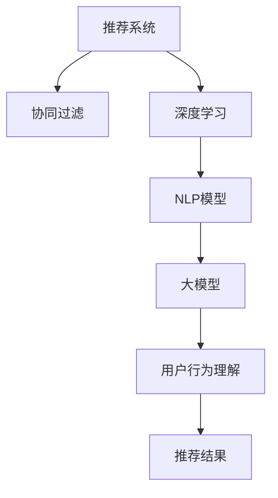

                 

# 大模型对推荐系统用户行为理解的深化

## 1. 背景介绍

随着电子商务、在线娱乐、内容推荐等领域的大数据应用日益增多，推荐系统成为了连接用户与内容的桥梁，极大地提升了用户体验和业务价值。传统的推荐系统主要基于协同过滤、基于内容的推荐等方法，但在个性化程度、实时性、多样性等方面仍存在不足。近年来，利用深度学习和自然语言处理技术的大规模预训练模型被引入推荐系统中，显著提高了推荐效果。

## 2. 核心概念与联系

### 2.1 核心概念概述

- **推荐系统**：利用用户行为数据或物品属性信息，自动发现用户偏好，为其推荐合适内容或商品的系统。
- **协同过滤**：基于用户行为或物品相似性推荐，分为基于用户的协同过滤和基于物品的协同过滤。
- **深度学习**：利用深度神经网络对复杂数据进行建模，能够自动发现数据特征，适应大规模推荐任务。
- **自然语言处理**：利用深度学习模型处理和理解自然语言，从文本数据中提取用户偏好信息。
- **大模型**：如BERT、GPT等大规模预训练语言模型，在NLP领域表现优异，具备丰富的语言知识和常识。

### 2.2 核心概念原理和架构的 Mermaid 流程图



## 3. 核心算法原理 & 具体操作步骤

### 3.1 算法原理概述

利用深度学习和自然语言处理技术的大规模预训练模型，可以更深入地理解用户行为，为其推荐更符合其兴趣的内容。具体而言，大模型通过预训练学习到丰富的语言表示，可以在对用户评论、评分、浏览记录等文本数据进行微调后，提取更深刻的语义特征，用于指导推荐结果。

### 3.2 算法步骤详解

1. **数据准备**：收集用户行为数据，包括点击、购买、评分、评论等，预处理为适合模型输入的格式。
2. **模型选择**：选择合适的预训练语言模型，如BERT、GPT等。
3. **任务适配**：在预训练模型的顶层添加合适的输出层和损失函数，根据任务类型选择分类、回归等任务。
4. **微调训练**：使用标注数据对模型进行微调，最小化经验风险，提升模型对用户行为的预测能力。
5. **推荐结果**：利用微调后的模型对新数据进行推理，生成推荐结果。

### 3.3 算法优缺点

#### 优点：
- 能处理非结构化文本数据，提取更深的语义特征。
- 具备更强的泛化能力和鲁棒性，能够适应不同用户和内容。
- 能够处理多种推荐任务，如内容推荐、协同过滤、个性化推荐等。

#### 缺点：
- 对标注数据需求高，需要大量标注样本。
- 计算资源消耗大，微调和推理过程较慢。
- 模型复杂度大，解释性较差。

### 3.4 算法应用领域

大模型在推荐系统中有着广泛的应用场景，如电商推荐、内容推荐、广告推荐等。通过对用户行为数据的理解和分析，大模型可以提供更个性化、多样化的推荐结果，提升用户体验和业务效果。

## 4. 数学模型和公式 & 详细讲解 & 举例说明

### 4.1 数学模型构建

假设用户行为数据为 $D=\{(x_i,y_i)\}_{i=1}^N$，其中 $x_i$ 为输入（如文本评论），$y_i$ 为输出（如评分、是否点击）。预训练语言模型为 $M_{\theta}$，输出层为 $y=f_{\theta}(x)$，损失函数为 $\mathcal{L}(y,f_{\theta}(x))$。微调的目标是最小化经验风险：

$$
\theta^* = \mathop{\arg\min}_{\theta} \frac{1}{N}\sum_{i=1}^N \mathcal{L}(y_i,f_{\theta}(x_i))
$$

### 4.2 公式推导过程

以二分类任务为例，假设用户评论为输入，模型预测其是否购买商品，输出层为 sigmoid 函数：

$$
f_{\theta}(x) = \frac{1}{1+\exp(-\theta^T x)}
$$

损失函数为交叉熵：

$$
\mathcal{L}(y,f_{\theta}(x)) = -y\log f_{\theta}(x) - (1-y)\log (1-f_{\theta}(x))
$$

微调的优化目标是：

$$
\theta^* = \mathop{\arg\min}_{\theta} \frac{1}{N}\sum_{i=1}^N [-y_i\log f_{\theta}(x_i) - (1-y_i)\log (1-f_{\theta}(x_i))]
$$

### 4.3 案例分析与讲解

假设某电商网站用户对商品进行了评价，使用BERT模型进行微调。首先，将用户评价作为输入，将评分（0-1）作为输出，定义任务为二分类。接着，在微调前将输入转换为BERT模型所需的格式，使用AdamW优化器进行优化。

## 5. 项目实践：代码实例和详细解释说明

### 5.1 开发环境搭建

- 安装 Python 3.8 以上版本
- 安装 TensorFlow 2.x 和 PyTorch 1.7 以上版本
- 安装 BERT 模型和相关库

```bash
pip install tensorflow >=2.4.1
pip install torch torchtext
pip install transformers
```

### 5.2 源代码详细实现

```python
import tensorflow as tf
import torch
from transformers import BertTokenizer, BertForSequenceClassification

# 设置设备
device = 'gpu' if tf.config.list_physical_devices('GPU') else 'cpu'
tf.config.enable_eager_execution(device=device)

# 加载数据
train_data = ...
train_labels = ...

# 加载预训练模型和分词器
tokenizer = BertTokenizer.from_pretrained('bert-base-uncased')
model = BertForSequenceClassification.from_pretrained('bert-base-uncased', num_labels=2)

# 数据处理
def encode_data(data, labels):
    inputs = tokenizer(data, return_tensors='tf', padding='max_length', truncation=True)
    input_ids = inputs['input_ids']
    attention_mask = inputs['attention_mask']
    return input_ids, attention_mask, labels

# 编码数据
input_ids, attention_mask, labels = encode_data(train_data, train_labels)

# 模型输入
inputs = tf.data.Dataset.from_tensor_slices((input_ids, attention_mask, labels))
inputs = inputs.shuffle(buffer_size=1000).batch(batch_size=32)

# 模型训练
optimizer = tf.keras.optimizers.AdamW(learning_rate=5e-5)
for epoch in range(num_epochs):
    for batch in inputs:
        with tf.GradientTape() as tape:
            outputs = model(batch[0], attention_mask=batch[1])
            loss = tf.keras.losses.BinaryCrossentropy()(target=batch[2], y_pred=outputs.logits)
        gradients = tape.gradient(loss, model.trainable_variables)
        optimizer.apply_gradients(zip(gradients, model.trainable_variables))
```

### 5.3 代码解读与分析

- 首先，我们使用 TensorFlow 和 PyTorch 来搭建推荐系统的大模型微调框架。
- 数据处理函数 `encode_data` 将用户行为数据转换为模型所需的格式。
- 加载预训练 BERT 模型和分词器。
- 定义数据集并使用 AdamW 优化器进行训练。

## 6. 实际应用场景

### 6.1 电商推荐

电商推荐系统需要对用户购买行为进行深入理解，推荐用户可能感兴趣的商品。利用大模型对用户评价和评分进行微调，可以捕捉到用户对商品的情感倾向和具体描述，生成更符合用户兴趣的推荐列表。

### 6.2 内容推荐

内容推荐系统需要对用户评论和评分进行语义理解，推荐与用户喜好相关的内容。大模型可以提取评论中的关键语义特征，通过多维度分析生成个性化的推荐结果。

### 6.3 广告推荐

广告推荐系统需要对用户搜索历史和点击行为进行理解，推荐用户可能感兴趣的广告。大模型可以处理用户的查询和点击数据，提取文本语义特征，提升广告投放的精准度。

## 7. 工具和资源推荐

### 7.1 学习资源推荐

- [《深度学习与推荐系统》](https://book.douban.com/subject/26786718/)
- [《推荐系统》](https://book.douban.com/subject/25700895/)
- [TensorFlow 官方文档](https://www.tensorflow.org/)

### 7.2 开发工具推荐

- TensorFlow：深度学习框架，适合大规模推荐系统的构建。
- PyTorch：灵活高效的深度学习框架，适合研究型项目开发。
- Transformers：NLP任务处理库，提供预训练模型和任务适配层。

### 7.3 相关论文推荐

- [《深度学习与推荐系统》](https://www.pnas.org/content/112/23/7432.short)
- [《深度学习在推荐系统中的应用》](https://arxiv.org/abs/1709.06396)

## 8. 总结：未来发展趋势与挑战

### 8.1 研究成果总结

大模型在推荐系统中的应用，极大地提升了推荐系统的个性化和泛化能力。通过深入理解用户行为，推荐系统能够提供更符合用户兴趣的内容，提升用户体验和业务价值。

### 8.2 未来发展趋势

- 大模型的自监督预训练和微调结合将更加紧密。利用无监督和半监督学习方法，在更少标注数据下提升推荐效果。
- 推荐系统的实时性和多样性将进一步增强。基于时间序列和大模型联合推理，提供更精准和个性化的推荐。
- 推荐系统将与更多领域的知识进行融合，如医药、法律等，提升知识整合能力。

### 8.3 面临的挑战

- 数据隐私和安全问题。推荐系统需要处理大量用户数据，数据隐私和安全问题不容忽视。
- 计算资源和硬件成本。大模型需要大量计算资源，硬件成本较高。
- 模型的可解释性。大模型复杂度大，解释性较差，需要更多研究来提升可解释性。

### 8.4 研究展望

未来，推荐系统将朝着更加智能化、个性化和多样化的方向发展。大模型将在推荐系统中扮演更加重要的角色，提供更精准的推荐结果。同时，推荐系统需要更多与外部知识库和规则库的协同，提升系统的知识整合能力。

## 9. 附录：常见问题与解答

**Q1: 大模型对推荐系统的用户行为理解有何优势？**

A: 大模型通过预训练学习到丰富的语言知识，可以深入理解用户行为文本数据，提取更深刻的语义特征。通过微调，大模型可以更好地捕捉用户兴趣和情感倾向，提升推荐系统的个性化和准确性。

**Q2: 微调过程中如何缓解过拟合问题？**

A: 过拟合是微调面临的主要挑战，尤其是在标注数据不足的情况下。常见的缓解策略包括数据增强、正则化、对抗训练等。

**Q3: 推荐系统如何与外部知识库进行融合？**

A: 推荐系统可以通过引入外部知识库，提升模型的知识整合能力。例如，结合知识图谱、逻辑规则等，进一步提升推荐结果的准确性和多样性。

**Q4: 如何提升推荐系统的实时性？**

A: 推荐系统需要结合时间序列分析和大模型联合推理，提升实时性。例如，通过在线增量学习，动态更新模型参数，适应用户兴趣的变化。

---

作者：禅与计算机程序设计艺术 / Zen and the Art of Computer Programming

