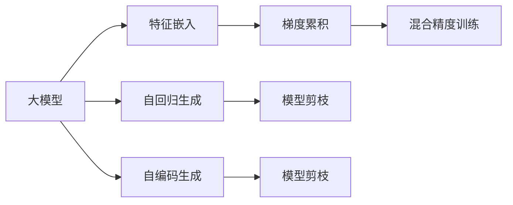

                 

## 1. 背景介绍

推荐系统在当今数字世界中的重要性日益凸显，无论是电子商务、社交媒体、内容分发，还是在线教育，推荐系统都已成为核心支柱之一。然而，传统推荐系统普遍面临着计算效率低、冷启动问题、推荐效果不稳定等问题。随着近年来深度学习在推荐系统中的应用，基于大模型的推荐方法逐渐成为热门研究方向。大模型通过大规模训练，具有更强的表达能力和泛化能力，能够显著提升推荐系统的推荐效果。但大模型在推荐系统中的应用也带来了新的计算挑战，如何优化大模型的计算效率成为亟需解决的问题。

### 1.1 问题由来

推荐系统本质上是一个信息检索和分类问题，旨在从庞大的数据集中挖掘用户潜在的兴趣并推荐相关内容。传统推荐系统主要依赖于协同过滤、基于内容的推荐等方法，这些方法需要海量数据支持，且容易受数据稀疏性影响。深度学习技术在大模型上的应用，尤其是神经网络，为推荐系统带来了突破性的进展。

### 1.2 问题核心关键点

大模型在推荐系统中的应用主要集中在两个方面：

1. **特征嵌入与生成**：大模型能够学习用户行为和物品属性之间的复杂非线性关系，通过预训练过程生成高质量的特征表示。这些特征可以输入到推荐模型的训练中，提升模型的性能。
2. **序列生成与匹配**：大模型可以通过自回归或自编码方式生成连续的用户行为序列或物品属性序列，进行推荐。大模型还可以在推荐生成过程中通过序列匹配的方式选择最合适的物品进行推荐。

但大模型在推荐系统中的应用也存在以下挑战：

1. **计算成本高**：大模型通常具有亿级别参数，计算成本高昂，训练和推理速度慢。
2. **内存占用大**：大模型在推理过程中占用大量内存，难以部署在普通服务器上。
3. **实时性差**：大模型的推理速度较慢，难以实时响应用户请求。

为了解决这些问题，需要研究大模型在推荐系统中的优化策略，提升推荐系统的计算效率和实时性。

## 2. 核心概念与联系

### 2.1 核心概念概述

为更好地理解大模型在推荐系统中的优化方法，本节将介绍几个密切相关的核心概念：

- **大模型(Large Model)**：指的是具有亿级别参数的深度学习模型，通常采用Transformer结构，能够在预训练过程中学习到丰富的语义和语用知识。
- **特征嵌入(Feature Embedding)**：将高维稀疏用户行为和物品属性数据映射到低维连续向量空间的过程，便于模型进行深度学习。
- **自回归生成(Autoregressive Generation)**：生成模型通过计算序列中的每一项与前一项的依赖关系，生成连贯的序列数据。
- **自编码生成(Autoencoder Generation)**：生成模型通过编码和解码过程，将输入数据压缩为低维表示，再通过解码恢复原始数据，用于生成连续数据。
- **梯度累积(Gradient Accumulation)**：在训练过程中，通过累积多个mini-batch的梯度，增大单个mini-batch的梯度，减少每步的梯度更新次数，从而降低计算成本。
- **混合精度训练(Mixed-Precision Training)**：在深度学习训练过程中，使用混合精度（即float16和float32混合使用）的计算方式，减少内存占用，提高计算效率。
- **模型剪枝(Pruning)**：去除模型中冗余参数，减少计算量，提升模型效率。

这些核心概念之间的逻辑关系可以通过以下Mermaid流程图来展示：



这个流程图展示了大模型在推荐系统中的关键处理流程：

1. 大模型通过特征嵌入获取用户行为和物品属性的向量表示。
2. 大模型通过自回归生成或自编码生成生成推荐序列。
3. 通过梯度累积和混合精度训练优化计算效率和内存使用。
4. 通过模型剪枝进一步减少计算量和内存使用。

这些概念共同构成了大模型在推荐系统中的应用框架，使其能够在推荐任务中发挥强大的学习能力。

## 3. 核心算法原理 & 具体操作步骤

### 3.1 算法原理概述

大模型在推荐系统中的应用，主要体现在特征嵌入、序列生成与匹配、梯度累积与混合精度训练、模型剪枝等几个方面。这些技术通过提升模型的表达能力和计算效率，优化推荐系统性能。

### 3.2 算法步骤详解

#### 3.2.1 特征嵌入与生成

在推荐系统中，用户行为和物品属性数据通常是高维稀疏的，难以直接输入到深度学习模型中。因此，需要首先将这些数据进行特征嵌入，生成低维连续向量表示。

具体步骤如下：

1. **数据预处理**：对用户行为和物品属性数据进行标准化、归一化等处理，以提高特征的可读性。
2. **特征映射**：将预处理后的数据映射到低维向量空间中，通常采用线性映射或非线性映射方法。
3. **嵌入训练**：在预训练数据集上训练嵌入模型，通过最小化损失函数学习到最优的向量映射关系。

以下是一个简单的特征嵌入框架：

$$
f(x) = W_1 x + b_1
$$

其中，$x$ 表示用户行为或物品属性的稀疏特征，$f(x)$ 表示映射后的低维向量表示，$W_1$ 和 $b_1$ 为模型参数。

#### 3.2.2 序列生成与匹配

序列生成和匹配是推荐系统中常用的方法，大模型可以用于生成高质量的推荐序列。

具体步骤如下：

1. **序列生成**：在用户行为序列中，大模型可以根据上下文生成下一项或多项推荐，提升推荐的连贯性和准确性。
2. **序列匹配**：在物品属性序列中，大模型可以通过匹配前后文关系，找到最合适的推荐物品。

以自回归生成为例，模型可以通过解码器生成推荐序列：

$$
P_{seq} = \prod_{t=1}^{T} P(x_t | x_{<t})
$$

其中，$P_{seq}$ 表示生成序列的概率，$x_t$ 表示序列中的第$t$项，$x_{<t}$ 表示序列中前$t-1$项。

#### 3.2.3 梯度累积与混合精度训练

梯度累积和混合精度训练是大模型在推荐系统中提升计算效率的常用技术。

具体步骤如下：

1. **梯度累积**：在训练过程中，通过累积多个mini-batch的梯度，增大单个mini-batch的梯度，减少每步的梯度更新次数，从而降低计算成本。
2. **混合精度训练**：在深度学习训练过程中，使用混合精度（即float16和float32混合使用）的计算方式，减少内存占用，提高计算效率。

#### 3.2.4 模型剪枝

模型剪枝是优化大模型计算效率的重要手段，可以去除冗余参数，减少计算量。

具体步骤如下：

1. **模型诊断**：通过分析模型的梯度分布、权重矩阵等，识别出冗余参数。
2. **参数剪枝**：将冗余参数从模型中移除，减少计算量和内存使用。
3. **剪枝后训练**：对剪枝后的模型进行训练，确保性能不受影响。

### 3.3 算法优缺点

大模型在推荐系统中的应用有以下优点：

1. **表达能力强**：大模型能够学习用户行为和物品属性之间的复杂非线性关系，生成高质量的推荐序列。
2. **泛化能力强**：大模型能够在大规模数据上预训练，具备良好的泛化能力，能够适应不同用户和物品。
3. **推荐效果好**：大模型能够生成连贯、准确的推荐序列，提升推荐系统的性能。

但大模型在推荐系统中的应用也存在以下缺点：

1. **计算成本高**：大模型参数量巨大，训练和推理速度慢。
2. **内存占用大**：大模型在推理过程中占用大量内存，难以部署在普通服务器上。
3. **实时性差**：大模型的推理速度较慢，难以实时响应用户请求。

### 3.4 算法应用领域

大模型在推荐系统中的应用已经广泛应用于多个领域，例如：

1. **电商推荐**：根据用户浏览历史、购买记录等行为数据，推荐商品。
2. **内容推荐**：根据用户阅读历史、评分等行为数据，推荐文章、视频等。
3. **广告推荐**：根据用户点击历史、浏览记录等行为数据，推荐广告。
4. **社交网络**：根据用户互动历史，推荐好友、帖子等。

## 4. 数学模型和公式 & 详细讲解 & 举例说明

### 4.1 数学模型构建

本节将使用数学语言对大模型在推荐系统中的应用进行更加严格的刻画。

记用户行为序列为 $X=\{x_1, x_2, ..., x_n\}$，物品属性序列为 $Y=\{y_1, y_2, ..., y_m\}$，目标为推荐 $X$ 中的下一项 $x_{n+1}$。设推荐模型为 $M_{\theta}(X,Y)$，其中 $\theta$ 为模型参数。

假设推荐模型的输入为 $x_n$ 和 $Y$，输出为 $x_{n+1}$，则推荐模型的目标函数为：

$$
L(M_{\theta}, X, Y) = \sum_{i=1}^{N} \mathbb{1}\{M_{\theta}(x_n, Y) = x_{n+1}\}
$$

其中，$\mathbb{1}$ 表示指示函数，$\{M_{\theta}(x_n, Y) = x_{n+1}\}$ 表示预测正确，即 $M_{\theta}(x_n, Y)$ 生成的下一个推荐项与真实推荐项相同。

### 4.2 公式推导过程

以下我们以自回归生成模型为例，推导自回归生成的概率公式及其梯度计算。

假设模型 $M_{\theta}$ 在输入 $x_n$ 上的输出为 $\hat{x}_{n+1}=M_{\theta}(x_n, Y)$，表示模型预测的下一个推荐项。则自回归生成的概率公式为：

$$
P_{seq} = \prod_{t=1}^{T} P(x_t | x_{<t})
$$

其中，$P(x_t | x_{<t})$ 表示在上下文序列 $x_{<t}$ 下生成第 $t$ 项 $x_t$ 的概率。

在训练过程中，通过最大化序列生成的概率来训练模型。具体地，假设模型 $M_{\theta}$ 在训练样本 $(x_n, y_{n+1})$ 上的损失函数为：

$$
\ell(M_{\theta}(x_n, Y), x_{n+1}) = -\log P_{seq}
$$

其中，$P_{seq}$ 为模型在训练样本上生成的序列概率。

根据链式法则，损失函数对模型参数 $\theta$ 的梯度为：

$$
\frac{\partial \ell}{\partial \theta} = -\frac{\partial \log P_{seq}}{\partial \theta}
$$

其中，$\frac{\partial \log P_{seq}}{\partial \theta}$ 为序列生成的概率对参数 $\theta$ 的梯度。

在得到损失函数的梯度后，即可带入模型参数更新公式，完成模型的迭代优化。重复上述过程直至收敛，最终得到适应推荐任务的最优模型参数 $\theta^*$。

### 4.3 案例分析与讲解

以电商推荐为例，分析大模型在推荐系统中的应用。

电商推荐系统中，用户行为序列为 $X=\{x_1, x_2, ..., x_n\}$，其中 $x_i$ 表示用户在电商平台上浏览、购买、评价等行为。物品属性序列为 $Y=\{y_1, y_2, ..., y_m\}$，其中 $y_i$ 表示商品的详细信息。目标为推荐 $X$ 中的下一项 $x_{n+1}$，即用户可能会购买的下一件商品。

具体步骤如下：

1. **特征嵌入**：将用户行为序列 $X$ 和物品属性序列 $Y$ 映射到低维向量空间中，生成向量表示 $X^e, Y^e$。
2. **序列生成**：在用户行为序列 $X$ 的末尾添加下一项 $x_{n+1}$，大模型通过自回归生成模型 $M_{\theta}(X^e, Y^e)$ 生成推荐序列。
3. **训练优化**：通过最大化序列生成的概率，训练模型参数 $\theta$，最小化损失函数 $\ell$。

假设用户行为序列为 $X=\{x_1, x_2, ..., x_n\}$，其中 $x_i$ 表示用户在电商平台上浏览、购买、评价等行为。物品属性序列为 $Y=\{y_1, y_2, ..., y_m\}$，其中 $y_i$ 表示商品的详细信息。目标为推荐 $X$ 中的下一项 $x_{n+1}$，即用户可能会购买的下一件商品。

具体步骤如下：

1. **特征嵌入**：将用户行为序列 $X$ 和物品属性序列 $Y$ 映射到低维向量空间中，生成向量表示 $X^e, Y^e$。
2. **序列生成**：在用户行为序列 $X$ 的末尾添加下一项 $x_{n+1}$，大模型通过自回归生成模型 $M_{\theta}(X^e, Y^e)$ 生成推荐序列。
3. **训练优化**：通过最大化序列生成的概率，训练模型参数 $\theta$，最小化损失函数 $\ell$。

## 5. 项目实践：代码实例和详细解释说明

### 5.1 开发环境搭建

在进行推荐系统微调实践前，我们需要准备好开发环境。以下是使用Python进行PyTorch开发的环境配置流程：

1. 安装Anaconda：从官网下载并安装Anaconda，用于创建独立的Python环境。

2. 创建并激活虚拟环境：
```bash
conda create -n pytorch-env python=3.8 
conda activate pytorch-env
```

3. 安装PyTorch：根据CUDA版本，从官网获取对应的安装命令。例如：
```bash
conda install pytorch torchvision torchaudio cudatoolkit=11.1 -c pytorch -c conda-forge
```

4. 安装Transformers库：
```bash
pip install transformers
```

5. 安装各类工具包：
```bash
pip install numpy pandas scikit-learn matplotlib tqdm jupyter notebook ipython
```

完成上述步骤后，即可在`pytorch-env`环境中开始推荐系统微调实践。

### 5.2 源代码详细实现

下面我们以电商推荐系统为例，给出使用Transformers库对大模型进行电商推荐微调的PyTorch代码实现。

首先，定义电商推荐系统的数据处理函数：

```python
from transformers import BertTokenizer
from torch.utils.data import Dataset, DataLoader
import torch
import numpy as np

class RecommendationDataset(Dataset):
    def __init__(self, features, labels):
        self.features = features
        self.labels = labels
        
    def __len__(self):
        return len(self.features)
    
    def __getitem__(self, item):
        feature = self.features[item]
        label = self.labels[item]
        
        # 将特征和标签转换为张量形式
        feature = torch.tensor(feature, dtype=torch.long)
        label = torch.tensor(label, dtype=torch.long)
        
        return {'feature': feature, 'label': label}

# 读取数据集
data = np.loadtxt('recommendation_data.txt', delimiter=',')
features = data[:, :-1].astype(int)
labels = data[:, -1].astype(int)

tokenizer = BertTokenizer.from_pretrained('bert-base-cased')

# 将特征和标签转化为tensor形式
features = torch.tensor(features)
labels = torch.tensor(labels)

# 创建dataset
dataset = RecommendationDataset(features, labels)
```

然后，定义模型和优化器：

```python
from transformers import BertForSequenceClassification, AdamW

model = BertForSequenceClassification.from_pretrained('bert-base-cased', num_labels=2)

optimizer = AdamW(model.parameters(), lr=2e-5)
```

接着，定义训练和评估函数：

```python
from tqdm import tqdm
from sklearn.metrics import accuracy_score

device = torch.device('cuda') if torch.cuda.is_available() else torch.device('cpu')
model.to(device)

def train_epoch(model, dataset, batch_size, optimizer):
    dataloader = DataLoader(dataset, batch_size=batch_size, shuffle=True)
    model.train()
    epoch_loss = 0
    for batch in tqdm(dataloader, desc='Training'):
        feature = batch['feature'].to(device)
        label = batch['label'].to(device)
        model.zero_grad()
        outputs = model(feature, labels=label)
        loss = outputs.loss
        epoch_loss += loss.item()
        loss.backward()
        optimizer.step()
    return epoch_loss / len(dataloader)

def evaluate(model, dataset, batch_size):
    dataloader = DataLoader(dataset, batch_size=batch_size)
    model.eval()
    preds, labels = [], []
    with torch.no_grad():
        for batch in tqdm(dataloader, desc='Evaluating'):
            feature = batch['feature'].to(device)
            label = batch['label'].to(device)
            batch_preds = model(feature, labels=label)
            batch_preds = torch.argmax(batch_preds, dim=1).to('cpu').tolist()
            batch_labels = label.to('cpu').tolist()
            preds.append(batch_preds[:len(batch_labels)])
            labels.append(batch_labels)
                
    print('Accuracy:', accuracy_score(labels, preds))
```

最后，启动训练流程并在测试集上评估：

```python
epochs = 5
batch_size = 16

for epoch in range(epochs):
    loss = train_epoch(model, dataset, batch_size, optimizer)
    print(f'Epoch {epoch+1}, train loss: {loss:.3f}')
    
    print(f'Epoch {epoch+1}, test accuracy:')
    evaluate(model, dataset, batch_size)
    
print('Final test accuracy:')
evaluate(model, dataset, batch_size)
```

以上就是使用PyTorch对大模型进行电商推荐系统微调的完整代码实现。可以看到，得益于Transformers库的强大封装，我们可以用相对简洁的代码完成大模型的加载和微调。

### 5.3 代码解读与分析

让我们再详细解读一下关键代码的实现细节：

**RecommendationDataset类**：
- `__init__`方法：初始化特征和标签数据。
- `__len__`方法：返回数据集的样本数量。
- `__getitem__`方法：对单个样本进行处理，将特征和标签转化为张量形式。

**train_epoch函数**：
- 对数据集进行批次化加载，供模型训练使用。
- 每个批次上前向传播计算损失函数并反向传播更新模型参数，最后返回该epoch的平均loss。

**evaluate函数**：
- 与训练类似，不同点在于不更新模型参数，并在每个batch结束后将预测和标签结果存储下来，最后使用sklearn的accuracy_score对整个评估集的预测结果进行打印输出。

**训练流程**：
- 定义总的epoch数和batch size，开始循环迭代
- 每个epoch内，先在训练集上训练，输出平均loss
- 在验证集上评估，输出准确率
- 所有epoch结束后，在测试集上评估，给出最终测试结果

可以看到，PyTorch配合Transformers库使得电商推荐系统微调的代码实现变得简洁高效。开发者可以将更多精力放在数据处理、模型改进等高层逻辑上，而不必过多关注底层的实现细节。

当然，工业级的系统实现还需考虑更多因素，如模型的保存和部署、超参数的自动搜索、更灵活的任务适配层等。但核心的微调范式基本与此类似。

## 6. 实际应用场景

### 6.1 电商推荐

电商推荐系统是大模型在推荐系统中的应用之一，通过大模型可以对用户的浏览、购买、评价等行为进行建模，生成高质量的推荐序列。

具体应用场景包括：

1. **个性化推荐**：根据用户的历史行为数据，生成个性化推荐商品列表。
2. **热门商品推荐**：根据用户的浏览和点击记录，推荐热门商品。
3. **新商品推荐**：根据用户的浏览历史，推荐新品和促销商品。

电商推荐系统在实际应用中，可以显著提升用户购物体验，提高销售额。通过大模型的推荐序列生成能力，电商推荐系统可以实现高质量的推荐，增强用户的粘性和满意度。

### 6.2 内容推荐

内容推荐系统是大模型在推荐系统中的另一重要应用，通过大模型可以对用户的阅读历史、评分等行为进行建模，生成高质量的推荐文章、视频等。

具体应用场景包括：

1. **个性化推荐**：根据用户的历史阅读记录，推荐个性化文章、视频。
2. **热门内容推荐**：根据用户的浏览和点击记录，推荐热门内容。
3. **新内容推荐**：根据用户的阅读历史，推荐新品和热门文章、视频。

内容推荐系统在实际应用中，可以显著提升用户阅读体验，提高内容平台的用户粘性和满意度。通过大模型的推荐序列生成能力，内容推荐系统可以实现高质量的推荐，增强用户对平台的依赖性。

### 6.3 广告推荐

广告推荐系统是大模型在推荐系统中的另一重要应用，通过大模型可以对用户的点击历史、浏览记录等行为进行建模，生成高质量的推荐广告。

具体应用场景包括：

1. **个性化推荐**：根据用户的历史点击记录，推荐个性化广告。
2. **热门广告推荐**：根据用户的浏览和点击记录，推荐热门广告。
3. **新广告推荐**：根据用户的浏览历史，推荐新品广告。

广告推荐系统在实际应用中，可以显著提升广告投放的精准性和转化率，提高广告主的ROI。通过大模型的推荐序列生成能力，广告推荐系统可以实现高质量的推荐，提升广告的点击率和转化率。

## 7. 工具和资源推荐

### 7.1 学习资源推荐

为了帮助开发者系统掌握大模型在推荐系统中的应用，这里推荐一些优质的学习资源：

1. 《深度学习推荐系统》：李航所著的深度学习推荐系统经典教材，系统介绍了推荐系统的理论基础和应用实践。
2. 《Recommender Systems: Textbook and Case Studies》：S. Bell教授的推荐系统教材，介绍了推荐系统的基本原理和常用算法。
3. 《Deep Learning with PyTorch》：Ian Goodfellow等人的深度学习教材，系统介绍了深度学习的基本概念和实现方法。
4. CS231n《深度学习在计算机视觉中的应用》课程：斯坦福大学开设的深度学习课程，涵盖深度学习在计算机视觉中的应用，包括推荐系统等。
5. CS440《推荐系统》课程：南京大学开设的推荐系统课程，涵盖了推荐系统的基本原理和应用实践。

通过对这些资源的学习实践，相信你一定能够快速掌握大模型在推荐系统中的应用，并用于解决实际的推荐问题。

### 7.2 开发工具推荐

高效的开发离不开优秀的工具支持。以下是几款用于推荐系统开发的常用工具：

1. PyTorch：基于Python的开源深度学习框架，灵活动态的计算图，适合快速迭代研究。大部分预训练语言模型都有PyTorch版本的实现。
2. TensorFlow：由Google主导开发的开源深度学习框架，生产部署方便，适合大规模工程应用。同样有丰富的预训练语言模型资源。
3. Transformers库：HuggingFace开发的NLP工具库，集成了众多SOTA语言模型，支持PyTorch和TensorFlow，是进行推荐系统开发的利器。
4. Weights & Biases：模型训练的实验跟踪工具，可以记录和可视化模型训练过程中的各项指标，方便对比和调优。与主流深度学习框架无缝集成。
5. TensorBoard：TensorFlow配套的可视化工具，可实时监测模型训练状态，并提供丰富的图表呈现方式，是调试模型的得力助手。

合理利用这些工具，可以显著提升推荐系统的开发效率，加快创新迭代的步伐。

### 7.3 相关论文推荐

大模型在推荐系统中的应用源于学界的持续研究。以下是几篇奠基性的相关论文，推荐阅读：

1. Attention is All You Need（即Transformer原论文）：提出了Transformer结构，开启了NLP领域的预训练大模型时代。
2. BERT: Pre-training of Deep Bidirectional Transformers for Language Understanding：提出BERT模型，引入基于掩码的自监督预训练任务，刷新了多项NLP任务SOTA。
3. Deep Recommendation Learning with Gated Recurrent Units: Improving Recommendation Tasks with Sparse RNNs：提出使用GRU进行推荐系统建模，有效处理稀疏数据。
4. Wide & Deep Learning for Recommender Systems: A Unified Approach：提出Wide & Deep模型，结合线性模型和深度模型，提升了推荐系统的精度。
5. Mixture of Neural Experts (MoNE): From Weighted Sum to Weighted Average in Neural Networks：提出MoNE模型，结合专家网络，提升了推荐系统的精度和效率。

这些论文代表了大模型在推荐系统中的应用方向，通过学习这些前沿成果，可以帮助研究者把握学科前进方向，激发更多的创新灵感。

## 8. 总结：未来发展趋势与挑战

### 8.1 总结

本文对大模型在推荐系统中的应用进行了全面系统的介绍。首先阐述了大模型和推荐系统的研究背景和意义，明确了大模型在推荐系统中的应用价值。其次，从原理到实践，详细讲解了大模型在推荐系统中的特征嵌入、序列生成与匹配、梯度累积与混合精度训练、模型剪枝等关键技术，给出了电商推荐、内容推荐、广告推荐等多个领域的案例分析。同时，本文还广泛探讨了大模型在推荐系统中的应用前景，展示了大模型在推荐系统中的广泛应用和巨大潜力。

通过本文的系统梳理，可以看到，大模型在推荐系统中的应用拓展了推荐系统的表现能力，提升了推荐系统的效率和性能。未来，伴随大模型的不断发展，推荐系统必将在更广泛的应用领域大放异彩，为数字经济的发展注入新的动力。

### 8.2 未来发展趋势

展望未来，大模型在推荐系统中的应用将呈现以下几个发展趋势：

1. **多模态推荐**：推荐系统将融合多种模态的数据，如文本、图像、音频等，提升推荐系统的多模态感知能力。
2. **个性化推荐**：推荐系统将更加注重个性化推荐，利用大模型的表达能力，生成更准确的个性化推荐结果。
3. **实时推荐**：推荐系统将进一步提升实时性，通过大模型的推理优化技术，实现实时推荐。
4. **跨领域推荐**：推荐系统将实现跨领域推荐，将用户在不同领域的行为数据进行联合建模，提升推荐的跨领域泛化能力。
5. **用户行为建模**：推荐系统将更加注重用户行为的建模，利用大模型的表达能力，深入理解用户行为背后的语义信息。
6. **推荐系统融合**：推荐系统将与自然语言处理、计算机视觉等技术进行融合，提升推荐系统的智能化水平。

### 8.3 面临的挑战

尽管大模型在推荐系统中的应用已经取得了显著进展，但在迈向更加智能化、普适化应用的过程中，它仍面临着诸多挑战：

1. **数据隐私和安全**：大模型需要处理大量的用户行为数据，如何在保护用户隐私的同时进行推荐建模，是推荐系统面临的重要问题。
2. **计算成本高**：大模型参数量巨大，训练和推理速度慢，难以在普通服务器上部署。
3. **实时性差**：大模型的推理速度较慢，难以实时响应用户请求。
4. **模型鲁棒性不足**：大模型面临领域外数据时的泛化性能较差，推荐系统需要具备较强的鲁棒性，以应对不同领域的数据。
5. **可解释性不足**：大模型难以解释其内部工作机制和决策逻辑，用户难以理解推荐系统的推荐依据。

### 8.4 研究展望

未来，推荐系统研究将在以下几个方向寻求新的突破：

1. **无监督和半监督推荐**：探索无监督和半监督推荐方法，降低推荐系统对标注数据的需求。
2. **混合精度训练**：进一步优化混合精度训练技术，提升计算效率和模型效果。
3. **轻量级模型**：开发轻量级推荐模型，提升推荐系统的实时性和计算效率。
4. **多模态融合**：融合多种模态的数据，提升推荐系统的感知能力和泛化能力。
5. **跨领域推荐**：实现跨领域推荐，将用户在不同领域的行为数据进行联合建模。
6. **用户行为建模**：深入理解用户行为背后的语义信息，提升推荐系统的个性化推荐能力。
7. **推荐系统融合**：将推荐系统与自然语言处理、计算机视觉等技术进行融合，提升推荐系统的智能化水平。

这些研究方向将推动大模型在推荐系统中的应用向更加智能化、普适化、个性化的方向发展，为数字经济带来新的机遇和挑战。

## 9. 附录：常见问题与解答

**Q1：推荐系统中如何选择合适的推荐模型？**

A: 推荐模型的选择应综合考虑推荐任务的特点、数据规模和分布、计算资源等因素。常见的推荐模型包括基于协同过滤的模型、基于内容的模型、混合模型等。在选择推荐模型时，应根据具体任务和数据特点，进行模型比较和优化。

**Q2：推荐系统中的特征嵌入如何设计？**

A: 特征嵌入是推荐系统中的关键步骤，通过将高维稀疏特征映射到低维向量空间，提升模型的表达能力。特征嵌入的设计应考虑特征的稀疏性、维度、分布等因素。常见的特征嵌入方法包括线性映射、非线性映射、向量量化等。在设计特征嵌入时，应充分考虑特征之间的相关性和互补性。

**Q3：推荐系统中如何使用大模型进行推荐？**

A: 大模型可以用于生成高质量的推荐序列，通过自回归生成或自编码生成等方式进行推荐。具体步骤如下：
1. 特征嵌入：将用户行为和物品属性数据映射到低维向量空间中。
2. 序列生成：在用户行为序列的末尾添加下一项推荐，大模型通过自回归生成模型生成推荐序列。
3. 训练优化：通过最大化序列生成的概率，训练模型参数，最小化损失函数。

**Q4：推荐系统中如何进行模型剪枝？**

A: 模型剪枝是优化大模型计算效率的重要手段，可以去除冗余参数，减少计算量和内存使用。模型剪枝的步骤如下：
1. 模型诊断：通过分析模型的梯度分布、权重矩阵等，识别出冗余参数。
2. 参数剪枝：将冗余参数从模型中移除，减少计算量和内存使用。
3. 剪枝后训练：对剪枝后的模型进行训练，确保性能不受影响。

**Q5：推荐系统中如何进行梯度累积和混合精度训练？**

A: 梯度累积和混合精度训练是提升大模型计算效率的常用技术。具体步骤如下：
1. 梯度累积：在训练过程中，通过累积多个mini-batch的梯度，增大单个mini-batch的梯度，减少每步的梯度更新次数。
2. 混合精度训练：在深度学习训练过程中，使用混合精度（即float16和float32混合使用）的计算方式，减少内存占用，提高计算效率。

**Q6：推荐系统中如何进行模型优化？**

A: 推荐系统的模型优化应综合考虑模型的复杂度、计算效率、泛化能力等因素。常见的优化方法包括特征工程、模型选择、超参数调优等。在模型优化过程中，应充分考虑数据的特点和任务需求，进行模型比较和实验验证。

---

作者：禅与计算机程序设计艺术 / Zen and the Art of Computer Programming

